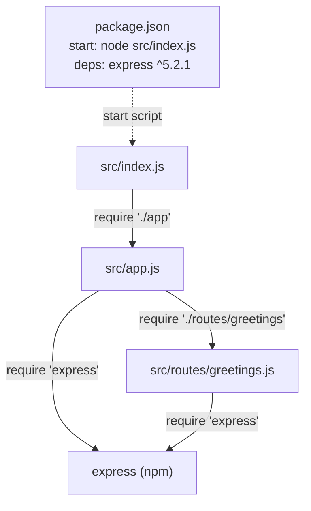

# Technical Specification

# 0. Agent Action Plan

## 0.1 Intent Clarification

This sub-section restates the user's request in precise technical terms, classifies the nature of the change, and surfaces the implicit requirements and one material discrepancy between the prompt's premise and the verified repository state.

> **User Request (verbatim):** "add feature to a existing product\
> this is a tutorial of node js server hosting one endpoint that returns the response \"Hello world\". Could you add expressjs into the project and add another endpoint that return the reponse of \"Good evening\"?"

### 0.1.1 Core Refactoring Objective

Based on the prompt, the Blitzy platform understands that the refactoring objective is to **introduce the Express.js web framework as the HTTP layer of the project and expose a second HTTP endpoint that returns the plain-text response "Good evening", while retaining the baseline endpoint that returns "Hello world".**

- **Refactoring type:** Tech stack migration (native Node.js `http` request handling → the Express.js framework), combined with a feature addition (the new "Good evening" endpoint) and a modularity improvement (router / app / server separation).
- **Target repository:** Same repository (in-place transformation); no migration to a new repository is requested or implied.

Refactoring goals, stated with enhanced clarity:

- Add `express` (current stable `^5.2.1`) as a runtime dependency of the project and adopt its application/router programming model as the server's request-handling mechanism.
- Establish and preserve the baseline route `GET /` returning the exact response body `Hello world`.
- Add the new route `GET /good-evening` returning the exact response body `Good evening`.
- Materialize the Node.js project manifest (`package.json`) with an `express` dependency and a runnable `start` script, plus supporting project-hygiene files.

**Critical repository-state finding (discrepancy resolved):** The prompt describes "a tutorial of node js server hosting one endpoint that returns … 'Hello world'", but that server **does not exist in the repository**. The verified repository root contains exactly one file, `README.md`, whose entire content is the single line `# Artifact1`, and zero subdirectories [README.md:L1]. The Technical Specification corroborates this: the repository declares no implementation language [Technical Specification §3.2.1] and no application frameworks or libraries [Technical Specification §3.3.1], and records a file count of one with zero subdirectories and no code artifacts [Technical Specification §1.4.1]. Consequently, the introduction of Express cannot be a pure in-place rewrite of pre-existing code; it must be realized as **greenfield scaffolding** that materializes both the baseline "Hello world" endpoint the user believes already exists and the new "Good evening" endpoint. This interpretation is stated transparently rather than fabricating a non-existent server.

Implicit requirements surfaced from the request:

- Preserve the "Hello world" behavior (backward compatibility of the described baseline), so the migration is additive rather than destructive from the user's perspective.
- Keep the server runnable with a single conventional command (`npm start`).
- Return the response bodies exactly as written — `Hello world` and `Good evening` — with no additional decoration.
- Provide a `package.json` and a dependency lock so that `express` is installable and reproducible (a Node project cannot consume `express` without a manifest).

Ambiguities flagged and resolved with documented defaults (because the prompt does not specify them):

- **New endpoint path** — not specified by the user; resolved to `GET /good-evening` (kebab-case of the requested phrase).
- **Baseline endpoint path** — bound to `GET /` (the conventional root path for a "Hello world" tutorial).
- **Listening port** — not specified and no existing server to inherit from; resolved to `process.env.PORT || 3000`.
- **Module system** — resolved to CommonJS (`require`/`module.exports`), consistent with a plain Node.js tutorial.

### 0.1.2 Technical Interpretation

This refactoring translates to the following technical transformation strategy: stand up a minimal but idiomatic Express 5 application that separates the process bootstrap from the application definition and extracts the two greeting routes into a dedicated `express.Router` module, then declare the `express` dependency and runnable scripts in a new `package.json`. Because there is no source code to rewrite, the "current architecture" is an empty documentation stub and the "target architecture" is a small, conventional Express server.

| Dimension | Current State (verified) | Target State |
|-----------|--------------------------|--------------|
| HTTP layer | None — no server file exists [README.md:L1] | Express 5 application (`express` `^5.2.1`) |
| Request handling | None | Declarative routes via `express.Router` (`router.get`) |
| Endpoints | None | `GET /` → "Hello world"; `GET /good-evening` → "Good evening" |
| Entry / bootstrap | None | `src/index.js` binds the app to `process.env.PORT \|\| 3000` |
| Dependency manifest | None [Technical Specification §3.3.1] | `package.json` declaring `express`, a `start` script, and `engines` |
| Language / runtime | Markdown only; no language declared [Technical Specification §3.2.1] | JavaScript (CommonJS) on Node.js `>=18` |

Transformation rules governing the work:

- Realize each conceptual responsibility as its own module — bootstrap (`src/index.js`), application assembly (`src/app.js`), and routing (`src/routes/greetings.js`).
- Keep route handlers returning the exact static strings; introduce no controllers, services, or persistence (none are warranted for static greetings).
- Preserve byte-identical response bodies; the only permissible behavioral variance is the default `Content-Type` header introduced by Express's `res.send` (analyzed in §0.6).
- Treat `README.md` as the single existing artifact to UPDATE; every other file is a CREATE.


## 0.2 Scope Boundaries

This sub-section enumerates every file that will be created or modified and draws explicit boundaries around what will not be touched. Because the repository is an empty stub [README.md:L1], the in-scope set is small, finite, and listed explicitly; trailing wildcards are provided only where they generalize a directory the platform will populate.

### 0.2.1 Exhaustively In Scope

The following artifacts will be materialized in the repository root (all are CREATE except `README.md`, which is UPDATE):

- **Source transformations**
    - `src/index.js` — HTTP server bootstrap (binds the Express app to a port).
    - `src/app.js` — Express application factory (creates the app, mounts middleware and the router).
    - `src/routes/greetings.js` — `express.Router` defining `GET /` and `GET /good-evening`.
    - `src/**` — trailing pattern covering the source tree introduced above (the platform may add cohesive helper modules under `src/` only if strictly required to satisfy the two endpoints).
- **Dependency & manifest updates**
    - `package.json` — Node project manifest declaring `express` `^5.2.1`, a `start` script, and `engines.node >=18`.
    - `package-lock.json` — npm-generated lockfile pinning the resolved dependency tree.
- **Documentation updates**
    - `README.md` — UPDATE the existing stub (currently `# Artifact1` [README.md:L1]) to document the server, the two endpoints, prerequisites, and install/run instructions.
- **Project-hygiene files**
    - `.gitignore` — ignore `node_modules/`, npm debug logs, and `.env`.
- **Import corrections**
    - Not applicable to pre-existing files (no source code exists [Technical Specification §3.3.1]); the only `require` statements are the new ones introduced by the files above (catalogued in §0.4.2 and §0.5.2).
- **Rule-mandated files**
    - None. The user supplied no implementation rules, so no migration scripts, configuration files, or test fixtures are forced into scope by coding guidelines.

### 0.2.2 Explicitly Out of Scope

The following are intentionally excluded; none were requested by the user, and none are required to satisfy the two endpoints:

- `node_modules/` — installed dependency artifacts; produced by `npm install` and never committed (covered by `.gitignore`).
- Databases, persistence layers, and ORMs — none requested; the specification confirms no storage layer is declared [Technical Specification §1.2.1.3].
- Authentication, authorization, or identity/SSO integration — not requested.
- Frontend, UI, templating engines, or static asset pipelines — responses are plain text only.
- TypeScript migration or any transpilation/build toolchain — the request targets a plain JavaScript Node.js tutorial; the project remains CommonJS JavaScript.
- Automated test suites, test frameworks, and CI/CD pipelines — not requested (an optional manual smoke test is described in §0.9 for validation but is not a committed deliverable).
- Containerization (Dockerfiles), orchestration, and infrastructure-as-code — not requested.
- Controller / service / model layers — unnecessary for static greeting strings; noted only as an optional future extension.
- `.env` files and secrets management — no secrets are involved in returning static greetings.


## 0.3 Target Design

This sub-section defines the concrete target structure, the research that informed it, and the design patterns applied. The layout is deliberately small yet idiomatic so the tutorial demonstrates conventional Express organization without over-engineering.

### 0.3.1 Refactored Structure Planning

The target repository layout (all paths relative to the repository root):

```
Target (repository root):
.
├── package.json            (CREATE)  Node manifest: express ^5.2.1, "start" script, engines node>=18, main src/index.js
├── package-lock.json       (CREATE)  npm-generated lockfile pinning the resolved dependency tree
├── .gitignore              (CREATE)  node_modules/, npm-debug.log*, .env
├── README.md               (UPDATE)  retains "# Artifact1" + adds overview, endpoint table, install/run steps
└── src/
    ├── index.js            (CREATE)  bootstrap: require('./app'); app.listen(process.env.PORT || 3000)
    ├── app.js              (CREATE)  app factory: const app = express(); app.use('/', greetingsRouter); module.exports = app
    └── routes/
        └── greetings.js    (CREATE)  express.Router(): GET / -> "Hello world"; GET /good-evening -> "Good evening"
```

Representative (illustrative, 2–3 lines each) handler and bootstrap shapes:

```javascript
// src/routes/greetings.js
const router = require('express').Router();
router.get('/', (req, res) => res.send('Hello world'));
router.get('/good-evening', (req, res) => res.send('Good evening'));
module.exports = router;
```

```javascript
// src/index.js
const app = require('./app');
app.listen(process.env.PORT || 3000);
```

### 0.3.2 Web Search Research Conducted

The following research grounded the target design (Express community guidance and MDN):

- **Express project structure / route modularity** — As applications grow, keeping all routes in a single file becomes unmanageable, so <cite index="10-3,10-4">Express Router provides a way to modularize routes into separate files, apply middleware at different levels, and build clean, maintainable APIs</cite>. The two greeting routes are therefore extracted into `src/routes/greetings.js`.
- **App-vs-server separation** — The app and the HTTP server are two distinct concerns; <cite index="14-29,14-30">separating the app and server allows you to unit test your app without initializing the server</cite>. This justifies splitting `src/app.js` (exports the configured app) from `src/index.js` (binds the port).
- **Port configuration convention** — Community examples standardize on reading the port from the environment with a fallback (`process.env.PORT || 3000`).
- **Express 5 error semantics** — <cite index="15-15">Express 5 automatically catches and forwards exceptions that are thrown in synchronous code</cite>, so the synchronous static-string handlers need no custom error wrapping.
- **Express version currency** — The current stable release is <cite index="1-2">Express 5.2.1</cite>; Express 5.2 is the Express Technical Committee's endorsed production release for new Node.js backends, which sets the `^5.2.1` target.

### 0.3.3 Design Pattern Applications

- **Router pattern** — Routing logic lives in an `express.Router` module (`src/routes/greetings.js`) mounted by the app, rather than being declared inline on the application object; this keeps endpoint definitions cohesive and extensible.
- **Application factory** — `src/app.js` centralizes application creation, middleware registration, and route mounting, exporting a single configured `app` instance.
- **App / server separation** — `src/index.js` owns the process-level concern of binding the HTTP port; `src/app.js` is transport-agnostic and independently testable.
- **Configuration via environment** — The listening port is resolved from `process.env.PORT` with a `3000` fallback, avoiding hardcoded environment coupling.
- **Minimal middleware pipeline** — No body parser is added because both endpoints are `GET` requests returning static text; an optional 404/error-handling middleware is noted but not required given Express 5's synchronous exception forwarding.

### 0.3.4 User Interface Design

Not applicable. The deliverables are two plain-text HTTP endpoints with no graphical user interface, no component library, and no design system. No Figma frames or UI assets were provided, so there is no UI design surface and no "Design System Compliance" analysis to perform.


## 0.4 Transformation Mapping

This sub-section maps every target file to its source (where one exists), enumerates the cross-file dependencies introduced, and confirms the single-phase execution model.

### 0.4.1 File-by-File Transformation Plan

| Target File | Transformation | Source File | Key Changes |
|-------------|----------------|-------------|-------------|
| `package.json` | CREATE | — (no manifest exists [Technical Specification §3.3.1]) | New manifest: `name`/`version`/`description`, `main` = `src/index.js`, `scripts.start` = `node src/index.js`, `dependencies` = `{ "express": "^5.2.1" }`, `engines` = `{ "node": ">=18" }` |
| `package-lock.json` | CREATE | — (generated by `npm install`) | Lockfile pinning the fully resolved dependency tree for `express ^5.2.1` |
| `.gitignore` | CREATE | — | Ignore `node_modules/`, `npm-debug.log*`, `.env` |
| `README.md` | UPDATE | `README.md` [README.md:L1] | Keep the `# Artifact1` title; append project description, an endpoint table (`GET /` → "Hello world"; `GET /good-evening` → "Good evening"), prerequisites (Node `>=18`), and install (`npm install`) / run (`npm start`) instructions |
| `src/index.js` | CREATE | — | Bootstrap: `require('./app')`, resolve `PORT` from `process.env.PORT \|\| 3000`, call `app.listen(PORT)` |
| `src/app.js` | CREATE | — (REFERENCE: Express official routing docs / community best practices — external, not an in-repo file) | App factory: create the Express app, mount the greetings router via `app.use('/', router)`, export the configured `app` |
| `src/routes/greetings.js` | CREATE | — | `express.Router()` with `GET /` → `res.send('Hello world')` and `GET /good-evening` → `res.send('Good evening')`; export the router |

Every target file is mapped to a source. Only `README.md` has an in-repo source equivalent; all other targets are greenfield CREATE operations because no corresponding source exists in the repository. `src/app.js` lists a REFERENCE to the external Express documentation pattern (not an in-repo file) to indicate the structural template it follows.

### 0.4.2 Cross-File Dependencies

The new module/require graph (CommonJS):



Import / `require` statement changes:

- There are **no pre-existing import statements to rewrite** — the repository contains no source code [Technical Specification §3.3.1]. The prompt's "import correction" category therefore reduces to the set of new `require` statements introduced by the created files.
- New `require` statements (greenfield):
    - `src/index.js`: `const app = require('./app');`
    - `src/app.js`: `const express = require('express');` and `app.use('/', require('./routes/greetings'));`
    - `src/routes/greetings.js`: `const router = require('express').Router();`
- Configuration / external reference updates: only `README.md` references the new structure (documentation); no build, CI, or config files reference old module paths because none exist.

### 0.4.3 Wildcard Patterns

The in-scope file set is small and fully enumerated, so explicit paths are used in preference to wildcards for precision. Where a directory generalization is useful, only a **trailing** pattern is used:

- `src/**` — the source tree the platform will populate (entry, app factory, and routes module). No leading wildcard patterns are used.

### 0.4.4 One-Phase Execution

The entire transformation is executed by Blitzy in a **single phase**. All seven files — `package.json`, `package-lock.json`, `.gitignore`, `README.md`, `src/index.js`, `src/app.js`, and `src/routes/greetings.js` — are created or updated together; the work is not split across multiple phases.


## 0.5 Dependency Inventory

This sub-section captures the single dependency change introduced by the refactor, the runtime floor it implies, and the import-refactoring rules. The repository currently declares no dependencies of any kind [Technical Specification §3.3.1], so every entry below is an addition.

### 0.5.1 Key Packages

| Registry | Package | Version | Purpose |
|----------|---------|---------|---------|
| npm | `express` | `^5.2.1` | Web application framework providing the routing layer (`express.Router`), the middleware pipeline, and request/response helpers (`res.send`) for the HTTP server |

Runtime requirement:

| Runtime | Version | Rationale |
|---------|---------|-----------|
| Node.js | `>=18` | Required by Express 5 (which dropped support for Node < 18); declared in `package.json` `engines`. No Node version is pinned in the repository [Technical Specification §3.2.1], so `>=18` is the recommended floor |

The `express` version is verified against the npm registry, which lists the <cite index="1-2">latest version as 5.2.1</cite>; this is a real, installable version (not a placeholder). No other production dependencies are required — Express 5 bundles its own internals (router, body parsing, etc.), and the two static-text `GET` endpoints need nothing further. No `devDependencies` are introduced, since no test runner or linter was requested (`nodemon` is noted as an optional, out-of-scope developer convenience).

### 0.5.2 Dependency Updates and Import Refactoring

- **Module system:** CommonJS (`require` / `module.exports`), consistent with a plain Node.js tutorial; `package.json` does not set `"type": "module"`.
- **New imports only (no legacy imports to rewrite):**
    - `require('express')` — in `src/app.js` and `src/routes/greetings.js`.
    - `require('./app')` — in `src/index.js`.
    - `require('./routes/greetings')` — in `src/app.js`.
- **Files requiring import updates:** `src/**` — but only as the location of the *new* `require` statements above; there are no existing files whose imports must be transformed.

### 0.5.3 External Reference Updates

- **Manifest / build files:** `package.json` is created to declare `express` and the `start` script; `package-lock.json` is generated to lock the resolved tree. There is no `setup.py`, `pyproject.toml`, or pre-existing `package.json` to reconcile.
- **Configuration files:** none reference the new modules (none exist).
- **Documentation:** `README.md` is the only external reference that is updated, to describe the dependency, prerequisites, and run commands.
- **CI/CD:** none present and none introduced.


## 0.6 Migration Analysis: Native Node http to Express

Although the repository contains no server today [README.md:L1], the user's mental model is a native Node.js `http` tutorial server. This sub-section analyzes the cross-cutting concerns of expressing that conceptual server through Express so the scaffolded result matches user expectations and exposes the single notable behavioral difference.

### 0.6.1 Concept-to-Express Mapping

| Native `http` concern | Express equivalent | Notes |
|-----------------------|--------------------|-------|
| `http.createServer(handler).listen(port)` | `app.listen(port)` | Express's `app.listen` internally creates an `http.Server` wrapping the app; drop-in equivalent for the listening socket |
| Manual `if (req.url === '/') …` branching in one handler | `router.get('/', …)` + `router.get('/good-evening', …)` | Each manual branch becomes one declarative route |
| `res.writeHead(200, {'Content-Type':'text/plain'}); res.end('Hello world')` | `res.send('Hello world')` | `res.send` auto-sets status `200`, `Content-Length`, and `Content-Type` |
| Catch-all response for any path | Express default `404` for unmatched routes | Intentional behavioral tightening (see §0.6.2) |

### 0.6.2 Behavioral Considerations

- **Content-Type delta (the one notable difference):** A native tutorial typically sets `Content-Type: text/plain`, whereas Express `res.send(string)` defaults to `text/html; charset=utf-8`. The response **body is byte-identical** (`Hello world` / `Good evening`); only the header differs. If exact parity with a `text/plain` baseline is desired, the handlers can use `res.type('text/plain').send(...)`. For a greeting tutorial, the default `text/html` is acceptable; this delta is flagged for the implementing agent to decide explicitly.
- **Method and 404 semantics:** `router.get('/')` matches only HTTP `GET` on the exact path; any other path or method receives Express's default `404`. If the conceptual native server returned "Hello world" for *all* paths, that catch-all behavior is **intentionally not reproduced** — the baseline is bound specifically to `GET /`. This assumption is documented so it is a conscious decision, not an accident.
- **Port preservation:** There is no existing port to preserve (greenfield); the chosen default is `process.env.PORT || 3000`, flagged as a default rather than an inherited value.
- **Express 5 routing syntax:** Express 5 upgraded its path matching (path-to-regexp), changing wildcard/optional-parameter syntax. The literal paths `/` and `/good-evening` contain no special tokens and are therefore unaffected.
- **Error handling:** Express 5 forwards synchronous exceptions thrown in handlers automatically <cite index="15-15">Express 5 automatically catches and forwards exceptions that are thrown in synchronous code</cite>, which fully covers these static, synchronous handlers; no custom error middleware is required.

### 0.6.3 Ripple Effects

There are no repository-wide ripple effects. Because no source code, tests, configuration, or CI currently exist, there are no callers or references to the (nonexistent) old module paths that would need updating. The only documentation ripple is the `README.md` update described in §0.4.1.


## 0.7 Refactoring Rules and Constraints

The user supplied **no explicit implementation rules** (the rules input was empty). The constraints below are therefore **platform-inferred** from the prompt rather than user-mandated, and they govern how the refactor must behave.

### 0.7.1 Refactoring-Specific Rules (Inferred)

- **Preserve the baseline behavior:** the "Hello world" response must remain available after Express is introduced; the migration is additive from the user's perspective.
- **Preserve exact response bodies:** the responses must be the literal strings the user provided (see the User Examples below) with no extra punctuation, markup, or whitespace.
- **Keep the server runnable conventionally:** `npm install` followed by `npm start` must launch the server and serve both endpoints.
- **Do not expand scope:** introduce only what the two endpoints require — no persistence, auth, UI, tests, or build tooling (per §0.2.2).
- **Apply idiomatic Express structure:** use `express.Router` and app/server separation (per §0.3.3) rather than a single monolithic handler.

### 0.7.2 Special Instructions and Constraints

- **User Examples (preserved exactly as provided):**
    - User Example: `Hello world` (response of the existing/baseline endpoint).
    - User Example: `Good evening` (response of the new endpoint to be added).
- **Backward compatibility:** the baseline `GET /` → "Hello world" route is retained alongside the new route; no existing behavior is removed.
- **Migration target:** same repository, in-place; no new-repository migration.
- **Documented defaults for unspecified items** (carried from §0.1.1): new route path `GET /good-evening`; baseline path `GET /`; port `process.env.PORT || 3000`; CommonJS module system. These are reasonable defaults the implementing agent should adopt unless the user later specifies otherwise.
- **Web-search-informed conventions:** the route-modularity and app/server-separation conventions researched in §0.3.2 are to be followed.

### 0.7.3 Other User-Provided Rules

None. No additional rules, coding guidelines, or constraints were supplied for this project.


## 0.8 Attachments

No attachments were provided for this project.

- **Files:** None. The project contains no PDF, image, document, or data-file attachments.
- **Figma screens:** None. No Figma frames or URLs were supplied, and no component library or design system was referenced. Accordingly, no Figma Design Analysis and no Design System Compliance analysis apply to this refactor.
- **Referenced files / URLs:** The prompt cited no external reference or instruction files. The only documentation consulted for grounding is the repository's own `README.md` [README.md:L1] and the existing Technical Specification sections referenced inline throughout §0.1–§0.6.


## 0.9 Implementation Validation

This sub-section defines the criteria that determine whether the refactor is complete and correct. These are validation checks for the implementing agent, not committed test deliverables (test suites remain out of scope per §0.2.2).

### 0.9.1 Acceptance Criteria

- `package.json` exists at the repository root, declares `express` `^5.2.1` under `dependencies`, defines `scripts.start` = `node src/index.js`, and sets `engines.node` to `>=18`.
- `npm install` completes successfully and produces `package-lock.json` and a `node_modules/` directory containing `express` (version resolving to `5.2.x`).
- `npm start` boots the server without error and binds to `process.env.PORT || 3000`.
- `GET /` returns HTTP `200` with the response body exactly `Hello world`.
- `GET /good-evening` returns HTTP `200` with the response body exactly `Good evening`.
- The two routes are defined in `src/routes/greetings.js` via `express.Router`; `src/app.js` exports the configured app; `src/index.js` performs the `listen`.
- `README.md` retains its `# Artifact1` title [README.md:L1] and documents both endpoints and the install/run steps.
- `.gitignore` excludes `node_modules/`.

### 0.9.2 Smoke-Test Procedure

After `npm install && npm start`, the endpoints can be verified with two requests (expected response bodies shown):

```bash
curl -s http://localhost:3000/              # expected: Hello world
curl -s http://localhost:3000/good-evening  # expected: Good evening
```

### 0.9.3 Completeness Checklist

- All seven in-scope files (§0.4.1) are created/updated, and no out-of-scope artifacts (§0.2.2) are introduced.
- No pre-existing behavior is removed — the baseline greeting remains reachable.
- The only behavioral variance versus a native `text/plain` server is the default `Content-Type` produced by `res.send` (§0.6.2), which is an accepted, documented decision.
- No unresolved ambiguities remain; each unspecified item was resolved with a documented default (§0.1.1, §0.7.2).


