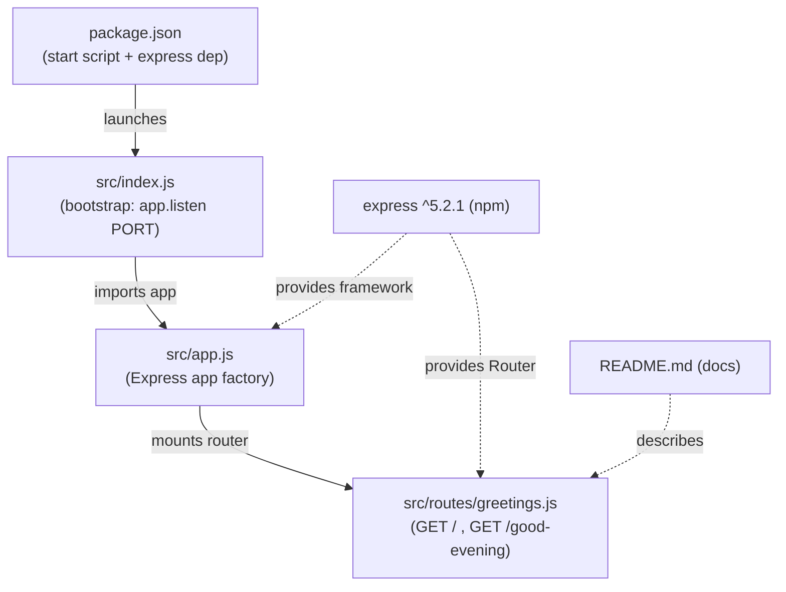
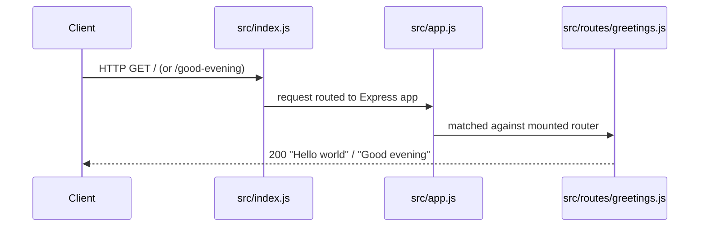

# Technical Specification

# 0. Agent Action Plan

## 0.1 Intent Clarification

The user's request, captured verbatim, is:

> add feature to a existing product
> this is a tutorial of node js server hosting one endpoint that returns the response "Hello world". Could you add expressjs into the project and add another endpoint that return the reponse of "Good evening"?

This subsection restates that request as a precise set of technical objectives, surfaces the implicit work it entails, and records the constraints that govern execution.

### 0.1.1 Core Feature Objective

Based on the prompt, the Blitzy platform understands that the new feature requirement is to **introduce the Express.js web framework into the project and add a second HTTP endpoint that returns the plain-text response "Good evening", while preserving the existing greeting endpoint that returns "Hello world".**

Restated with enhanced clarity, the feature comprises the following requirements:

- **Adopt Express.js as the HTTP framework** — the server must serve its routes through Express. This is an explicit user directive ("add expressjs into the project").
- **Preserve the baseline greeting endpoint** — an endpoint that returns the exact body `Hello world` must be available. The user describes this as the product's current behavior.
- **Add a new greeting endpoint** — a distinct route that returns the exact body `Good evening` must be added.
- **Keep the server runnable** — the process must start and listen for HTTP requests so both endpoints are reachable.

User Example (preserved exactly as provided):

- Existing endpoint response: `Hello world`
- New endpoint response: `Good evening`

**Repository State Reconciliation (critical):** The prompt frames this as adding to an existing "node js server hosting one endpoint that returns 'Hello world'." However, the committed repository does not contain that server. The authoritative `main` branch holds a single file, `README.md`, whose entire content is the heading `# Artifact1` [README.md:L1]; there is no `package.json`, no `src/` directory, and no server source [Technical Specification §1.4.1]. The platform therefore reconciles the user's framing with the verified state: the described "Hello world" server is treated as the intended baseline that must be **materialized** as part of this feature, and the new "Good evening" endpoint is added in the same scope. Concretely, the baseline endpoint is *created* (because it is absent from committed code) so that its external behavior matches the product the user has in mind, and the requested endpoint is added alongside it.

**Implicit requirements surfaced:**

- A Node.js package manifest (`package.json`) must be created — none exists [Technical Specification §3.4.1].
- The `express` dependency must be declared and installed, producing a `package-lock.json` lockfile.
- An HTTP server must bind and listen on a configurable port (environment `PORT`, defaulting to a conventional value such as `3000`).
- Each endpoint requires a defined route path and an HTTP `200` response carrying the exact body string.
- A start script (e.g., `npm start`) and a `.gitignore` for `node_modules/` are needed for a runnable, version-control-friendly project.

**Feature dependencies and prerequisites:**

- Node.js runtime `>= 18` (required by Express 5) — satisfied by the installed Node.js 22.x LTS.
- The `express` package from the npm registry.

### 0.1.2 Special Instructions and Constraints

- **Make minimal changes (user rule, verbatim):** "Confine all changes to the defined scope and nowhere else. Maintain all public interfaces, side effects, data flows, and dependencies unless the spec explicitly mandates adjustments. Do not refactor opportunistically. Avoid cascading changes, cross-file edits, or global updates. Changes must be minimal, isolated, and fully aligned with the scoped objective." The defined scope is exactly: establish the minimal Node.js + Express foundation, the baseline endpoint, the new endpoint, and the `express` dependency. No unrelated tooling (TypeScript, linters, test frameworks, containerization) is introduced.
- **Dependency addition is explicitly mandated:** although the rule says to maintain dependencies, the user explicitly requests Express, so adding `express` is a spec-mandated adjustment and is in scope.
- **Backward compatibility:** the baseline `Hello world` response semantics must be delivered exactly; the new route must be purely additive and must not alter the baseline route.
- **Architectural convention:** follow idiomatic Express structure (application factory + router + bootstrap) kept as small as possible; a single-file server is an acceptable equally-minimal alternative.
- **Web search requirement:** confirm the current stable Express version and its Node.js compatibility (completed — see §0.2.2).

### 0.1.3 Technical Interpretation

These feature requirements translate to the following technical implementation strategy:

| Requirement | Technical Action |
|---|---|
| Adopt Express.js | To introduce the framework, we will **create** `package.json` declaring `express` `^5.2.1` and install it (generating `package-lock.json`). |
| Host both endpoints | To serve the routes, we will **create** an Express application (`src/app.js`) and a router (`src/routes/greetings.js`) defining `GET /` → `Hello world` and `GET /good-evening` → `Good evening`. |
| Run the server | To make the endpoints reachable, we will **create** `src/index.js`, which imports the app and listens on `process.env.PORT || 3000`. |
| Preserve baseline behavior | To match the described product, the `GET /` handler returns the exact body `Hello world`. |
| Document and hygiene | To keep the project runnable and clean, we will **update** `README.md` and **create** `.gitignore`. |

Where the prompt left a detail unspecified, the platform resolves it as follows:

- New endpoint path → `GET /good-evening` (conventional kebab-case).
- Baseline endpoint path → `GET /` (root).
- Response content type → the exact body strings are delivered; Express's default string response is acceptable, and implementers may set `text/plain` if plain text is explicitly desired.

## 0.2 Repository Scope Discovery

This subsection records the exhaustive analysis of the repository performed to identify every file and integration point relevant to the feature, the external research conducted, and the new files the feature requires.

### 0.2.1 Comprehensive File Analysis

The repository was inspected in full via folder traversal and version-control listing. The complete inventory of tracked content on the authoritative `main` branch is a single file:

| Path | Type | Status | Role |
|---|---|---|---|
| `README.md` | File | Pre-existing (UPDATE) | Documentation stub; entire content is `# Artifact1` [README.md:L1] |

No other files, folders, manifests, or source modules exist [Technical Specification §1.4.1]. Because the project is effectively greenfield, the standard integration-point discovery resolves to an explicit set of absences rather than a set of existing touchpoints to wire into:

| Integration Point Sought | Present in Repository? | Evidence |
|---|---|---|
| API endpoints / route handlers | None | No source code committed [Technical Specification §3.3.1] |
| Database models / migrations | None | No persistence layer; no manifests [Technical Specification §3.4.1] |
| Service classes / business logic | None | No `src/` directory exists [Technical Specification §1.4.1] |
| Controllers / request handlers | None | No application framework declared [Technical Specification §3.3.1] |
| Middleware / interceptors | None | No framework or source present [Technical Specification §3.3.1] |
| Dependency-injection container / config modules | None | No configuration files committed [Technical Specification §3.3.1] |

**Conclusion:** There are no pre-existing components to integrate *with*. All integration for this feature is **internal** — that is, between the new files the feature creates. This is the defining distinction from a typical brownfield feature addition and is the reason the file scope below is dominated by `CREATE` operations.

### 0.2.2 Web Search Research Conducted

The following external research was performed to ground the dependency and runtime decisions in current, verified facts:

| Research Question | Finding | Source |
|---|---|---|
| Current stable Express version | `5.2.1` (latest stable release) | npm registry (`npmjs.com/package/express`) |
| Express runtime requirement | Node.js `18` or higher | npm registry package page |
| Node.js runtime status | Node.js 22.x is an Active LTS line; installed runtime is `v22.22.2` | npm/Node.js release documentation |

These findings confirm that the installed Node.js 22.x LTS satisfies Express 5's `>= 18` requirement, and they fix the exact dependency version (`express ^5.2.1`) used throughout this plan, avoiding placeholder versions. Express follows a small, unopinionated routing/middleware model, which is the idiomatic and minimal way to host the two required endpoints.

### 0.2.3 New File Requirements

The feature requires the following new source, configuration, and documentation files. Each is justified and given a single clear purpose.

- **New source files:**
  - `src/routes/greetings.js` — an `express.Router` defining `GET /` → `Hello world` (baseline feature `F-001`) and `GET /good-evening` → `Good evening` (new feature `F-002`).
  - `src/app.js` — the Express application factory: instantiates the app, mounts the greetings router, and exports the configured app for the bootstrap (and for future testing).
  - `src/index.js` — the HTTP server bootstrap: imports the app, resolves the listen port from `process.env.PORT` (default `3000`), and calls `app.listen`.
- **New configuration files:**
  - `package.json` — the npm manifest declaring project metadata, the `express ^5.2.1` dependency, an `engines.node` constraint (`>= 18`), and a `start` script (`node src/index.js`).
  - `package-lock.json` — generated by `npm install`; pins `express` `5.2.1` and its transitive dependency tree for reproducible installs.
  - `.gitignore` — ignores `node_modules/` and Node log files (`*.log`).
- **New test files:** none. Automated tests were not requested; per the "Make minimal changes" rule they are deferred (see §0.5.2). Functional verification is performed via `curl` against the running server.

The feature-identifier labels (`F-001`, `F-002`) follow the forward-compatible schema reserved in the specification's Feature Catalog [Technical Specification §2.2.2].

## 0.3 Dependency Inventory and Integration Analysis

This subsection records the single dependency change the feature introduces and maps the integration touchpoints among the affected files.

### 0.3.1 Package Additions

The repository currently declares zero dependencies [Technical Specification §3.4.1]. This feature introduces exactly one direct runtime dependency; there are no dependency updates and no removals.

| Package | Registry | Version | Dependency Class | License | Purpose |
|---|---|---|---|---|---|
| `express` | npm | `^5.2.1` | runtime | MIT | HTTP web framework providing the routing and middleware used to serve the two greeting endpoints |

Supporting runtime expectation (declared via `engines` in `package.json`, not a package):

| Runtime | Constraint | Resolved Target |
|---|---|---|
| Node.js | `>= 18` (Express 5 requirement) | Node.js 22.x LTS (installed `v22.22.2`) |

Notes:

- The exact version `^5.2.1` is the current stable release on the npm registry (see §0.2.2); no placeholder versions are used.
- Express 5.x carries its own transitive dependency tree. Those transitive packages are not enumerated here because they are resolved and pinned automatically in `package-lock.json` during `npm install`.
- No development or test dependencies are added (see §0.5.2).

### 0.3.2 Existing Code Touchpoints

Because the repository is greenfield, there is only one **existing** file in scope, and all remaining touchpoints are **internal** wiring among the new files this feature creates.

- **Direct modification to existing code:**
  - `README.md` — updated to document the two endpoints and the install/run steps. This is the only pre-existing file touched [README.md:L1].
- **Internal integration (new file to new file):**
  - `package.json` declares the `express` dependency and the `start` script that launches `src/index.js`.
  - `src/index.js` imports the app from `src/app.js` and starts the HTTP listener.
  - `src/app.js` mounts the router from `src/routes/greetings.js` onto the Express app.
  - `src/routes/greetings.js` defines the two route handlers.
- **External integrations:** none. No databases, message brokers, identity providers, or third-party services are involved.

The module dependency and request-handling relationships are:





## 0.4 Technical Implementation

This subsection defines the concrete, file-by-file plan. Every file listed must be created or modified.

### 0.4.1 File-by-File Execution Plan

| Group | Mode | File | Purpose |
|---|---|---|---|
| Foundation | CREATE | `package.json` | npm manifest: metadata, `dependencies.express = "^5.2.1"`, `engines.node = ">=18"`, `scripts.start = "node src/index.js"` |
| Foundation | CREATE | `package-lock.json` | Generated by `npm install`; pins `express` `5.2.1` and its transitive tree |
| Foundation | CREATE | `.gitignore` | Ignore `node_modules/` and `*.log` |
| Application | CREATE | `src/routes/greetings.js` | `express.Router` exposing `GET /` → `Hello world` and `GET /good-evening` → `Good evening` |
| Application | CREATE | `src/app.js` | Express application factory; mounts the greetings router; exports the app |
| Application | CREATE | `src/index.js` | HTTP bootstrap; reads `PORT`; calls `app.listen` |
| Documentation | UPDATE | `README.md` | Document the two endpoints and the install/run steps |

Modes used: **CREATE** (six new files) and **UPDATE** (`README.md`, the only pre-existing file [README.md:L1]). There are no **DELETE** operations and no **REFERENCE**-only files (no external style guides or Figma URLs were supplied).

### 0.4.2 Implementation Approach per File

- **Establish the foundation** — author `package.json` declaring `express ^5.2.1`, the `engines.node` constraint, and the `start` script; run `npm install` to materialize `package-lock.json` and `node_modules/`. Add `.gitignore` so `node_modules/` is not committed.
- **Author the router** (`src/routes/greetings.js`) — define the two routes returning the exact required bodies:

```javascript
router.get('/', (req, res) => res.send('Hello world'));
router.get('/good-evening', (req, res) => res.send('Good evening'));
```

- **Author the application factory** (`src/app.js`) — create the Express app and mount the router; export the app so it can be reused by the bootstrap:

```javascript
const app = express();
app.use('/', greetingsRouter);
```

- **Author the bootstrap** (`src/index.js`) — start the HTTP listener on the resolved port:

```javascript
const PORT = process.env.PORT || 3000;
app.listen(PORT, () => console.log(`Listening on ${PORT}`));
```

- **Document and verify** — update `README.md` with the two endpoints and the `npm install` / `npm start` steps; verify by booting the server and issuing `curl` requests to `/` and `/good-evening`.

Backward-compatibility note: the `GET /` handler returns the baseline `Hello world` body the user describes; the new `GET /good-evening` route is purely additive and does not alter the baseline route. Because Express's `res.send` of a string defaults the `Content-Type` to `text/html`, implementers may optionally set `text/plain` — the hard requirement is fidelity of the response body strings, which the user specified.

No file in this plan references a user-provided Figma URL or external design asset, because none were supplied.

### 0.4.3 User Interface Design

Not applicable. This feature delivers a backend HTTP service that returns plain-text response bodies; there is no graphical user interface, component library, design system, or Figma source associated with the request. No UI design work is in scope.

## 0.5 Scope Boundaries

This subsection draws the precise boundary between what will and will not be changed, in direct service of the "Make minimal changes" rule.

### 0.5.1 Exhaustively In Scope

- **Application source (all new):**
  - `src/**/*.js` — covers all new application source under `src/`, specifically:
    - `src/index.js`
    - `src/app.js`
    - `src/routes/greetings.js`
- **Project manifest and lockfile (new):**
  - `package.json`
  - `package-lock.json`
- **Repository hygiene (new):**
  - `.gitignore`
- **Documentation (update):**
  - `README.md` — feature/endpoint and run-instructions section [README.md:L1]
- **Dependency change:**
  - Addition of `express ^5.2.1` (npm) as a direct runtime dependency

**Validation criteria (acceptance):**

- `npm install` completes successfully and `express` appears in both `package.json` and `package-lock.json`.
- `npm start` boots the HTTP server on the resolved port without error.
- `curl http://localhost:PORT/` returns the body `Hello world` with HTTP `200`.
- `curl http://localhost:PORT/good-evening` returns the body `Good evening` with HTTP `200`.
- No file outside the in-scope list above is created, modified, or deleted.

### 0.5.2 Explicitly Out of Scope

- Any endpoints or features beyond `GET /` and `GET /good-evening`.
- Automated test frameworks and test files (e.g., Jest, Mocha, Supertest, `tests/**`) — not requested; deferred per the minimal-change rule. Verification is performed manually via `curl`.
- Databases, ORMs, migrations, or any persistence layer.
- Authentication, authorization, and security middleware (e.g., Helmet, CORS, rate limiting).
- Frontend/UI, templating or view engines, static assets, and any design system.
- Containerization (Dockerfile), CI/CD pipelines, and deployment or infrastructure configuration.
- Logging, metrics, tracing, or observability frameworks beyond a basic startup log line.
- TypeScript migration; linters/formatters (ESLint, Prettier); editor configuration.
- Performance optimizations such as clustering, compression, or caching.
- Refactoring of existing code — not applicable, as no application source exists prior to this feature [Technical Specification §1.4.1].

## 0.6 Rules for Feature Addition

This subsection captures the user-specified rules and the feature-specific conventions that govern this implementation.

**User-specified rules (verbatim):**

- **Make minimal changes** — "Confine all changes to the defined scope and nowhere else. Maintain all public interfaces, side effects, data flows, and dependencies unless the spec explicitly mandates adjustments. Do not refactor opportunistically. Avoid cascading changes, cross-file edits, or global updates. Changes must be minimal, isolated, and fully aligned with the scoped objective."
- **My System Preset Rule** — no content was provided; it imposes no additional directive.

**Application of the minimal-change rule to this feature:**

- The defined scope is strictly: establish the Node.js + Express foundation, the baseline `GET /` endpoint, the new `GET /good-evening` endpoint, and the `express` dependency. Nothing beyond this is touched.
- Adding `express` is the one dependency adjustment that the spec explicitly mandates (the user directly requested it), which the rule permits as an explicitly mandated change.
- No opportunistic refactoring, tooling additions (TypeScript, linters, test frameworks, containerization), or global edits are performed.

**Feature-specific conventions and requirements:**

- **Exact response fidelity** — the endpoints must return the exact bodies `Hello world` and `Good evening` as specified by the user; these strings must not be paraphrased or altered.
- **Additive routing** — the new route is added without modifying the behavior of the baseline route; both are served by the same Express application.
- **Idiomatic, minimal structure** — follow the conventional Express layering (bootstrap → application factory → router), kept as small as the requirement allows; a single-file server is an acceptable equally-minimal alternative.
- **Configurable port** — the server listens on `process.env.PORT` with a conventional default (`3000`) so it remains runnable in varied environments.
- **Exact dependency versions** — declare `express ^5.2.1` (verified current stable from the npm registry); do not use placeholder versions.
- **Reproducible installs** — commit `package-lock.json` so the pinned dependency tree is reproducible.

## 0.7 Attachments

No attachments were provided with this request.

- **Files:** none. No PDFs, images, documents, or data files were attached.
- **Figma screens:** none. No Figma frames or URLs were provided; consequently, no design-to-component mapping or design-system alignment applies to this feature (the feature is a plain-text backend HTTP service with no user interface).

All requirements for this Agent Action Plan were derived from the user's textual prompt, the user-specified rules, and direct inspection of the repository.

