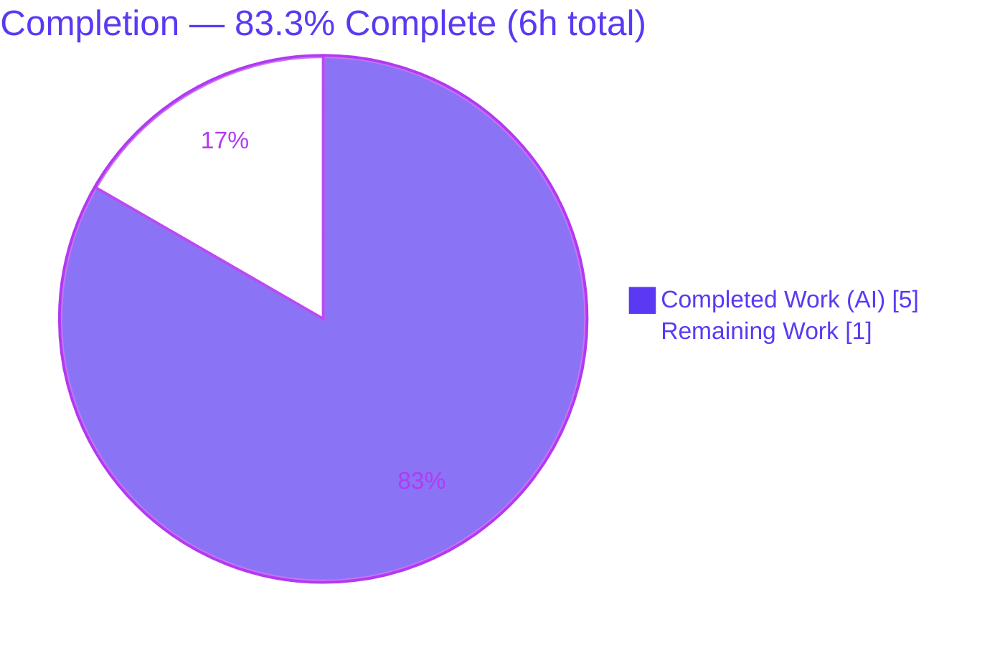
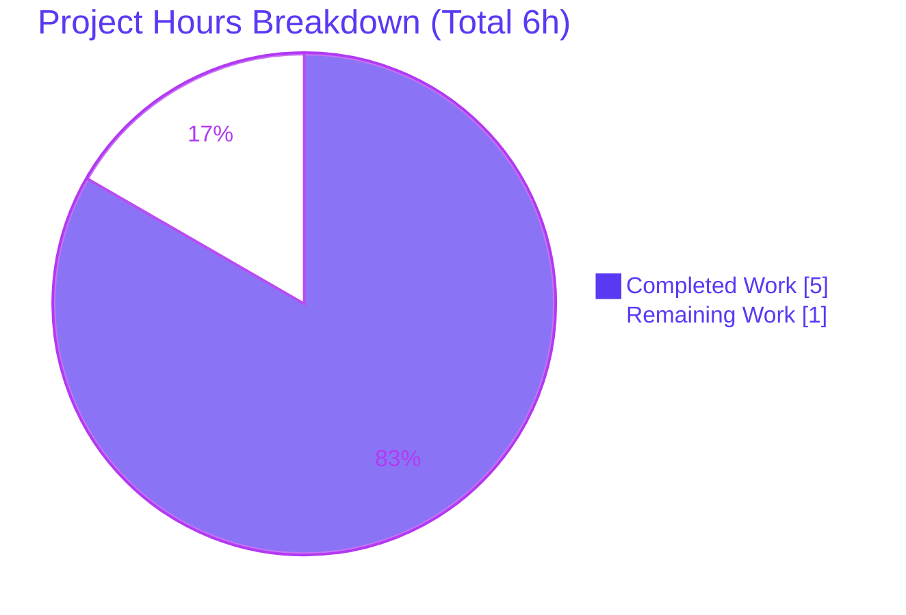

# Blitzy Project Guide — Artifact1 Express Greeting Server

> **Project:** Minimal Node.js + Express greeting server
> **Branch:** `blitzy-1a4fac3c-8e4c-465f-b76d-769c3fd5fabe` · **HEAD:** `94eab66` · **Base:** `origin/main` (`a03e1a8`)
> **Status:** ✅ Production‑ready (autonomous scope) — pending human review & merge
> **Completion:** **83.3%** (5h completed / 6h total)

---

## 1. Executive Summary

### 1.1 Project Overview

This project adds the **Express.js** web framework to a previously empty repository and delivers a minimal, runnable Node.js HTTP service that exposes two plain‑text greeting endpoints: `GET /` returning `Hello world` (the product's baseline behavior) and a new `GET /good-evening` returning `Good evening`. Because the authoritative `main` branch contained only a `README.md` stub, the described "Hello world" server was **materialized** from scratch rather than modified. The target users are HTTP clients/integrators consuming the two greeting routes. The technical scope is deliberately narrow per the user's minimal‑change rule: a CommonJS application factory, a router, an HTTP bootstrap with a configurable port, the `express` dependency, and supporting project hygiene — no databases, auth, UI, or extra tooling.

### 1.2 Completion Status



| Metric | Hours |
|---|---|
| **Total Hours** | **6** |
| Completed Hours (AI) | 5 |
| Completed Hours (Manual) | 0 |
| **Completed Hours (AI + Manual)** | **5** |
| **Remaining Hours** | **1** |
| **Percent Complete** | **83.3%** |

> Completion is computed using the AAP‑scoped hours methodology: `Completed ÷ (Completed + Remaining) = 5 ÷ 6 = 83.3%`. Only AAP‑specified deliverables and in‑scope path‑to‑production work are counted. Color key: **Completed = Dark Blue `#5B39F3`**, **Remaining = White `#FFFFFF`**.

### 1.3 Key Accomplishments

- ✅ **Express.js adopted** — `express ^5.2.1` declared, installed, and confirmed serving at runtime (`X-Powered-By: Express`).
- ✅ **Baseline endpoint materialized** — `GET /` returns byte‑exact `Hello world` (HTTP 200, 11 bytes).
- ✅ **New endpoint added** — `GET /good-evening` returns byte‑exact `Good evening` (HTTP 200, 12 bytes).
- ✅ **Runnable server** — boots via `npm start` ("Listening on 3000"); honors `process.env.PORT` (verified with `PORT=8080`).
- ✅ **Reproducible installs** — `package-lock.json` (v3) commits the pinned `express@5.2.1` tree; `npm install` is in sync.
- ✅ **Clean dependency posture** — `npm audit` reports **0 vulnerabilities**.
- ✅ **Idiomatic, documented structure** — `bootstrap → app factory → router` (CommonJS) with extensive JSDoc and **no stubs/TODOs**.
- ✅ **Strict scope discipline** — `git diff` shows exactly the 7 planned files; **zero** out‑of‑scope changes.

### 1.4 Critical Unresolved Issues

| Issue | Impact | Owner | ETA |
|---|---|---|---|
| _None_ — all 5 AAP acceptance criteria met and independently re‑verified; all five production‑readiness gates pass | None | — | — |

> No defects, compilation errors, failing checks, or unresolved blockers were identified in the autonomous AAP scope.

### 1.5 Access Issues

| System / Resource | Type of Access | Issue Description | Resolution Status | Owner |
|---|---|---|---|---|
| Git repository | Read/Write (branch) | None — branch checked out, history readable, working tree clean | ✅ No issue | — |
| npm registry | Package install | None — `npm install` resolved `express@5.2.1` and full tree successfully | ✅ No issue | — |
| Local runtime (Node.js) | Execute | None — server boots and both endpoints respond | ✅ No issue | — |

> **No access issues identified.** All build, install, and runtime validation completed without permission or credential blockers.

### 1.6 Recommended Next Steps

1. **[High]** Review the feature branch diff (7 files / ~168 hand‑authored lines) against the AAP acceptance criteria and **merge to `main`**. *(This is the sole remaining in‑scope task — ~1h.)*
2. **[Medium]** Choose a runtime host and document the start command + `PORT` for the target environment. *(Deployment infrastructure is out of AAP scope; this is a hosting decision only.)*
3. **[Low]** _Optional / out of scope:_ add an automated test suite (Jest + Supertest) before any future feature work.
4. **[Low]** _Optional / out of scope:_ add `Helmet` + rate limiting and a `/health` endpoint if the service will be publicly exposed at scale.
5. **[Low]** _Optional / out of scope:_ add request logging (`morgan`/`pino`) and a CI pipeline (lint + `npm audit` + Node version matrix).

---

## 2. Project Hours Breakdown

### 2.1 Completed Work Detail

| Component | Hours | Description |
|---|---:|---|
| Requirements analysis & Express version research | 0.5 | AAP analysis + web‑verified current stable `express 5.2.1` and Node `>=18` compatibility (no placeholder versions). |
| Project foundation (`package.json`, `package-lock.json`, `.gitignore`) | 1.0 | npm manifest with `express ^5.2.1`, `engines.node >=18`, `start` script; `npm install` generating the pinned lockfile (v3); ignore patterns for `node_modules/` and `*.log`. |
| Greetings router — `src/routes/greetings.js` | 1.0 | `express.Router` defining F‑001 `GET /` → `Hello world` and F‑002 `GET /good-evening` → `Good evening`. |
| Express application factory — `src/app.js` | 0.5 | Instantiates the app, mounts the greetings router at `/`, exports the configured app (side‑effect free, test‑reusable). |
| HTTP bootstrap + configurable PORT — `src/index.js` | 0.5 | Imports the app, resolves `process.env.PORT || 3000`, calls `app.listen` with a startup log line. |
| README documentation update | 0.5 | Documents requirements, install/run steps, `PORT` override, endpoints table, and curl verification. |
| Runtime verification & acceptance testing | 1.0 | `npm install`/`ls`/`audit`, `node --check` ×3, JSON validity ×2, require‑graph load, curl of both endpoints, `PORT=8080` override, 404 behavior. |
| **Total Completed** | **5.0** | |

> Total of the Hours column = **5.0h**, matching **Completed Hours** in §1.2.

### 2.2 Remaining Work Detail

| Category | Hours | Priority |
|---|---:|---|
| Human PR review & merge to `main` (path‑to‑production release gate) | 1.0 | High |
| **Total Remaining** | **1.0** | |

> Total of the Hours column = **1.0h**, matching **Remaining Hours** in §1.2 and the "Remaining Work" value in the §7 pie chart. Items explicitly **out of AAP scope** (automated tests, security middleware, containerization, CI/CD, logging frameworks, `/health`) are **excluded** from this total per AAP §0.5.2 and appear only as optional recommendations in §1.6 and §8.

### 2.3 Total Project Hours & Reconciliation

| Bucket | Hours |
|---|---:|
| §2.1 Completed | 5.0 |
| §2.2 Remaining | 1.0 |
| **Total Project Hours** | **6.0** |
| **Completion %** | **83.3%** (`5 ÷ 6`) |

> Cross‑section integrity confirmed: §2.1 (5.0h) + §2.2 (1.0h) = §1.2 Total (6.0h); §2.2 remaining (1.0h) = §1.2 remaining = §7 "Remaining Work".

---

## 3. Test Results

> **Integrity note:** All results below originate from Blitzy's autonomous validation logs (production‑readiness Gates 1–5) and were **independently re‑executed** during this assessment against the live repository. **Formal automated test frameworks (Jest/Mocha/Supertest) are explicitly out of scope per AAP §0.5.2** — behavioral verification is performed via `curl` by design. There are therefore zero unit/integration test files, and the autonomous validation consisted of static, dependency, integration, and behavioral checks.

| Test Category | Framework / Tool | Total | Passed | Failed | Coverage % | Notes |
|---|---:|---:|---:|---:|---|---|
| Static syntax check | `node --check` | 3 | 3 | 0 | N/A | `src/index.js`, `src/app.js`, `src/routes/greetings.js` |
| Config validation | Node JSON parse | 2 | 2 | 0 | N/A | `package.json`, `package-lock.json` valid JSON |
| Dependency integrity | `npm ls` / `npm audit` | 2 | 2 | 0 | N/A | `express@5.2.1` resolved; **0 vulnerabilities** |
| Module integration (require graph) | Node `require` | 1 | 1 | 0 | N/A | `require('./src/app')` yields a valid Express app (function w/ `.listen`) |
| Runtime endpoint verification | `curl` | 3 | 3 | 0 | 100% endpoints | `GET /` → 200 `Hello world`; `GET /good-evening` → 200 `Good evening`; unknown → 404 |
| Configurable port | `curl` + env | 1 | 1 | 0 | N/A | `PORT=8080` honored; both endpoints serve |
| Automated unit/integration suite | _none (out of scope)_ | 0 | 0 | 0 | N/A | Deferred per AAP §0.5.2; verification via curl by design |
| **Totals** | | **12** | **12** | **0** | — | **100% pass** |

> **Line/branch code coverage = N/A** (no coverage instrumentation; a test framework is out of scope). **Behavioral endpoint coverage = 100%** — both AAP endpoints plus the 404 fallback path were exercised and verified.

---

## 4. Runtime Validation & UI Verification

**Runtime health**
- ✅ **Operational** — `npm start` boots cleanly and logs `Listening on 3000`.
- ✅ **Operational** — process serves requests without errors or crashes; clean shutdown on signal.

**API / endpoint verification**
- ✅ **Operational** — `GET /` → HTTP **200**, body `Hello world` (11 bytes, byte‑exact), `Content-Type: text/html; charset=utf-8`.
- ✅ **Operational** — `GET /good-evening` → HTTP **200**, body `Good evening` (12 bytes, byte‑exact).
- ✅ **Operational** — unknown route (e.g., `GET /does-not-exist`) → HTTP **404** without crashing.
- ✅ **Operational** — configurable port: `PORT=8080 npm start` → `Listening on 8080`; both endpoints serve on the override port.
- ✅ **Operational** — `X-Powered-By: Express` header confirms the Express framework is actively serving (adoption requirement satisfied at runtime).

**UI verification**
- ➖ **Not applicable** — this is a plain‑text backend HTTP service with **no graphical user interface** (AAP §0.4.3). No component library, design system, or Figma source is associated with the request.

> **Content‑Type note:** Express's `res.send(string)` defaults to `text/html`. This is **explicitly acceptable per AAP §0.4.2** — the hard requirement is fidelity of the response body strings, which is met exactly.

---

## 5. Compliance & Quality Review

| Benchmark / AAP Requirement | Status | Progress | Notes |
|---|---|---|---|
| AC‑1: `npm install` succeeds; `express` in `package.json` **and** lockfile | ✅ Pass | 100% | "up to date"; `express ^5.2.1` declared, `5.2.1` pinned |
| AC‑2: `npm start` boots without error | ✅ Pass | 100% | Logs `Listening on 3000` |
| AC‑3: `GET /` → `Hello world` (200) | ✅ Pass | 100% | Byte‑exact (11 bytes) |
| AC‑4: `GET /good-evening` → `Good evening` (200) | ✅ Pass | 100% | Byte‑exact (12 bytes) |
| AC‑5: No file outside the in‑scope list touched | ✅ Pass | 100% | `git diff` = exactly the 7 planned files |
| Minimal‑change rule adherence | ✅ Pass | 100% | No extra tooling, no opportunistic refactor, no cross‑file edits |
| Express framework adoption | ✅ Pass | 100% | `X-Powered-By: Express` at runtime |
| Exact response fidelity (no paraphrase/whitespace) | ✅ Pass | 100% | No trailing whitespace/newline; byte counts verified |
| Additive routing (baseline unchanged) | ✅ Pass | 100% | New route purely additive |
| Configurable port (`process.env.PORT \|\| 3000`) | ✅ Pass | 100% | `PORT=8080` verified |
| Reproducible installs (lockfile committed & in sync) | ✅ Pass | 100% | lockfile v3; install does not mutate tracked files |
| Security audit | ✅ Pass | 100% | `npm audit` → 0 vulnerabilities |
| Documentation (README matches runtime) | ✅ Pass | 100% | Endpoints table + install/run steps verified |
| Code quality (no stubs/placeholders/TODOs) | ✅ Pass | 100% | Extensive JSDoc; `'use strict'`; complete implementations |
| Automated test coverage | ➖ N/A | — | Out of scope (AAP §0.5.2); verification via curl |

**Fixes applied during autonomous validation:** **None required.** The prior feature agent had already implemented and committed all in‑scope files correctly (commits `f09abda..94eab66`). The Final Validator confirmed correctness across all five gates; no source modifications or new commits were necessary, and the working tree remained clean.

**Outstanding compliance items:** Only the human review/merge gate (§2.2). No quality remediation is outstanding.

---

## 6. Risk Assessment

Overall risk profile: **Low** across all categories. The service is self‑contained with a single dependency, no data store, no user input, no auth surface, and no external integrations.

| Risk | Category | Severity | Probability | Mitigation | Status |
|---|---|---|---|---|---|
| No automated test suite (manual curl verification only) | Technical | Low | Medium | Add Jest + Supertest if/when scope grows | Accepted (out of scope, AAP §0.5.2) |
| `Content-Type: text/html` rather than `text/plain` | Technical | Low | Low | Call `res.type('text/plain')` only if a consumer requires it | Accepted (per AAP §0.4.2) |
| Node runtime skew (validated v20.20.2; README targets 22.x LTS) | Technical | Low | Low | `engines.node ">=18"` covers all; enforce via `.nvmrc`/CI if desired | Mitigated |
| No security middleware (Helmet/CORS/rate limiting) | Security | Low | Low | Add if publicly exposed at scale; attack surface currently minimal | Accepted (out of scope) |
| Dependency drift / future CVEs in the express tree | Security | Low | Low | Periodic `npm audit` / Dependabot; lockfile pins a 0‑vuln tree today | Mitigated (0 vulnerabilities now) |
| No dedicated health‑check endpoint | Operational | Low | Low | `GET /` returns 200 and serves as a liveness probe, or add `/health` | Accepted |
| No graceful shutdown / process manager (raw `app.listen`) | Operational | Low‑Med | Medium | Run under pm2/systemd/container restart policy; add SIGTERM handler | Open (hosting decision) |
| Minimal logging (single startup line) | Operational | Low | Low | Add `morgan`/`pino` if observability is needed | Accepted (out of scope) |
| Branch not yet merged/deployed | Operational | Low | High (expected) | Human PR review & merge (the 1h remaining item) | Open (tracked) |
| Port conflict in target host (if 3000 occupied) | Integration | Low | Low | Configurable `PORT` env var (verified with `PORT=8080`) | Mitigated |
| External integration failures | Integration | None/Low | Low | N/A — no DB, APIs, brokers, or third‑party services exist | N/A |

> Risks marked **Accepted (out of scope)** stem directly from the AAP‑mandated minimal scope (§0.5.2). They are **not defects** and add **zero** remaining hours.

---

## 7. Visual Project Status

**Project Hours Breakdown** (Completed = Dark Blue `#5B39F3`, Remaining = White `#FFFFFF`):



**Remaining Work by Category** (sums to the §2.2 total of 1.0h):

| Category | Hours | Priority |
|---|---:|---|
| Human PR review & merge to `main` | 1.0 | High |

**AAP requirement status** (count of discrete requirements):

| Status | Count |
|---|---:|
| ✅ Completed | 14 / 14 AAP‑specified |
| 🟡 Partially completed | 0 |
| ⬜ Not started (in‑scope) | 0 |

> Integrity: the "Remaining Work" pie value (**1**) equals §1.2 Remaining Hours and the §2.2 Hours total. All 14 AAP‑specified requirements are Completed; the remaining hour is the human release gate only.

---

## 8. Summary & Recommendations

**Achievements.** Every AAP objective has been delivered and independently verified. Express.js (`^5.2.1`) was adopted, the baseline `GET /` → `Hello world` endpoint was materialized, and the new `GET /good-evening` → `Good evening` endpoint was added — both returning byte‑exact bodies with HTTP 200. The project is runnable (`npm start`), reproducible (committed lockfile), clean (`npm audit` 0 vulnerabilities), and strictly scoped (exactly 7 files changed, no out‑of‑scope edits). All five autonomous production‑readiness gates pass.

**Completion.** The project is **83.3% complete** (5h of 6h). 100% of the AAP‑specified autonomous scope (14 of 14 requirements) is finished; the remaining **1h** is the mandatory human review/merge gate, which by policy keeps completion below 100% until a human approves and integrates the change.

**Remaining gaps & critical path.** The single critical‑path item is **PR review + merge to `main`**. After merge, deployment is a straightforward hosting decision (set `PORT`, run `node src/index.js` under a process manager) — note that deployment infrastructure, containerization, and CI/CD were explicitly excluded from the AAP.

**Production‑readiness assessment.** Within its defined scope, the deliverable is **production‑ready**: it compiles (interpreted, syntax‑clean), installs reproducibly, runs, serves both endpoints correctly, handles unknown routes gracefully, and carries no known vulnerabilities. The optional enhancements below are **out of AAP scope** and are offered for future hardening only — they do not affect the completion math.

| Success Metric | Target | Actual | Met? |
|---|---|---|---|
| `GET /` body & status | `Hello world` / 200 | `Hello world` / 200 | ✅ |
| `GET /good-evening` body & status | `Good evening` / 200 | `Good evening` / 200 | ✅ |
| Express present in manifest + lockfile | Yes | `^5.2.1` / `5.2.1` | ✅ |
| Dependency vulnerabilities | 0 | 0 | ✅ |
| Out‑of‑scope files changed | 0 | 0 | ✅ |

**Recommendations (priority‑tagged).** `[High]` review & merge the branch. `[Medium]` document the chosen runtime host + `PORT`. `[Low, out of scope]` add tests (Jest+Supertest), security middleware (Helmet/rate‑limiting), a `/health` endpoint, request logging, and a CI pipeline as the service grows.

---

## 9. Development Guide

A backend HTTP service with no build step. Every command below was executed against the live repository during validation.

### 9.1 System Prerequisites

- **Node.js `>= 18`** (Express 5 requirement; Node.js 22.x LTS recommended). Validated on **v20.20.2**.
- **npm** (ships with Node). Validated on **11.1.0**.
- A POSIX shell and `curl` for verification. No database, cache, message broker, or `.env` file is required.

```bash
node --version    # expect v18+ (validated: v20.20.2)
npm --version     # validated: 11.1.0
```

### 9.2 Environment Setup

No environment file is needed. The only environment variable is the optional **`PORT`** (defaults to `3000`).

```bash
# Clone and enter the repository, then checkout the feature branch
git checkout blitzy-1a4fac3c-8e4c-465f-b76d-769c3fd5fabe
```

### 9.3 Dependency Installation

```bash
npm install
```

Expected (first run installs the tree; subsequent runs show "up to date"):

```
added 66 packages, and audited 67 packages in Ns
found 0 vulnerabilities
```

Verify the dependency tree and audit:

```bash
npm ls        # -> artifact1@1.0.0 └── express@5.2.1
npm audit     # -> found 0 vulnerabilities
```

> `node_modules/` is git‑ignored; always run `npm install` after a fresh clone.

### 9.4 Application Startup

```bash
npm start            # runs: node src/index.js  ->  "Listening on 3000"
# Optional port override:
PORT=8080 npm start  # -> "Listening on 8080"
```

Run in the background and capture the PID if you need the shell back:

```bash
npm start > server.log 2>&1 &
SRV_PID=$!        # ... later: kill "$SRV_PID"
```

### 9.5 Verification Steps

With the server running:

```bash
curl -i http://localhost:3000/
# HTTP/1.1 200 OK
# Content-Type: text/html; charset=utf-8
# Content-Length: 11
# X-Powered-By: Express
# Hello world

curl -i http://localhost:3000/good-evening
# HTTP/1.1 200 OK
# Content-Length: 12
# Good evening

curl -s -o /dev/null -w "%{http_code}\n" http://localhost:3000/does-not-exist
# 404
```

### 9.6 Example Usage

```bash
# Plain bodies
curl http://localhost:3000/              # -> Hello world
curl http://localhost:3000/good-evening  # -> Good evening
```

### 9.7 Troubleshooting

- **`EADDRINUSE` (port already in use):** start on another port — `PORT=8080 npm start`.
- **`command not found: node`/`npm`:** install Node.js `>= 18` (22.x LTS recommended).
- **`Cannot find module 'express'` after a fresh clone:** run `npm install` first (`node_modules/` is git‑ignored).
- **Commands fail / wrong files:** run all commands from the **repository root** (the directory containing `package.json`).
- **Response `Content-Type` is `text/html`:** expected and by design (AAP §0.4.2); the body strings are byte‑exact.

---

## 10. Appendices

### A. Command Reference

| Command | Purpose |
|---|---|
| `npm install` | Install dependencies from the committed lockfile |
| `npm start` | Start the server (`node src/index.js`) |
| `PORT=8080 npm start` | Start on a custom port |
| `npm ls` | Show the resolved dependency tree (`express@5.2.1`) |
| `npm audit` | Security audit (expect 0 vulnerabilities) |
| `node --check <file>` | Static syntax validation of a JS file |
| `curl -i http://localhost:3000/` | Verify the baseline endpoint |
| `curl -i http://localhost:3000/good-evening` | Verify the new endpoint |

### B. Port Reference

| Port | Source | Notes |
|---|---|---|
| `3000` | Default (`process.env.PORT \|\| 3000`) | Used when `PORT` is unset |
| `<custom>` | `PORT` environment variable | e.g., `PORT=8080` (verified) |

### C. Key File Locations

| Path | Role |
|---|---|
| `package.json` | npm manifest: `express ^5.2.1`, `engines.node >=18`, `start` script |
| `package-lock.json` | Lockfile v3 pinning `express@5.2.1` + transitive tree |
| `.gitignore` | Ignores `node_modules/` and `*.log` |
| `src/index.js` | HTTP bootstrap; resolves `PORT`; `app.listen` |
| `src/app.js` | Express application factory; mounts router; exports app |
| `src/routes/greetings.js` | Router: `GET /` → `Hello world`, `GET /good-evening` → `Good evening` |
| `README.md` | Endpoint, install, and run documentation |

### D. Technology Versions

| Technology | Version / Constraint | Notes |
|---|---|---|
| Node.js | `>= 18` (validated v20.20.2; README targets 22.x LTS) | Express 5 runtime requirement |
| npm | 11.1.0 (validated) | Ships with Node |
| Express | `^5.2.1` (pinned `5.2.1`) | Current stable; MIT license |
| Module system | CommonJS | `require`/`module.exports`; no `"type": "module"` |
| Lockfile | `lockfileVersion: 3` | Reproducible installs |

### E. Environment Variable Reference

| Variable | Required | Default | Description |
|---|---|---|---|
| `PORT` | No | `3000` | TCP port the HTTP server binds to |

### F. Developer Tools Guide

| Tool | Usage | What to expect |
|---|---|---|
| `node --check` | `node --check src/index.js` | Silent exit 0 on valid syntax (all 3 JS files pass) |
| `npm ls` | Inspect dependency resolution | `artifact1@1.0.0 └── express@5.2.1` |
| `npm audit` | Vulnerability scan | `found 0 vulnerabilities` |
| `curl -i` | Inspect status line + headers + body | `200 OK`, correct `Content-Length`, byte‑exact body |
| `require('./src/app')` | Load app without binding a port | Returns a valid Express app (function with `.listen`) — useful for future in‑process tests |

### G. Glossary

| Term | Definition |
|---|---|
| **AAP** | Agent Action Plan — the authoritative spec defining this feature's scope. |
| **F‑001 / F‑002** | Feature identifiers for the baseline (`GET /`) and new (`GET /good-evening`) endpoints. |
| **Application factory** | A module that constructs and returns the configured Express app without starting the listener (`src/app.js`). |
| **Bootstrap** | The entry point that imports the app and starts the HTTP listener (`src/index.js`). |
| **Byte‑exact** | The response body matches the required string with no extra whitespace/newline (11 bytes for `Hello world`, 12 for `Good evening`). |
| **Path‑to‑production** | Standard activities required to release the AAP deliverable (here: human review & merge). |
| **Out of scope** | Work explicitly excluded by AAP §0.5.2 (tests, auth, DB, UI, containers, CI/CD, logging frameworks) — not counted in completion. |

---

*Prepared by the Blitzy Platform autonomous assessment agent. Completion percentage (83.3%) reflects AAP‑scoped and in‑scope path‑to‑production work only. Color key: Completed = `#5B39F3` (Dark Blue), Remaining = `#FFFFFF` (White).*