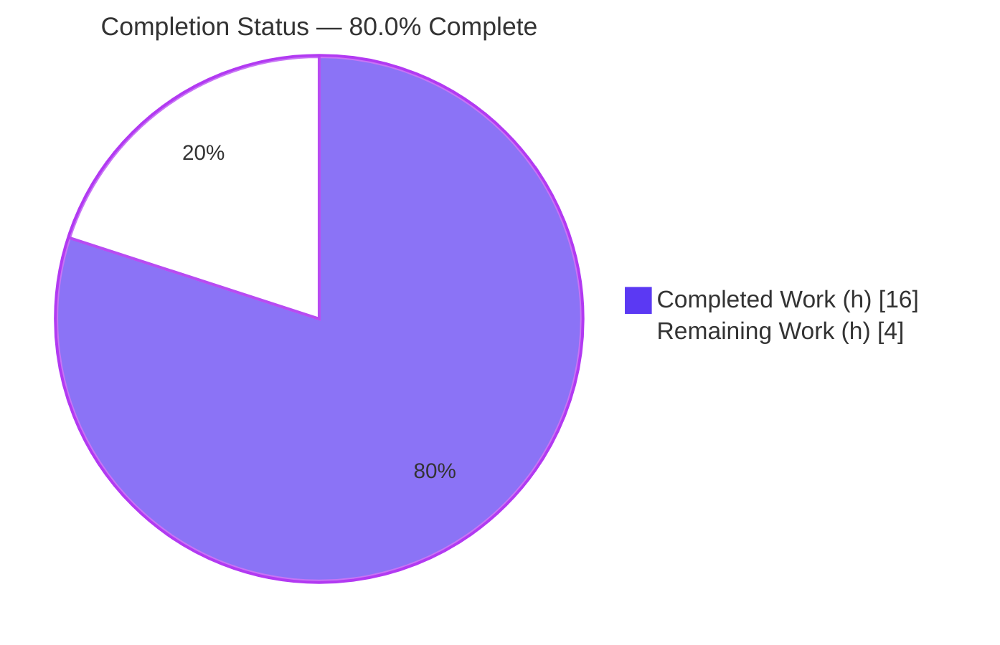
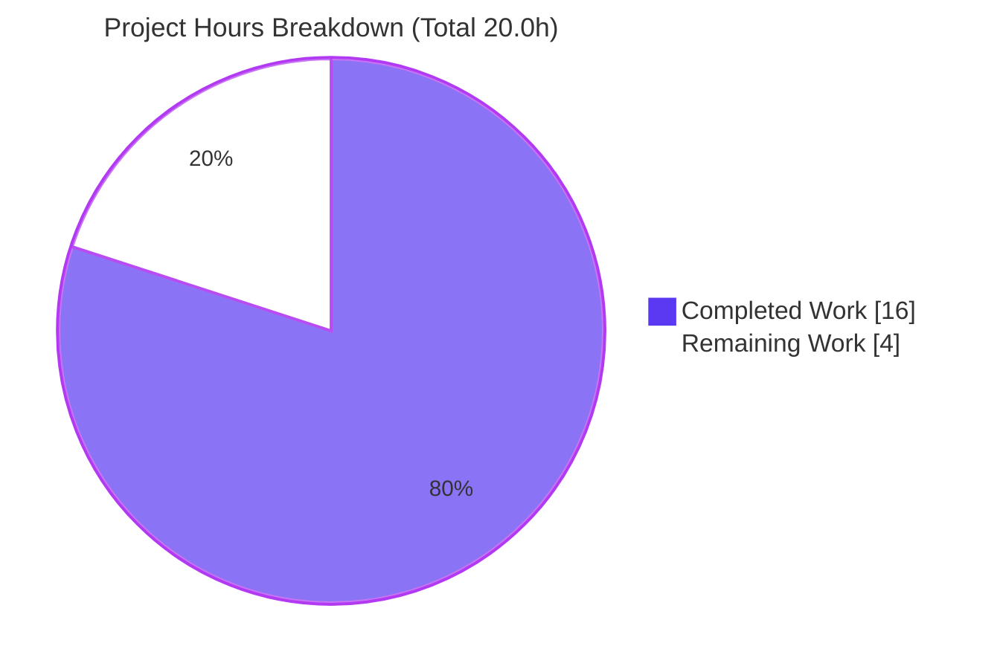
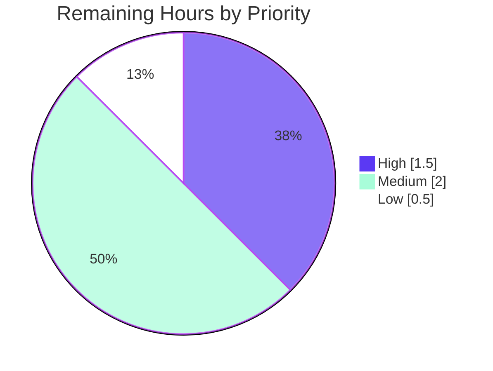

# Blitzy Project Guide — Artifact1: Node.js + Express 5 Greeting Server

---

## 1. Executive Summary

### 1.1 Project Overview

Artifact1 is a minimal, idiomatic **Node.js HTTP server built on the Express 5 web framework** that exposes two plain-text greeting endpoints: `GET /` returning `Hello world` and `GET /good-evening` returning `Good evening`. The Agent Action Plan (AAP) framed the work as "add Express to an existing tutorial server," but the verified repository contained only a one-line `README.md` (`# Artifact1`) — so the work was delivered as **greenfield scaffolding** that materializes both the baseline endpoint the user believed existed and the new endpoint. The project targets developers learning conventional Express organization (router / app-factory / bootstrap separation). Business impact is educational/reference; technical scope is a single CommonJS module tree with one runtime dependency.

### 1.2 Completion Status

The project is **80.0% complete**, calculated strictly on AAP-scoped engineering plus standard path-to-production work (PA1 methodology). All AAP deliverables are implemented and validated; the remaining 20% is human-gated path-to-production work that autonomous agents cannot perform (human code review, deployment configuration, and ratification of two flagged design decisions).



| Metric | Value |
|--------|-------|
| **Total Hours** | **20.0 h** |
| **Completed Hours (AI + Manual)** | **16.0 h** (16.0 AI / autonomous + 0.0 manual) |
| **Remaining Hours** | **4.0 h** |
| **Percent Complete** | **80.0%** (16.0 ÷ 20.0) |

> Color key: **Completed = Dark Blue `#5B39F3`** · **Remaining = White `#FFFFFF`**.

### 1.3 Key Accomplishments

- ✅ **Express 5 introduced** as the HTTP layer — `express ^5.2.1` declared in `package.json` and resolved to **5.2.1** with **0 vulnerabilities**.
- ✅ **Both endpoints live and byte-exact** — `GET /` → `Hello world` (HTTP 200), `GET /good-evening` → `Good evening` (HTTP 200), verified over a real socket.
- ✅ **Idiomatic structure delivered** — router (`src/routes/greetings.js`), application factory (`src/app.js`), and bootstrap (`src/index.js`) cleanly separated per AAP §0.3.3.
- ✅ **Reproducible dependency tree** — `package-lock.json` (lockfileVersion 3, 67 packages); `npm ci` succeeds from a clean state.
- ✅ **Environment-driven port** — `process.env.PORT || 3000`; `PORT=8080` override verified.
- ✅ **Documentation complete** — `README.md` retains `# Artifact1` and adds overview, endpoint table, prerequisites, install/run, smoke test, and structure.
- ✅ **Clean git history** — 7 conventional commits (`2ee19ef..bb13d62`) authored by `agent@blitzy.com`; working tree clean.
- ✅ **All five autonomous validation gates passed** — dependencies, syntax, functional, runtime, and zero-error gates.

### 1.4 Critical Unresolved Issues

| Issue | Impact | Owner | ETA |
|-------|--------|-------|-----|
| _None_ — no blocking issues identified | No release blockers; zero fixes were required during validation | — | — |

> The Final Validator reported zero compilation errors, zero test failures, zero runtime errors, and zero dependency issues. The remaining work (Section 2.2) is path-to-production, not defect resolution.

### 1.5 Access Issues

| System/Resource | Type of Access | Issue Description | Resolution Status | Owner |
|-----------------|----------------|-------------------|-------------------|-------|
| _None_ | — | No access issues identified — the project has no external services, credentials, databases, or third-party APIs | N/A | — |

**No access issues identified.** The build and validation ran fully offline using only the public npm registry (already satisfied by the committed lockfile and local `node_modules`).

### 1.6 Recommended Next Steps

1. **[High]** Perform human code review and sign-off on the 7 in-scope files, then approve & merge the PR.
2. **[High]** Run a fresh-environment / CI smoke test (`npm ci` → `npm start` → `curl` both endpoints) to confirm reproducibility.
3. **[Medium]** Ratify the Content-Type decision (keep Express default `text/html; charset=utf-8` vs. switch to `text/plain` for strict parity — AAP §0.6.2).
4. **[Medium]** Configure deployment & environment (set `PORT` per environment; choose process supervision such as pm2/systemd/container).
5. **[Low]** Decide add-vs-defer for optional production hardening (404/error middleware, graceful shutdown, request logging, security headers, health check).

---

## 2. Project Hours Breakdown

### 2.1 Completed Work Detail

| Component | Hours | Description |
|-----------|------:|-------------|
| Dependency baseline & manifest | 2.5 | `package.json` (name, `main`, `scripts.start`, `engines.node >=18`, metadata) + `package-lock.json`; selecting/verifying/installing `express ^5.2.1` (AAP §0.4.1, §0.5). |
| Greetings router (`src/routes/greetings.js`) | 2.0 | `express.Router` defining `GET /` → "Hello world" and `GET /good-evening` → "Good evening", with full JSDoc (AAP §0.9.1). |
| Application factory (`src/app.js`) | 2.5 | `express()` app creation, router mounting via `app.use('/', router)`, `module.exports = app`; application-factory + router + app/server-separation patterns; 100-line JSDoc (AAP §0.3.3). |
| Server bootstrap (`src/index.js`) | 1.5 | `require('./app')`, resolve `process.env.PORT || 3000`, `app.listen` with startup log; app/server separation (AAP §0.3.3). |
| Documentation (`README.md`) | 2.5 | Overview, endpoint table, Content-Type note, prerequisites, install/run, smoke test, project structure; retains `# Artifact1` (AAP §0.4.1). |
| Project hygiene (`.gitignore`) | 0.5 | Ignores `node_modules/`, npm/yarn logs, `*.log`, `.env` (AAP §0.4.1). |
| Architecture research & design | 2.0 | Web-search-grounded decisions: Express route modularity, app/server separation, port convention, Express 5 currency/error semantics (AAP §0.3.2). |
| Autonomous validation & QA | 2.5 | Five-gate validation: `npm ci`, `node --check` ×3, JSON validity, route introspection, in-process HTTP assertions, live curl, PORT override, browser capture, git hygiene. |
| **Total Completed** | **16.0** | **All AAP-scoped work — delivered and validated** |

### 2.2 Remaining Work Detail

| Category | Hours | Priority |
|----------|------:|----------|
| Human code review & PR sign-off (review 7 in-scope files vs. AAP §0.9.1; approve & merge) | 1.0 | High |
| Fresh-environment / CI smoke verification (`npm ci` → `npm start` → `curl` both endpoints on a clean machine) | 0.5 | High |
| Content-Type / behavioral-parity decision ratification (keep `text/html` vs. `text/plain`, AAP §0.6.2) | 0.5 | Medium |
| Deployment & environment configuration (`PORT` per env; process supervision/restart policy) | 1.5 | Medium |
| Optional production-hardening decision (404/error middleware, graceful shutdown, logging, security headers, health check — add vs. defer) | 0.5 | Low |
| **Total Remaining** | **4.0** | — |

> **Reconciliation:** Section 2.1 (16.0) + Section 2.2 (4.0) = **20.0 Total Hours** (matches Section 1.2). Section 2.2 total (4.0) matches Section 1.2 Remaining and Section 7 "Remaining Work."

### 2.3 Estimation Basis & Confidence

- **Methodology:** Hours are AAP-scoped (PA1/PA2). Completion % = Completed ÷ (Completed + Remaining) = 16.0 ÷ 20.0 = **80.0%**.
- **Confidence:** **High** — the project is tiny (7 files, 1 dependency, 2 static endpoints, 248 lines of JS) with no ambiguity; all acceptance criteria are objectively verifiable and were verified.
- **No rework hours:** Zero fixes were required; all remaining hours are path-to-production (human-gated), not defect resolution. Per policy, completion is capped below 100% to reflect mandatory human review and deployment steps.

---

## 3. Test Results

All results below originate from **Blitzy's autonomous validation logs** and were **independently re-executed** during this assessment. No committed automated test suite exists (intentionally out of AAP scope §0.2.2); `npm test` returns `Missing script: "test"`, which is the documented expected behavior.

| Test Category | Framework / Tool | Total | Passed | Failed | Coverage | Notes |
|---------------|------------------|------:|-------:|-------:|----------|-------|
| Syntax / Compilation | `node --check` | 3 | 3 | 0 | 3/3 JS files | `src/index.js`, `src/app.js`, `src/routes/greetings.js` all parse cleanly |
| Manifest validity | JSON parse | 2 | 2 | 0 | 2/2 files | `package.json` + `package-lock.json` valid JSON |
| Route introspection | Node `require` + router-stack walk | 1 | 1 | 0 | 2/2 routes | Exactly `GET /` and `GET /good-evening`; app loads without opening a socket |
| Functional (in-process HTTP) | Ad-hoc Node HTTP assertions | 3 | 3 | 0 | both endpoints + 404 | `GET /`→200 "Hello world", `GET /good-evening`→200 "Good evening", unmatched→404 |
| Runtime (end-to-end over socket) | `npm start` + `curl` | 5 | 5 | 0 | endpoints + 404 + method + PORT | 200/200, `GET /missing`→404, `POST /`→404, `PORT=8080` honored |
| Dependency audit | `npm ci` / `npm audit` | 1 | 1 | 0 | 67 packages | **0 vulnerabilities**; reproducible install from lockfileVersion 3 |
| Committed unit/integration suite | — | 0 | 0 | 0 | N/A | Out of AAP scope §0.2.2; `npm test` → "Missing script" (expected) |
| **Total (autonomous validation)** | — | **15** | **15** | **0** | — | **100% pass rate** |

**Frameworks:** Node.js built-in `--check`, Node `require`/router introspection, ad-hoc in-process HTTP assertions, `curl`, and `npm ci`/`npm audit`. No third-party test runner is installed (none in scope).

---

## 4. Runtime Validation & UI Verification

**Runtime health** (verified live on this environment and corroborated against Final Validator Gate 4):

- ✅ **Server boot** — `npm start` logs `Server listening on port 3000`.
- ✅ **`GET /`** — HTTP **200**, body exactly `Hello world` (Content-Length 11, `X-Powered-By: Express`).
- ✅ **`GET /good-evening`** — HTTP **200**, body exactly `Good evening` (Content-Length 12).
- ✅ **Unmatched route** — `GET /missing` → Express default **404**.
- ✅ **Method semantics** — `POST /` → **404** (routes are `GET`-only, AAP §0.6.2).
- ✅ **Port override** — `PORT=8080 npm start` → `Server listening on port 8080`; both endpoints served on `:8080`.
- ✅ **Dependency health** — `npm ci` exit 0, **0 vulnerabilities**.

**UI verification:**

- ⚠ **Not applicable (by design)** — the deliverables are two plain-text HTTP endpoints with **no graphical user interface** (AAP §0.3.4). Browsing the endpoints renders the raw greeting text.
- ✅ **Browser rendering evidence** — the Final Validator captured screenshots (`endpoint_root_hello_world.png`, `endpoint_good_evening.png`). The only console message was an expected **Quirks Mode** notice (a bare string served as `text/html` without a DOCTYPE) — **not an error**; adding a DOCTYPE would violate the exact-body requirement (AAP §0.7.1).

**API integration outcomes:**

- ✅ **No external API integrations** — static greetings require none (AAP §0.2.2). No credentials, network egress, or service dependencies.

---

## 5. Compliance & Quality Review

Cross-mapping AAP §0.9.1 acceptance criteria and quality benchmarks to delivered evidence:

| Benchmark / AAP Criterion | Status | Evidence / Notes |
|---------------------------|--------|------------------|
| `package.json` declares `express ^5.2.1`, `scripts.start`, `engines.node >=18` | ✅ Pass | Verified on disk; matches AAP exactly |
| `npm install` produces lockfile + `node_modules` with express 5.2.x | ✅ Pass | `npm ci` reproducible; express resolved **5.2.1** |
| `npm start` binds `process.env.PORT || 3000` | ✅ Pass | Boots on 3000; `PORT=8080` honored |
| `GET /` → 200 "Hello world" | ✅ Pass | Live curl + in-process assertion |
| `GET /good-evening` → 200 "Good evening" | ✅ Pass | Live curl + in-process assertion |
| Routes via `express.Router`; app exports app; index performs `listen` | ✅ Pass | Source review + route introspection (2 routes) |
| `README.md` retains `# Artifact1` + documents endpoints & install/run | ✅ Pass | Verified content |
| `.gitignore` excludes `node_modules/` | ✅ Pass | `git check-ignore node_modules` confirms |
| Exact response bodies (no decoration) | ✅ Pass | Content-Length 11 / 12 |
| Code quality — zero placeholders/TODOs; production-ready | ✅ Pass | Full JSDoc on all 3 modules; no stubs |
| Dependency security | ✅ Pass | `npm audit` = **0 vulnerabilities** |
| Module system = CommonJS | ✅ Pass | No `"type":"module"`; `require`/`module.exports` |
| Conventional commit hygiene | ✅ Pass | 7 well-formed commits by `agent@blitzy.com` |

**Fixes applied during autonomous validation:** **None required** — the implementation was already correct and complete.

**Outstanding compliance items:** Two documented **decisions** await human ratification (not defects): the Content-Type default (§0.6.2) and the optional-hardening scope. Both are intentional AAP scope choices.

---

## 6. Risk Assessment

Overall posture: **LOW** across all categories — no High/Critical risks. Consistent with a dependency-light, no-secrets, no-integration tutorial server.

| Risk | Category | Severity | Probability | Mitigation | Status |
|------|----------|----------|-------------|------------|--------|
| No committed automated test suite | Technical | Low | Medium | Add `supertest`/`jest` for regression protection (out of AAP scope); autonomous HTTP assertions cover current behavior | Accepted (scope) |
| No graceful shutdown / signal handling | Technical | Low | Low | Add SIGTERM/SIGINT handlers for orchestrated deploys | Open (optional) |
| Content-Type `text/html` vs `text/plain` (§0.6.2) | Technical | Low | Low | `res.type('text/plain')` if strict parity desired; bodies already byte-exact | Accepted (documented) |
| No security middleware (helmet/CORS/rate-limit) | Security | Low | Low | Add `helmet` + rate-limiting before public exposure | Accepted (scope) |
| `X-Powered-By: Express` header exposed | Security | Low | Low | `app.disable('x-powered-by')` or `helmet` | Open (optional) |
| Dependency vulnerabilities | Security | Low | Low | `npm audit` = 0; single current dep; monitor via Dependabot | Mitigated |
| No health-check endpoint | Operational | Low | Medium | Add `GET /health` if deployed behind LB/orchestrator | Open (optional) |
| Minimal logging / no monitoring hooks | Operational | Low | Medium | Add `morgan`/structured logging for observability | Open (optional) |
| No process manager / restart policy | Operational | Low | Medium | Run under pm2/systemd or container w/ restart policy (see §2.2 deploy task) | Open (path-to-prod) |
| No external integrations to fail | Integration | Low | Low | None needed — zero external dependencies | N/A / Resolved |
| No CI/CD pipeline | Integration | Low | Medium | Add CI workflow (install + smoke test) | Open (path-to-prod) |
| Default port 3000 conflict on shared host | Integration | Low | Low | `PORT` override implemented & verified | Mitigated |

---

## 7. Visual Project Status



> **Color key:** Completed Work = Dark Blue `#5B39F3` · Remaining Work = White `#FFFFFF`. **Integrity:** "Remaining Work" = 4 = Section 1.2 Remaining = Section 2.2 total.

**Remaining hours by priority** (sums to 4.0h):



| Priority | Hours | Tasks |
|----------|------:|-------|
| High | 1.5 | Code review & sign-off; fresh-env/CI smoke verification |
| Medium | 2.0 | Content-Type ratification; deployment & env configuration |
| Low | 0.5 | Optional production-hardening decision |
| **Total** | **4.0** | — |

---

## 8. Summary & Recommendations

**Achievements.** Artifact1 fully satisfies the AAP: Express 5 is the HTTP layer, both greeting endpoints return their exact bodies, and the codebase follows idiomatic router / app-factory / bootstrap separation with comprehensive JSDoc and a complete README. Every AAP §0.9.1 acceptance criterion passes, and all five autonomous validation gates are green with **0 vulnerabilities** and **zero fixes required**.

**Remaining gaps.** The project is **80.0% complete**. The remaining **4.0 hours** are entirely **human-gated path-to-production** activities — not defects: code review/sign-off, fresh-environment verification, ratifying two intentional design decisions (Content-Type default; optional hardening scope), and deployment/environment configuration.

**Critical path to production.** (1) Human review & merge → (2) fresh-environment smoke test → (3) ratify Content-Type decision → (4) configure deployment/`PORT` & process supervision → (5) decide optional hardening. Estimated **~4 hours** of human effort.

**Success metrics.** Both endpoints return HTTP 200 with byte-exact bodies; `npm ci` reproducible with 0 vulnerabilities; `PORT` override functional — **all met**.

**Production readiness.** The application code is **production-ready for its tutorial scope**. It is recommended for merge after human review. For exposure beyond a tutorial/internal context, complete the optional hardening (security headers, logging, health check, process supervision) noted in Sections 2.2 and 6.

| Metric | Value |
|--------|-------|
| Completion | **80.0%** |
| Completed / Total Hours | 16.0 / 20.0 |
| Remaining Hours | 4.0 |
| Blocking issues | 0 |
| Open vulnerabilities | 0 |
| Confidence | High |

---

## 9. Development Guide

All commands below were **executed and verified** on this environment (Node v20.20.2, npm 11.1.0). Run from the repository root.

### 9.1 System Prerequisites

- **Node.js `>=18`** (required by Express 5; verified with v20.20.2). Check: `node --version`.
- **npm** (bundled with Node; verified 11.1.0). Check: `npm --version`.
- **OS:** any Linux/macOS/Windows that runs Node 18+. **Hardware:** negligible (single lightweight process).
- **No** database, cache, message queue, environment file, or network egress is required.

### 9.2 Environment Setup

No environment variables are required. The only optional variable is the listening port:

```bash
# Optional — override the default port (3000)
export PORT=8080
```

### 9.3 Dependency Installation

```bash
# Reproducible install from the committed lockfile (recommended)
npm ci

# …or a standard install (also generates/updates package-lock.json)
npm install
```

Expected output (abridged):

```text
added 66 packages, and audited 67 packages in <time>
found 0 vulnerabilities
```

### 9.4 Application Startup

```bash
npm start          # runs: node src/index.js
```

Expected output:

```text
Server listening on port 3000
```

To run on a custom port:

```bash
PORT=8080 npm start    # -> Server listening on port 8080
```

### 9.5 Verification Steps

With the server running, in a second shell:

```bash
curl -s http://localhost:3000/                 # -> Hello world
curl -s http://localhost:3000/good-evening     # -> Good evening

# Status codes
curl -s -o /dev/null -w "%{http_code}\n" http://localhost:3000/             # 200
curl -s -o /dev/null -w "%{http_code}\n" http://localhost:3000/good-evening # 200
curl -s -o /dev/null -w "%{http_code}\n" http://localhost:3000/missing      # 404
```

### 9.6 Example Usage

```bash
$ curl -i http://localhost:3000/
HTTP/1.1 200 OK
X-Powered-By: Express
Content-Type: text/html; charset=utf-8
Content-Length: 11
...

Hello world
```

### 9.7 Troubleshooting

| Symptom | Cause | Resolution |
|---------|-------|------------|
| `Error: listen EADDRINUSE :::3000` | Port 3000 already in use | Start on a free port: `PORT=8081 npm start` |
| `Error: Cannot find module 'express'` | Dependencies not installed | Run `npm ci` (or `npm install`) first |
| Server exits with engine/syntax error | Node < 18 | Upgrade Node to `>=18` (Express 5 requirement) |
| `npm test` → `Missing script: "test"` | No test suite (out of scope §0.2.2) | Expected — not an error |
| Browser console "Quirks Mode" notice on `/` | Bare string served as `text/html` (no DOCTYPE) | Expected/benign; bodies are byte-exact by design (§0.7.1) |
| Stop the server | — | Press `Ctrl+C` (SIGINT) in the foreground shell |

---

## 10. Appendices

### A. Command Reference

| Command | Purpose |
|---------|---------|
| `npm ci` | Reproducible dependency install from `package-lock.json` |
| `npm install` | Install deps (creates/updates lockfile) |
| `npm start` | Start the server (`node src/index.js`) |
| `PORT=8080 npm start` | Start on a custom port |
| `node --check <file>` | Syntax-check a JS file without executing |
| `npm audit` | Report dependency vulnerabilities |
| `curl -s http://localhost:3000/` | Smoke-test the baseline endpoint |

### B. Port Reference

| Port | Service | Configurable |
|------|---------|--------------|
| 3000 | HTTP server (default) | Yes — via `PORT` env var |
| (any) | HTTP server (override) | `PORT=<n> npm start` |

### C. Key File Locations

| Path | Role |
|------|------|
| `package.json` | Manifest: `express ^5.2.1`, `start` script, `engines.node >=18` |
| `package-lock.json` | Locked dependency tree (lockfileVersion 3, 67 packages) |
| `.gitignore` | Ignores `node_modules/`, logs, `.env` |
| `README.md` | Project documentation |
| `src/index.js` | Bootstrap — `app.listen(process.env.PORT || 3000)` |
| `src/app.js` | Application factory — creates app, mounts router, exports app |
| `src/routes/greetings.js` | `express.Router` — `GET /` and `GET /good-evening` |

### D. Technology Versions

| Technology | Version | Notes |
|------------|---------|-------|
| Node.js | `>=18` (verified v20.20.2) | Express 5 runtime floor |
| npm | 11.1.0 (verified) | Package manager |
| Express | `^5.2.1` → resolved **5.2.1** | Sole runtime dependency |
| Module system | CommonJS | No `"type":"module"` |
| Lockfile | version 3 | 67 packages, 0 vulnerabilities |

### E. Environment Variable Reference

| Variable | Required | Default | Purpose |
|----------|----------|---------|---------|
| `PORT` | No | `3000` | TCP port the HTTP server binds to |

### F. Developer Tools Guide

- **Syntax check:** `node --check src/index.js src/app.js src/routes/greetings.js` (run per file).
- **Route introspection:** load `src/app.js` via `require` and walk the router stack to enumerate routes (no socket opened) — confirms exactly two routes.
- **Live inspection:** `curl -i` to view status, headers (`X-Powered-By`, `Content-Type`, `Content-Length`), and body.
- **Audit:** `npm audit` for dependency CVEs.
- **No linter/formatter** is configured (none in scope); git hooks are Git LFS-only and do not gate commits.

### G. Glossary

| Term | Definition |
|------|------------|
| **Application factory** | A module that creates and configures the Express `app` and exports it, decoupled from server startup. |
| **App/server separation** | Splitting application definition (`app.js`) from the process bootstrap that binds the port (`index.js`), enabling testability. |
| **`express.Router`** | A mountable, modular group of route handlers used to keep endpoint definitions cohesive. |
| **CommonJS** | Node's default module system using `require`/`module.exports` (vs. ESM `import`/`export`). |
| **Greenfield scaffolding** | Building from an effectively empty repository rather than refactoring existing code. |
| **lockfileVersion 3** | The npm lockfile format (npm 7+) pinning the fully resolved dependency tree. |
| **Quirks Mode** | A browser rendering mode triggered when an HTML document lacks a DOCTYPE; benign here. |

---

_Generated by the Blitzy Platform. Completion is measured strictly against AAP-scoped and path-to-production work (PA1). Brand colors: Completed `#5B39F3`, Remaining `#FFFFFF`, Accent `#B23AF2`, Highlight `#A8FDD9`._