# Technical Specification

# 1. Introduction

## 1.1 Executive Summary

### 1.1.1 Project Overview

This Technical Specification documents a repository identifier known as **"Artifact1"**. The artifact identifier is established through the sole content-bearing file in the repository — a `README.md` consisting of a single first-level Markdown heading declaring the project name. At the time of this specification's preparation, the repository exists in an **initial placeholder state** and does not yet contain executable code, configuration manifests, build definitions, architectural artifacts, or supporting documentation beyond the name marker.

The purpose of this section is to provide stakeholders with an accurate, evidence-based understanding of the project's current state, the boundaries of what can be definitively stated about it, and the framework within which subsequent specification sections operate.

#### 1.1.1.1 Verifiable Project Identity

| Attribute | Value | Source of Truth |
|-----------|-------|-----------------|
| Project / Artifact Name | Artifact1 | `README.md` (H1 heading) |
| Repository Composition | Single Markdown file at root | Repository root listing |
| Implementation Status | Placeholder / State Marker | Empty source tree |
| Documentation Status | Stub (name declaration only) | `README.md` contents |

### 1.1.2 Core Business Problem

No business problem statement is articulated within the repository at this stage. The single Markdown file present in the codebase does not declare a purpose, goal, target use case, or problem domain. Consequently, the core business problem this project intends to address cannot be derived from the source material currently committed to the repository.

This specification deliberately refrains from inferring or fabricating a business problem. Any such statement must originate from authoritative requirements input external to the current repository contents, and will be incorporated into subsequent revisions of this specification as that material becomes available.

### 1.1.3 Key Stakeholders and Users

The repository does not identify stakeholders, sponsors, user groups, personas, or operating roles. No `OWNERS` file, `CONTRIBUTORS` listing, `CODEOWNERS` declaration, organizational manifest, or stakeholder reference is present within the file tree. As a result, the following stakeholder categories remain undefined in the current artifact:

| Stakeholder Category | Status in Repository | Notes |
|----------------------|----------------------|-------|
| Business Sponsors | Not identified | No reference in any committed file |
| End Users / Personas | Not identified | No persona documentation present |
| Operators / SREs | Not identified | No runbooks or operational guides |
| Development Team | Not identified | No team or ownership metadata |
| External Integrators | Not identified | No API surface or contracts published |

### 1.1.4 Expected Business Impact and Value Proposition

No value proposition, key result statement, return-on-investment projection, or business impact metric is present in the repository. Because the artifact contains only a name declaration, the expected business impact cannot be quantified or qualitatively described from the available source material. This subsection will be populated when value-defining content (such as a project charter, vision statement, or requirements document) is contributed to the repository.

---

## 1.2 System Overview

### 1.2.1 Project Context

#### 1.2.1.1 Business Context and Market Positioning

The repository does not contain any documentation describing the business context, target market, competitive positioning, or industry segment for "Artifact1." No vision statement, mission summary, or market analysis is committed to the codebase. Business context will be defined in a subsequent revision of this specification once such information is authored into the repository.

#### 1.2.1.2 Current System Limitations and Prior Art

There is no reference within the repository to an existing system being replaced, upgraded, or extended. No legacy system inventory, migration plan, or modernization rationale is documented. The repository does not assert continuity from a prior platform, nor does it indicate that "Artifact1" is a successor to or rewrite of an existing component.

#### 1.2.1.3 Enterprise Landscape Integration

No enterprise integration touchpoints are declared in the repository. The absence of dependency manifests, service definitions, API contracts, message-broker bindings, or external configuration references means that the following integration dimensions are presently undefined:

| Integration Dimension | Status | Evidence Source |
|-----------------------|--------|-----------------|
| Upstream Data Sources | Not declared | No connector code or config |
| Downstream Consumers | Not declared | No API specifications |
| Identity / SSO Providers | Not declared | No authentication modules |
| Observability Platforms | Not declared | No telemetry instrumentation |
| Storage / Persistence Layers | Not declared | No database adapters |

### 1.2.2 High-Level Description

#### 1.2.2.1 Primary System Capabilities

The repository, in its current state, exposes no system capabilities. There are no executable artifacts, command-line interfaces, web endpoints, scheduled jobs, or library APIs defined within the codebase. The single Markdown file declares the artifact's name but does not enumerate any functional capability.

#### 1.2.2.2 Major System Components

A structural inspection of the repository reveals the following actual composition:

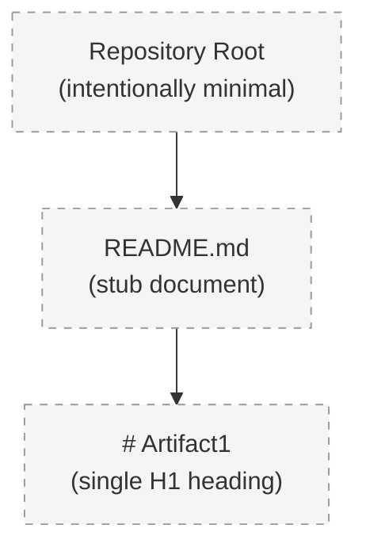
```mermaid
flowchart TD
    Root["Repository Root<br/>(intentionally minimal)"]
    Readme["README.md<br/>(stub document)"]
    Heading["# Artifact1<br/>(single H1 heading)"]

    Root --> Readme
    Readme --> Heading

    classDef placeholder fill:#f5f5f5,stroke:#999,stroke-dasharray: 5 5
    class Root,Readme,Heading placeholder
```

The structure above represents the complete component inventory at the time of this specification. No subsystems, modules, services, libraries, or supporting packages exist beneath the root.

#### 1.2.2.3 Core Technical Approach

No technical approach can be inferred from the current repository state. The codebase does not declare a programming language, runtime, framework, build system, or deployment target. Specifically:

| Technical Indicator | Present? | Implication |
|---------------------|----------|-------------|
| Language Source Files | No | Implementation language undetermined |
| Package / Dependency Manifest | No | Runtime ecosystem undetermined |
| Build or Task Configuration | No | Build pipeline undetermined |
| Containerization Definitions | No | Deployment model undetermined |
| Continuous Integration Configuration | No | Quality gate posture undetermined |

### 1.2.3 Success Criteria

#### 1.2.3.1 Measurable Objectives

No measurable objectives are stated in the repository. There is no objectives-and-key-results document, project plan, or acceptance-criteria definition committed to the codebase. Establishing measurable objectives is a prerequisite activity that must occur prior to a meaningful update of this subsection.

#### 1.2.3.2 Critical Success Factors

No critical success factors have been declared. The repository contains no governance documentation, risk register, or executive alignment artifact that would constitute a verifiable source for success-factor statements.

#### 1.2.3.3 Key Performance Indicators

No KPIs are defined in any committed file. The following table summarizes the categories of KPIs that would typically be specified for an enterprise system, all of which remain undefined for "Artifact1" at this time:

| KPI Category | Defined in Repository? | Specification Status |
|--------------|------------------------|----------------------|
| Functional Outcomes | No | To be defined |
| Reliability / Availability | No | To be defined |
| Performance / Latency | No | To be defined |
| Adoption / Usage | No | To be defined |
| Cost / Efficiency | No | To be defined |

---

## 1.3 Scope

### 1.3.1 In-Scope

#### 1.3.1.1 Core Features and Functionalities

The repository does not enumerate any features, functions, user stories, or capability statements. Consequently, no in-scope features can be authoritatively listed. This subsection presents the structural placeholders that future revisions of the specification are expected to populate:

| Capability Class | Currently Defined? | Source of Future Definition |
|------------------|--------------------|-----------------------------|
| Must-Have Capabilities | No | Future requirements input |
| Primary User Workflows | No | Future requirements input |
| Essential Integrations | No | Future architecture decisions |
| Key Technical Requirements | No | Future technology selection |

#### 1.3.1.2 Primary User Workflows

No user workflows are described in the repository. There are no flow diagrams, user-journey documents, use-case descriptions, or scenario walkthroughs. User workflows cannot be enumerated until requirements material is authored.

#### 1.3.1.3 Essential Integrations

No integrations are declared. The repository contains no API client code, connector modules, webhook receivers, or interface definitions that would substantiate an integration list.

#### 1.3.1.4 Key Technical Requirements

No technical requirements are recorded. The repository contains no non-functional requirements document, capacity model, performance budget, or compliance attestation. The technical-requirements register is empty.

### 1.3.2 Implementation Boundaries

#### 1.3.2.1 System Boundaries

The system boundary is currently coextensive with the single `README.md` file at the repository root. No external interfaces, runtime processes, persistent stores, or networked components extend the boundary beyond this static artifact.

#### 1.3.2.2 User Groups Covered

No user groups are declared as covered or excluded. The repository does not specify entitlement tiers, access roles, or audience segmentation.

#### 1.3.2.3 Geographic and Market Coverage

No geographic deployment regions, jurisdictions, locales, or markets are declared in the repository. Geographic coverage is undefined and will require explicit specification in future revisions.

#### 1.3.2.4 Data Domains Included

No data domains, entity catalogs, schemas, or master-data references are present in the repository. The data scope is therefore presently unspecified.

| Boundary Dimension | Current State | Future Definition Source |
|--------------------|---------------|--------------------------|
| Process / Service Boundary | Single static document | Architectural design |
| User Group Boundary | Undefined | Stakeholder analysis |
| Geographic Boundary | Undefined | Business strategy |
| Data Domain Boundary | Undefined | Domain modeling |

### 1.3.3 Out-of-Scope

#### 1.3.3.1 Explicitly Excluded Features and Capabilities

The repository does not declare any exclusions. Because no in-scope feature set has been established, a formal out-of-scope list cannot be derived by complementation. Future revisions will populate this subsection once a baseline in-scope set is defined.

#### 1.3.3.2 Future Phase Considerations

No phased roadmap, release plan, or backlog is committed to the repository. Future-phase considerations are therefore not enumerable at this time.

#### 1.3.3.3 Integration Points Not Covered

Because no integration points are declared as in-scope, none can be classified as explicitly out-of-scope. This subsection will become populated in concert with subsection 1.3.1.3.

#### 1.3.3.4 Unsupported Use Cases

No use cases — supported or unsupported — are recorded in the repository. The unsupported-use-case list is therefore presently empty.

---

## 1.4 Repository State Assessment

### 1.4.1 Current Artifact State

The repository under specification is best characterized as a **documentation stub and state marker** rather than as a working software system. The verified contents are:

| Item | Description |
|------|-------------|
| File Count | One (`README.md`) |
| Folder Count | Zero subdirectories beneath root |
| Total Content | A single first-level Markdown heading naming the artifact "Artifact1" |
| Code Artifacts | None (no functions, classes, constants, imports, or globals) |
| Build / Runtime Behavior | None (no scripts, manifests, or executables) |
| External Dependencies | None declared |

### 1.4.2 Implications for This Specification

Given the empirically verified state of the repository, this Technical Specification's Introduction section is constructed to fulfill three principles:

1. **Factual Grounding** — Every statement in this section reflects evidence (or the documented absence of evidence) within the repository as of the time of authorship.
2. **Transparent Gaps** — Where the prompt for this section calls for content that the repository does not support, the gap is explicitly named rather than fabricated.
3. **Forward Compatibility** — The subsection structure mirrors the standard Introduction template so that, as the repository matures and additional content is committed, each subsection has a defined location for substantive updates.

### 1.4.3 Triggers for Specification Revision

This Introduction should be revised when any of the following changes occur in the repository:

| Trigger Event | Sections Likely to Require Update |
|---------------|-----------------------------------|
| Addition of a project description to `README.md` | 1.1.1, 1.1.2, 1.2.1 |
| Introduction of source code or configuration files | 1.2.2, 1.2.3, 1.3.1 |
| Commitment of a requirements or charter document | 1.1.2, 1.1.3, 1.1.4, 1.2.3 |
| Declaration of integrations or external interfaces | 1.2.1.3, 1.3.1.3 |
| Addition of stakeholder or ownership metadata | 1.1.3 |

---

## 1.5 References

### 1.5.1 Files Examined

- `README.md` — The sole content-bearing file in the repository. Contains a single first-level Markdown heading declaring the artifact name "Artifact1." Used as the definitive source for the project identifier and as evidence of the repository's placeholder state.

### 1.5.2 Folders Explored

- `` (repository root, depth 0) — Inspected to enumerate first-order children. Verified to contain only the `README.md` file with no subdirectories. Used as evidence that no additional modules, packages, configuration, or documentation hierarchies exist within the repository.

### 1.5.3 Searches Performed

- Semantic file search for source code, implementation, configuration, manifests, build scripts, dependency declarations, and entry-point indicators — all returned no results.
- Semantic folder search for application modules and project structure beneath the root — returned no results.
- Filesystem enumeration of the repository contents — confirmed `README.md` as the only repository-owned file.

### 1.5.4 Cross-Referenced Specification Sections

No other sections of this Technical Specification were referenced in the preparation of this Introduction, as the section-retrieval index for cross-referencing was empty at the time of authorship.

# 2. Product Requirements

## 2.1 Section Overview and Repository State Acknowledgment

### 2.1.1 Purpose of This Section

This section catalogues the discrete, testable features that compose "Artifact1," documents the functional requirements that govern those features, maps the relationships among them, and records the implementation considerations that constrain their realization. In conformance with the three principles established in §1.4.2 — **Factual Grounding**, **Transparent Gaps**, and **Forward Compatibility** — every claim made here is anchored in verifiable evidence drawn from the repository, every absence of evidence is explicitly named rather than filled with conjecture, and the subsection structure mirrors the standard Product Requirements template so that substantive content has a defined location once it is authored.

### 2.1.2 Current Feature Inventory

A direct enumeration of the repository (a single `README.md` file containing only the heading `# Artifact1`, as established in §1.1.1 and §1.4.1) yields the following inventory of discrete, testable features that can be authentically catalogued at this time:

| Inventory Dimension | Count / State | Evidence Source |
|---------------------|---------------|-----------------|
| Declared Features | Zero | `README.md` contains no feature declarations |
| Documented Functional Requirements | Zero | No requirements artifact present |
| Defined Acceptance Criteria | Zero | No acceptance-criteria definitions present |
| Identified Feature Dependencies | Zero | No features → no dependencies derivable |
| Declared Integration Points | Zero | Per §1.2.1.3 and §1.3.1.3 |
| Shared Components / Common Services | Zero | Per §1.2.2.2 (no components beyond README) |

### 2.1.3 Governing Principle for Feature Documentation

In keeping with the language pattern established in §1.1.2, **this specification deliberately refrains from inferring or fabricating features, requirement IDs, acceptance criteria, priorities, complexity ratings, or relationships.** Any such content must originate from authoritative product input (a Product Requirements Document, charter, user-story backlog, design specification, or committed source code) external to the present repository contents, and will be incorporated into subsequent revisions as that material becomes available.

The identification schemata described below (F-XXX for features and F-XXX-RQ-YYY for requirements) are defined here for **forward use**; no assignments of these identifiers are made in this revision because no feature or requirement has been declared in the repository to warrant assignment.

---

## 2.2 Feature Catalog

### 2.2.1 Catalog Status

The Feature Catalog is presently empty. The repository, in its verified state described in §1.4.1, contains no executable artifacts, no API definitions, no user-facing surfaces, and no requirement statements from which features could be authoritatively derived.

| Catalog Component | Currently Populated? | Source of Future Definition |
|-------------------|----------------------|-----------------------------|
| Feature Entries (F-XXX) | No | Future product requirements input |
| Feature Metadata | No | Future product requirements input |
| Feature Descriptions | No | Future business and technical context |
| Feature Dependencies | No | Future architecture and integration design |

### 2.2.2 Feature Identification Schema (Forward-Compatible)

When features are authored into the repository, each will be assigned a unique identifier conforming to the schema below. This schema is presented now so that subsequent revisions to this specification adopt a consistent identification convention from the first declared feature onward.

| Field | Format | Example Allocation Rule |
|-------|--------|-------------------------|
| Feature ID | `F-XXX` | Three-digit zero-padded sequence (`F-001`, `F-002`, …) |
| Requirement ID | `F-XXX-RQ-YYY` | Requirement `YYY` belongs to feature `XXX` |
| Status Set | Proposed / Approved / In Development / Completed | Lifecycle state at time of authoring |
| Priority Set | Critical / High / Medium / Low | Business-driven priority |

### 2.2.3 Feature Metadata Template

Each feature entry, once authored, will populate the following metadata template. The template is shown here without entries because no features have been declared.

| Metadata Field | Allowed Values | Status |
|----------------|----------------|--------|
| Unique ID | `F-XXX` | No assignments made |
| Feature Name | Free-form short name | No assignments made |
| Feature Category | Functional area label | No assignments made |
| Priority Level | Critical / High / Medium / Low | No assignments made |
| Status | Proposed / Approved / In Development / Completed | No assignments made |

### 2.2.4 Feature Description Template

Each feature entry, once authored, will provide a structured description with the fields below. As established in §1.1.2 (no core business problem) and §1.1.4 (no value proposition), none of these fields can presently be populated.

| Description Field | Purpose | Status |
|-------------------|---------|--------|
| Overview | One-paragraph description of what the feature does | Not populated |
| Business Value | Connection to objectives identified in §1.2.3.1 | Not populated (no objectives stated) |
| User Benefits | Connection to personas identified in §1.1.3 | Not populated (no personas identified) |
| Technical Context | Connection to components in §1.2.2.2 | Not populated (no components exist) |

### 2.2.5 Feature Dependencies Template

Each feature entry, once authored, will declare its dependencies along four dimensions. Because no features and no system topology exist in the repository, no dependencies can be derived in the present revision.

| Dependency Dimension | Definition | Status |
|----------------------|------------|--------|
| Prerequisite Features | Other F-XXX entries that must exist first | Not enumerable (no features) |
| System Dependencies | Internal subsystems required at runtime | Not enumerable (per §1.2.2.2) |
| External Dependencies | Third-party services, libraries, platforms | Not enumerable (per §1.2.1.3) |
| Integration Requirements | Contracts, brokers, identity providers, datastores | Not enumerable (per §1.2.1.3) |

---

## 2.3 Functional Requirements Table

### 2.3.1 Status of Functional Requirements

The Functional Requirements Table is presently empty. Because no features have been declared (§2.2.1), no requirements exist to be enumerated. The following summary records the empty state in tabular form for consistency with the pattern used throughout §1.3.

| Requirements Component | Currently Populated? | Source of Future Definition |
|------------------------|----------------------|-----------------------------|
| Requirement Entries (F-XXX-RQ-YYY) | No | Future product requirements input |
| Acceptance Criteria | No | Future product requirements input |
| Technical Specifications | No | Future architecture and design |
| Validation Rules | No | Future business rules and policy |

### 2.3.2 Requirement Identification Schema (Forward-Compatible)

The requirement identification convention is defined here for forward use. When requirements are authored, each will inherit the feature identifier of its parent feature and append a three-digit zero-padded requirement sequence.

| Component | Format | Example |
|-----------|--------|---------|
| Parent Feature ID | `F-XXX` | `F-001` |
| Requirement Sequence | `RQ-YYY` | `RQ-001`, `RQ-002`, … |
| Full Requirement ID | `F-XXX-RQ-YYY` | `F-001-RQ-001` |
| Reset Rule | Sequence restarts per feature | `RQ-YYY` begins at `001` for every new `F-XXX` |

### 2.3.3 Requirement Detail Template

Each requirement entry, once authored, will record the following detail fields. No entries appear here because no requirements have been declared.

| Field | Allowed Values | Status |
|-------|----------------|--------|
| Requirement ID | `F-XXX-RQ-YYY` | No assignments made |
| Description | Plain-language statement of the behavior | No assignments made |
| Acceptance Criteria | Testable conditions for completion | No assignments made |
| Priority | Must-Have / Should-Have / Could-Have | No assignments made |
| Complexity | High / Medium / Low | No assignments made |

### 2.3.4 Technical Specification Template

The technical-specification fields below will be populated once interfaces, data domains, and performance budgets are defined for the system (presently undefined per §1.2.2.1, §1.3.2.4, and §1.2.3.3).

| Field | Purpose | Current Status |
|-------|---------|----------------|
| Input Parameters | Names, types, and constraints of inputs | Not populated (no interfaces declared) |
| Output / Response | Names, types, and constraints of outputs | Not populated (no interfaces declared) |
| Performance Criteria | Latency, throughput, and capacity targets | Not populated (no KPIs declared) |
| Data Requirements | Domains, schemas, and master-data linkages | Not populated (no data domains declared) |

### 2.3.5 Validation Rules Template

The validation-rules fields below will be populated when business policy, data-quality constraints, security requirements, and compliance attestations are authored into the repository.

| Field | Purpose | Current Status |
|-------|---------|----------------|
| Business Rules | Policy and decision logic governing the requirement | Not populated (no policy declared) |
| Data Validation | Field-level checks, ranges, and formats | Not populated (no schemas declared) |
| Security Requirements | AuthN, AuthZ, confidentiality, integrity controls | Not populated (per §1.2.1.3) |
| Compliance Requirements | Regulatory and audit obligations | Not populated (per §1.3.2.3) |

---

## 2.4 Feature Relationships

### 2.4.1 Current State of Relationships

No feature relationships are evident in the repository. The section prompt explicitly directs that *"only feature relationships clearly evident in the requirements or source code"* be documented and that fabrication be avoided. Because both requirements and source code are absent (per §1.4.1), the four relationship dimensions resolve to the empty set.

| Relationship Dimension | Items Identified | Evidence Source |
|------------------------|------------------|-----------------|
| Feature Dependencies | Zero | No features declared |
| Integration Points | Zero | Per §1.2.1.3 and §1.3.1.3 |
| Shared Components | Zero | Per §1.2.2.2 |
| Common Services | Zero | Per §1.2.2.1 |

### 2.4.2 Feature Dependency Map

A feature dependency map renders the directed graph of "Feature A depends on Feature B" edges. With zero features (§2.2.1), the graph contains zero nodes and zero edges. The diagram below depicts the present empty state and the placeholder topology that future revisions will populate.

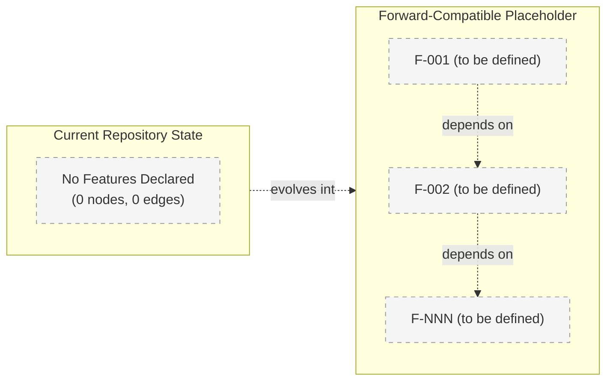
```mermaid
flowchart LR
    subgraph CurrentState["Current Repository State"]
        EmptyGraph["No Features Declared<br/>(0 nodes, 0 edges)"]
    end

    subgraph FutureState["Forward-Compatible Placeholder"]
        FutureFeatureA["F-001 (to be defined)"]
        FutureFeatureB["F-002 (to be defined)"]
        FutureFeatureN["F-NNN (to be defined)"]
        FutureFeatureA -.depends on.-> FutureFeatureB
        FutureFeatureB -.depends on.-> FutureFeatureN
    end

    CurrentState -.evolves into.-> FutureState

    classDef placeholder fill:#f5f5f5,stroke:#999,stroke-dasharray: 5 5
    class EmptyGraph,FutureFeatureA,FutureFeatureB,FutureFeatureN placeholder
```

### 2.4.3 Integration Points

No integration points are declared. As recorded in §1.2.1.3, the repository contains no connector code, no API contracts, no message-broker bindings, no identity-provider configurations, and no datastore adapters. Consequently, the integration-point register is empty.

| Integration Point Class | Declared in Repository? | Cross-Reference |
|-------------------------|-------------------------|-----------------|
| Upstream Data Sources | No | §1.2.1.3 |
| Downstream Consumers | No | §1.2.1.3 |
| Identity / SSO Providers | No | §1.2.1.3 |
| Observability Platforms | No | §1.2.1.3 |
| Storage / Persistence Layers | No | §1.2.1.3 |

### 2.4.4 Shared Components and Common Services

No components exist in the repository beyond the `README.md` stub document (per §1.2.2.2); therefore no component can be classified as "shared" and no service can be classified as "common." This subsection is recorded as empty rather than populated with speculative entries.

| Sharing Dimension | Items Identified | Cross-Reference |
|-------------------|------------------|-----------------|
| Shared Libraries | Zero | §1.2.2.2 |
| Common Services | Zero | §1.2.2.1 |
| Shared Data Models | Zero | §1.3.2.4 |
| Common Utilities | Zero | §1.2.2.2 |

---

## 2.5 Implementation Considerations

### 2.5.1 Status of Implementation Considerations

Implementation considerations describe the technical constraints, performance requirements, scalability strategies, security implications, and maintenance obligations of each feature. Because no features are declared and no implementation exists (per §1.2.2.3 and §1.4.1), no feature-scoped implementation considerations can be documented in this revision. The subsections below preserve the canonical taxonomy for forward use.

### 2.5.2 Consideration Categories

#### 2.5.2.1 Technical Constraints

No technical constraints can be attributed to features that do not yet exist. The repository declares no programming language, runtime, framework, build system, or deployment target (per §1.2.2.3), so the constraint set is empty.

| Constraint Class | Currently Specified? | Future Source |
|------------------|----------------------|---------------|
| Language / Runtime Constraints | No | Technology selection |
| Framework Constraints | No | Architecture design |
| Platform / Deployment Constraints | No | Operating model decisions |
| Interoperability Constraints | No | Integration design |

#### 2.5.2.2 Performance Requirements

No performance requirements are present. As recorded in §1.2.3.3, no KPIs are defined for latency, throughput, reliability, or cost. The performance-requirement register is therefore empty.

| Performance Dimension | Currently Specified? | Future Source |
|-----------------------|----------------------|---------------|
| Latency Budgets | No | Non-functional requirements |
| Throughput Targets | No | Capacity planning |
| Concurrency Limits | No | Workload modeling |
| Resource Utilization Ceilings | No | Cost and capacity policy |

#### 2.5.2.3 Scalability Considerations

No scalability considerations are recorded. With no components (§1.2.2.2) and no capacity model (§1.3.1.4), neither horizontal nor vertical scaling strategies can be authored at this time.

| Scalability Dimension | Currently Specified? | Future Source |
|-----------------------|----------------------|---------------|
| Horizontal Scale Strategy | No | Architecture design |
| Vertical Scale Limits | No | Capacity planning |
| State / Session Affinity | No | Architecture design |
| Backpressure / Flow Control | No | Reliability engineering |

#### 2.5.2.4 Security Implications

No security implications can be recorded against features that do not exist. The repository declares no authentication module, no authorization model, no secrets-management strategy, and no cryptographic posture (per §1.2.1.3).

| Security Dimension | Currently Specified? | Future Source |
|--------------------|----------------------|---------------|
| Authentication | No | Identity-management design |
| Authorization | No | Access-control policy |
| Data Protection (at rest / in transit) | No | Security architecture |
| Auditability | No | Compliance specification |

#### 2.5.2.5 Maintenance Requirements

No maintenance requirements are present. The repository contains no operational runbooks, no upgrade procedures, no telemetry instrumentation, and no support-tier definitions (per §1.1.3 and §1.2.1.3).

| Maintenance Dimension | Currently Specified? | Future Source |
|-----------------------|----------------------|---------------|
| Patching / Upgrade Cadence | No | Operating model decisions |
| Observability and Logging | No | Reliability engineering |
| Incident Response Procedures | No | Operations playbook |
| Backup and Recovery | No | Data-management policy |

---

## 2.6 Traceability Matrix

### 2.6.1 Status of Traceability Matrix

A traceability matrix correlates each requirement to its parent feature, its source authority, its acceptance test, and its implementation artifact. With zero requirements declared (§2.3.1) and zero implementation artifacts present (§1.4.1), the traceability matrix contains zero rows. The schema is preserved below for forward use.

### 2.6.2 Matrix Schema (Forward-Compatible)

The matrix will be populated as features and requirements are authored. Each row represents a single requirement and links it to its governing artifacts.

| Column | Purpose | Populated in This Revision? |
|--------|---------|-----------------------------|
| Requirement ID | `F-XXX-RQ-YYY` identifier | No (no requirements declared) |
| Source Authority | Origin document or stakeholder | No (no requirements declared) |
| Acceptance Test Reference | Verification artifact | No (no tests declared) |
| Implementation Artifact | Code, configuration, or asset | No (no implementation declared) |

### 2.6.3 Cross-Reference to Section 1 Anchors

The empty state of Section 2 is consistent with — and corroborated by — the following anchors from Section 1. This cross-reference table itself acts as the operative traceability artifact in the present revision, mapping each Section 2 subsection to the Section 1 evidence that substantiates its empty state.

| Section 2 Subsection | Corroborating Section 1 Anchor | Nature of Corroboration |
|----------------------|-------------------------------|-------------------------|
| 2.2 Feature Catalog | §1.3.1.1 | No core features and functionalities |
| 2.3 Functional Requirements Table | §1.3.1.4 | No key technical requirements |
| 2.4.2 Feature Dependency Map | §1.2.2.2 | No major system components |
| 2.4.3 Integration Points | §1.2.1.3, §1.3.1.3 | No enterprise integration declared |
| 2.4.4 Shared Components | §1.2.2.1, §1.2.2.2 | No system capabilities or components |
| 2.5.2.1 Technical Constraints | §1.2.2.3 | No technical approach defined |
| 2.5.2.2 Performance Requirements | §1.2.3.3 | No KPIs defined |
| 2.5.2.3 Scalability Considerations | §1.3.1.4 | No technical requirements declared |
| 2.5.2.4 Security Implications | §1.2.1.3 | No identity, auth, or security declared |
| 2.5.2.5 Maintenance Requirements | §1.1.3, §1.2.1.3 | No stakeholders or operability declared |

---

## 2.7 Process Flow for Future Population

### 2.7.1 Activation Workflow

The diagram below describes the lifecycle by which a future contribution to the repository transitions a subsection of Section 2 from "empty placeholder" to "substantively populated." It is presented as a process-flow reference for the maintainers of this specification.

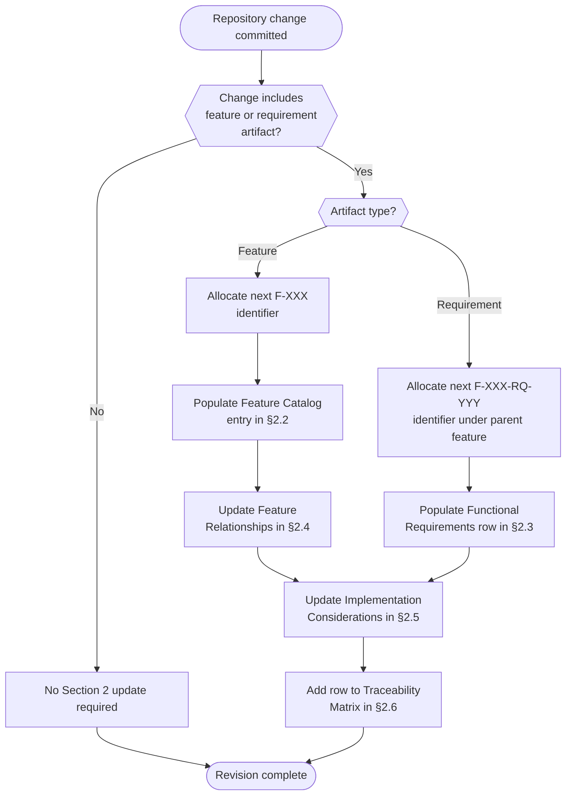
```mermaid
flowchart TD
    Start(["Repository change committed"])
    Detect{{"Change includes<br/>feature or requirement<br/>artifact?"}}
    NoChange["No Section 2 update required"]
    Classify{{"Artifact type?"}}
    AddFeature["Allocate next F-XXX<br/>identifier"]
    AddRequirement["Allocate next F-XXX-RQ-YYY<br/>identifier under parent feature"]
    PopulateCatalog["Populate Feature Catalog<br/>entry in §2.2"]
    PopulateRequirements["Populate Functional<br/>Requirements row in §2.3"]
    UpdateRelationships["Update Feature<br/>Relationships in §2.4"]
    UpdateImpl["Update Implementation<br/>Considerations in §2.5"]
    UpdateMatrix["Add row to Traceability<br/>Matrix in §2.6"]
    EndNode(["Revision complete"])

    Start --> Detect
    Detect -- "No" --> NoChange --> EndNode
    Detect -- "Yes" --> Classify
    Classify -- "Feature" --> AddFeature --> PopulateCatalog --> UpdateRelationships
    Classify -- "Requirement" --> AddRequirement --> PopulateRequirements
    UpdateRelationships --> UpdateImpl
    PopulateRequirements --> UpdateImpl
    UpdateImpl --> UpdateMatrix --> EndNode
```

### 2.7.2 Triggers for Section Revision

Following the pattern established in §1.4.3, the table below enumerates the trigger events that will cause specific subsections of Section 2 to require update.

| Trigger Event | Subsections Likely to Require Update |
|---------------|--------------------------------------|
| Authoring of a feature description into the repository | 2.2.3, 2.2.4, 2.2.5, 2.4.2 |
| Authoring of a functional requirement | 2.3.3, 2.3.4, 2.3.5, 2.6 |
| Declaration of an integration or external interface | 2.4.3, 2.5.2.4 |
| Introduction of a shared library or common service | 2.4.4, 2.5.2.1, 2.5.2.3 |
| Declaration of a non-functional requirement or KPI | 2.5.2.2, 2.5.2.3 |
| Declaration of a security control or compliance obligation | 2.5.2.4, 2.3.5 |

### 2.7.3 Document Assumptions and Constraints

The following assumptions and constraints govern the present revision of Section 2 and are recorded explicitly so that future revisions can validate or supersede them.

| Identifier | Statement | Type |
|------------|-----------|------|
| A-2-01 | The repository contents on the day of authoring are exhaustively represented by the single `README.md` file at the root. | Assumption |
| A-2-02 | Future feature and requirement contributions will be made directly to this repository, not to a parallel system. | Assumption |
| C-2-01 | No F-XXX or F-XXX-RQ-YYY identifier may be assigned in this revision because no corresponding artifact exists. | Constraint |
| C-2-02 | Tables in this section adhere to the four-column maximum specified by the section prompt. | Constraint |

---

## 2.8 References

### 2.8.1 Files Examined

- `README.md` — The sole content-bearing file in the repository. Contains a single first-level Markdown heading declaring the artifact name "Artifact1." Examined as the definitive source for what features, requirements, components, dependencies, and integrations are currently declared (none).

### 2.8.2 Folders Explored

- `` (repository root, depth 0) — Inspected to enumerate first-order children and to confirm that no subdirectories, modules, package boundaries, or feature implementations exist beneath the root. Used as evidence that the Feature Catalog (§2.2), Functional Requirements Table (§2.3), Feature Relationships (§2.4), and Implementation Considerations (§2.5) are all authentically empty.

### 2.8.3 Cross-Referenced Specification Sections

- §1.1.1 Project Overview — Provided the authoritative artifact identifier "Artifact1" and the placeholder-state characterization referenced throughout Section 2.
- §1.1.2 Core Business Problem — Established the non-fabrication principle that Section 2 inherits and applies to features and requirements.
- §1.1.3 Key Stakeholders and Users — Provided the basis for the empty User Benefits field in §2.2.4 and the empty Maintenance Requirements register in §2.5.2.5.
- §1.1.4 Expected Business Impact and Value Proposition — Provided the basis for the empty Business Value field in §2.2.4.
- §1.2.1.3 Enterprise Landscape Integration — Provided the basis for the empty integration-point register in §2.4.3 and the empty security register in §2.5.2.4.
- §1.2.2.1 Primary System Capabilities — Provided the basis for the empty Common Services register in §2.4.4.
- §1.2.2.2 Major System Components — Provided the basis for the empty Shared Components register in §2.4.4 and the empty Feature Dependency Map in §2.4.2.
- §1.2.2.3 Core Technical Approach — Provided the basis for the empty Technical Constraints register in §2.5.2.1.
- §1.2.3.1 Measurable Objectives — Provided the basis for the empty Business Value field in §2.2.4.
- §1.2.3.3 Key Performance Indicators — Provided the basis for the empty Performance Requirements register in §2.5.2.2 and the empty Performance Criteria field in §2.3.4.
- §1.3.1.1 Core Features and Functionalities — Direct corroboration that no features exist to populate §2.2.
- §1.3.1.3 Essential Integrations — Direct corroboration that no integrations exist to populate §2.4.3.
- §1.3.1.4 Key Technical Requirements — Direct corroboration that no technical requirements exist to populate §2.3 and §2.5.2.3.
- §1.3.2.3 Geographic and Market Coverage — Provided the basis for the empty Compliance Requirements field in §2.3.5.
- §1.3.2.4 Data Domains Included — Provided the basis for the empty Data Requirements field in §2.3.4.
- §1.4.1 Current Artifact State — Established the verified repository composition that Section 2 inherits as its evidentiary baseline.
- §1.4.2 Implications for This Specification — Established the three governing principles (Factual Grounding, Transparent Gaps, Forward Compatibility) that Section 2 applies throughout.
- §1.4.3 Triggers for Specification Revision — Provided the pattern for the trigger table presented in §2.7.2.

---

# 3. Technology Stack

## 3.1 Section Overview and Repository State Acknowledgment

### 3.1.1 Purpose of This Section

This section catalogs the programming languages, frameworks, libraries, open-source dependencies, third-party services, data persistence mechanisms, and development/deployment tooling that compose the technology stack of "Artifact1." In strict conformance with the three principles established in §1.4.2 — **Factual Grounding**, **Transparent Gaps**, and **Forward Compatibility** — every claim made here is anchored in verifiable evidence drawn from the repository, every absence of evidence is explicitly named rather than supplanted by conjecture, and the subsection structure mirrors the standard Technology Stack template so that substantive content has a defined location once technology selections are committed to the repository.

### 3.1.2 Current Technology Inventory

A direct enumeration of the repository (a single `README.md` file containing only the heading `# Artifact1`, as established in §1.1.1 and §1.4.1) yields the following inventory of technology stack components that can be authentically catalogued at this time:

| Inventory Dimension | Count / State | Evidence Source |
|---------------------|---------------|-----------------|
| Declared Programming Languages | Zero | No language source files (per §1.2.2.3) |
| Declared Frameworks / Libraries | Zero | No package manifests or import statements |
| Declared Open Source Dependencies | Zero | No dependency manifests or lockfiles |
| Declared Third-Party Services | Zero | No external integration touchpoints (per §1.2.1.3) |
| Declared Databases / Storage Engines | Zero | No persistence layer declared (per §1.2.1.3) |
| Declared Development / Deployment Tools | Zero | No build, container, or CI/CD configurations (per §1.2.2.3) |

### 3.1.3 Governing Principle for Technology Stack Documentation

In keeping with the non-fabrication language pattern established in §1.1.2 and §2.1.3, **this specification deliberately refrains from inferring or fabricating language selections, framework versions, dependency declarations, integration endpoints, persistence engines, or deployment tooling.** Any such content must originate from authoritative engineering input (a committed manifest file, configuration file, source code module, infrastructure-as-code definition, or signed architecture decision record) external to the present repository contents, and will be incorporated into subsequent revisions as that material becomes available.

The Default Technology Stack referenced in the section prompt is treated as a presentational option only. It is **not** an authoritative commitment, and no element of it (including AWS, Docker, Terraform, GitHub Actions, Python, Flask, Auth0, MongoDB, Langchain, React, TypeScript, TailwindCSS, React-Native, Swift, Kotlin, Objective-C, or ElectronJS) is asserted as part of the stack for "Artifact1" in this revision. The schemata presented in §3.2 through §3.7 are defined here for **forward use**; no concrete assignments of language, version, package, vendor, host, or platform are made because no corresponding artifact exists in the repository to warrant assignment.

---

## 3.2 Programming Languages

### 3.2.1 Current State of Language Declarations

The repository declares no implementation programming language. The sole file, `README.md`, is authored in Markdown — a documentation markup format, not an implementation language — and no source files in any general-purpose programming language are present. This finding is consistent with §1.2.2.3, which records "Language Source Files: No / Implementation language undetermined," and with §1.4.1, which records the absence of any functions, classes, constants, imports, or globals.

| Language Dimension | Currently Specified? | Evidence Source |
|--------------------|----------------------|-----------------|
| Primary Implementation Language | No | No source files committed |
| Secondary / Auxiliary Languages | No | No source files committed |
| Markup / Configuration Languages | Markdown only (in `README.md`) | Documentation format, not implementation |
| Language-Version Pinning | No | No `.python-version`, `.nvmrc`, `go.mod`, `pom.xml`, or equivalent |

### 3.2.2 Language Selection Schema (Forward-Compatible)

When implementation source code is committed to the repository, each declared language will be recorded against the schema below. The schema is presented now so that subsequent revisions adopt a consistent language-documentation convention from the first declared language onward.

| Field | Format | Example Allocation Rule |
|-------|--------|-------------------------|
| Language Name | Canonical name (e.g., "Python", "TypeScript", "Go") | Match the language ecosystem's official identifier |
| Version / Edition | Major.Minor (and patch where pinned) | Sourced from the version manifest committed alongside the code |
| Platform / Component | Functional area within the system | One of: backend service, web frontend, mobile, CLI, infrastructure, data pipeline |
| Selection Justification | Free-form rationale citing evidence | Tied to a committed architecture decision record |
| Constraints / Dependencies | Free-form list of runtime or toolchain prerequisites | Tied to committed manifest entries |

### 3.2.3 Language Selection Criteria (Reserved for Future Population)

No language selection criteria can be authored in the present revision because no language has been chosen. When a language is selected and committed, the criteria recorded against it will conform to the dimensions below.

| Selection Criterion | Status | Future Source |
|---------------------|--------|---------------|
| Ecosystem Fit (libraries, talent, tooling) | Not specified | Architecture decision record |
| Performance Profile (latency, throughput) | Not specified | Tied to §2.5.2.2 once populated |
| Security and Memory Safety Posture | Not specified | Tied to §2.5.2.4 once populated |
| Interoperability with Existing Systems | Not specified | Tied to §1.2.1.3 once integrations are declared |
| Operational Maturity (LTS, vendor support) | Not specified | Operating model decision |

---

## 3.3 Frameworks & Libraries

### 3.3.1 Current State of Framework Declarations

The repository declares no application frameworks and no first-party or third-party libraries. There are no framework-specific configuration files (no `manage.py`, no `next.config.js`, no `vite.config.ts`, no `tsconfig.json`, no `pyproject.toml`, no `Gemfile`, no `build.gradle`, no `pom.xml`, no `Cargo.toml`, no `go.mod`), no import statements (no source code exists to contain them), and no vendor directories. This finding is consistent with §1.2.2.3 ("Package / Dependency Manifest: No / Runtime ecosystem undetermined") and §2.5.2.1 (Framework Constraints empty).

| Framework Dimension | Currently Specified? | Evidence Source |
|---------------------|----------------------|-----------------|
| Application / Web Framework | No | No framework configuration file |
| UI / Presentation Library | No | No frontend source or build manifest |
| Domain / Business-Logic Library | No | No source code committed |
| Cross-Cutting Library (logging, validation) | No | No source code committed |
| Test Framework | No | No test directory or test configuration |

### 3.3.2 Framework Catalog Schema (Forward-Compatible)

When frameworks and libraries are committed to the repository, each entry will be recorded against the schema below. As with the language schema in §3.2.2, this schema is preserved for forward use only.

| Field | Format | Example Allocation Rule |
|-------|--------|-------------------------|
| Framework / Library Name | Official package name | Match the registry identifier (e.g., PyPI, npm) |
| Version / Version Range | Semantic version or constraint | Sourced from the committed manifest |
| Category | Functional area | One of: web framework, UI library, ORM, validation, observability, testing |
| Compatibility Requirements | Free-form list of platform/version constraints | Tied to language and runtime in §3.2 |
| Selection Justification | Free-form rationale citing evidence | Tied to a committed architecture decision record |

### 3.3.3 Compatibility Requirements (Reserved for Future Population)

No compatibility requirements can be recorded because no framework or library is declared. The dimensions below will be populated against each future framework entry.

| Compatibility Dimension | Status | Future Source |
|-------------------------|--------|---------------|
| Required Language Version | Not specified | Tied to §3.2 once a language is declared |
| Required Runtime / Engine Version | Not specified | Tied to §3.7 once a runtime is declared |
| Operating-System Compatibility | Not specified | Deployment-target decision |
| Inter-Framework Compatibility | Not specified | Architecture design |

---

## 3.4 Open Source Dependencies

### 3.4.1 Current State of Open Source Dependency Declarations

The repository contains no open-source dependency manifest of any package registry. No `requirements.txt`, `Pipfile`, `pyproject.toml`, `poetry.lock`, `package.json`, `package-lock.json`, `yarn.lock`, `pnpm-lock.yaml`, `pom.xml`, `build.gradle`, `Cargo.toml`, `Cargo.lock`, `go.mod`, `go.sum`, `Gemfile`, `Gemfile.lock`, `composer.json`, or equivalent declaration file is committed. No vendored dependency directories exist (no subdirectories exist at all, per §1.4.1). This finding is consistent with §1.2.1.3 (no external integration touchpoints) and §2.2.5 (External Dependencies not enumerable).

| Dependency Dimension | Currently Specified? | Evidence Source |
|----------------------|----------------------|-----------------|
| Direct Runtime Dependencies | Zero | No manifest declared |
| Transitive Runtime Dependencies | Zero | No lockfile declared |
| Development / Test Dependencies | Zero | No development manifest declared |
| Vendored / Vendored-Local Dependencies | Zero | No subdirectories present |
| License Inventory | Not applicable | No dependencies to license-audit |

### 3.4.2 Dependency Manifest Schema (Forward-Compatible)

When a package manifest is committed to the repository, each declared dependency will be recorded against the schema below. The schema accommodates the most common open-source package registries.

| Field | Format | Example Allocation Rule |
|-------|--------|-------------------------|
| Package Name | Registry identifier | Sourced from the committed manifest |
| Version / Version Constraint | Semantic version or constraint expression | Match the manifest declaration verbatim |
| Registry | Source registry | One of: PyPI, npm, Maven Central, crates.io, Go modules, RubyGems, NuGet, Packagist, or other |
| Dependency Class | Functional role | One of: runtime, dev/test, build, optional, peer |
| License | SPDX identifier | Sourced from the package metadata at the pinned version |

### 3.4.3 Dependency-Management Posture (Reserved for Future Population)

No dependency-management posture can be authored in the present revision. The dimensions below will be populated once a package manifest is committed.

| Posture Dimension | Status | Future Source |
|-------------------|--------|---------------|
| Pinning Strategy (exact vs. range) | Not specified | Engineering practice decision |
| Lockfile Discipline (committed vs. ignored) | Not specified | Engineering practice decision |
| Vulnerability-Scanning Cadence | Not specified | Security policy (tied to §2.5.2.4 once populated) |
| Update / Renovation Process | Not specified | Maintenance policy (tied to §2.5.2.5 once populated) |

---

## 3.5 Third-Party Services

### 3.5.1 Current State of Third-Party Service Declarations

The repository declares no integrations with third-party services. No external API client code, no SDK references, no authentication service configuration (no Auth0, Okta, AWS Cognito, Firebase Auth, or equivalent), no observability integration (no Datadog, New Relic, Prometheus, OpenTelemetry, Sentry, or equivalent), and no cloud-platform configuration (no AWS, GCP, Azure, Cloudflare, Vercel, or equivalent) is committed. This finding is the direct corollary of §1.2.1.3, which records "Identity / SSO Providers: Not declared," "Observability Platforms: Not declared," and "Downstream Consumers: Not declared," and of §2.4.3, which records zero declared integration points.

| Service Class | Currently Specified? | Cross-Reference |
|---------------|----------------------|-----------------|
| External APIs / Integrations | No | §1.2.1.3, §2.4.3 |
| Authentication / Identity Providers | No | §1.2.1.3, §2.5.2.4 |
| Authorization / Access-Control Services | No | §2.5.2.4 |
| Monitoring / Observability Platforms | No | §1.2.1.3, §2.5.2.5 |
| Cloud Hosting / Platform-as-a-Service | No | §1.2.2.3 |
| Payment / Messaging / Notification Services | No | §1.2.1.3 |

### 3.5.2 Third-Party Service Catalog Schema (Forward-Compatible)

When third-party services are integrated and committed, each entry will be recorded against the schema below.

| Field | Format | Example Allocation Rule |
|-------|--------|-------------------------|
| Service Name | Vendor's canonical product name | Sourced from the committed integration configuration |
| Service Class | Functional area | One of: identity, observability, cloud platform, messaging, payments, AI/ML, content delivery, other |
| Vendor / Provider | Legal entity providing the service | Sourced from the contract or service agreement |
| Integration Mode | Communication pattern | One of: REST, GraphQL, gRPC, SDK, webhook, SSO/federation |
| Authentication Method to the Service | How the system authenticates to the service | One of: API key, OAuth 2.0 client credentials, mTLS, signed JWT, IAM role |

### 3.5.3 Integration Considerations (Reserved for Future Population)

No integration considerations can be authored because no third-party service is declared. The dimensions below will be populated against each future service entry.

| Consideration Dimension | Status | Future Source |
|-------------------------|--------|---------------|
| Service-Level Objectives (SLO) Alignment | Not specified | Operating model decision |
| Secrets Management Strategy | Not specified | Tied to §2.5.2.4 once populated |
| Data-Residency / Compliance Implications | Not specified | Tied to §1.3.2.3 once populated |
| Failover and Degradation Behavior | Not specified | Reliability engineering design |

---

## 3.6 Databases & Storage

### 3.6.1 Current State of Persistence Declarations

The repository declares no databases, no caches, and no object-storage services. No database adapter, ORM configuration, connection string, environment variable referencing a datastore, schema definition (no `.sql` files, no migration directory, no `models.py`, no schema files), cache configuration (no Redis, Memcached, or equivalent), or object-storage configuration (no S3, GCS, Azure Blob, or equivalent) is committed. This finding is consistent with §1.2.1.3 ("Storage / Persistence Layers: Not declared") and §1.3.2.4 (no data domains declared).

| Persistence Class | Currently Specified? | Cross-Reference |
|-------------------|----------------------|-----------------|
| Primary Operational Database | No | §1.2.1.3 |
| Secondary / Analytical Database | No | §1.2.1.3 |
| Cache Layer | No | §1.2.1.3 |
| Object / Blob Storage | No | §1.2.1.3 |
| Message Queue / Stream Storage | No | §1.2.1.3 |
| Search Index | No | §1.2.1.3 |

### 3.6.2 Persistence Catalog Schema (Forward-Compatible)

When a persistence engine is committed, each entry will be recorded against the schema below.

| Field | Format | Example Allocation Rule |
|-------|--------|-------------------------|
| Engine Name | Canonical product name | Match the vendor's identifier (e.g., "PostgreSQL", "Redis", "Amazon S3") |
| Engine Version | Major.Minor (and patch where pinned) | Sourced from the deployment or container configuration |
| Persistence Role | Functional role in the system | One of: primary OLTP, OLAP, cache, object storage, queue, search index |
| Data Domains Served | Domains from §1.3.2.4 | Tied to data-domain entries once §1.3.2.4 is populated |
| Adapter / Driver | Library used to access the engine | Tied to a future entry in §3.4 |

### 3.6.3 Data Persistence Strategy (Reserved for Future Population)

No data persistence strategy can be authored because no engine is declared. The dimensions below will be populated once persistence engines are committed.

| Strategy Dimension | Status | Future Source |
|--------------------|--------|---------------|
| Consistency Model (strong / eventual) | Not specified | Architecture design |
| Backup and Recovery Approach | Not specified | Tied to §2.5.2.5 once populated |
| Encryption at Rest | Not specified | Tied to §2.5.2.4 once populated |
| Encryption in Transit | Not specified | Tied to §2.5.2.4 once populated |
| Retention and Archival Policy | Not specified | Data-management policy |
| Sharding / Partitioning Strategy | Not specified | Tied to §2.5.2.3 once populated |

---

## 3.7 Development & Deployment

### 3.7.1 Current State of Development and Deployment Declarations

The repository contains no development tooling, build system, containerization, or continuous-integration configuration. The following file classes are explicitly absent: `Dockerfile`, `docker-compose.yml`, OCI image manifests, `.github/workflows/`, `.gitlab-ci.yml`, `Jenkinsfile`, `.circleci/`, `azure-pipelines.yml`, `.tf` / `.hcl` (Terraform), CloudFormation templates, Pulumi / CDK source files, `Makefile`, `Taskfile.yml`, `npm` script definitions (no `package.json` exists), `.editorconfig`, `.pre-commit-config.yaml`, linter or formatter configuration files. This finding is consistent with §1.2.2.3, which records "Build or Task Configuration: No," "Containerization Definitions: No," and "Continuous Integration Configuration: No."

| Development / Deployment Class | Currently Specified? | Evidence Source |
|--------------------------------|----------------------|-----------------|
| Development-Environment Configuration | No | No `.editorconfig`, devcontainer, or env-template files |
| Code Quality / Linting / Formatting Configuration | No | No linter or formatter configuration files |
| Build System / Task Runner | No | No Makefile, build manifest, or task definition |
| Containerization Definition | No | No Dockerfile or compose manifest |
| Infrastructure-as-Code Definition | No | No Terraform, CloudFormation, Pulumi, or CDK files |
| Continuous-Integration Workflow | No | No CI pipeline configuration |
| Continuous-Deployment / Release Workflow | No | No CD pipeline or release-automation configuration |

### 3.7.2 Development & Deployment Catalog Schema (Forward-Compatible)

When development and deployment tooling are committed, each entry will be recorded against the schema below.

| Field | Format | Example Allocation Rule |
|-------|--------|-------------------------|
| Tool Name | Canonical product name | Match the tool's official identifier |
| Tool Category | Functional area | One of: editor config, linter, formatter, build, container runtime, IaC, CI, CD, package registry |
| Version | Major.Minor (and patch where pinned) | Sourced from the committed configuration |
| Configuration File Path | Repository-relative path to the configuration | Path within the committed repository |
| Trigger / Scope | When and where the tool runs | One of: local pre-commit, pull-request CI, main-branch CI, scheduled, manual |

### 3.7.3 Development and Deployment Strategy (Reserved for Future Population)

No development or deployment strategy can be authored because no tooling is declared. The dimensions below will be populated once tooling is committed.

| Strategy Dimension | Status | Future Source |
|--------------------|--------|---------------|
| Branching and Merging Strategy | Not specified | Engineering practice decision |
| Build Reproducibility Approach | Not specified | Engineering practice decision |
| Container Image Registry | Not specified | Tied to §3.5 once a registry is declared |
| Deployment Targets (environments) | Not specified | Operating model decision |
| Release Cadence and Versioning | Not specified | Engineering practice decision |
| Quality Gates (test, security scan, license scan) | Not specified | Tied to §2.5.2.4 and §3.4.3 once populated |

---

## 3.8 Technology Stack Architecture Diagram

### 3.8.1 Current State and Forward-Compatible Topology

Following the pattern established in §1.2.2.2 (Major System Components) and §2.4.2 (Feature Dependency Map), the diagram below depicts both the present empty state of the technology stack and the placeholder topology that future revisions will populate as language, framework, dependency, service, persistence, and deployment selections are committed to the repository. Dashed styling indicates placeholder nodes for which no concrete selection has been made.

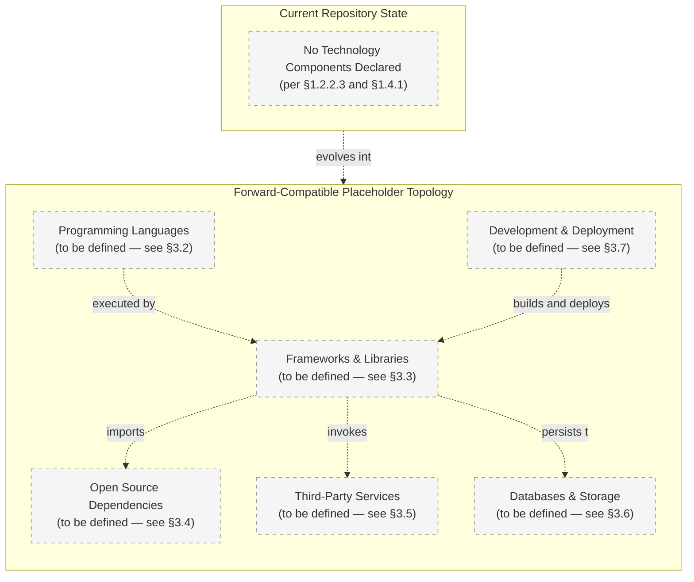
```mermaid
flowchart TB
    subgraph CurrentState["Current Repository State"]
        EmptyStack["No Technology Components Declared<br/>(per §1.2.2.3 and §1.4.1)"]
    end

    subgraph FutureState["Forward-Compatible Placeholder Topology"]
        direction TB
        LangPlaceholder["Programming Languages<br/>(to be defined — see §3.2)"]
        FmwkPlaceholder["Frameworks &amp; Libraries<br/>(to be defined — see §3.3)"]
        OSSPlaceholder["Open Source Dependencies<br/>(to be defined — see §3.4)"]
        SvcPlaceholder["Third-Party Services<br/>(to be defined — see §3.5)"]
        StorePlaceholder["Databases &amp; Storage<br/>(to be defined — see §3.6)"]
        DevOpsPlaceholder["Development &amp; Deployment<br/>(to be defined — see §3.7)"]

        LangPlaceholder -.executed by.-> FmwkPlaceholder
        FmwkPlaceholder -.imports.-> OSSPlaceholder
        FmwkPlaceholder -.invokes.-> SvcPlaceholder
        FmwkPlaceholder -.persists to.-> StorePlaceholder
        DevOpsPlaceholder -.builds and deploys.-> FmwkPlaceholder
    end

    CurrentState -.evolves into.-> FutureState

    classDef placeholder fill:#f5f5f5,stroke:#999,stroke-dasharray: 5 5
    class EmptyStack,LangPlaceholder,FmwkPlaceholder,OSSPlaceholder,SvcPlaceholder,StorePlaceholder,DevOpsPlaceholder placeholder
```

### 3.8.2 Interpretation of the Diagram

The `CurrentState` subgraph contains a single node that asserts the verified absence of every technology stack component. The `FutureState` subgraph illustrates the canonical layering that the stack will adopt once selections are committed: source code expressed in one or more **programming languages** (§3.2) is executed atop one or more **frameworks** (§3.3), which in turn consume **open-source dependencies** (§3.4), invoke **third-party services** (§3.5), and persist data to **databases and storage** (§3.6); the entire stack is produced and operated by **development and deployment tooling** (§3.7). All edges are dashed because no concrete relationships have yet been declared.

### 3.8.3 Diagram Maintenance Convention

Subsequent revisions of this specification will replace the placeholder nodes with concretely named selections as soon as the corresponding manifest, configuration, or source-code artifact is committed. The diagram is to be regenerated in lockstep with the catalog tables in §3.2 through §3.7 so that the visual and tabular representations remain mutually consistent.

---

## 3.9 Triggers for Technology Stack Revision

### 3.9.1 Trigger Events

Following the pattern established in §1.4.3 and §2.7.2, the table below enumerates the trigger events that will cause specific subsections of Section 3 to require update.

| Trigger Event | Subsections Likely to Require Update |
|---------------|--------------------------------------|
| Commitment of a source file in any general-purpose programming language | 3.2.1, 3.2.2, 3.2.3, 3.8 |
| Commitment of a package manifest (e.g., `requirements.txt`, `package.json`, `go.mod`) | 3.3.1, 3.3.2, 3.4.1, 3.4.2, 3.8 |
| Commitment of a framework-specific configuration file | 3.3.1, 3.3.2, 3.3.3, 3.8 |
| Commitment of an integration to a third-party service (SDK, API client, webhook handler) | 3.5.1, 3.5.2, 3.5.3, 3.8 |
| Commitment of a database adapter, ORM, schema, or migration file | 3.6.1, 3.6.2, 3.6.3, 3.8 |
| Commitment of a Dockerfile, container-compose file, or OCI image manifest | 3.7.1, 3.7.2, 3.8 |
| Commitment of an Infrastructure-as-Code file (Terraform, CloudFormation, Pulumi, CDK) | 3.7.1, 3.7.2, 3.7.3, 3.8 |
| Commitment of a CI / CD workflow file | 3.7.1, 3.7.2, 3.7.3 |
| Commitment of a linter, formatter, pre-commit, or `.editorconfig` file | 3.7.1, 3.7.2 |
| Commitment of an architecture decision record (ADR) endorsing a technology selection | 3.2.3, 3.3.3, 3.4.3, 3.5.3, 3.6.3, 3.7.3 |

### 3.9.2 Activation Workflow

The diagram below describes the lifecycle by which a future repository contribution transitions a subsection of Section 3 from "empty placeholder" to "substantively populated." It follows the pattern established in §2.7.1.

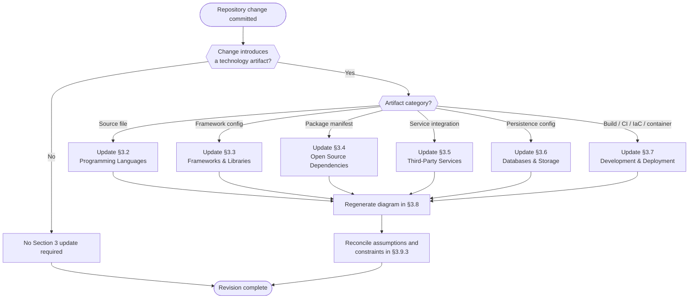
```mermaid
flowchart TD
    Start(["Repository change committed"])
    Detect{{"Change introduces<br/>a technology artifact?"}}
    NoChange["No Section 3 update required"]
    Classify{{"Artifact category?"}}
    LangBranch["Update §3.2<br/>Programming Languages"]
    FmwkBranch["Update §3.3<br/>Frameworks &amp; Libraries"]
    OSSBranch["Update §3.4<br/>Open Source Dependencies"]
    SvcBranch["Update §3.5<br/>Third-Party Services"]
    StoreBranch["Update §3.6<br/>Databases &amp; Storage"]
    DevOpsBranch["Update §3.7<br/>Development &amp; Deployment"]
    RegenDiagram["Regenerate diagram in §3.8"]
    UpdateAssumptions["Reconcile assumptions and<br/>constraints in §3.9.3"]
    EndNode(["Revision complete"])

    Start --> Detect
    Detect -- "No" --> NoChange --> EndNode
    Detect -- "Yes" --> Classify
    Classify -- "Source file" --> LangBranch --> RegenDiagram
    Classify -- "Framework config" --> FmwkBranch --> RegenDiagram
    Classify -- "Package manifest" --> OSSBranch --> RegenDiagram
    Classify -- "Service integration" --> SvcBranch --> RegenDiagram
    Classify -- "Persistence config" --> StoreBranch --> RegenDiagram
    Classify -- "Build / CI / IaC / container" --> DevOpsBranch --> RegenDiagram
    RegenDiagram --> UpdateAssumptions --> EndNode
```

### 3.9.3 Document Assumptions and Constraints

The following assumptions and constraints govern the present revision of Section 3 and are recorded explicitly so that future revisions can validate or supersede them. The identifier scheme mirrors §2.7.3.

| Identifier | Statement | Type |
|------------|-----------|------|
| A-3-01 | The repository contents on the day of authoring are exhaustively represented by the single `README.md` file at the root. | Assumption |
| A-3-02 | The Default Technology Stack referenced in the section prompt is a presentational option, not an authoritative commitment, and may only be applied when evidence in the repository indicates its adoption. | Assumption |
| A-3-03 | Future technology selections will be committed directly to this repository (as source files, manifests, configurations, or ADRs) rather than recorded only in a parallel system. | Assumption |
| C-3-01 | No technology component may be asserted as part of the stack in this revision because no corresponding artifact exists in the repository. | Constraint |
| C-3-02 | Technology selections (including but not limited to those in the Default Technology Stack) cannot be declared until a corresponding manifest, configuration file, or source code commitment is added to the repository. | Constraint |
| C-3-03 | Version numbers cannot be declared for any technology component in this revision because no component has been declared; future revisions must populate version fields whenever the corresponding manifest is committed. | Constraint |
| C-3-04 | Security implications, integration requirements, and compatibility requirements between components are deferred to future revisions, in alignment with the empty-state findings of §2.5.2.4 and §2.4.3. | Constraint |

---

## 3.10 Cross-Reference Anchors

### 3.10.1 Corroboration of Section 3 Empty States

Following the pattern established in §2.6.3, the table below maps each Section 3 subsection to the Section 1 and Section 2 anchors that corroborate its empty state. This cross-reference table acts as the operative traceability artifact for Section 3 in the present revision.

| Section 3 Subsection | Corroborating Anchor(s) | Nature of Corroboration |
|----------------------|-------------------------|-------------------------|
| §3.2 Programming Languages | §1.2.2.3, §1.4.1, §2.5.2.1 | No language source files; no technical approach defined |
| §3.3 Frameworks & Libraries | §1.2.2.3, §2.5.2.1 | No package manifest or framework configuration |
| §3.4 Open Source Dependencies | §1.2.1.3, §2.2.5, §2.4.3 | No external dependencies enumerable |
| §3.5 Third-Party Services | §1.2.1.3, §2.4.3, §2.5.2.4 | No integration points, no authentication, no observability |
| §3.6 Databases & Storage | §1.2.1.3, §1.3.2.4, §2.4.3 | No persistence layer; no data domains declared |
| §3.7 Development & Deployment | §1.2.2.3, §2.5.2.3, §2.5.2.5 | No build / container / CI configuration; no scalability or maintenance design |
| §3.8 Architecture Diagram | §1.2.2.2, §2.4.2 | Mirrors the empty-state diagram pattern for components and feature dependencies |
| §3.9 Triggers for Revision | §1.4.3, §2.7.2 | Inherits the trigger-table pattern |

### 3.10.2 Inheritance of Governing Principles

Section 3 inherits and applies the three governing principles established in §1.4.2 — **Factual Grounding**, **Transparent Gaps**, and **Forward Compatibility** — without modification. Section 3 also inherits the non-fabrication language pattern established in §1.1.2 and operationalized in §2.1.3. No principle is added, removed, or weakened in Section 3.

### 3.10.3 Inheritance of Schema-Definition Pattern

The forward-compatible schema tables in §3.2.2, §3.3.2, §3.4.2, §3.5.2, §3.6.2, and §3.7.2 follow the schema-declaration pattern established in §2.2.2 ("The schema is presented now so that subsequent revisions to this specification adopt a consistent identification convention from the first declared [item] onward"). No identifier is assigned in the present revision; each schema is reserved for forward use.

---

## 3.11 References

### 3.11.1 Files Examined

- `README.md` — The sole content-bearing file in the repository. Contains a single first-level Markdown heading declaring the artifact name "Artifact1." Examined as the definitive source for what programming languages, frameworks, libraries, dependencies, third-party services, persistence engines, and development/deployment tooling are currently declared (none).

### 3.11.2 Folders Explored

- `` (repository root, depth 0) — Inspected to enumerate first-order children. Confirmed to contain only the `README.md` file, with no subdirectories, no hidden configuration files (no `.github/`, no `.circleci/`, no `.gitlab/`, no `.devcontainer/`), no manifest files, no build directories, no source directories, and no infrastructure-as-code directories. Used as evidence that §3.2 through §3.7 are all authentically empty in the present revision.

### 3.11.3 Search Categories Performed

- Search for configuration files for dependencies, package managers, or build systems — no results.
- Search for source code implementation files in any programming language — no results.
- Search for framework or library declarations or imports — no results.
- Search for database, storage, or caching configuration — no results.
- Search for source code modules or application implementation directories — no results.

### 3.11.4 Cross-Referenced Specification Sections

- §1.1.1 Project Overview — Provided the authoritative artifact identifier "Artifact1" referenced throughout Section 3.
- §1.1.2 Core Business Problem — Established the non-fabrication language pattern that Section 3 inherits.
- §1.2.1.3 Enterprise Landscape Integration — Provided the basis for the empty third-party services register in §3.5 and the empty persistence register in §3.6.
- §1.2.2.2 Major System Components — Provided the basis for the architecture-diagram pattern referenced by §3.8.
- §1.2.2.3 Core Technical Approach — Provided the foundational evidence for the empty state of §3.2, §3.3, and §3.7.
- §1.2.3.3 Key Performance Indicators — Provided the basis for the deferred performance criteria referenced in §3.6.3.
- §1.3.1.3 Essential Integrations — Direct corroboration of the empty state in §3.5.
- §1.3.1.4 Key Technical Requirements — Direct corroboration of the empty states in §3.2, §3.3, and §3.7.
- §1.3.2.3 Geographic and Market Coverage — Provided the basis for the deferred data-residency consideration in §3.5.3.
- §1.3.2.4 Data Domains Included — Provided the basis for the empty Data Domains Served field in §3.6.2.
- §1.4.1 Current Artifact State — Established the verified repository composition that Section 3 inherits as its evidentiary baseline.
- §1.4.2 Implications for This Specification — Established the three governing principles (Factual Grounding, Transparent Gaps, Forward Compatibility) that Section 3 applies throughout.
- §1.4.3 Triggers for Specification Revision — Provided the pattern for the trigger table presented in §3.9.1.
- §2.1.3 Governing Principle for Feature Documentation — Provided the explicit non-fabrication clause that §3.1.3 adapts for technology selections.
- §2.2.2 Feature Identification Schema (Forward-Compatible) — Provided the schema-declaration pattern replicated in §3.2.2, §3.3.2, §3.4.2, §3.5.2, §3.6.2, and §3.7.2.
- §2.2.5 Feature Dependencies Template — Provided the basis for the empty External Dependencies enumeration in §3.4.
- §2.4.2 Feature Dependency Map — Provided the placeholder-diagram pattern replicated in §3.8.1.
- §2.4.3 Integration Points — Direct corroboration of the empty states in §3.5 and §3.6.
- §2.5.2.1 Technical Constraints — Direct corroboration of the empty states in §3.2 and §3.3.
- §2.5.2.3 Scalability Considerations — Provided the basis for the deferred scalability dimension in §3.6.3.
- §2.5.2.4 Security Implications — Direct corroboration of the empty state in §3.5 and the deferred security dimensions throughout §3.
- §2.5.2.5 Maintenance Requirements — Provided the basis for the deferred maintenance dimensions in §3.4.3 and §3.7.3.
- §2.6.3 Cross-Reference to Section 1 Anchors — Provided the cross-reference pattern replicated in §3.10.1.
- §2.7.1 Activation Workflow — Provided the workflow-diagram pattern replicated in §3.9.2.
- §2.7.2 Triggers for Section Revision — Provided the trigger-table pattern replicated in §3.9.1.
- §2.7.3 Document Assumptions and Constraints — Provided the assumption/constraint identifier scheme (A-N-NN, C-N-NN) replicated in §3.9.3.
- §2.8 References — Provided the References-section authoring pattern replicated in §3.11.

---

# 4. Process Flowchart

## 4.1 Section Overview and Repository State Acknowledgment

### 4.1.1 Purpose of This Section

This section catalogs the end-to-end business processes, integration workflows, decision points, state transitions, and error-handling paths that compose the runtime behavior of "Artifact1." In strict conformance with the three principles established in §1.4.2 — **Factual Grounding**, **Transparent Gaps**, and **Forward Compatibility** — every claim made here is anchored in verifiable evidence drawn from the repository, every absence of evidence is explicitly named rather than supplanted by conjecture, and the subsection structure mirrors the canonical Process Flowchart template so that substantive content has a defined location once workflow-bearing artifacts are committed to the repository.

Process flowcharts are, by their nature, second-order documentation: they describe the dynamic behavior of a system whose static composition has already been declared. Because the static composition of the repository is verifiably empty (one `README.md` file containing only the heading `# Artifact1`, per §1.1.1 and §1.4.1), there is no dynamic behavior to flowchart in the present revision. This section therefore proceeds by (a) acknowledging the empty state transparently, (b) defining forward-compatible schemata for each class of process flow the prompt enumerates, (c) presenting placeholder Mermaid diagrams that reserve visual slots for future content, (d) enumerating the trigger events that will cause substantive population of each subsection, and (e) cross-referencing the corroborating anchors that establish the empty state.

### 4.1.2 Current Process and Workflow Inventory

A direct enumeration of the repository (a single `README.md` file containing only the heading `# Artifact1`, as established in §1.1.1 and §1.4.1) yields the following inventory of process flowchart elements that can be authentically catalogued at this time:

| Inventory Dimension | Count / State | Evidence Source |
|---------------------|---------------|-----------------|
| Declared End-to-End Business Processes | Zero | No system capabilities (per §1.2.2.1) |
| Declared User Journeys / Touchpoints | Zero | No user workflows described (per §1.3.1.2) |
| Declared Decision Points / Business Rules | Zero | Validation Rules Template empty (per §2.3.5) |
| Declared Integration / API Workflows | Zero | No integration points (per §1.2.1.3, §2.4.3) |
| Declared Event Processing Flows | Zero | No message brokers or event handlers (per §1.2.1.3, §3.6.1) |
| Declared Batch Processing Sequences | Zero | No scheduled jobs or batch infrastructure (per §1.2.2.1, §3.7.1) |
| Declared State Machines / Transitions | Zero | No state or session affinity defined (per §2.5.2.3) |
| Declared Data Persistence Points | Zero | No databases or storage declared (per §3.6.1) |
| Declared Caching Layers | Zero | No cache configuration (per §3.6.1) |
| Declared Transaction Boundaries | Zero | No data engines; no transactional code (per §3.6.1) |
| Declared Retry / Fallback Mechanisms | Zero | No source code; no resilience logic (per §1.4.1) |
| Declared Error Notification Flows | Zero | No observability or alerting (per §1.2.1.3, §2.5.2.5) |
| Declared Recovery Procedures | Zero | No incident-response runbooks (per §2.5.2.5) |
| Declared Authorization Checkpoints | Zero | No authN / authZ modules (per §2.5.2.4, §3.5.1) |
| Declared Regulatory Compliance Checks | Zero | No compliance requirements (per §1.3.2.3, §2.3.5) |
| Declared Timing / SLA Constraints | Zero | No KPIs or performance budgets (per §1.2.3.3, §2.5.2.2) |

### 4.1.3 Governing Principle for Process Flow Documentation

In keeping with the non-fabrication language pattern established in §1.1.2, §2.1.3, and §3.1.3, **this specification deliberately refrains from inferring or fabricating workflows, business processes, decision logic, integration sequences, state transitions, error-handling paths, retry policies, recovery procedures, validation rules, authorization checkpoints, compliance gates, timing constraints, or SLA budgets.** Any such content must originate from authoritative engineering or product input (committed source code, sequence diagrams, business process model documents, state machine definitions, integration contracts, runbooks, or signed architecture decision records) external to the present repository contents, and will be incorporated into subsequent revisions as that material becomes available.

The diagram conventions, identifier schemata, and validation-rule taxonomies presented in §4.2 through §4.6 are defined here for **forward use**; no concrete workflow, integration sequence, state transition, or error-handling path is asserted in this revision because no corresponding artifact exists in the repository to warrant assertion.

---

## 4.2 Core Business Process Workflows

### 4.2.1 Current State of Business Processes

No core business processes are declared in the repository. The section prompt directs the documentation of end-to-end user journeys, system interactions, decision points, and error-handling paths; however, all four elements depend on declared system capabilities and user surfaces, both of which are verifiably absent (per §1.2.2.1 and §1.3.1.2). The following four-column table records the empty state of each dimension required by the prompt.

| Business Process Dimension | Items Identified | Evidence Source |
|----------------------------|------------------|-----------------|
| End-to-End User Journeys | Zero | Per §1.3.1.2 (no user workflows described) |
| System-to-System Interactions | Zero | Per §1.2.2.1 (no system capabilities) and §1.2.2.2 (no components beyond `README.md`) |
| Decision Points / Business Logic Branches | Zero | Per §2.3.5 (Validation Rules Template empty) |
| Error Handling Paths Within Business Processes | Zero | Per §1.4.1 (no source code) and §2.5.2.5 (no incident-response procedures) |

### 4.2.2 Forward-Compatible Workflow Schema

The schema below is presented now so that subsequent revisions adopt a consistent identification convention from the first declared workflow onward. The schema follows the identifier-declaration pattern established in §2.2.2 and §3.2.2.

| Schema Element | Forward Identifier Format | Description |
|----------------|----------------------------|-------------|
| Workflow | `W-XXX` | A discrete end-to-end business process with one entry point and one or more terminal states. |
| Workflow Step | `W-XXX-S-YY` | A single process step within a workflow, sequentially numbered. |
| Decision Point | `W-XXX-D-ZZ` | A branching node within a workflow at which a business rule, validation, or authorization check is evaluated. |
| Actor / Touchpoint | `W-XXX-A-NN` | A user role, external system, or internal service that participates in a workflow. |
| Outcome / Terminal State | `W-XXX-O-MM` | A terminal node representing successful completion, failure, or escalation. |

No identifier in the above format is assigned in this revision because no workflow has been declared in the repository to warrant assignment.

### 4.2.3 High-Level System Workflow (Placeholder)

Following the placeholder-diagram pattern established in §1.2.2.2, §2.4.2, and §3.8.1, the diagram below depicts both the present empty state of the system workflow and the forward-compatible topology that future revisions will populate. Dashed styling indicates placeholder nodes for which no concrete workflow element has been declared.

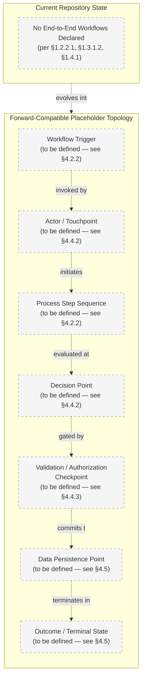
```mermaid
flowchart TB
    subgraph CurrentState["Current Repository State"]
        EmptyWorkflow["No End-to-End Workflows Declared<br/>(per §1.2.2.1, §1.3.1.2, §1.4.1)"]
    end

    subgraph FutureState["Forward-Compatible Placeholder Topology"]
        direction TB
        Trigger["Workflow Trigger<br/>(to be defined — see §4.2.2)"]
        Actor["Actor / Touchpoint<br/>(to be defined — see §4.4.2)"]
        ProcessStep["Process Step Sequence<br/>(to be defined — see §4.2.2)"]
        DecisionNode["Decision Point<br/>(to be defined — see §4.4.2)"]
        ValidationStep["Validation / Authorization<br/>Checkpoint<br/>(to be defined — see §4.4.3)"]
        PersistStep["Data Persistence Point<br/>(to be defined — see §4.5)"]
        Outcome["Outcome / Terminal State<br/>(to be defined — see §4.5)"]

        Trigger -.invoked by.-> Actor
        Actor -.initiates.-> ProcessStep
        ProcessStep -.evaluated at.-> DecisionNode
        DecisionNode -.gated by.-> ValidationStep
        ValidationStep -.commits to.-> PersistStep
        PersistStep -.terminates in.-> Outcome
    end

    CurrentState -.evolves into.-> FutureState

    classDef placeholder fill:#f5f5f5,stroke:#999,stroke-dasharray: 5 5
    class EmptyWorkflow,Trigger,Actor,ProcessStep,DecisionNode,ValidationStep,PersistStep,Outcome placeholder
```

### 4.2.4 Detailed Process Flow Per Feature (Placeholder)

The section prompt requests "detailed process flows for each core feature." As established in §2.2.1, zero features are declared in the repository; the per-feature flowchart inventory is therefore empty by direct consequence. Future revisions will render one process-flow diagram per feature `F-XXX` as those features are catalogued.

| Feature Identifier | Process Flow Diagram | Status |
|--------------------|----------------------|--------|
| (no `F-XXX` declared) | (no diagram renderable) | Empty — to be populated when §2.2 is populated |

The placeholder topology shown in §4.2.3 is the canonical template to be instantiated, once per feature, in subsequent revisions.

---

## 4.3 Integration Workflows

### 4.3.1 Current State of Integration Workflows

No integration workflows are declared in the repository. The integration-point register is empty (per §2.4.3), the third-party services catalog is empty (per §3.5.1), no API contracts or message-broker bindings exist (per §1.2.1.3), and no event handlers or batch jobs are committed (per §1.2.2.1, §3.7.1). All four dimensions of integration workflow that the prompt enumerates therefore resolve to the empty set.

| Integration Workflow Dimension | Items Identified | Evidence Source |
|-------------------------------|------------------|-----------------|
| Data Flow Between Systems | Zero | Per §1.2.1.3, §1.3.2.4, §2.4.3 |
| API Interactions (request / response) | Zero | Per §1.2.2.1, §2.3.4 (no interfaces declared) |
| Event Processing Flows (pub / sub, streaming) | Zero | Per §1.2.1.3, §3.6.1 (no message brokers) |
| Batch Processing Sequences | Zero | Per §1.2.2.1, §3.7.1 (no scheduled jobs) |

### 4.3.2 Forward-Compatible Integration Workflow Schema

The schema below is presented now so that subsequent revisions adopt a consistent identification convention from the first declared integration workflow onward.

| Schema Element | Forward Identifier Format | Description |
|----------------|----------------------------|-------------|
| Integration Workflow | `I-XXX` | A discrete sequence of messages or data movements across a system boundary. |
| Integration Endpoint | `I-XXX-E-YY` | A specific API, queue, topic, file drop, or webhook participating in the workflow. |
| Integration Step | `I-XXX-S-ZZ` | A single message exchange or data movement within the workflow. |
| Integration Decision | `I-XXX-D-NN` | A branch within the workflow based on payload, header, or response code. |
| Integration Failure Mode | `I-XXX-F-MM` | A named failure condition with an associated retry, fallback, or escalation path (see §4.6). |

No identifier in the above format is assigned in this revision because no integration workflow has been declared in the repository.

### 4.3.3 Integration Sequence Diagram (Placeholder)

Following the prompt's requirement for an "integration sequence diagram" and the placeholder convention established in §3.8.1, the diagram below presents a forward-compatible sequence-diagram skeleton. The participants and messages depicted are reserved slots, not declared integrations.

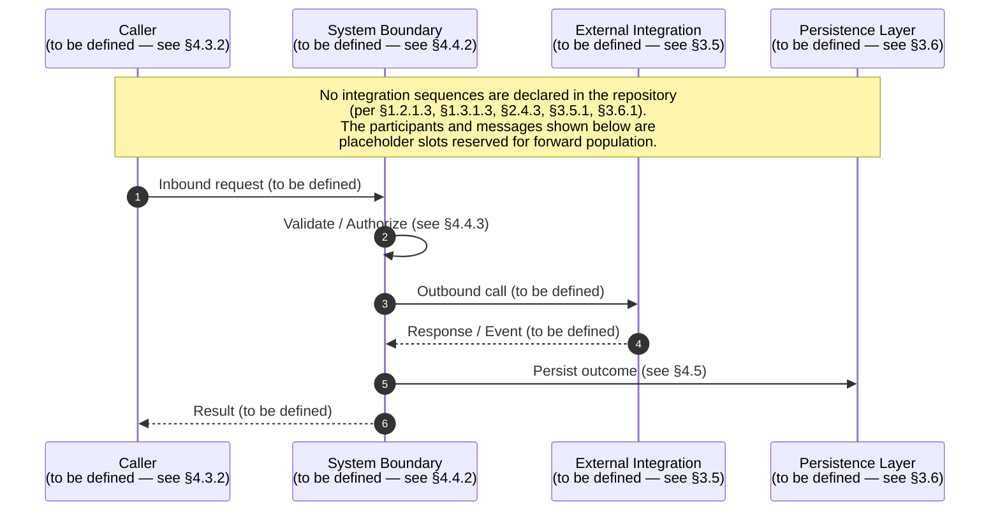
```mermaid
sequenceDiagram
    autonumber
    participant Caller as Caller<br/>(to be defined — see §4.3.2)
    participant Boundary as System Boundary<br/>(to be defined — see §4.4.2)
    participant Integration as External Integration<br/>(to be defined — see §3.5)
    participant Store as Persistence Layer<br/>(to be defined — see §3.6)

    Note over Caller,Store: No integration sequences are declared in the repository<br/>(per §1.2.1.3, §1.3.1.3, §2.4.3, §3.5.1, §3.6.1).<br/>The participants and messages shown below are<br/>placeholder slots reserved for forward population.

    Caller->>Boundary: Inbound request (to be defined)
    Boundary->>Boundary: Validate / Authorize (see §4.4.3)
    Boundary->>Integration: Outbound call (to be defined)
    Integration-->>Boundary: Response / Event (to be defined)
    Boundary->>Store: Persist outcome (see §4.5)
    Boundary-->>Caller: Result (to be defined)
```

---

## 4.4 Flowchart Component Templates and Validation Rules

### 4.4.1 Current State of Flowchart Components

The section prompt enumerates a fixed set of flowchart components (start/end points, process steps, decision diamonds, system boundaries, user touchpoints, error states, timing constraints) and a fixed set of validation rule categories (business rules, data validation, authorization checkpoints, regulatory compliance checks). Each of these components and rule categories is empty in the present revision, as the table below records.

| Flowchart Component / Validation Category | Items Identified | Evidence Source |
|-------------------------------------------|------------------|-----------------|
| Start / End Points (of declared processes) | Zero | Per §1.2.2.1 (no system capabilities) |
| Process Steps | Zero | Per §1.4.1 (no implementation steps) |
| Decision Diamonds | Zero | Per §2.3.5 (no decision logic declared) |
| System Boundaries | One (the repository root containing only `README.md`) | Per §1.2.2.2, §1.3.2.1 |
| User Touchpoints | Zero | Per §1.3.1.2 (no user surfaces) |
| Error States and Recovery Paths | Zero | Per §1.4.1, §2.5.2.5 |
| Timing / SLA Constraints | Zero | Per §1.2.3.3 (no KPIs), §2.5.2.2 (no latency budgets) |
| Business Rules at Each Step | Zero | Per §2.3.5 (no business rules declared) |
| Data Validation Requirements | Zero | Per §2.3.5 (no schemas declared) |
| Authorization Checkpoints | Zero | Per §2.5.2.4, §3.5.1 |
| Regulatory Compliance Checks | Zero | Per §1.3.2.3, §2.3.5 |

### 4.4.2 Component Schema (Forward-Compatible)

The schema below is presented now so that future revisions render every flowchart with a uniform visual and identification convention. The Mermaid shapes are the standard flowchart-node shapes used by the diagrams in §4.2.3, §4.6.3, and §4.8.2.

| Component Class | Mermaid Shape | Forward Identifier | Use |
|-----------------|---------------|---------------------|-----|
| Start Point | `Start(["..."])` (stadium) | `W-XXX-START` | Entry point of a workflow. |
| End Point | `End(["..."])` (stadium) | `W-XXX-END` | Terminal node of a workflow. |
| Process Step | `Step["..."]` (rectangle) | `W-XXX-S-YY` | A single unit of work within a workflow. |
| Decision Diamond | `Decide{"..."}` (rhombus) | `W-XXX-D-ZZ` | A branching point evaluated against a business rule. |
| System Boundary | `subgraph "SystemName" ... end` | `B-XXX` | Encloses nodes that execute within a single system or service. |
| Actor / User Touchpoint | `Actor[/"..."/]` (parallelogram) | `W-XXX-A-NN` | A user role or external system that supplies input. |
| Error State | `Err[("...")]` (cylinder or stadium with red styling) | `W-XXX-E-PP` | A terminal or transient node representing a fault. |
| Timing / SLA Annotation | Mermaid `Note` block adjacent to step | `W-XXX-S-YY-SLA` | A latency, throughput, or freshness constraint applied to the adjacent step. |

No identifier in the above format is assigned in this revision because no workflow has been declared.

### 4.4.3 Validation Rules Schema (Forward-Compatible)

The validation rules schema below mirrors the §2.3.5 Validation Rules Template, which is itself empty in the present revision. The schema defines the categories of validation that a populated flowchart must associate with its decision diamonds.

| Validation Class | Forward Identifier | Description |
|------------------|---------------------|-------------|
| Business Rule | `V-XXX-BR-YY` | A domain constraint that determines branching at a decision diamond. |
| Data Validation | `V-XXX-DV-ZZ` | A syntactic, structural, or semantic check applied to inbound data before a process step proceeds. |
| Authorization Checkpoint | `V-XXX-AZ-NN` | A check that the authenticated principal is permitted to execute the next step, per a yet-to-be-declared access-control policy (see §2.5.2.4). |
| Regulatory Compliance Check | `V-XXX-RC-MM` | A check that the next step satisfies a regulatory obligation in a jurisdiction declared in §1.3.2.3 (currently none declared). |

No identifier in the above format is assigned in this revision because no decision diamond, validation requirement, authorization model, or compliance jurisdiction has been declared.

---

## 4.5 State Management

### 4.5.1 Current State of State Management

No state management constructs are declared in the repository. The four dimensions of state management that the prompt enumerates each resolve to the empty set, as the table below records.

| State Management Dimension | Items Identified | Evidence Source |
|----------------------------|------------------|-----------------|
| State Transitions | Zero | Per §2.5.2.3 (no state or session affinity defined), §1.4.1 |
| Data Persistence Points | Zero | Per §3.6.1 (no databases or storage declared) |
| Caching Requirements | Zero | Per §3.6.1 (no cache layer declared) |
| Transaction Boundaries | Zero | Per §3.6.1 (no data engines; no transactional code) |

### 4.5.2 State Transition Schema (Forward-Compatible)

The schema below is presented now so that future revisions render every state machine with a uniform identification convention.

| Schema Element | Forward Identifier Format | Description |
|----------------|----------------------------|-------------|
| State Machine | `SM-XXX` | A named state machine attached to a feature `F-XXX` or workflow `W-XXX`. |
| State | `SM-XXX-ST-YY` | A discrete state within a state machine. |
| Transition | `SM-XXX-T-ZZ` | A labelled transition between two states, optionally guarded by a validation rule `V-XXX-*`. |
| Persistence Point | `SM-XXX-P-NN` | A state at which the machine's snapshot must be durably persisted (referencing a `§3.6` storage selection, when committed). |
| Cache Checkpoint | `SM-XXX-C-MM` | A state at which a cached projection of the machine's data is read or invalidated (referencing a `§3.6` cache selection, when committed). |
| Transaction Boundary | `SM-XXX-TX-QQ` | A span of one or more transitions that must commit atomically. |

No identifier in the above format is assigned in this revision because no state machine has been declared in the repository.

### 4.5.3 State Transition Diagram (Placeholder)

Following the prompt's requirement for a "state transition diagram," the diagram below presents the forward-compatible placeholder using Mermaid's `stateDiagram-v2` notation. No concrete states or transitions are asserted.

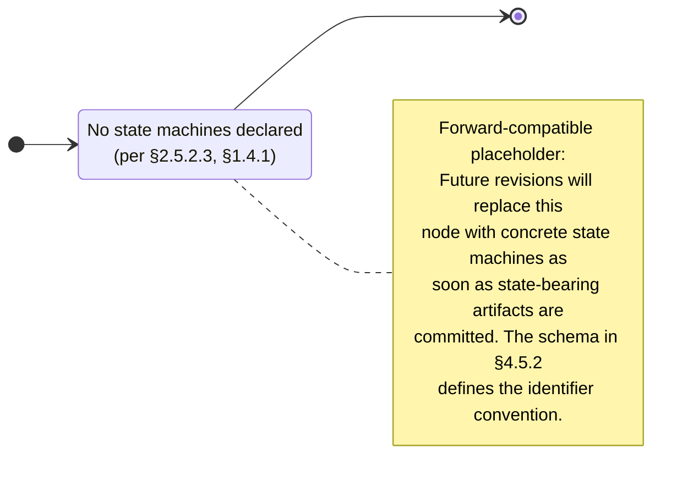
```mermaid
stateDiagram-v2
    direction LR
    [*] --> NoStateMachineDeclared
    NoStateMachineDeclared : No state machines declared<br/>(per §2.5.2.3, §1.4.1)
    NoStateMachineDeclared --> [*]

    note right of NoStateMachineDeclared
        Forward-compatible placeholder:
        Future revisions will replace this
        node with concrete state machines as
        soon as state-bearing artifacts are
        committed. The schema in §4.5.2
        defines the identifier convention.
    end note
```

---

## 4.6 Error Handling

### 4.6.1 Current State of Error Handling

No error handling constructs are declared in the repository. The four dimensions of error handling that the prompt enumerates each resolve to the empty set.

| Error Handling Dimension | Items Identified | Evidence Source |
|--------------------------|------------------|-----------------|
| Retry Mechanisms | Zero | Per §1.4.1 (no source code; no resilience patterns) |
| Fallback Processes | Zero | Per §3.5.3 (no third-party-service fallbacks declared) |
| Error Notification Flows | Zero | Per §1.2.1.3, §2.5.2.5 (no observability or alerting) |
| Recovery Procedures | Zero | Per §2.5.2.5 (no incident-response procedures or runbooks) |

### 4.6.2 Error Handling Schema (Forward-Compatible)

The schema below is presented now so that future revisions render every error-handling concern with a uniform identification convention.

| Schema Element | Forward Identifier Format | Description |
|----------------|----------------------------|-------------|
| Failure Mode | `EH-XXX-FM-YY` | A named failure condition associated with a workflow step `W-XXX-S-YY` or integration step `I-XXX-S-ZZ`. |
| Retry Policy | `EH-XXX-RP-ZZ` | A policy stating the retry count, backoff strategy, and idempotency requirement applicable to a failure mode. |
| Fallback Process | `EH-XXX-FB-NN` | An alternative path invoked when retries are exhausted or the failure mode is classified as non-transient. |
| Notification Flow | `EH-XXX-NF-MM` | A path that emits an alert, event, or log entry to an observability or alerting destination (none declared, per §1.2.1.3). |
| Recovery Procedure | `EH-XXX-RV-PP` | A runbook entry describing the manual or automated steps required to restore normal operation. |

No identifier in the above format is assigned in this revision because no failure mode, retry policy, fallback, notification, or recovery has been declared in the repository.

### 4.6.3 Error Handling Flowchart (Placeholder)

Following the prompt's requirement for an "error handling flowchart," the diagram below presents the forward-compatible placeholder using the §3.8.1 dashed-styling convention. No concrete error path is asserted.

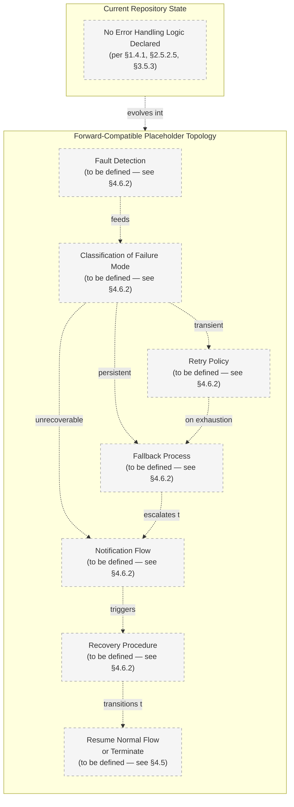
```mermaid
flowchart TB
    subgraph CurrentState["Current Repository State"]
        NoErrorHandling["No Error Handling Logic Declared<br/>(per §1.4.1, §2.5.2.5, §3.5.3)"]
    end

    subgraph FutureState["Forward-Compatible Placeholder Topology"]
        direction TB
        FaultDetection["Fault Detection<br/>(to be defined — see §4.6.2)"]
        Classify["Classification of Failure Mode<br/>(to be defined — see §4.6.2)"]
        Retry["Retry Policy<br/>(to be defined — see §4.6.2)"]
        Fallback["Fallback Process<br/>(to be defined — see §4.6.2)"]
        Notify["Notification Flow<br/>(to be defined — see §4.6.2)"]
        Recover["Recovery Procedure<br/>(to be defined — see §4.6.2)"]
        ResumeOrTerminate["Resume Normal Flow<br/>or Terminate<br/>(to be defined — see §4.5)"]

        FaultDetection -.feeds.-> Classify
        Classify -.transient.-> Retry
        Classify -.persistent.-> Fallback
        Classify -.unrecoverable.-> Notify
        Retry -.on exhaustion.-> Fallback
        Fallback -.escalates to.-> Notify
        Notify -.triggers.-> Recover
        Recover -.transitions to.-> ResumeOrTerminate
    end

    CurrentState -.evolves into.-> FutureState

    classDef placeholder fill:#f5f5f5,stroke:#999,stroke-dasharray: 5 5
    class NoErrorHandling,FaultDetection,Classify,Retry,Fallback,Notify,Recover,ResumeOrTerminate placeholder
```

---

## 4.7 Required Diagrams Index

### 4.7.1 Diagram Catalog and Present-Revision Status

The section prompt enumerates five required Mermaid.js diagrams. The table below records the present-revision status of each, the subsection in which the placeholder is rendered, and the trigger event that will cause the diagram to be substantively populated.

| Required Diagram | Location | Present Status | Population Trigger |
|------------------|----------|----------------|---------------------|
| High-Level System Workflow | §4.2.3 | Placeholder rendered | Declaration of a workflow `W-XXX` |
| Detailed Process Flows (per feature) | §4.2.4 | Empty (zero features per §2.2.1) | Declaration of any feature `F-XXX` in §2.2 |
| Error Handling Flowchart | §4.6.3 | Placeholder rendered | Declaration of a failure mode `EH-XXX-FM-YY` |
| Integration Sequence Diagram | §4.3.3 | Placeholder rendered | Declaration of an integration `I-XXX` (or §3.5 third-party service) |
| State Transition Diagram | §4.5.3 | Placeholder rendered | Declaration of a state machine `SM-XXX` |

### 4.7.2 Visual Convention Conformance

All placeholder diagrams in §4.2.3, §4.3.3, §4.5.3, and §4.6.3 conform to the visual convention established in §3.8.1:

- Two subgraphs are used in flowchart placeholders: `CurrentState` (showing the verified empty state) and `FutureState` (showing the forward-compatible topology).
- All placeholder edges use dashed notation (`-.->`) to distinguish reserved relationships from declared ones.
- The `classDef placeholder fill:#f5f5f5,stroke:#999,stroke-dasharray: 5 5` class is applied to every placeholder node.
- Cross-references to corroborating anchors are embedded directly in node labels using the `(per §X.Y.Z)` form.

### 4.7.3 Diagram Maintenance Convention

Subsequent revisions of this specification will replace the placeholder nodes in each diagram with concretely named workflows, integrations, states, and error paths as soon as the corresponding artifact (source code, integration contract, state machine definition, runbook, or architecture decision record) is committed to the repository. The diagrams are to be regenerated in lockstep with their parent schema tables (§4.2.2, §4.3.2, §4.4.2, §4.4.3, §4.5.2, §4.6.2) so that the visual and tabular representations remain mutually consistent. This convention mirrors the diagram-maintenance discipline established in §3.8.3.

---

## 4.8 Triggers for Process Flow Section Revision

### 4.8.1 Trigger Events

Following the pattern established in §1.4.3, §2.7.2, and §3.9.1, the table below enumerates the trigger events that will cause specific subsections of Section 4 to require update.

| Trigger Event | Subsections Likely to Require Update |
|---------------|--------------------------------------|
| Authoring of an end-to-end user journey or business process | 4.2.1, 4.2.3, 4.2.4, 4.4.1, 4.4.2 |
| Authoring of a feature `F-XXX` in §2.2 | 4.2.4 (one detailed flow per feature), 4.4.2 |
| Commitment of an API contract, integration adapter, or webhook handler | 4.3.1, 4.3.2, 4.3.3, 4.7.1 |
| Commitment of an event handler, message-broker binding, or stream processor | 4.3.1, 4.3.3 |
| Commitment of a scheduled job, cron definition, or batch processing module | 4.3.1, 4.3.2 |
| Commitment of a state machine definition (explicit or implicit) | 4.5.1, 4.5.2, 4.5.3, 4.7.1 |
| Commitment of a database adapter, ORM model, or migration file | 4.5.1, 4.5.2 (persistence and transaction points) |
| Commitment of a cache configuration | 4.5.1, 4.5.2 (cache checkpoint identifiers) |
| Commitment of retry / circuit-breaker / resilience code | 4.6.1, 4.6.2, 4.6.3 |
| Commitment of an observability, alerting, or logging configuration | 4.6.1, 4.6.2 (notification flow identifiers) |
| Commitment of an incident-response runbook or recovery procedure | 4.6.1, 4.6.2 (recovery procedure identifiers) |
| Declaration of a business rule, data-validation schema, or authorization policy | 4.4.1, 4.4.3 |
| Declaration of a regulatory jurisdiction in §1.3.2.3 or a compliance control | 4.4.3 (regulatory compliance check identifiers) |
| Declaration of a KPI, latency budget, or SLA in §1.2.3.3 or §2.5.2.2 | 4.4.2 (timing annotations applied to flowchart steps) |
| Declaration of a third-party service in §3.5 | 4.3.1, 4.3.3, 4.6.2 (fallback identifiers) |

### 4.8.2 Activation Workflow

The diagram below describes the lifecycle by which a future repository contribution transitions a subsection of Section 4 from "empty placeholder" to "substantively populated." It follows the activation-workflow pattern established in §2.7.1 and §3.9.2 and is the only operative (non-placeholder) flowchart in Section 4.

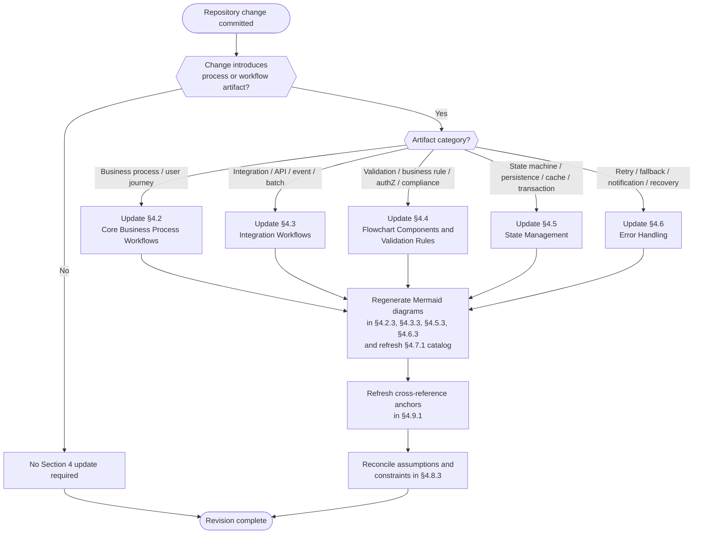
```mermaid
flowchart TD
    Start(["Repository change committed"])
    Detect{{"Change introduces<br/>process or workflow artifact?"}}
    NoChange["No Section 4 update required"]
    Classify{{"Artifact category?"}}
    BusinessBranch["Update §4.2<br/>Core Business Process Workflows"]
    IntegrationBranch["Update §4.3<br/>Integration Workflows"]
    ValidationBranch["Update §4.4<br/>Flowchart Components and<br/>Validation Rules"]
    StateBranch["Update §4.5<br/>State Management"]
    ErrorBranch["Update §4.6<br/>Error Handling"]
    RegenDiagrams["Regenerate Mermaid diagrams<br/>in §4.2.3, §4.3.3, §4.5.3, §4.6.3<br/>and refresh §4.7.1 catalog"]
    UpdateMatrix["Refresh cross-reference anchors<br/>in §4.9.1"]
    UpdateAssumptions["Reconcile assumptions and<br/>constraints in §4.8.3"]
    EndNode(["Revision complete"])

    Start --> Detect
    Detect -- "No" --> NoChange --> EndNode
    Detect -- "Yes" --> Classify
    Classify -- "Business process / user journey" --> BusinessBranch --> RegenDiagrams
    Classify -- "Integration / API / event / batch" --> IntegrationBranch --> RegenDiagrams
    Classify -- "Validation / business rule / authZ / compliance" --> ValidationBranch --> RegenDiagrams
    Classify -- "State machine / persistence / cache / transaction" --> StateBranch --> RegenDiagrams
    Classify -- "Retry / fallback / notification / recovery" --> ErrorBranch --> RegenDiagrams
    RegenDiagrams --> UpdateMatrix --> UpdateAssumptions --> EndNode
```

### 4.8.3 Document Assumptions and Constraints

The following assumptions and constraints govern the present revision of Section 4 and are recorded explicitly so that future revisions can validate or supersede them. The identifier scheme mirrors §2.7.3 and §3.9.3.

| Identifier | Statement | Type |
|------------|-----------|------|
| A-4-01 | The repository contents on the day of authoring are exhaustively represented by the single `README.md` file at the root. | Assumption |
| A-4-02 | Process flows, workflows, state machines, and error-handling paths will be expressed within this repository as committed source code, integration contracts, state machine definitions, or runbooks rather than maintained only in a parallel system. | Assumption |
| A-4-03 | The Section 2 feature catalog (§2.2) and the Section 3 technology catalogs (§3.2 through §3.7) will be populated before, or in parallel with, the population of process flows in Section 4. | Assumption |
| C-4-01 | No `W-XXX`, `I-XXX`, `SM-XXX`, `EH-XXX-*`, or `V-XXX-*` identifier may be assigned in this revision because no corresponding artifact exists in the repository. | Constraint |
| C-4-02 | Timing constraints, SLA budgets, and KPI thresholds may not be embedded as Mermaid annotations in this revision because none are declared (per §1.2.3.3, §2.5.2.2). | Constraint |
| C-4-03 | Authorization checkpoints and regulatory compliance checks may not be drawn as decision diamonds in this revision because no access-control policy (per §2.5.2.4) and no compliance jurisdiction (per §1.3.2.3) has been declared. | Constraint |
| C-4-04 | Transaction boundaries, cache checkpoints, and persistence points may not be drawn in flowcharts in this revision because no §3.6 storage or cache selection has been committed. | Constraint |
| C-4-05 | All Mermaid diagrams rendered in this revision conform to the placeholder convention (dashed edges, `classDef placeholder` styling) established in §3.8.1, with the sole exception of the operative activation-workflow diagram in §4.8.2. | Constraint |

---

## 4.9 Cross-Reference Anchors

### 4.9.1 Corroboration of Section 4 Empty States

Following the pattern established in §2.6.3 and §3.10.1, the table below maps each Section 4 subsection to the Section 1, Section 2, and Section 3 anchors that corroborate its empty state. This cross-reference table acts as the operative traceability artifact for Section 4 in the present revision.

| Section 4 Subsection | Corroborating Anchor(s) | Nature of Corroboration |
|----------------------|-------------------------|-------------------------|
| §4.2 Core Business Process Workflows | §1.2.2.1, §1.3.1.2, §2.2.1, §2.3.1 | No system capabilities, no user workflows, zero declared features, zero functional requirements |
| §4.3 Integration Workflows | §1.2.1.3, §1.3.1.3, §2.4.3, §3.5.1, §3.6.1 | No integration touchpoints, no third-party services, no persistence engines |
| §4.4 Flowchart Components and Validation Rules | §1.3.2.1, §2.3.5, §2.5.2.4, §1.3.2.3, §1.2.3.3, §2.5.2.2 | One trivial system boundary (the repository), no business rules, no authN/authZ, no compliance jurisdiction, no KPI or latency budget |
| §4.5 State Management | §2.5.2.3, §3.6.1 | No state or session affinity, no persistence layer, no cache, no transactional code |
| §4.6 Error Handling | §1.4.1, §2.5.2.5, §3.5.3, §1.2.1.3 | No source code, no incident-response procedures, no service-level fallbacks, no observability |
| §4.7 Required Diagrams Index | §1.2.2.2, §2.4.2, §3.8.1 | Placeholder-diagram pattern inherited from these subsections |
| §4.8 Triggers for Revision | §1.4.3, §2.7.2, §3.9.1 | Inherits the trigger-table pattern; activation workflow inherits from §2.7.1 and §3.9.2 |
| §4.9 Cross-Reference Anchors | §2.6.3, §3.10.1 | Inherits the cross-reference-table pattern |
| §4.10 References | §1.5, §2.8, §3.11 | Inherits the References-section authoring pattern |

### 4.9.2 Inheritance of Governing Principles

Section 4 inherits and applies the three governing principles established in §1.4.2 — **Factual Grounding**, **Transparent Gaps**, and **Forward Compatibility** — without modification. Section 4 also inherits the non-fabrication language pattern established in §1.1.2 and operationalized in §2.1.3 and §3.1.3. No principle is added, removed, or weakened in Section 4.

### 4.9.3 Inheritance of Schema-Definition Pattern

The forward-compatible schema tables in §4.2.2, §4.3.2, §4.4.2, §4.4.3, §4.5.2, and §4.6.2 follow the schema-declaration pattern established in §2.2.2 ("The schema is presented now so that subsequent revisions to this specification adopt a consistent identification convention from the first declared [item] onward") and reused in §3.2.2 through §3.7.2. No identifier (whether `W-XXX`, `I-XXX`, `SM-XXX`, `EH-XXX-*`, or `V-XXX-*`) is assigned in the present revision; each schema is reserved for forward use.

### 4.9.4 Inheritance of Placeholder-Diagram Pattern

The placeholder Mermaid diagrams in §4.2.3, §4.3.3, §4.5.3, and §4.6.3 follow the refined placeholder-diagram pattern established in §3.8.1 — two subgraphs (`CurrentState` and `FutureState`), dashed edges (`-.->`) for placeholder relationships, and the `classDef placeholder fill:#f5f5f5,stroke:#999,stroke-dasharray: 5 5` styling. The activation-workflow diagram in §4.8.2 follows the operative-flowchart pattern established in §2.7.1 and §3.9.2 and is the only non-placeholder diagram in Section 4.

---

## 4.10 References

### 4.10.1 Files Examined

- `README.md` — The sole content-bearing file in the repository. Contains a single first-level Markdown heading declaring the artifact name "Artifact1." Examined as the definitive source for what workflows, business processes, integration sequences, state machines, and error-handling paths are currently declared in the repository (none).

### 4.10.2 Folders Explored

- `` (repository root, depth 0) — Inspected to enumerate first-order children. Confirmed to contain only the `README.md` file, with no subdirectories, no hidden configuration directories (no `.github/`, no `.circleci/`, no `.gitlab/`, no `.devcontainer/`), no source directories, no test directories, no scripts directory, no infrastructure-as-code directories, no runbook or operations directories. Used as evidence that §4.2 through §4.6 are all authentically empty in the present revision.

### 4.10.3 Search Categories Performed

- Search for process flow, workflow, business logic, or business process implementation files — no results.
- Search for state machine, state transition, retry, and error handling logic — no results.
- Search for user journey, workflow sequence, or API endpoint definitions — no results.
- Search for decision points, authorization, validation, and business rule artifacts — no results.
- Search for README and artifact-level placeholder documentation — one result (the `README.md` file).
- Search for application code modules, services, and integration components — no results.

### 4.10.4 Cross-Referenced Specification Sections

- §1.1.1 Project Overview — Provided the authoritative artifact identifier "Artifact1" referenced throughout Section 4.
- §1.1.2 Core Business Problem — Established the non-fabrication language pattern that Section 4 inherits.
- §1.2.1.3 Enterprise Landscape Integration — Direct corroboration of the empty state in §4.3 (Integration Workflows) and §4.6 (Error Notification Flows).
- §1.2.2.1 Primary System Capabilities — Direct corroboration of the empty state in §4.2 (Core Business Process Workflows).
- §1.2.2.2 Major System Components — Provided the basis for the trivial system boundary recorded in §4.4.1.
- §1.2.2.3 Core Technical Approach — Provided the foundational evidence of an empty implementation, on which the absence of all process flows depends.
- §1.2.3.3 Key Performance Indicators — Direct corroboration of the empty state in §4.4 (timing / SLA constraints).
- §1.3.1.2 Primary User Workflows — Direct corroboration of the empty state in §4.2 (end-to-end user journeys).
- §1.3.1.3 Essential Integrations — Direct corroboration of the empty state in §4.3.
- §1.3.2.1 In-Scope System Boundaries — Provided the basis for the single trivial system boundary recorded in §4.4.1.
- §1.3.2.3 Geographic and Market Coverage — Direct corroboration of the empty state in §4.4.3 (regulatory compliance checks).
- §1.3.2.4 Data Domains Included — Provided the basis for the empty data-flow register in §4.3.1.
- §1.4.1 Current Artifact State — Established the verified repository composition that Section 4 inherits as its evidentiary baseline.
- §1.4.2 Implications for This Specification — Established the three governing principles (Factual Grounding, Transparent Gaps, Forward Compatibility) that Section 4 applies throughout.
- §1.4.3 Triggers for Specification Revision — Provided the pattern for the trigger table presented in §4.8.1.
- §2.1.3 Governing Principle for Feature Documentation — Provided the explicit non-fabrication clause that §4.1.3 adapts for process flow documentation.
- §2.2.1 Feature Catalog Status — Direct corroboration of the empty per-feature flowchart inventory in §4.2.4.
- §2.2.2 Feature Identification Schema (Forward-Compatible) — Provided the schema-declaration pattern replicated in §4.2.2, §4.3.2, §4.4.2, §4.4.3, §4.5.2, and §4.6.2.
- §2.3.1 Functional Requirements Table — Direct corroboration of the empty state in §4.2 (no declared decision logic or process steps).
- §2.3.5 Validation Rules Template — Direct corroboration of the empty state in §4.4 (business rules, data validation, authorization checkpoints, regulatory compliance checks).
- §2.4.2 Feature Dependency Map — Provided the placeholder-diagram pattern replicated in §4.2.3, §4.3.3, §4.5.3, and §4.6.3.
- §2.4.3 Integration Points — Direct corroboration of the empty state in §4.3.
- §2.5.2.2 Performance Requirements — Direct corroboration of the empty state in §4.4 (timing / SLA constraints) and §4.8.3 (C-4-02).
- §2.5.2.3 Scalability Considerations — Direct corroboration of the empty state in §4.5 (state and session affinity).
- §2.5.2.4 Security Implications — Direct corroboration of the empty state in §4.4.3 (authorization checkpoints) and §4.8.3 (C-4-03).
- §2.5.2.5 Maintenance Requirements — Direct corroboration of the empty state in §4.6 (incident response, observability, recovery).
- §2.6.3 Cross-Reference to Section 1 Anchors — Provided the cross-reference pattern replicated in §4.9.1.
- §2.7.1 Activation Workflow — Provided the operative activation-workflow diagram pattern replicated in §4.8.2.
- §2.7.2 Triggers for Section Revision — Provided the trigger-table pattern replicated in §4.8.1.
- §2.7.3 Document Assumptions and Constraints — Provided the assumption/constraint identifier scheme (A-N-NN, C-N-NN) replicated in §4.8.3.
- §3.1.3 Governing Principle for Technology Stack Documentation — Provided the model of an explicit non-fabrication clause that §4.1.3 mirrors.
- §3.5.1 Third-Party Services — Direct corroboration of the empty state in §4.3 (no integrations to sequence) and §4.4.3 (no external authorization provider).
- §3.5.3 Third-Party Service Considerations — Direct corroboration of the empty state in §4.6 (no fallback paths).
- §3.6.1 Databases & Storage — Direct corroboration of the empty state in §4.5 (persistence points, cache, transactions) and §4.8.3 (C-4-04).
- §3.7.1 Development & Deployment — Direct corroboration of the empty state in §4.3 (no batch/CI sequences).
- §3.8.1 Current State and Forward-Compatible Topology (Technology Stack) — Provided the refined placeholder-diagram pattern (two subgraphs, dashed edges, `classDef placeholder` styling) replicated in all four placeholder diagrams of Section 4.
- §3.8.3 Diagram Maintenance Convention — Provided the maintenance convention adapted in §4.7.3.
- §3.9.1 Trigger Events (Technology Stack) — Provided the trigger-table pattern replicated in §4.8.1.
- §3.9.2 Activation Workflow (Technology Stack) — Provided the operative activation-workflow pattern replicated in §4.8.2.
- §3.9.3 Document Assumptions and Constraints (Technology Stack) — Provided the A-N-NN / C-N-NN identifier scheme replicated in §4.8.3.
- §3.10.1 Corroboration of Section 3 Empty States — Provided the cross-reference table pattern replicated in §4.9.1.
- §3.10.2 Inheritance of Governing Principles — Provided the inheritance-statement pattern replicated in §4.9.2.
- §3.10.3 Inheritance of Schema-Definition Pattern — Provided the inheritance-statement pattern replicated in §4.9.3.
- §3.11 References (Section 3) — Provided the References-section authoring pattern replicated in §4.10.

---

# 5. System Architecture

## 5.1 Section Overview and Repository State Acknowledgment

### 5.1.1 Purpose of This Section

This section is intended to specify the system architecture of "Artifact1" — that is, the overall architectural style, the catalog of architectural components and their responsibilities, the data flows that traverse them, the external integration points they expose or consume, the technical decisions that shape them, and the cross-cutting concerns (monitoring, logging, error handling, authentication, performance, disaster recovery) that span them.

System architecture is, by its nature, **third-order documentation**: it describes the static and dynamic composition of a system whose functional requirements (per Section 2), technology stack (per Section 3), and process flows (per Section 4) have already been declared. Because each of those upstream sections has been authored in strict empty-state mode against a repository that contains only `README.md` with the single H1 heading `# Artifact1` (per §1.1.1 and §1.4.1), there is no substantive architectural content to specify in the present revision. This section therefore proceeds — in strict conformance with the three governing principles established in §1.4.2, namely **Factual Grounding**, **Transparent Gaps**, and **Forward Compatibility** — by:

- Acknowledging the verified empty state of every architectural dimension transparently.
- Defining forward-compatible identifier schemata for architectural components, data flows, architecture decision records, and cross-cutting concerns.
- Presenting placeholder Mermaid diagrams that reserve visual slots for future content, conforming to the canonical convention established in §3.8.1.
- Cross-referencing placeholder diagrams already authored in §3.8, §4.2.3, §4.3.3, §4.5.3, and §4.6.3 rather than duplicating them, where the upstream artifact is the authoritative source.
- Enumerating the trigger events that will cause substantive population of each subsection.
- Recording the assumptions and constraints that govern the present revision under the `A-5-NN` / `C-5-NN` identifier scheme inherited from §2.7.3.

### 5.1.2 Current Architecture Inventory

A direct enumeration of the repository (a single `README.md` file containing only the heading `# Artifact1`, as established in §1.1.1 and §1.4.1) yields the following inventory of architectural elements that can be authentically catalogued at this time:

| Architecture Inventory Dimension | Count / State | Evidence Source |
|----------------------------------|---------------|-----------------|
| Declared Architecture Style | None | Per §1.2.2.3, §3.1.2 (no technical approach) |
| Declared Architectural Components | Zero | Per §1.2.2.2, §2.4.4 |
| Declared Data Flows | Zero | Per §4.3.1, §1.3.2.4 |
| Declared External Integration Points | Zero | Per §1.2.1.3, §2.4.3, §3.5.1 |
| Declared Component Dependencies | Zero | Per §2.4.2 |
| Declared Communication Patterns | Zero | Per §4.3.1, §3.5.1 |
| Declared Data Storage Solutions | Zero | Per §3.6.1 |
| Declared Caching Strategies | Zero | Per §3.6.1 (Cache Layer: No) |
| Declared Security Mechanisms | Zero | Per §1.2.1.3, §2.5.2.4 |
| Declared Authentication / Authorization Frameworks | Zero | Per §2.5.2.4, §3.5.1, §4.4.3 |
| Declared Monitoring / Observability Solutions | Zero | Per §1.2.1.3, §2.5.2.5, §4.6.1 |
| Declared Logging / Tracing Strategies | Zero | Per §2.5.2.5, §4.6.1 |
| Declared Error Handling Patterns | Zero | Per §4.6.1 |
| Declared Performance Requirements / SLAs | Zero | Per §1.2.3.3, §2.5.2.2 |
| Declared Disaster Recovery Procedures | Zero | Per §2.5.2.5 |
| Declared Scaling Strategies | Zero | Per §2.5.2.3 |
| Declared Architecture Decision Records (ADRs) | Zero | Per §3.1.3 (A-3-02), §3.9.3 (C-3-02) |

### 5.1.3 Governing Principle for System Architecture Documentation

In keeping with the non-fabrication language pattern established in §1.1.2, §2.1.3, §3.1.3, and §4.1.3, **this specification deliberately refrains from inferring or fabricating architectural styles, components, data flows, integration points, technical decisions, communication patterns, storage solutions, caching strategies, security mechanisms, observability designs, performance budgets, service level agreements, or disaster recovery procedures.** Any such content must originate from authoritative engineering input — committed source code, design documents, signed architecture decision records, integration contracts, runbooks, performance budgets, or security policies — external to the present repository contents, and will be incorporated into subsequent revisions as that material becomes available.

The diagram conventions, identifier schemata, and component / decision / concern taxonomies presented in §5.2 through §5.5 are defined here for **forward use**; no concrete component, integration, decision, or cross-cutting mechanism is asserted in this revision because no corresponding artifact exists in the repository to warrant assertion.

---

## 5.2 High-Level Architecture

### 5.2.1 System Overview

#### 5.2.1.1 Architecture Style and Rationale

No architectural style is declared, inferred, or implied in the repository. The Default Technology Stack referenced in section prompts is, per assumption A-3-02 of §3.9.3, a presentational option only and not an authoritative commitment; in the absence of evidence in the repository indicating its adoption, no monolithic, microservices, event-driven, layered, hexagonal, serverless, or other architectural style may be asserted in this revision.

The following architectural-style indicators are each absent:

| Architectural Style Indicator | Present in Repository? | Cross-Reference |
|-------------------------------|------------------------|-----------------|
| Source modules suggesting layering or partitioning | No | §1.2.2.2, §3.2.1 |
| Service definitions (API, RPC, message-broker bindings) | No | §1.2.1.3, §4.3.1 |
| Container or orchestration manifests | No | §3.7.1 |
| Architecture decision record endorsing a style | No | §3.9.3 (A-3-02) |

Authoring of an architecture style — including its rationale — will be triggered by any of the events enumerated in §5.6.1.

#### 5.2.1.2 Architectural Principles and Patterns

No architectural principles or patterns (e.g., separation of concerns realized through specific module boundaries, CQRS, ports and adapters, saga orchestration, sidecar pattern) are declared in the repository. The only governing principles in force at this time are the three principles established in §1.4.2 for the specification itself — **Factual Grounding**, **Transparent Gaps**, and **Forward Compatibility** — which are documentation-authoring principles rather than runtime architecture principles, and which Section 5 inherits without modification (see §5.7.2).

#### 5.2.1.3 System Boundaries and Major Interfaces

A "system boundary" denotes the line at which control or data is exchanged between the system and an external actor (per the validation-rule taxonomy of §4.4.2). The repository declares exactly one trivial boundary: the file system boundary that separates the repository root from the operating environment, traversed solely by readers of `README.md`. No programmatic boundary (HTTP listener, message-broker subscription, scheduled trigger, filesystem watcher, command-line entry point, library export) is committed.

| System Boundary Class | Declared in Repository? | Cross-Reference |
|-----------------------|-------------------------|-----------------|
| HTTP / REST / gRPC Endpoint | No | §1.2.2.1, §4.3.1 |
| Message Broker / Event Stream | No | §1.2.1.3, §3.6.1 |
| Scheduled Job / Batch Trigger | No | §3.7.1, §4.1.2 |
| Command-Line / Library Interface | No | §1.2.2.1 |
| File / Object Storage Drop | No | §3.6.1 |
| Reader of `README.md` (trivial documentation boundary) | Yes | §1.1.1 |

### 5.2.2 Core Components

#### 5.2.2.1 Current Component Inventory

No architectural components are declared. Per §1.2.2.2, the structural inventory of the repository yields only the repository root, the `README.md` stub, and the single H1 heading `# Artifact1`; per §2.4.4, the counts of shared libraries, common services, shared data models, and common utilities are each zero. The Core Components table that the section prompt requires is therefore the empty table:

| Component Name | Primary Responsibility | Key Dependencies | Critical Considerations |
|----------------|------------------------|------------------|-------------------------|
| *(none declared)* | *(not applicable)* | *(not applicable)* | *(not applicable)* |

Note: the section prompt enumerates five columns for the Core Components table (Component Name, Primary Responsibility, Key Dependencies, Integration Points, Critical Considerations). To remain within the four-column maximum mandated by the output format requirements (recorded as constraint C-5-04 in §5.6.3), the "Integration Points" dimension is presented separately under §5.2.4.

#### 5.2.2.2 Component Catalog Schema (Forward-Compatible)

When architectural components are committed to the repository, each entry will be recorded against the schema below. Following the schema-declaration pattern established in §2.2.2 ("The schema is presented now so that subsequent revisions adopt a consistent identification convention from the first declared item onward"), the schema is reserved for forward use; no identifier is assigned in the present revision.

| Schema Element | Forward Identifier Format | Description |
|----------------|---------------------------|-------------|
| Architectural Component | `AC-XXX` | A discrete, named architectural unit (service, module, library, daemon, batch job) with a defined responsibility. |
| Component Interface | `AC-XXX-IF-YY` | A specific inbound or outbound interface exposed or consumed by `AC-XXX` (HTTP endpoint, message topic, library API, CLI). |
| Component Dependency | `AC-XXX-DEP-ZZ` | A named dependency on another component (`AC-YYY`), an integration point (`I-XXX`, per §4.3.2), or a persistence engine (per §3.6). |
| Persistence Binding | `AC-XXX-DB-NN` | A named association between a component and a `§3.6` storage selection, when committed. |
| Scaling Profile | `AC-XXX-SCL-MM` | A scaling policy (horizontal, vertical, partitioned, stateless, sticky) tied to `§2.5.2.3` once populated. |

No identifier in the above format is assigned in this revision because no architectural component has been declared in the repository.

### 5.2.3 Data Flow Description

#### 5.2.3.1 Current State of Data Flows

The repository declares no data flows. Per §4.3.1, the integration-workflow inventory is empty across all four dimensions (data flow between systems, API interactions, event processing flows, batch processing sequences). Per §3.6.1, no persistence engine, no cache, and no object-storage service is declared. Per §1.3.2.4, no data domains have been declared from which a data flow could be authored.

| Data Flow Dimension | Items Identified | Evidence Source |
|---------------------|------------------|-----------------|
| Inter-Component Data Flows | Zero | Per §1.2.2.2 (no components) |
| System-to-System Integration Flows | Zero | Per §4.3.1 |
| Read / Write Paths to Persistence | Zero | Per §3.6.1 |
| Read / Write Paths to Cache | Zero | Per §3.6.1 |
| Event Publication / Subscription Paths | Zero | Per §1.2.1.3, §3.6.1 |
| Batch Data Movements | Zero | Per §3.7.1, §4.1.2 |
| Data Transformation Points | Zero | Per §1.3.2.4 (no data domains) |

#### 5.2.3.2 Forward-Compatible Data Flow Schema

The schema below is presented now so that subsequent revisions adopt a consistent identification convention from the first declared data flow onward.

| Schema Element | Forward Identifier Format | Description |
|----------------|---------------------------|-------------|
| Data Flow | `DF-XXX` | A directed movement of data between two named endpoints (component, integration point, persistence engine). |
| Data Flow Endpoint | `DF-XXX-EP-YY` | A specific source or sink of `DF-XXX`, referencing an `AC-XXX`, `I-XXX`, or `§3.6` storage selection. |
| Data Transformation Step | `DF-XXX-TX-ZZ` | A named transformation (validation, enrichment, projection, anonymization) applied along `DF-XXX`. |
| Protocol Binding | `DF-XXX-PR-NN` | The wire protocol (HTTP, gRPC, AMQP, Kafka, S3, JDBC) carrying the flow, tied to `§3.5` once populated. |

No identifier in the above format is assigned in this revision because no data flow has been declared in the repository.

### 5.2.4 External Integration Points

#### 5.2.4.1 Current External Integration Inventory

No external integration points are declared. Per §1.2.1.3, every enterprise landscape dimension (upstream data sources, downstream consumers, identity / SSO providers, observability platforms, storage / persistence layers) is recorded as "Not declared." Per §3.5.1, no third-party service is declared. Per §2.4.3, the integration-point register is empty. The External Integration Points table that the section prompt requires is therefore the empty table:

| System Name | Integration Type | Protocol / Format | SLA Requirements |
|-------------|------------------|-------------------|------------------|
| *(none declared)* | *(not applicable)* | *(not applicable)* | *(not applicable)* |

Note: the section prompt enumerates five columns for the External Integration Points table (System Name, Integration Type, Data Exchange Pattern, Protocol / Format, SLA Requirements). To remain within the four-column maximum mandated by the output format requirements (constraint C-5-04), the "Data Exchange Pattern" dimension is folded into the schema definition below and will be carried in each future entry as a value of the `Integration Type` field.

#### 5.2.4.2 Forward-Compatible External Integration Schema

When external integrations are committed, each entry will be recorded against the schema below, which reuses the `I-XXX` identifier scheme established in §4.3.2 to maintain identifier coherence between integration workflows (§4.3) and external integration points (§5.2.4).

| Schema Element | Forward Identifier Format | Description |
|----------------|---------------------------|-------------|
| External Integration Point | `I-XXX` | A named external system with which "Artifact1" exchanges data (reusing §4.3.2). |
| Integration Endpoint | `I-XXX-E-YY` | A specific API, queue, topic, file drop, or webhook (reusing §4.3.2). |
| Data Exchange Pattern | `I-XXX-DXP-ZZ` | A classified exchange style: request / response, fire-and-forget, publish / subscribe, file transfer, stream, polling. |
| Protocol / Format Binding | `I-XXX-PF-NN` | The wire protocol and payload format (e.g., HTTPS+JSON, gRPC+Protobuf, AMQP+Avro, SFTP+CSV). |
| SLA Specification | `I-XXX-SLA-MM` | The service level commitment, tied to `§2.5.2.2` once performance requirements are declared. |

No identifier in the above format is assigned in this revision because no external integration point has been declared in the repository.

---

## 5.3 Component Details

### 5.3.1 Current State of Component Specifications

For each "major component" the section prompt requires the documentation of purpose and responsibilities, technologies and frameworks used, key interfaces and APIs, data persistence requirements, and scaling considerations. Because the count of declared components is zero (per §1.2.2.2 and §5.2.2.1), no such component-scoped specification can be authored in this revision. The five dimensions resolve to the empty set as the table below records.

| Component Specification Dimension | Items Identified | Evidence Source |
|-----------------------------------|------------------|-----------------|
| Component Purpose and Responsibilities | Zero | Per §1.2.2.1 (no capabilities), §5.2.2.1 |
| Technologies and Frameworks per Component | Zero | Per §3.2.1, §3.3.1 |
| Component Interfaces and APIs | Zero | Per §1.2.2.1, §4.3.1 |
| Component-Scoped Persistence Requirements | Zero | Per §3.6.1 |
| Component-Scoped Scaling Considerations | Zero | Per §2.5.2.3 |

### 5.3.2 Component Specification Schema (Forward-Compatible)

When a component is committed, each entry will be recorded against the schema below, which composes the `AC-XXX` component identifier of §5.2.2.2 with the technology, integration, persistence, and process-flow schemata of upstream sections.

| Specification Dimension | Source Schema | Forward Anchor |
|-------------------------|---------------|----------------|
| Identifier and Responsibility | `AC-XXX` (this section) | §5.2.2.2 |
| Language / Runtime | §3.2.2 catalog entry | §3.2 |
| Framework | §3.3.2 catalog entry | §3.3 |
| Open Source Dependencies | §3.4.2 catalog entries | §3.4 |
| Third-Party Services Consumed | §3.5.2 catalog entries (and `I-XXX`) | §3.5, §4.3 |
| Persistence Bindings | §3.6.2 catalog entries (and `AC-XXX-DB-NN`) | §3.6 |
| Inbound / Outbound Interfaces | `AC-XXX-IF-YY` | §5.2.2.2 |
| State Machine Bindings | `SM-XXX` | §4.5.2 |
| Error Handling Bindings | `EH-XXX-FM-YY` | §4.6.2 |
| Scaling Profile | `AC-XXX-SCL-MM` | §2.5.2.3 |
| Authorization Checkpoints | `V-XXX-AZ-NN` | §4.4.3 |

No specification entry is authored in this revision because no component has been declared.

### 5.3.3 Component Interaction Diagram (Placeholder)

Following the placeholder-diagram pattern established in §3.8.1, the diagram below depicts both the present empty state of component interactions and the forward-compatible topology that future revisions will populate. Dashed styling indicates placeholder nodes for which no concrete selection has been made.

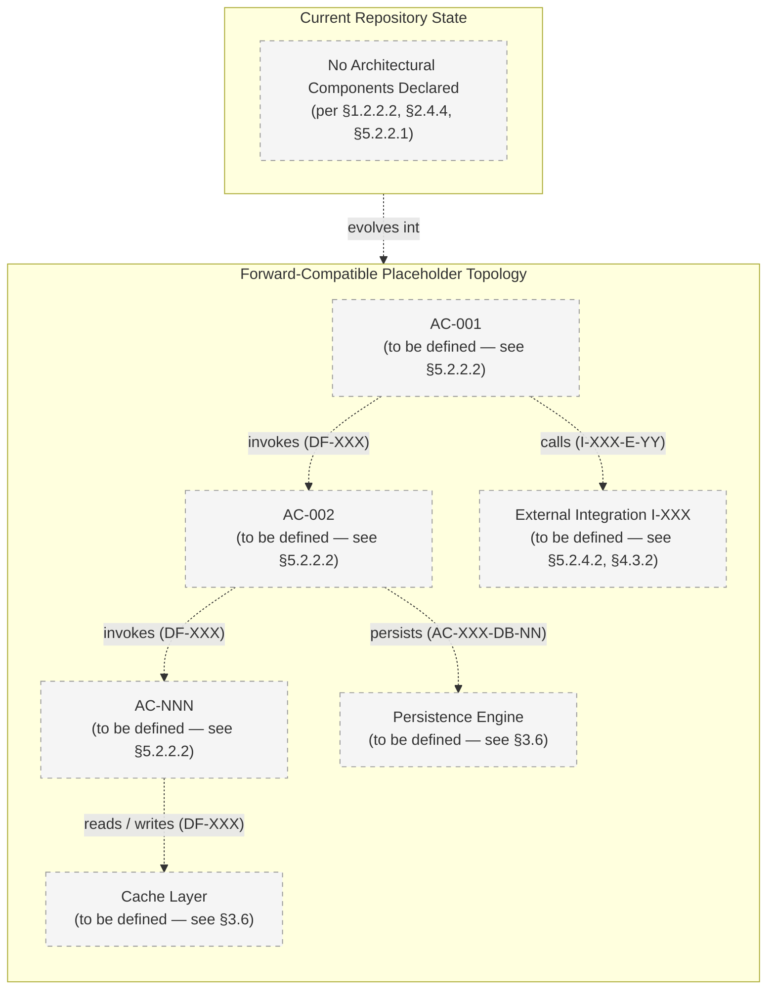
```mermaid
flowchart TB
    subgraph CurrentState["Current Repository State"]
        EmptyComponents["No Architectural Components Declared<br/>(per §1.2.2.2, §2.4.4, §5.2.2.1)"]
    end

    subgraph FutureState["Forward-Compatible Placeholder Topology"]
        direction TB
        CompA["AC-001<br/>(to be defined — see §5.2.2.2)"]
        CompB["AC-002<br/>(to be defined — see §5.2.2.2)"]
        CompN["AC-NNN<br/>(to be defined — see §5.2.2.2)"]
        IntegrationPlaceholder["External Integration I-XXX<br/>(to be defined — see §5.2.4.2, §4.3.2)"]
        StorePlaceholder["Persistence Engine<br/>(to be defined — see §3.6)"]
        CachePlaceholder["Cache Layer<br/>(to be defined — see §3.6)"]

        CompA -.invokes (DF-XXX).-> CompB
        CompB -.invokes (DF-XXX).-> CompN
        CompA -.calls (I-XXX-E-YY).-> IntegrationPlaceholder
        CompB -.persists (AC-XXX-DB-NN).-> StorePlaceholder
        CompN -.reads / writes (DF-XXX).-> CachePlaceholder
    end

    CurrentState -.evolves into.-> FutureState

    classDef placeholder fill:#f5f5f5,stroke:#999,stroke-dasharray: 5 5
    class EmptyComponents,CompA,CompB,CompN,IntegrationPlaceholder,StorePlaceholder,CachePlaceholder placeholder
```

### 5.3.4 State Transition Diagram (Cross-Reference)

The section prompt requires a state transition diagram for each major component. Because no components are declared (per §5.2.2.1) and no state machines are declared (per §4.5.1), the placeholder state-transition diagram authored in §4.5.3 is the authoritative artifact for the present revision. The reader is directed there rather than to a duplicated diagram in this section, on the principle that single-sourced diagrams remain mutually consistent across revisions (per §3.8.3).

Future revisions will, once one or more state machines have been declared per the `SM-XXX` schema of §4.5.2, render component-scoped state-transition diagrams in this subsection that bind each `SM-XXX` to the corresponding `AC-XXX` per the schema of §5.3.2.

### 5.3.5 Sequence Diagram for Key Flows (Cross-Reference)

The section prompt requires sequence diagrams for key flows. Because no key flows are declared (per §4.3.1) and no components are declared (per §5.2.2.1), the placeholder integration sequence diagram authored in §4.3.3 is the authoritative artifact for the present revision. The reader is directed there rather than to a duplicated diagram in this section.

Future revisions will, once one or more integration workflows have been declared per the `I-XXX` schema of §4.3.2 and one or more components have been declared per the `AC-XXX` schema of §5.2.2.2, render component-scoped sequence diagrams in this subsection that show the messages exchanged between named `AC-XXX` participants and `I-XXX` external systems.

---

## 5.4 Technical Decisions

### 5.4.1 Current State of Technical Decisions

No architecture decision records (ADRs) exist in the repository. Per assumption A-3-02 and constraint C-3-02 of §3.9.3, no technology selection — and by extension no architectural decision derived from such a selection — can be declared until a corresponding artifact (ADR document, design specification, manifest, configuration file, or source code) is committed to the repository. Per §3.2 through §3.7, no language, framework, dependency, service, persistence engine, or development tooling is committed. Therefore the five decision categories enumerated by the section prompt each resolve to the empty set, as the table below records.

| Technical Decision Category | Items Identified | Evidence Source |
|-----------------------------|------------------|-----------------|
| Architecture Style Decisions and Tradeoffs | Zero | Per §1.2.2.3, §5.2.1.1 |
| Communication Pattern Choices | Zero | Per §4.3.1, §3.5.1 |
| Data Storage Solution Rationale | Zero | Per §3.6.1 |
| Caching Strategy Justification | Zero | Per §3.6.1 (Cache Layer: No) |
| Security Mechanism Selection | Zero | Per §1.2.1.3, §2.5.2.4 |

### 5.4.2 Architecture Decision Record (ADR) Schema (Forward-Compatible)

When an architectural decision is committed to the repository, each entry will be recorded against the ADR schema below. The schema follows the Michael Nygard ADR convention as widely adopted in the industry, adapted to the identifier scheme of this specification.

| Schema Element | Forward Identifier Format | Description |
|----------------|---------------------------|-------------|
| Architecture Decision Record | `ADR-XXX` | A discrete, dated decision document with a Title, Status (Proposed / Accepted / Deprecated / Superseded), Context, Decision, and Consequences. |
| Decision Option | `ADR-XXX-OPT-YY` | A named option that was considered when authoring `ADR-XXX`. |
| Decision Tradeoff | `ADR-XXX-TR-ZZ` | A documented tradeoff (cost, latency, complexity, vendor lock-in, operational burden) weighed against each option. |
| Superseding Link | `ADR-XXX → ADR-YYY` | A directed link indicating that `ADR-YYY` supersedes `ADR-XXX`. |
| Affected Component Binding | `ADR-XXX ↔ AC-YYY` | A bidirectional link recording that the decision shapes one or more `AC-YYY` components, per §5.2.2.2. |

No identifier in the above format is assigned in this revision because no architecture decision has been declared in the repository.

### 5.4.3 Decision Category Inventory (Empty State)

For each decision category the section prompt requires, the table below records the current state and the future source from which a substantive entry will be drawn.

| Decision Category | Currently Specified? | Future Source |
|-------------------|----------------------|---------------|
| Architecture Style (monolith / microservices / event-driven / serverless / layered / hexagonal) | No | `ADR-XXX` documenting the style and its rationale |
| Synchronous vs. Asynchronous Communication | No | `ADR-XXX` tied to `§4.3` integration workflows |
| Inter-Service Protocol (HTTP / gRPC / messaging) | No | `ADR-XXX` tied to `§3.5` third-party services |
| Primary Operational Database Engine | No | `ADR-XXX` tied to `§3.6` persistence catalog |
| Analytical / Warehouse Engine | No | `ADR-XXX` tied to `§3.6` persistence catalog |
| Caching Tier and Invalidation Strategy | No | `ADR-XXX` tied to `§3.6` cache row |
| Authentication Mechanism | No | `ADR-XXX` tied to `§2.5.2.4`, `§3.5` |
| Authorization Model (RBAC / ABAC / ReBAC) | No | `ADR-XXX` tied to `§2.5.2.4`, `§4.4.3` |
| Secrets Management | No | `ADR-XXX` tied to `§2.5.2.4` |
| Transport-Layer Security Posture | No | `ADR-XXX` tied to `§2.5.2.4` |
| Deployment Topology (single-region / multi-region / edge) | No | `ADR-XXX` tied to `§2.5.2.3`, `§3.7` |

### 5.4.4 Architecture Decision Tree (Placeholder)

Following the placeholder-diagram pattern of §3.8.1, the decision-tree diagram below depicts both the present empty state of architectural decisions and the forward-compatible decision-evaluation topology that future revisions will populate as ADRs are authored.

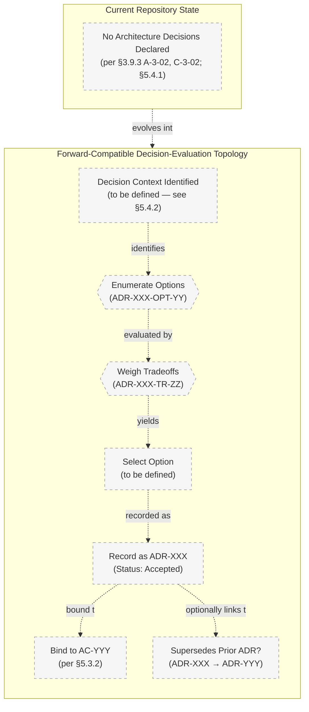
```mermaid
flowchart TD
    subgraph CurrentState["Current Repository State"]
        NoDecisions["No Architecture Decisions Declared<br/>(per §3.9.3 A-3-02, C-3-02; §5.4.1)"]
    end

    subgraph FutureState["Forward-Compatible Decision-Evaluation Topology"]
        direction TB
        StartDecision["Decision Context Identified<br/>(to be defined — see §5.4.2)"]
        Options{{"Enumerate Options<br/>(ADR-XXX-OPT-YY)"}}
        Tradeoffs{{"Weigh Tradeoffs<br/>(ADR-XXX-TR-ZZ)"}}
        Selection["Select Option<br/>(to be defined)"]
        Record["Record as ADR-XXX<br/>(Status: Accepted)"]
        BindComp["Bind to AC-YYY<br/>(per §5.3.2)"]
        Supersede["Supersedes Prior ADR?<br/>(ADR-XXX → ADR-YYY)"]

        StartDecision -.identifies.-> Options
        Options -.evaluated by.-> Tradeoffs
        Tradeoffs -.yields.-> Selection
        Selection -.recorded as.-> Record
        Record -.bound to.-> BindComp
        Record -.optionally links to.-> Supersede
    end

    CurrentState -.evolves into.-> FutureState

    classDef placeholder fill:#f5f5f5,stroke:#999,stroke-dasharray: 5 5
    class NoDecisions,StartDecision,Options,Tradeoffs,Selection,Record,BindComp,Supersede placeholder
```

---

## 5.5 Cross-Cutting Concerns

### 5.5.1 Current State of Cross-Cutting Concerns

A cross-cutting concern is one that pertains to multiple architectural components rather than to a single component in isolation. Because the count of declared components is zero (per §5.2.2.1), no cross-cutting concern can be substantively declared in this revision. The six concern categories enumerated by the section prompt each resolve to the empty set, as the table below records.

| Cross-Cutting Concern Dimension | Items Identified | Evidence Source |
|---------------------------------|------------------|-----------------|
| Monitoring and Observability Approach | Zero | Per §1.2.1.3, §2.5.2.5, §4.6.1 |
| Logging and Tracing Strategy | Zero | Per §2.5.2.5, §4.6.1 |
| Error Handling Patterns | Zero | Per §4.6.1 |
| Authentication and Authorization Framework | Zero | Per §2.5.2.4, §3.5.1, §4.4.3 |
| Performance Requirements and SLAs | Zero | Per §1.2.3.3, §2.5.2.2 |
| Disaster Recovery Procedures | Zero | Per §2.5.2.5 |

### 5.5.2 Concern Categories

#### 5.5.2.1 Monitoring and Observability

No monitoring or observability mechanism is declared in the repository. Per §1.2.1.3, no observability platform is integrated; per §2.5.2.5, the maintenance-requirement category "Observability and Logging" is recorded as not specified; per §4.6.1, the notification-flow dimension is zero. No metrics pipeline, no application performance monitoring (APM) agent, no health-check endpoint, and no dashboard is committed. Authoring of an observability approach will follow declaration of a telemetry destination (per the trigger table in §5.6.1).

#### 5.5.2.2 Logging and Tracing

No logging library, log shipping configuration, log retention policy, distributed-tracing instrumentation, trace-context propagation convention, or span-collector configuration is declared in the repository. As recorded in §2.5.2.5 and §4.6.1, the logging-and-tracing dimension is empty.

#### 5.5.2.3 Error Handling Patterns

No error-handling pattern is declared. Per §4.6.1, the four error-handling dimensions (retry mechanisms, fallback processes, error notification flows, recovery procedures) are each zero. The forward-compatible error-handling schema is defined in §4.6.2 under the identifier scheme `EH-XXX-FM-YY` / `EH-XXX-RP-ZZ` / `EH-XXX-FB-NN` / `EH-XXX-NF-MM` / `EH-XXX-RV-PP`; Section 5 reuses this schema rather than duplicating it. The placeholder error-handling flow diagram of §4.6.3 is the authoritative artifact, cross-referenced in §5.5.4 below.

#### 5.5.2.4 Authentication and Authorization Framework

No authentication mechanism (session-based, token-based, OAuth 2.0, OpenID Connect, SAML, mutual TLS) and no authorization model (role-based, attribute-based, relationship-based, capability-based) is declared in the repository. Per §2.5.2.4, the security-implication dimensions (Authentication, Authorization, Data Protection, Auditability) are each not specified; per §3.5.1, no identity provider is integrated; per §4.4.3, the authorization-checkpoint identifier scheme `V-XXX-AZ-NN` is defined but no checkpoint is assigned. Section 5 reuses the `V-XXX-AZ-NN` scheme of §4.4.3 for forward authorization-checkpoint records rather than introducing a new identifier.

#### 5.5.2.5 Performance Requirements and SLAs

No performance requirement, latency budget, throughput target, concurrency limit, resource-utilization ceiling, or service level agreement is declared in the repository. Per §1.2.3.3, all five KPI categories (Functional Outcomes, Reliability / Availability, Performance / Latency, Adoption / Usage, Cost / Efficiency) are recorded as "To be defined"; per §2.5.2.2, all four performance dimensions are not specified. SLA specifications will be carried in the future against the `I-XXX-SLA-MM` schema of §5.2.4.2, in association with each declared integration point.

#### 5.5.2.6 Disaster Recovery Procedures

No disaster recovery procedure, no recovery time objective (RTO), no recovery point objective (RPO), no backup schedule, no failover topology, no chaos-engineering practice, and no incident-response runbook is declared in the repository. Per §2.5.2.5, the maintenance-requirement category "Backup and Recovery" is recorded as not specified, as are "Patching / Upgrade Cadence" and "Incident Response Procedures." Authoring of disaster recovery procedures will follow commitment of a runbook artifact (per the trigger table in §5.6.1).

### 5.5.3 Cross-Cutting Concerns Schema (Forward-Compatible)

The schema below is presented now so that subsequent revisions render every cross-cutting-concern declaration with a uniform identification convention. Where a prior section has already established a schema for the same domain (notably §4.6.2 for error handling and §4.4.3 for authorization checkpoints), Section 5 reuses that schema rather than introducing a duplicate identifier.

| Concern Class | Forward Identifier Format | Inherited / Newly Defined |
|---------------|---------------------------|----------------------------|
| Monitoring Signal (metric, alert, dashboard) | `CCC-MON-XXX` | Newly defined in §5.5.3 |
| Logging Channel (logger, sink, retention policy) | `CCC-LOG-XXX` | Newly defined in §5.5.3 |
| Tracing Span / Propagation Convention | `CCC-TRC-XXX` | Newly defined in §5.5.3 |
| Error Handling Construct | `EH-XXX-FM-YY` (and variants) | Inherited from §4.6.2 |
| Authentication Mechanism | `CCC-AUTHN-XXX` | Newly defined in §5.5.3 |
| Authorization Checkpoint | `V-XXX-AZ-NN` | Inherited from §4.4.3 |
| Performance Budget / SLA | `I-XXX-SLA-MM` (per-integration) and `CCC-PRF-XXX` (system-wide) | Inherited from §5.2.4.2 (per-integration) / Newly defined (system-wide) |
| Disaster Recovery Procedure | `CCC-DR-XXX` | Newly defined in §5.5.3 |

No identifier in the above format is assigned in this revision because no cross-cutting concern has been declared in the repository.

### 5.5.4 Error Handling Flow (Cross-Reference)

The section prompt requires an error-handling-flow diagram. Because no error-handling logic is declared (per §4.6.1) and no components are declared (per §5.2.2.1), the placeholder error-handling flowchart authored in §4.6.3 is the authoritative artifact for the present revision. The reader is directed there rather than to a duplicated diagram in this section, on the principle that single-sourced diagrams remain mutually consistent across revisions (per §3.8.3).

Future revisions will, once one or more failure modes have been declared per the `EH-XXX-FM-YY` schema of §4.6.2 and one or more components have been declared per the `AC-XXX` schema of §5.2.2.2, render component-scoped error-handling flowcharts in this subsection that bind each failure mode to the component that experiences it.

---

## 5.6 Triggers for System Architecture Revision

### 5.6.1 Trigger Events

Following the trigger-table pattern established in §1.4.3, §2.7.2, §3.9.1, and §4.8.1, the table below enumerates the trigger events that will cause specific subsections of Section 5 to require update.

| Trigger Event | Subsections Likely to Require Update |
|---------------|--------------------------------------|
| Commitment of an architecture decision record (ADR) | §5.4.1, §5.4.3, §5.4.4 |
| Authoring of a component design document or service definition | §5.2.2, §5.3.1, §5.3.2, §5.3.3 |
| Declaration of an architectural style in source code, configuration, or ADR | §5.2.1.1, §5.2.1.2 |
| Commitment of source code that establishes a new component boundary | §5.2.2, §5.3, §5.3.3 |
| Declaration of an external integration in §3.5 or §4.3 | §5.2.4, §5.3.3 |
| Declaration of a data flow between components or systems | §5.2.3, §5.3.3 |
| Declaration of authentication or authorization design | §5.5.2.4 |
| Declaration of observability, monitoring, or alerting infrastructure | §5.5.2.1 |
| Declaration of a logging library, log shipper, or tracing instrumentation | §5.5.2.2 |
| Declaration of error-handling logic (retries, circuit breakers, fallbacks) | §5.5.2.3 (and cross-references to §4.6) |
| Declaration of a KPI, SLA, or performance budget in §1.2.3.3 or §2.5.2.2 | §5.5.2.5 |
| Declaration of a disaster recovery runbook, backup policy, or failover topology | §5.5.2.6 |
| Declaration of a caching solution in §3.6 | §5.4.3 (caching strategy row), §5.3.3 |
| Declaration of a security control or compliance obligation | §5.4.3 (security row), §5.5.2.4 |
| Declaration of a scaling profile or capacity plan in §2.5.2.3 | §5.3.2 (scaling profile row) |

### 5.6.2 Activation Workflow (Operative)

The diagram below — itself **operative** rather than placeholder, since the workflow is in force during the present revision — describes the lifecycle by which a future repository contribution transitions a subsection of Section 5 from "empty placeholder" to "substantively populated." It follows the operative-workflow pattern established in §3.9.2.

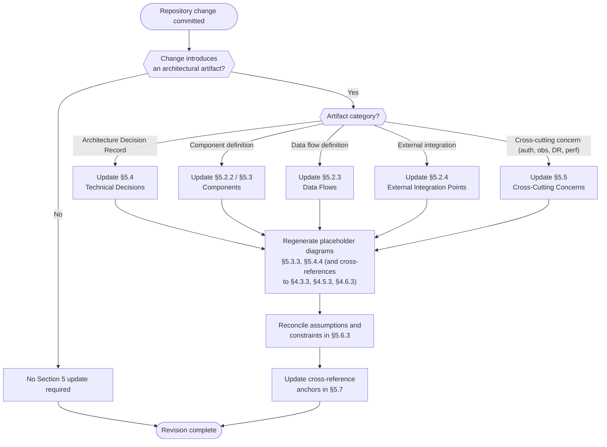
```mermaid
flowchart TD
    Start(["Repository change committed"])
    Detect{{"Change introduces<br/>an architectural artifact?"}}
    NoChange["No Section 5 update required"]
    Classify{{"Artifact category?"}}
    ADRBranch["Update §5.4<br/>Technical Decisions"]
    CompBranch["Update §5.2.2 / §5.3<br/>Components"]
    DataFlowBranch["Update §5.2.3<br/>Data Flows"]
    IntegrationBranch["Update §5.2.4<br/>External Integration Points"]
    CrossCutBranch["Update §5.5<br/>Cross-Cutting Concerns"]
    RegenDiagrams["Regenerate placeholder diagrams<br/>§5.3.3, §5.4.4 (and cross-references<br/>to §4.3.3, §4.5.3, §4.6.3)"]
    UpdateAssumptions["Reconcile assumptions and<br/>constraints in §5.6.3"]
    UpdateCrossRefs["Update cross-reference<br/>anchors in §5.7"]
    EndNode(["Revision complete"])

    Start --> Detect
    Detect -- "No" --> NoChange --> EndNode
    Detect -- "Yes" --> Classify
    Classify -- "Architecture Decision Record" --> ADRBranch --> RegenDiagrams
    Classify -- "Component definition" --> CompBranch --> RegenDiagrams
    Classify -- "Data flow definition" --> DataFlowBranch --> RegenDiagrams
    Classify -- "External integration" --> IntegrationBranch --> RegenDiagrams
    Classify -- "Cross-cutting concern (auth, obs, DR, perf)" --> CrossCutBranch --> RegenDiagrams
    RegenDiagrams --> UpdateAssumptions --> UpdateCrossRefs --> EndNode
```

### 5.6.3 Document Assumptions and Constraints

The following assumptions and constraints govern the present revision of Section 5 and are recorded explicitly so that future revisions can validate or supersede them. The identifier scheme mirrors §2.7.3, §3.9.3, and §4.8.3.

| Identifier | Statement | Type |
|------------|-----------|------|
| A-5-01 | The repository contents on the day of authoring are exhaustively represented by the single `README.md` file at the root containing only the heading `# Artifact1`. | Assumption |
| A-5-02 | Future architectural decisions will be committed to this repository as ADRs, design documents, or source code rather than maintained only in a parallel system. | Assumption |
| A-5-03 | The Default Technology Stack referenced in section prompts is a presentational option, not an authoritative commitment for architecture purposes (inherited from §3.9.3 A-3-02). | Assumption |
| A-5-04 | Where Section 4 has already authored a placeholder diagram for an architectural concern (component interaction-adjacent in §1.2.2.2; integration sequence in §4.3.3; state transition in §4.5.3; error handling in §4.6.3), Section 5 cross-references that diagram rather than duplicating it, to preserve mutual consistency per §3.8.3. | Assumption |
| A-5-05 | Identifier schemes already defined in upstream sections (`F-XXX`, `W-XXX`, `I-XXX`, `SM-XXX`, `EH-XXX-*`, `V-XXX-*`, `B-XXX`) are reused unchanged by Section 5; Section 5 introduces only the new schemes `AC-XXX`, `DF-XXX`, `ADR-XXX`, and `CCC-*-XXX` to fill remaining identifier gaps. | Assumption |
| C-5-01 | No architectural component, data flow, integration point, technical decision, or cross-cutting mechanism may be asserted in this revision because no corresponding artifact exists in the repository. | Constraint |
| C-5-02 | SLA requirements, performance targets, and security mechanisms cannot be specified because no KPIs (§1.2.3.3), latency budgets (§2.5.2.2), security policies (§2.5.2.4), or authorization checkpoints (§4.4.3) have been declared. | Constraint |
| C-5-03 | All Mermaid diagrams in this revision that depict declared architectural content must conform to the placeholder convention established in §3.8.1 (two-subgraph layout, dashed edges, `classDef placeholder fill:#f5f5f5,stroke:#999,stroke-dasharray: 5 5`). The §5.6.2 activation-workflow diagram is the sole exception, since the workflow it describes is in force during the present revision. | Constraint |
| C-5-04 | All tables conform to the four-column maximum specified by the section prompt's output format requirements. Where the prompt enumerates more than four columns for a table (Core Components, External Integration Points), the additional column is either folded into the schema definition or moved to an adjacent subsection. | Constraint |
| C-5-05 | Cross-references to placeholder diagrams already authored in §4 (state transitions, integration sequences, error handling) are used in lieu of duplicate diagrams in §5.3.4, §5.3.5, and §5.5.4 to maintain single-source-of-truth integrity. | Constraint |

---

## 5.7 Cross-Reference Anchors

### 5.7.1 Corroboration of Section 5 Empty States

Following the pattern established in §2.6.3, §3.10.1, and §4.9, the table below maps each Section 5 subsection to the Section 1, 2, 3, and 4 anchors that corroborate its empty state. This cross-reference table acts as the operative traceability artifact for Section 5 in the present revision.

| Section 5 Subsection | Corroborating Anchor(s) | Nature of Corroboration |
|----------------------|--------------------------|--------------------------|
| §5.2.1 System Overview / Architecture Style | §1.2.2.3, §3.1.2, §3.9.3 (A-3-02) | No technical approach; Default Stack is presentational only |
| §5.2.1.3 System Boundaries | §1.3.2.1, §4.4.2 | Only trivial documentation boundary; no programmatic boundary |
| §5.2.2 Core Components | §1.2.2.2, §2.4.4, §2.4.2 | No components, no shared libraries, no shared services |
| §5.2.3 Data Flow Description | §4.3.1, §1.3.2.4, §3.6.1 | No integration workflows, no data domains, no persistence |
| §5.2.4 External Integration Points | §1.2.1.3, §2.4.3, §3.5.1 | No integration points, no third-party services |
| §5.3 Component Details | §1.2.2.2, §2.5 (all subsections) | No components and no implementation considerations |
| §5.4.1 Technical Decisions | §3.1.3, §3.9.3 (A-3-02, C-3-02) | No technology selection; no ADRs declared |
| §5.4.3 Communication Patterns | §4.3.1, §3.5.1 | No integration workflows; no third-party services |
| §5.4.3 Data Storage | §3.6.1 | No persistence engines declared |
| §5.4.3 Caching Strategy | §3.6.1 (Cache Layer: No) | No cache configuration |
| §5.4.3 Security Mechanism | §1.2.1.3, §2.5.2.4 | No security implications declared |
| §5.5.2.1 Monitoring / Observability | §1.2.1.3, §2.5.2.5, §4.6.1 | No observability platform; no notification flows |
| §5.5.2.2 Logging / Tracing | §2.5.2.5, §4.6.1 | No logging or tracing instrumentation |
| §5.5.2.3 Error Handling | §4.6.1 | All four error-handling dimensions zero |
| §5.5.2.4 Authentication / Authorization | §2.5.2.4, §3.5.1, §4.4.3 | No identity provider; no checkpoints |
| §5.5.2.5 Performance / SLA | §1.2.3.3, §2.5.2.2 | No KPIs; no performance dimensions |
| §5.5.2.6 Disaster Recovery | §2.5.2.5 | No backup, recovery, or incident-response procedures |
| §5.3.2 Scaling Considerations | §2.5.2.3 | No horizontal, vertical, or affinity strategies |

### 5.7.2 Inheritance of Governing Principles

Section 5 inherits and applies the three governing principles established in §1.4.2 — **Factual Grounding**, **Transparent Gaps**, and **Forward Compatibility** — without modification. Section 5 also inherits the non-fabrication language pattern established in §1.1.2 and operationalized in §2.1.3, §3.1.3, and §4.1.3, restating it in §5.1.3 with explicit scope adjusted to architectural elements (styles, components, data flows, integrations, decisions, cross-cutting concerns). No principle is added, removed, or weakened in Section 5.

### 5.7.3 Inheritance of Schema-Definition Pattern

The forward-compatible schema tables in §5.2.2.2 (`AC-XXX`), §5.2.3.2 (`DF-XXX`), §5.2.4.2 (`I-XXX` reused from §4.3.2), §5.4.2 (`ADR-XXX`), and §5.5.3 (`CCC-*-XXX`, with reuse of `EH-XXX-*` from §4.6.2 and `V-XXX-AZ-NN` from §4.4.3) follow the schema-declaration pattern established in §2.2.2 — "the schema is presented now so that subsequent revisions to this specification adopt a consistent identification convention from the first declared item onward." No identifier is assigned in the present revision; each schema is reserved for forward use.

The Section 5 identifier surface — composed alongside the upstream schemata it reuses — is summarized below:

| Schema | Format | Source |
|--------|--------|--------|
| Feature | `F-XXX` | §2.2.2 |
| Requirement | `F-XXX-RQ-YYY` | §2.3.2 |
| Workflow | `W-XXX` | §4.2.2 |
| Workflow Step | `W-XXX-S-YY` | §4.2.2 |
| Integration Workflow | `I-XXX` | §4.3.2 (reused in §5.2.4.2) |
| Integration Endpoint | `I-XXX-E-YY` | §4.3.2 |
| State Machine | `SM-XXX` | §4.5.2 |
| Failure Mode | `EH-XXX-FM-YY` | §4.6.2 |
| Authorization Checkpoint | `V-XXX-AZ-NN` | §4.4.3 |
| System Boundary | `B-XXX` | §4.4.2 |
| Architectural Component | `AC-XXX` | §5.2.2.2 (new) |
| Data Flow | `DF-XXX` | §5.2.3.2 (new) |
| Architecture Decision Record | `ADR-XXX` | §5.4.2 (new) |
| Monitoring / Logging / Tracing / AuthN / DR Concern | `CCC-MON / LOG / TRC / AUTHN / DR-XXX` | §5.5.3 (new) |
| Assumption / Constraint | `A-N-NN` / `C-N-NN` | §2.7.3 (used as `A-5-NN` / `C-5-NN`) |

### 5.7.4 Inheritance of Placeholder-Diagram Pattern

The placeholder diagrams in §5.3.3 (component interaction) and §5.4.4 (architecture decision tree) inherit the convention established in §3.8.1 — two subgraphs (`CurrentState` and `FutureState`), dashed edges (`-.->`), and the styling directive `classDef placeholder fill:#f5f5f5,stroke:#999,stroke-dasharray: 5 5`. Cross-references in §5.3.4 (state transitions), §5.3.5 (sequence diagrams), and §5.5.4 (error handling) point to placeholder diagrams already authored upstream in §4.5.3, §4.3.3, and §4.6.3 respectively, in lieu of duplicate diagrams, to preserve mutual consistency per §3.8.3.

The §5.6.2 activation-workflow diagram is the sole non-placeholder diagram in this section; it depicts a workflow that is in force during the present revision rather than a forward-compatible architecture, and therefore deliberately does not adopt the placeholder styling. This treatment mirrors the operative-workflow diagrams of §2.7.1, §3.9.2, and §4.8.2.

---

## 5.8 References

### 5.8.1 Files Examined

- `README.md` — Verified to contain only a single first-level Markdown heading (`# Artifact1`). Establishes the empty repository state from which the empty-state declarations of §5.1.2, §5.2.1, §5.2.2.1, §5.2.3.1, §5.2.4.1, §5.3.1, §5.4.1, and §5.5.1 derive.

### 5.8.2 Folders Explored

- `/` (repository root, depth 0) — Confirmed to contain only `README.md` with no subdirectories, no manifests, no source directories, no test directories, no infrastructure-as-code directories, and no hidden configuration directories. Establishes the absence of architectural components per §5.2.2.1.

### 5.8.3 Tech Spec Sections Retrieved (Cross-References)

- §1.1 Executive Summary — Project identity ("Artifact1") and verified placeholder state.
- §1.2 System Overview — Source of the empty enterprise-landscape integration table (§1.2.1.3), the empty Major System Components diagram (§1.2.2.2), the empty Core Technical Approach table (§1.2.2.3), and the empty KPI categories (§1.2.3.3).
- §1.3 Scope — Source of the empty in-scope / out-of-scope state and the single trivial system boundary (§1.3.2.1).
- §1.4 Repository State Assessment — Source of the three governing principles (Factual Grounding, Transparent Gaps, Forward Compatibility) in §1.4.2 and the trigger-event pattern in §1.4.3.
- §2.4 Feature Relationships — Source of the empty shared-component, integration-point, and dependency-map findings (§2.4.2, §2.4.3, §2.4.4).
- §2.5 Implementation Considerations — Source of the empty technical-constraint, performance, scalability, security, and maintenance dimensions (§2.5.2.1 – §2.5.2.5).
- §2.7 Process Flow for Future Population — Source of the activation-workflow pattern and the `A-N-NN` / `C-N-NN` identifier scheme.
- §3.1 Section Overview and Repository State Acknowledgment — Source of the technology-stack non-fabrication clause and the Default Technology Stack disclaimer.
- §3.5 Third-Party Services — Confirmed no external service integrations.
- §3.6 Databases & Storage — Confirmed no persistence engines, no caches, no object storage (anchoring §5.2.3, §5.4.3 storage / caching rows).
- §3.8 Technology Stack Architecture Diagram — Source of the canonical placeholder-diagram convention (two-subgraph layout, dashed edges, `classDef placeholder`).
- §3.9 Triggers for Technology Stack Revision — Source of the trigger-table and operative activation-workflow patterns and the `A-3-NN` / `C-3-NN` constraints inherited by Section 5.
- §3.10 Cross-Reference Anchors — Source of the corroboration-table pattern adopted in §5.7.1.
- §4.1 Section Overview and Repository State Acknowledgment — Source of the process-flow non-fabrication clause restated for architecture in §5.1.3.
- §4.3 Integration Workflows — Source of the empty integration-workflow inventory (§4.3.1), the `I-XXX` schema reused in §5.2.4.2, and the placeholder integration sequence diagram cross-referenced in §5.3.5.
- §4.4 Flowchart Component Templates and Validation Rules — Source of the system-boundary count (`B-XXX`) and the authorization-checkpoint scheme `V-XXX-AZ-NN` reused in §5.5.2.4 / §5.5.3.
- §4.5 State Management — Source of the empty state-machine inventory, the `SM-XXX` schema, and the placeholder state-transition diagram cross-referenced in §5.3.4.
- §4.6 Error Handling — Source of the empty error-handling inventory, the `EH-XXX-*` schema reused in §5.5.3, and the placeholder error-handling flow diagram cross-referenced in §5.5.4.
- §4.8 Triggers for Process Flow Section Revision — Source of the expanded trigger-table pattern adopted in §5.6.1 and the `A-4-NN` / `C-4-NN` pattern adopted as `A-5-NN` / `C-5-NN` in §5.6.3.
- §4.9 Cross-Reference Anchors — Source of the multi-section inheritance pattern (governing principles, schema-definition, placeholder-diagram) adopted in §5.7.

### 5.8.4 Web Searches Performed

None. All evidence for this section was drawn from the repository itself and from cross-referenced sections of the Technical Specification document; no external web research was required to author the empty-state declarations, forward-compatible schemata, placeholder diagrams, or operative activation workflow presented above.

# 6. SYSTEM COMPONENTS DESIGN

## 6.1 Core Services Architecture

### 6.1.1 Applicability Statement

**Core Services Architecture is not applicable for this system in the present revision.**

The section prompt explicitly permits this declaration when the system "does not require microservices, distributed architecture, or distinct service components." The repository under specification meets this condition unambiguously. Per §1.4.1, the verified contents of the repository are a single `README.md` file at the root containing exactly one first-level Markdown heading (`# Artifact1`), zero subdirectories, zero source code artifacts, zero manifests, and zero declared external dependencies. Per §5.2.1.1, "no architectural style is declared, inferred, or implied in the repository... no monolithic, microservices, event-driven, layered, hexagonal, serverless, or other architectural style may be asserted in this revision." Per §5.2.2.1, the architectural-component inventory is empty. Per §5.2.1.3, the only declared system boundary is the trivial documentation boundary traversed by readers of `README.md`; no programmatic boundary (HTTP listener, message-broker subscription, scheduled trigger, filesystem watcher, command-line entry point, library export) is committed.

In the absence of any service, any inter-service boundary, any inter-service communication channel, any deployment topology, and any operational substrate, none of the concerns enumerated by the section prompt — service boundaries and responsibilities, inter-service communication patterns, service discovery, load balancing, circuit breakers, retries and fallbacks, horizontal or vertical scaling, auto-scaling, resource allocation, performance optimization, capacity planning, fault tolerance, disaster recovery, data redundancy, failover, or service degradation — can be substantively documented in this revision.

This subsection therefore proceeds in the **empty-state mode** that has been applied uniformly across Sections 1 through 5, governed by the three principles established in §1.4.2:

| Principle | Application to §6.1 |
|-----------|---------------------|
| Factual Grounding | Every statement reflects evidence (or the documented absence of evidence) in the repository |
| Transparent Gaps | Each sub-topic the prompt enumerates is named and recorded as empty rather than fabricated |
| Forward Compatibility | The subsection structure mirrors the canonical template so future content has a defined location |

### 6.1.2 Empty-State Acknowledgment for Service Concerns

The sub-topics enumerated by the section prompt are partitioned into three categories — Service Components, Scalability Design, and Resilience Patterns — and each is documented below against an empty-state table that records (a) the dimension named by the prompt, (b) the count of items identified, and (c) the evidence source establishing the empty count. This mirrors the empty-state tables of §4.6.1, §5.2.2.1, §5.2.3.1, §5.2.4.1, §5.3.1, and §5.5.1.

| Aggregate Concern | Items Identified Across All Sub-Topics | Authoritative Evidence Source |
|-------------------|---------------------------------------|-------------------------------|
| Service Components | Zero | Per §1.2.2.2, §2.4.4, §4.3.1, §5.2.2.1 |
| Scalability Design | Zero | Per §2.5.2.2, §2.5.2.3, §3.7.1 |
| Resilience Patterns | Zero | Per §2.5.2.5, §4.6.1, §5.5.2.3, §5.5.2.6 |

### 6.1.3 Service Components (Empty State)

The section prompt enumerates six service-component dimensions. Each resolves to the empty set as recorded below, with the corroborating evidence anchor specified inline.

| Service Component Dimension | Items Identified | Evidence Source |
|-----------------------------|------------------|-----------------|
| Service Boundaries and Responsibilities | Zero | Per §1.2.2.1, §5.2.1.3, §5.2.2.1 |
| Inter-Service Communication Patterns | Zero | Per §4.3.1, §5.2.3.1 |
| Service Discovery Mechanisms | Zero | Per §1.2.1.3, §3.5.1 |
| Load Balancing Strategy | Zero | Per §3.7.1, §5.4 (no deployment topology) |
| Circuit Breaker Patterns | Zero | Per §4.6.1, §5.5.2.3 |
| Retry and Fallback Mechanisms | Zero | Per §4.6.1, §5.5.2.3 |

#### 6.1.3.1 Service Boundaries and Responsibilities

No service boundary is declared in the repository. Per §5.2.1.3, the only system boundary declared is the trivial file-system boundary that separates the repository root from the operating environment, traversed solely by readers of `README.md`. No service-level boundary class (HTTP/REST/gRPC endpoint, message broker subscription, scheduled trigger, filesystem watcher, command-line entry point, library export) is committed. Per §5.2.2.1, the Core Components inventory is empty; per §2.4.4, the counts of shared libraries, common services, shared data models, and common utilities are each zero. No responsibility, no domain, and no contract can therefore be authored at this time.

Future entries will be recorded using the `AC-XXX` architectural-component identifier scheme established in §5.2.2.2 and the `AC-XXX-IF-YY` interface scheme. A component qualifies as a *service* — and thereby acquires a §6.1 entry — when its interface crosses a process or network boundary, as opposed to an intra-process module which is documented only in §5.3.

#### 6.1.3.2 Inter-Service Communication Patterns

No inter-service communication pattern is declared. Per §4.3.1, the integration-workflow inventory is empty across all four dimensions (data flow between systems, API interactions, event processing flows, batch processing sequences). Per §5.2.3.1, the data-flow inventory is empty across all seven dimensions (inter-component data flows, system-to-system integration flows, read/write paths to persistence, read/write paths to cache, event publication/subscription paths, batch data movements, data transformation points). No synchronous protocol (HTTP, gRPC, GraphQL), no asynchronous protocol (AMQP, Kafka, NATS, MQTT), and no choreography/orchestration framework is committed.

Future entries will reuse the `DF-XXX` data-flow identifier of §5.2.3.2 for inter-service data movements and the `I-XXX-DXP-ZZ` data-exchange-pattern identifier of §5.2.4.2 for the exchange style (request/response, fire-and-forget, publish/subscribe, file transfer, stream, polling).

#### 6.1.3.3 Service Discovery Mechanisms

No service discovery mechanism is declared. Per §3.5.1, no third-party service is integrated — which excludes commercial registries (Consul, etcd, ZooKeeper, AWS Cloud Map, Kubernetes DNS, Eureka). Per §1.2.1.3, no observability platform, identity provider, or storage layer is declared from which a discovery convention could be inferred. Per §3.7.1, no container orchestration manifest is present from which Kubernetes-native service-resource semantics could be derived.

Future entries will be recorded as integration points under the `I-XXX` schema of §4.3.2 / §5.2.4.2 when discovery is brokered by an external registry, or as `AC-XXX-IF-YY` interface entries when discovery is intrinsic to a committed component.

#### 6.1.3.4 Load Balancing Strategy

No load balancing strategy is declared. Per §3.7.1, no deployment topology, no infrastructure-as-code definition, and no container orchestration manifest is committed; per the same section, the categories "Deployment Targets (environments)" and "Container Image Registry" are explicitly "Not specified." Per §1.2.1.3, no DNS, ingress, gateway, or reverse-proxy configuration is integrated. No load-balancing algorithm (round-robin, least-connections, weighted, consistent-hashing, IP-hash, least-response-time) is therefore in force.

Future entries will be carried as cross-cutting concerns under the `CCC-PRF-XXX` system-wide performance schema of §5.5.3 when load-balancing rules are committed at the platform level, or under the `AC-XXX-IF-YY` interface schema of §5.2.2.2 when the balancing policy is intrinsic to a specific service interface.

#### 6.1.3.5 Circuit Breaker Patterns

No circuit breaker pattern is declared. Per §4.6.1, all four error-handling dimensions (retry mechanisms, fallback processes, error notification flows, recovery procedures) are zero; per §5.5.2.3, "no error-handling pattern is declared... the four error-handling dimensions are each zero." No circuit-breaker library (Resilience4j, Polly, Hystrix-equivalent, Sentinel, Istio EnvoyFilter), no state machine for breaker transitions (closed → open → half-open → closed), and no failure-rate threshold is committed.

Future entries will be recorded under the `EH-XXX-FM-YY` failure-mode schema of §4.6.2 bound to one or more `AC-XXX` components per the schema of §5.3.2, with the breaker's state machine carried under the `SM-XXX` schema of §4.5.2.

#### 6.1.3.6 Retry and Fallback Mechanisms

No retry or fallback mechanism is declared. Per §4.6.1, retry mechanisms = zero and fallback processes = zero, with the explicit evidence trail "Per §1.4.1 (no source code; no resilience patterns)" for retries and "Per §3.5.3 (no third-party-service fallbacks declared)" for fallbacks. No backoff strategy (constant, linear, exponential, jittered exponential, decorrelated jitter), no idempotency convention, and no fallback hierarchy (cached response, default value, degraded result, queue-for-later) is committed.

Future entries will reuse the `EH-XXX-RP-ZZ` retry-policy schema and the `EH-XXX-FB-NN` fallback-process schema of §4.6.2 unchanged. Per assumption A-5-05 of §5.6.3, Section 6.1 introduces no new identifier scheme for error-handling constructs; it composes the §4.6 schema with the §5.2 component schema.

### 6.1.4 Scalability Design (Empty State)

The section prompt enumerates five scalability dimensions. Each resolves to the empty set as recorded below. This subsection composes the empty-state evidence of §2.5.2.2 (Performance Requirements), §2.5.2.3 (Scalability Considerations), and §3.7.1 (Development & Deployment) into a single scalability-oriented view.

| Scalability Dimension | Items Identified | Evidence Source |
|-----------------------|------------------|-----------------|
| Horizontal / Vertical Scaling Approach | Zero | Per §2.5.2.3 (all four scaling dimensions empty) |
| Auto-Scaling Triggers and Rules | Zero | Per §2.5.2.3, §3.7.1 |
| Resource Allocation Strategy | Zero | Per §2.5.2.2, §3.7.1 |
| Performance Optimization Techniques | Zero | Per §1.2.3.3 (KPIs to be defined), §2.5.2.2 |
| Capacity Planning Guidelines | Zero | Per §1.3.1.4, §2.5.2.2 |

#### 6.1.4.1 Horizontal and Vertical Scaling Approach

No horizontal or vertical scaling approach is declared. Per §2.5.2.3, "no scalability considerations are recorded. With no components (§1.2.2.2) and no capacity model (§1.3.1.4), neither horizontal nor vertical scaling strategies can be authored at this time"; all four scalability dimensions (Horizontal Scale Strategy, Vertical Scale Limits, State / Session Affinity, Backpressure / Flow Control) are recorded as "No." No stateless-replica model, no stateful-shard model, no leader-follower model, and no instance-size tier is committed.

Future entries will be recorded under the `AC-XXX-SCL-MM` scaling-profile schema of §5.2.2.2, with each profile classified as one of: horizontal (stateless), horizontal (sharded), vertical, partitioned, or sticky.

#### 6.1.4.2 Auto-Scaling Triggers and Rules

No auto-scaling trigger or rule is declared. Per §3.7.1, no infrastructure-as-code definition, no container orchestration manifest, and no continuous-deployment workflow is committed — which excludes Kubernetes Horizontal Pod Autoscaler manifests, AWS Auto Scaling Group policies, Azure Scale Set rules, Google Managed Instance Group autoscalers, and KEDA scaler definitions. No metric (CPU utilization, memory utilization, request rate, queue depth, custom metric), no threshold, and no cool-down period is committed.

Future entries will be carried as scaling-profile attributes (`AC-XXX-SCL-MM`) joined with the relevant performance budget (`CCC-PRF-XXX` from §5.5.3) and the per-integration SLA (`I-XXX-SLA-MM` from §5.2.4.2).

#### 6.1.4.3 Resource Allocation Strategy

No resource allocation strategy is declared. Per §2.5.2.2, all four performance dimensions (Latency Budgets, Throughput Targets, Concurrency Limits, Resource Utilization Ceilings) are recorded as "No." Per §3.7.1, no deployment manifest is committed from which CPU/memory requests, limits, quotas, or node-affinity rules could be derived. No resource pool, no quality-of-service class, and no priority class is in force.

Future entries will be recorded under the `CCC-PRF-XXX` system-wide performance schema of §5.5.3 when the strategy applies platform-wide, or composed with `AC-XXX-SCL-MM` of §5.2.2.2 when the strategy is component-scoped.

#### 6.1.4.4 Performance Optimization Techniques

No performance optimization technique is declared. Per §1.2.3.3, all five KPI categories (Functional Outcomes, Reliability / Availability, Performance / Latency, Adoption / Usage, Cost / Efficiency) are recorded as "To be defined." Per §2.5.2.2, no latency budget, throughput target, concurrency limit, or resource-utilization ceiling is committed. Per §3.6.1, no caching layer, no read-replica topology, no query-optimization configuration, and no content-delivery edge is committed. No optimization technique — caching, batching, connection pooling, lazy loading, prefetching, compression, content negotiation, query optimization, materialized view, partitioning, sharding — is therefore in force.

Future entries will be recorded under the `CCC-PRF-XXX` schema of §5.5.3, with each technique linked to the KPI it satisfies (per §1.2.3) and the budget it consumes (per §2.5.2.2).

#### 6.1.4.5 Capacity Planning Guidelines

No capacity planning guideline is declared. Per §1.3.1.4, no technical requirements have been authored from which a capacity model could be derived; per §2.5.2.2, no throughput target has been declared from which a forward-looking demand forecast could be projected. No workload model (steady-state, peak, burst, growth curve), no headroom policy, no oversubscription ratio, and no chargeback model is committed.

Future entries will be recorded under the `CCC-PRF-XXX` schema of §5.5.3, joined to the corresponding §1.2.3.3 KPI once defined.

### 6.1.5 Resilience Patterns (Empty State)

The section prompt enumerates five resilience-pattern dimensions. Each resolves to the empty set as recorded below. This subsection composes the empty-state evidence of §4.6.1, §5.5.2.3, and §5.5.2.6 into a single resilience-oriented view.

| Resilience Dimension | Items Identified | Evidence Source |
|----------------------|------------------|-----------------|
| Fault Tolerance Mechanisms | Zero | Per §4.6.1, §5.5.2.3 |
| Disaster Recovery Procedures | Zero | Per §2.5.2.5, §5.5.2.6 |
| Data Redundancy Approach | Zero | Per §3.6.1 (no persistence engines) |
| Failover Configurations | Zero | Per §3.7.1 (no deployment), §5.5.2.6 |
| Service Degradation Policies | Zero | Per §3.5.3, §4.6.1 |

#### 6.1.5.1 Fault Tolerance Mechanisms

No fault tolerance mechanism is declared. Per §5.5.2.3, "no error-handling pattern is declared. Per §4.6.1, the four error-handling dimensions (retry mechanisms, fallback processes, error notification flows, recovery procedures) are each zero." No bulkhead isolation, no timeout policy, no deadline propagation, no idempotency token, no compensating transaction, and no saga pattern is committed.

Future entries will reuse the `EH-XXX-FM-YY` / `EH-XXX-RP-ZZ` / `EH-XXX-FB-NN` schemata of §4.6.2 unchanged. The placeholder error-handling flowchart of §4.6.3 — itself cross-referenced from §5.5.4 — is the authoritative artifact for the present revision; §6.1.7.3 below provides a complementary resilience-pattern placeholder oriented around circuit-breaker semantics rather than generic fault classification.

#### 6.1.5.2 Disaster Recovery Procedures

No disaster recovery procedure is declared. Per §5.5.2.6, "no disaster recovery procedure, no recovery time objective (RTO), no recovery point objective (RPO), no backup schedule, no failover topology, no chaos-engineering practice, and no incident-response runbook is declared in the repository." Per §2.5.2.5, the maintenance-requirement category "Backup and Recovery" is recorded as not specified, as are "Patching / Upgrade Cadence" and "Incident Response Procedures." No primary-site/secondary-site topology, no multi-region deployment, no warm-standby, no pilot-light, no cold-standby, and no DR runbook is committed.

Future entries will be recorded under the `CCC-DR-XXX` schema established in §5.5.3, with each procedure tied to one or more components (`AC-XXX`) and one or more integrations (`I-XXX`).

#### 6.1.5.3 Data Redundancy Approach

No data redundancy approach is declared. Per §3.6.1, no persistence engine, no cache layer, no message queue, and no stream storage is committed — which excludes synchronous replication, asynchronous replication, multi-region replication, multi-master replication, snapshot-and-restore, point-in-time recovery, write-ahead-log shipping, and cross-account backup arrangements. Per §5.2.3.1, the read/write paths to persistence and to cache are each zero.

Future entries will be recorded under the `AC-XXX-DB-NN` persistence-binding schema of §5.2.2.2 with the redundancy class carried as an attribute, and joined to the `CCC-DR-XXX` disaster-recovery procedure that defines the recovery objective.

#### 6.1.5.4 Failover Configurations

No failover configuration is declared. Per §3.7.1, no deployment topology, no infrastructure-as-code definition, and no container orchestration manifest is committed; per §5.5.2.6, no failover topology is declared. No active-active configuration, no active-passive configuration, no automated failover trigger, no DNS-failover policy, no health-check probe, and no leader-election mechanism is committed.

Future entries will be recorded under the `CCC-DR-XXX` schema of §5.5.3, composed with the `AC-XXX-SCL-MM` scaling-profile of §5.2.2.2 and — where relevant — the `I-XXX-SLA-MM` per-integration SLA of §5.2.4.2.

#### 6.1.5.5 Service Degradation Policies

No service degradation policy is declared. Per §3.5.3, no third-party-service fallback is declared; per §4.6.1, fallback processes = zero. No graceful-degradation rule, no feature-flag-driven shed, no read-only fallback, no cache-only fallback, and no priority-tier shedding policy is committed.

Future entries will reuse the `EH-XXX-FB-NN` fallback-process schema of §4.6.2 with the degradation mode carried as an attribute, and joined to the relevant `CCC-PRF-XXX` performance-budget identifier.

### 6.1.6 Forward-Compatible Service Architecture Schema

Following the schema-declaration pattern established in §2.2.2, §4.6.2, §5.2.2.2, §5.2.3.2, §5.2.4.2, and §5.5.3 — "the schema is presented now so that subsequent revisions adopt a consistent identification convention from the first declared item onward" — Section 6.1 reserves the following identifier-schema mappings for forward use. Per assumption A-5-05 of §5.6.3, Section 6.1 introduces **no new identifier scheme**; every concern enumerated by the prompt is covered by a scheme already established in §4.6.2, §5.2.2.2, §5.2.3.2, §5.2.4.2, or §5.5.3.

| Service Architecture Concern | Forward Identifier Format | Origin Section |
|------------------------------|---------------------------|----------------|
| Service (process-boundary-crossing component) | `AC-XXX` | §5.2.2.2 |
| Service Interface (inbound or outbound) | `AC-XXX-IF-YY` | §5.2.2.2 |
| Inter-Service Dependency | `AC-XXX-DEP-ZZ` | §5.2.2.2 |
| Inter-Service Data Flow | `DF-XXX` | §5.2.3.2 |
| Data Exchange Pattern (communication style) | `I-XXX-DXP-ZZ` | §5.2.4.2 |
| Protocol / Format Binding | `I-XXX-PF-NN` / `DF-XXX-PR-NN` | §5.2.4.2 / §5.2.3.2 |
| Service Discovery Registration (external) | `I-XXX` / `I-XXX-E-YY` | §4.3.2, §5.2.4.2 |
| Load Balancing / API Gateway Configuration | `CCC-PRF-XXX` | §5.5.3 |
| Failure Mode (per service interaction) | `EH-XXX-FM-YY` | §4.6.2 |
| Retry Policy | `EH-XXX-RP-ZZ` | §4.6.2 |
| Fallback / Degradation Process | `EH-XXX-FB-NN` | §4.6.2 |
| Notification Flow (alert, event) | `EH-XXX-NF-MM` | §4.6.2 |
| Recovery Procedure (component-scoped) | `EH-XXX-RV-PP` | §4.6.2 |
| Circuit Breaker State Machine | `SM-XXX` | §4.5.2 |
| Scaling Profile (horizontal / vertical / partitioned / sticky) | `AC-XXX-SCL-MM` | §5.2.2.2 |
| Persistence Redundancy Binding | `AC-XXX-DB-NN` | §5.2.2.2 |
| Per-Integration SLA | `I-XXX-SLA-MM` | §5.2.4.2 |
| System-Wide Performance Budget | `CCC-PRF-XXX` | §5.5.3 |
| Disaster Recovery Procedure (system-wide) | `CCC-DR-XXX` | §5.5.3 |

No identifier in the above format is assigned in this revision because no service, communication path, scaling profile, or resilience construct has been declared in the repository.

### 6.1.7 Required Diagrams

The section prompt requires three diagrams: a service interaction diagram, a scalability architecture diagram, and a resilience pattern implementation diagram. Following the placeholder-diagram convention established in §3.8.1 and inherited throughout (§1.2.2.2, §2.4.2, §4.2.3, §4.3.3, §4.5.3, §4.6.3, §5.3.3, §5.4.4), each diagram below uses the two-subgraph layout (`CurrentState` and `FutureState`), dashed edges (`-.->`), and the placeholder styling directive `classDef placeholder fill:#f5f5f5,stroke:#999,stroke-dasharray: 5 5`. The diagrams are author-original to Section 6.1 (service- and scaling- and resilience-specific) rather than duplicates of the upstream component-interaction diagram of §5.3.3 or the error-handling diagram of §4.6.3, both of which remain authoritative for their respective concerns and are referenced in §6.1.8.

#### 6.1.7.1 Service Interaction Diagram (Placeholder)

The diagram below depicts the empty present state and the forward-compatible service-interaction topology that future revisions will populate. The topology renders the service-discovery, load-balancing, synchronous-call, and asynchronous-publication patterns that will become substantive once one or more services are declared per the `AC-XXX` schema of §5.2.2.2.

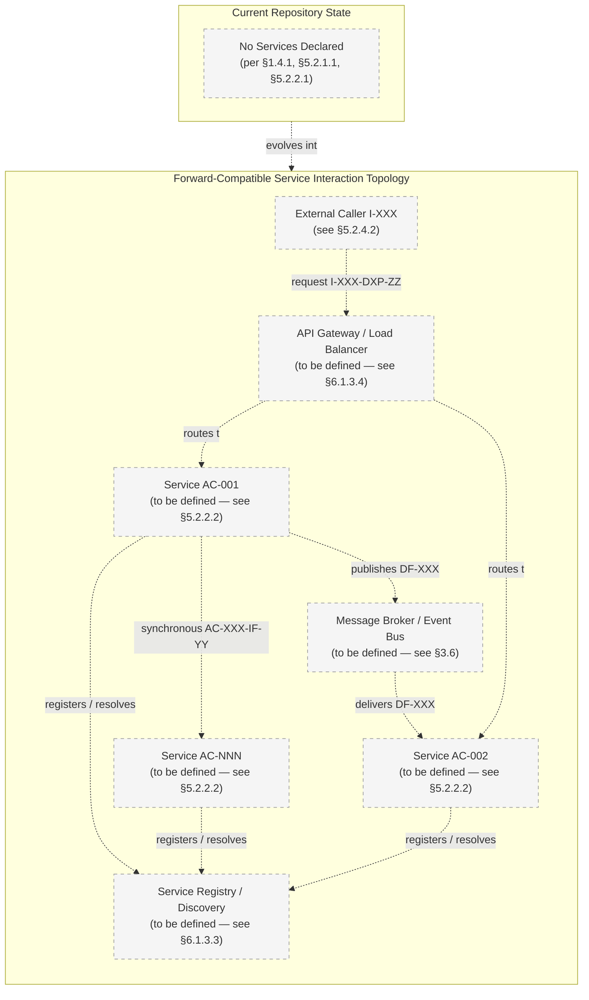
```mermaid
flowchart TB
    subgraph CurrentState["Current Repository State"]
        EmptyServices["No Services Declared<br/>(per §1.4.1, §5.2.1.1, §5.2.2.1)"]
    end

    subgraph FutureState["Forward-Compatible Service Interaction Topology"]
        direction TB
        Client["External Caller I-XXX<br/>(see §5.2.4.2)"]
        Gateway["API Gateway / Load Balancer<br/>(to be defined — see §6.1.3.4)"]
        Registry["Service Registry / Discovery<br/>(to be defined — see §6.1.3.3)"]
        ServiceA["Service AC-001<br/>(to be defined — see §5.2.2.2)"]
        ServiceB["Service AC-002<br/>(to be defined — see §5.2.2.2)"]
        ServiceN["Service AC-NNN<br/>(to be defined — see §5.2.2.2)"]
        Broker["Message Broker / Event Bus<br/>(to be defined — see §3.6)"]

        Client -.request I-XXX-DXP-ZZ.-> Gateway
        Gateway -.routes to.-> ServiceA
        Gateway -.routes to.-> ServiceB
        ServiceA -.registers / resolves.-> Registry
        ServiceB -.registers / resolves.-> Registry
        ServiceN -.registers / resolves.-> Registry
        ServiceA -.synchronous AC-XXX-IF-YY.-> ServiceN
        ServiceA -.publishes DF-XXX.-> Broker
        Broker -.delivers DF-XXX.-> ServiceB
    end

    CurrentState -.evolves into.-> FutureState

    classDef placeholder fill:#f5f5f5,stroke:#999,stroke-dasharray: 5 5
    class EmptyServices,Client,Gateway,Registry,ServiceA,ServiceB,ServiceN,Broker placeholder
```

#### 6.1.7.2 Scalability Architecture Diagram (Placeholder)

The diagram below depicts the empty present state and the forward-compatible scaling-architecture topology. The topology renders the auto-scaling-trigger → scaling-controller → replica-pool relationship that will become substantive once one or more scaling profiles are declared per the `AC-XXX-SCL-MM` schema of §5.2.2.2 and the corresponding KPIs are declared in §1.2.3.3 / §2.5.2.2.

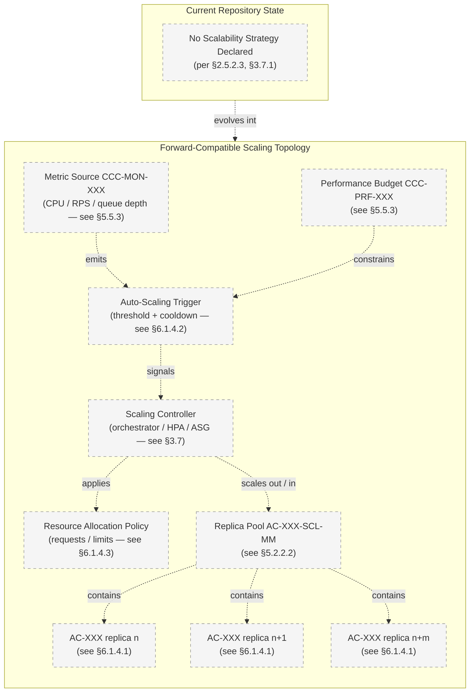
```mermaid
flowchart TB
    subgraph CurrentState["Current Repository State"]
        EmptyScaling["No Scalability Strategy Declared<br/>(per §2.5.2.3, §3.7.1)"]
    end

    subgraph FutureState["Forward-Compatible Scaling Topology"]
        direction TB
        Metric["Metric Source CCC-MON-XXX<br/>(CPU / RPS / queue depth — see §5.5.3)"]
        Trigger["Auto-Scaling Trigger<br/>(threshold + cooldown — see §6.1.4.2)"]
        Controller["Scaling Controller<br/>(orchestrator / HPA / ASG — see §3.7)"]
        Budget["Performance Budget CCC-PRF-XXX<br/>(see §5.5.3)"]
        Resource["Resource Allocation Policy<br/>(requests / limits — see §6.1.4.3)"]
        Pool["Replica Pool AC-XXX-SCL-MM<br/>(see §5.2.2.2)"]
        InstanceA["AC-XXX replica n<br/>(see §6.1.4.1)"]
        InstanceB["AC-XXX replica n+1<br/>(see §6.1.4.1)"]
        InstanceN["AC-XXX replica n+m<br/>(see §6.1.4.1)"]

        Metric -.emits.-> Trigger
        Budget -.constrains.-> Trigger
        Trigger -.signals.-> Controller
        Controller -.applies.-> Resource
        Controller -.scales out / in.-> Pool
        Pool -.contains.-> InstanceA
        Pool -.contains.-> InstanceB
        Pool -.contains.-> InstanceN
    end

    CurrentState -.evolves into.-> FutureState

    classDef placeholder fill:#f5f5f5,stroke:#999,stroke-dasharray: 5 5
    class EmptyScaling,Metric,Trigger,Controller,Budget,Resource,Pool,InstanceA,InstanceB,InstanceN placeholder
```

#### 6.1.7.3 Resilience Pattern Implementation Diagram (Placeholder)

The diagram below depicts the empty present state and the forward-compatible resilience-pattern topology specific to inter-service interactions — circuit breaker, retry, fallback, degradation, and recovery. It is complementary to (rather than a duplicate of) the generic error-handling flowchart of §4.6.3, which covers fault detection and classification at the workflow-step granularity. Future revisions will, once one or more failure modes are declared per the `EH-XXX-FM-YY` schema of §4.6.2 and one or more services are declared per the `AC-XXX` schema of §5.2.2.2, render service-scoped resilience diagrams that bind each failure mode to the calling service and the target service.

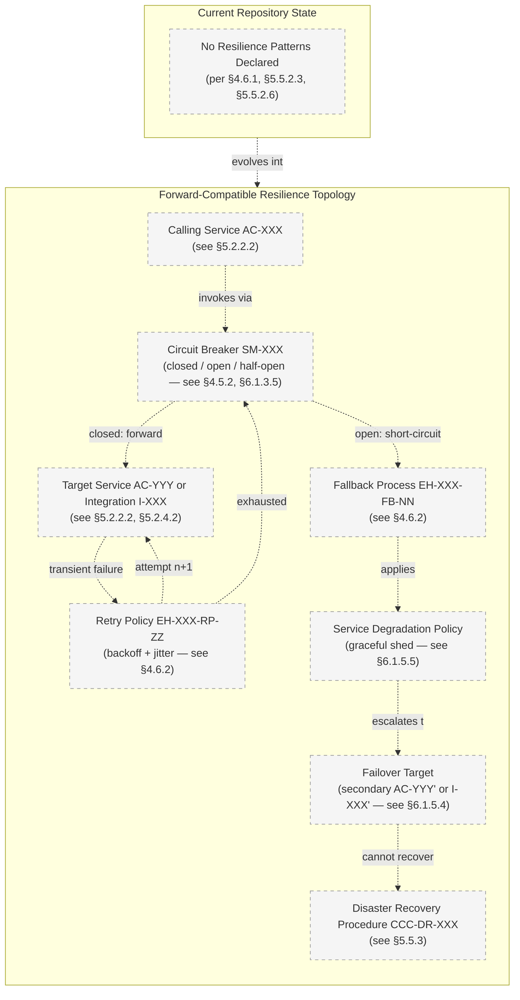
```mermaid
flowchart TB
    subgraph CurrentState["Current Repository State"]
        EmptyResilience["No Resilience Patterns Declared<br/>(per §4.6.1, §5.5.2.3, §5.5.2.6)"]
    end

    subgraph FutureState["Forward-Compatible Resilience Topology"]
        direction TB
        Caller["Calling Service AC-XXX<br/>(see §5.2.2.2)"]
        Breaker["Circuit Breaker SM-XXX<br/>(closed / open / half-open — see §4.5.2, §6.1.3.5)"]
        Retry["Retry Policy EH-XXX-RP-ZZ<br/>(backoff + jitter — see §4.6.2)"]
        Target["Target Service AC-YYY or Integration I-XXX<br/>(see §5.2.2.2, §5.2.4.2)"]
        Fallback["Fallback Process EH-XXX-FB-NN<br/>(see §4.6.2)"]
        Degraded["Service Degradation Policy<br/>(graceful shed — see §6.1.5.5)"]
        Failover["Failover Target<br/>(secondary AC-YYY' or I-XXX' — see §6.1.5.4)"]
        DR["Disaster Recovery Procedure CCC-DR-XXX<br/>(see §5.5.3)"]

        Caller -.invokes via.-> Breaker
        Breaker -.closed: forward.-> Target
        Target -.transient failure.-> Retry
        Retry -.attempt n+1.-> Target
        Retry -.exhausted.-> Breaker
        Breaker -.open: short-circuit.-> Fallback
        Fallback -.applies.-> Degraded
        Degraded -.escalates to.-> Failover
        Failover -.cannot recover.-> DR
    end

    CurrentState -.evolves into.-> FutureState

    classDef placeholder fill:#f5f5f5,stroke:#999,stroke-dasharray: 5 5
    class EmptyResilience,Caller,Breaker,Retry,Target,Fallback,Degraded,Failover,DR placeholder
```

### 6.1.8 Cross-Reference Anchors

Following the cross-reference-table pattern of §5.7.1, the table below maps each sub-topic enumerated by the section prompt to the authoritative upstream anchor that corroborates its empty-state declaration. The reader may navigate to any anchor to verify the evidence trail.

| §6.1 Sub-Topic | Corroborating Anchor(s) | Nature of Corroboration |
|----------------|--------------------------|--------------------------|
| Service Boundaries | §1.2.2.2, §2.4.4, §5.2.1.3, §5.2.2.1 | No components, libraries, or system boundaries |
| Inter-Service Communication | §4.3.1, §5.2.3.1, §5.2.4.1 | No integration workflows, data flows, or external integrations |
| Service Discovery | §1.2.1.3, §3.5.1 | No third-party services or platform integrations |
| Load Balancing | §3.7.1, §5.5.2.5 | No deployment topology or SLA |
| Circuit Breaker | §4.6.1, §5.5.2.3 | No resilience code or error-handling patterns |
| Retry & Fallback | §3.5.3, §4.6.1 | All four error-handling dimensions zero |
| Horizontal/Vertical Scaling | §2.5.2.3 | All four scaling dimensions empty |
| Auto-Scaling Triggers | §2.5.2.3, §3.7.1 | No deployment or IaC manifests |
| Resource Allocation | §2.5.2.2, §3.7.1 | No capacity model or runtime |
| Performance Optimization | §1.2.3.3, §2.5.2.2, §3.6.1 | No KPIs, no caches, no storage layer |
| Capacity Planning | §1.3.1.4, §2.5.2.2 | No technical requirements or throughput targets |
| Fault Tolerance | §4.6.1, §5.5.2.3 | No error-handling patterns |
| Disaster Recovery | §2.5.2.5, §5.5.2.6 | No backup/recovery/runbook |
| Data Redundancy | §3.6.1, §5.2.3.1 | No persistence engines or write paths |
| Failover Configurations | §3.7.1, §5.5.2.6 | No infrastructure or DR design |
| Service Degradation | §3.5.3, §4.6.1 | No fallback processes |

Following the inheritance pattern of §5.7.2, Section 6.1 inherits the three governing principles of §1.4.2 (Factual Grounding, Transparent Gaps, Forward Compatibility), the placeholder-diagram convention of §3.8.1, the four-column-table constraint of §5.6.3 (C-5-04), the single-source-of-truth principle for diagrams of §3.8.3 (preserved by cross-references to §4.6.3 and §5.3.3 rather than duplication of those diagrams), and the identifier-reuse principle of §5.6.3 (A-5-05). No new identifier scheme is introduced.

### 6.1.9 Triggers for Section Revision

Following the trigger-table pattern established in §1.4.3, §2.7.2, §3.9.1, §4.8.1, and §5.6.1, the table below enumerates the repository contributions that will cause specific subsections of §6.1 to require update.

| Trigger Event | Subsections Likely to Require Update |
|---------------|--------------------------------------|
| Commitment of source code establishing a process-boundary-crossing component (service) | §6.1.1, §6.1.3.1 |
| Declaration of an inter-service protocol (HTTP, gRPC, AMQP, Kafka, etc.) | §6.1.3.2 |
| Declaration of a service registry, DNS-based discovery, or platform discovery binding | §6.1.3.3 |
| Declaration of a load balancer, API gateway, or ingress configuration | §6.1.3.4 |
| Declaration of a circuit-breaker library or sidecar configuration | §6.1.3.5 |
| Declaration of retry or fallback logic in code (per §4.6 schema) | §6.1.3.6, §6.1.5.5 |
| Declaration of a horizontal or vertical scaling profile per `AC-XXX-SCL-MM` | §6.1.4.1 |
| Declaration of an HPA manifest, ASG policy, or KEDA scaler | §6.1.4.2 |
| Declaration of resource requests/limits in a deployment manifest | §6.1.4.3 |
| Declaration of a KPI in §1.2.3.3 or performance budget in §2.5.2.2 | §6.1.4.4 |
| Declaration of a workload model or demand forecast | §6.1.4.5 |
| Declaration of a bulkhead, timeout, deadline, or saga pattern | §6.1.5.1 |
| Declaration of a disaster recovery runbook, backup policy, or RTO/RPO target | §6.1.5.2 |
| Declaration of a replication topology or backup schedule in §3.6 | §6.1.5.3 |
| Declaration of a redundant deployment topology, active-active, or active-passive | §6.1.5.4 |
| Declaration of a graceful-degradation rule or feature-flag-driven shed | §6.1.5.5 |
| Authoring of an architecture decision record affecting service boundaries | §6.1.1, §6.1.3.1 |
| Commitment of a Dockerfile, IaC file, or orchestration manifest in §3.7 | §6.1.3.4, §6.1.4.1, §6.1.4.2, §6.1.5.4 |

When any of these triggers fires, the activation workflow established in §5.6.2 — repository change → architectural-artifact detection → category classification → subsection update → diagram regeneration → assumption/constraint reconciliation → cross-reference update — applies unchanged to Section 6.1.

### 6.1.10 Assumptions and Constraints

The following assumptions and constraints govern the present revision of §6.1 and are recorded explicitly so that future revisions can validate or supersede them. The identifier scheme mirrors §2.7.3, §3.9.3, §4.8.3, and §5.6.3.

| Identifier | Statement | Type |
|------------|-----------|------|
| A-6-01 | The repository contents on the day of authoring are exhaustively represented by the single `README.md` file at the root containing only the heading `# Artifact1` (inherited from A-5-01). | Assumption |
| A-6-02 | The section prompt's permission to declare non-applicability when the system "does not require microservices, distributed architecture, or distinct service components" is being exercised in this revision, on the basis that none of those three conditions is met by the verified repository state. | Assumption |
| A-6-03 | A committed component qualifies as a *service* — and thereby acquires a §6.1 entry — when its interface crosses a process or network boundary; intra-process modules are documented exclusively in §5.3 and not in §6.1. | Assumption |
| A-6-04 | Where Sections 4 and 5 have already authored a placeholder diagram for a concern (error handling in §4.6.3, component interaction in §5.3.3), Section 6.1 introduces its own service- / scaling- / resilience-specific placeholder rather than re-rendering the upstream diagram, and cross-references the upstream diagram in §6.1.8 to preserve mutual consistency per §3.8.3. | Assumption |
| A-6-05 | Identifier schemes already defined in upstream sections (`AC-XXX`, `AC-XXX-IF-YY`, `AC-XXX-DEP-ZZ`, `AC-XXX-DB-NN`, `AC-XXX-SCL-MM`, `DF-XXX`, `I-XXX`, `I-XXX-DXP-ZZ`, `I-XXX-SLA-MM`, `EH-XXX-*`, `SM-XXX`, `V-XXX-AZ-NN`, `CCC-PRF-XXX`, `CCC-DR-XXX`, `CCC-MON-XXX`) are reused unchanged by Section 6.1; no new identifier scheme is introduced. | Assumption |
| C-6-01 | No service boundary, inter-service communication pattern, service discovery mechanism, load balancing strategy, circuit breaker pattern, retry policy, fallback process, horizontal/vertical scaling profile, auto-scaling rule, resource allocation strategy, performance optimization technique, capacity planning guideline, fault-tolerance mechanism, disaster recovery procedure, data redundancy approach, failover configuration, or service degradation policy may be asserted in this revision because no corresponding artifact exists in the repository. | Constraint |
| C-6-02 | All Mermaid diagrams in this revision conform to the placeholder convention established in §3.8.1 (two-subgraph layout, dashed edges, `classDef placeholder fill:#f5f5f5,stroke:#999,stroke-dasharray: 5 5`). No operative service-architecture diagram is authored because no service architecture is in force (inherited from C-5-03). | Constraint |
| C-6-03 | All tables in this revision conform to the four-column maximum mandated by the section prompt's output-format requirements (inherited from C-5-04). Where the prompt enumerates more than four columns implicitly (e.g., service-component records with name, responsibility, dependencies, scaling profile, and resilience class), the additional dimensions are folded into the schema definitions of §6.1.6 or distributed across companion tables. | Constraint |
| C-6-04 | Cross-references to placeholder diagrams already authored in §4.6.3 (error handling), §5.3.3 (component interaction), §4.3.3 (integration sequence), and §4.5.3 (state transitions) are used in §6.1.8 in lieu of duplications, to maintain single-source-of-truth integrity (inherited from C-5-05). | Constraint |
| C-6-05 | The applicability declaration of §6.1.1 ("Core Services Architecture is not applicable") is **conditional** and remains in force only until at least one of the trigger events enumerated in §6.1.9 has occurred. Upon the first qualifying commit, §6.1.1 must be revised from a non-applicability declaration to a substantive architectural statement, and the corresponding sub-topic subsections (§6.1.3 through §6.1.5) must be populated accordingly. | Constraint |
| C-6-06 | The Default Technology Stack referenced in upstream section prompts is treated as presentational only and not as an authoritative commitment for service-architecture purposes (inherited from A-5-03 / A-3-02). No service technology selection (orchestrator, registry, gateway, breaker library, observability stack) may be inferred from its presence. | Constraint |

### 6.1.11 References

#### 6.1.11.1 Files Examined

| Path | Relevance to §6.1 |
|------|-------------------|
| `README.md` | Sole repository artifact; verified to contain only `# Artifact1`; establishes the empty-state evidence for every sub-topic of §6.1 |

#### 6.1.11.2 Folders Explored

| Path | Relevance to §6.1 |
|------|-------------------|
| `/` (repository root, depth 0) | Verified to contain only `README.md`; no subdirectories, no manifests, no source directories, no infrastructure-as-code directories, no orchestration manifests |

#### 6.1.11.3 Technical Specification Cross-References

| Section | Contribution to §6.1 |
|---------|----------------------|
| §1.2.1.3 | Empty enterprise-landscape integration table — corroborates absence of service discovery, identity provider, observability platform |
| §1.2.2.2 | Empty Major System Components diagram — corroborates absence of service boundaries |
| §1.2.3.3 | Empty KPI categories — corroborates absence of performance optimization targets |
| §1.3.1.4 | Empty technical requirements — corroborates absence of capacity planning baseline |
| §1.4.1 | Repository state verification — foundational evidence for all empty-state declarations |
| §1.4.2 | Three governing principles (Factual Grounding, Transparent Gaps, Forward Compatibility) — inherited unchanged |
| §2.4.4 | Zero shared components — corroborates absence of common services |
| §2.5.2.2 | Empty performance dimensions — corroborates §6.1.4.4 |
| §2.5.2.3 | Empty scalability dimensions — primary corroboration for §6.1.4 |
| §2.5.2.5 | Empty maintenance requirements — corroborates §6.1.5.2 |
| §3.5.1 | No third-party services — corroborates §6.1.3.3 |
| §3.5.3 | No third-party-service fallbacks — corroborates §6.1.3.6 and §6.1.5.5 |
| §3.6.1 | No persistence engines / caches / queues — corroborates §6.1.5.3 |
| §3.7.1 | No deployment tooling, IaC, or CI/CD — corroborates §6.1.3.4, §6.1.4.2, §6.1.5.4 |
| §3.8.1 | Placeholder-diagram convention — inherited for §6.1.7.1 through §6.1.7.3 |
| §3.8.3 | Single-source-of-truth principle for diagrams — inherited |
| §3.9.3 (A-3-02) | Default Technology Stack as presentational only — inherited |
| §4.3.1 | Empty integration-workflow inventory — corroborates §6.1.3.2 |
| §4.3.2 | `I-XXX` integration identifier — reused unchanged |
| §4.5.2 | `SM-XXX` state-machine identifier — reused for circuit-breaker state machines |
| §4.5.3 | Placeholder state-transition diagram — cross-referenced for future breaker-state diagrams |
| §4.6.1 | All four error-handling dimensions zero — primary corroboration for §6.1.3.5, §6.1.3.6, §6.1.5.1 |
| §4.6.2 | `EH-XXX-*` error-handling schema — reused unchanged |
| §4.6.3 | Placeholder error-handling flowchart — cross-referenced as authoritative for generic error flow |
| §5.2.1.1 | No architectural style — primary corroboration for §6.1.1 |
| §5.2.1.3 | Single trivial system boundary — corroborates §6.1.3.1 |
| §5.2.2.1 | Empty Core Components inventory — primary corroboration for §6.1.3.1 |
| §5.2.2.2 | `AC-XXX` and `AC-XXX-SCL-MM` schemata — reused unchanged |
| §5.2.3.1 | Empty data-flow inventory — corroborates §6.1.3.2 |
| §5.2.3.2 | `DF-XXX` data-flow identifier — reused unchanged |
| §5.2.4.1 | Empty external-integration inventory — corroborates §6.1.3.3 |
| §5.2.4.2 | `I-XXX-DXP-ZZ`, `I-XXX-PF-NN`, `I-XXX-SLA-MM` — reused unchanged |
| §5.3.1 | Empty component-specification dimensions — corroborates §6.1.3 |
| §5.3.2 | Component-specification composition schema — extended for service-scoped use |
| §5.3.3 | Placeholder component-interaction diagram — cross-referenced as authoritative for component interaction |
| §5.5.1 | Empty cross-cutting-concern inventory — corroborates §6.1.4 and §6.1.5 |
| §5.5.2.3 | No error-handling pattern declared — primary corroboration for §6.1.3.5 and §6.1.5.1 |
| §5.5.2.5 | No performance requirement or SLA — corroborates §6.1.3.4 and §6.1.4.4 |
| §5.5.2.6 | No disaster recovery procedure — primary corroboration for §6.1.5.2 and §6.1.5.4 |
| §5.5.3 | `CCC-PRF-XXX`, `CCC-DR-XXX`, `CCC-MON-XXX` — reused unchanged |
| §5.6.1 | Trigger-event pattern — inherited for §6.1.9 |
| §5.6.2 | Activation workflow — applies unchanged to §6.1 |
| §5.6.3 | Assumption/constraint pattern — inherited (A-5-01, A-5-03, A-5-04, A-5-05, C-5-03, C-5-04, C-5-05 explicitly carried forward as A-6-01, C-6-06, A-6-04, A-6-05, C-6-02, C-6-03, C-6-04) |
| §5.7.1 | Cross-reference-table pattern — inherited for §6.1.8 |

#### 6.1.11.4 Search Operations Performed

| Search Type | Query | Result Count | Implication |
|-------------|-------|--------------|-------------|
| File search | service architecture microservices components configuration | 0 | Confirms no service-related files exist |
| Folder search | services components microservices distributed architecture | 0 | Confirms no service-related folders exist |

---

## 6.2 Database Design

### 6.2.1 Applicability Statement

**Database Design is not applicable to this system in the present revision.**

The section prompt explicitly permits this declaration: "If the system does not require or direct database or persistent storage interactions are not clearly evident, clearly state 'Database Design is not applicable to this system' and explain why." The repository under specification meets this condition unambiguously and on multiple independent evidentiary grounds.

Per §1.4.1, the verified contents of the repository are a single `README.md` file at the root containing exactly one first-level Markdown heading (`# Artifact1`), zero subdirectories, zero source code artifacts, zero manifests, and zero declared external dependencies. Per §3.6.1, "The repository declares no databases, no caches, and no object-storage services. No database adapter, ORM configuration, connection string, environment variable referencing a datastore, schema definition (no `.sql` files, no migration directory, no `models.py`, no schema files), cache configuration (no Redis, Memcached, or equivalent), or object-storage configuration (no S3, GCS, Azure Blob, or equivalent) is committed." Per §1.3.2.4, no data domains, entity catalogs, schemas, or master-data references are declared. Per §5.2.3.1, the read/write paths to persistence and to cache are each zero. Per §4.5.1, the dimensions Data Persistence Points, Caching Requirements, and Transaction Boundaries each resolve to zero. Per §5.4.1, the Data Storage Solution Rationale and Caching Strategy Justification are each empty.

In the absence of any persistence engine, any schema, any data model, any data flow that touches a datastore, any cache, any transaction, any backup target, and any retention policy, none of the concerns enumerated by the section prompt — entity relationships, data models, indexing strategy, partitioning approach, replication configuration, backup architecture, migration procedures, versioning strategy, archival policies, storage and retrieval mechanisms, caching policies, data retention rules, backup and fault tolerance policies, privacy controls, audit mechanisms, access controls, query optimization, caching strategy, connection pooling, read/write splitting, or batch processing — can be substantively documented in this revision.

This subsection therefore proceeds in the **empty-state mode** that has been applied uniformly across Sections 1 through 6.1, governed by the three principles established in §1.4.2:

| Principle | Application to §6.2 |
|-----------|---------------------|
| Factual Grounding | Every statement reflects evidence (or the documented absence of evidence) in the repository |
| Transparent Gaps | Each sub-topic the prompt enumerates is named and recorded as empty rather than fabricated |
| Forward Compatibility | The subsection structure mirrors the canonical template so future content has a defined location |

### 6.2.2 Empty-State Acknowledgment for Database Concerns

The sub-topics enumerated by the section prompt are partitioned into four categories — Schema Design, Data Management, Compliance Considerations, and Performance Optimization — and each is documented below against an empty-state table that records (a) the dimension named by the prompt, (b) the count of items identified, and (c) the evidence source establishing the empty count. This mirrors the empty-state tables of §3.6.1, §4.5.1, §4.6.1, §5.2.2.1, §5.2.3.1, §5.5.1, and §6.1.2.

| Aggregate Concern | Items Identified Across All Sub-Topics | Authoritative Evidence Source |
|-------------------|----------------------------------------|-------------------------------|
| Schema Design | Zero | Per §1.3.2.4, §3.6.1, §3.6.3 |
| Data Management | Zero | Per §3.6.1, §3.6.3, §4.5.1 |
| Compliance Considerations | Zero | Per §2.5.2.4, §2.5.2.5, §5.5.2.6 |
| Performance Optimization | Zero | Per §3.6.1, §5.4.1, §5.4.3, §4.3.1 |

### 6.2.3 Schema Design (Empty State)

The section prompt enumerates six schema-design dimensions. Each resolves to the empty set as recorded below, with the corroborating evidence anchor specified inline.

| Schema Design Dimension | Items Identified | Evidence Source |
|-------------------------|------------------|-----------------|
| Entity Relationships | Zero | Per §1.3.2.4, §3.6.1 |
| Data Models and Structures | Zero | Per §1.3.2.4, §3.6.1 |
| Indexing Strategy | Zero | Per §3.6.1 (no persistence engine) |
| Partitioning Approach | Zero | Per §3.6.3 (Sharding/Partitioning Strategy: Not specified) |
| Replication Configuration | Zero | Per §6.1.5.3 (no data redundancy approach) |
| Backup Architecture | Zero | Per §2.5.2.5, §3.6.3, §5.5.2.6 |

#### 6.2.3.1 Entity Relationships

No entity relationship is declared in the repository. Per §1.3.2.4, "no data domains, entity catalogs, schemas, or master-data references are present in the repository. The data scope is therefore presently unspecified." Per §3.6.1, no schema definition file (`.sql`, ORM model definition, declarative schema file) is committed; per §1.4.1, the repository contains no source code from which inferable entity relationships could be derived. No one-to-one, one-to-many, many-to-many, parent-child, aggregate, association, or inheritance relationship has been authored.

Future entries will be recorded under the forward-compatible identifier scheme defined in §6.2.7. The schema will compose with the `AC-XXX-DB-NN` persistence-binding scheme of §5.2.2.2 so that each entity is bound to a declared component and persistence engine.

#### 6.2.3.2 Data Models and Structures

No data model or data structure is declared. Per §3.6.1, no `models.py`, no ORM declaration (SQLAlchemy, Hibernate, Prisma, Entity Framework, ActiveRecord, Sequelize, Mongoose, GORM), no Data Definition Language (DDL) artifact, no Avro schema, no Protocol Buffer schema, no JSON Schema document, and no GraphQL schema is committed. Per §1.3.2.4, no data domain exists from which a logical or physical data model could be authored. No tabular model, document model, key-value model, wide-column model, graph model, or time-series model is in force.

Future entries will reuse the engine-name and persistence-role conventions of the persistence catalog schema of §3.6.2, augmented by the forward-compatible entity / attribute / relationship identifiers introduced in §6.2.7.

#### 6.2.3.3 Indexing Strategy

No indexing strategy is declared. Per §3.6.1, no persistence engine exists against which indexes could be defined; per §5.4.3, the "Primary Operational Database Engine" and "Caching Tier" rationales are each recorded as not applicable. No primary key index, secondary index, composite index, partial index, expression index, covering index, full-text index, spatial index, hash index, B-tree index, or inverted index has been authored.

Future entries will be recorded under the index identifier introduced in §6.2.7, with each index attributed to (a) the entity it accelerates, (b) the query pattern it supports (per §6.2.6.1), and (c) the persistence engine that hosts it (per §3.6.2).

#### 6.2.3.4 Partitioning Approach

No partitioning approach is declared. Per §3.6.3, "Sharding / Partitioning Strategy: Not specified." Per §3.6.1, no persistence engine exists against which a partitioning policy could be applied. No horizontal partitioning, vertical partitioning, hash-based sharding, range-based sharding, geographic sharding, directory-based sharding, list partitioning, composite partitioning, or consistent-hashing scheme is in force.

Future entries will be carried under the `AC-XXX-SCL-MM` scaling-profile schema of §5.2.2.2 (specifically the *partitioned* and *sharded* sub-classes recognized in §6.1.4.1), composed with the persistence-binding `AC-XXX-DB-NN` scheme of §5.2.2.2 and the entity identifier of §6.2.7.

#### 6.2.3.5 Replication Configuration

No replication configuration is declared. Per §6.1.5.3, "no data redundancy approach is declared. Per §3.6.1, no persistence engine, no cache layer, no message queue, and no stream storage is committed — which excludes synchronous replication, asynchronous replication, multi-region replication, multi-master replication, snapshot-and-restore, point-in-time recovery, write-ahead-log shipping, and cross-account backup arrangements." No leader-follower, primary-replica, multi-master, multi-region, active-active, active-passive, semi-synchronous, or quorum-based replication topology is in force.

Future entries will be recorded under the persistence-redundancy binding scheme `AC-XXX-DB-NN` of §5.2.2.2 with the replication class carried as a schema attribute per §6.2.7, and joined to the `CCC-DR-XXX` disaster-recovery procedure of §5.5.3 that defines the recovery objective.

#### 6.2.3.6 Backup Architecture

No backup architecture is declared. Per §3.6.3, "Backup and Recovery Approach: Not specified." Per §2.5.2.5, the maintenance-requirement category "Backup and Recovery" is recorded as not specified. Per §5.5.2.6, "no disaster recovery procedure, no recovery time objective (RTO), no recovery point objective (RPO), no backup schedule, no failover topology, no chaos-engineering practice, and no incident-response runbook is declared in the repository." No full backup, incremental backup, differential backup, point-in-time recovery, snapshot policy, cross-region replication of backups, immutable backup store, or backup-verification routine is in force.

Future entries will be recorded under the `CCC-DR-XXX` schema of §5.5.3 (system-wide disaster recovery procedure), with each backup target tied to one or more persistence engines (`§3.6.2`), one or more components (`AC-XXX`), and an RTO/RPO declared per the future trigger events of §6.2.10.

### 6.2.4 Data Management (Empty State)

The section prompt enumerates five data-management dimensions. Each resolves to the empty set as recorded below.

| Data Management Dimension | Items Identified | Evidence Source |
|---------------------------|------------------|-----------------|
| Migration Procedures | Zero | Per §3.6.1, §3.9.1 |
| Versioning Strategy | Zero | Per §3.4.3, §3.7.3 |
| Archival Policies | Zero | Per §3.6.3 (Retention and Archival Policy: Not specified) |
| Data Storage and Retrieval Mechanisms | Zero | Per §3.6.1, §5.2.3.1 |
| Caching Policies | Zero | Per §3.6.1, §4.5.1, §5.4.3 |

#### 6.2.4.1 Migration Procedures

No data migration procedure is declared. Per §3.6.1, "no migration directory" exists in the repository; no Alembic, Flyway, Liquibase, Django migrations, Rails ActiveRecord migrations, Knex.js migrations, Goose, Atlas, dbmate, Sqitch, or Phinx artifact is committed. No DDL change set, no schema-evolution policy, no forward/backward compatibility rule, no rollback procedure, and no migration-execution runbook is in force.

Per §3.9.1, the "commitment of a database adapter, ORM, schema, or migration file" is identified as a trigger event that will cause the persistence inventory of §3.6 to be revised; the same trigger fires §6.2.10 below. Future entries will be recorded under the migration identifier of §6.2.7, with each migration tied to the schema change it effects and the version it advances.

#### 6.2.4.2 Versioning Strategy

No data versioning strategy is declared. Per §3.4.3, no versioning strategy has been declared for dependencies; per §3.7.3, "Release Cadence and Versioning" is recorded as not specified. No semantic-versioning convention applied to schemas, no migration sequence number, no schema registry (Confluent Schema Registry, AWS Glue Schema Registry, Apicurio), no contract-versioning policy, and no row-level versioning column (such as `version`, `updated_at`, optimistic-locking token, or vector clock) is in force.

Future entries will reuse the migration identifier of §6.2.7 with a monotonically increasing version field, and will be cross-linked to the release-cadence policy that §3.7.3 will eventually populate.

#### 6.2.4.3 Archival Policies

No archival policy is declared. Per §3.6.3, "Retention and Archival Policy: Not specified." No hot-warm-cold tiering, no time-based archival, no cost-based archival, no legal-hold mechanism, no archive-to-object-storage routine, and no archive-restoration procedure is in force.

Future entries will be recorded under the retention-policy identifier of §6.2.7, joined to the regulatory-compliance check scheme `V-XXX-RC-MM` of §4.4.3 where the archival rule derives from a regulatory obligation, and to the `CCC-DR-XXX` scheme of §5.5.3 where the archive interacts with disaster recovery.

#### 6.2.4.4 Data Storage and Retrieval Mechanisms

No data storage or retrieval mechanism is declared. Per §3.6.1, no persistence engine, no adapter, no driver, no connection string, and no environment variable referencing a datastore is committed. Per §5.2.3.1, the dimensions "Read / Write Paths to Persistence" and "Read / Write Paths to Cache" are each zero. Per §4.5.1, "Data Persistence Points: Zero" and "Transaction Boundaries: Zero." No CRUD interface, no repository pattern, no data-access object, no command query separation, no event-sourcing log, no materialized view, and no projection store is in force.

Future entries will be recorded under the persistence-binding `AC-XXX-DB-NN` scheme of §5.2.2.2 (component-to-engine binding), composed with the data-flow `DF-XXX` scheme of §5.2.3.2 (read and write paths) and the persistence-point `SM-XXX-P-NN` scheme of §4.5.2 (state-machine durability points).

#### 6.2.4.5 Caching Policies

No caching policy is declared. Per §3.6.1, "Cache Layer: No." Per §4.5.1, "Caching Requirements: Zero." Per §5.4.3, the "Caching Tier" rationale is empty. Per §5.2.3.1, the "Read / Write Paths to Cache" dimension is zero. No look-aside (cache-aside) caching, no read-through caching, no write-through caching, no write-behind (write-back) caching, no refresh-ahead caching, no in-memory caching (e.g., Caffeine, Guava, Ehcache), no distributed caching (e.g., Redis, Memcached, Hazelcast, Apache Ignite), no content delivery network caching, no HTTP browser caching directive, and no time-to-live (TTL) or time-to-idle (TTI) policy is in force.

Future entries will reuse the cache-checkpoint `SM-XXX-C-MM` scheme of §4.5.2 (state-machine caching point), composed with the persistence-binding `AC-XXX-DB-NN` scheme of §5.2.2.2 (cache engine binding) and the cache-policy identifier of §6.2.7 (invalidation and eviction rules).

### 6.2.5 Compliance Considerations (Empty State)

The section prompt enumerates five compliance dimensions. Each resolves to the empty set as recorded below.

| Compliance Dimension | Items Identified | Evidence Source |
|----------------------|------------------|-----------------|
| Data Retention Rules | Zero | Per §3.6.3 (Retention and Archival Policy: Not specified) |
| Backup and Fault Tolerance Policies | Zero | Per §2.5.2.5, §5.5.2.6, §6.1.5.1 |
| Privacy Controls | Zero | Per §1.3.2.3, §2.5.2.4 |
| Audit Mechanisms | Zero | Per §2.5.2.4, §5.5.2.1 |
| Access Controls | Zero | Per §2.5.2.4, §4.4.3, §5.5.2.4 |

#### 6.2.5.1 Data Retention Rules

No data retention rule is declared. Per §3.6.3, "Retention and Archival Policy: Not specified." No regulatory-grade retention rule (GDPR Article 5(1)(e) storage limitation, CCPA retention limitation, HIPAA retention rule, PCI DSS retention rule, SOX records-retention rule), no contractual retention rule, no business-driven retention rule, and no automated purge process is in force.

Future entries will be recorded under the regulatory-compliance check scheme `V-XXX-RC-MM` of §4.4.3 (where the retention rule originates from regulation), or under the retention-policy identifier of §6.2.7 (where the rule originates from business policy). Each rule will be joined to the entity (`§6.2.7`) and the persistence engine (`§3.6.2`) it governs.

#### 6.2.5.2 Backup and Fault Tolerance Policies

No backup or fault-tolerance policy is declared. Per §2.5.2.5, "Backup and Recovery: Not specified." Per §5.5.2.6, no backup schedule, no failover topology, no RTO, and no RPO is declared. Per §6.1.5.1, "no fault tolerance mechanism is declared. Per §5.5.2.3, 'no error-handling pattern is declared. Per §4.6.1, the four error-handling dimensions (retry mechanisms, fallback processes, error notification flows, recovery procedures) are each zero.'" No bulkhead, no quorum-based commit, no read-repair, no anti-entropy process, no checksum / scrub policy, and no point-in-time-recovery commitment is in force.

Future entries will reuse the `CCC-DR-XXX` schema of §5.5.3 (system-wide disaster recovery), tied to the `EH-XXX-FM-YY` failure-mode scheme of §4.6.2 (per-data-store failure mode) and the `EH-XXX-RV-PP` recovery-procedure scheme of §4.6.2 (per-data-store recovery procedure).

#### 6.2.5.3 Privacy Controls

No privacy control is declared. Per §2.5.2.4, "Data Protection (at rest / in transit): Not specified." Per §1.3.2.3, no jurisdictions are declared from which regulatory privacy obligations could be derived. No personally identifiable information (PII) classification, no sensitive personal data (SPD) classification, no encryption at rest, no encryption in transit, no key-management service binding, no tokenization, no field-level masking, no row-level security, no pseudonymization, no anonymization, no data-subject-rights (DSR) interface (access, rectification, erasure, restriction, portability, objection), and no consent ledger is in force.

Future entries will be recorded under the regulatory-compliance check scheme `V-XXX-RC-MM` of §4.4.3 with each privacy control tied to the regulation that mandates it (GDPR, CCPA, HIPAA, GLBA, PIPEDA, LGPD, PDPA, or successor instruments) and to the entity or attribute (`§6.2.7`) it governs.

#### 6.2.5.4 Audit Mechanisms

No audit mechanism is declared. Per §2.5.2.4, "Auditability: Not specified." Per §5.5.2.1, no monitoring or observability mechanism is declared. No audit-log table, no change-data-capture (CDC) feed, no immutable audit ledger, no temporal table, no system-versioned table, no audit trigger (database-level), no application-level audit interceptor, and no audit-log retention policy is in force.

Future entries will reuse the `CCC-LOG-XXX` logging-channel scheme of §5.5.3 (for the audit-log channel itself), composed with the `V-XXX-AZ-NN` authorization-checkpoint scheme of §4.4.3 (the action being audited), the `V-XXX-RC-MM` regulatory-compliance check scheme (the regulation requiring the audit), and the entity (`§6.2.7`) being changed.

#### 6.2.5.5 Access Controls

No data-tier access control is declared. Per §2.5.2.4, "Authorization: Not specified." Per §4.4.3, no `V-XXX-AZ-NN` authorization checkpoint is assigned. Per §5.5.2.4, "no authentication mechanism (session-based, token-based, OAuth 2.0, OpenID Connect, SAML, mutual TLS) and no authorization model (role-based, attribute-based, relationship-based, capability-based) is declared in the repository." No database-level user/role, no row-level security policy, no column-level grant, no view-based projection for least privilege, no IAM-bound database authentication, no secrets-manager binding for connection credentials, no network-isolated database subnet, and no private-endpoint binding is in force.

Future entries will reuse the `V-XXX-AZ-NN` authorization-checkpoint scheme of §4.4.3 (the rule), composed with the `CCC-AUTHN-XXX` authentication-mechanism scheme of §5.5.3 (the identity binding) and the persistence-binding `AC-XXX-DB-NN` scheme of §5.2.2.2 (the engine being protected).

### 6.2.6 Performance Optimization (Empty State)

The section prompt enumerates five performance-optimization dimensions. Each resolves to the empty set as recorded below.

| Performance Dimension | Items Identified | Evidence Source |
|------------------------|------------------|-----------------|
| Query Optimization Patterns | Zero | Per §3.6.1, §6.1.4.4 |
| Caching Strategy | Zero | Per §3.6.1, §5.4.1, §5.4.3 |
| Connection Pooling | Zero | Per §3.6.1, §6.1.4.4 |
| Read/Write Splitting | Zero | Per §3.6.1, §6.1.5.3 |
| Batch Processing Approach | Zero | Per §3.7.1, §4.3.1 |

#### 6.2.6.1 Query Optimization Patterns

No query optimization pattern is declared. Per §3.6.1, no persistence engine exists against which a query could be authored or optimized; per §6.1.4.4, "no performance optimization technique is declared... No optimization technique — caching, batching, connection pooling, lazy loading, prefetching, compression, content negotiation, query optimization, materialized view, partitioning, sharding — is therefore in force." No query plan, no explain analysis, no index-only scan, no covering-index design, no predicate pushdown, no join-order hint, no statistics-collection policy, no materialized view, and no precomputed aggregate is in force.

Future entries will be recorded under the query-pattern identifier of §6.2.7, joined to the index identifier (`§6.2.7`) that supports it and to the `CCC-PRF-XXX` system-wide performance budget of §5.5.3 it must satisfy.

#### 6.2.6.2 Caching Strategy

No caching strategy is declared. Per §3.6.1, "Cache Layer: No." Per §5.4.1, "Caching Strategy Justification: Zero." Per §5.4.3, "Caching Tier: No." Per §4.5.1, "Caching Requirements: Zero." No multi-tier cache hierarchy (L1 in-process / L2 distributed / L3 origin), no read-through, write-through, write-behind, or cache-aside pattern, no cache-warming routine, no negative-result caching policy, no cache-stampede protection, no consistent-hashing partitioning, and no TTL/TTI policy is in force.

Future entries will reuse the `SM-XXX-C-MM` cache-checkpoint scheme of §4.5.2 (where the cache participates in a state machine), composed with the persistence-binding `AC-XXX-DB-NN` scheme of §5.2.2.2 (the cache engine itself) and the cache-policy identifier of §6.2.7 (invalidation and eviction rules). This subsection is the §6.2-scoped specialization of the cache-strategy concern that §5.5.3 carries at the system-wide level.

#### 6.2.6.3 Connection Pooling

No connection pooling configuration is declared. Per §3.6.1, no persistence engine, no driver, no adapter, and no connection string is committed; per §6.1.4.4, connection pooling is among the optimization techniques explicitly not in force. No pool-size minimum or maximum, no idle-eviction policy, no validation-query interval, no leak-detection threshold, no pooling library (HikariCP, c3p0, PgBouncer, ProxySQL, RDS Proxy, pgpool-II, MySQL Router) is in force.

Future entries will be recorded under the connection-pool identifier of §6.2.7, joined to the persistence-binding `AC-XXX-DB-NN` scheme of §5.2.2.2 (the engine being pooled), the `AC-XXX-IF-YY` interface scheme of §5.2.2.2 (the consuming component's outbound interface), and the `CCC-PRF-XXX` performance-budget scheme of §5.5.3 (the budget the pool must respect).

#### 6.2.6.4 Read/Write Splitting

No read/write splitting topology is declared. Per §3.6.1, no replica topology exists; per §6.1.5.3, "no data redundancy approach is declared." No primary-write / replica-read routing, no read-after-write consistency policy, no replication-lag tolerance threshold, no replica-affinity rule, and no quorum read/write configuration is in force.

Future entries will be carried under the persistence-binding `AC-XXX-DB-NN` scheme of §5.2.2.2 with the read/write role attribute (primary, replica-read-only, replica-read-write) carried per the schema of §6.2.7, joined to the `AC-XXX-SCL-MM` scaling-profile scheme of §5.2.2.2 that defines the topology.

#### 6.2.6.5 Batch Processing Approach

No batch processing approach is declared for data-tier workloads. Per §4.3.1, "Batch Processing Sequences: Zero." Per §3.7.1, no scheduled job, cron entry, batch scheduler, workflow engine (Airflow, Argo Workflows, Dagster, Prefect, Luigi), or stream-processing manifest (Kafka Streams, Flink, Spark Structured Streaming) is committed. No bulk-insert routine, no `COPY`/`BULK INSERT`/`LOAD DATA` operation, no batched-update windowing, no ETL/ELT pipeline, no change-data-capture downstream consumer, and no batch-vs-online split is in force.

Future entries will be recorded under the data-flow `DF-XXX` scheme of §5.2.3.2 (the data movement itself), composed with the data-transformation `DF-XXX-TX-ZZ` scheme of §5.2.3.2 (the per-step transformation) and the integration `I-XXX` scheme of §4.3.2 (when the batch crosses a system boundary).

### 6.2.7 Forward-Compatible Database Design Schema

Following the schema-declaration pattern established in §2.2.2, §4.5.2, §4.6.2, §5.2.2.2, §5.2.3.2, §5.5.3, §6.1.6 — "the schema is presented now so that subsequent revisions adopt a consistent identification convention from the first declared item onward" — Section 6.2 reserves the following identifier-schema mappings for forward use.

Per assumption A-6-05 of §6.1.10, inherited unchanged as A-6-05 of §6.2.11, Section 6.2 introduces **no new identifier scheme**; every concern enumerated by the prompt is covered by a scheme already established in §3.6.2, §4.4.3, §4.5.2, §4.6.2, §5.2.2.2, §5.2.3.2, §5.5.3. Identifiers below are presented as composed reuses of upstream schemes; the right-most column identifies the origin section.

#### 6.2.7.1 Schema Design Identifiers

| Database Design Concern | Forward Identifier Format | Origin Section |
|--------------------------|---------------------------|----------------|
| Persistence Engine (database, cache, queue, blob, search) | Persistence Catalog Entry | §3.6.2 |
| Component-to-Engine Binding (persistence binding) | `AC-XXX-DB-NN` | §5.2.2.2 |
| Logical Entity / Table / Collection / Document Type | `AC-XXX-DB-NN-E-YY` (composed) | §5.2.2.2 |
| Attribute / Field / Column (within an entity) | `AC-XXX-DB-NN-E-YY-A-ZZ` (composed) | §5.2.2.2 |
| Entity Relationship (foreign key, reference, edge) | `AC-XXX-DB-NN-R-MM` (composed) | §5.2.2.2 |
| Index (any kind) | `AC-XXX-DB-NN-I-PP` (composed) | §5.2.2.2 |
| Constraint (unique, check, not-null, foreign-key, default) | `AC-XXX-DB-NN-C-QQ` (composed) | §5.2.2.2 |
| Partitioning / Sharding Profile | `AC-XXX-SCL-MM` | §5.2.2.2 |
| Replication / Redundancy Class | `AC-XXX-DB-NN` (with redundancy attribute) | §5.2.2.2 / §6.1.5.3 |
| Backup Target / Schedule | `CCC-DR-XXX` | §5.5.3 |

#### 6.2.7.2 Data Management Identifiers

| Data Management Concern | Forward Identifier Format | Origin Section |
|--------------------------|---------------------------|----------------|
| Migration Step (DDL change set) | `AC-XXX-DB-NN-M-RR` (composed) | §5.2.2.2 |
| Schema Version | `AC-XXX-DB-NN-V-SS` (composed) | §5.2.2.2 |
| Read Path / Write Path (data flow to engine) | `DF-XXX` | §5.2.3.2 |
| Data Flow Endpoint at Engine | `DF-XXX-EP-YY` | §5.2.3.2 |
| Persistence Point (state-machine durability point) | `SM-XXX-P-NN` | §4.5.2 |
| Cache Checkpoint (state-machine cache touch) | `SM-XXX-C-MM` | §4.5.2 |
| Transaction Boundary | `SM-XXX-TX-QQ` | §4.5.2 |
| Retention / Archival Policy | `CCC-DR-XXX` (with retention attribute) | §5.5.3 |

#### 6.2.7.3 Compliance Identifiers

| Compliance Concern | Forward Identifier Format | Origin Section |
|---------------------|---------------------------|----------------|
| Regulatory Compliance Check (retention, privacy, audit) | `V-XXX-RC-MM` | §4.4.3 |
| Data Validation Rule | `V-XXX-DV-ZZ` | §4.4.3 |
| Authorization Checkpoint (data-tier access) | `V-XXX-AZ-NN` | §4.4.3 |
| Authentication Mechanism (DB credentials, IAM binding) | `CCC-AUTHN-XXX` | §5.5.3 |
| Audit Log Channel | `CCC-LOG-XXX` | §5.5.3 |
| Disaster Recovery Procedure (backup, RTO, RPO) | `CCC-DR-XXX` | §5.5.3 |

#### 6.2.7.4 Performance Identifiers

| Performance Concern | Forward Identifier Format | Origin Section |
|----------------------|---------------------------|----------------|
| Query Pattern / Execution Plan | `AC-XXX-DB-NN-Q-TT` (composed) | §5.2.2.2 |
| Connection Pool Configuration | `AC-XXX-DB-NN-P-UU` (composed) | §5.2.2.2 |
| Read/Write Routing Policy | `AC-XXX-SCL-MM` (with role attribute) | §5.2.2.2 |
| Batch Processing Step (data-tier) | `DF-XXX-TX-ZZ` | §5.2.3.2 |
| System-Wide Database Performance Budget | `CCC-PRF-XXX` | §5.5.3 |
| Per-Integration SLA (where DB is the integration) | `I-XXX-SLA-MM` | §5.2.4.2 |
| Failure Mode (per-engine) | `EH-XXX-FM-YY` | §4.6.2 |
| Recovery Procedure (per-engine) | `EH-XXX-RV-PP` | §4.6.2 |

No identifier in any of the above formats is assigned in this revision because no persistence engine, no entity, no index, no constraint, no migration, no replication topology, no backup target, no retention rule, no privacy control, no audit channel, no access-control rule, no query pattern, no connection pool, no read/write routing policy, no batch step, no DB performance budget, no DB-as-integration SLA, no DB failure mode, and no DB recovery procedure has been declared in the repository.

### 6.2.8 Required Diagrams

The section prompt requires three diagrams: a database schema (ERD) diagram, a data flow diagram, and a replication architecture diagram. Following the placeholder-diagram convention established in §3.8.1 and inherited throughout (§1.2.2.2, §2.4.2, §4.2.3, §4.3.3, §4.5.3, §4.6.3, §5.3.3, §5.4.4, §6.1.7), each diagram below uses the two-subgraph layout (`CurrentState` and `FutureState`), dashed edges (`-.->`), and the placeholder styling directive `classDef placeholder fill:#f5f5f5,stroke:#999,stroke-dasharray: 5 5`. The diagrams are author-original to Section 6.2 (database-, data-flow-, and replication-specific) rather than duplicates of the upstream component-interaction diagram of §5.3.3 or the technology-stack diagram of §3.8.1, both of which remain authoritative for their respective concerns and are referenced in §6.2.9.

#### 6.2.8.1 Database Schema (Entity-Relationship) Diagram — Placeholder

Mermaid's `erDiagram` notation is constrained to relationships among named entities and cannot render the dashed-edge / two-subgraph convention. To preserve the established convention while still satisfying the prompt's ERD requirement, the diagram below is rendered as a `flowchart` with ERD semantics in the labels (entity, attribute, relationship) and is supplemented by a companion `erDiagram` skeleton that future revisions will populate.

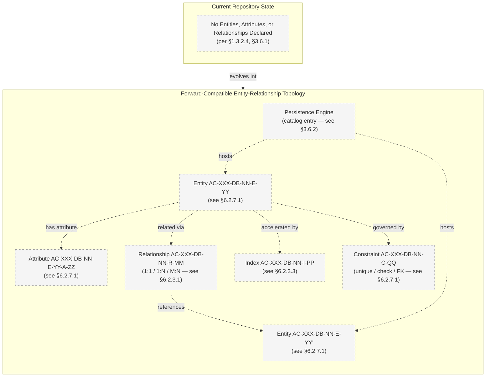
```mermaid
flowchart TB
    subgraph CurrentState["Current Repository State"]
        EmptyERD["No Entities, Attributes, or Relationships Declared<br/>(per §1.3.2.4, §3.6.1)"]
    end

    subgraph FutureState["Forward-Compatible Entity-Relationship Topology"]
        direction TB
        EngineA["Persistence Engine<br/>(catalog entry — see §3.6.2)"]
        EntityA["Entity AC-XXX-DB-NN-E-YY<br/>(see §6.2.7.1)"]
        EntityB["Entity AC-XXX-DB-NN-E-YY'<br/>(see §6.2.7.1)"]
        AttrA["Attribute AC-XXX-DB-NN-E-YY-A-ZZ<br/>(see §6.2.7.1)"]
        Relation["Relationship AC-XXX-DB-NN-R-MM<br/>(1:1 / 1:N / M:N — see §6.2.3.1)"]
        Index["Index AC-XXX-DB-NN-I-PP<br/>(see §6.2.3.3)"]
        Constraint["Constraint AC-XXX-DB-NN-C-QQ<br/>(unique / check / FK — see §6.2.7.1)"]

        EngineA -.hosts.-> EntityA
        EngineA -.hosts.-> EntityB
        EntityA -.has attribute.-> AttrA
        EntityA -.related via.-> Relation
        Relation -.references.-> EntityB
        EntityA -.accelerated by.-> Index
        EntityA -.governed by.-> Constraint
    end

    CurrentState -.evolves into.-> FutureState

    classDef placeholder fill:#f5f5f5,stroke:#999,stroke-dasharray: 5 5
    class EmptyERD,EngineA,EntityA,EntityB,AttrA,Relation,Index,Constraint placeholder
```

The companion `erDiagram` skeleton below preserves a native ERD rendering convention for future population. Because Mermaid's `erDiagram` requires at least one entity to render, a single placeholder entity is presented with explanatory attributes; no real entity is asserted.

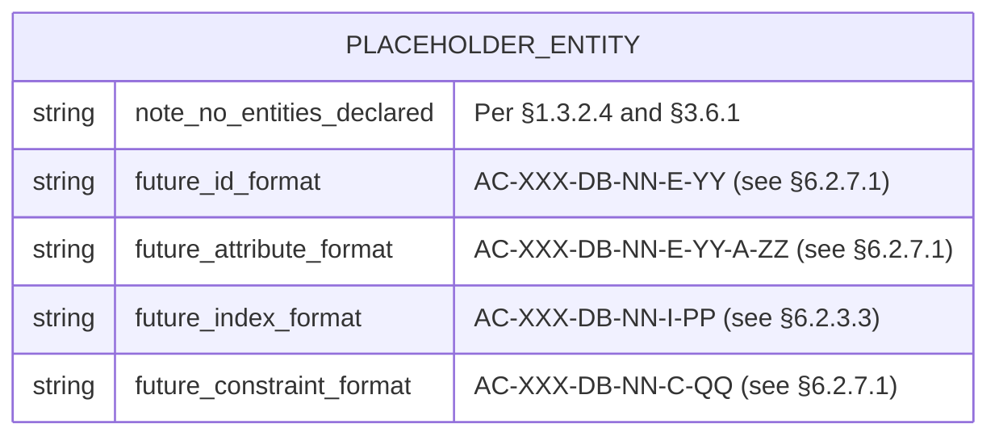
```mermaid
erDiagram
    PLACEHOLDER_ENTITY {
        string note_no_entities_declared "Per §1.3.2.4 and §3.6.1"
        string future_id_format "AC-XXX-DB-NN-E-YY (see §6.2.7.1)"
        string future_attribute_format "AC-XXX-DB-NN-E-YY-A-ZZ (see §6.2.7.1)"
        string future_index_format "AC-XXX-DB-NN-I-PP (see §6.2.3.3)"
        string future_constraint_format "AC-XXX-DB-NN-C-QQ (see §6.2.7.1)"
    }
```

#### 6.2.8.2 Data Flow Diagram — Placeholder

The diagram below depicts the empty present state and the forward-compatible data-flow topology specific to data-tier interactions — application read, application write, batch ingest, change-data-capture egress, cache touch, and event publication. It is complementary to (rather than a duplicate of) the placeholder component-interaction diagram of §5.3.3, which covers component-to-component interaction at a coarser granularity, and to the technology-stack diagram of §3.8.1, which covers cross-layer composition.

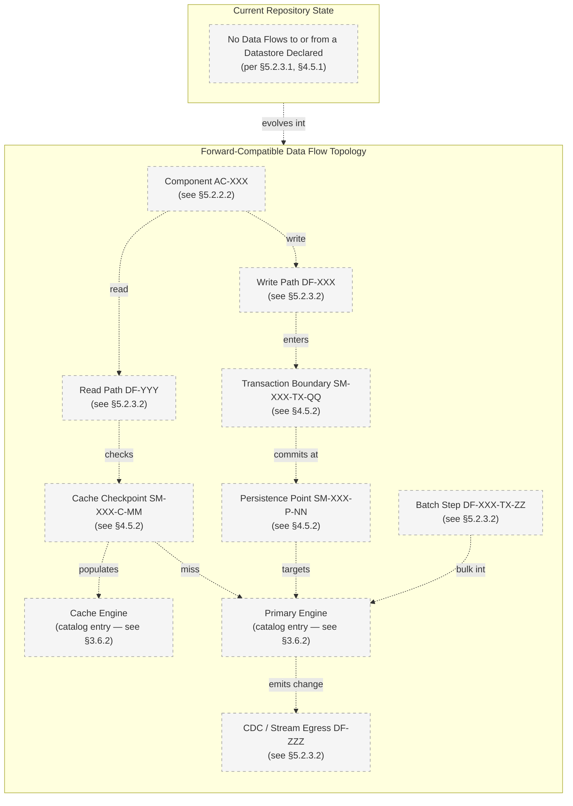
```mermaid
flowchart TB
    subgraph CurrentState["Current Repository State"]
        EmptyFlow["No Data Flows to or from a Datastore Declared<br/>(per §5.2.3.1, §4.5.1)"]
    end

    subgraph FutureState["Forward-Compatible Data Flow Topology"]
        direction TB
        Component["Component AC-XXX<br/>(see §5.2.2.2)"]
        WriteFlow["Write Path DF-XXX<br/>(see §5.2.3.2)"]
        ReadFlow["Read Path DF-YYY<br/>(see §5.2.3.2)"]
        TxBoundary["Transaction Boundary SM-XXX-TX-QQ<br/>(see §4.5.2)"]
        PersistencePoint["Persistence Point SM-XXX-P-NN<br/>(see §4.5.2)"]
        CacheCheck["Cache Checkpoint SM-XXX-C-MM<br/>(see §4.5.2)"]
        PrimaryEngine["Primary Engine<br/>(catalog entry — see §3.6.2)"]
        CacheEngine["Cache Engine<br/>(catalog entry — see §3.6.2)"]
        BatchStep["Batch Step DF-XXX-TX-ZZ<br/>(see §5.2.3.2)"]
        CDCFlow["CDC / Stream Egress DF-ZZZ<br/>(see §5.2.3.2)"]

        Component -.write.-> WriteFlow
        WriteFlow -.enters.-> TxBoundary
        TxBoundary -.commits at.-> PersistencePoint
        PersistencePoint -.targets.-> PrimaryEngine
        Component -.read.-> ReadFlow
        ReadFlow -.checks.-> CacheCheck
        CacheCheck -.miss.-> PrimaryEngine
        CacheCheck -.populates.-> CacheEngine
        PrimaryEngine -.emits change.-> CDCFlow
        BatchStep -.bulk into.-> PrimaryEngine
    end

    CurrentState -.evolves into.-> FutureState

    classDef placeholder fill:#f5f5f5,stroke:#999,stroke-dasharray: 5 5
    class EmptyFlow,Component,WriteFlow,ReadFlow,TxBoundary,PersistencePoint,CacheCheck,PrimaryEngine,CacheEngine,BatchStep,CDCFlow placeholder
```

#### 6.2.8.3 Replication Architecture Diagram — Placeholder

The diagram below depicts the empty present state and the forward-compatible replication topology that future revisions will populate. The topology renders the primary, synchronous-replica, asynchronous-replica, cross-region-replica, backup-target, and disaster-recovery-procedure relationships that will become substantive once a persistence engine is committed per §3.6.2 and a redundancy class is bound per §5.2.2.2 / §6.1.5.3.

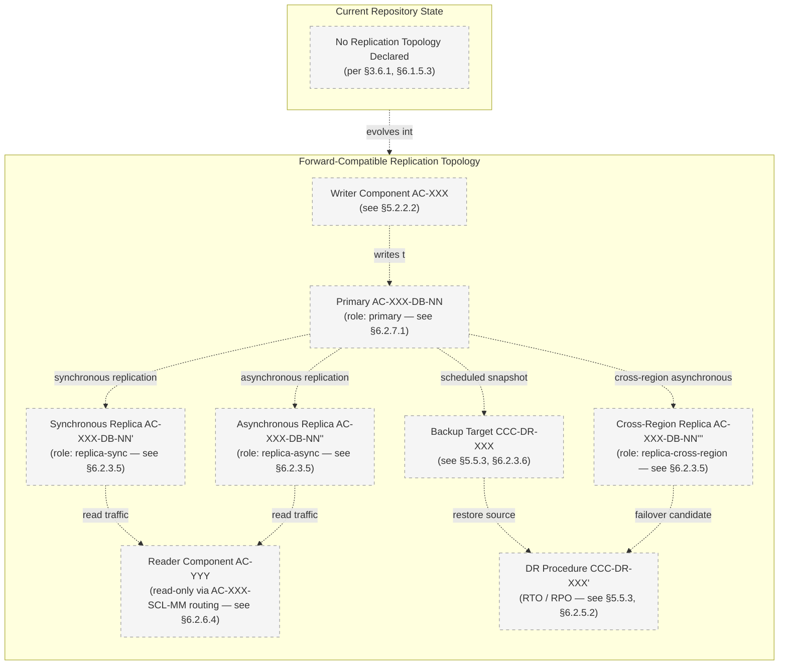
```mermaid
flowchart TB
    subgraph CurrentState["Current Repository State"]
        EmptyReplication["No Replication Topology Declared<br/>(per §3.6.1, §6.1.5.3)"]
    end

    subgraph FutureState["Forward-Compatible Replication Topology"]
        direction TB
        Writer["Writer Component AC-XXX<br/>(see §5.2.2.2)"]
        Primary["Primary AC-XXX-DB-NN<br/>(role: primary — see §6.2.7.1)"]
        SyncReplica["Synchronous Replica AC-XXX-DB-NN'<br/>(role: replica-sync — see §6.2.3.5)"]
        AsyncReplica["Asynchronous Replica AC-XXX-DB-NN''<br/>(role: replica-async — see §6.2.3.5)"]
        CrossRegion["Cross-Region Replica AC-XXX-DB-NN'''<br/>(role: replica-cross-region — see §6.2.3.5)"]
        Reader["Reader Component AC-YYY<br/>(read-only via AC-XXX-SCL-MM routing — see §6.2.6.4)"]
        BackupTarget["Backup Target CCC-DR-XXX<br/>(see §5.5.3, §6.2.3.6)"]
        DRProcedure["DR Procedure CCC-DR-XXX'<br/>(RTO / RPO — see §5.5.3, §6.2.5.2)"]

        Writer -.writes to.-> Primary
        Primary -.synchronous replication.-> SyncReplica
        Primary -.asynchronous replication.-> AsyncReplica
        Primary -.cross-region asynchronous.-> CrossRegion
        SyncReplica -.read traffic.-> Reader
        AsyncReplica -.read traffic.-> Reader
        Primary -.scheduled snapshot.-> BackupTarget
        BackupTarget -.restore source.-> DRProcedure
        CrossRegion -.failover candidate.-> DRProcedure
    end

    CurrentState -.evolves into.-> FutureState

    classDef placeholder fill:#f5f5f5,stroke:#999,stroke-dasharray: 5 5
    class EmptyReplication,Writer,Primary,SyncReplica,AsyncReplica,CrossRegion,Reader,BackupTarget,DRProcedure placeholder
```

### 6.2.9 Cross-Reference Anchors

Following the cross-reference-table pattern of §5.7.1 and §6.1.8, the table below maps each sub-topic enumerated by the section prompt to the authoritative upstream anchor that corroborates its empty-state declaration. The reader may navigate to any anchor to verify the evidence trail.

#### 6.2.9.1 Sub-Topic to Evidence Anchor Mapping

| §6.2 Sub-Topic | Corroborating Anchor(s) | Nature of Corroboration |
|----------------|--------------------------|--------------------------|
| Entity Relationships | §1.3.2.4, §3.6.1 | No data domains, no schemas |
| Data Models & Structures | §1.3.2.4, §3.6.1 | No data domains, no schema files |
| Indexing Strategy | §3.6.1, §5.4.3 | No persistence engine to index |
| Partitioning Approach | §3.6.3, §6.1.4.1 | Sharding/partitioning not specified |
| Replication Configuration | §3.6.1, §6.1.5.3 | No data redundancy approach |
| Backup Architecture | §2.5.2.5, §3.6.3, §5.5.2.6 | No backup schedule, no RTO/RPO |
| Migration Procedures | §3.6.1, §3.9.1 | No migration directory |
| Versioning Strategy | §3.4.3, §3.7.3 | No versioning strategy declared |
| Archival Policies | §3.6.3 | Retention/archival not specified |
| Storage & Retrieval | §3.6.1, §5.2.3.1, §4.5.1 | No engines, no R/W paths |
| Caching Policies | §3.6.1, §4.5.1, §5.4.3 | No cache engine |
| Data Retention Rules | §3.6.3 | Retention not specified |
| Backup & Fault Tolerance | §2.5.2.5, §5.5.2.6, §6.1.5.1 | No backup, no fault tolerance |
| Privacy Controls | §1.3.2.3, §2.5.2.4 | No jurisdictions, no data protection |
| Audit Mechanisms | §2.5.2.4, §5.5.2.1 | No auditability, no observability |
| Access Controls | §2.5.2.4, §4.4.3, §5.5.2.4 | No authorization checkpoints |
| Query Optimization | §3.6.1, §6.1.4.4 | No engine, no optimization technique |
| Caching Strategy | §3.6.1, §5.4.1, §5.4.3 | No cache, no caching rationale |
| Connection Pooling | §3.6.1, §6.1.4.4 | No driver, no pooling |
| Read/Write Splitting | §3.6.1, §6.1.5.3 | No replica topology |
| Batch Processing | §3.7.1, §4.3.1 | Batch sequences zero |

#### 6.2.9.2 Inherited Conventions

Following the inheritance pattern of §5.7.2 and §6.1.8, Section 6.2 inherits the three governing principles of §1.4.2 (Factual Grounding, Transparent Gaps, Forward Compatibility), the placeholder-diagram convention of §3.8.1, the four-column-table constraint (C-5-04 / C-6-03) of §5.6.3 / §6.1.10, the single-source-of-truth principle for diagrams of §3.8.3 (preserved by cross-references to §5.3.3 and §3.8.1 rather than duplication of those diagrams), and the identifier-reuse principle of §5.6.3 / §6.1.10 (A-5-05 / A-6-05). No new identifier scheme is introduced; the schemas of §3.6.2, §4.4.3, §4.5.2, §4.6.2, §5.2.2.2, §5.2.3.2, and §5.5.3 are composed without modification.

### 6.2.10 Triggers for Section Revision

Following the trigger-table pattern established in §1.4.3, §2.7.2, §3.9.1, §4.8.1, §5.6.1, and §6.1.9, the table below enumerates the repository contributions that will cause specific subsections of §6.2 to require update.

| Trigger Event | Subsections Likely to Require Update |
|---------------|--------------------------------------|
| Commitment of a database adapter or driver (JDBC, psycopg2, MongoDB driver, etc.) | §6.2.1, §6.2.4.4, §6.2.6.3 |
| Commitment of an ORM model definition (SQLAlchemy, Hibernate, Prisma, Sequelize, Mongoose, ActiveRecord) | §6.2.1, §6.2.3.1, §6.2.3.2 |
| Commitment of a DDL file or declarative schema (`.sql`, `schema.prisma`, Avro, Protobuf) | §6.2.3.1, §6.2.3.2, §6.2.3.3 |
| Commitment of a migration file (Alembic, Flyway, Liquibase, Django, Rails, Knex, Goose) | §6.2.4.1, §6.2.4.2 |
| Commitment of a connection string or environment variable referencing a datastore | §6.2.1, §6.2.4.4, §6.2.6.3 |
| Commitment of a cache adapter (Redis client, Memcached client, Hazelcast client, Caffeine, Ehcache) | §6.2.4.5, §6.2.6.2 |
| Commitment of an index definition (DDL `CREATE INDEX`, ORM index decorator, MongoDB `createIndex`) | §6.2.3.3 |
| Commitment of a partitioning / sharding declaration (`PARTITION BY`, shard key, hash-range key) | §6.2.3.4 |
| Commitment of a replication topology (read replica config, primary-standby, multi-AZ flag) | §6.2.3.5, §6.2.6.4 |
| Commitment of a backup script, snapshot policy, or `pg_dump`-style routine | §6.2.3.6, §6.2.5.2 |
| Commitment of a retention rule (data lifecycle policy, archival job, purge cron) | §6.2.4.3, §6.2.5.1 |
| Commitment of an audit-log table, CDC pipeline, or temporal-table declaration | §6.2.5.4 |
| Commitment of a row-level security policy, column-level grant, or DB-level role/user | §6.2.5.5 |
| Commitment of an encryption-at-rest configuration (KMS binding, TDE flag, field-level encryption) | §6.2.5.3 |
| Commitment of a connection-pool configuration (HikariCP, c3p0, PgBouncer, RDS Proxy) | §6.2.6.3 |
| Commitment of a read/write-splitting proxy or routing rule | §6.2.6.4 |
| Commitment of a batch / ETL artifact targeting a datastore | §6.2.6.5 |
| Declaration of a KPI in §1.2.3.3 or performance budget in §2.5.2.2 that scopes the data tier | §6.2.6.1, §6.2.6.2, §6.2.6.3 |
| Declaration of a regulatory jurisdiction in §1.3.2.3 with data-handling obligations | §6.2.5.1, §6.2.5.3, §6.2.5.4 |
| Authoring of an architecture decision record affecting data persistence | §6.2.1, §6.2.3.1, §6.2.3.5 |

When any of these triggers fires, the activation workflow established in §5.6.2 — repository change → architectural-artifact detection → category classification → subsection update → diagram regeneration → assumption/constraint reconciliation → cross-reference update — applies unchanged to Section 6.2. Per assumption A-6-05 inherited from §6.1.10, the upstream sections §3.6, §4.5, §5.2, §5.5, and §6.1 will also revise concurrently in lockstep.

### 6.2.11 Assumptions and Constraints

The following assumptions and constraints govern the present revision of §6.2 and are recorded explicitly so that future revisions can validate or supersede them. The identifier scheme mirrors §2.7.3, §3.9.3, §4.8.3, §5.6.3, and §6.1.10.

| Identifier | Statement | Type |
|------------|-----------|------|
| A-6-01 | The repository contents on the day of authoring are exhaustively represented by the single `README.md` file at the root containing only the heading `# Artifact1` (inherited from §6.1.10 / §5.6.3). | Assumption |
| A-6-02 | The section prompt's permission to declare non-applicability when the system "does not require or direct database or persistent storage interactions are not clearly evident" is being exercised in this revision, on the basis that neither condition is met by the verified repository state. | Assumption |
| A-6-03 | An artifact qualifies as a *persistence engine* — and thereby acquires a §6.2 entry — when the engine outlives the lifetime of any in-process invocation; in-memory data structures that are scoped to a single process invocation are documented under §5.3 rather than §6.2 (inherited / analogous to A-6-03 of §6.1.10). | Assumption |
| A-6-04 | Where prior sections have already authored a placeholder diagram for a related concern (technology stack in §3.8.1, component interaction in §5.3.3, state transitions in §4.5.3), Section 6.2 introduces its own database-, data-flow-, and replication-specific placeholders rather than re-rendering the upstream diagrams, and cross-references the upstream diagrams in §6.2.9 to preserve mutual consistency per §3.8.3 (inherited from A-6-04 of §6.1.10). | Assumption |
| A-6-05 | Identifier schemes already defined in upstream sections (`AC-XXX`, `AC-XXX-IF-YY`, `AC-XXX-DEP-ZZ`, `AC-XXX-DB-NN`, `AC-XXX-SCL-MM`, `DF-XXX`, `DF-XXX-EP-YY`, `DF-XXX-TX-ZZ`, `DF-XXX-PR-NN`, `I-XXX`, `I-XXX-DXP-ZZ`, `I-XXX-SLA-MM`, `EH-XXX-FM-YY`, `EH-XXX-RP-ZZ`, `EH-XXX-FB-NN`, `EH-XXX-NF-MM`, `EH-XXX-RV-PP`, `SM-XXX`, `SM-XXX-P-NN`, `SM-XXX-C-MM`, `SM-XXX-TX-QQ`, `V-XXX-AZ-NN`, `V-XXX-DV-ZZ`, `V-XXX-RC-MM`, `CCC-PRF-XXX`, `CCC-DR-XXX`, `CCC-LOG-XXX`, `CCC-MON-XXX`, `CCC-AUTHN-XXX`) are reused unchanged by Section 6.2; no new identifier scheme is introduced. Composite identifiers in §6.2.7 (e.g., `AC-XXX-DB-NN-E-YY`) are presented as extensions of the upstream `AC-XXX-DB-NN` persistence-binding scheme of §5.2.2.2 and not as a new top-level scheme. | Assumption |
| A-6-06 | The "Default Technology Stack" referenced in section prompts (which may include MongoDB or similar database products) is treated as **presentational only** and is **not** an authoritative commitment for database design purposes (inherited from A-3-02, A-5-03, C-6-06 of §6.1.10). No database engine, no schema model (relational / document / key-value / wide-column / graph / time-series), no replication mode, no consistency model, and no backup approach may be inferred from its presence. | Assumption |
| C-6-01 | No persistence engine, no entity, no attribute, no relationship, no index, no constraint, no partitioning profile, no replication topology, no backup target, no migration step, no schema version, no retention rule, no privacy control, no audit channel, no access-control rule, no query pattern, no connection pool, no read/write routing policy, no batch step, no DB performance budget, no DB failure mode, and no DB recovery procedure may be asserted in this revision because no corresponding artifact exists in the repository. | Constraint |
| C-6-02 | All Mermaid diagrams in this revision conform to the placeholder convention established in §3.8.1 (two-subgraph layout, dashed edges, `classDef placeholder fill:#f5f5f5,stroke:#999,stroke-dasharray: 5 5`). The ERD diagram of §6.2.8.1 deviates only in that Mermaid's `erDiagram` notation does not support subgraph or dashed-edge constructs; the convention is preserved by rendering the primary placeholder as a `flowchart` and supplying a companion `erDiagram` skeleton for forward use (inherited from C-6-02 of §6.1.10). | Constraint |
| C-6-03 | All tables in this revision conform to the four-column maximum mandated by the section prompt's output-format requirements (inherited from C-6-03 of §6.1.10 / C-5-04 of §5.6.3). Where the prompt enumerates more than four dimensions implicitly (e.g., entity records with name, attributes, relationships, indexes, constraints, partition key, and replication class), the additional dimensions are folded into the schema definitions of §6.2.7 or distributed across companion tables. | Constraint |
| C-6-04 | Cross-references to placeholder diagrams already authored in §3.8.1 (technology stack), §4.5.3 (state transitions), §4.6.3 (error handling), §5.3.3 (component interaction), and §6.1.7 (service / scalability / resilience) are used in §6.2.9 in lieu of duplications, to maintain single-source-of-truth integrity (inherited from C-6-04 of §6.1.10 / C-5-05 of §5.6.3). | Constraint |
| C-6-05 | The applicability declaration of §6.2.1 ("Database Design is not applicable") is **conditional** and remains in force only until at least one of the trigger events enumerated in §6.2.10 has occurred. Upon the first qualifying commit, §6.2.1 must be revised from a non-applicability declaration to a substantive database design statement, and the corresponding sub-topic subsections (§6.2.3 through §6.2.6) must be populated accordingly (inherited / analogous to C-6-05 of §6.1.10). | Constraint |
| C-6-06 | The non-applicability declaration of §6.2.1 does not relieve any future revision from documenting persistence concerns at the granularity that §6.1.6 (services), §5.5.3 (cross-cutting concerns), and §3.6 (databases & storage) jointly imply. Upon population, §6.2 must remain consistent with §3.6, §4.5, §5.2, §5.5, and §6.1; cross-references are not substitutes for substantive content once artifacts are committed. | Constraint |

### 6.2.12 References

#### 6.2.12.1 Files Examined

| Path | Relevance to §6.2 |
|------|-------------------|
| `README.md` | Sole repository artifact; verified to contain only `# Artifact1`; establishes the empty-state evidence baseline for every sub-topic of §6.2 |

#### 6.2.12.2 Folders Explored

| Path | Relevance to §6.2 |
|------|-------------------|
| `/` (repository root, depth 0) | Verified to contain only `README.md`; no database migration directories, no `models` directories, no `schema` directories, no ORM configuration directories, no infrastructure-as-code directories, no backup-script directories, no seed-data directories |

#### 6.2.12.3 Technical Specification Cross-References

| Section | Contribution to §6.2 |
|---------|----------------------|
| §1.1.1 | Artifact identifier "Artifact1" and verified single-file state |
| §1.2.1.3 | "Storage / Persistence Layers: Not declared" — foundational empty-state evidence |
| §1.3.2.3 | No jurisdictions declared — corroborates absence of regulatory privacy obligations |
| §1.3.2.4 | "No data domains, entity catalogs, schemas, or master-data references" — primary corroboration for §6.2.3.1, §6.2.3.2 |
| §1.4.1 | Repository state verification — foundational evidence for all empty-state declarations |
| §1.4.2 | Three governing principles (Factual Grounding, Transparent Gaps, Forward Compatibility) — inherited unchanged |
| §2.4.3 | Empty integration-point register (Storage/Persistence Layers: No) |
| §2.5.2.2 | Empty performance requirements — corroborates §6.2.6 |
| §2.5.2.3 | Empty scalability considerations — corroborates §6.2.3.4, §6.2.6.4 |
| §2.5.2.4 | Empty security implications (Data Protection, Auditability: Not specified) — primary corroboration for §6.2.5.3, §6.2.5.4, §6.2.5.5 |
| §2.5.2.5 | "Backup and Recovery: Not specified" — primary corroboration for §6.2.3.6, §6.2.5.2 |
| §3.4.3 | No dependency versioning strategy — corroborates §6.2.4.2 |
| §3.6.1 | **Primary anchor** — all six persistence classes empty; corroborates every Schema Design, Data Management, and Performance Optimization sub-topic |
| §3.6.2 | Forward-compatible persistence catalog schema — composed into §6.2.7 |
| §3.6.3 | Data persistence strategy reserved for future population (six dimensions) — primary corroboration for §6.2.3.4, §6.2.3.6, §6.2.4.3, §6.2.5.1 |
| §3.7.1 | No deployment topology, no scheduled jobs — corroborates §6.2.6.5 |
| §3.7.3 | "Release Cadence and Versioning: Not specified" — corroborates §6.2.4.2 |
| §3.8.1 | Placeholder-diagram convention — inherited for §6.2.8.1 through §6.2.8.3 |
| §3.8.3 | Single-source-of-truth principle for diagrams — inherited |
| §3.9.1 | Trigger-event pattern including "commitment of a database adapter, ORM, schema, or migration file" — inherited for §6.2.10 |
| §3.9.3 (A-3-02) | Default Technology Stack as presentational only — inherited as A-6-06 |
| §4.3.1 | Batch Processing Sequences: Zero — primary corroboration for §6.2.6.5 |
| §4.4.3 | `V-XXX-AZ-NN`, `V-XXX-DV-ZZ`, `V-XXX-RC-MM` schemes — reused for §6.2.5.1, §6.2.5.3, §6.2.5.5 |
| §4.5.1 | "Data Persistence Points: Zero", "Caching Requirements: Zero", "Transaction Boundaries: Zero" — primary corroboration for §6.2.4.4, §6.2.4.5 |
| §4.5.2 | `SM-XXX-P-NN`, `SM-XXX-C-MM`, `SM-XXX-TX-QQ` schemes — reused for §6.2.4.4, §6.2.4.5, §6.2.6.2 |
| §4.5.3 | Placeholder state-transition diagram — cross-referenced for future state machines bound to persistence points |
| §4.6.1 | All four error-handling dimensions zero — corroborates §6.2.5.2 |
| §4.6.2 | `EH-XXX-FM-YY`, `EH-XXX-RV-PP` schemes — reused for §6.2.5.2, §6.2.7.4 |
| §4.6.3 | Placeholder error-handling flowchart — cross-referenced as authoritative for generic error flow |
| §4.8.1 | Trigger-event pattern including "commitment of a database adapter, ORM model, or migration file" — inherited for §6.2.10 |
| §5.2.2.2 | `AC-XXX`, `AC-XXX-DB-NN`, `AC-XXX-SCL-MM` schemes — primary identifier scheme for §6.2.7 |
| §5.2.3.1 | All seven data-flow dimensions empty — primary corroboration for §6.2.4.4 |
| §5.2.3.2 | `DF-XXX`, `DF-XXX-EP-YY`, `DF-XXX-TX-ZZ`, `DF-XXX-PR-NN` schemes — reused for §6.2.4.4, §6.2.6.5, §6.2.8.2 |
| §5.2.4.2 | `I-XXX-SLA-MM` scheme — reused for §6.2.7.4 |
| §5.3.3 | Placeholder component-interaction diagram — cross-referenced as authoritative for component-to-component interaction |
| §5.4.1 | "Data Storage Solution Rationale: Zero", "Caching Strategy Justification: Zero" — primary corroboration for §6.2.6.2 |
| §5.4.3 | "Primary Operational Database Engine: No", "Caching Tier: No" — primary corroboration for §6.2.3.3, §6.2.4.5, §6.2.6.2 |
| §5.5.2.1 | No observability mechanism — corroborates §6.2.5.4 |
| §5.5.2.4 | No authentication or authorization framework — corroborates §6.2.5.5 |
| §5.5.2.6 | "No backup schedule, no failover topology" — primary corroboration for §6.2.3.6, §6.2.5.2 |
| §5.5.3 | `CCC-PRF-XXX`, `CCC-DR-XXX`, `CCC-LOG-XXX`, `CCC-AUTHN-XXX`, `CCC-MON-XXX` — reused for §6.2.3.6, §6.2.5.2, §6.2.5.3, §6.2.5.4, §6.2.5.5, §6.2.6.1 |
| §5.6.1 | Trigger-event pattern — inherited for §6.2.10 |
| §5.6.2 | Activation workflow — applies unchanged to §6.2 |
| §5.6.3 | Assumption/constraint pattern — inherited (A-5-01, A-5-03, A-5-04, A-5-05, C-5-03, C-5-04, C-5-05 carried forward via §6.1.10 into §6.2.11) |
| §5.7.1 | Cross-reference-table pattern — inherited for §6.2.9 |
| §6.1.1 | Direct precedent — non-applicability declaration exercised under analogous prompt permission |
| §6.1.4.1 | Scaling profile sub-classes (horizontal / partitioned / sharded) — composed into §6.2.3.4 |
| §6.1.4.4 | "No performance optimization technique" — primary corroboration for §6.2.6.1, §6.2.6.3 |
| §6.1.5.1 | "No fault tolerance mechanism" — corroborates §6.2.5.2 |
| §6.1.5.3 | "No data redundancy approach" — primary corroboration for §6.2.3.5, §6.2.6.4 |
| §6.1.6 | Forward-compatible service architecture schema — companion schema to §6.2.7 |
| §6.1.7 | Placeholder diagram set (service / scaling / resilience) — companion diagrams to §6.2.8 |
| §6.1.10 | Assumption / constraint catalog — inherited as A-6-01 through C-6-06 of §6.2.11 |

#### 6.2.12.4 Search Operations Performed

| Search Type | Query | Result Count | Implication |
|-------------|-------|--------------|-------------|
| File search | database schema model migration ORM persistence | 0 | Confirms no database-related files exist |
| Folder search | migrations models schema database storage | 0 | Confirms no database-related folders exist |
| File search | cache redis memcached connection pool | 0 | Confirms no cache-related files exist |
| File search | backup snapshot replication retention | 0 | Confirms no backup or replication artifacts exist |

---

## 6.3 Integration Architecture

### 6.3.1 Applicability Statement

**Integration Architecture is not applicable for this system in the present revision.**

The section prompt explicitly permits this declaration with the wording: "If the system does not require integration with external systems or services, clearly state 'Integration Architecture is not applicable for this system' and explain why." The repository under specification meets this condition unambiguously and on multiple independent evidentiary grounds.

Per §1.4.1, the verified contents of the repository are a single `README.md` file at the root containing exactly one first-level Markdown heading (`# Artifact1`), zero subdirectories, zero source code artifacts, zero manifests, and zero declared external dependencies. Per §1.2.1.3, every enterprise-landscape integration dimension — Upstream Data Sources, Downstream Consumers, Identity / SSO Providers, Observability Platforms, and Storage / Persistence Layers — is recorded as "Not declared." Per §2.4.3, the integration-point register is empty across all five classes. Per §3.5.1, every third-party service class (External APIs/Integrations, Authentication/Identity Providers, Authorization/Access-Control Services, Monitoring/Observability Platforms, Cloud Hosting/Platform-as-a-Service, Payment/Messaging/Notification Services) is recorded as "No." Per §4.3.1, "no integration workflows are declared in the repository… all four dimensions of integration workflow that the prompt enumerates therefore resolve to the empty set." Per §5.2.1.3, "no programmatic boundary (HTTP listener, message-broker subscription, scheduled trigger, filesystem watcher, command-line entry point, library export) is committed"; the only declared boundary is the trivial documentation boundary traversed by readers of `README.md`. Per §5.2.4.1, "no external integration points are declared." Per §5.5.2.4, "no authentication mechanism (session-based, token-based, OAuth 2.0, OpenID Connect, SAML, mutual TLS) and no authorization model (role-based, attribute-based, relationship-based, capability-based) is declared in the repository."

In the absence of any API endpoint, any authentication mechanism, any authorization model, any rate-limit configuration, any API version convention, any API documentation file, any message broker, any event stream, any stream-processing manifest, any batch-job definition, any third-party SDK, any legacy adapter, any API gateway configuration, and any external service contract, none of the concerns enumerated by the section prompt — protocol specifications, authentication methods, authorization framework, rate limiting strategy, versioning approach, documentation standards, event processing patterns, message queue architecture, stream processing design, batch processing flows, error handling strategy, third-party integration patterns, legacy system interfaces, API gateway configuration, or external service contracts — can be substantively documented in this revision.

This subsection therefore proceeds in the **empty-state mode** that has been applied uniformly across Sections 1 through 6.2, governed by the three principles established in §1.4.2 and inherited unchanged through §6.1.1 and §6.2.1:

| Principle | Application to §6.3 |
|-----------|---------------------|
| Factual Grounding | Every statement reflects evidence (or the documented absence of evidence) in the repository |
| Transparent Gaps | Each sub-topic the prompt enumerates is named and recorded as empty rather than fabricated |
| Forward Compatibility | The subsection structure mirrors the canonical template so future content has a defined location |

### 6.3.2 Empty-State Acknowledgment for Integration Concerns

The sub-topics enumerated by the section prompt are partitioned into three categories — **API Design**, **Message Processing**, and **External Systems** — and each is documented below against an empty-state table that records (a) the dimension named by the prompt, (b) the count of items identified, and (c) the evidence source establishing the empty count. This mirrors the empty-state tables of §3.5.1, §4.3.1, §4.6.1, §5.2.4.1, §5.5.1, §6.1.2, and §6.2.2.

| Aggregate Concern | Items Identified Across All Sub-Topics | Authoritative Evidence Source |
|-------------------|----------------------------------------|-------------------------------|
| API Design | Zero | Per §1.2.1.3, §3.5.1, §5.2.1.3, §5.2.4.1, §5.5.2.4 |
| Message Processing | Zero | Per §3.6.1, §4.3.1, §4.6.1, §5.2.3.1 |
| External Systems | Zero | Per §1.2.1.3, §3.5.1, §3.7.1, §5.2.4.1 |

### 6.3.3 API Design (Empty State)

The section prompt enumerates six API-design dimensions. Each resolves to the empty set as recorded below, with the corroborating evidence anchor specified inline.

| API Design Dimension | Items Identified | Evidence Source |
|----------------------|------------------|-----------------|
| Protocol Specifications | Zero | Per §1.2.2.1, §4.3.1, §5.2.1.3 |
| Authentication Methods | Zero | Per §2.5.2.4, §3.5.1, §5.5.2.4 |
| Authorization Framework | Zero | Per §2.5.2.4, §4.4.3, §5.5.2.4 |
| Rate Limiting Strategy | Zero | Per §2.5.2.2, §3.7.1, §6.1.4.4 |
| Versioning Approach | Zero | Per §3.4.3, §3.7.3 |
| Documentation Standards | Zero | Per §1.4.1, §3.3.1 |

#### 6.3.3.1 Protocol Specifications

No API protocol specification is declared in the repository. Per §5.2.1.3, the system-boundary classes "HTTP / REST / gRPC Endpoint," "Message Broker / Event Stream," "Scheduled Job / Batch Trigger," "Command-Line / Library Interface," and "File / Object Storage Drop" are each recorded as "No." Per §1.2.2.1, no source modules suggesting interface declarations are committed. Per §4.3.1, "API Interactions (request / response): Zero." No REST endpoint definition (Flask blueprint, Express router, Spring `@RestController`, ASP.NET controller, FastAPI router, Gin handler, Echo handler), no GraphQL schema (`.graphql`, `.gql`, SDL file, schema-stitching configuration), no gRPC service definition (`.proto` file), no WebSocket handler, no Server-Sent Events emitter, no JSON-RPC dispatcher, no XML-RPC dispatcher, no SOAP service contract (WSDL), and no MQTT topic subscription is committed.

Future entries will be recorded under the integration-endpoint identifier scheme `I-XXX-E-YY` of §4.3.2 / §5.2.4.2, with the protocol / format binding carried under the `I-XXX-PF-NN` scheme of §5.2.4.2 and the data exchange pattern carried under the `I-XXX-DXP-ZZ` scheme of §5.2.4.2 (one of: request/response, fire-and-forget, publish/subscribe, file transfer, stream, polling). Where the API is exposed by an architectural component declared in §5.2.2.2, the inbound interface will additionally be carried under the `AC-XXX-IF-YY` scheme.

#### 6.3.3.2 Authentication Methods

No authentication method is declared. Per §5.5.2.4, "no authentication mechanism (session-based, token-based, OAuth 2.0, OpenID Connect, SAML, mutual TLS) and no authorization model (role-based, attribute-based, relationship-based, capability-based) is declared in the repository." Per §2.5.2.4, the security-implication dimensions (Authentication, Authorization, Data Protection, Auditability) are each not specified. Per §3.5.1, no identity provider, no SSO/federation service, and no authentication-as-a-service product is integrated. No API key validation, no OAuth 2.0 client-credentials flow, no OAuth 2.0 authorization-code flow, no OpenID Connect ID-token verifier, no SAML assertion consumer, no JWT signature verifier (HS256, RS256, ES256, EdDSA), no JWKS endpoint binding, no mutual-TLS client-certificate verification, no HMAC request signing, no AWS SigV4 verification, no IAM-role assumption, and no Kerberos/SPNEGO negotiation is committed.

Future entries will reuse the `CCC-AUTHN-XXX` authentication-mechanism scheme of §5.5.3 (the chosen mechanism), composed with the per-integration `I-XXX-PF-NN` scheme of §5.2.4.2 (where the mechanism is bound to a specific protocol/format), and the per-component `AC-XXX-IF-YY` scheme of §5.2.2.2 (where the mechanism is bound to a specific inbound interface). Per the forward-compatible third-party service catalog of §3.5.2, future entries will indicate authentication methods to upstream services using the enumerated set: "API key, OAuth 2.0 client credentials, mTLS, signed JWT, IAM role."

#### 6.3.3.3 Authorization Framework

No authorization framework is declared. Per §5.5.2.4, no authorization model is committed; per §4.4.3, "the authorization-checkpoint identifier scheme `V-XXX-AZ-NN` is defined but no checkpoint is assigned"; per §2.5.2.4, the "Authorization" security-implication dimension is recorded as not specified. No role-based access control (RBAC) policy, no attribute-based access control (ABAC) policy, no relationship-based access control (ReBAC) policy, no capability-based access control, no policy-decision-point (PDP) configuration (Open Policy Agent, Casbin, AWS IAM policy, Cedar policy), no scope-based authorization (OAuth scopes, claim mappings), no rate-limited authorization, and no entitlements service binding is committed.

Future entries will reuse the `V-XXX-AZ-NN` authorization-checkpoint scheme of §4.4.3 (the rule), composed with the `CCC-AUTHN-XXX` authentication-mechanism scheme of §5.5.3 (the identity binding), the per-component `AC-XXX-IF-YY` scheme of §5.2.2.2 (the interface being protected), and the per-integration `I-XXX-E-YY` scheme of §4.3.2 (the endpoint being protected). Per §6.2.5.5, when authorization protects a data-tier interaction, the rule is additionally composed with the persistence-binding `AC-XXX-DB-NN` scheme of §5.2.2.2.

#### 6.3.3.4 Rate Limiting Strategy

No rate limiting strategy is declared. Per §2.5.2.2, all four performance dimensions (Latency Budgets, Throughput Targets, Concurrency Limits, Resource Utilization Ceilings) are recorded as "No." Per §6.1.4.4, "no performance optimization technique is declared… No optimization technique — caching, batching, connection pooling, lazy loading, prefetching, compression, content negotiation, query optimization, materialized view, partitioning, sharding — is therefore in force." Per §3.7.1, no API gateway, no ingress controller, no service mesh, and no reverse proxy configuration is committed from which rate-limiting rules could be derived. No token-bucket algorithm, no leaky-bucket algorithm, no fixed-window counter, no sliding-window counter, no concurrency limiter, no quota policy (per-API-key / per-tenant / per-route), no burst allowance, no soft-throttle and hard-throttle threshold, and no `429 Too Many Requests` response policy with `Retry-After` semantics is in force.

Future entries will reuse the `CCC-PRF-XXX` system-wide performance-budget scheme of §5.5.3 (when the rule applies platform-wide), composed with the per-integration `I-XXX-SLA-MM` scheme of §5.2.4.2 (when the rule is bound to a specific integration), and joined to the `EH-XXX-FM-YY` failure-mode scheme of §4.6.2 (the throttled-request failure mode) and `EH-XXX-RP-ZZ` retry-policy scheme of §4.6.2 (the retry semantics the client should apply on throttle).

#### 6.3.3.5 Versioning Approach

No API versioning approach is declared. Per §3.4.3, no dependency-versioning strategy is declared; per §3.7.3, "Release Cadence and Versioning" is recorded as not specified. No URL-path versioning (`/v1/…`), no header versioning (`Accept: application/vnd.example.v1+json`, custom `X-API-Version` header), no query-parameter versioning, no media-type versioning, no content-negotiated versioning, no Hypermedia-driven versioning (HATEOAS), no deprecation policy, no sunset header (`Sunset: …`, RFC 8594), no version-skew tolerance window, and no backward/forward compatibility contract is committed.

Future entries will be recorded under the integration-endpoint `I-XXX-E-YY` scheme of §4.3.2 / §5.2.4.2, with the version dimension carried as an attribute of the protocol/format binding (`I-XXX-PF-NN`). When the versioning strategy spans the entire system (e.g., a unified `/v1/…`, `/v2/…` convention), it will be carried as a `CCC-PRF-XXX`-adjacent platform convention under §5.5.3 once authored.

#### 6.3.3.6 Documentation Standards

No API documentation standard is declared. Per §1.4.1, the repository contains a single `README.md` file with the heading `# Artifact1` and no further content; per §3.3.1, no framework or library is declared from which an API-documentation tool (FastAPI's `/docs`, Spring's `springdoc-openapi`, Express's `swagger-ui-express`, Django REST framework's browsable API) could be inferred. No OpenAPI 3.x specification (`openapi.yaml`, `openapi.json`, `swagger.yaml`), no AsyncAPI specification (`asyncapi.yaml`), no GraphQL schema documentation, no gRPC `protoc-gen-doc` artifact, no Postman collection (`*.postman_collection.json`), no Stoplight Studio project, no ReDoc configuration, no Swagger UI configuration, no API Blueprint (`.apib`), no RAML specification (`.raml`), and no JSON Schema document for request/response shapes is committed.

Future entries will be carried as discrete repository artifacts (e.g., `openapi.yaml`, `asyncapi.yaml`, `*.proto`) cross-referenced from the integration-endpoint identifier `I-XXX-E-YY` of §4.3.2 / §5.2.4.2 and recorded as documentation conventions in §3.7.3 once release-cadence-and-versioning conventions are authored.

### 6.3.4 Message Processing (Empty State)

The section prompt enumerates five message-processing dimensions. Each resolves to the empty set as recorded below.

| Message Processing Dimension | Items Identified | Evidence Source |
|------------------------------|------------------|-----------------|
| Event Processing Patterns | Zero | Per §4.3.1 (Event Processing Flows: Zero), §5.2.3.1 |
| Message Queue Architecture | Zero | Per §3.6.1 (no message brokers), §1.2.1.3 |
| Stream Processing Design | Zero | Per §3.6.1, §3.7.1, §5.2.3.1 |
| Batch Processing Flows | Zero | Per §4.3.1 (Batch Processing Sequences: Zero), §6.2.6.5 |
| Error Handling Strategy | Zero | Per §4.6.1 (all four dimensions zero), §5.5.2.3 |

#### 6.3.4.1 Event Processing Patterns

No event processing pattern is declared. Per §4.3.1, "Event Processing Flows (pub / sub, streaming): Zero." Per §5.2.3.1, "Event Publication / Subscription Paths: Zero." Per §1.2.1.3, no integration with any messaging or event platform is declared. No event-sourcing log, no command-query-responsibility-segregation (CQRS) handler, no domain-event publisher, no integration-event publisher, no event-driven microservice choreography, no orchestration via workflow engine (Temporal, Cadence, AWS Step Functions, Camunda, Zeebe, Conductor), no saga pattern (orchestrated or choreographed), no inbox / outbox pattern, no webhook receiver (HTTP POST endpoint accepting third-party callbacks), and no webhook sender (HTTP POST emitter with retry semantics) is committed.

Future entries will be recorded under the integration-workflow `I-XXX` scheme of §4.3.2 with the data exchange pattern `I-XXX-DXP-ZZ` of §5.2.4.2 set to one of: *publish/subscribe*, *fire-and-forget*, or *stream*. Each event handler will be recorded as a component (`AC-XXX`) with an inbound interface (`AC-XXX-IF-YY`); each emitter will be recorded with an outbound interface bound via `AC-XXX-DEP-ZZ` to the broker. Per assumption A-6-05 of §6.1.10 and §6.2.11, no new identifier scheme is introduced; the existing schemata are composed unchanged.

#### 6.3.4.2 Message Queue Architecture

No message queue architecture is declared. Per §3.6.1, "no message brokers" are committed. Per §1.2.1.3, no upstream or downstream messaging endpoint is declared. No AMQP broker (RabbitMQ, Apache Qpid), no Kafka cluster (Apache Kafka, Confluent Cloud, AWS MSK, Aiven Kafka), no NATS server (NATS Core, NATS JetStream), no MQTT broker (Mosquitto, EMQX, HiveMQ, AWS IoT Core), no Pulsar cluster, no AWS SQS queue, no AWS SNS topic, no GCP Pub/Sub topic, no Azure Service Bus queue or topic, no Azure Event Hubs namespace, no Redis Streams configuration, and no ZeroMQ socket binding is committed. No queue topology (work queue, fan-out, topic, headers exchange, direct exchange, dead-letter queue, delay queue), no consumer-group binding, no partition-key strategy, no acknowledgement mode (auto-ack, manual-ack, transactional), and no message-deduplication strategy is in force.

Future entries will be carried under the integration-point `I-XXX` scheme of §5.2.4.2 (the broker as a named integration), with each queue/topic recorded under `I-XXX-E-YY` (the endpoint), the data exchange pattern under `I-XXX-DXP-ZZ` (publish/subscribe, fire-and-forget, stream), the protocol/format binding under `I-XXX-PF-NN` (e.g., AMQP+JSON, Kafka+Avro, NATS+Protobuf), and the SLA under `I-XXX-SLA-MM`. Where the broker also functions as a persistence engine (Kafka log, JetStream stream, Pulsar topic with infinite retention), the engine will additionally be cataloged per §3.6.2 and bound to the consuming component via `AC-XXX-DB-NN`.

#### 6.3.4.3 Stream Processing Design

No stream processing design is declared. Per §3.6.1, no stream-processing engine is committed; per §3.7.1, no stream-processing manifest (Kafka Streams topology, Apache Flink job, Apache Spark Structured Streaming job, Apache Beam pipeline, AWS Kinesis Data Analytics application, GCP Dataflow pipeline, Azure Stream Analytics job, Materialize / RisingWave / ksqlDB query, Apache Storm topology, Apache Samza job, Faust application) is committed. No windowing strategy (tumbling, sliding, session, hopping), no state-store configuration (RocksDB-backed, in-memory), no exactly-once semantics binding, no watermark policy, no late-event handling rule, no stream-stream join, no stream-table join, no enrichment lookup, and no compaction policy is in force.

Future entries will be carried under the data-flow `DF-XXX` scheme of §5.2.3.2, with each transformation step recorded under `DF-XXX-TX-ZZ`, the protocol binding under `DF-XXX-PR-NN`, the upstream and downstream endpoints under `DF-XXX-EP-YY`, and — when the stream crosses a system boundary — the integration under `I-XXX`. The stateful processing's persistence touchpoints will be recorded under the state-machine persistence-point scheme `SM-XXX-P-NN` of §4.5.2.

#### 6.3.4.4 Batch Processing Flows

No batch processing flow is declared. Per §4.3.1, "Batch Processing Sequences: Zero." Per §6.2.6.5, "no batch processing approach is declared for data-tier workloads… No scheduled job, cron entry, batch scheduler, workflow engine (Airflow, Argo Workflows, Dagster, Prefect, Luigi), or stream-processing manifest… is committed." Per §3.7.1, no continuous-integration or continuous-deployment workflow is committed from which a batch-job invocation could be inferred. No nightly job, no hourly job, no on-demand batch trigger, no Airflow DAG (`*.py` under a `dags/` directory), no Argo Workflow manifest (`workflow.yaml`), no Dagster job, no Prefect flow, no Luigi task, no AWS Glue job, no GCP Cloud Composer DAG, no Azure Data Factory pipeline, no Spring Batch job, no Quartz scheduler entry, no `cron` entry, no `systemd` timer, no Kubernetes `CronJob`, and no AWS EventBridge schedule is committed.

Future entries will be carried under the data-flow `DF-XXX` scheme of §5.2.3.2 (the batch movement), with each transformation step under `DF-XXX-TX-ZZ` and — when the batch source or sink is external — the integration under `I-XXX`. The batch's scheduling parameters (cron expression, frequency, retry-on-failure policy) will be recorded under the failure-mode `EH-XXX-FM-YY` scheme of §4.6.2 and the retry-policy `EH-XXX-RP-ZZ` scheme of §4.6.2.

#### 6.3.4.5 Error Handling Strategy

No message-processing error-handling strategy is declared. Per §4.6.1, all four error-handling dimensions (Retry Mechanisms, Fallback Processes, Error Notification Flows, Recovery Procedures) are zero. Per §5.5.2.3, "no error-handling pattern is declared." Per §6.1.5.5, "no service degradation policy is declared. Per §3.5.3, no third-party-service fallback is declared." No dead-letter queue (DLQ) configuration, no parking-lot queue, no retry-with-exponential-backoff policy (with jitter, decorrelated jitter, full-jitter, or equal-jitter variants), no poison-message detection rule, no message-replay tool, no idempotency-key requirement on consumers, no circuit-breaker between producer and broker, no transactional outbox/inbox pattern, no exactly-once delivery guarantee, no at-least-once delivery guarantee, and no at-most-once delivery guarantee is in force.

Future entries will reuse the §4.6.2 error-handling schema unchanged: failure modes under `EH-XXX-FM-YY` (e.g., transient broker outage, persistent serialization failure, schema mismatch, unauthorized consumer, malformed payload), retry policies under `EH-XXX-RP-ZZ` (count, backoff, idempotency requirement), fallback processes under `EH-XXX-FB-NN` (e.g., route to DLQ, persist to inbox, emit compensating event), notification flows under `EH-XXX-NF-MM` (alert to observability destination), and recovery procedures under `EH-XXX-RV-PP` (runbook entry for message replay, manual dequeue, schema-evolution rollback). The placeholder error-handling flowchart of §4.6.3 — itself cross-referenced from §5.5.4 and §6.1.5.1 — is the authoritative artifact for the present revision; this subsection is the §6.3-scoped specialization that future revisions will populate with message-tier specifics.

### 6.3.5 External Systems (Empty State)

The section prompt enumerates four external-systems dimensions. Each resolves to the empty set as recorded below.

| External Systems Dimension | Items Identified | Evidence Source |
|----------------------------|------------------|-----------------|
| Third-Party Integration Patterns | Zero | Per §3.5.1 (all six service classes "No") |
| Legacy System Interfaces | Zero | Per §1.2.1.2, §1.4.1 |
| API Gateway Configuration | Zero | Per §3.7.1, §6.1.3.4 |
| External Service Contracts | Zero | Per §3.5.1, §5.2.4.1 |

#### 6.3.5.1 Third-Party Integration Patterns

No third-party integration pattern is declared. Per §3.5.1, all six service classes (External APIs / Integrations, Authentication / Identity Providers, Authorization / Access-Control Services, Monitoring / Observability Platforms, Cloud Hosting / Platform-as-a-Service, Payment / Messaging / Notification Services) are recorded as "No." Per §3.5.3, "no integration considerations can be authored because no third-party service is declared." Per §1.2.1.3, no third-party endpoint, no SDK reference, and no vendor configuration is committed. No payment gateway client (Stripe, Square, Adyen, Braintree, PayPal), no messaging vendor SDK (Twilio, MessageBird, Vonage/Nexmo), no transactional-email vendor SDK (SendGrid, Mailgun, Postmark, Amazon SES), no identity-vendor client (Auth0, Okta, Clerk, Stytch, Firebase Auth, AWS Cognito), no observability-vendor SDK (Datadog, New Relic, Sentry, Honeycomb, Lightstep), no analytics-vendor SDK (Segment, Mixpanel, Amplitude, PostHog), no AI/ML-vendor client (OpenAI, Anthropic, Cohere, HuggingFace Inference API, Replicate), no maps-vendor SDK (Google Maps, Mapbox, Here), no CDN-vendor binding (CloudFront, Cloudflare, Fastly, Akamai), and no general-purpose cloud-platform SDK (AWS SDK, GCP SDK, Azure SDK) is committed.

Future entries will be recorded under the §3.5.2 forward-compatible third-party service catalog schema (Service Name, Service Class, Vendor / Provider, Integration Mode, Authentication Method), composed with the integration-point `I-XXX` scheme of §5.2.4.2 and the per-integration SLA `I-XXX-SLA-MM` scheme. Per §3.5.2, the integration mode will be one of: REST, GraphQL, gRPC, SDK, webhook, SSO/federation; the authentication method will be one of: API key, OAuth 2.0 client credentials, mTLS, signed JWT, IAM role.

#### 6.3.5.2 Legacy System Interfaces

No legacy system interface is declared. Per §1.2.1.2, no prior art, no inherited system, and no migration source is declared. Per §1.4.1, the repository contains no source code from which a legacy adapter could be inferred. No SOAP/WSDL client, no XML-over-HTTP gateway, no EDIFACT or X12 EDI parser, no HL7 v2 or HL7 v3 interface, no FHIR REST client (legacy-bound), no FIX protocol adapter, no SWIFT message parser, no IBM MQ (WebSphere MQ) binding, no TIBCO EMS binding, no mainframe-tier connector (CICS, IMS, COBOL copybook parser), no AS/400 (IBM i) connector, no terminal-screen-scraping adapter, no fixed-width file parser bound to a legacy format, no NetBIOS / SMB share watcher, and no FTP / SFTP / FTPS file-drop integration with a legacy partner is committed.

Future entries will be carried as integration points under the `I-XXX` scheme of §5.2.4.2, with the protocol / format binding `I-XXX-PF-NN` capturing the legacy-specific encoding (e.g., SOAP+XML, EDIFACT, HL7v2+ER7, FIX, SWIFT MT, fixed-width+EBCDIC) and the data exchange pattern `I-XXX-DXP-ZZ` capturing the synchrony class (typically *file transfer* or *request/response*). Where the legacy system requires a dedicated adapter component, the adapter will be recorded under the `AC-XXX` scheme of §5.2.2.2 with the outbound dependency `AC-XXX-DEP-ZZ` bound to the legacy `I-XXX`.

#### 6.3.5.3 API Gateway Configuration

No API gateway configuration is declared. Per §3.7.1, no infrastructure-as-code definition, no container orchestration manifest, and no deployment topology is committed; per §6.1.3.4, "no load balancing strategy is declared… no DNS, ingress, gateway, or reverse-proxy configuration is integrated." No managed API-gateway product (AWS API Gateway, Amazon API Gateway HTTP API, GCP API Gateway, GCP Apigee, Azure API Management), no self-managed gateway (Kong, KrakenD, Tyk, WSO2 API Manager, Gravitee, Ambassador / Emissary-ingress, Gloo Edge), no service-mesh-based gateway (Istio Gateway, Linkerd, Consul Connect, AWS App Mesh), no reverse-proxy configuration (Nginx, HAProxy, Traefik, Caddy, Envoy), no ingress controller manifest (Kubernetes `Ingress`, Gateway API `HTTPRoute` / `TCPRoute` / `GRPCRoute`), and no Lambda authorizer / Cloud Function authorizer is committed.

Future entries will be carried as a cross-cutting concern under the system-wide performance-budget `CCC-PRF-XXX` scheme of §5.5.3 (where gateway-level rate limiting, request shaping, and SLA enforcement apply platform-wide), composed with the per-component interface `AC-XXX-IF-YY` scheme of §5.2.2.2 (where the gateway terminates traffic destined for a specific component) and the per-integration endpoint `I-XXX-E-YY` scheme of §5.2.4.2 (where the gateway brokers a specific external endpoint). Per §6.1.3.4, gateway-level load-balancing rules are governed by the same forward schema.

#### 6.3.5.4 External Service Contracts

No external service contract is declared. Per §5.2.4.1, "no external integration points are declared"; the External Integration Points table is the empty table with each cell recorded as "*(none declared)*." Per §3.5.1, no third-party service contract is in force. No service level agreement (SLA) commitment, no service level objective (SLO) negotiation, no service level indicator (SLI) measurement plan, no error-budget policy, no escalation matrix, no on-call runbook for vendor-side incidents, no contractual data-processing addendum (DPA), no contractual security addendum, no contractual rate-limit declaration (RPS, QPS, concurrent connections), no data-residency contract, no breach-notification contract, and no contractual end-of-life or end-of-support date is declared.

Future entries will be recorded under the integration-point `I-XXX` scheme of §5.2.4.2 with the SLA carried under `I-XXX-SLA-MM`, the protocol/format binding under `I-XXX-PF-NN`, and the data exchange pattern under `I-XXX-DXP-ZZ`. Contractual obligations with regulatory weight (data-residency, breach-notification) will additionally be carried under the regulatory-compliance check scheme `V-XXX-RC-MM` of §4.4.3.

### 6.3.6 Forward-Compatible Integration Architecture Schema

Following the schema-declaration pattern established in §2.2.2, §3.5.2, §4.3.2, §4.6.2, §5.2.2.2, §5.2.3.2, §5.2.4.2, §5.5.3, §6.1.6, and §6.2.7 — "the schema is presented now so that subsequent revisions adopt a consistent identification convention from the first declared item onward" — Section 6.3 reserves the following identifier-schema mappings for forward use.

Per assumption A-6-05 of §6.1.10 and §6.2.11, inherited unchanged as A-6-05 of §6.3.10, Section 6.3 introduces **no new identifier scheme**; every concern enumerated by the prompt is covered by a scheme already established in §3.5.2, §3.6.2, §4.3.2, §4.4.3, §4.5.2, §4.6.2, §5.2.2.2, §5.2.3.2, §5.2.4.2, or §5.5.3. Identifiers below are presented as reuses of upstream schemes; the right-most column identifies the origin section.

#### 6.3.6.1 API Design Identifiers

| Integration Architecture Concern | Forward Identifier Format | Origin Section |
|----------------------------------|---------------------------|----------------|
| API Endpoint (inbound or outbound) | `I-XXX-E-YY` | §4.3.2, §5.2.4.2 |
| Protocol / Format Binding (HTTP+JSON, gRPC+Protobuf, etc.) | `I-XXX-PF-NN` | §5.2.4.2 |
| Data Exchange Pattern (req/resp, pub/sub, stream, file) | `I-XXX-DXP-ZZ` | §5.2.4.2 |
| Component-Exposed Interface (inbound API) | `AC-XXX-IF-YY` | §5.2.2.2 |
| Authentication Mechanism | `CCC-AUTHN-XXX` | §5.5.3 |
| Authorization Checkpoint | `V-XXX-AZ-NN` | §4.4.3 |
| Data Validation Rule (request schema check) | `V-XXX-DV-ZZ` | §4.4.3 |
| Regulatory Compliance Check (PII, retention) | `V-XXX-RC-MM` | §4.4.3 |
| Rate Limit / Quota (per-integration) | `I-XXX-SLA-MM` | §5.2.4.2 |
| Rate Limit / Quota (system-wide) | `CCC-PRF-XXX` | §5.5.3 |
| API Version | Attribute of `I-XXX-PF-NN` (e.g., `v1`, `v2`) | §5.2.4.2 |

#### 6.3.6.2 Message Processing Identifiers

| Integration Architecture Concern | Forward Identifier Format | Origin Section |
|----------------------------------|---------------------------|----------------|
| Integration Workflow (sequence across boundary) | `I-XXX` | §4.3.2 |
| Integration Step (single message exchange) | `I-XXX-S-ZZ` | §4.3.2 |
| Integration Decision (branch within workflow) | `I-XXX-D-NN` | §4.3.2 |
| Integration Failure Mode | `I-XXX-F-MM` | §4.3.2 |
| Event/Message Data Flow | `DF-XXX` | §5.2.3.2 |
| Data Flow Endpoint (producer / consumer) | `DF-XXX-EP-YY` | §5.2.3.2 |
| Data Transformation Step (stream / batch processor) | `DF-XXX-TX-ZZ` | §5.2.3.2 |
| Protocol Binding (Kafka, AMQP, NATS, MQTT) | `DF-XXX-PR-NN` / `I-XXX-PF-NN` | §5.2.3.2 / §5.2.4.2 |
| State Machine (consumer, saga, circuit) | `SM-XXX` | §4.5.2 |
| Transaction Boundary (outbox commit, in-flight ack) | `SM-XXX-TX-QQ` | §4.5.2 |
| Persistence Point (DLQ, inbox, outbox) | `SM-XXX-P-NN` | §4.5.2 |
| Failure Mode (per-message) | `EH-XXX-FM-YY` | §4.6.2 |
| Retry Policy (consumer / producer) | `EH-XXX-RP-ZZ` | §4.6.2 |
| Fallback Process (DLQ routing, compensating action) | `EH-XXX-FB-NN` | §4.6.2 |
| Notification Flow (alert on backlog, on poison message) | `EH-XXX-NF-MM` | §4.6.2 |
| Recovery Procedure (replay, manual dequeue) | `EH-XXX-RV-PP` | §4.6.2 |

#### 6.3.6.3 External Systems Identifiers

| Integration Architecture Concern | Forward Identifier Format | Origin Section |
|----------------------------------|---------------------------|----------------|
| External Integration Point (third-party / legacy) | `I-XXX` | §5.2.4.2 |
| Third-Party Service Catalog Entry | §3.5.2 schema (Service Name, Class, Vendor, Integration Mode, Auth Method) | §3.5.2 |
| Adapter Component (e.g., legacy connector) | `AC-XXX` | §5.2.2.2 |
| Adapter Dependency (to external `I-XXX`) | `AC-XXX-DEP-ZZ` | §5.2.2.2 |
| API Gateway Configuration | `CCC-PRF-XXX` (system-wide) / `AC-XXX-IF-YY` (per-interface) | §5.5.3 / §5.2.2.2 |
| External Service SLA Specification | `I-XXX-SLA-MM` | §5.2.4.2 |
| Disaster Recovery Procedure (for external dependency) | `CCC-DR-XXX` | §5.5.3 |
| Monitoring Signal (per external integration) | `CCC-MON-XXX` | §5.5.3 |
| Logging Channel (per external integration) | `CCC-LOG-XXX` | §5.5.3 |
| Tracing Span (per outbound call) | `CCC-TRC-XXX` | §5.5.3 |

No identifier in any of the above formats is assigned in this revision because no API endpoint, protocol binding, authentication mechanism, authorization checkpoint, rate-limit rule, API version, integration workflow, message broker, stream-processing topology, batch flow, third-party service, legacy adapter, gateway configuration, or external service contract has been declared in the repository.

### 6.3.7 Required Diagrams

The section prompt requires three diagrams: an **integration flow diagram** (with sequence semantics), an **API architecture diagram**, and a **message flow diagram**. Following the placeholder-diagram convention established in §3.8.1 and inherited throughout (§1.2.2.2, §2.4.2, §4.2.3, §4.3.3, §4.5.3, §4.6.3, §5.3.3, §5.4.4, §6.1.7, §6.2.8), each flowchart diagram below uses the two-subgraph layout (`CurrentState` and `FutureState`), dashed edges (`-.->`), and the placeholder styling directive `classDef placeholder fill:#f5f5f5,stroke:#999,stroke-dasharray: 5 5`. The integration-flow diagram is rendered as a Mermaid `sequenceDiagram` consistent with the precedent set by §4.3.3 (which authored an integration sequence skeleton); the placeholder convention is preserved through reserved-slot participants and explanatory annotations.

The diagrams below are author-original to Section 6.3 (integration-, API-, and message-specific) rather than duplicates of the upstream diagrams. Per assumption A-6-04 inherited from §6.1.10 and §6.2.11, where a related concern has already been diagrammed elsewhere, this section cross-references rather than duplicates: specifically, the placeholder integration sequence diagram of §4.3.3 and the placeholder error-handling flowchart of §4.6.3 remain authoritative for their respective concerns and are cross-referenced in §6.3.8.

#### 6.3.7.1 Integration Flow Diagram — Placeholder Sequence

The diagram below depicts the empty present state of integration flows and presents a forward-compatible sequence skeleton oriented around the canonical patterns the prompt enumerates: inbound API call (authentication → authorization → rate-limit → handler), outbound third-party invocation (request/response with retry), asynchronous message publication (producer → broker → consumer), and error escalation to a dead-letter destination. It extends the §4.3.3 placeholder by adding the API-design and message-processing checkpoints that §6.3 contributes.

```mermaid
sequenceDiagram
    autonumber
    participant Client as External Client<br/>(to be defined — see §6.3.3.1)
    participant Gateway as API Gateway<br/>(to be defined — see §6.3.5.3)
    participant AuthN as Authentication<br/>CCC-AUTHN-XXX<br/>(see §5.5.3, §6.3.3.2)
    participant AuthZ as Authorization<br/>V-XXX-AZ-NN<br/>(see §4.4.3, §6.3.3.3)
    participant Service as Component AC-XXX<br/>(see §5.2.2.2)
    participant Broker as Message Broker I-YYY<br/>(see §5.2.4.2, §6.3.4.2)
    participant Consumer as Consumer AC-YYY<br/>(see §5.2.2.2)
    participant External as Third-Party I-ZZZ<br/>(see §3.5.2, §6.3.5.1)
    participant DLQ as Dead-Letter Destination<br/>EH-XXX-FB-NN<br/>(see §4.6.2, §6.3.4.5)

    Note over Client,DLQ: No integration flows are declared in the repository<br/>(per §1.2.1.3, §3.5.1, §4.3.1, §5.2.4.1).<br/>The participants and messages shown below are<br/>placeholder slots reserved for forward population<br/>under the §6.3.6 identifier schema.

    Client->>Gateway: Inbound request I-XXX-E-YY (to be defined)
    Gateway->>Gateway: Rate Limit Check CCC-PRF-XXX (see §6.3.3.4)
    Gateway->>AuthN: Verify credentials (to be defined)
    AuthN-->>Gateway: Identity assertion (to be defined)
    Gateway->>AuthZ: Check policy V-XXX-AZ-NN
    AuthZ-->>Gateway: Decision permit/deny (to be defined)
    Gateway->>Service: Forward request (to be defined)
    Service->>External: Outbound call I-ZZZ-E-YY (to be defined)
    External-->>Service: Response or fault (to be defined)
    Service->>Broker: Publish event DF-XXX (to be defined)
    Broker->>Consumer: Deliver event DF-XXX (to be defined)
    Consumer->>Consumer: Process with idempotency SM-XXX-TX-QQ (see §4.5.2)
    alt Transient failure
        Consumer->>Broker: Negative acknowledgement (to be defined)
        Broker->>Consumer: Redeliver with backoff EH-XXX-RP-ZZ (see §4.6.2)
    else Persistent failure
        Consumer->>DLQ: Route to dead-letter EH-XXX-FB-NN (see §4.6.2)
    end
    Service-->>Gateway: Response (to be defined)
    Gateway-->>Client: Response (to be defined)
```

#### 6.3.7.2 API Architecture Diagram — Placeholder

The diagram below depicts the empty present state and the forward-compatible API-architecture topology. The topology renders the client → gateway → authentication → authorization → rate-limit → versioned-router → service-handler chain that future revisions will populate once one or more API endpoints are declared per the `I-XXX-E-YY` scheme of §5.2.4.2.

```mermaid
flowchart TB
    subgraph CurrentState["Current Repository State"]
        EmptyAPI["No API Endpoint, Auth, AuthZ, Rate Limit,<br/>Version, or Documentation Declared<br/>(per §1.2.2.1, §3.5.1, §5.2.1.3, §5.5.2.4)"]
    end

    subgraph FutureState["Forward-Compatible API Architecture Topology"]
        direction TB
        ExternalClient["External Client<br/>(see §6.3.3.1)"]
        APIGateway["API Gateway<br/>(routing + TLS termination — see §6.3.5.3)"]
        RateLimit["Rate Limit Check<br/>CCC-PRF-XXX or I-XXX-SLA-MM<br/>(see §5.5.3, §6.3.3.4)"]
        AuthN["Authentication Layer<br/>CCC-AUTHN-XXX<br/>(see §5.5.3, §6.3.3.2)"]
        AuthZ["Authorization Layer<br/>V-XXX-AZ-NN<br/>(see §4.4.3, §6.3.3.3)"]
        Validation["Request Validation<br/>V-XXX-DV-ZZ<br/>(see §4.4.3)"]
        VersionRouter["Version Router<br/>(URL / Header — see §6.3.3.5)"]
        V1["v1 Endpoint I-XXX-E-YY<br/>(see §5.2.4.2)"]
        V2["v2 Endpoint I-XXX-E-YY'<br/>(see §5.2.4.2)"]
        Handler["Handler in AC-XXX-IF-YY<br/>(see §5.2.2.2)"]
        Docs["API Documentation<br/>(OpenAPI / AsyncAPI / .proto — see §6.3.3.6)"]
        Observability["Observability CCC-MON-XXX,<br/>CCC-LOG-XXX, CCC-TRC-XXX<br/>(see §5.5.3)"]

        ExternalClient -.HTTPS request.-> APIGateway
        APIGateway -.enforces.-> RateLimit
        RateLimit -.passes.-> AuthN
        AuthN -.identity.-> AuthZ
        AuthZ -.permit.-> Validation
        Validation -.routes.-> VersionRouter
        VersionRouter -.dispatches v1.-> V1
        VersionRouter -.dispatches v2.-> V2
        V1 -.invokes.-> Handler
        V2 -.invokes.-> Handler
        Handler -.emits signals to.-> Observability
        Docs -.describes.-> V1
        Docs -.describes.-> V2
    end

    CurrentState -.evolves into.-> FutureState

    classDef placeholder fill:#f5f5f5,stroke:#999,stroke-dasharray: 5 5
    class EmptyAPI,ExternalClient,APIGateway,RateLimit,AuthN,AuthZ,Validation,VersionRouter,V1,V2,Handler,Docs,Observability placeholder
```

#### 6.3.7.3 Message Flow Diagram — Placeholder

The diagram below depicts the empty present state and the forward-compatible message-flow topology. The topology renders the producer → broker → consumer publish/subscribe chain, the parallel stream-processing topology, the batch-ingest path, and the error escalation to a dead-letter destination. It will become substantive once one or more message brokers (per §6.3.4.2), event handlers (per §6.3.4.1), stream processors (per §6.3.4.3), or batch jobs (per §6.3.4.4) are declared.

```mermaid
flowchart TB
    subgraph CurrentState["Current Repository State"]
        EmptyMsg["No Message Broker, Event Handler,<br/>Stream Processor, or Batch Job Declared<br/>(per §3.6.1, §4.3.1, §5.2.3.1)"]
    end

    subgraph FutureState["Forward-Compatible Message Flow Topology"]
        direction TB
        Producer["Producer AC-XXX<br/>(see §5.2.2.2)"]
        Outbox["Transactional Outbox<br/>SM-XXX-P-NN<br/>(see §4.5.2, §6.3.4.1)"]
        Broker["Message Broker I-YYY<br/>(AMQP / Kafka / NATS / MQTT — see §6.3.4.2)"]
        Topic["Topic / Queue I-YYY-E-YY<br/>(see §5.2.4.2)"]
        StreamProc["Stream Processor DF-XXX-TX-ZZ<br/>(windowing / join / enrich — see §6.3.4.3)"]
        Consumer["Consumer AC-YYY<br/>(see §5.2.2.2)"]
        BatchJob["Batch Job DF-ZZZ<br/>(cron / DAG / workflow — see §6.3.4.4)"]
        Sink["Downstream Sink<br/>(component, store, or I-WWW — see §5.2.4.2)"]
        DLQ["Dead-Letter Queue<br/>EH-XXX-FB-NN<br/>(see §4.6.2, §6.3.4.5)"]
        ReplayTool["Replay / Recovery Procedure<br/>EH-XXX-RV-PP<br/>(see §4.6.2)"]
        Notify["Notification Flow EH-XXX-NF-MM<br/>(see §4.6.2)"]

        Producer -.writes within tx.-> Outbox
        Outbox -.publishes asynchronously.-> Broker
        Broker -.routes to.-> Topic
        Topic -.delivers to.-> Consumer
        Topic -.streams into.-> StreamProc
        StreamProc -.emits enriched event.-> Topic
        Consumer -.persistent failure.-> DLQ
        BatchJob -.bulk ingest.-> Sink
        DLQ -.alerts via.-> Notify
        DLQ -.feeds.-> ReplayTool
        ReplayTool -.re-publishes to.-> Topic
        Consumer -.success path.-> Sink
    end

    CurrentState -.evolves into.-> FutureState

    classDef placeholder fill:#f5f5f5,stroke:#999,stroke-dasharray: 5 5
    class EmptyMsg,Producer,Outbox,Broker,Topic,StreamProc,Consumer,BatchJob,Sink,DLQ,ReplayTool,Notify placeholder
```

### 6.3.8 Cross-Reference Anchors

Following the cross-reference-table pattern of §5.7.1, §6.1.8, and §6.2.9, the table below maps each sub-topic enumerated by the section prompt to the authoritative upstream anchor that corroborates its empty-state declaration. The reader may navigate to any anchor to verify the evidence trail.

#### 6.3.8.1 Sub-Topic to Evidence Anchor Mapping

| §6.3 Sub-Topic | Corroborating Anchor(s) | Nature of Corroboration |
|----------------|--------------------------|--------------------------|
| Protocol Specifications | §1.2.2.1, §4.3.1, §5.2.1.3 | No endpoints, no system boundary |
| Authentication Methods | §2.5.2.4, §3.5.1, §5.5.2.4 | No identity provider, no auth mechanism |
| Authorization Framework | §2.5.2.4, §4.4.3, §5.5.2.4 | No authorization model, no checkpoints |
| Rate Limiting Strategy | §2.5.2.2, §3.7.1, §6.1.4.4 | No performance budget, no gateway |
| Versioning Approach | §3.4.3, §3.7.3 | No release cadence, no version strategy |
| Documentation Standards | §1.4.1, §3.3.1 | Single-file `README.md`, no frameworks |
| Event Processing Patterns | §4.3.1, §5.2.3.1 | Event flows zero, pub/sub paths zero |
| Message Queue Architecture | §1.2.1.3, §3.6.1 | No broker declared |
| Stream Processing Design | §3.6.1, §3.7.1, §5.2.3.1 | No streaming engine, no manifest |
| Batch Processing Flows | §4.3.1, §6.2.6.5 | Batch sequences zero, no scheduler |
| Error Handling Strategy | §4.6.1, §5.5.2.3, §6.1.5.5 | All four dimensions zero |
| Third-Party Integration Patterns | §3.5.1, §3.5.3 | All six service classes "No" |
| Legacy System Interfaces | §1.2.1.2, §1.4.1 | No prior art, no source code |
| API Gateway Configuration | §3.7.1, §6.1.3.4 | No deployment, no load balancing |
| External Service Contracts | §3.5.1, §5.2.4.1 | No third-party services, no integration points |

#### 6.3.8.2 Diagram Cross-References

Per the single-source-of-truth principle of §3.8.3 (inherited as constraint C-6-04 of §6.1.10 and §6.2.11), the table below identifies upstream placeholder diagrams that future revisions of §6.3 will cross-reference rather than duplicate. The diagrams of §6.3.7.1 through §6.3.7.3 are author-original specializations oriented around API and message concerns; the cross-referenced diagrams remain authoritative for their respective concerns.

| Upstream Diagram | Concern | Relationship to §6.3 |
|------------------|---------|----------------------|
| §3.8.1 Technology Stack Architecture Diagram | Cross-layer composition | Provides the platform context within which integrations operate |
| §4.3.3 Integration Sequence Diagram | Generic integration sequence | Authoritative for the canonical caller → boundary → integration → store sequence; §6.3.7.1 is a specialization with API, broker, and DLQ participants added |
| §4.6.3 Error Handling Flowchart | Generic error handling | Authoritative for the fault-detection → classification → retry/fallback/notify/recover chain; §6.3.4.5 inherits without duplication |
| §5.3.3 Component Interaction Diagram | Component-to-component interaction | Provides the coarse-grained component topology within which integration flows are nested |
| §6.1.7.1 Service Interaction Diagram | Service-scoped interaction | Companion to §6.3.7.2 — services expose the APIs that §6.3 documents |
| §6.1.7.3 Resilience Pattern Implementation Diagram | Circuit breaker, retry, fallback | Provides the resilience layer that §6.3.4.5 invokes for message-tier error handling |
| §6.2.8.2 Data Flow Diagram | Data-tier data flow | Companion to §6.3.7.3 — data flows from message and batch tiers eventually terminate at persistence |

#### 6.3.8.3 Inherited Conventions

Following the inheritance pattern of §5.7.2, §6.1.8, and §6.2.9, Section 6.3 inherits the three governing principles of §1.4.2 (Factual Grounding, Transparent Gaps, Forward Compatibility), the placeholder-diagram convention of §3.8.1, the four-column-table constraint (C-5-04 / C-6-03) of §5.6.3 / §6.1.10 / §6.2.11, the single-source-of-truth principle for diagrams of §3.8.3 (preserved by cross-references to §4.3.3 and §4.6.3 rather than duplication of those diagrams), and the identifier-reuse principle of §5.6.3 / §6.1.10 / §6.2.11 (A-5-05 / A-6-05). No new identifier scheme is introduced; the schemata of §3.5.2, §3.6.2, §4.3.2, §4.4.3, §4.5.2, §4.6.2, §5.2.2.2, §5.2.3.2, §5.2.4.2, and §5.5.3 are composed without modification.

### 6.3.9 Triggers for Section Revision

Following the trigger-table pattern established in §1.4.3, §2.7.2, §3.9.1, §4.8.1, §5.6.1, §6.1.9, and §6.2.10, the table below enumerates the repository contributions that will cause specific subsections of §6.3 to require update.

#### 6.3.9.1 API Design Triggers

| Trigger Event | Subsections Likely to Require Update |
|---------------|--------------------------------------|
| Commitment of an HTTP/REST endpoint definition (Flask blueprint, Express router, Spring `@RestController`, FastAPI router, Gin handler) | §6.3.1, §6.3.3.1 |
| Commitment of a GraphQL schema (`.graphql`, `.gql`) | §6.3.3.1, §6.3.3.6 |
| Commitment of a gRPC service definition (`.proto` file) | §6.3.3.1, §6.3.3.6 |
| Commitment of a WebSocket handler or Server-Sent Events emitter | §6.3.3.1 |
| Commitment of an OpenAPI specification (`openapi.yaml`/`openapi.json`/`swagger.yaml`) | §6.3.3.6, §6.3.3.5 |
| Commitment of an AsyncAPI specification (`asyncapi.yaml`) | §6.3.3.6, §6.3.4.1 |
| Commitment of authentication middleware (OAuth library, JWT verifier, JWKS binding, mTLS configuration) | §6.3.3.2 |
| Commitment of an authorization policy (RBAC table, ABAC ruleset, OPA Rego policy, Casbin model) | §6.3.3.3 |
| Commitment of a rate-limit configuration (token-bucket, leaky-bucket, sliding-window) | §6.3.3.4 |
| Commitment of an API-versioning convention (URL versioning, header versioning, media-type versioning) | §6.3.3.5 |
| Declaration of an SLA in §1.2.3.3 or rate limit in §2.5.2.2 | §6.3.3.4, §6.3.5.4 |

#### 6.3.9.2 Message Processing Triggers

| Trigger Event | Subsections Likely to Require Update |
|---------------|--------------------------------------|
| Commitment of a message-broker configuration (RabbitMQ, Apache Kafka, NATS, MQTT, AWS SQS, GCP Pub/Sub, Azure Service Bus, Pulsar) | §6.3.4.2 |
| Commitment of an event handler/consumer (Kafka consumer, AMQP consumer, AWS Lambda event source mapping) | §6.3.4.1 |
| Commitment of a webhook receiver (HTTP POST endpoint accepting third-party callbacks) | §6.3.4.1, §6.3.5.1 |
| Commitment of a webhook sender (HTTP POST emitter with retry semantics) | §6.3.4.1, §6.3.5.1 |
| Commitment of a stream-processing manifest (Kafka Streams topology, Flink job, Spark Structured Streaming job, Beam pipeline, ksqlDB query) | §6.3.4.3 |
| Commitment of a batch-job definition (Airflow DAG, Argo Workflow, Dagster job, Prefect flow, Spring Batch job, `cron`/`systemd` timer, Kubernetes `CronJob`, AWS EventBridge schedule) | §6.3.4.4 |
| Commitment of a dead-letter-queue policy, poison-message detector, or message-replay tool | §6.3.4.5 |
| Commitment of a transactional outbox/inbox pattern | §6.3.4.1, §6.3.4.5 |
| Commitment of a saga / workflow orchestrator (Temporal, Cadence, AWS Step Functions, Camunda, Zeebe) | §6.3.4.1 |
| Commitment of an event-sourcing log or CQRS handler | §6.3.4.1 |

#### 6.3.9.3 External Systems Triggers

| Trigger Event | Subsections Likely to Require Update |
|---------------|--------------------------------------|
| Commitment of a third-party SDK or API client (Stripe, Twilio, SendGrid, Auth0, Datadog, OpenAI, AWS SDK, GCP SDK, Azure SDK) | §6.3.5.1 |
| Commitment of a legacy adapter (SOAP/WSDL client, EDIFACT parser, HL7 interface, FIX adapter, mainframe connector, fixed-width parser) | §6.3.5.2 |
| Commitment of an API-gateway configuration (Kong, KrakenD, AWS API Gateway, GCP Apigee, Azure API Management) | §6.3.5.3 |
| Commitment of an ingress controller manifest (Kubernetes `Ingress`, Gateway API `HTTPRoute`) or reverse-proxy configuration (Nginx, HAProxy, Traefik, Envoy) | §6.3.5.3 |
| Commitment of a service-mesh configuration (Istio, Linkerd, Consul Connect, AWS App Mesh) | §6.3.5.3 |
| Declaration of an external SLA (vendor SLO, rate-limit contract, data-residency contract) in §1.2.3.3 or §3.5 | §6.3.5.4 |
| Authoring of an architecture decision record affecting integration boundaries | §6.3.1, §6.3.3.1, §6.3.4.1, §6.3.5.1 |

When any of these triggers fires, the activation workflow established in §5.6.2 — repository change → architectural-artifact detection → category classification → subsection update → diagram regeneration → assumption/constraint reconciliation → cross-reference update — applies unchanged to Section 6.3. Per assumption A-6-05 inherited from §6.1.10 and §6.2.11, the upstream sections §3.5, §4.3, §4.6, §5.2, §5.5, §6.1, and §6.2 will also revise concurrently in lockstep where the trigger fires across multiple sections.

### 6.3.10 Assumptions and Constraints

The following assumptions and constraints govern the present revision of §6.3 and are recorded explicitly so that future revisions can validate or supersede them. The identifier scheme mirrors §2.7.3, §3.9.3, §4.8.3, §5.6.3, §6.1.10, and §6.2.11.

| Identifier | Statement | Type |
|------------|-----------|------|
| A-6-01 | The repository contents on the day of authoring are exhaustively represented by the single `README.md` file at the root containing only the heading `# Artifact1` (inherited from A-6-01 of §6.1.10 / §6.2.11). | Assumption |
| A-6-02 | The section prompt's permission to declare non-applicability when "the system does not require integration with external systems or services" is being exercised in this revision, on the basis that no external systems or services are integrated, declared, or referenced by the verified repository state. | Assumption |
| A-6-03 | An artifact qualifies as an *integration* — and thereby acquires a §6.3 entry — when control or data crosses a system boundary as defined in §5.2.1.3; intra-process module calls are documented exclusively in §5.3 and §6.1 and not in §6.3 (inherited / analogous to A-6-03 of §6.1.10). | Assumption |
| A-6-04 | Where prior sections have already authored a placeholder diagram for a related concern (integration sequence in §4.3.3, error handling in §4.6.3, component interaction in §5.3.3, service / scalability / resilience in §6.1.7, ERD / data flow / replication in §6.2.8), Section 6.3 introduces its own integration-flow-, API-architecture-, and message-flow-specific placeholders rather than re-rendering the upstream diagrams, and cross-references the upstream diagrams in §6.3.8 to preserve mutual consistency per §3.8.3 (inherited from A-6-04 of §6.1.10 / §6.2.11). | Assumption |
| A-6-05 | Identifier schemes already defined in upstream sections (`AC-XXX`, `AC-XXX-IF-YY`, `AC-XXX-DEP-ZZ`, `AC-XXX-DB-NN`, `AC-XXX-SCL-MM`, `DF-XXX`, `DF-XXX-EP-YY`, `DF-XXX-TX-ZZ`, `DF-XXX-PR-NN`, `I-XXX`, `I-XXX-E-YY`, `I-XXX-S-ZZ`, `I-XXX-D-NN`, `I-XXX-F-MM`, `I-XXX-DXP-ZZ`, `I-XXX-PF-NN`, `I-XXX-SLA-MM`, `EH-XXX-FM-YY`, `EH-XXX-RP-ZZ`, `EH-XXX-FB-NN`, `EH-XXX-NF-MM`, `EH-XXX-RV-PP`, `SM-XXX`, `SM-XXX-P-NN`, `SM-XXX-C-MM`, `SM-XXX-TX-QQ`, `V-XXX-AZ-NN`, `V-XXX-DV-ZZ`, `V-XXX-RC-MM`, `CCC-AUTHN-XXX`, `CCC-PRF-XXX`, `CCC-DR-XXX`, `CCC-LOG-XXX`, `CCC-TRC-XXX`, `CCC-MON-XXX`) are reused unchanged by Section 6.3; no new identifier scheme is introduced. | Assumption |
| A-6-06 | The "Default Technology Stack" referenced in section prompts is treated as **presentational only** and is **not** an authoritative commitment for integration architecture purposes (inherited from A-3-02 of §3.9.3, A-5-03 of §5.6.3, C-6-06 of §6.1.10, A-6-06 of §6.2.11). No protocol selection, no broker selection, no gateway selection, no authentication mechanism, no authorization model, and no third-party vendor binding may be inferred from its presence. | Assumption |
| C-6-01 | No API endpoint, protocol specification, authentication method, authorization checkpoint, rate-limit rule, API version convention, API documentation standard, event-processing pattern, message-queue topology, stream-processing design, batch-processing flow, message-processing error-handling rule, third-party integration, legacy system interface, API-gateway configuration, or external service contract may be asserted in this revision because no corresponding artifact exists in the repository. | Constraint |
| C-6-02 | All Mermaid diagrams in this revision conform to the placeholder convention established in §3.8.1 (two-subgraph layout for flowchart diagrams, dashed edges, `classDef placeholder fill:#f5f5f5,stroke:#999,stroke-dasharray: 5 5`). The sequence diagram of §6.3.7.1 deviates only in that Mermaid's `sequenceDiagram` notation does not support subgraph or `classDef` constructs; the placeholder convention is preserved through reserved-slot participants and a banner note announcing the empty state (inherited from the §4.3.3 precedent). | Constraint |
| C-6-03 | All tables in this revision conform to the four-column maximum mandated by the section prompt's output-format requirements (inherited from C-5-04 of §5.6.3, C-6-03 of §6.1.10 / §6.2.11). Where the prompt enumerates more than four dimensions implicitly (e.g., the §5.2.4.1 external integration record with System Name, Integration Type, Data Exchange Pattern, Protocol / Format, and SLA), the additional dimensions are folded into the schema definitions of §6.3.6 or distributed across companion tables. | Constraint |
| C-6-04 | Cross-references to placeholder diagrams already authored in §3.8.1 (technology stack), §4.3.3 (integration sequence), §4.6.3 (error handling), §5.3.3 (component interaction), §6.1.7 (service / scaling / resilience), and §6.2.8 (ERD / data flow / replication) are used in §6.3.8 in lieu of duplications, to maintain single-source-of-truth integrity (inherited from C-6-04 of §6.1.10 / §6.2.11 / C-5-05 of §5.6.3). | Constraint |
| C-6-05 | The applicability declaration of §6.3.1 ("Integration Architecture is not applicable") is **conditional** and remains in force only until at least one of the trigger events enumerated in §6.3.9 has occurred. Upon the first qualifying commit, §6.3.1 must be revised from a non-applicability declaration to a substantive integration architecture statement, and the corresponding sub-topic subsections (§6.3.3 through §6.3.5) must be populated accordingly (inherited / analogous to C-6-05 of §6.1.10 / §6.2.11). | Constraint |
| C-6-06 | The non-applicability declaration of §6.3.1 does not relieve any future revision from documenting integration concerns at the granularity that §3.5 (third-party services), §4.3 (integration workflows), §4.6 (error handling), §5.2.4 (external integration points), §5.5 (cross-cutting concerns), §6.1 (core services), and §6.2 (database design) jointly imply. Upon population, §6.3 must remain consistent with all enumerated upstream sections; cross-references are not substitutes for substantive content once artifacts are committed (inherited / analogous to C-6-06 of §6.2.11). | Constraint |

### 6.3.11 References

#### 6.3.11.1 Files Examined

| Path | Relevance to §6.3 |
|------|-------------------|
| `README.md` | Sole repository artifact; verified to contain only `# Artifact1`; establishes the empty-state evidence baseline for every sub-topic of §6.3 |

#### 6.3.11.2 Folders Explored

| Path | Relevance to §6.3 |
|------|-------------------|
| `/` (repository root, depth 0) | Verified to contain only `README.md`; no `api/` directory, no `routes/` directory, no `controllers/` directory, no `handlers/` directory, no `endpoints/` directory, no `proto/` directory, no `graphql/` directory, no `openapi/` directory, no `gateway/` directory, no `webhooks/` directory, no `events/` directory, no `consumers/` directory, no `producers/` directory, no `streams/` directory, no `batch/` directory, no `jobs/` directory, no `dags/` directory, no `workflows/` directory, no `adapters/` directory, no `integrations/` directory, no `clients/` directory, no `sdk/` directory |

#### 6.3.11.3 Technical Specification Cross-References

| Section | Contribution to §6.3 |
|---------|----------------------|
| §1.1.1 | Artifact identifier "Artifact1" and verified single-file state |
| §1.2.1.2 | No prior art declared — corroborates absence of legacy system interfaces (§6.3.5.2) |
| §1.2.1.3 | **Primary anchor** — every enterprise-landscape integration dimension recorded as "Not declared"; corroborates all three §6.3 aggregate concerns |
| §1.2.2.1 | No source modules — corroborates absence of API protocol specifications (§6.3.3.1) |
| §1.2.3.3 | All five KPI categories "to be defined" — corroborates absence of SLAs and rate-limit budgets |
| §1.3.1.3 | "No integrations are declared" — foundational empty-state evidence |
| §1.4.1 | Repository state verification — foundational evidence for all empty-state declarations |
| §1.4.2 | Three governing principles (Factual Grounding, Transparent Gaps, Forward Compatibility) — inherited unchanged |
| §2.4.3 | Empty integration-point register (5 classes all "No") — corroborates §6.3.2 |
| §2.5.2.2 | All four performance dimensions empty — corroborates §6.3.3.4 (rate limiting) |
| §2.5.2.4 | Security implications (Authentication, Authorization, Data Protection, Auditability) all "Not specified" — primary corroboration for §6.3.3.2, §6.3.3.3 |
| §2.5.2.5 | Maintenance requirements (Observability, Backup, Incident Response) all "Not specified" — corroborates §6.3.4.5 |
| §3.3.1 | No application/web framework declared — corroborates absence of API stack (§6.3.3.1, §6.3.3.6) |
| §3.4.3 | No dependency versioning strategy — corroborates §6.3.3.5 |
| §3.5.1 | **Primary anchor** — all six third-party service classes recorded as "No" — primary corroboration for §6.3.5 |
| §3.5.2 | Forward-compatible third-party service catalog schema (integration modes: REST/GraphQL/gRPC/SDK/webhook/SSO; auth methods: API key/OAuth/mTLS/JWT/IAM) — composed into §6.3.6 |
| §3.5.3 | "No integration considerations can be authored" — corroborates §6.3.5.4 |
| §3.6.1 | No message brokers, no caches, no persistence engines — primary corroboration for §6.3.4.2 |
| §3.7.1 | No deployment topology, no IaC, no orchestration manifest — corroborates §6.3.4.4, §6.3.5.3 |
| §3.7.3 | "Release Cadence and Versioning: Not specified" — corroborates §6.3.3.5 |
| §3.8.1 | Placeholder-diagram convention — inherited for §6.3.7.1 through §6.3.7.3 |
| §3.8.3 | Single-source-of-truth principle for diagrams — inherited |
| §3.9.3 (A-3-02) | Default Technology Stack as presentational only — inherited as A-6-06 |
| §4.3.1 | **Primary anchor** — all four integration-workflow dimensions zero — primary corroboration for §6.3.4 |
| §4.3.2 | `I-XXX`, `I-XXX-E-YY`, `I-XXX-S-ZZ`, `I-XXX-D-NN`, `I-XXX-F-MM` schemes — reused unchanged in §6.3.6 |
| §4.3.3 | Placeholder integration sequence diagram — cross-referenced from §6.3.8.2 and extended in §6.3.7.1 |
| §4.4.3 | `V-XXX-AZ-NN`, `V-XXX-DV-ZZ`, `V-XXX-RC-MM` schemes — reused for §6.3.3.3, §6.3.5.4 |
| §4.5.2 | `SM-XXX`, `SM-XXX-P-NN`, `SM-XXX-C-MM`, `SM-XXX-TX-QQ` schemes — reused for §6.3.4.1 (outbox), §6.3.4.5 (consumer state) |
| §4.6.1 | All four error-handling dimensions zero — primary corroboration for §6.3.4.5 |
| §4.6.2 | `EH-XXX-FM-YY`, `EH-XXX-RP-ZZ`, `EH-XXX-FB-NN`, `EH-XXX-NF-MM`, `EH-XXX-RV-PP` schemes — reused unchanged in §6.3.6 |
| §4.6.3 | Placeholder error-handling flowchart — cross-referenced from §6.3.8.2 as authoritative for generic error flow |
| §4.8.1 | Trigger-event pattern — inherited for §6.3.9 |
| §5.2.1.3 | Single trivial system boundary; no programmatic boundary class declared — primary corroboration for §6.3.3.1 |
| §5.2.2.2 | `AC-XXX`, `AC-XXX-IF-YY`, `AC-XXX-DEP-ZZ` schemes — reused for API and adapter components |
| §5.2.3.1 | All seven data-flow dimensions empty — corroborates §6.3.4.1, §6.3.4.3, §6.3.4.4 |
| §5.2.3.2 | `DF-XXX`, `DF-XXX-EP-YY`, `DF-XXX-TX-ZZ`, `DF-XXX-PR-NN` schemes — reused for §6.3.4.3, §6.3.4.4 |
| §5.2.4.1 | **Primary anchor** — empty external integration inventory — primary corroboration for §6.3.5 |
| §5.2.4.2 | `I-XXX`, `I-XXX-E-YY`, `I-XXX-DXP-ZZ`, `I-XXX-PF-NN`, `I-XXX-SLA-MM` schemes — reused unchanged in §6.3.6 |
| §5.3.3 | Placeholder component-interaction diagram — cross-referenced from §6.3.8.2 |
| §5.4 | No communication-pattern choice, no security-mechanism selection — corroborates §6.3.3 |
| §5.5.2.1 | No observability mechanism — corroborates §6.3.5.3 (gateway observability) |
| §5.5.2.3 | "No error-handling pattern is declared" — primary corroboration for §6.3.4.5 |
| §5.5.2.4 | **Primary anchor** — no authentication mechanism, no authorization model — primary corroboration for §6.3.3.2, §6.3.3.3 |
| §5.5.2.5 | No performance requirement or SLA — corroborates §6.3.3.4, §6.3.5.4 |
| §5.5.3 | `CCC-AUTHN-XXX`, `CCC-PRF-XXX`, `CCC-DR-XXX`, `CCC-LOG-XXX`, `CCC-TRC-XXX`, `CCC-MON-XXX` schemes — reused unchanged in §6.3.6 |
| §5.6.1 | Trigger-event pattern — inherited for §6.3.9 |
| §5.6.2 | Activation workflow — applies unchanged to §6.3 |
| §5.6.3 | Assumption / constraint pattern (A-5-01, A-5-03, A-5-04, A-5-05, C-5-03, C-5-04, C-5-05) — carried forward via §6.1.10 / §6.2.11 into §6.3.10 |
| §5.7.1 | Cross-reference-table pattern — inherited for §6.3.8 |
| §6.1.1 | **Direct precedent** — non-applicability declaration template |
| §6.1.3.2 | "No inter-service communication pattern is declared" — corroborates §6.3.3.1, §6.3.4.1 |
| §6.1.3.4 | "No load balancing strategy is declared… no gateway… is integrated" — primary corroboration for §6.3.5.3 |
| §6.1.4.4 | "No performance optimization technique is declared" — corroborates §6.3.3.4 |
| §6.1.5.5 | "No service degradation policy is declared" — corroborates §6.3.4.5 |
| §6.1.6 | Forward-compatible service architecture schema — companion to §6.3.6 |
| §6.1.7 | Placeholder diagram set (service / scaling / resilience) — companion to §6.3.7 |
| §6.1.10 | Assumption / constraint catalog (A-6-01 through C-6-06) — inherited as A-6-01 through C-6-06 of §6.3.10 |
| §6.2.1 | **Direct precedent** — non-applicability declaration template |
| §6.2.6.5 | "No batch processing approach is declared for data-tier workloads" — corroborates §6.3.4.4 |
| §6.2.8 | Placeholder diagram set (ERD / data flow / replication) — companion to §6.3.7 |
| §6.2.11 | Assumption / constraint catalog — inherited as A-6-01 through C-6-06 of §6.3.10 |

#### 6.3.11.4 Search Operations Performed

| Search Type | Query | Result Count | Implication |
|-------------|-------|--------------|-------------|
| Vector search | API integration authentication webhook external service | 0 | Confirms no integration files exist |
| Vector search | message queue event broker pub sub kafka rabbitmq | 0 | Confirms no message-processing files exist |
| File search | api routes controllers handlers endpoints openapi swagger | 0 | Confirms no API-related files exist |
| Folder search | api routes controllers gateway webhooks consumers producers | 0 | Confirms no API or message-processing folders exist |

---

## 6.4 Security Architecture

### 6.4.1 Applicability Statement

**Detailed Security Architecture is not applicable for this system in the present revision.**

The section prompt explicitly permits this declaration with the wording: "If the system does not require specific security considerations beyond standard practices, clearly state 'Detailed Security Architecture is not applicable for this system' and explain which standard security practices will be followed instead." The repository under specification meets this condition unambiguously and on multiple independent evidentiary grounds.

Per §1.4.1, the verified contents of the repository are a single `README.md` file at the root containing exactly one first-level Markdown heading (`# Artifact1`), zero subdirectories, zero source code artifacts, zero manifests, and zero declared external dependencies. Per §5.5.2.4, "no authentication mechanism (session-based, token-based, OAuth 2.0, OpenID Connect, SAML, mutual TLS) and no authorization model (role-based, attribute-based, relationship-based, capability-based) is declared in the repository." Per §2.5.2.4, the four security-implication dimensions — Authentication, Authorization, Data Protection (at rest / in transit), and Auditability — are each recorded as "No" with the future source identified as "Identity-management design," "Access-control policy," "Security architecture," and "Compliance specification" respectively. Per §3.5.1, no identity provider, no authorization/access-control service, no observability platform, no cloud-hosting platform, no payment/messaging/notification service, and no general external API integration is committed; "no Auth0, Okta, AWS Cognito, Firebase Auth, or equivalent" authentication service is referenced. Per §5.4.3, the decision categories "Authentication Mechanism," "Authorization Model (RBAC / ABAC / ReBAC)," "Secrets Management," and "Transport-Layer Security Posture" are each recorded as "No." Per §4.4.3, the authorization-checkpoint identifier scheme `V-XXX-AZ-NN` is defined but no checkpoint is assigned, and "no identifier in the above format is assigned in this revision because no decision diamond, validation requirement, authorization model, or compliance jurisdiction has been declared." Per §1.3.2.3, "no geographic deployment regions, jurisdictions, locales, or markets are declared in the repository," which means no regulatory regime (GDPR, CCPA, HIPAA, PCI DSS, SOX, PIPEDA, LGPD, PDPA, or successor instruments) can be authoritatively cited as a driver for compliance controls. Per §1.3.2.2, "no user groups are declared as covered or excluded" — there are no role identities, entitlement tiers, or audience segments against which authorization rules could be authored. Per §1.3.2.4, "no data domains, entity catalogs, schemas, or master-data references are present in the repository" — there are no data classifications against which encryption, masking, or retention rules could be defined.

In the absence of any identity, any credential, any session, any token, any role, any permission, any policy enforcement point, any audit channel, any encryption configuration, any key-management binding, any data classification, any TLS endpoint, and any compliance jurisdiction, none of the concerns enumerated by the section prompt — identity management, multi-factor authentication, session management, token handling, password policies, role-based access control, permission management, resource authorization, policy enforcement points, audit logging, encryption standards, key management, data masking rules, secure communication, or compliance controls — can be substantively documented in this revision.

This subsection therefore proceeds in the **empty-state mode** that has been applied uniformly across Sections 1 through 6.3, governed by the three principles established in §1.4.2 and inherited unchanged through §6.1.1, §6.2.1, and §6.3.1:

| Principle | Application to §6.4 |
|-----------|---------------------|
| Factual Grounding | Every statement reflects evidence (or the documented absence of evidence) in the repository |
| Transparent Gaps | Each sub-topic the prompt enumerates is named and recorded as empty rather than fabricated |
| Forward Compatibility | The subsection structure mirrors the canonical template so future content has a defined location |

#### 6.4.1.1 Standard Security Practices Reserved for Forward Adoption

Per the explicit wording of the section prompt, this subsection enumerates the standard security practices that future revisions will adopt as defaults once corresponding security-relevant artifacts materialize in the repository. These are recorded here as forward-compatible defaults to be applied — **not** as asserted current practices, because no security control, no policy, and no configuration exists in the present revision to enforce them. Each practice is mapped to the upstream cross-cutting-concern identifier scheme established in §5.5.3 that will carry its identification once activated.

| Standard Security Practice | Forward Identifier Family | Future Subsection |
|----------------------------|---------------------------|-------------------|
| Defense-in-Depth (layered controls across boundaries) | `B-XXX` (§4.4.2) + `CCC-AUTHN-XXX` (§5.5.3) | §6.4.7.3 |
| Principle of Least Privilege (minimum necessary access) | `V-XXX-AZ-NN` (§4.4.3) | §6.4.4 |
| Secure-by-Default Configuration (deny-by-default policies) | `V-XXX-AZ-NN` (§4.4.3) | §6.4.4.4 |
| Encryption in Transit (TLS 1.2+, modern cipher suites) | `CCC-AUTHN-XXX` (§5.5.3) | §6.4.5.4 |
| Encryption at Rest (per applicable jurisdiction) | `AC-XXX-DB-NN` (§5.2.2.2) | §6.4.5.1 |
| Password Hashing with Adaptive Algorithms (bcrypt / Argon2 / scrypt) | `CCC-AUTHN-XXX` (§5.5.3) | §6.4.3.5 |
| Session Integrity (signed cookies, secure flags, short TTLs) | `CCC-AUTHN-XXX` (§5.5.3), `SM-XXX-TX-QQ` (§4.5.2) | §6.4.3.3 |
| Input Validation at Trust Boundaries | `V-XXX-DV-ZZ` (§4.4.3) | §6.4.4.4 |
| Audit-Trail Capture for Privileged Operations | `CCC-LOG-XXX` (§5.5.3) | §6.4.4.5 |
| Centralized Secrets Management (out-of-source-tree storage) | `CCC-AUTHN-XXX` (§5.5.3) | §6.4.5.2 |
| Routine Dependency Vulnerability Scanning | `EH-XXX-FM-YY` (§4.6.2) | §6.4.9 |
| Incident Response with Defined Recovery Procedures | `EH-XXX-RV-PP` (§4.6.2), `CCC-DR-XXX` (§5.5.3) | §6.4.4.5, §6.4.9 |

These practices represent industry-baseline expectations (OWASP ASVS / Top 10, NIST SP 800-53 control families, CIS Benchmarks, ISO/IEC 27001 Annex A) that any future security-relevant commitment to the repository will be expected to satisfy. They are not enforceable in the present revision because no artifact exists against which to enforce them; their inclusion here establishes a reference baseline for triggering activation of §6.4.

### 6.4.2 Empty-State Acknowledgment for Security Concerns

The sub-topics enumerated by the section prompt are partitioned into three categories — **Authentication Framework**, **Authorization System**, and **Data Protection** — and each is documented below against an empty-state table that records (a) the dimension named by the prompt, (b) the count of items identified, and (c) the evidence source establishing the empty count. This mirrors the empty-state tables of §3.5.1, §4.4.1, §5.4.1, §5.5.1, §6.1.2, §6.2.2, and §6.3.2.

| Aggregate Concern | Items Identified Across All Sub-Topics | Authoritative Evidence Source |
|-------------------|----------------------------------------|-------------------------------|
| Authentication Framework | Zero | Per §2.5.2.4, §3.5.1, §5.4.3, §5.5.2.4 |
| Authorization System | Zero | Per §2.5.2.4, §4.4.3, §5.4.3, §5.5.2.4 |
| Data Protection | Zero | Per §1.3.2.3, §2.5.2.4, §5.4.3 |

### 6.4.3 Authentication Framework (Empty State)

The section prompt enumerates five authentication-framework dimensions. Each resolves to the empty set as recorded below, with the corroborating evidence anchor specified inline.

| Authentication Framework Dimension | Items Identified | Evidence Source |
|------------------------------------|------------------|-----------------|
| Identity Management | Zero | Per §1.2.1.3, §3.5.1, §5.5.2.4 |
| Multi-Factor Authentication | Zero | Per §2.5.2.4, §3.5.1, §5.5.2.4 |
| Session Management | Zero | Per §4.5.1, §5.5.2.4 |
| Token Handling | Zero | Per §3.5.1, §5.5.2.4, §6.3.3.2 |
| Password Policies | Zero | Per §2.5.2.4, §3.5.1, §5.4.3 |

#### 6.4.3.1 Identity Management

No identity management capability is declared in the repository. Per §5.5.2.4, "no authentication mechanism (session-based, token-based, OAuth 2.0, OpenID Connect, SAML, mutual TLS) and no authorization model (role-based, attribute-based, relationship-based, capability-based) is declared in the repository." Per §3.5.1, the service class "Authentication / Identity Providers" is recorded as "No," with the explicit observation that no "Auth0, Okta, AWS Cognito, Firebase Auth, or equivalent" is committed. Per §1.2.1.3, "Identity / SSO Providers" is recorded as "Not declared." Per §1.3.2.2, "no user groups are declared as covered or excluded. The repository does not specify entitlement tiers, access roles, or audience segmentation." No identity store (LDAP/Active Directory, relational user table, document-store user collection, key-value identity record), no identity-as-a-service tenancy (Auth0 tenant, Okta org, AWS Cognito user pool, GCP Identity Platform tenant, Azure AD B2C tenant, Clerk instance, Stytch project, Firebase Auth project, Supabase Auth project), no federated identity broker (Keycloak realm, ForgeRock instance, Ping Identity tenant), and no directory-synchronization agent (SCIM provisioner, JIT-provisioning hook) is committed.

Future entries will be recorded under the `CCC-AUTHN-XXX` authentication-mechanism scheme of §5.5.3 (the identity-management binding itself), composed with the `AC-XXX-IF-YY` interface scheme of §5.2.2.2 (where the identity store is consumed by a declared component) and the `I-XXX` integration scheme of §5.2.4.2 (where identity is brokered by a third-party service). Per the forward-compatible third-party service catalog schema of §3.5.2, the authentication method to the identity provider will be carried as one of: API key, OAuth 2.0 client credentials, mTLS, signed JWT, or IAM role.

#### 6.4.3.2 Multi-Factor Authentication

No multi-factor authentication (MFA) configuration is declared. Per §2.5.2.4, the security-implication dimension "Authentication" is recorded as "No"; per §3.5.1, no identity provider exists from which MFA could be configured; per §5.5.2.4, "no authentication mechanism... is declared." No second-factor mechanism — TOTP (RFC 6238, Google Authenticator, Authy, 1Password, Duo Mobile), HOTP (RFC 4226), SMS one-time password, voice call one-time password, push-notification approval (Duo Push, Okta Verify), WebAuthn / FIDO2 hardware security key (YubiKey, SoloKey, Google Titan), platform authenticator (Touch ID, Face ID, Windows Hello, Android biometric), passkey enrollment, push-notification cryptographic challenge, or out-of-band email-link verification — is committed. No step-up authentication policy, no risk-based authentication trigger, no adaptive-MFA rule (geo-velocity, device-fingerprint, behavioral analytics), and no MFA-bypass exception policy is in force.

Future entries will reuse the `CCC-AUTHN-XXX` authentication-mechanism scheme of §5.5.3 with the MFA factor type carried as an attribute, composed with the `V-XXX-AZ-NN` authorization-checkpoint scheme of §4.4.3 (where step-up MFA gates a sensitive action) and the `EH-XXX-NF-MM` notification-flow scheme of §4.6.2 (where MFA failures trigger security alerts).

#### 6.4.3.3 Session Management

No session management mechanism is declared. Per §5.5.2.4, the explicit statement that "no authentication mechanism (session-based, token-based...) is declared" forecloses both session-based and token-based session models. Per §4.5.1, the dimension "Transaction Boundaries: Zero" excludes session-scoped state transitions; per §5.5.2.2, "no logging library, log shipping configuration, log retention policy, distributed-tracing instrumentation, trace-context propagation convention, or span-collector configuration is declared" — there is no logging substrate against which session activity could be observed. No server-side session store (in-memory map, Redis-backed session store, Memcached session store, database-backed session table, distributed session grid), no cookie-based session container (HTTP-only, Secure, SameSite=Strict/Lax/None, signed, encrypted), no signed-stateless-token session (signed JWT, PASETO, Branca, Macaroon), no session-fixation prevention rule, no session-rotation policy on privilege elevation, no idle-timeout policy, no absolute-timeout policy, and no concurrent-session limit is committed.

Future entries will reuse the `CCC-AUTHN-XXX` scheme of §5.5.3 (the session mechanism itself), composed with the `SM-XXX-TX-QQ` transaction-boundary scheme of §4.5.2 (the session's transactional lifecycle) and the `AC-XXX-DB-NN` persistence-binding scheme of §5.2.2.2 (when sessions are persisted to a declared data store). Per the integration-level schema of §6.3.6.1, session credentials presented to outbound integrations will be carried under the `I-XXX-PF-NN` protocol/format binding scheme of §5.2.4.2.

#### 6.4.3.4 Token Handling

No token handling mechanism is declared. Per §5.5.2.4, no token-based authentication mechanism is committed; per §6.3.3.2, "no JWT signature verifier (HS256, RS256, ES256, EdDSA), no JWKS endpoint binding, no mutual-TLS client-certificate verification, no HMAC request signing, no AWS SigV4 verification, no IAM-role assumption, and no Kerberos/SPNEGO negotiation is committed." No bearer-token issuer, no opaque-token validator, no introspection-endpoint binding (RFC 7662), no revocation-endpoint binding (RFC 7009), no token-rotation policy, no refresh-token rotation rule (one-time use vs. sliding refresh), no JWT signing-key rotation cadence, no JWKS-fetch cache policy, no audience (`aud`) claim validation rule, no issuer (`iss`) claim validation rule, no expiration (`exp`) / not-before (`nbf`) / issued-at (`iat`) clock-skew tolerance, and no token-binding (RFC 8471) / DPoP (RFC 9449) / mTLS-bound-access-token (RFC 8705) configuration is committed.

Future entries will reuse the `CCC-AUTHN-XXX` scheme of §5.5.3 (the token verifier itself), composed with the `I-XXX-PF-NN` scheme of §5.2.4.2 (the protocol carrying the token), the `AC-XXX-IF-YY` scheme of §5.2.2.2 (the interface accepting the token), and — where the token's lifecycle is modeled as a state machine — the `SM-XXX` and `SM-XXX-TX-QQ` schemes of §4.5.2.

#### 6.4.3.5 Password Policies

No password policy is declared. Per §2.5.2.4, the security-implication dimension "Authentication" is recorded as "No"; per §3.5.1, no identity provider exists from which a password policy could be sourced; per §5.4.3, "Authentication Mechanism: No" precludes any password-handling code path. No minimum-length rule, no character-class requirement (uppercase, lowercase, digit, symbol), no password-history rule, no maximum-age rule, no breached-password-check binding (Have I Been Pwned k-anonymity API, internal compromised-credential list), no password-strength meter, no zxcvbn-style entropy estimator, no rate-limit on password-attempt failures, no account-lockout policy, no CAPTCHA challenge on repeated failures, and no password-hashing algorithm selection (bcrypt cost factor, Argon2id parameter set, scrypt parameter set, PBKDF2 iteration count) is committed.

Future entries will reuse the `CCC-AUTHN-XXX` scheme of §5.5.3 (the hashing algorithm and policy itself), composed with the `V-XXX-DV-ZZ` data-validation rule scheme of §4.4.3 (the password-strength and breached-password validation at submission time) and the `EH-XXX-FM-YY` / `EH-XXX-RP-ZZ` schemes of §4.6.2 (the credential-stuffing and brute-force failure modes and their retry/rate-limit defenses).

### 6.4.4 Authorization System (Empty State)

The section prompt enumerates five authorization-system dimensions. Each resolves to the empty set as recorded below.

| Authorization System Dimension | Items Identified | Evidence Source |
|--------------------------------|------------------|-----------------|
| Role-Based Access Control | Zero | Per §1.3.2.2, §2.5.2.4, §5.5.2.4 |
| Permission Management | Zero | Per §4.4.3, §5.5.2.4 |
| Resource Authorization | Zero | Per §4.4.3, §5.2.1.3, §6.3.3.3 |
| Policy Enforcement Points | Zero | Per §5.4.3, §5.5.2.4 |
| Audit Logging | Zero | Per §2.5.2.4, §5.5.2.1, §5.5.2.2 |

#### 6.4.4.1 Role-Based Access Control

No role-based access control (RBAC) policy is declared. Per §5.5.2.4, "no authorization model (role-based, attribute-based, relationship-based, capability-based) is declared in the repository." Per §1.3.2.2, "no user groups are declared as covered or excluded. The repository does not specify entitlement tiers, access roles, or audience segmentation" — there are no role identities (administrator, operator, user, guest, service account, machine identity) against which an RBAC matrix could be authored. Per §2.5.2.4, "Authorization: No / Future Source: Access-control policy." Per §5.4.3, "Authorization Model (RBAC / ABAC / ReBAC): No." No role catalog, no role-hierarchy / role-inheritance tree, no role-binding to users / groups / service accounts, no role-binding to namespaces / tenants / projects, no separation-of-duties (SoD) policy, and no break-glass / emergency-access procedure is committed.

Future entries will reuse the `V-XXX-AZ-NN` authorization-checkpoint scheme of §4.4.3 (each role-bound check), composed with the `AC-XXX` component scheme of §5.2.2.2 (the role-binding owner) and — per §6.2.5.5 — with the `AC-XXX-DB-NN` persistence-binding scheme (where the role-binding gates a data-tier interaction). The forward-compatible attribute set will carry: role name, role inheritance, role-to-user binding, role-to-resource binding, and conditions/constraints (time-of-day, tenant, IP range).

#### 6.4.4.2 Permission Management

No permission management capability is declared. Per §4.4.3, the validation-class "Authorization Checkpoint" identifier `V-XXX-AZ-NN` is defined but "no identifier in the above format is assigned in this revision because no decision diamond, validation requirement, authorization model, or compliance jurisdiction has been declared." Per §5.5.2.4, the same anchor as RBAC applies. No permission catalog (read, write, delete, list, create, update, approve, publish, archive, restore, export, share), no permission-bundle / scope-set definition, no permission-grant flow (administrative grant, self-service request, approval workflow, time-bound elevation), no permission-revocation flow, no permission-inheritance rule from container resources, and no permission-conflict-resolution rule (deny-overrides, permit-overrides, first-applicable, deny-unless-permit) is committed.

Future entries will reuse the `V-XXX-AZ-NN` scheme of §4.4.3 with the permission expressed as an attribute of the checkpoint, composed with the regulatory-compliance check scheme `V-XXX-RC-MM` of §4.4.3 where the permission derives from a regulatory obligation (e.g., HIPAA "minimum necessary," PCI DSS "need to know," GDPR "data minimization"). Where permission grants are mediated by a workflow (request → approve → activate → expire), the workflow will be carried under the `SM-XXX` state-machine scheme of §4.5.2.

#### 6.4.4.3 Resource Authorization

No resource-level authorization rule is declared. Per §5.2.1.3, "no programmatic boundary (HTTP listener, message-broker subscription, scheduled trigger, filesystem watcher, command-line entry point, library export) is committed" — there are no resources to authorize access to. Per §1.3.2.4, "no data domains, entity catalogs, schemas, or master-data references are present in the repository" — there are no data resources to govern. Per §6.3.3.3, "no role-based access control (RBAC) policy, no attribute-based access control (ABAC) policy, no relationship-based access control (ReBAC) policy, no capability-based access control, no policy-decision-point (PDP) configuration (Open Policy Agent, Casbin, AWS IAM policy, Cedar policy), no scope-based authorization (OAuth scopes, claim mappings), no rate-limited authorization, and no entitlements service binding is committed." No URL-pattern-based authorization rule, no resource-instance-based rule (record-level / row-level / object-level), no field-level / column-level rule, no graph-relationship-based rule (Zanzibar-style, OpenFGA, AuthZed SpiceDB), no policy-as-code artifact (Rego, Cedar, Casbin model, AWS IAM JSON), and no claim-based scope mapping is in force.

Future entries will reuse the `V-XXX-AZ-NN` scheme of §4.4.3 (the rule), composed with the `AC-XXX-IF-YY` scheme of §5.2.2.2 (the interface being protected), the `I-XXX-E-YY` scheme of §5.2.4.2 (the integration endpoint being protected), and — per §6.2.5.5 — the `AC-XXX-DB-NN` scheme of §5.2.2.2 (the data-tier resource being protected).

#### 6.4.4.4 Policy Enforcement Points

No policy enforcement point (PEP) is declared. Per §5.4.3, the decision-category inventory records "Authentication Mechanism: No," "Authorization Model (RBAC / ABAC / ReBAC): No," and "Transport-Layer Security Posture: No" — there is no boundary at which a PEP could be sited. Per §5.2.1.3, the only system boundary declared is the trivial documentation boundary. Per §6.1.3.4, "no load balancing strategy is declared… no DNS, ingress, gateway, or reverse-proxy configuration is integrated" — there is no edge component at which an edge PEP could be sited. Per §6.3.5.3, "no API gateway configuration is declared." No middleware-level PEP (Express middleware, ASP.NET filter, Django decorator, Spring `@PreAuthorize`, FastAPI dependency, Gin middleware), no proxy-level PEP (Envoy ext_authz, OPA sidecar, OAuth2 Proxy, Pomerium, Authzed proxy), no service-mesh PEP (Istio AuthorizationPolicy, Linkerd policy, Consul intentions, AWS App Mesh access logging), no database-level PEP (row-level security policy, view-based projection, column-level GRANT, IAM-authenticated database connection), no application-level decorator/annotation, no API-gateway authorizer (AWS API Gateway Authorizer, GCP API Gateway authentication, Azure API Management policy), and no client-side enforcement scaffold (capability-token validation in browser) is committed.

Future entries will be carried under composite identifiers: the `V-XXX-AZ-NN` scheme of §4.4.3 (the policy itself), the `AC-XXX-IF-YY` scheme of §5.2.2.2 (the interface at which the PEP is sited), the `I-XXX-E-YY` scheme of §5.2.4.2 (the integration endpoint at which the PEP is sited), and the `CCC-AUTHN-XXX` scheme of §5.5.3 (the identity assertion the PEP consumes). Where the PEP itself is a deployable component (e.g., an OPA sidecar, an OAuth2 Proxy instance, an Envoy filter), it will additionally be recorded as an `AC-XXX` per §5.2.2.2.

#### 6.4.4.5 Audit Logging

No audit logging capability is declared. Per §2.5.2.4, the security-implication dimension "Auditability" is recorded as "No / Future Source: Compliance specification." Per §5.5.2.1, "no monitoring or observability mechanism is declared in the repository" — there is no telemetry substrate against which audit records could be emitted. Per §5.5.2.2, "no logging library, log shipping configuration, log retention policy, distributed-tracing instrumentation, trace-context propagation convention, or span-collector configuration is declared in the repository." Per §6.2.5.4, "no audit-log table, no change-data-capture (CDC) feed, no immutable audit ledger, no temporal table, no system-versioned table, no audit trigger (database-level), no application-level audit interceptor, and no audit-log retention policy is in force." No security-relevant event taxonomy (authentication success/failure, authorization permit/deny, privilege escalation, secret access, configuration change, data export, account creation/disablement/deletion, MFA enrollment/reset), no event-format convention (CEE, RFC 5424 syslog, OpenTelemetry log records, Sigma rule input format), no immutability/append-only guarantee (WORM storage, cryptographic chaining), no tamper-evident sequence numbering, no log-integrity attestation (hash chain, Merkle tree), no centralized SIEM destination (Splunk, Elastic Security, Microsoft Sentinel, Sumo Logic, Datadog Cloud SIEM, Chronicle), and no log-retention duration aligned to a regulatory obligation is committed.

Future entries will reuse the `CCC-LOG-XXX` logging-channel scheme of §5.5.3 (the audit-log channel itself), composed with the `V-XXX-AZ-NN` scheme of §4.4.3 (the authorization decision being audited), the `V-XXX-RC-MM` scheme of §4.4.3 (the regulation requiring the audit), the `CCC-MON-XXX` scheme of §5.5.3 (where the audit trail feeds alert rules), and the `EH-XXX-NF-MM` scheme of §4.6.2 (where audit-derived alerts escalate to a notification flow).

### 6.4.5 Data Protection (Empty State)

The section prompt enumerates five data-protection dimensions. Each resolves to the empty set as recorded below.

| Data Protection Dimension | Items Identified | Evidence Source |
|---------------------------|------------------|-----------------|
| Encryption Standards | Zero | Per §2.5.2.4, §5.4.3 |
| Key Management | Zero | Per §3.5.1, §5.4.3 (Secrets Management: No) |
| Data Masking Rules | Zero | Per §1.3.2.4, §6.2.5.3 |
| Secure Communication | Zero | Per §5.2.1.3, §5.4.3, §6.3.3.2 |
| Compliance Controls | Zero | Per §1.3.2.3, §4.4.3 |

#### 6.4.5.1 Encryption Standards

No encryption standard is declared. Per §2.5.2.4, "Data Protection (at rest / in transit): No / Future Source: Security architecture." Per §5.4.3, the decision categories "Secrets Management: No" and "Transport-Layer Security Posture: No" both apply. Per §6.2.5.3, "no encryption at rest, no encryption in transit, no key-management service binding, no tokenization, no field-level masking, no row-level security, no pseudonymization, no anonymization... is in force." No symmetric-encryption algorithm selection (AES-128-GCM, AES-256-GCM, ChaCha20-Poly1305, XChaCha20-Poly1305), no asymmetric-encryption algorithm selection (RSA-OAEP-2048/3072/4096, ECIES on P-256/P-384/X25519, ML-KEM post-quantum), no key-derivation function (HKDF, PBKDF2, scrypt, Argon2id), no message-authentication construct (HMAC-SHA-256, AES-CMAC, Poly1305), no transport-encryption standard (TLS 1.2, TLS 1.3, mTLS, QUIC built-in encryption, IPsec, WireGuard), no envelope-encryption pattern, no field-level encryption schema, no transparent data encryption (TDE) flag, no encrypted file system mount option, no client-side encryption convention, and no double-encryption (defense-in-depth) policy is committed.

Future entries will reuse the `CCC-AUTHN-XXX` scheme of §5.5.3 (the transport-encryption mechanism — TLS / mTLS — viewed as an authentication-adjacent control), composed with the `AC-XXX-DB-NN` scheme of §5.2.2.2 (the engine being encrypted at rest, with the encryption class carried as an attribute per §6.2.3.5 / §6.2.7) and the `I-XXX-PF-NN` scheme of §5.2.4.2 (where the encryption is bound to an integration's protocol/format).

#### 6.4.5.2 Key Management

No key management capability is declared. Per §5.4.3, "Secrets Management: No." Per §3.5.1, no cloud-platform / KMS service is integrated — "no AWS, GCP, Azure, Cloudflare, Vercel, or equivalent" is committed, which excludes AWS KMS, AWS Secrets Manager, AWS Systems Manager Parameter Store (SecureString), GCP Cloud KMS, GCP Secret Manager, Azure Key Vault, HashiCorp Vault, CyberArk Conjur, Doppler, 1Password Secrets Automation, Akeyless, and Infisical. Per §6.2.5.3, "no key-management service binding" is in force. No master-key generation policy, no data-encryption-key (DEK) wrapping policy, no key-rotation cadence (automatic vs. manual, 30/60/90/180/365-day rotation), no key-versioning policy, no key-deletion / cryptographic-erasure policy, no key-escrow / key-recovery procedure, no Hardware Security Module (HSM) binding (FIPS 140-2 Level 2/3/4, CloudHSM, KeyControl, Thales Luna), no Bring-Your-Own-Key (BYOK) ceremony, no Customer-Managed Encryption Key (CMEK) configuration, and no key-ceremony attestation (M-of-N quorum, multi-party computation) is committed.

Future entries will be carried under the `CCC-AUTHN-XXX` scheme of §5.5.3 (the KMS as an authentication-adjacent cross-cutting concern), composed with the `CCC-DR-XXX` scheme of §5.5.3 (where key escrow participates in disaster recovery), the `EH-XXX-RV-PP` scheme of §4.6.2 (the recovery procedure following a key compromise or loss), and — where the KMS is reached through an integration — the `I-XXX` and `I-XXX-PF-NN` schemes of §5.2.4.2.

#### 6.4.5.3 Data Masking Rules

No data masking rule is declared. Per §1.3.2.4, "no data domains, entity catalogs, schemas, or master-data references are present in the repository. The data scope is therefore presently unspecified" — there are no data classifications against which masking rules could be authored. Per §6.2.5.3, "no personally identifiable information (PII) classification, no sensitive personal data (SPD) classification... no tokenization, no field-level masking, no row-level security, no pseudonymization, no anonymization, no data-subject-rights (DSR) interface (access, rectification, erasure, restriction, portability, objection), and no consent ledger is in force." No deterministic-tokenization scheme, no format-preserving encryption (FPE, FF1, FF3-1), no static-data-masking rule (for non-production environments), no dynamic-data-masking rule (in query results), no irreversible-anonymization function (k-anonymity, l-diversity, t-closeness, differential privacy with declared ε / δ), no synthetic-data-generation policy, no log-redaction rule (PII stripping at log emission, regex-based scrubbing), and no display-time masking convention (last-four-digits-of-PAN, partial-email-mask, last-four-of-SSN) is in force.

Future entries will reuse the `V-XXX-RC-MM` regulatory-compliance check scheme of §4.4.3 (where the masking rule satisfies a regulation — GDPR Article 4(5) pseudonymization, HIPAA Safe Harbor de-identification, PCI DSS 3.4 PAN truncation), composed with the `V-XXX-DV-ZZ` data-validation scheme of §4.4.3 (where masking is part of a structural / semantic validation at a boundary), the `AC-XXX-DB-NN` persistence-binding scheme of §5.2.2.2 (where the masking is applied at a data-tier boundary), and the `CCC-LOG-XXX` scheme of §5.5.3 (where the masking applies to log output).

#### 6.4.5.4 Secure Communication

No secure-communication configuration is declared. Per §5.2.1.3, no programmatic boundary is committed — there is no communication channel to secure. Per §5.4.3, "Transport-Layer Security Posture: No." Per §6.3.3.2, "no JWT signature verifier... no JWKS endpoint binding, no mutual-TLS client-certificate verification, no HMAC request signing, no AWS SigV4 verification, no IAM-role assumption, and no Kerberos/SPNEGO negotiation is committed." Per §6.3.5.3, "no managed API-gateway product... no self-managed gateway... no service-mesh-based gateway... no reverse-proxy configuration... no ingress controller manifest... is committed." No TLS certificate (X.509 issued by public CA, internal CA, ACME-issued via Let's Encrypt or ZeroSSL, self-signed for development), no certificate-pinning policy, no HSTS (RFC 6797) configuration with `max-age` directive, no Certificate Transparency (CT) monitoring binding, no OCSP / OCSP-stapling configuration, no CRL distribution-point binding, no mTLS client-certificate verification, no service-mesh-issued workload identity (SPIFFE / SPIRE, Istio service identity, Linkerd identity), no Network Policy (Kubernetes NetworkPolicy, Calico, Cilium), no security-group rule (AWS, GCP, Azure), no IP allow-list / deny-list, no Web Application Firewall (WAF) rule set, no DDoS-protection binding (AWS Shield, Cloudflare, Akamai Prolexic), and no end-to-end encryption (E2EE) protocol binding is committed.

Future entries will reuse the `CCC-AUTHN-XXX` scheme of §5.5.3 (the TLS / mTLS configuration as an authentication-adjacent control), composed with the `I-XXX-PF-NN` scheme of §5.2.4.2 (the per-integration protocol/format binding that carries the transport encryption), the `AC-XXX-IF-YY` scheme of §5.2.2.2 (the per-component interface to which the TLS termination is bound), and the `CCC-PRF-XXX` scheme of §5.5.3 (where TLS termination intersects with edge-tier performance budgets and WAF rate-limit rules).

#### 6.4.5.5 Compliance Controls

No compliance control is declared. Per §1.3.2.3, "no geographic deployment regions, jurisdictions, locales, or markets are declared in the repository. Geographic coverage is undefined and will require explicit specification in future revisions" — no regulatory regime can be authoritatively cited. Per §4.4.3, "the regulatory compliance check scheme `V-XXX-RC-MM` is defined" but "no identifier in the above format is assigned in this revision because no decision diamond, validation requirement, authorization model, or compliance jurisdiction has been declared." Per §3.5.3, the consideration "Data-Residency / Compliance Implications" is recorded as "Not specified" with the future source identified as "Tied to §1.3.2.3 once populated." No General Data Protection Regulation (GDPR) DPIA, no California Consumer Privacy Act (CCPA) / California Privacy Rights Act (CPRA) consumer-rights workflow, no Health Insurance Portability and Accountability Act (HIPAA) Privacy / Security / Breach Notification rule binding, no Payment Card Industry Data Security Standard (PCI DSS) scope demarcation, no Sarbanes-Oxley Act (SOX) ICFR control, no Gramm-Leach-Bliley Act (GLBA) Safeguards Rule control, no Personal Information Protection and Electronic Documents Act (PIPEDA), no Lei Geral de Proteção de Dados (LGPD), no Personal Data Protection Act (PDPA, Singapore/Thailand/Malaysia), no Federal Risk and Authorization Management Program (FedRAMP) control baseline, no Cybersecurity Maturity Model Certification (CMMC) Level binding, no Center for Internet Security (CIS) Benchmark binding, no International Organization for Standardization / International Electrotechnical Commission (ISO/IEC 27001) Annex A control mapping, no Service Organization Control (SOC) 2 Type II trust-services-criteria mapping, no National Institute of Standards and Technology (NIST) SP 800-53 control mapping, no NIST Cybersecurity Framework (CSF) function mapping (Identify / Protect / Detect / Respond / Recover), and no Open Web Application Security Project (OWASP) Application Security Verification Standard (ASVS) level mapping is committed.

Future entries will reuse the `V-XXX-RC-MM` scheme of §4.4.3 (each regulatory check), joined to the relevant jurisdiction declared in §1.3.2.3 once populated, the data domain declared in §1.3.2.4 once populated, the `V-XXX-AZ-NN` scheme (where the compliance check gates an authorization decision), and — for evidence and attestation — the `CCC-LOG-XXX` scheme of §5.5.3 (the audit channel that captures evidence of compliance).

### 6.4.6 Forward-Compatible Security Architecture Schema

Following the schema-declaration pattern established in §2.2.2, §3.5.2, §4.3.2, §4.4.3, §4.6.2, §5.2.2.2, §5.2.3.2, §5.2.4.2, §5.5.3, §6.1.6, §6.2.7, and §6.3.6 — "the schema is presented now so that subsequent revisions adopt a consistent identification convention from the first declared item onward" — Section 6.4 reserves the following identifier-schema mappings for forward use.

Per assumption A-6-05 of §6.1.10, §6.2.11, and §6.3.10, inherited unchanged as A-6-05 of §6.4.10, Section 6.4 introduces **no new identifier scheme**; every concern enumerated by the prompt is covered by a scheme already established in §4.4.3, §4.5.2, §4.6.2, §5.2.2.2, §5.2.3.2, §5.2.4.2, or §5.5.3. Identifiers below are presented as reuses of upstream schemes; the right-most column identifies the origin section.

#### 6.4.6.1 Authentication Framework Identifiers

| Security Concern | Forward Identifier Format | Origin Section |
|------------------|---------------------------|----------------|
| Authentication Mechanism (selected method) | `CCC-AUTHN-XXX` | §5.5.3 |
| Component Interface (the protected endpoint) | `AC-XXX-IF-YY` | §5.2.2.2 |
| Integration Endpoint (auth-protected) | `I-XXX-E-YY` | §4.3.2, §5.2.4.2 |
| Protocol / Format Binding (transport for credentials) | `I-XXX-PF-NN` | §5.2.4.2 |
| Identity Provider (third-party catalog entry) | §3.5.2 schema | §3.5.2 |
| Identity Provider (as integration point) | `I-XXX` | §5.2.4.2 |
| Token / Session State Machine | `SM-XXX` | §4.5.2 |
| Session / Token Transaction Boundary | `SM-XXX-TX-QQ` | §4.5.2 |
| Credential / Token Persistence Point | `SM-XXX-P-NN` | §4.5.2 |
| Authentication Failure Mode | `EH-XXX-FM-YY` | §4.6.2 |
| Authentication Retry / Lockout Policy | `EH-XXX-RP-ZZ` | §4.6.2 |
| Authentication Failure Notification | `EH-XXX-NF-MM` | §4.6.2 |
| Authentication Recovery Procedure (account reset) | `EH-XXX-RV-PP` | §4.6.2 |

#### 6.4.6.2 Authorization System Identifiers

| Security Concern | Forward Identifier Format | Origin Section |
|------------------|---------------------------|----------------|
| Authorization Checkpoint (rule / decision point) | `V-XXX-AZ-NN` | §4.4.3 |
| Data Validation Rule (input shape) | `V-XXX-DV-ZZ` | §4.4.3 |
| Regulatory Compliance Check | `V-XXX-RC-MM` | §4.4.3 |
| Business Rule (policy logic) | `V-XXX-BR-YY` | §4.4.3 |
| Policy Enforcement Component (PEP, e.g., OPA sidecar) | `AC-XXX` | §5.2.2.2 |
| Policy Enforcement Interface | `AC-XXX-IF-YY` | §5.2.2.2 |
| Policy-Bound Persistence Engine (RLS, view-projection) | `AC-XXX-DB-NN` | §5.2.2.2 |
| Permission-Workflow State Machine (request / approve / activate) | `SM-XXX` | §4.5.2 |
| Audit Log Channel | `CCC-LOG-XXX` | §5.5.3 |
| Audit-Derived Monitoring Signal | `CCC-MON-XXX` | §5.5.3 |
| Audit-Derived Notification Flow | `EH-XXX-NF-MM` | §4.6.2 |
| Authorization Failure Mode (denied access) | `EH-XXX-FM-YY` | §4.6.2 |
| Authorization Incident Recovery Procedure | `EH-XXX-RV-PP` | §4.6.2 |

#### 6.4.6.3 Data Protection Identifiers

| Security Concern | Forward Identifier Format | Origin Section |
|------------------|---------------------------|----------------|
| Encryption Mechanism (transport, at-rest, field-level) | `CCC-AUTHN-XXX` | §5.5.3 |
| Encrypted Data-Tier Binding | `AC-XXX-DB-NN` | §5.2.2.2 |
| Encrypted Interface (per-component endpoint) | `AC-XXX-IF-YY` | §5.2.2.2 |
| Encrypted Integration Protocol Binding | `I-XXX-PF-NN` | §5.2.4.2 |
| Key-Management Service (as integration) | `I-XXX` | §5.2.4.2 |
| Key Rotation / Escrow (as DR procedure) | `CCC-DR-XXX` | §5.5.3 |
| Key-Loss Recovery Procedure | `EH-XXX-RV-PP` | §4.6.2 |
| Masking / Tokenization / Pseudonymization Rule | `V-XXX-DV-ZZ` (with masking attribute) | §4.4.3 |
| Regulatory Compliance Check (masking driver) | `V-XXX-RC-MM` | §4.4.3 |
| Secure Communication Boundary (TLS termination) | `B-XXX` + `CCC-AUTHN-XXX` | §4.4.2 + §5.5.3 |
| Trust Zone (network / process segment) | `B-XXX` | §4.4.2 |
| Cross-Zone Data Flow (audited / encrypted) | `DF-XXX` (with security attributes) | §5.2.3.2 |
| Compliance Evidence Channel (audit trail) | `CCC-LOG-XXX` | §5.5.3 |
| Compliance Incident Notification | `EH-XXX-NF-MM` | §4.6.2 |
| Compliance Recovery Procedure (breach response) | `EH-XXX-RV-PP` | §4.6.2 |

No identifier in any of the above formats is assigned in this revision because no identity provider, no MFA configuration, no session store, no token verifier, no password policy, no role, no permission, no resource-level rule, no policy enforcement point, no audit channel, no encryption configuration, no key-management binding, no masking rule, no TLS endpoint, no trust zone, and no compliance jurisdiction has been declared in the repository.

### 6.4.7 Required Diagrams

The section prompt requires three diagrams: an **authentication flow diagram**, an **authorization flow diagram**, and a **security zone diagram**. Following the placeholder-diagram convention established in §3.8.1 and inherited throughout (§1.2.2.2, §2.4.2, §4.2.3, §4.3.3, §4.5.3, §4.6.3, §5.3.3, §5.4.4, §6.1.7, §6.2.8, §6.3.7), each flowchart diagram below uses the two-subgraph layout (`CurrentState` and `FutureState`), dashed edges (`-.->`), and the placeholder styling directive `classDef placeholder fill:#f5f5f5,stroke:#999,stroke-dasharray: 5 5`. The authentication-flow diagram is rendered as a Mermaid `sequenceDiagram` consistent with the precedent set by §4.3.3 and §6.3.7.1; the placeholder convention is preserved through reserved-slot participants and explanatory banner notes.

Per assumption A-6-04 inherited from §6.1.10, §6.2.11, and §6.3.10, where a related concern has already been diagrammed elsewhere, this section cross-references rather than duplicates: specifically, the API-architecture diagram of §6.3.7.2 (which already includes AuthN and AuthZ layers), the integration sequence diagram of §4.3.3, the error-handling flowchart of §4.6.3 (security-incident escalation), and the resilience-pattern implementation diagram of §6.1.7.3 remain authoritative for their respective concerns and are cross-referenced in §6.4.8.

#### 6.4.7.1 Authentication Flow Diagram — Placeholder Sequence

The diagram below depicts the empty present state of authentication flows and presents a forward-compatible sequence skeleton oriented around the canonical patterns the prompt enumerates: credential presentation, multi-factor challenge, identity-provider verification, token issuance, and session establishment. It extends the §6.3.7.1 integration-flow sequence by adding the identity-provider and MFA-challenge participants that §6.4 contributes.

```mermaid
sequenceDiagram
    autonumber
    participant User as End User<br/>(to be defined — see §1.3.2.2, §6.4.3.1)
    participant Client as Client Application<br/>(to be defined — see §5.2.2.2)
    participant Edge as Edge / Gateway<br/>(to be defined — see §6.3.5.3)
    participant AuthN as Authentication Service<br/>CCC-AUTHN-XXX<br/>(see §5.5.3, §6.4.3.1)
    participant IdP as Identity Provider<br/>I-XXX (catalog per §3.5.2)<br/>(see §6.4.3.1)
    participant MFA as MFA Challenge Service<br/>(to be defined — see §6.4.3.2)
    participant Session as Session / Token Store<br/>SM-XXX-P-NN<br/>(see §4.5.2, §6.4.3.3)
    participant App as Protected Resource<br/>AC-XXX-IF-YY<br/>(see §5.2.2.2)

    Note over User,App: No authentication flow is declared in the repository<br/>(per §2.5.2.4, §3.5.1, §5.4.3, §5.5.2.4).<br/>The participants and messages shown below are<br/>placeholder slots reserved for forward population<br/>under the §6.4.6.1 identifier schema.

    User->>Client: Initiate sign-in (to be defined)
    Client->>Edge: Submit credentials over TLS (to be defined — see §6.4.5.4)
    Edge->>AuthN: Forward credential bundle (to be defined)
    AuthN->>AuthN: Validate per password policy (see §6.4.3.5)
    AuthN->>IdP: Delegate identity verification (to be defined)
    IdP-->>AuthN: Identity assertion (to be defined)
    alt MFA required
        AuthN->>MFA: Issue second-factor challenge (see §6.4.3.2)
        MFA-->>User: Deliver TOTP / push / WebAuthn (to be defined)
        User-->>MFA: Submit second-factor response (to be defined)
        MFA-->>AuthN: Factor verification result (to be defined)
    end
    alt Authentication success
        AuthN->>Session: Create session SM-XXX-TX-QQ (see §4.5.2)
        Session-->>AuthN: Session / token handle (to be defined)
        AuthN-->>Edge: Issue session cookie / bearer token (see §6.4.3.4)
        Edge-->>Client: Authentication assertion (to be defined)
        Client->>App: Authenticated request with session / token (to be defined)
        App-->>Client: Resource response (to be defined)
    else Authentication failure
        AuthN->>AuthN: Record failure EH-XXX-FM-YY (see §4.6.2)
        AuthN->>AuthN: Apply lockout policy EH-XXX-RP-ZZ (see §4.6.2, §6.4.3.5)
        AuthN-->>Edge: Reject with error response (to be defined)
        Edge-->>Client: Authentication failure (to be defined)
        AuthN->>AuthN: Emit audit event CCC-LOG-XXX (see §5.5.3, §6.4.4.5)
    end
```

#### 6.4.7.2 Authorization Flow Diagram — Placeholder

The diagram below depicts the empty present state and the forward-compatible authorization-flow topology that future revisions will populate once one or more authorization checkpoints are declared per the `V-XXX-AZ-NN` scheme of §4.4.3. It renders the canonical request → identity-extraction → policy-decision → policy-enforcement → audit chain that any policy-decision-point / policy-enforcement-point split requires.

```mermaid
flowchart TB
    subgraph CurrentState["Current Repository State"]
        EmptyAuthZ["No Authorization Rules, Roles, Permissions,<br/>PEP / PDP, or Audit Channel Declared<br/>(per §2.5.2.4, §4.4.3, §5.4.3, §5.5.2.4)"]
    end

    subgraph FutureState["Forward-Compatible Authorization Flow Topology"]
        direction TB
        IncomingReq["Incoming Request<br/>(authenticated principal — see §6.4.3.1)"]
        ExtractIdentity["Identity Extraction<br/>CCC-AUTHN-XXX<br/>(see §5.5.3, §6.4.3.4)"]
        ExtractClaims["Claims / Roles / Attributes Extraction<br/>(to be defined — see §6.4.4.1)"]
        PEP["Policy Enforcement Point<br/>AC-XXX-IF-YY<br/>(see §5.2.2.2, §6.4.4.4)"]
        PDP["Policy Decision Point<br/>V-XXX-AZ-NN<br/>(see §4.4.3, §6.4.4.3)"]
        PIP["Policy Information Point<br/>(roles, attributes, relationships — see §6.4.4.2)"]
        Decision{{"Decision:<br/>Permit / Deny / Indeterminate"}}
        ResourceCheck["Resource-Level Check<br/>AC-XXX-DB-NN (RLS / column grant)<br/>(see §6.2.5.5, §6.4.4.3)"]
        ComplianceCheck["Regulatory Check<br/>V-XXX-RC-MM<br/>(see §4.4.3, §6.4.5.5)"]
        Permit["Permit: Forward to Handler<br/>(to be defined)"]
        Deny["Deny: Return Authorization Error<br/>EH-XXX-FM-YY<br/>(see §4.6.2)"]
        AuditLog["Audit Event Emission<br/>CCC-LOG-XXX<br/>(see §5.5.3, §6.4.4.5)"]
        Notify["Notification on Anomaly<br/>EH-XXX-NF-MM<br/>(see §4.6.2)"]

        IncomingReq -.flows to.-> ExtractIdentity
        ExtractIdentity -.passes to.-> ExtractClaims
        ExtractClaims -.invokes.-> PEP
        PEP -.queries.-> PDP
        PDP -.consults.-> PIP
        PDP -.evaluates.-> ComplianceCheck
        PDP -.evaluates.-> ResourceCheck
        PDP -.yields.-> Decision
        Decision -.permit branch.-> Permit
        Decision -.deny branch.-> Deny
        Decision -.emits.-> AuditLog
        AuditLog -.triggers.-> Notify
    end

    CurrentState -.evolves into.-> FutureState

    classDef placeholder fill:#f5f5f5,stroke:#999,stroke-dasharray: 5 5
    class EmptyAuthZ,IncomingReq,ExtractIdentity,ExtractClaims,PEP,PDP,PIP,Decision,ResourceCheck,ComplianceCheck,Permit,Deny,AuditLog,Notify placeholder
```

#### 6.4.7.3 Security Zone Diagram — Placeholder

The diagram below depicts the empty present state and the forward-compatible security-zone topology that future revisions will populate as trust boundaries (`B-XXX`, per §4.4.2), components (`AC-XXX`, per §5.2.2.2), integrations (`I-XXX`, per §5.2.4.2), and persistence engines (per §3.6.2 / `AC-XXX-DB-NN`) are committed. The topology renders the canonical defense-in-depth concentric-zone pattern (untrusted → DMZ/edge → application → data) that any non-trivial security architecture is expected to implement, with cross-zone data flows annotated against the `DF-XXX` scheme of §5.2.3.2 with security attributes.

```mermaid
flowchart TB
    subgraph CurrentState["Current Repository State"]
        EmptyZones["No Security Zones, Trust Boundaries, Network<br/>Segments, or Cross-Zone Flows Declared<br/>(per §1.4.1, §5.2.1.3, §6.1.3.4)"]
    end

    subgraph FutureState["Forward-Compatible Security Zone Topology"]
        direction TB

        subgraph UntrustedZone["Untrusted Zone (Public Internet) — B-001"]
            ExternalActor["External Actor<br/>(end user / partner system —<br/>see §6.4.3.1)"]
            ThirdParty["Third-Party Service I-XXX<br/>(catalog per §3.5.2)"]
        end

        subgraph EdgeZone["Edge / DMZ Zone — B-002"]
            CDN["CDN / DDoS Protection<br/>(to be defined — see §6.4.5.4)"]
            WAF["Web Application Firewall<br/>(to be defined — see §6.4.5.4)"]
            EdgeGW["Edge Gateway / Reverse Proxy<br/>(TLS termination — see §6.3.5.3)"]
        end

        subgraph AppZone["Application Zone (Trusted) — B-003"]
            PEPSidecar["Policy Enforcement Point<br/>AC-XXX (e.g., OPA / Envoy)<br/>(see §6.4.4.4)"]
            AuthNSvc["Authentication Service<br/>CCC-AUTHN-XXX<br/>(see §5.5.3, §6.4.3.1)"]
            AuthZSvc["Authorization Decision Point<br/>V-XXX-AZ-NN<br/>(see §4.4.3, §6.4.4)"]
            AppComponent["Application Component AC-XXX<br/>(see §5.2.2.2)"]
            SecretsVault["Secrets Manager / KMS<br/>(to be defined — see §6.4.5.2)"]
        end

        subgraph DataZone["Data Zone (Restricted) — B-004"]
            PrimaryDB["Primary Persistence AC-XXX-DB-NN<br/>(encrypted at rest — see §6.4.5.1)"]
            AuditStore["Audit Log Store CCC-LOG-XXX<br/>(immutable / WORM — see §6.4.4.5)"]
            BackupStore["Backup / DR Target CCC-DR-XXX<br/>(see §5.5.3)"]
        end

        subgraph ObservabilityZone["Observability / Compliance Zone — B-005"]
            SIEM["SIEM / Audit Aggregator<br/>CCC-MON-XXX<br/>(see §5.5.3, §6.4.4.5)"]
            ComplianceEvidence["Compliance Evidence Repository<br/>V-XXX-RC-MM<br/>(see §4.4.3, §6.4.5.5)"]
        end

        ExternalActor -.HTTPS / TLS 1.3.-> CDN
        ThirdParty -.mTLS / signed JWT.-> EdgeGW
        CDN -.filters via.-> WAF
        WAF -.forwards to.-> EdgeGW
        EdgeGW -.authenticates via.-> AuthNSvc
        EdgeGW -.authorizes via.-> PEPSidecar
        PEPSidecar -.queries.-> AuthZSvc
        AuthNSvc -.fetches secrets.-> SecretsVault
        AppComponent -.encrypted connection.-> PrimaryDB
        AppComponent -.emits audit.-> AuditStore
        PrimaryDB -.scheduled snapshot.-> BackupStore
        AuditStore -.aggregates into.-> SIEM
        SIEM -.feeds.-> ComplianceEvidence
    end

    CurrentState -.evolves into.-> FutureState

    classDef placeholder fill:#f5f5f5,stroke:#999,stroke-dasharray: 5 5
    class EmptyZones,ExternalActor,ThirdParty,CDN,WAF,EdgeGW,PEPSidecar,AuthNSvc,AuthZSvc,AppComponent,SecretsVault,PrimaryDB,AuditStore,BackupStore,SIEM,ComplianceEvidence placeholder
```

#### 6.4.7.4 Security Control Matrix (Forward-Compatible)

The matrix below presents the canonical mapping of security-control families to the forward-compatible identifiers that will carry their declaration once activated. Each row records a control family, the §6.4 sub-topic that owns its evidence, and the upstream identifier scheme(s) under which forward entries will be recorded. No control in this matrix is asserted as currently in force; the matrix is presented in compliance with the section prompt's "Include security control matrices" requirement and is reserved for forward population.

| Security Control Family | Owning §6.4 Sub-Topic | Forward Identifier Family |
|-------------------------|------------------------|---------------------------|
| Identity & Access Management (IAM) | §6.4.3.1, §6.4.4.1 | `CCC-AUTHN-XXX` + `V-XXX-AZ-NN` |
| Strong Authentication (MFA, WebAuthn) | §6.4.3.2 | `CCC-AUTHN-XXX` |
| Session Integrity & Lifecycle | §6.4.3.3 | `CCC-AUTHN-XXX` + `SM-XXX-TX-QQ` |
| Credential Storage & Token Handling | §6.4.3.4, §6.4.3.5 | `CCC-AUTHN-XXX` + `SM-XXX-P-NN` |
| Role / Permission / Resource Policy | §6.4.4.1, §6.4.4.2, §6.4.4.3 | `V-XXX-AZ-NN` |
| Policy Enforcement & Decision Points | §6.4.4.4 | `AC-XXX-IF-YY` + `V-XXX-AZ-NN` |
| Audit Logging & Tamper Evidence | §6.4.4.5 | `CCC-LOG-XXX` + `CCC-MON-XXX` |
| Cryptographic Standards (algorithms, modes) | §6.4.5.1 | `CCC-AUTHN-XXX` |
| Key Lifecycle Management | §6.4.5.2 | `CCC-AUTHN-XXX` + `CCC-DR-XXX` |
| Data Classification & Masking | §6.4.5.3 | `V-XXX-DV-ZZ` + `V-XXX-RC-MM` |
| Transport Security (TLS / mTLS / WAF) | §6.4.5.4 | `CCC-AUTHN-XXX` + `I-XXX-PF-NN` |
| Regulatory Compliance Attestation | §6.4.5.5 | `V-XXX-RC-MM` + `CCC-LOG-XXX` |
| Incident Response & Recovery | §6.4.4.5, §6.4.5.5 | `EH-XXX-RV-PP` + `EH-XXX-NF-MM` |
| Disaster Recovery (security-relevant) | §6.4.5.2, §6.4.5.5 | `CCC-DR-XXX` |

#### 6.4.7.5 Compliance Requirements Matrix (Forward-Compatible)

The matrix below records the canonical regulatory regimes against which future revisions will map compliance controls. Per §1.3.2.3, no jurisdiction is presently declared; no row in this matrix is asserted as binding in the current revision. The matrix is presented to satisfy the section prompt's "Document compliance requirements" requirement and is reserved for forward activation when §1.3.2.3 is populated.

| Regulatory Regime | Primary Domain | Trigger for Activation |
|--------------------|----------------|------------------------|
| GDPR (EU / EEA) | Personal data of EU residents | Declaration of EU jurisdiction in §1.3.2.3 |
| CCPA / CPRA (California) | Personal data of California residents | Declaration of California jurisdiction in §1.3.2.3 |
| HIPAA (United States) | Protected health information (PHI) | Declaration of healthcare data domain in §1.3.2.4 |
| PCI DSS (Global) | Payment card data (PAN, CVV, magnetic stripe) | Declaration of payment integration in §3.5 |
| SOX (United States) | Financial-reporting internal controls | Declaration of publicly-traded-company context in §1.1 |
| GLBA (United States) | Non-public personal financial information | Declaration of financial-services context in §1.1 |
| PIPEDA (Canada) | Personal information in commercial activity | Declaration of Canadian jurisdiction in §1.3.2.3 |
| LGPD (Brazil) | Personal data of Brazilian residents | Declaration of Brazilian jurisdiction in §1.3.2.3 |
| PDPA (Singapore / Thailand / Malaysia) | Personal data per local statute | Declaration of relevant APAC jurisdiction in §1.3.2.3 |
| FedRAMP (US Federal) | Cloud services for US government | Declaration of US federal customer context |
| SOC 2 Type II (Global) | Trust services criteria for service organizations | Declaration of B2B service-organization context |
| ISO/IEC 27001 (Global) | Information security management system | Declaration of ISMS scope |
| NIST CSF (Global, US Federal) | Cybersecurity risk management framework | Declaration of NIST CSF alignment in §1.1 or §2.5 |
| OWASP ASVS (Global) | Application security verification standard | Commitment of any application code |
| CIS Benchmarks (Global) | Configuration hardening baselines | Commitment of infrastructure-as-code in §3.7 |

### 6.4.8 Cross-Reference Anchors

Following the cross-reference-table pattern of §5.7.1, §6.1.8, §6.2.9, and §6.3.8, the table below maps each sub-topic enumerated by the section prompt to the authoritative upstream anchor that corroborates its empty-state declaration. The reader may navigate to any anchor to verify the evidence trail.

#### 6.4.8.1 Sub-Topic to Evidence Anchor Mapping

| §6.4 Sub-Topic | Corroborating Anchor(s) | Nature of Corroboration |
|----------------|--------------------------|--------------------------|
| Identity Management | §1.2.1.3, §3.5.1, §5.5.2.4 | No identity provider, no SSO, no user table |
| Multi-Factor Authentication | §2.5.2.4, §3.5.1, §5.5.2.4 | No auth mechanism, no MFA factor declared |
| Session Management | §4.5.1, §5.5.2.4 | Transaction Boundaries zero, no session mechanism |
| Token Handling | §5.5.2.4, §6.3.3.2 | No JWT verifier, no JWKS, no bearer-token issuer |
| Password Policies | §2.5.2.4, §3.5.1, §5.4.3 | No identity provider, no hashing scheme |
| Role-Based Access Control | §1.3.2.2, §2.5.2.4, §5.5.2.4 | No user groups, no authorization model |
| Permission Management | §4.4.3, §5.5.2.4 | `V-XXX-AZ-NN` defined but unassigned |
| Resource Authorization | §4.4.3, §5.2.1.3, §6.3.3.3 | No system boundary, no PDP configuration |
| Policy Enforcement Points | §5.4.3, §5.5.2.4, §6.3.5.3 | No gateway, no PEP, no middleware |
| Audit Logging | §2.5.2.4, §5.5.2.1, §5.5.2.2 | Auditability not specified, no observability |
| Encryption Standards | §2.5.2.4, §5.4.3 | Data protection (at rest / in transit) "No" |
| Key Management | §3.5.1, §5.4.3, §6.2.5.3 | Secrets management "No," no KMS binding |
| Data Masking Rules | §1.3.2.4, §6.2.5.3 | No data domains, no PII classification |
| Secure Communication | §5.2.1.3, §5.4.3, §6.3.3.2 | No boundary, no TLS posture, no mTLS |
| Compliance Controls | §1.3.2.3, §4.4.3 | No jurisdictions, no `V-XXX-RC-MM` assigned |

#### 6.4.8.2 Diagram Cross-References

Per the single-source-of-truth principle of §3.8.3 (inherited as constraint C-6-04 of §6.1.10, §6.2.11, and §6.3.10), the table below identifies upstream placeholder diagrams that future revisions of §6.4 will cross-reference rather than duplicate. The diagrams of §6.4.7.1 through §6.4.7.3 are author-original specializations oriented around authentication, authorization, and zone-segmentation concerns; the cross-referenced diagrams remain authoritative for their respective concerns.

| Upstream Diagram | Concern | Relationship to §6.4 |
|------------------|---------|----------------------|
| §3.8.1 Technology Stack Architecture Diagram | Cross-layer composition | Provides the platform context within which security controls operate |
| §4.3.3 Integration Sequence Diagram | Generic integration sequence | Provides the caller → boundary → integration sequence into which §6.4.7.1 inserts AuthN, MFA, and IdP participants |
| §4.6.3 Error Handling Flowchart | Generic error handling | Authoritative for the fault-detection → classification → retry/fallback/notify/recover chain that security incidents traverse |
| §5.3.3 Component Interaction Diagram | Component-to-component interaction | Provides the coarse-grained topology within which security zones are nested |
| §6.1.7.3 Resilience Pattern Implementation Diagram | Circuit breaker, retry, fallback | Provides the resilience layer that security failure modes (lockout, throttling) invoke |
| §6.2.8.2 Data Flow Diagram | Data-tier data flow | Provides the data flows that §6.4.5 must classify, encrypt, and audit |
| §6.3.7.1 Integration Flow Diagram | Inbound API with AuthN, AuthZ, rate-limit chain | Companion to §6.4.7.1 — §6.4.7.1 expands the AuthN participant; §6.3.7.1 carries the broader request path |
| §6.3.7.2 API Architecture Diagram | API gateway with AuthN, AuthZ, rate-limit, validation, versioning layers | Companion to §6.4.7.2 / §6.4.7.3 — §6.4 specializes the AuthN, AuthZ, and zone-segmentation layers |

#### 6.4.8.3 Inherited Conventions

Following the inheritance pattern of §5.7.2, §6.1.8, §6.2.9, and §6.3.8, Section 6.4 inherits the three governing principles of §1.4.2 (Factual Grounding, Transparent Gaps, Forward Compatibility), the placeholder-diagram convention of §3.8.1, the four-column-table constraint (C-5-04 / C-6-03) of §5.6.3 / §6.1.10 / §6.2.11 / §6.3.10, the single-source-of-truth principle for diagrams of §3.8.3 (preserved by cross-references to §4.3.3, §4.6.3, §5.3.3, §6.3.7.1, and §6.3.7.2 rather than duplication of those diagrams), and the identifier-reuse principle of §5.6.3 / §6.1.10 / §6.2.11 / §6.3.10 (A-5-05 / A-6-05). No new identifier scheme is introduced; the schemata of §3.5.2, §4.3.2, §4.4.3, §4.5.2, §4.6.2, §5.2.2.2, §5.2.3.2, §5.2.4.2, and §5.5.3 are composed without modification.

### 6.4.9 Triggers for Section Revision

Following the trigger-table pattern established in §1.4.3, §2.7.2, §3.9.1, §4.8.1, §5.6.1, §6.1.9, §6.2.10, and §6.3.9, the tables below enumerate the repository contributions that will cause specific subsections of §6.4 to require update.

#### 6.4.9.1 Authentication Framework Triggers

| Trigger Event | Subsections Likely to Require Update |
|---------------|--------------------------------------|
| Commitment of authentication middleware (OAuth library, JWT verifier, JWKS binding, session middleware) | §6.4.1, §6.4.3.1, §6.4.3.4 |
| Commitment of an identity-provider integration (Auth0, Okta, AWS Cognito, Firebase Auth, Keycloak realm, SAML SP config) | §6.4.3.1 |
| Declaration of an MFA configuration (TOTP, WebAuthn, SMS OTP, push notification, hardware-key registration) | §6.4.3.2 |
| Commitment of a session store (Redis-backed, database-backed, signed-cookie, JWT-based) | §6.4.3.3 |
| Commitment of a token-issuance or token-validation code path (`jose` library, JWKS fetch, opaque-token introspection) | §6.4.3.4 |
| Commitment of a password-hashing configuration (bcrypt, Argon2id, scrypt, PBKDF2 parameter set) | §6.4.3.5 |
| Commitment of a password-policy artifact (strength rules, breached-password check, lockout policy) | §6.4.3.5 |
| Declaration of an OAuth 2.0 / OpenID Connect client configuration | §6.4.3.1, §6.4.3.4 |
| Declaration of a SAML 2.0 service-provider or identity-provider configuration | §6.4.3.1 |
| Commitment of a mutual-TLS client-certificate-verification configuration | §6.4.3.4, §6.4.5.4 |

#### 6.4.9.2 Authorization System Triggers

| Trigger Event | Subsections Likely to Require Update |
|---------------|--------------------------------------|
| Commitment of an authorization policy (RBAC table, ABAC ruleset, OPA Rego policy, Casbin model, Cedar policy) | §6.4.4.1, §6.4.4.3 |
| Commitment of role / permission seed data (user-role binding, role-permission binding) | §6.4.4.1, §6.4.4.2 |
| Declaration of an authorization-decision-point (PDP) configuration (OPA sidecar, AuthZed, OpenFGA) | §6.4.4.3, §6.4.4.4 |
| Declaration of a policy-enforcement-point (PEP) — middleware, proxy, service-mesh filter | §6.4.4.4 |
| Commitment of a row-level-security policy, column-level grant, or view-projection for least privilege | §6.4.4.3 |
| Declaration of an entitlements-service binding or scope-based authorization (OAuth scopes, claim mapping) | §6.4.4.2, §6.4.4.3 |
| Commitment of an audit-log table, change-data-capture pipeline, or temporal-table declaration | §6.4.4.5 |
| Commitment of a SIEM integration or centralized log shipper (Splunk forwarder, Fluent Bit, Vector, OpenTelemetry Collector) | §6.4.4.5 |
| Declaration of a separation-of-duties or break-glass procedure | §6.4.4.1, §6.4.4.2 |

#### 6.4.9.3 Data Protection Triggers

| Trigger Event | Subsections Likely to Require Update |
|---------------|--------------------------------------|
| Commitment of an encryption-at-rest configuration (KMS binding, TDE flag, field-level encryption, encrypted file-system mount) | §6.4.5.1 |
| Commitment of a TLS certificate, ACME client, or certificate-management automation | §6.4.5.4 |
| Commitment of an mTLS configuration (workload identity, SPIFFE / SPIRE, service-mesh certificate provisioner) | §6.4.5.4 |
| Commitment of a secrets-management binding (HashiCorp Vault, AWS Secrets Manager, GCP Secret Manager, Azure Key Vault, Doppler) | §6.4.5.2 |
| Commitment of a key-rotation policy or HSM binding | §6.4.5.2 |
| Declaration of a PII / SPD classification or data-classification policy | §6.4.5.3 |
| Declaration of a tokenization, pseudonymization, or anonymization rule | §6.4.5.3 |
| Declaration of a log-redaction or display-time-masking convention | §6.4.5.3 |
| Declaration of an HSTS, CSP, or other security-header policy | §6.4.5.4 |
| Commitment of a Web Application Firewall (WAF) rule set or DDoS-protection binding | §6.4.5.4 |
| Declaration of a regulatory jurisdiction in §1.3.2.3 (EU, California, US federal, etc.) | §6.4.5.5 |
| Commitment of a `V-XXX-RC-MM` regulatory-compliance check per §4.4.3 | §6.4.5.5 |
| Declaration of a data-residency or cross-border-transfer policy | §6.4.5.5 |
| Commitment of a breach-notification procedure or incident-response runbook (security-specific) | §6.4.4.5, §6.4.5.5 |

When any of these triggers fires, the activation workflow established in §5.6.2 — repository change → architectural-artifact detection → category classification → subsection update → diagram regeneration → assumption/constraint reconciliation → cross-reference update — applies unchanged to Section 6.4. Per assumption A-6-05 inherited from §6.1.10, §6.2.11, and §6.3.10, the upstream sections §2.5, §3.5, §4.4, §4.5, §4.6, §5.2, §5.4, §5.5, §6.1, §6.2, and §6.3 will also revise concurrently in lockstep where the trigger fires across multiple sections.

### 6.4.10 Assumptions and Constraints

The following assumptions and constraints govern the present revision of §6.4 and are recorded explicitly so that future revisions can validate or supersede them. The identifier scheme mirrors §2.7.3, §3.9.3, §4.8.3, §5.6.3, §6.1.10, §6.2.11, and §6.3.10.

| Identifier | Statement | Type |
|------------|-----------|------|
| A-6-01 | The repository contents on the day of authoring are exhaustively represented by the single `README.md` file at the root containing only the heading `# Artifact1` (inherited from A-6-01 of §6.1.10 / §6.2.11 / §6.3.10). | Assumption |
| A-6-02 | The section prompt's permission to declare non-applicability when "the system does not require specific security considerations beyond standard practices" is being exercised in this revision, on the basis that the verified repository state declares no security mechanism, no identity, no policy, no key, and no jurisdiction. The standard security practices that would apply are enumerated in §6.4.1.1 as forward-compatible defaults rather than asserted current practices. | Assumption |
| A-6-03 | A construct qualifies as a *security control* — and thereby acquires a §6.4 entry — when it enforces, mediates, or audits a boundary defined in §5.2.1.3 / §4.4.2 (`B-XXX`); constructs that do not cross or guard a boundary are documented under their owning section (§5.3 for components, §6.2 for data, §6.3 for integrations) without a §6.4 entry. | Assumption |
| A-6-04 | Where prior sections have already authored a placeholder diagram for a related concern (integration sequence in §4.3.3, error handling in §4.6.3, component interaction in §5.3.3, service / scalability / resilience in §6.1.7, ERD / data flow / replication in §6.2.8, integration / API / message flow in §6.3.7), Section 6.4 introduces its own authentication-, authorization-, and security-zone-specific placeholders rather than re-rendering the upstream diagrams, and cross-references the upstream diagrams in §6.4.8 to preserve mutual consistency per §3.8.3 (inherited from A-6-04 of §6.1.10 / §6.2.11 / §6.3.10). | Assumption |
| A-6-05 | Identifier schemes already defined in upstream sections (`AC-XXX`, `AC-XXX-IF-YY`, `AC-XXX-DEP-ZZ`, `AC-XXX-DB-NN`, `AC-XXX-SCL-MM`, `B-XXX`, `DF-XXX`, `DF-XXX-EP-YY`, `DF-XXX-TX-ZZ`, `DF-XXX-PR-NN`, `I-XXX`, `I-XXX-E-YY`, `I-XXX-DXP-ZZ`, `I-XXX-PF-NN`, `I-XXX-SLA-MM`, `EH-XXX-FM-YY`, `EH-XXX-RP-ZZ`, `EH-XXX-FB-NN`, `EH-XXX-NF-MM`, `EH-XXX-RV-PP`, `SM-XXX`, `SM-XXX-P-NN`, `SM-XXX-C-MM`, `SM-XXX-TX-QQ`, `V-XXX-AZ-NN`, `V-XXX-DV-ZZ`, `V-XXX-RC-MM`, `V-XXX-BR-YY`, `CCC-AUTHN-XXX`, `CCC-LOG-XXX`, `CCC-MON-XXX`, `CCC-TRC-XXX`, `CCC-PRF-XXX`, `CCC-DR-XXX`) are reused unchanged by Section 6.4; no new identifier scheme is introduced. The control matrix of §6.4.7.4 and the compliance matrix of §6.4.7.5 are composed exclusively of these inherited identifiers. | Assumption |
| A-6-06 | The "Default Technology Stack" referenced in section prompts is treated as **presentational only** and is **not** an authoritative commitment for security architecture purposes (inherited from A-3-02 of §3.9.3, A-5-03 of §5.6.3, C-6-06 of §6.1.10, A-6-06 of §6.2.11 / §6.3.10). No identity provider, no authentication mechanism (OAuth library, JWT verifier), no authorization model (RBAC / ABAC / ReBAC engine), no encryption algorithm, no KMS, no TLS posture, no WAF, and no compliance regime may be inferred from its presence. | Assumption |
| C-6-01 | No identity provider, MFA factor, session store, token verifier, password policy, role, permission, resource-authorization rule, policy enforcement point, audit channel, encryption mechanism, key-management binding, data-masking rule, TLS endpoint, trust zone, or compliance control may be asserted in this revision because no corresponding artifact exists in the repository. | Constraint |
| C-6-02 | All Mermaid diagrams in this revision conform to the placeholder convention established in §3.8.1 (two-subgraph layout for flowchart diagrams, dashed edges, `classDef placeholder fill:#f5f5f5,stroke:#999,stroke-dasharray: 5 5`). The sequence diagram of §6.4.7.1 deviates only in that Mermaid's `sequenceDiagram` notation does not support subgraph or `classDef` constructs; the placeholder convention is preserved through reserved-slot participants and a banner note announcing the empty state (inherited from the §4.3.3 and §6.3.7.1 precedents). | Constraint |
| C-6-03 | All tables in this revision conform to the four-column maximum mandated by the section prompt's output-format requirements (inherited from C-5-04 of §5.6.3, C-6-03 of §6.1.10 / §6.2.11 / §6.3.10). Where the prompt enumerates more than four dimensions implicitly (e.g., a permission record with subject, verb, resource, condition, audit-target, and effective-date), the additional dimensions are folded into the schema definitions of §6.4.6 or distributed across companion tables. | Constraint |
| C-6-04 | Cross-references to placeholder diagrams already authored in §3.8.1 (technology stack), §4.3.3 (integration sequence), §4.6.3 (error handling), §5.3.3 (component interaction), §6.1.7 (service / scaling / resilience), §6.2.8 (ERD / data flow / replication), and §6.3.7 (integration / API / message flow) are used in §6.4.8 in lieu of duplications, to maintain single-source-of-truth integrity (inherited from C-6-04 of §6.1.10 / §6.2.11 / §6.3.10 / C-5-05 of §5.6.3). | Constraint |
| C-6-05 | The applicability declaration of §6.4.1 ("Detailed Security Architecture is not applicable") is **conditional** and remains in force only until at least one of the trigger events enumerated in §6.4.9 has occurred. Upon the first qualifying commit, §6.4.1 must be revised from a non-applicability declaration to a substantive security architecture statement, and the corresponding sub-topic subsections (§6.4.3 through §6.4.5) must be populated accordingly (inherited / analogous to C-6-05 of §6.1.10 / §6.2.11 / §6.3.10). | Constraint |
| C-6-06 | The non-applicability declaration of §6.4.1 does not relieve any future revision from documenting security concerns at the granularity that §2.5.2.4 (security implications), §3.5 (third-party services including identity providers), §4.4.3 (authorization checkpoints and regulatory compliance checks), §5.4.3 (security mechanism selection), §5.5.2.4 (authentication and authorization framework), §6.1 (core services), §6.2.5 (database compliance), and §6.3.3 (API design including authentication and authorization) jointly imply. Upon population, §6.4 must remain consistent with all enumerated upstream sections; cross-references are not substitutes for substantive content once artifacts are committed (inherited / analogous to C-6-06 of §6.2.11 / §6.3.10). | Constraint |
| C-6-07 | The "standard security practices" enumerated in §6.4.1.1 are recorded as **forward-compatible defaults** to which future security-relevant commitments will be expected to conform; they are **not** asserted as currently in force, since no artifact exists in the repository to enforce or violate them. Their inclusion satisfies the section prompt's explicit requirement to "explain which standard security practices will be followed instead" when non-applicability is declared, without overstating the present security posture. | Constraint |

### 6.4.11 References

#### 6.4.11.1 Files Examined

| Path | Relevance to §6.4 |
|------|-------------------|
| `README.md` | Sole repository artifact; verified to contain only `# Artifact1`; establishes the empty-state evidence baseline for every sub-topic of §6.4 |

#### 6.4.11.2 Folders Explored

| Path | Relevance to §6.4 |
|------|-------------------|
| `/` (repository root, depth 0) | Verified to contain only `README.md`; no `security/` directory, no `auth/` directory, no `authn/` directory, no `authz/` directory, no `iam/` directory, no `crypto/` directory, no `keys/` directory, no `certs/` directory, no `secrets/` directory, no `policies/` directory, no `roles/` directory, no `permissions/` directory, no `compliance/` directory, no `audit/` directory, no `logs/` directory, no configuration manifests, no `.env` file, no `.env.example` file, no `.blitzyignore` file |

#### 6.4.11.3 Technical Specification Cross-References

| Section | Contribution to §6.4 |
|---------|----------------------|
| §1.1.1 | Artifact identifier "Artifact1" and verified single-file state |
| §1.2.1.3 | "Identity / SSO Providers: Not declared" — foundational empty-state evidence for §6.4.3.1 |
| §1.2.2.1 | No source modules — corroborates absence of authentication code paths |
| §1.3.2.2 | "No user groups are declared as covered or excluded" — primary corroboration for §6.4.4.1 |
| §1.3.2.3 | "No geographic deployment regions, jurisdictions, locales, or markets are declared" — primary corroboration for §6.4.5.5 |
| §1.3.2.4 | "No data domains, entity catalogs, schemas, or master-data references" — primary corroboration for §6.4.5.3 |
| §1.4.1 | Repository state verification — foundational evidence for all empty-state declarations |
| §1.4.2 | Three governing principles (Factual Grounding, Transparent Gaps, Forward Compatibility) — inherited unchanged |
| §2.5.2.4 | **Primary anchor** — all four security dimensions (Authentication, Authorization, Data Protection, Auditability) recorded as "No" |
| §2.5.2.5 | Maintenance dimensions (Observability and Logging, Incident Response) "Not specified" — corroborates §6.4.4.5 |
| §3.5.1 | **Primary anchor** — all six third-party service classes "No" including identity providers — primary corroboration for §6.4.3.1, §6.4.5.2 |
| §3.5.2 | Forward-compatible third-party service catalog schema (auth methods: API key / OAuth 2.0 / mTLS / signed JWT / IAM role) — composed into §6.4.6.1 |
| §3.5.3 | "Data-Residency / Compliance Implications: Not specified" — corroborates §6.4.5.5 |
| §3.8.1 | Placeholder-diagram convention — inherited for §6.4.7.1 through §6.4.7.3 |
| §3.8.3 | Single-source-of-truth principle for diagrams — inherited |
| §3.9.3 (A-3-02) | Default Technology Stack as presentational only — inherited as A-6-06 |
| §4.3.3 | Placeholder integration sequence diagram — cross-referenced from §6.4.8.2 and extended in §6.4.7.1 |
| §4.4.2 | `B-XXX` system-boundary scheme — reused for §6.4.7.3 trust zones |
| §4.4.3 | **Primary anchor** — `V-XXX-AZ-NN`, `V-XXX-DV-ZZ`, `V-XXX-RC-MM`, `V-XXX-BR-YY` schemes — reused throughout §6.4.6 |
| §4.5.1 | "Transaction Boundaries: Zero" — corroborates §6.4.3.3 |
| §4.5.2 | `SM-XXX`, `SM-XXX-P-NN`, `SM-XXX-C-MM`, `SM-XXX-TX-QQ` schemes — reused for §6.4.3.3, §6.4.3.4, §6.4.4.2 |
| §4.6.1 | All four error-handling dimensions zero — corroborates §6.4.4.5 |
| §4.6.2 | `EH-XXX-FM-YY`, `EH-XXX-RP-ZZ`, `EH-XXX-FB-NN`, `EH-XXX-NF-MM`, `EH-XXX-RV-PP` schemes — reused throughout §6.4.6 |
| §4.6.3 | Placeholder error-handling flowchart — cross-referenced from §6.4.8.2 as authoritative for security-incident escalation |
| §5.2.1.3 | Only trivial documentation boundary declared — primary corroboration for §6.4.4.4, §6.4.5.4 |
| §5.2.2.2 | `AC-XXX`, `AC-XXX-IF-YY`, `AC-XXX-DB-NN` schemes — reused throughout §6.4.6 |
| §5.2.3.2 | `DF-XXX` data-flow scheme — reused for cross-zone flows in §6.4.7.3 |
| §5.2.4.2 | `I-XXX`, `I-XXX-E-YY`, `I-XXX-PF-NN`, `I-XXX-DXP-ZZ`, `I-XXX-SLA-MM` schemes — reused for identity-provider and KMS integrations |
| §5.3.3 | Placeholder component-interaction diagram — cross-referenced from §6.4.8.2 |
| §5.4.1 | "Security Mechanism Selection: Zero" — corroborates §6.4.1 |
| §5.4.3 | **Primary anchor** — Authentication Mechanism, Authorization Model, Secrets Management, Transport-Layer Security Posture all "No" — corroborates §6.4.3, §6.4.4, §6.4.5 |
| §5.5.2.1 | "No monitoring or observability mechanism is declared" — primary corroboration for §6.4.4.5 |
| §5.5.2.2 | No logging library, no tracing — corroborates §6.4.4.5 |
| §5.5.2.3 | "No error-handling pattern is declared" — corroborates §6.4.4.5 |
| §5.5.2.4 | **Primary anchor** — verbatim no-authentication / no-authorization declaration — primary corroboration for all of §6.4.3 and §6.4.4 |
| §5.5.2.6 | "No disaster recovery procedure… is declared" — corroborates §6.4.5.2 (key escrow) |
| §5.5.3 | `CCC-AUTHN-XXX`, `CCC-LOG-XXX`, `CCC-MON-XXX`, `CCC-TRC-XXX`, `CCC-DR-XXX`, `CCC-PRF-XXX` schemes — reused throughout §6.4.6 |
| §5.6.1 | Trigger-event pattern — inherited for §6.4.9 |
| §5.6.2 | Activation workflow — applies unchanged to §6.4 |
| §5.6.3 | Assumption / constraint pattern (A-5-01, A-5-03, A-5-04, A-5-05, C-5-03, C-5-04, C-5-05) — carried forward via §6.1.10 / §6.2.11 / §6.3.10 into §6.4.10 |
| §5.7.1 | Cross-reference-table pattern — inherited for §6.4.8 |
| §6.1.1 | **Direct precedent** — non-applicability declaration template |
| §6.1.3.4 | "No load balancing strategy is declared… no DNS, ingress, gateway, or reverse-proxy configuration is integrated" — corroborates §6.4.4.4, §6.4.5.4 |
| §6.1.7 | Placeholder diagram set (service / scaling / resilience) — cross-referenced from §6.4.8.2 |
| §6.1.10 | Assumption / constraint catalog (A-6-01 through C-6-06) — inherited as A-6-01 through C-6-06 of §6.4.10 |
| §6.2.1 | **Direct precedent** — non-applicability declaration template |
| §6.2.5.3 | "No PII classification… no encryption at rest, no encryption in transit, no key-management service binding, no tokenization, no field-level masking, no row-level security, no pseudonymization, no anonymization" — primary corroboration for §6.4.5.1, §6.4.5.2, §6.4.5.3 |
| §6.2.5.4 | "No audit-log table, no change-data-capture (CDC) feed, no immutable audit ledger" — primary corroboration for §6.4.4.5 |
| §6.2.5.5 | "No database-level user/role, no row-level security policy, no column-level grant" — corroborates §6.4.4.3 |
| §6.2.8 | Placeholder diagram set (ERD / data flow / replication) — cross-referenced from §6.4.8.2 |
| §6.2.11 | Assumption / constraint catalog — inherited as A-6-01 through C-6-06 of §6.4.10 |
| §6.3.1 | **Direct precedent** — non-applicability declaration template |
| §6.3.3.2 | "No JWT signature verifier… no JWKS endpoint binding, no mutual-TLS client-certificate verification" — primary corroboration for §6.4.3.4 |
| §6.3.3.3 | "No role-based access control (RBAC) policy… no policy-decision-point (PDP) configuration" — primary corroboration for §6.4.4.3 |
| §6.3.5.3 | "No API gateway configuration is declared" — corroborates §6.4.4.4, §6.4.5.4 |
| §6.3.7.1 | Placeholder integration sequence diagram (already includes AuthN and AuthZ participants) — cross-referenced from §6.4.8.2 and extended in §6.4.7.1 |
| §6.3.7.2 | Placeholder API architecture diagram (already includes RateLimit, AuthN, AuthZ, Validation layers) — cross-referenced from §6.4.8.2 |
| §6.3.10 | Assumption / constraint catalog — inherited as A-6-01 through C-6-06 of §6.4.10 |

#### 6.4.11.4 Search Operations Performed

| Search Type | Query | Result Count | Implication |
|-------------|-------|--------------|-------------|
| File search | authentication authorization security crypto encryption | 0 | Confirms no security-related files exist |
| Folder search | auth security iam crypto keys certs secrets policies | 0 | Confirms no security-related folders exist |
| File search | oauth jwt saml openid mfa session token | 0 | Confirms no authentication-protocol files exist |
| File search | rbac abac permissions roles policies audit | 0 | Confirms no authorization-related files exist |
| File search | tls ssl certificate kms vault hsm secrets | 0 | Confirms no transport / key-management files exist |
| File search | gdpr ccpa hipaa pci sox compliance dpia | 0 | Confirms no compliance / regulatory files exist |
| File search | `.blitzyignore` | 0 | Confirms no path-exclusion file exists |

---

## 6.5 Monitoring and Observability

### 6.5.1 Applicability Statement

**Detailed Monitoring Architecture is not applicable for this system in the present revision.**

The section prompt explicitly permits this declaration with the wording: *"If the system does not require specific monitoring beyond basic health checks, clearly state 'Detailed Monitoring Architecture is not applicable for this system' and explain which basic monitoring practices will be followed instead."* The repository under specification meets this condition unambiguously and on multiple independent evidentiary grounds.

Per §1.4.1, the verified contents of the repository are a single `README.md` file at the root containing exactly one first-level Markdown heading (`# Artifact1`), zero subdirectories, zero source code artifacts, zero manifests, and zero declared external dependencies. Per §1.2.1.3, the enterprise-landscape integration dimension "Observability Platforms" is recorded as "Not declared." Per §2.5.2.5, the maintenance-requirement categories "Observability and Logging," "Incident Response Procedures," "Backup and Recovery," and "Patching / Upgrade Cadence" are each recorded as "No" with the future sources identified as "Reliability engineering," "Operations playbook," and "Data-management policy" respectively. Per §3.5.1, the service class "Monitoring / Observability Platforms" is recorded as "No," with the explicit observation that no Datadog, New Relic, Sentry, Honeycomb, Lightstep, Prometheus, Grafana Cloud, or equivalent platform is committed. Per §4.6.1, the error-handling dimensions "Error Notification Flows" and "Recovery Procedures" each resolve to zero with the explicit evidence trail "Per §1.2.1.3, §2.5.2.5 — no observability or alerting" for notification flows and "Per §2.5.2.5 — no incident-response procedures or runbooks" for recovery procedures. Per §5.1.2, the inventory dimensions "Declared Monitoring / Observability Solutions" and "Declared Logging / Tracing Strategies" each resolve to zero items. Per §5.5.1, the cross-cutting-concern dimensions "Monitoring and Observability Approach" and "Logging and Tracing Strategy" each resolve to zero items. Per §5.5.2.1, "no monitoring or observability mechanism is declared in the repository. No metrics pipeline, no application performance monitoring (APM) agent, no health-check endpoint, and no dashboard is committed." Per §5.5.2.2, "no logging library, log shipping configuration, log retention policy, distributed-tracing instrumentation, trace-context propagation convention, or span-collector configuration is declared in the repository." Per §5.5.2.5, no performance requirement, latency budget, throughput target, concurrency limit, resource-utilization ceiling, or service level agreement is committed. Per §5.5.2.6, no disaster recovery procedure, no recovery time objective (RTO), no recovery point objective (RPO), no backup schedule, no failover topology, no chaos-engineering practice, and no incident-response runbook is declared. Per §6.1.5.2, no disaster recovery procedure and no incident-response runbook is declared in the repository. Per §6.2.5.4, "no audit-log table, no change-data-capture (CDC) feed, no immutable audit ledger, no temporal table, no system-versioned table, no audit trigger (database-level), no application-level audit interceptor, and no audit-log retention policy is in force."

In the absence of any metric, any log, any trace, any alert rule, any dashboard, any health-check probe, any service level agreement, any service level objective, any service level indicator, any capacity model, any escalation path, any runbook, any post-mortem template, and any improvement-tracking artifact, none of the concerns enumerated by the section prompt — metrics collection, log aggregation, distributed tracing, alert management, dashboard design, health checks, performance metrics, business metrics, SLA monitoring, capacity tracking, alert routing, escalation procedures, runbooks, post-mortem processes, or improvement tracking — can be substantively documented in this revision.

This subsection therefore proceeds in the **empty-state mode** that has been applied uniformly across Sections 1 through 6.4, governed by the three principles established in §1.4.2 and inherited unchanged through §6.1.1, §6.2.1, §6.3.1, and §6.4.1:

| Principle | Application to §6.5 |
|-----------|---------------------|
| Factual Grounding | Every statement reflects evidence (or the documented absence of evidence) in the repository |
| Transparent Gaps | Each sub-topic the prompt enumerates is named and recorded as empty rather than fabricated |
| Forward Compatibility | The subsection structure mirrors the canonical template so future content has a defined location |

#### 6.5.1.1 Basic Monitoring Practices Reserved for Forward Adoption

Per the explicit wording of the section prompt — *"explain which basic monitoring practices will be followed instead"* — this subsection enumerates the basic monitoring practices that future revisions will adopt as defaults once corresponding monitoring-relevant artifacts materialize in the repository. These are recorded here as forward-compatible defaults to be applied — **not** as asserted current practices, because no telemetry source, no collector, no destination, and no rule exists in the present revision to enforce them. The pattern is inherited unchanged from §6.4.1.1, which set the precedent for "standard practices reserved for forward adoption" under a non-applicability declaration. Each practice is mapped to the upstream cross-cutting-concern identifier scheme established in §5.5.3 that will carry its identification once activated.

| Basic Monitoring Practice | Forward Identifier Family | Future Subsection |
|----------------------------|---------------------------|-------------------|
| Liveness / Readiness / Startup Probe Endpoint | `AC-XXX-IF-YY` (§5.2.2.2) | §6.5.4.1 |
| Structured Logging with Severity Levels | `CCC-LOG-XXX` (§5.5.3) | §6.5.3.2 |
| Centralized Log Aggregation | `CCC-LOG-XXX` (§5.5.3) + `I-XXX` (§5.2.4.2) | §6.5.3.2 |
| Process / Runtime / Container Resource Metrics | `CCC-MON-XXX` + `CCC-PRF-XXX` (§5.5.3) | §6.5.3.1 |
| Request Rate, Error Rate, Duration (RED) Signals | `CCC-MON-XXX` (§5.5.3) | §6.5.4.2 |
| Utilization, Saturation, Errors (USE) Signals | `CCC-MON-XXX` (§5.5.3) | §6.5.4.5 |
| Golden Signals (Latency, Traffic, Errors, Saturation) | `CCC-MON-XXX` (§5.5.3) | §6.5.4.2 |
| Distributed Trace Context Propagation (W3C `traceparent`) | `CCC-TRC-XXX` (§5.5.3) | §6.5.3.3 |
| Alert Rules with Deduplication and Severity Tiers | `EH-XXX-NF-MM` (§4.6.2) + `CCC-MON-XXX` (§5.5.3) | §6.5.3.4 |
| Notification Routing to On-Call Destination | `EH-XXX-NF-MM` (§4.6.2) | §6.5.5.1 |
| Per-Severity Escalation with Time-to-Acknowledge | `EH-XXX-NF-MM` + `EH-XXX-RV-PP` (§4.6.2) | §6.5.5.2 |
| Runbook per Failure Mode | `EH-XXX-RV-PP` (§4.6.2) | §6.5.5.3 |
| Blameless Post-Mortem with Action-Item Tracking | `EH-XXX-RV-PP` (§4.6.2) + ADR (§5.4.2) | §6.5.5.4 |
| SLI Definition with SLO Budget | `I-XXX-SLA-MM` + `CCC-PRF-XXX` (§5.5.3) | §6.5.4.4 |
| Capacity Headroom Reporting | `CCC-PRF-XXX` (§5.5.3) + `AC-XXX-SCL-MM` (§5.2.2.2) | §6.5.4.5 |

These practices represent industry-baseline expectations (Google Site Reliability Engineering "Golden Signals" — Latency, Traffic, Errors, Saturation; the USE Method — Utilization, Saturation, Errors; the RED Method — Rate, Errors, Duration; the OpenTelemetry specification for metrics, logs, and traces; the W3C Trace Context recommendation for `traceparent` / `tracestate` propagation) that any future monitoring-relevant commitment to the repository will be expected to satisfy. They are not enforceable in the present revision because no artifact exists against which to enforce them; their inclusion here establishes a reference baseline for triggering activation of §6.5.

### 6.5.2 Empty-State Acknowledgment for Monitoring and Observability Concerns

The sub-topics enumerated by the section prompt are partitioned into three categories — **Monitoring Infrastructure**, **Observability Patterns**, and **Incident Response** — and each is documented below against an empty-state table that records (a) the dimension named by the prompt, (b) the count of items identified, and (c) the evidence source establishing the empty count. This mirrors the empty-state tables of §3.5.1, §4.6.1, §5.4.1, §5.5.1, §6.1.2, §6.2.2, §6.3.2, and §6.4.2.

| Aggregate Concern | Items Identified Across All Sub-Topics | Authoritative Evidence Source |
|-------------------|----------------------------------------|-------------------------------|
| Monitoring Infrastructure | Zero | Per §1.2.1.3, §3.5.1, §5.5.2.1, §5.5.2.2 |
| Observability Patterns | Zero | Per §1.2.3.3, §2.5.2.2, §5.5.2.5, §6.1.4.5 |
| Incident Response | Zero | Per §2.5.2.5, §4.6.1, §5.5.2.6, §6.1.5.2 |

### 6.5.3 Monitoring Infrastructure (Empty State)

The section prompt enumerates five monitoring-infrastructure dimensions. Each resolves to the empty set as recorded below, with the corroborating evidence anchor specified inline.

| Monitoring Infrastructure Dimension | Items Identified | Evidence Source |
|-------------------------------------|------------------|-----------------|
| Metrics Collection | Zero | Per §1.2.1.3, §5.5.2.1 |
| Log Aggregation | Zero | Per §5.5.2.2, §6.2.5.4 |
| Distributed Tracing | Zero | Per §5.5.2.2 |
| Alert Management | Zero | Per §4.6.1, §5.5.2.1 |
| Dashboard Design | Zero | Per §5.5.2.1 |

#### 6.5.3.1 Metrics Collection

No metrics collection mechanism is declared in the repository. Per §5.5.2.1, "no metrics pipeline, no application performance monitoring (APM) agent, no health-check endpoint, and no dashboard is committed." Per §1.2.1.3, "Observability Platforms: Not declared." Per §3.5.1, no monitoring or observability platform is integrated — which excludes Prometheus, Grafana Cloud, Datadog, New Relic, Dynatrace, AppDynamics, Honeycomb, Lightstep, SigNoz, VictoriaMetrics, Wavefront, Mimir, Cortex, Thanos, and InfluxDB-backed metric pipelines. No metric exporter (Prometheus client libraries for Go / Python / Java / Node / Ruby / .NET / Rust, StatsD client, DogStatsD client, OpenTelemetry SDK metric exporter, OpenCensus exporter, Micrometer registry binding), no metric format (Prometheus text exposition, OpenMetrics, StatsD line protocol, OTLP, InfluxDB line protocol, Graphite plaintext, CloudWatch EMF, Datadog custom-metric JSON), no metric type (counter, gauge, histogram, summary, distribution), no metric naming convention (snake_case `_total` / `_seconds` suffixes, dotted hierarchical names), no metric label / tag convention (low-cardinality dimensions, high-cardinality forbidden labels), no scrape endpoint (`/metrics`, `/prometheus`, `/actuator/prometheus`, `/-/metrics`), no push-based metric agent (Telegraf, collectd, fluent-bit metrics), no pull-based scraper configuration (Prometheus job, VictoriaMetrics vmagent, Grafana Agent flow), and no recording rule or downsampling policy is committed.

Future entries will be recorded under the `CCC-MON-XXX` monitoring-signal scheme of §5.5.3 (each metric, alert, or dashboard registered as a monitoring signal), composed with the `AC-XXX-IF-YY` interface scheme of §5.2.2.2 (where the metric endpoint is exposed by a declared component), the `AC-XXX-DB-NN` persistence-binding scheme of §5.2.2.2 (where the metric is stored in a time-series database), the `I-XXX` integration scheme of §5.2.4.2 (where metrics are shipped to an external observability platform), and the `CCC-PRF-XXX` system-wide performance-budget scheme of §5.5.3 (where the metric quantifies a performance budget).

#### 6.5.3.2 Log Aggregation

No log aggregation mechanism is declared in the repository. Per §5.5.2.2, "no logging library, log shipping configuration, log retention policy... is declared in the repository." Per §6.2.5.4, "no audit-log table, no change-data-capture (CDC) feed, no immutable audit ledger, no temporal table, no system-versioned table, no audit trigger (database-level), no application-level audit interceptor, and no audit-log retention policy is in force." Per §1.2.1.3 and §3.5.1, no observability platform is integrated. No structured-logging library (`logrus`, `zap`, `zerolog`, `slog`, `winston`, `pino`, `bunyan`, `log4j2`, `logback`, `serilog`, `nlog`, `structlog`, `loguru`, `Python logging` configuration), no log-emission convention (JSON Lines, RFC 5424 syslog, ECS JSON, OTLP logs, CloudWatch JSON), no log-level taxonomy (TRACE / DEBUG / INFO / WARN / ERROR / FATAL or RFC 5424 severities 0–7), no correlation-identifier convention (`request_id`, `trace_id`, `span_id`, `tenant_id`, `user_id`), no log-redaction rule (PII stripping, regex-based scrubbing, allow-list / deny-list of fields), no log-shipper configuration (Fluent Bit, Fluentd, Vector, Logstash, Filebeat, Promtail, Grafana Agent, Datadog Agent, Splunk Universal Forwarder, AWS CloudWatch Agent, GCP Ops Agent, Azure Monitor Agent), no log-collector deployment (in-cluster DaemonSet, sidecar, host-level service), no log-aggregation backend (Elasticsearch, OpenSearch, Loki, Splunk, Sumo Logic, Datadog Logs, New Relic Logs, Honeycomb, Humio / CrowdStrike Falcon LogScale, ClickHouse, Mezmo), no log-retention policy (hot / warm / cold tier, days-to-live, immutability flag), and no log-search query convention is committed.

Future entries will be recorded under the `CCC-LOG-XXX` logging-channel scheme of §5.5.3 (each logger, sink, and retention policy registered as a logging channel), composed with the `AC-XXX-IF-YY` interface scheme of §5.2.2.2 (the component emitting the log), the `I-XXX` integration scheme of §5.2.4.2 (the external log aggregator), the `V-XXX-RC-MM` regulatory-compliance check scheme of §4.4.3 (where retention is regulation-driven), and — per §6.4.6.2 — the `V-XXX-AZ-NN` authorization-checkpoint scheme of §4.4.3 (where the log captures evidence of an authorization decision).

#### 6.5.3.3 Distributed Tracing

No distributed tracing mechanism is declared in the repository. Per §5.5.2.2, "no distributed-tracing instrumentation, trace-context propagation convention, or span-collector configuration is declared." Per §1.2.1.3 and §3.5.1, no observability platform is integrated from which a tracing backend could be inferred. No tracing instrumentation (OpenTelemetry SDK for Go / Python / Java / Node / Ruby / .NET / Rust / PHP / C++ / Swift, OpenTracing-compatible library, OpenCensus tracer, Jaeger client, Zipkin Brave, AWS X-Ray SDK, GCP Cloud Trace agent, Azure Application Insights SDK, Datadog APM tracer, New Relic agent, Sentry performance tracing, Honeycomb Beeline, Lightstep tracer, Elastic APM agent), no auto-instrumentation manifest (OpenTelemetry Operator, Datadog tracer auto-init, Java agent attach, Kubernetes annotation-based injection), no propagation convention (W3C Trace Context `traceparent` / `tracestate` headers per W3C Recommendation, B3 single-header, B3 multi-header, Jaeger uber-trace-id header, AWS X-Ray X-Amzn-Trace-Id header, GCP X-Cloud-Trace-Context header, OpenTelemetry baggage propagator), no sampling policy (head-based probabilistic, head-based rate-limited, tail-based decision, parent-based, always-on, always-off), no span-attribute convention (semantic conventions for HTTP, RPC, database, messaging), no span-event convention (exceptions, log records attached to spans), no exemplar-linkage policy (metric ↔ trace), no span-collector configuration (OpenTelemetry Collector, Jaeger Collector, Zipkin Collector, Tempo, AWS X-Ray daemon, vendor SDK collector), no trace-storage backend (Jaeger storage on Cassandra / Elasticsearch / Badger, Tempo on object storage, Zipkin on MySQL / Cassandra / Elasticsearch, vendor-managed), and no trace-retention policy is committed.

Future entries will be recorded under the `CCC-TRC-XXX` tracing-span scheme of §5.5.3 (each propagation convention, sampler, exporter, and span-collector registered as a tracing artifact), composed with the `AC-XXX-IF-YY` interface scheme of §5.2.2.2 (the instrumented interface), the `I-XXX-PF-NN` protocol/format binding scheme of §5.2.4.2 (the propagation header carried over the protocol), the `DF-XXX` data-flow scheme of §5.2.3.2 (the trace as a control flow across components), and — per §4.6.2 — the `EH-XXX-FM-YY` failure-mode scheme (where a span captures an exception event).

#### 6.5.3.4 Alert Management

No alert management mechanism is declared in the repository. Per §4.6.1, the dimension "Error Notification Flows" resolves to zero with the explicit evidence trail "Per §1.2.1.3, §2.5.2.5 — no observability or alerting." Per §5.5.2.1, "no monitoring or observability mechanism is declared." Per §3.5.1, no payment / messaging / notification service is integrated — which excludes PagerDuty, Opsgenie, VictorOps / Splunk On-Call, ServiceNow, xMatters, FireHydrant, incident.io, Rootly, Squadcast, Better Stack, AlertOps, and ilert. No alerting rule definition (Prometheus alerting rule with `alert:` / `expr:` / `for:` / `labels:` / `annotations:`, Grafana unified alerting rule, Datadog monitor with multi-alert grouping, New Relic NRQL alert condition, CloudWatch metric alarm with comparison operator / threshold / period / evaluation periods, GCP Cloud Monitoring alert policy, Azure Monitor metric alert, Sentry alert rule, Honeycomb trigger, Elastic Watcher), no alert manager configuration (Prometheus Alertmanager with routes / receivers / inhibition rules / silence schedule, Grafana Alerting contact points, Datadog notification routing), no alert-grouping rule (group_by, group_wait, group_interval, repeat_interval), no alert-severity taxonomy (P1 / P2 / P3 / P4, SEV-1 / SEV-2 / SEV-3 / SEV-4, INFO / WARNING / CRITICAL), no alert-deduplication policy (fingerprint, dedup key, correlation key), no alert-suppression policy (maintenance window, silence, mute), no alert-inhibition policy (parent alert suppresses children), no alert-template (subject / body / runbook link), no synthetic-monitoring probe (Pingdom, UptimeRobot, Datadog Synthetics, Grafana k6 Cloud, CheckMK, Site24x7), and no anomaly-detection rule (z-score, MAD, Prophet-based, vendor ML model) is committed.

Future entries will be recorded under the `EH-XXX-NF-MM` notification-flow scheme of §4.6.2 (each alert routing path), composed with the `CCC-MON-XXX` monitoring-signal scheme of §5.5.3 (the underlying metric or log condition), the `EH-XXX-FM-YY` failure-mode scheme of §4.6.2 (the failure mode the alert detects), the `SM-XXX` state-machine scheme of §4.5.2 (the alert lifecycle: pending → firing → acknowledged → resolved → closed), and the `I-XXX` integration scheme of §5.2.4.2 (the external alerting / on-call destination).

#### 6.5.3.5 Dashboard Design

No dashboard is declared in the repository. Per §5.5.2.1, "no dashboard is committed." Per §1.2.1.3 and §3.5.1, no observability platform is integrated from which a dashboard could be sourced. No dashboard definition (Grafana JSON model, Grafana provisioning YAML, Datadog dashboard JSON via Terraform `datadog_dashboard` resource, New Relic dashboard via NRQL or Terraform, CloudWatch dashboard JSON, GCP Cloud Monitoring dashboard YAML, Azure Monitor workbook JSON, Kibana dashboard saved object, Splunk dashboard XML / Studio dashboard JSON, Looker dashboard, Mode dashboard, Honeycomb board, Lightstep notebook), no dashboard hierarchy (overview / drill-down / sub-system / per-tenant), no panel taxonomy (time-series, single-stat, gauge, table, heatmap, flame graph, topology / service map, log table, trace list, geomap, alert list, text panel), no variable / template-variable convention (environment, region, service, instance), no annotation-source binding (deployment marker, incident marker, release marker), no dashboard-as-code workflow (Grafana JSON in git, Grafonnet, Jsonnet libsonnet, Terraform `grafana_dashboard`, Datadog Terraform), no dashboard-folder organization, and no dashboard-access-control rule is committed.

Future entries will reuse the `CCC-MON-XXX` scheme of §5.5.3 with the visualization role carried as an attribute of the monitoring signal, composed with the `AC-XXX-IF-YY` interface scheme of §5.2.2.2 (the component whose signals the panel renders), the `I-XXX-SLA-MM` per-integration SLA scheme of §5.2.4.2 (where the panel renders SLO burn), and — per §4.5.2 — the `SM-XXX` state-machine scheme (where the panel renders alert-lifecycle state).

### 6.5.4 Observability Patterns (Empty State)

The section prompt enumerates five observability-pattern dimensions. Each resolves to the empty set as recorded below.

| Observability Pattern Dimension | Items Identified | Evidence Source |
|---------------------------------|------------------|-----------------|
| Health Checks | Zero | Per §5.2.1.3, §5.5.2.1 |
| Performance Metrics | Zero | Per §1.2.3.3, §2.5.2.2, §5.5.2.5 |
| Business Metrics | Zero | Per §1.2.3.3, §2.2.1 |
| SLA Monitoring | Zero | Per §5.2.4.2, §5.5.2.5 |
| Capacity Tracking | Zero | Per §6.1.4.5, §1.3.1.4 |

#### 6.5.4.1 Health Checks

No health-check mechanism is declared in the repository. Per §5.5.2.1, "no health-check endpoint... is committed." Per §5.2.1.3, "no programmatic boundary (HTTP listener, message-broker subscription, scheduled trigger, filesystem watcher, command-line entry point, library export) is committed" — there is no listening surface against which a probe could be invoked. Per §6.1.3.4, "no DNS, ingress, gateway, or reverse-proxy configuration is integrated" — there is no load-balancer health-check target. No liveness probe (Kubernetes `livenessProbe` with HTTP GET / TCP socket / exec command, AWS ELB / ALB / NLB health check, GCP Load Balancer health check, Azure Load Balancer health probe), no readiness probe (Kubernetes `readinessProbe`, application-level "ready" flag), no startup probe (Kubernetes `startupProbe`), no dependency health check (database connectivity, cache reachability, downstream-service ping), no deep health check (transactional sanity, end-to-end smoke), no `/healthz` / `/health` / `/livez` / `/readyz` / `/actuator/health` / `/-/healthy` / `/-/ready` / `/health/live` / `/health/ready` endpoint, no health-aggregator pattern (parent endpoint reporting child statuses), no health-status payload convention (JSON with `status` / `checks` per IETF draft-inadarei-api-health-check, Spring Actuator format, ASP.NET HealthChecks format), no health-check timeout / threshold / period parameter, and no graceful-degradation behavior bound to a failed dependency check is committed.

Future entries will be recorded under the `AC-XXX-IF-YY` interface scheme of §5.2.2.2 (the probe endpoint as a component interface, classified by liveness / readiness / startup / deep), composed with the `CCC-MON-XXX` scheme of §5.5.3 (where the probe result is surfaced as a metric), the `EH-XXX-FM-YY` failure-mode scheme of §4.6.2 (the dependency unavailability the probe detects), the `EH-XXX-RV-PP` recovery-procedure scheme of §4.6.2 (the recovery action a sustained failure triggers), and — per §6.1.7.2 — the `AC-XXX-SCL-MM` scaling-profile scheme (where the probe gates replica readiness for traffic).

#### 6.5.4.2 Performance Metrics

No performance metric is declared in the repository. Per §1.2.3.3, all five KPI categories (Functional Outcomes, Reliability / Availability, Performance / Latency, Adoption / Usage, Cost / Efficiency) are recorded as "To be defined." Per §2.5.2.2, all four performance dimensions (Latency Budgets, Throughput Targets, Concurrency Limits, Resource Utilization Ceilings) are recorded as "No." Per §5.5.2.5, "no performance requirement, latency budget, throughput target, concurrency limit, resource-utilization ceiling, or service level agreement is declared in the repository." Per §6.1.4.4, "no performance optimization technique is declared." No latency metric (request duration histogram with `_bucket` / `_sum` / `_count`, p50 / p90 / p95 / p99 / p99.9 quantile, Apdex score), no throughput metric (requests per second, transactions per second, messages per second, bytes per second), no error metric (5xx rate, exception count, failure ratio, timeout count), no saturation metric (queue depth, connection-pool utilization, semaphore wait time, GC pause time, thread-pool active count), no resource metric (CPU utilization percent, memory working set, file descriptor count, disk I/O ops, network throughput), no business-flow metric (cart-checkout latency, order-fulfillment cycle time, login-to-render duration), and no synthetic-monitoring metric is committed.

Future entries will be recorded under the `CCC-MON-XXX` scheme of §5.5.3 (the metric itself), composed with the `CCC-PRF-XXX` system-wide performance-budget scheme of §5.5.3 (the budget the metric tracks), the `AC-XXX-IF-YY` interface scheme of §5.2.2.2 (the interface emitting the measurement), the `I-XXX-SLA-MM` per-integration SLA scheme of §5.2.4.2 (where the metric is tied to an integration SLA), and the KPI in §1.2.3.3 (where the metric satisfies a declared KPI).

#### 6.5.4.3 Business Metrics

No business metric is declared in the repository. Per §1.2.3.3, "Functional Outcomes: To be defined" and "Adoption / Usage: To be defined." Per §2.2.1, the feature catalog is empty — there are no features whose business outcomes could be instrumented. Per §1.3.2.2, "no user groups are declared as covered or excluded" — there are no audience segments against which business metrics could be partitioned. Per §1.3.2.4, "no data domains, entity catalogs, schemas, or master-data references are present in the repository" — there are no business entities whose state changes could be counted. No conversion metric (sign-up rate, activation rate, retention curve, churn rate, expansion rate), no engagement metric (daily active users, monthly active users, sessions per user, session duration, pages per session), no monetization metric (gross merchandise volume, average order value, lifetime value, customer acquisition cost, monthly recurring revenue, annual recurring revenue), no operational metric (orders per minute, shipments per day, claims processed per hour, tickets resolved per week), no quality metric (Net Promoter Score, Customer Satisfaction Score, Customer Effort Score, first-contact-resolution rate), and no cohort / funnel definition is committed.

Future entries will be recorded under the `CCC-MON-XXX` scheme of §5.5.3 with the business-metric role carried as an attribute, composed with the feature identifier `F-XXX` of §2.2.2 (the feature whose outcome the metric quantifies), the KPI declaration in §1.2.3.3 (the KPI category the metric reports), and the `V-XXX-BR-YY` business-rule scheme of §4.4.3 (where the metric reflects a business-rule outcome).

#### 6.5.4.4 SLA Monitoring

No SLA monitoring mechanism is declared in the repository. Per §5.5.2.5, "no performance requirement, latency budget, throughput target, concurrency limit, resource-utilization ceiling, or service level agreement is declared in the repository. SLA specifications will be carried in the future against the `I-XXX-SLA-MM` schema of §5.2.4.2, in association with each declared integration point." Per §5.2.4.2, the `I-XXX-SLA-MM` per-integration SLA scheme is defined but no identifier is assigned. Per §1.2.3.3, "Reliability / Availability: To be defined." Per §3.5.1, no third-party service is integrated — no vendor-side SLA contract exists to monitor against. No service level indicator (SLI) definition (e.g., good-events / valid-events ratio per Google SRE practices), no service level objective (SLO) target (e.g., 99.9% availability over 30 days), no service level agreement (SLA) commitment (contractual obligation with remedy clause), no error-budget policy (e.g., 0.1% downtime per quarter), no burn-rate alert (multi-window multi-burn-rate alerting per Google SRE Workbook), no SLO dashboard, and no SLA-violation escalation rule is committed.

Future entries will be recorded under the `I-XXX-SLA-MM` per-integration SLA scheme of §5.2.4.2 (each contractual or operational SLA), composed with the `CCC-MON-XXX` scheme of §5.5.3 (the SLI metric that quantifies SLO attainment), the `CCC-PRF-XXX` system-wide performance-budget scheme of §5.5.3 (the budget the SLO consumes), the `EH-XXX-NF-MM` notification-flow scheme of §4.6.2 (the alert that fires on burn-rate threshold), and — per §4.4.3 — the `V-XXX-RC-MM` regulatory-compliance check scheme (where the SLA derives from a regulatory obligation such as PCI DSS availability, HIPAA contingency planning).

#### 6.5.4.5 Capacity Tracking

No capacity tracking mechanism is declared in the repository. Per §6.1.4.5, "no capacity planning guideline is declared. Per §1.3.1.4, no technical requirements have been authored from which a capacity model could be derived; per §2.5.2.2, no throughput target has been declared from which a forward-looking demand forecast could be projected." Per §1.3.1.4, the technical-requirements inventory is empty. Per §2.5.2.3, all four scaling dimensions (Horizontal Scale Strategy, Vertical Scale Limits, State / Session Affinity, Backpressure / Flow Control) are recorded as "No." Per §3.7.1, no infrastructure-as-code definition, no container orchestration manifest, and no resource-quota declaration is committed. No utilization-tracking metric (CPU percent, memory working-set, disk-free percent, file-descriptor consumption, network bandwidth utilization, IOPS consumption), no saturation-tracking metric (run-queue length, page-fault rate, swap usage, TCP retransmits, IO wait time), no headroom report (percent of capacity remaining, time-to-exhaustion forecast, weeks-of-runway projection), no capacity forecast model (linear regression, Holt-Winters exponential smoothing, ARIMA, Prophet, vendor ML), no chargeback / showback report (per-tenant cost attribution, per-team cost attribution), no rightsizing recommendation, and no autoscaling-event audit trail is committed.

Future entries will be recorded under the `CCC-PRF-XXX` system-wide performance-budget scheme of §5.5.3 (the capacity budget itself), composed with the `CCC-MON-XXX` scheme of §5.5.3 (the utilization / saturation metric), the `AC-XXX-SCL-MM` scaling-profile scheme of §5.2.2.2 (the scaling policy whose headroom is tracked), the `AC-XXX-DB-NN` persistence-binding scheme of §5.2.2.2 (the storage capacity tracked), and the KPI in §1.2.3.3 (where the capacity report ties to a Cost / Efficiency KPI).

### 6.5.5 Incident Response (Empty State)

The section prompt enumerates five incident-response dimensions. Each resolves to the empty set as recorded below.

| Incident Response Dimension | Items Identified | Evidence Source |
|------------------------------|------------------|-----------------|
| Alert Routing | Zero | Per §4.6.1, §3.5.1 |
| Escalation Procedures | Zero | Per §2.5.2.5, §5.5.2.6 |
| Runbooks | Zero | Per §2.5.2.5, §5.5.2.6, §6.1.5.2 |
| Post-Mortem Processes | Zero | Per §4.6.1, §5.5.2.6 |
| Improvement Tracking | Zero | Per §3.7.3, §5.4.1 |

#### 6.5.5.1 Alert Routing

No alert routing configuration is declared in the repository. Per §4.6.1, "Error Notification Flows: Zero" with the explicit evidence trail "Per §1.2.1.3, §2.5.2.5 — no observability or alerting." Per §3.5.1, no on-call / incident-management service is integrated — which excludes PagerDuty, Opsgenie, VictorOps, Splunk On-Call, FireHydrant, incident.io, Rootly, Squadcast, ilert, Better Stack, ServiceNow, AlertOps, xMatters, and Atlassian Jira Service Management. No routing key, no service / team / squad mapping, no business-hours vs after-hours rule, no follow-the-sun rotation, no severity-based routing fan-out, no escalation-chain configuration, no notification-channel binding (email, SMS, voice call, push notification, chat-platform webhook — Slack incoming webhook, Microsoft Teams connector, Discord webhook, Mattermost incoming webhook, Google Chat space, Webex webhook), no chat-ops integration (Slack `/incident`, Microsoft Teams `/incident`, Mattermost slash command), no notification-deduplication policy, and no notification-cooldown policy is committed.

Future entries will be recorded under the `EH-XXX-NF-MM` notification-flow scheme of §4.6.2 (each routing path), composed with the `I-XXX` integration scheme of §5.2.4.2 (the external on-call / chat-ops service), the `CCC-MON-XXX` scheme of §5.5.3 (the alert that triggers routing), and the `SM-XXX` state-machine scheme of §4.5.2 (the alert-acknowledgment lifecycle the routing must respect).

#### 6.5.5.2 Escalation Procedures

No escalation procedure is declared in the repository. Per §5.5.2.6, "no incident-response runbook is declared in the repository." Per §2.5.2.5, "Incident Response Procedures: Not specified." Per §4.6.1, "Recovery Procedures: Zero" with the evidence trail "Per §2.5.2.5 — no incident-response procedures or runbooks." Per §1.3.2.2, "no user groups are declared as covered or excluded" — there are no role identities (primary on-call, secondary on-call, incident commander, communications lead, scribe, subject-matter expert, manager, executive) against which an escalation path could be authored. No escalation policy (Level 1 → Level 2 → Level 3 within N minutes), no time-to-acknowledge (TTA) threshold (e.g., 5 minutes for SEV-1, 15 minutes for SEV-2), no time-to-resolution (TTR) threshold, no escalation override (skip-level escalation for critical incidents), no incident-command convention (Incident Command System / ICS roles), no public-facing communication template (status page update, customer email, social-media notification, regulatory-notification timeline), no internal-communication template (Slack channel announcement, email digest, all-hands message), no executive-escalation trigger (revenue impact, regulatory exposure, brand risk), and no after-hours response standard is committed.

Future entries will reuse the `EH-XXX-NF-MM` notification-flow scheme of §4.6.2 (each escalation step as a notification flow), composed with the `EH-XXX-RV-PP` recovery-procedure scheme of §4.6.2 (the runbook the on-call engineer follows after acknowledgment), the `SM-XXX` state-machine scheme of §4.5.2 (the escalation lifecycle: detected → acknowledged → engaged → mitigated → resolved → reviewed), and — per §6.4.4.5 — the `CCC-LOG-XXX` audit-log channel scheme of §5.5.3 (the audit trail of escalation actions).

#### 6.5.5.3 Runbooks

No runbook is declared in the repository. Per §5.5.2.6, "no incident-response runbook is declared in the repository." Per §6.1.5.2, "no disaster recovery procedure, no recovery time objective (RTO), no recovery point objective (RPO), no backup schedule, no failover topology, no chaos-engineering practice, and no incident-response runbook is declared." Per §2.5.2.5, the maintenance-requirement category "Backup and Recovery" is recorded as not specified, as are "Patching / Upgrade Cadence" and "Incident Response Procedures." No runbook artifact (Markdown runbook in `/runbooks/` directory, Confluence runbook page, Notion page, GitHub Issue template, Jira incident template, PagerDuty Runbook, FireHydrant Runbook, Rootly Workflow), no runbook structure convention (symptoms → diagnosis → mitigation → verification → escalation contacts), no automated runbook (Rundeck job, Ansible playbook bound to alert, AWS Systems Manager Automation document, GCP Workflows, Azure Automation runbook, StackStorm rule), no diagnostic-command catalog (`kubectl get pods --field-selector=status.phase=Failed`, `aws logs tail`, `gcloud logging read`, `journalctl -u service`), no remediation-script catalog, and no playbook-versioning convention is committed.

Future entries will be recorded under the `EH-XXX-RV-PP` recovery-procedure scheme of §4.6.2 (each runbook entry as a recovery procedure), composed with the `EH-XXX-FM-YY` failure-mode scheme of §4.6.2 (the failure mode the runbook addresses), the `CCC-DR-XXX` disaster-recovery-procedure scheme of §5.5.3 (where the runbook implements a DR procedure), the `AC-XXX` component scheme of §5.2.2.2 (the component the runbook operates on), and the `I-XXX` integration scheme of §5.2.4.2 (the integration the runbook restores).

#### 6.5.5.4 Post-Mortem Processes

No post-mortem process is declared in the repository. Per §4.6.1, "Recovery Procedures: Zero." Per §5.5.2.6, no recovery procedure is declared. Per §5.4.1, no architecture decision record (ADR) is recorded — there is no decision-tracking substrate against which post-mortem action items could be linked. Per §3.7.3, "Release Cadence and Versioning: Not specified" — there is no release / change record against which an incident timeline could be aligned. No post-mortem template (timeline, impact assessment, root-cause analysis with 5 Whys / Ishikawa / fault-tree analysis / Causal Analysis based on Systems Theory (CAST), contributing factors, what went well, what went poorly, action items, lessons learned), no blameless-post-mortem norm (Etsy "Debriefing Facilitation Guide" or Google SRE "Postmortem Culture"), no post-mortem repository (Confluence space, GitHub repo, Notion database, vendor archive such as FireHydrant Retrospectives, Rootly Retrospectives, incident.io retros), no post-mortem-review cadence (weekly / monthly / quarterly), no severity-threshold rule for mandatory post-mortems (SEV-1 / SEV-2 require, SEV-3 / SEV-4 optional), no public-vs-internal post-mortem policy, no customer-facing incident retrospective template, and no regulatory-required RCA template (NERC CIP, FFIEC, PCI DSS Forensic Investigation) is committed.

Future entries will reuse the `EH-XXX-RV-PP` recovery-procedure scheme of §4.6.2 (the post-mortem as a post-incident recovery artifact), composed with the architecture-decision-record (ADR) framework of §5.4.2 (each action item that requires architectural change is bound to an ADR via bidirectional linkage), the `EH-XXX-FM-YY` failure-mode scheme of §4.6.2 (the failure modes the post-mortem catalogs), the `CCC-MON-XXX` scheme of §5.5.3 (the monitoring signals that detected — or failed to detect — the incident), and the `CCC-LOG-XXX` logging-channel scheme of §5.5.3 (the audit trail used to reconstruct the timeline).

#### 6.5.5.5 Improvement Tracking

No improvement-tracking mechanism is declared in the repository. Per §3.7.3, "Quality Gates: Not specified" and "Release Cadence and Versioning: Not specified" — there is no quality-gate substrate or release-tracking substrate against which improvements could be measured. Per §5.4.1, no architecture decision record (ADR) is recorded — there is no decision-tracking substrate against which action items could be tracked. Per §3.7.1, no CI/CD workflow, no infrastructure-as-code definition, and no release-management tool is committed — which excludes Jira improvement tickets, Linear issues, GitHub Issues with `kind/improvement` labels, ServiceNow change requests, and Asana / Trello / Monday tracking. No action-item-tracking convention (post-mortem AI assigned, owner, due date, status, evidence-of-closure), no service-improvement-tracking metric (MTTD / mean time to detect, MTTA / mean time to acknowledge, MTTR / mean time to resolve / restore / recover, MTBF / mean time between failures, change-failure rate, deployment frequency, lead time for changes per DORA), no incident-trend analysis cadence, no error-budget-burn review cadence, no chaos-engineering practice (Chaos Monkey, Gremlin, AWS Fault Injection Simulator, GCP Resilience scenarios, Azure Chaos Studio, Steadybit, LitmusChaos), no GameDay / DiRT (Disaster Recovery Testing) cadence, no Wheel-of-Misfortune practice, no resilience-review cadence, and no improvement-OKR convention is committed.

Future entries will reuse the `EH-XXX-RV-PP` scheme of §4.6.2 (each action item as a recovery-procedure improvement entry), composed with the ADR framework of §5.4.2 (architectural improvements tracked as ADRs with bidirectional links), the `CCC-MON-XXX` scheme of §5.5.3 (the metrics that measure improvement effectiveness — MTTD, MTTA, MTTR, MTBF, DORA-4), the `CCC-PRF-XXX` performance-budget scheme of §5.5.3 (where improvements tighten a performance budget), and the `CCC-DR-XXX` disaster-recovery-procedure scheme of §5.5.3 (where chaos-engineering or GameDay validates DR).

### 6.5.6 Forward-Compatible Monitoring and Observability Schema

Following the schema-declaration pattern established in §2.2.2, §3.5.2, §4.3.2, §4.4.3, §4.6.2, §5.2.2.2, §5.2.3.2, §5.2.4.2, §5.5.3, §6.1.6, §6.2.7, §6.3.6, and §6.4.6 — "the schema is presented now so that subsequent revisions adopt a consistent identification convention from the first declared item onward" — Section 6.5 reserves the following identifier-schema mappings for forward use.

Per assumption A-6-05 of §6.1.10, §6.2.11, §6.3.10, and §6.4.10, inherited unchanged as A-6-05 of §6.5.10, Section 6.5 introduces **no new identifier scheme**; every concern enumerated by the prompt is covered by a scheme already established in §4.4.3, §4.5.2, §4.6.2, §5.2.2.2, §5.2.3.2, §5.2.4.2, or §5.5.3. Identifiers below are presented as reuses of upstream schemes; the right-most column identifies the origin section.

#### 6.5.6.1 Monitoring Infrastructure Identifiers

| Monitoring Concern | Forward Identifier Format | Origin Section |
|---------------------|---------------------------|----------------|
| Metric / Signal Definition | `CCC-MON-XXX` | §5.5.3 |
| Metric Endpoint (`/metrics`, `/actuator/prometheus`) | `AC-XXX-IF-YY` | §5.2.2.2 |
| Metric Storage Binding (TSDB) | `AC-XXX-DB-NN` | §5.2.2.2 |
| Metric Pipeline (scraper / shipper) | `I-XXX` | §5.2.4.2 |
| Log Channel (logger, sink) | `CCC-LOG-XXX` | §5.5.3 |
| Log Aggregator Integration | `I-XXX` | §5.2.4.2 |
| Log Retention Policy (regulation-driven) | `V-XXX-RC-MM` | §4.4.3 |
| Tracing Span / Propagation Convention | `CCC-TRC-XXX` | §5.5.3 |
| Trace Storage Binding | `AC-XXX-DB-NN` | §5.2.2.2 |
| Trace-Carrying Protocol Binding | `I-XXX-PF-NN` | §5.2.4.2 |
| Alert Rule | `CCC-MON-XXX` + `EH-XXX-FM-YY` | §5.5.3 + §4.6.2 |
| Alert Notification Flow | `EH-XXX-NF-MM` | §4.6.2 |
| Alert State Machine (pending / firing / acked / resolved) | `SM-XXX` | §4.5.2 |
| Alert Manager Integration | `I-XXX` | §5.2.4.2 |
| Dashboard (panel / view) | `CCC-MON-XXX` (with visualization attribute) | §5.5.3 |

#### 6.5.6.2 Observability Pattern Identifiers

| Observability Concern | Forward Identifier Format | Origin Section |
|------------------------|---------------------------|----------------|
| Liveness / Readiness / Startup Probe Interface | `AC-XXX-IF-YY` | §5.2.2.2 |
| Probe Result Signal | `CCC-MON-XXX` | §5.5.3 |
| Dependency-Failure Mode (detected by deep probe) | `EH-XXX-FM-YY` | §4.6.2 |
| Performance Metric (latency, throughput, error rate) | `CCC-MON-XXX` | §5.5.3 |
| System-Wide Performance Budget | `CCC-PRF-XXX` | §5.5.3 |
| Business Metric (KPI instrumentation) | `CCC-MON-XXX` (with KPI attribute) | §5.5.3 |
| Feature Outcome (linked to business metric) | `F-XXX` | §2.2.2 |
| Service Level Indicator (SLI) | `CCC-MON-XXX` | §5.5.3 |
| Service Level Objective (SLO) | `I-XXX-SLA-MM` + `CCC-PRF-XXX` | §5.2.4.2 + §5.5.3 |
| Service Level Agreement (SLA, contractual) | `I-XXX-SLA-MM` | §5.2.4.2 |
| Error Budget Policy | `CCC-PRF-XXX` | §5.5.3 |
| Capacity Headroom Report | `CCC-PRF-XXX` + `AC-XXX-SCL-MM` | §5.5.3 + §5.2.2.2 |
| Capacity-Driven Scaling Profile | `AC-XXX-SCL-MM` | §5.2.2.2 |
| Capacity-Driven Storage Binding | `AC-XXX-DB-NN` | §5.2.2.2 |

#### 6.5.6.3 Incident Response Identifiers

| Incident Response Concern | Forward Identifier Format | Origin Section |
|----------------------------|---------------------------|----------------|
| Alert Routing Rule | `EH-XXX-NF-MM` | §4.6.2 |
| On-Call / Incident-Management Service (as integration) | `I-XXX` | §5.2.4.2 |
| Escalation Step | `EH-XXX-NF-MM` (with escalation-tier attribute) | §4.6.2 |
| Escalation Lifecycle State Machine | `SM-XXX` | §4.5.2 |
| Runbook Entry | `EH-XXX-RV-PP` | §4.6.2 |
| Runbook-Bound Failure Mode | `EH-XXX-FM-YY` | §4.6.2 |
| Disaster Recovery Procedure (runbook tier) | `CCC-DR-XXX` | §5.5.3 |
| Post-Mortem Artifact | `EH-XXX-RV-PP` (with post-mortem attribute) | §4.6.2 |
| Post-Mortem Action Item (architectural change) | ADR per §5.4.2 | §5.4.2 |
| Post-Mortem Action Item (operational change) | `EH-XXX-RV-PP` | §4.6.2 |
| Improvement Metric (MTTD / MTTA / MTTR / MTBF / DORA-4) | `CCC-MON-XXX` | §5.5.3 |
| Chaos / GameDay Validation (DR exercise) | `CCC-DR-XXX` | §5.5.3 |
| Audit Trail of Incident Actions | `CCC-LOG-XXX` | §5.5.3 |

No identifier in any of the above formats is assigned in this revision because no metric, log, trace, alert rule, dashboard, health-check endpoint, SLA, capacity model, on-call routing, escalation policy, runbook, post-mortem, or improvement-tracking artifact has been declared in the repository.

### 6.5.7 Required Diagrams

The section prompt requires three diagrams: a **monitoring architecture diagram**, an **alert flow diagram**, and a **dashboard layout diagram**. Following the placeholder-diagram convention established in §3.8.1 and inherited throughout (§1.2.2.2, §2.4.2, §4.2.3, §4.3.3, §4.5.3, §4.6.3, §5.3.3, §5.4.4, §6.1.7, §6.2.8, §6.3.7, §6.4.7), each flowchart diagram below uses the two-subgraph layout (`CurrentState` and `FutureState`), dashed edges (`-.->`), and the placeholder styling directive `classDef placeholder fill:#f5f5f5,stroke:#999,stroke-dasharray: 5 5`.

Per assumption A-6-04 inherited from §6.1.10, §6.2.11, §6.3.10, and §6.4.10, where a related concern has already been diagrammed elsewhere, this section cross-references rather than duplicates: specifically, the integration sequence diagram of §4.3.3, the error-handling flowchart of §4.6.3 (the canonical fault-detection → classification → retry/fallback/notify/recover chain that monitoring signals feed into), the component-interaction diagram of §5.3.3, the resilience-pattern implementation diagram of §6.1.7.3, the security-zone diagram of §6.4.7.3 (which already includes a SIEM / Audit Aggregator labeled `CCC-MON-XXX`), and the API-architecture diagram of §6.3.7.2 (which already includes an Observability node labeled `CCC-MON-XXX`, `CCC-LOG-XXX`, `CCC-TRC-XXX`) remain authoritative for their respective concerns and are cross-referenced in §6.5.8.

#### 6.5.7.1 Monitoring Architecture Diagram — Placeholder

The diagram below depicts the empty present state of the monitoring architecture and presents a forward-compatible topology oriented around the canonical telemetry pipeline that the prompt enumerates: signal emission from instrumented components, collection via agents / scrapers / collectors, persistence in metric / log / trace stores, visualization through dashboards, evaluation through alert rules, and routing through notification destinations into the incident-response chain.

```mermaid
flowchart TB
    subgraph CurrentState["Current Repository State"]
        EmptyMonitoring["No Monitoring or Observability Mechanism Declared<br/>(per §1.2.1.3, §3.5.1, §5.5.2.1, §5.5.2.2)"]
    end

    subgraph FutureState["Forward-Compatible Monitoring Architecture Topology"]
        direction TB

        subgraph TelemetrySources["Telemetry Sources"]
            AppInstr["Application Instrumentation<br/>AC-XXX-IF-YY<br/>(metrics + logs + traces — see §5.2.2.2, §6.5.3.1)"]
            InfraSignals["Infrastructure Signals<br/>(CPU / memory / disk / network — see §6.5.4.2)"]
            ProbeSignals["Health Probe Signals<br/>AC-XXX-IF-YY (liveness / readiness — see §6.5.4.1)"]
            BusinessEvents["Business Events<br/>F-XXX outcomes (see §2.2.2, §6.5.4.3)"]
        end

        subgraph Collection["Collection Tier"]
            MetricsCollector["Metrics Collector / Scraper<br/>CCC-MON-XXX<br/>(OTel Collector / Prometheus / Agent — see §6.5.3.1)"]
            LogShipper["Log Shipper<br/>CCC-LOG-XXX<br/>(Fluent Bit / Vector / Agent — see §6.5.3.2)"]
            TraceCollector["Trace Collector<br/>CCC-TRC-XXX<br/>(OTel Collector / Jaeger — see §6.5.3.3)"]
        end

        subgraph Storage["Storage Tier"]
            MetricsStore["Metrics Store AC-XXX-DB-NN<br/>(TSDB — see §5.2.2.2, §6.5.6.1)"]
            LogStore["Log Store AC-XXX-DB-NN<br/>(search / object store — see §5.2.2.2, §6.5.6.1)"]
            TraceStore["Trace Store AC-XXX-DB-NN<br/>(Tempo / Jaeger backend — see §5.2.2.2, §6.5.6.1)"]
        end

        subgraph Consumption["Consumption Tier"]
            Dashboard["Dashboards CCC-MON-XXX<br/>(visualization — see §6.5.3.5, §6.5.7.3)"]
            AlertEval["Alert Rule Evaluation<br/>CCC-MON-XXX + EH-XXX-FM-YY<br/>(see §4.6.2, §6.5.3.4)"]
            AdHocQuery["Ad-Hoc Query / Investigation<br/>(see §6.5.5.4)"]
        end

        subgraph Routing["Routing Tier"]
            AlertManager["Alert Manager<br/>EH-XXX-NF-MM<br/>(routing + dedup + silence — see §4.6.2, §6.5.5.1)"]
            OnCall["On-Call Service I-XXX<br/>(catalog per §3.5.2 — see §6.5.5.1)"]
            ChatOps["Chat-Ops Integration I-XXX<br/>(see §6.5.5.1)"]
        end

        AppInstr -.exports metrics.-> MetricsCollector
        AppInstr -.emits logs.-> LogShipper
        AppInstr -.emits spans.-> TraceCollector
        InfraSignals -.scraped by.-> MetricsCollector
        ProbeSignals -.scraped by.-> MetricsCollector
        BusinessEvents -.exported as metrics.-> MetricsCollector
        MetricsCollector -.writes.-> MetricsStore
        LogShipper -.writes.-> LogStore
        TraceCollector -.writes.-> TraceStore
        MetricsStore -.queries.-> Dashboard
        MetricsStore -.evaluates.-> AlertEval
        LogStore -.queries.-> Dashboard
        LogStore -.evaluates.-> AlertEval
        TraceStore -.queries.-> Dashboard
        LogStore -.investigated via.-> AdHocQuery
        TraceStore -.investigated via.-> AdHocQuery
        AlertEval -.fires alert.-> AlertManager
        AlertManager -.routes to.-> OnCall
        AlertManager -.notifies.-> ChatOps
    end

    CurrentState -.evolves into.-> FutureState

    classDef placeholder fill:#f5f5f5,stroke:#999,stroke-dasharray: 5 5
    class EmptyMonitoring,AppInstr,InfraSignals,ProbeSignals,BusinessEvents,MetricsCollector,LogShipper,TraceCollector,MetricsStore,LogStore,TraceStore,Dashboard,AlertEval,AdHocQuery,AlertManager,OnCall,ChatOps placeholder
```

#### 6.5.7.2 Alert Flow Diagram — Placeholder

The diagram below depicts the empty present state and the forward-compatible alert-flow topology that future revisions will populate. It renders the canonical detect → evaluate → fire → group → route → acknowledge → diagnose → mitigate → resolve → review chain that any non-trivial incident-response practice implements, with state-machine transitions annotated against the `SM-XXX` scheme of §4.5.2 and notification flows annotated against the `EH-XXX-NF-MM` scheme of §4.6.2.

```mermaid
flowchart TB
    subgraph CurrentState["Current Repository State"]
        EmptyAlertFlow["No Alert Rules, Routing, Escalation,<br/>Runbooks, or Post-Mortem Process Declared<br/>(per §4.6.1, §5.5.2.6, §6.1.5.2)"]
    end

    subgraph FutureState["Forward-Compatible Alert Flow Topology"]
        direction TB

        Signal["Telemetry Signal CCC-MON-XXX<br/>(metric / log / trace condition — see §5.5.3)"]
        RuleEval["Alert Rule Evaluation<br/>(threshold + duration + severity — see §6.5.3.4)"]
        FailureModeMap["Failure Mode Classification<br/>EH-XXX-FM-YY (see §4.6.2)"]
        Pending{{"Pending State<br/>SM-XXX (pre-firing — see §4.5.2)"}}
        Firing["Firing State SM-XXX<br/>(see §4.5.2)"]
        Group["Group / Deduplicate / Inhibit<br/>(see §6.5.3.4)"]
        Severity{{"Severity Tier<br/>(SEV-1 / SEV-2 / SEV-3 / SEV-4)"}}
        RouteP1["Route to Primary On-Call<br/>EH-XXX-NF-MM (see §4.6.2, §6.5.5.1)"]
        RouteP2["Route to Secondary On-Call<br/>EH-XXX-NF-MM<br/>(escalation tier 2 — see §6.5.5.2)"]
        RouteMgr["Escalate to Management<br/>EH-XXX-NF-MM<br/>(escalation tier 3 — see §6.5.5.2)"]
        ChatNotify["Chat-Ops Notification<br/>I-XXX (see §6.5.5.1)"]
        Acknowledged["Acknowledged State SM-XXX<br/>(see §4.5.2)"]
        RunbookConsult["Consult Runbook<br/>EH-XXX-RV-PP (see §4.6.2, §6.5.5.3)"]
        Diagnose["Diagnose with Logs / Traces<br/>CCC-LOG-XXX + CCC-TRC-XXX<br/>(see §5.5.3)"]
        Mitigate["Apply Mitigation / Recovery<br/>EH-XXX-RV-PP (see §4.6.2)"]
        Resolved["Resolved State SM-XXX<br/>(see §4.5.2)"]
        PostMortem["Post-Mortem Authoring<br/>EH-XXX-RV-PP + ADR<br/>(see §5.4.2, §6.5.5.4)"]
        ImproveTrack["Improvement Tracking<br/>MTTD / MTTA / MTTR<br/>(see §6.5.5.5)"]
        AuditLog["Audit Trail CCC-LOG-XXX<br/>(see §5.5.3, §6.4.4.5)"]

        Signal -.emitted to.-> RuleEval
        RuleEval -.classifies via.-> FailureModeMap
        FailureModeMap -.creates.-> Pending
        Pending -.duration met.-> Firing
        Firing -.passes through.-> Group
        Group -.assigns.-> Severity
        Severity -.SEV-1/2.-> RouteP1
        Severity -.all severities.-> ChatNotify
        RouteP1 -.TTA exceeded.-> RouteP2
        RouteP2 -.TTA exceeded.-> RouteMgr
        RouteP1 -.engineer acks.-> Acknowledged
        RouteP2 -.engineer acks.-> Acknowledged
        Acknowledged -.references.-> RunbookConsult
        RunbookConsult -.requires.-> Diagnose
        Diagnose -.directs.-> Mitigate
        Mitigate -.signal recovers.-> Resolved
        Resolved -.triggers per severity.-> PostMortem
        PostMortem -.feeds.-> ImproveTrack
        Firing -.records action.-> AuditLog
        Acknowledged -.records action.-> AuditLog
        Resolved -.records action.-> AuditLog
        PostMortem -.archives to.-> AuditLog
    end

    CurrentState -.evolves into.-> FutureState

    classDef placeholder fill:#f5f5f5,stroke:#999,stroke-dasharray: 5 5
    class EmptyAlertFlow,Signal,RuleEval,FailureModeMap,Pending,Firing,Group,Severity,RouteP1,RouteP2,RouteMgr,ChatNotify,Acknowledged,RunbookConsult,Diagnose,Mitigate,Resolved,PostMortem,ImproveTrack,AuditLog placeholder
```

#### 6.5.7.3 Dashboard Layout Diagram — Placeholder

The diagram below depicts the empty present state and the forward-compatible dashboard-layout topology. The layout renders a canonical four-tier dashboard hierarchy (system overview → service drill-down → dependency view → business outcomes) with each panel slot annotated against the upstream identifier that will populate it. The convention follows the panel-grouping pattern that Grafana, Datadog, New Relic, and CloudWatch dashboards share, while introducing no vendor-specific assumption.

```mermaid
flowchart TB
    subgraph CurrentState["Current Repository State"]
        EmptyDashboard["No Dashboard, Panel, or Visualization Declared<br/>(per §5.5.2.1, §1.2.3.3)"]
    end

    subgraph FutureState["Forward-Compatible Dashboard Layout Topology"]
        direction TB

        subgraph T1Overview["Tier 1 — System Overview Dashboard"]
            T1Health["Health Tile<br/>(probe + uptime — see §6.5.4.1)"]
            T1GoldenSignals["Golden Signals<br/>(Latency / Traffic / Errors / Saturation — see §6.5.4.2)"]
            T1SLOBurn["SLO Burn Rate<br/>I-XXX-SLA-MM (see §6.5.4.4)"]
            T1ActiveAlerts["Active Alerts<br/>EH-XXX-NF-MM (see §6.5.3.4)"]
        end

        subgraph T2ServiceDrill["Tier 2 — Per-Service Drill-Down Dashboard"]
            T2RED["RED Method Panel<br/>(Rate / Errors / Duration — see §6.5.4.2)"]
            T2USE["USE Method Panel<br/>(Utilization / Saturation / Errors — see §6.5.4.5)"]
            T2Logs["Recent Errors Panel<br/>CCC-LOG-XXX (see §6.5.3.2)"]
            T2Traces["Slow Trace Sample<br/>CCC-TRC-XXX (see §6.5.3.3)"]
        end

        subgraph T3Dependency["Tier 3 — Dependency / Topology Dashboard"]
            T3ServiceMap["Service Map AC-XXX → AC-YYY<br/>(see §5.3.3, §6.5.6.1)"]
            T3IntegrationSLA["Integration SLA Panel<br/>I-XXX-SLA-MM (see §6.5.4.4)"]
            T3DBHealth["Persistence Health<br/>AC-XXX-DB-NN (see §6.2.7.4)"]
            T3ExternalDeps["External Service Status<br/>I-XXX (see §3.5.2)"]
        end

        subgraph T4Business["Tier 4 — Business Outcomes Dashboard"]
            T4Conversion["Conversion / Funnel<br/>F-XXX outcomes (see §6.5.4.3)"]
            T4KPI["KPI Panel<br/>(per §1.2.3.3 categories)"]
            T4Capacity["Capacity Headroom<br/>CCC-PRF-XXX (see §6.5.4.5)"]
            T4CostEfficiency["Cost / Efficiency Panel<br/>(per §1.2.3.3 Cost / Efficiency)"]
        end

        T1Overview -.drills down to.-> T2ServiceDrill
        T2ServiceDrill -.expands to.-> T3Dependency
        T1Overview -.business view.-> T4Business
        T3Dependency -.feeds capacity panel.-> T4Business
    end

    CurrentState -.evolves into.-> FutureState

    classDef placeholder fill:#f5f5f5,stroke:#999,stroke-dasharray: 5 5
    class EmptyDashboard,T1Health,T1GoldenSignals,T1SLOBurn,T1ActiveAlerts,T2RED,T2USE,T2Logs,T2Traces,T3ServiceMap,T3IntegrationSLA,T3DBHealth,T3ExternalDeps,T4Conversion,T4KPI,T4Capacity,T4CostEfficiency placeholder
```

#### 6.5.7.4 Metrics Definitions Matrix (Forward-Compatible)

The matrix below records the canonical metric families that future revisions will populate as soon as one or more metric pipelines are declared (per the trigger table of §6.5.9.1). Per the section prompt's "Use Markdown tables for metrics definitions" requirement and the four-column constraint inherited from C-5-04 / C-6-03, the matrix is rendered in four columns; the *Owning §6.5 Sub-Topic* column carries the additional dimension via composition with §6.5.6. No metric in this matrix is asserted as currently emitted; each row is reserved for forward population.

| Metric Family | Signal Class | Owning §6.5 Sub-Topic | Forward Identifier Family |
|----------------|--------------|------------------------|---------------------------|
| Request Latency (p50 / p95 / p99) | Performance | §6.5.4.2 | `CCC-MON-XXX` + `CCC-PRF-XXX` |
| Request Rate (RPS / QPS / TPS) | Performance | §6.5.4.2 | `CCC-MON-XXX` |
| Error Rate (5xx / exceptions / timeouts) | Performance | §6.5.4.2 | `CCC-MON-XXX` + `EH-XXX-FM-YY` |
| Saturation (queue depth / pool utilization) | Performance | §6.5.4.2, §6.5.4.5 | `CCC-MON-XXX` + `CCC-PRF-XXX` |
| CPU Utilization (per process / container) | Infrastructure | §6.5.4.5 | `CCC-MON-XXX` + `CCC-PRF-XXX` |
| Memory Working Set / RSS / Heap | Infrastructure | §6.5.4.5 | `CCC-MON-XXX` + `CCC-PRF-XXX` |
| Disk I/O Rate / Free Capacity | Infrastructure | §6.5.4.5 | `CCC-MON-XXX` + `AC-XXX-DB-NN` |
| Network Throughput / Retransmits | Infrastructure | §6.5.4.5 | `CCC-MON-XXX` |
| Liveness / Readiness Probe Result | Health | §6.5.4.1 | `CCC-MON-XXX` + `AC-XXX-IF-YY` |
| Dependency-Reachability Probe | Health | §6.5.4.1 | `CCC-MON-XXX` + `EH-XXX-FM-YY` |
| Conversion / Funnel Rate | Business | §6.5.4.3 | `CCC-MON-XXX` + `F-XXX` |
| Engagement (DAU / MAU / session duration) | Business | §6.5.4.3 | `CCC-MON-XXX` + KPI per §1.2.3.3 |
| Monetization (GMV / AOV / LTV / MRR / ARR) | Business | §6.5.4.3 | `CCC-MON-XXX` + KPI per §1.2.3.3 |
| Service Level Indicator (SLI good/total ratio) | SLA | §6.5.4.4 | `CCC-MON-XXX` + `I-XXX-SLA-MM` |
| Error-Budget Burn Rate | SLA | §6.5.4.4 | `CCC-MON-XXX` + `CCC-PRF-XXX` |
| Capacity Headroom / Time-to-Exhaustion | Capacity | §6.5.4.5 | `CCC-PRF-XXX` + `AC-XXX-SCL-MM` |
| Mean Time to Detect (MTTD) | Incident | §6.5.5.5 | `CCC-MON-XXX` + `EH-XXX-FM-YY` |
| Mean Time to Acknowledge (MTTA) | Incident | §6.5.5.5 | `CCC-MON-XXX` + `EH-XXX-NF-MM` |
| Mean Time to Resolve (MTTR) | Incident | §6.5.5.5 | `CCC-MON-XXX` + `EH-XXX-RV-PP` |
| DORA-4 (Lead Time, Deployment Freq, MTTR, Change-Fail Rate) | Incident | §6.5.5.5 | `CCC-MON-XXX` per §3.7.3 |

#### 6.5.7.5 Alert Threshold Matrix (Forward-Compatible)

The matrix below records the canonical alert-severity tiers against which future revisions will define thresholds, time-to-acknowledge (TTA) targets, and escalation requirements. Per the section prompt's "Include alert threshold matrices" requirement, the matrix is presented as a forward-compatible reservation. No threshold is asserted as currently in force; the matrix is reserved for activation once §6.5.3.4 is populated.

| Severity Tier | Canonical Threshold Class | Indicative TTA Target | Forward Notification Path |
|----------------|----------------------------|------------------------|---------------------------|
| SEV-1 (Critical) | Full outage / data loss / regulatory exposure | ≤ 5 minutes | `EH-XXX-NF-MM` (primary + secondary + management) |
| SEV-2 (High) | Major degradation / partial outage / SLO breach imminent | ≤ 15 minutes | `EH-XXX-NF-MM` (primary on-call) |
| SEV-3 (Medium) | Minor degradation / non-customer-impacting failure | ≤ 1 hour (business hours) | `EH-XXX-NF-MM` (team channel) |
| SEV-4 (Low) | Informational / capacity warning / future risk | Next business day | `EH-XXX-NF-MM` (team channel, no page) |

Per the inherited constraint C-6-07 of §6.4.10, the four severity tiers above are recorded as forward-compatible defaults consistent with industry baselines (Google SRE incident severity scale, Atlassian incident management severities, PagerDuty severity recommendations); they are **not** asserted as currently in force, since no alert rule, no on-call rotation, and no severity policy exists in the repository to enforce them.

#### 6.5.7.6 SLA Requirements Matrix (Forward-Compatible)

The matrix below records the canonical SLA dimensions against which future revisions will declare commitments. Per the section prompt's "Document SLA requirements" requirement and the inherited four-column constraint, the matrix is presented in four columns; the additional dimension of measurement window is folded into the *Indicative SLO Form* column. No SLA in this matrix is asserted as currently in force; per §5.5.2.5, no service level agreement is declared in the repository. The matrix is reserved for activation when §1.2.3.3 (KPIs) or §5.2.4.2 (integration SLAs) is populated.

| SLA Dimension | Indicative SLI Form | Indicative SLO Form (Window) | Forward Identifier Family |
|----------------|---------------------|-------------------------------|---------------------------|
| Availability (Uptime) | Good-minute / Total-minute ratio | ≥ 99.9% over 30 days | `I-XXX-SLA-MM` + `CCC-MON-XXX` |
| Latency (Tail) | p99 request-duration histogram | ≤ N ms over 7-day rolling window | `I-XXX-SLA-MM` + `CCC-PRF-XXX` |
| Throughput Floor | Requests-served / Requests-offered ratio | ≥ N RPS sustained 95% of 24-hour window | `I-XXX-SLA-MM` + `CCC-PRF-XXX` |
| Error Rate Ceiling | Failed-requests / Total-requests ratio | ≤ 0.1% over 30 days | `I-XXX-SLA-MM` + `CCC-MON-XXX` |
| Durability (Data Persistence) | Bytes-recoverable / Bytes-written ratio | ≥ 99.999999999% (eleven-nines) annually | `CCC-DR-XXX` + `AC-XXX-DB-NN` |
| Recovery Point Objective (RPO) | Maximum data-loss window on failure | ≤ N minutes / hours | `CCC-DR-XXX` |
| Recovery Time Objective (RTO) | Maximum downtime window on failure | ≤ N minutes / hours | `CCC-DR-XXX` |
| Mean Time to Detect (MTTD) | Detection-time histogram | ≤ N minutes over 90 days | `CCC-MON-XXX` |
| Mean Time to Recover (MTTR) | Recovery-time histogram | ≤ N minutes over 90 days | `EH-XXX-RV-PP` + `CCC-MON-XXX` |
| Vendor / Third-Party SLA | Contract-defined SLI per vendor | Per vendor contract | `I-XXX-SLA-MM` (catalog per §3.5.2) |

### 6.5.8 Cross-Reference Anchors

Following the cross-reference-table pattern of §5.7.1, §6.1.8, §6.2.9, §6.3.8, and §6.4.8, the table below maps each sub-topic enumerated by the section prompt to the authoritative upstream anchor that corroborates its empty-state declaration. The reader may navigate to any anchor to verify the evidence trail.

#### 6.5.8.1 Sub-Topic to Evidence Anchor Mapping

| §6.5 Sub-Topic | Corroborating Anchor(s) | Nature of Corroboration |
|----------------|--------------------------|--------------------------|
| Metrics Collection | §1.2.1.3, §3.5.1, §5.5.2.1 | No telemetry instrumentation, no metrics pipeline |
| Log Aggregation | §5.5.2.2, §6.2.5.4 | No logging library, no audit-log channel |
| Distributed Tracing | §5.5.2.2 | No tracing instrumentation, no span-collector |
| Alert Management | §3.5.1, §4.6.1, §5.5.2.1 | Error Notification Flows zero, no alerting platform |
| Dashboard Design | §1.2.1.3, §5.5.2.1 | No dashboard committed |
| Health Checks | §5.2.1.3, §5.5.2.1, §6.1.3.4 | No programmatic boundary, no probe endpoint |
| Performance Metrics | §1.2.3.3, §2.5.2.2, §5.5.2.5, §6.1.4.4 | KPIs to be defined, no performance budget |
| Business Metrics | §1.2.3.3, §1.3.2.2, §1.3.2.4, §2.2.1 | No features, no user groups, no data domains |
| SLA Monitoring | §1.2.3.3, §5.2.4.2, §5.5.2.5 | `I-XXX-SLA-MM` unassigned, no SLA declared |
| Capacity Tracking | §1.3.1.4, §2.5.2.3, §6.1.4.5 | No capacity planning guideline |
| Alert Routing | §3.5.1, §4.6.1 | No on-call service, no notification flows |
| Escalation Procedures | §2.5.2.5, §4.6.1, §5.5.2.6 | No incident-response procedures, no runbook |
| Runbooks | §2.5.2.5, §5.5.2.6, §6.1.5.2 | No backup/recovery/runbook |
| Post-Mortem Processes | §4.6.1, §5.4.1, §5.5.2.6 | No recovery procedures, no ADRs |
| Improvement Tracking | §3.7.1, §3.7.3, §5.4.1 | No CI/CD, no quality gates, no ADRs |

#### 6.5.8.2 Diagram Cross-References

Per the single-source-of-truth principle of §3.8.3 (inherited as constraint C-6-04 of §6.1.10, §6.2.11, §6.3.10, and §6.4.10), the table below identifies upstream placeholder diagrams that future revisions of §6.5 will cross-reference rather than duplicate. The diagrams of §6.5.7.1 through §6.5.7.3 are author-original specializations oriented around monitoring-architecture, alert-flow, and dashboard-layout concerns; the cross-referenced diagrams remain authoritative for their respective concerns.

| Upstream Diagram | Concern | Relationship to §6.5 |
|------------------|---------|----------------------|
| §3.8.1 Technology Stack Architecture Diagram | Cross-layer composition | Provides the platform context within which the monitoring tier sits |
| §4.3.3 Integration Sequence Diagram | Generic integration sequence | Provides the caller → boundary → integration sequence into which telemetry export and propagation insert |
| §4.6.3 Error Handling Flowchart | Generic error handling | Authoritative for the fault-detection → classification → retry/fallback/notify/recover chain; §6.5.7.2 specializes the notify → recover arc into the alert-flow lifecycle |
| §5.3.3 Component Interaction Diagram | Component-to-component interaction | Provides the coarse-grained topology within which the service-map dashboard panels of §6.5.7.3 render |
| §6.1.7.3 Resilience Pattern Implementation Diagram | Circuit breaker, retry, fallback | Provides the resilience layer that emits the failure-mode signals §6.5 alerts on |
| §6.2.8.2 Data Flow Diagram | Data-tier data flow | Provides the data flows on which DB-tier metrics, slow-query alerts, and capacity tracking operate |
| §6.3.7.2 API Architecture Diagram | API gateway with observability node | Already includes an Observability node labeled `CCC-MON-XXX`, `CCC-LOG-XXX`, `CCC-TRC-XXX` — §6.5.7.1 specializes this node into the full pipeline |
| §6.4.7.3 Security Zone Diagram | Trust zones | Already includes a SIEM / Audit Aggregator labeled `CCC-MON-XXX` and a Compliance Evidence repository — §6.5 specializes the audit and SIEM concerns into monitoring infrastructure |

#### 6.5.8.3 Inherited Conventions

Following the inheritance pattern of §5.7.2, §6.1.8, §6.2.9, §6.3.8, and §6.4.8, Section 6.5 inherits the three governing principles of §1.4.2 (Factual Grounding, Transparent Gaps, Forward Compatibility), the placeholder-diagram convention of §3.8.1, the four-column-table constraint (C-5-04 / C-6-03) of §5.6.3 / §6.1.10 / §6.2.11 / §6.3.10 / §6.4.10, the single-source-of-truth principle for diagrams of §3.8.3 (preserved by cross-references to §3.8.1, §4.3.3, §4.6.3, §5.3.3, §6.1.7.3, §6.2.8.2, §6.3.7.2, and §6.4.7.3 rather than duplication of those diagrams), the identifier-reuse principle of §5.6.3 / §6.1.10 / §6.2.11 / §6.3.10 / §6.4.10 (A-5-05 / A-6-05), and the "standard / basic practices reserved for forward adoption" pattern of §6.4.1.1 (carried forward as §6.5.1.1). No new identifier scheme is introduced; the schemata of §3.5.2, §4.3.2, §4.4.3, §4.5.2, §4.6.2, §5.2.2.2, §5.2.3.2, §5.2.4.2, and §5.5.3 are composed without modification.

### 6.5.9 Triggers for Section Revision

Following the trigger-table pattern established in §1.4.3, §2.7.2, §3.9.1, §4.8.1, §5.6.1, §6.1.9, §6.2.10, §6.3.9, and §6.4.9, the tables below enumerate the repository contributions that will cause specific subsections of §6.5 to require update.

#### 6.5.9.1 Monitoring Infrastructure Triggers

| Trigger Event | Subsections Likely to Require Update |
|---------------|--------------------------------------|
| Commitment of a metric-exporter library (Prometheus client, OpenTelemetry SDK metric exporter, StatsD / DogStatsD client, Micrometer registry) | §6.5.1, §6.5.3.1 |
| Commitment of a Prometheus scrape configuration, OpenTelemetry Collector pipeline, or Grafana Agent flow | §6.5.3.1 |
| Commitment of a structured-logging library configuration (`logrus`, `zap`, `pino`, `logback`, `serilog`, `structlog`) | §6.5.3.2 |
| Commitment of a log-shipping configuration (Fluent Bit, Fluentd, Vector, Logstash, Filebeat, Promtail) | §6.5.3.2 |
| Commitment of a log-aggregation backend binding (Elasticsearch / OpenSearch index, Loki / Splunk / Datadog Logs / New Relic Logs / Sumo Logic / Humio destination) | §6.5.3.2 |
| Commitment of a tracing-instrumentation library (OpenTelemetry SDK, OpenCensus tracer, Jaeger / Zipkin client, vendor APM SDK) | §6.5.3.3 |
| Commitment of an OpenTelemetry Collector configuration with a trace exporter | §6.5.3.3 |
| Declaration of a W3C Trace Context (`traceparent` / `tracestate`) or B3 / Jaeger propagation convention | §6.5.3.3 |
| Commitment of a Prometheus alerting rule, Grafana unified alerting rule, Datadog monitor, New Relic alert condition, CloudWatch alarm, GCP Cloud Monitoring alert policy, or Azure Monitor alert | §6.5.3.4 |
| Commitment of a Prometheus Alertmanager configuration or Grafana Alerting contact-points configuration | §6.5.3.4, §6.5.5.1 |
| Commitment of a Grafana dashboard JSON, Datadog dashboard, New Relic dashboard, CloudWatch dashboard, GCP Cloud Monitoring dashboard, Azure Monitor workbook, or Kibana saved-object dashboard | §6.5.3.5 |

#### 6.5.9.2 Observability Pattern Triggers

| Trigger Event | Subsections Likely to Require Update |
|---------------|--------------------------------------|
| Commitment of a `/healthz` / `/livez` / `/readyz` / `/actuator/health` endpoint | §6.5.4.1 |
| Commitment of a Kubernetes `livenessProbe` / `readinessProbe` / `startupProbe` manifest | §6.5.4.1 |
| Commitment of a load-balancer / ingress health-check target configuration | §6.5.4.1 |
| Declaration of a KPI in §1.2.3.3 or performance budget in §2.5.2.2 | §6.5.4.2, §6.5.4.4, §6.5.4.5 |
| Commitment of a histogram / summary metric with quantile buckets for latency | §6.5.4.2 |
| Declaration of a feature in §2.2 with an instrumented business outcome | §6.5.4.3 |
| Declaration of a user-group / audience segment in §1.3.2.2 | §6.5.4.3 |
| Declaration of an `I-XXX-SLA-MM` SLA on an integration point | §6.5.4.4 |
| Commitment of an SLO declaration, error-budget policy, or burn-rate alert | §6.5.4.4 |
| Commitment of a `CCC-PRF-XXX` system-wide performance budget | §6.5.4.4, §6.5.4.5 |
| Commitment of a capacity-headroom report, utilization dashboard, or chargeback/showback definition | §6.5.4.5 |
| Commitment of an `AC-XXX-SCL-MM` scaling profile that consumes utilization-tracking metrics | §6.5.4.5 |

#### 6.5.9.3 Incident Response Triggers

| Trigger Event | Subsections Likely to Require Update |
|---------------|--------------------------------------|
| Commitment of an on-call / incident-management service integration (PagerDuty, Opsgenie, VictorOps, FireHydrant, incident.io, Rootly, Squadcast, ilert) | §6.5.5.1 |
| Commitment of a chat-ops notification webhook (Slack, Microsoft Teams, Mattermost, Discord, Google Chat, Webex) | §6.5.5.1 |
| Declaration of an on-call rotation schedule | §6.5.5.1, §6.5.5.2 |
| Authoring of an escalation policy (severity tiers, TTA targets, escalation steps) | §6.5.5.2 |
| Authoring of an incident-command convention (ICS roles, communications lead, scribe) | §6.5.5.2 |
| Commitment of a runbook artifact in `/runbooks/`, `/docs/runbooks/`, vendor runbook, or automated playbook | §6.5.5.3 |
| Commitment of an automated remediation playbook (Rundeck, Ansible, AWS SSM Automation, GCP Workflows, Azure Automation, StackStorm) | §6.5.5.3 |
| Authoring of a post-mortem template (timeline, RCA, contributing factors, action items) | §6.5.5.4 |
| Commitment of a post-mortem repository (Confluence space, Notion database, GitHub repo, vendor archive) | §6.5.5.4 |
| Declaration of a post-mortem-mandatory severity threshold (e.g., SEV-1 / SEV-2 require post-mortem) | §6.5.5.4 |
| Commitment of an MTTD / MTTA / MTTR / MTBF / DORA-4 metric definition | §6.5.5.5 |
| Commitment of a chaos-engineering practice (Chaos Monkey, Gremlin, AWS FIS, Azure Chaos Studio, LitmusChaos, Steadybit) | §6.5.5.5 |
| Authoring of a GameDay / DiRT cadence or resilience-review schedule | §6.5.5.5 |
| Commitment of a status-page configuration (Statuspage, Better Stack Status Page, Cachet, Instatus) | §6.5.5.1, §6.5.5.2 |

When any of these triggers fires, the activation workflow established in §5.6.2 — repository change → architectural-artifact detection → category classification → subsection update → diagram regeneration → assumption/constraint reconciliation → cross-reference update — applies unchanged to Section 6.5. Per assumption A-6-05 inherited from §6.1.10, §6.2.11, §6.3.10, and §6.4.10, the upstream sections §1.2, §2.5, §3.5, §3.7, §4.6, §5.5, §6.1, §6.2, §6.3, and §6.4 will also revise concurrently in lockstep where the trigger fires across multiple sections.

### 6.5.10 Assumptions and Constraints

The following assumptions and constraints govern the present revision of §6.5 and are recorded explicitly so that future revisions can validate or supersede them. The identifier scheme mirrors §2.7.3, §3.9.3, §4.8.3, §5.6.3, §6.1.10, §6.2.11, §6.3.10, and §6.4.10.

| Identifier | Statement | Type |
|------------|-----------|------|
| A-6-01 | The repository contents on the day of authoring are exhaustively represented by the single `README.md` file at the root containing only the heading `# Artifact1` (inherited from A-6-01 of §6.1.10 / §6.2.11 / §6.3.10 / §6.4.10). | Assumption |
| A-6-02 | The section prompt's permission to declare non-applicability when "the system does not require specific monitoring beyond basic health checks" is being exercised in this revision, on the basis that the verified repository state declares no listening surface, no instrumented component, no telemetry pipeline, no alert rule, no dashboard, no SLA, no on-call routing, no runbook, and no post-mortem artifact against which monitoring could be enforced. The basic monitoring practices that would apply are enumerated in §6.5.1.1 as forward-compatible defaults rather than asserted current practices. | Assumption |
| A-6-03 | A construct qualifies as a *monitoring or observability control* — and thereby acquires a §6.5 entry — when it (a) emits telemetry (a metric, log record, or trace span), (b) consumes telemetry (an alert rule, a dashboard panel, an SLO evaluator, a capacity report), or (c) acts on telemetry (a notification flow, an escalation policy, a runbook entry, a post-mortem). Constructs that do not satisfy one of these three conditions are documented under their owning section (§5.3 for components, §6.1 for service resilience, §6.2 for data-tier persistence, §6.3 for integration semantics, §6.4 for security controls) without a §6.5 entry. | Assumption |
| A-6-04 | Where prior sections have already authored a placeholder diagram for a related concern (integration sequence in §4.3.3, error handling in §4.6.3, component interaction in §5.3.3, service / scalability / resilience in §6.1.7, ERD / data flow / replication in §6.2.8, integration / API / message flow in §6.3.7 — including the Observability node of §6.3.7.2, authentication / authorization / security zone in §6.4.7 — including the SIEM / Audit Aggregator and Compliance Evidence nodes of §6.4.7.3), Section 6.5 introduces its own monitoring-architecture-, alert-flow-, and dashboard-layout-specific placeholders rather than re-rendering the upstream diagrams, and cross-references the upstream diagrams in §6.5.8 to preserve mutual consistency per §3.8.3 (inherited from A-6-04 of §6.1.10 / §6.2.11 / §6.3.10 / §6.4.10). | Assumption |
| A-6-05 | Identifier schemes already defined in upstream sections (`AC-XXX`, `AC-XXX-IF-YY`, `AC-XXX-DEP-ZZ`, `AC-XXX-DB-NN`, `AC-XXX-SCL-MM`, `B-XXX`, `DF-XXX`, `DF-XXX-EP-YY`, `DF-XXX-TX-ZZ`, `DF-XXX-PR-NN`, `I-XXX`, `I-XXX-E-YY`, `I-XXX-DXP-ZZ`, `I-XXX-PF-NN`, `I-XXX-SLA-MM`, `EH-XXX-FM-YY`, `EH-XXX-RP-ZZ`, `EH-XXX-FB-NN`, `EH-XXX-NF-MM`, `EH-XXX-RV-PP`, `SM-XXX`, `SM-XXX-P-NN`, `SM-XXX-C-MM`, `SM-XXX-TX-QQ`, `V-XXX-AZ-NN`, `V-XXX-DV-ZZ`, `V-XXX-RC-MM`, `V-XXX-BR-YY`, `F-XXX`, `CCC-AUTHN-XXX`, `CCC-LOG-XXX`, `CCC-MON-XXX`, `CCC-TRC-XXX`, `CCC-PRF-XXX`, `CCC-DR-XXX`) are reused unchanged by Section 6.5; no new identifier scheme is introduced. The metrics-definition matrix of §6.5.7.4, the alert-threshold matrix of §6.5.7.5, and the SLA-requirements matrix of §6.5.7.6 are composed exclusively of these inherited identifiers. | Assumption |
| A-6-06 | The "Default Technology Stack" referenced in section prompts is treated as **presentational only** and is **not** an authoritative commitment for monitoring or observability purposes (inherited from A-3-02 of §3.9.3, A-5-03 of §5.6.3, C-6-06 of §6.1.10, A-6-06 of §6.2.11 / §6.3.10 / §6.4.10). No metrics platform, no logging stack, no tracing backend, no alerting product, no on-call service, no dashboard product, no APM vendor, and no SIEM vendor may be inferred from its presence. | Assumption |
| C-6-01 | No metric, log channel, tracing span, alert rule, dashboard, health-check endpoint, performance metric, business metric, SLI, SLO, SLA, capacity model, on-call routing, escalation policy, runbook, post-mortem artifact, or improvement-tracking record may be asserted in this revision because no corresponding artifact exists in the repository. | Constraint |
| C-6-02 | All Mermaid diagrams in this revision conform to the placeholder convention established in §3.8.1 (two-subgraph layout for flowchart diagrams, dashed edges, `classDef placeholder fill:#f5f5f5,stroke:#999,stroke-dasharray: 5 5`). All three §6.5.7 diagrams are rendered as `flowchart` diagrams; no `sequenceDiagram` form is required by the prompt for this section. Subgraphs in the dashboard-layout diagram of §6.5.7.3 are used purely as semantic groupings of panel slots and follow the convention of defining standalone node IDs as entry points without naming the subgraph itself as a node. | Constraint |
| C-6-03 | All tables in this revision conform to the four-column maximum mandated by the section prompt's output-format requirements (inherited from C-5-04 of §5.6.3, C-6-03 of §6.1.10 / §6.2.11 / §6.3.10 / §6.4.10). Where the prompt enumerates more than four dimensions implicitly (e.g., a metric definition with name, type, unit, labels, source, retention, alert binding, and dashboard binding), the additional dimensions are folded into the schema definitions of §6.5.6 or distributed across companion tables. The metrics-definition matrix of §6.5.7.4, the alert-threshold matrix of §6.5.7.5, and the SLA-requirements matrix of §6.5.7.6 each satisfy this constraint. | Constraint |
| C-6-04 | Cross-references to placeholder diagrams already authored in §3.8.1 (technology stack), §4.3.3 (integration sequence), §4.6.3 (error handling), §5.3.3 (component interaction), §6.1.7 (service / scaling / resilience), §6.2.8 (ERD / data flow / replication), §6.3.7 (integration / API / message flow), and §6.4.7 (authentication / authorization / security zone) are used in §6.5.8 in lieu of duplications, to maintain single-source-of-truth integrity (inherited from C-6-04 of §6.1.10 / §6.2.11 / §6.3.10 / §6.4.10 / C-5-05 of §5.6.3). | Constraint |
| C-6-05 | The applicability declaration of §6.5.1 ("Detailed Monitoring Architecture is not applicable") is **conditional** and remains in force only until at least one of the trigger events enumerated in §6.5.9 has occurred. Upon the first qualifying commit, §6.5.1 must be revised from a non-applicability declaration to a substantive monitoring and observability architecture statement, and the corresponding sub-topic subsections (§6.5.3 through §6.5.5) must be populated accordingly (inherited / analogous to C-6-05 of §6.1.10 / §6.2.11 / §6.3.10 / §6.4.10). | Constraint |
| C-6-06 | The non-applicability declaration of §6.5.1 does not relieve any future revision from documenting monitoring and observability concerns at the granularity that §1.2.3.3 (KPIs), §2.5.2.2 (performance requirements), §2.5.2.5 (maintenance requirements including observability/logging, backup/recovery, incident response), §3.5 (third-party services including monitoring/observability platforms), §4.6 (error handling including notification flows and recovery procedures), §5.4.3 (technology decisions), §5.5.2.1 (monitoring/observability), §5.5.2.2 (logging/tracing), §5.5.2.5 (performance/SLAs), §5.5.2.6 (disaster recovery), §6.1.5 (resilience patterns), §6.2.5 (database compliance including audit), §6.3.5 (external service contracts), and §6.4.4.5 (audit logging) jointly imply. Upon population, §6.5 must remain consistent with all enumerated upstream sections; cross-references are not substitutes for substantive content once artifacts are committed (inherited / analogous to C-6-06 of §6.2.11 / §6.3.10 / §6.4.10). | Constraint |
| C-6-07 | The "basic monitoring practices" enumerated in §6.5.1.1, the metric families recorded in §6.5.7.4, the severity tiers recorded in §6.5.7.5, and the SLA dimensions recorded in §6.5.7.6 are recorded as **forward-compatible defaults** to which future monitoring-relevant commitments will be expected to conform; they are **not** asserted as currently in force, since no artifact exists in the repository to emit, consume, or act on telemetry. Their inclusion satisfies the section prompt's explicit requirement to "explain which basic monitoring practices will be followed instead" when non-applicability is declared and the requirements to "Use Markdown tables for metrics definitions," "Include alert threshold matrices," and "Document SLA requirements" — without overstating the present observability posture (inherited from C-6-07 of §6.4.10). | Constraint |

### 6.5.11 References

#### 6.5.11.1 Files Examined

| Path | Relevance to §6.5 |
|------|-------------------|
| `README.md` | Sole repository artifact; verified to contain only `# Artifact1`; establishes the empty-state evidence baseline for every sub-topic of §6.5 |

#### 6.5.11.2 Folders Explored

| Path | Relevance to §6.5 |
|------|-------------------|
| `/` (repository root, depth 0) | Verified to contain only `README.md`; no `monitoring/` directory, no `observability/` directory, no `metrics/` directory, no `logs/` directory, no `logging/` directory, no `traces/` directory, no `tracing/` directory, no `telemetry/` directory, no `dashboards/` directory, no `alerts/` directory, no `alerting/` directory, no `runbooks/` directory, no `playbooks/` directory, no `oncall/` directory, no `incidents/` directory, no `postmortems/` directory, no `sla/` directory, no `slo/` directory, no `health/` directory, no `instrumentation/` directory, no `otel/` directory, no `prometheus/` directory, no `grafana/` directory, no configuration manifests, no `.env` file, no `.env.example` file |

#### 6.5.11.3 Technical Specification Cross-References

| Section | Contribution to §6.5 |
|---------|----------------------|
| §1.1.1 | Artifact identifier "Artifact1" and verified single-file state |
| §1.2.1.3 | **Primary anchor** — "Observability Platforms: Not declared" — foundational empty-state evidence for §6.5.3 |
| §1.2.2.1 | No source modules — corroborates absence of instrumentation code paths |
| §1.2.3.3 | **Primary anchor** — all five KPI categories "To be defined" — primary corroboration for §6.5.4.2, §6.5.4.3, §6.5.4.4 |
| §1.3.1.4 | Empty technical requirements — corroborates absence of capacity planning baseline for §6.5.4.5 |
| §1.3.2.2 | "No user groups are declared as covered or excluded" — corroborates absence of escalation role identities for §6.5.5.2 |
| §1.3.2.3 | "No geographic deployment regions, jurisdictions, locales, or markets are declared" — corroborates absence of regulatory-driven SLA / retention obligations |
| §1.3.2.4 | "No data domains, entity catalogs, schemas, or master-data references" — corroborates absence of business-entity instrumentation for §6.5.4.3 |
| §1.4.1 | Repository state verification — foundational evidence for all empty-state declarations |
| §1.4.2 | Three governing principles (Factual Grounding, Transparent Gaps, Forward Compatibility) — inherited unchanged |
| §2.2.1 | Empty feature catalog — corroborates absence of feature-bound business metrics |
| §2.5.2.2 | All four performance dimensions empty — primary corroboration for §6.5.4.2, §6.5.4.4 |
| §2.5.2.3 | All four scalability dimensions empty — corroborates §6.5.4.5 |
| §2.5.2.5 | **Primary anchor** — "Observability and Logging: No," "Incident Response Procedures: No," "Backup and Recovery: No" — primary corroboration for all §6.5.3 and §6.5.5 |
| §3.5.1 | **Primary anchor** — "Monitoring / Observability Platforms: No" — primary corroboration for §6.5.3 |
| §3.5.2 | Forward-compatible third-party service catalog schema — composed for on-call / monitoring vendor entries |
| §3.5.3 | "Data-Residency / Compliance Implications: Not specified" — corroborates §6.5.4.4 (regulatory SLAs) |
| §3.7.1 | No CI/CD, no deployment manifest — corroborates absence of DORA-4 instrumentation and chaos-engineering practice |
| §3.7.3 | "Quality Gates: Not specified," "Release Cadence and Versioning: Not specified" — primary corroboration for §6.5.5.5 (improvement tracking) |
| §3.8.1 | Placeholder-diagram convention — inherited for §6.5.7.1 through §6.5.7.3 |
| §3.8.3 | Single-source-of-truth principle for diagrams — inherited |
| §3.9.3 (A-3-02) | Default Technology Stack as presentational only — inherited as A-6-06 |
| §4.3.3 | Placeholder integration sequence diagram — cross-referenced from §6.5.8.2 |
| §4.5.2 | `SM-XXX`, `SM-XXX-P-NN`, `SM-XXX-C-MM`, `SM-XXX-TX-QQ` schemes — reused for alert state machines and escalation lifecycles |
| §4.6.1 | **Primary anchor** — "Error Notification Flows: Zero," "Recovery Procedures: Zero" — primary corroboration for §6.5.3.4, §6.5.5 |
| §4.6.2 | **Primary identifier-scheme source** — `EH-XXX-FM-YY`, `EH-XXX-RP-ZZ`, `EH-XXX-FB-NN`, `EH-XXX-NF-MM`, `EH-XXX-RV-PP` — reused throughout §6.5.6 |
| §4.6.3 | Placeholder error-handling flowchart — cross-referenced from §6.5.8.2 as authoritative for fault-detection → notify → recover chain |
| §5.1.2 | Inventory confirms zero monitoring, logging, tracing strategies — corroborates §6.5.1 |
| §5.2.1.3 | Only trivial documentation boundary; no programmatic boundary declared — corroborates §6.5.4.1 (health checks) |
| §5.2.2.2 | `AC-XXX`, `AC-XXX-IF-YY`, `AC-XXX-DB-NN`, `AC-XXX-SCL-MM` schemes — reused throughout §6.5.6 |
| §5.2.3.2 | `DF-XXX` data-flow scheme — reused for telemetry transport in §6.5.6.1 |
| §5.2.4.2 | `I-XXX`, `I-XXX-E-YY`, `I-XXX-PF-NN`, `I-XXX-SLA-MM` schemes — reused for observability-platform integrations and SLAs |
| §5.3.3 | Placeholder component-interaction diagram — cross-referenced from §6.5.8.2 |
| §5.4.1 | "Reliability and Resilience Mechanism Selection: Zero," "Performance Optimization Strategy: Zero" — corroborates §6.5.1 |
| §5.4.2 | Architecture-decision-record (ADR) framework — composed into §6.5.5.4 for post-mortem action items |
| §5.4.3 | Empty decision categories — corroborates §6.5.1 |
| §5.5.1 | "Monitoring and Observability Approach: Zero items," "Logging and Tracing Strategy: Zero items" — primary corroboration for §6.5.1 |
| §5.5.2.1 | **Primary anchor** — verbatim "No monitoring or observability mechanism is declared" — primary corroboration for all of §6.5.3 |
| §5.5.2.2 | **Primary anchor** — verbatim "no logging library, log shipping configuration, log retention policy, distributed-tracing instrumentation, trace-context propagation convention, or span-collector configuration is declared" — primary corroboration for §6.5.3.2, §6.5.3.3 |
| §5.5.2.3 | "No error-handling pattern is declared" — corroborates §6.5.3.4, §6.5.5.1 |
| §5.5.2.5 | **Primary anchor** — "no performance requirement... or service level agreement is declared" — primary corroboration for §6.5.4.4 |
| §5.5.2.6 | **Primary anchor** — "no disaster recovery procedure, no RTO, no RPO, no backup schedule, no failover topology, no chaos-engineering practice, and no incident-response runbook is declared" — primary corroboration for §6.5.5.2, §6.5.5.3, §6.5.5.4 |
| §5.5.3 | **Primary identifier-scheme source** — `CCC-MON-XXX`, `CCC-LOG-XXX`, `CCC-TRC-XXX`, `CCC-PRF-XXX`, `CCC-DR-XXX`, `CCC-AUTHN-XXX` — reused throughout §6.5.6 |
| §5.6.1 | Trigger-event pattern — inherited for §6.5.9 |
| §5.6.2 | Activation workflow — applies unchanged to §6.5 |
| §5.6.3 | Assumption / constraint pattern (A-5-01, A-5-03, A-5-04, A-5-05, C-5-03, C-5-04, C-5-05) — carried forward via §6.1.10 / §6.2.11 / §6.3.10 / §6.4.10 into §6.5.10 |
| §5.7.1 | Cross-reference-table pattern — inherited for §6.5.8 |
| §6.1.1 | **Direct precedent** — non-applicability declaration template |
| §6.1.3.4 | "No load balancing strategy is declared… no DNS, ingress, gateway, or reverse-proxy configuration is integrated" — corroborates §6.5.4.1 (LB health-check targets) |
| §6.1.4.4 | "No performance optimization technique is declared" — corroborates §6.5.4.2, §6.5.4.5 |
| §6.1.4.5 | "No capacity planning guideline is declared" — primary corroboration for §6.5.4.5 |
| §6.1.5.1 | "No fault tolerance mechanism is declared" — corroborates §6.5.5.3 |
| §6.1.5.2 | "No disaster recovery procedure is declared" — primary corroboration for §6.5.5.3, §6.5.5.4 |
| §6.1.7 | Placeholder diagram set (service / scaling / resilience) — cross-referenced from §6.5.8.2 |
| §6.1.10 | Assumption / constraint catalog (A-6-01 through C-6-06) — inherited as A-6-01 through C-6-06 of §6.5.10 |
| §6.2.1 | **Direct precedent** — non-applicability declaration template |
| §6.2.5.4 | "No audit-log table, no change-data-capture (CDC) feed, no immutable audit ledger, no audit-log retention policy" — primary corroboration for §6.5.3.2 (audit-log channel) |
| §6.2.7 | Forward-compatible database design schema — composed into §6.5.6.1 for metric / log / trace stores |
| §6.2.8 | Placeholder diagram set (ERD / data flow / replication) — cross-referenced from §6.5.8.2 |
| §6.2.11 | Assumption / constraint catalog — inherited as A-6-01 through C-6-06 of §6.5.10 |
| §6.3.1 | **Direct precedent** — non-applicability declaration template |
| §6.3.7.2 | Placeholder API architecture diagram (already includes an Observability node labeled `CCC-MON-XXX`, `CCC-LOG-XXX`, `CCC-TRC-XXX`) — cross-referenced from §6.5.8.2 |
| §6.3.10 | Assumption / constraint catalog — inherited as A-6-01 through C-6-06 of §6.5.10 |
| §6.4.1 | **Direct precedent** — non-applicability declaration template with "standard practices reserved for forward adoption" pattern — primary precedent for §6.5.1.1 |
| §6.4.1.1 | "Standard Security Practices Reserved for Forward Adoption" pattern — primary precedent for §6.5.1.1 "Basic Monitoring Practices Reserved for Forward Adoption" |
| §6.4.4.5 | "No audit logging capability is declared" — corroborates §6.5.3.2 (audit-log channel) |
| §6.4.7.3 | Placeholder security-zone diagram (already includes a SIEM / Audit Aggregator labeled `CCC-MON-XXX` and a Compliance Evidence repository labeled `V-XXX-RC-MM`) — cross-referenced from §6.5.8.2 |
| §6.4.7.4 | Security control matrix (forward-compatible) — pattern precedent for §6.5.7.4 metrics-definition matrix |
| §6.4.7.5 | Compliance requirements matrix (forward-compatible) — pattern precedent for §6.5.7.6 SLA requirements matrix |
| §6.4.10 | Assumption / constraint catalog (including C-6-07 forward-compatible-defaults caveat) — inherited as A-6-01 through C-6-07 of §6.5.10 |

#### 6.5.11.4 Search Operations Performed

| Search Type | Query | Result Count | Implication |
|-------------|-------|--------------|-------------|
| Vector search | monitoring observability metrics logging tracing alerting telemetry health check Prometheus Grafana | 0 | Confirms no monitoring or observability artifacts exist |
| Folder search | observability metrics logging dashboard alerts monitoring infrastructure | 0 | Confirms no monitoring-related folders exist |
| File search | prometheus grafana datadog opentelemetry otel jaeger zipkin sentry | 0 | Confirms no metrics / tracing vendor artifacts exist |
| File search | fluent vector logstash filebeat promtail loki | 0 | Confirms no log-shipping artifacts exist |
| File search | runbook playbook postmortem incident oncall pagerduty opsgenie | 0 | Confirms no incident-response artifacts exist |
| File search | healthz readyz livez actuator health probe | 0 | Confirms no health-check endpoint artifacts exist |
| File search | sla slo sli error-budget burn-rate availability | 0 | Confirms no SLA / SLO artifacts exist |

---

## 6.6 Testing Strategy

### 6.6.1 Applicability Statement

**Detailed Testing Strategy is not applicable for this system in the present revision.**

The section prompt explicitly permits this declaration with the wording: *"If the system is a simple library, tool, or does not require comprehensive testing, clearly state 'Detailed Testing Strategy is not applicable for this system' and explain why, then document only the basic unit testing approach that will be used."* The repository under specification meets this condition unambiguously and on multiple independent evidentiary grounds.

Per §1.4.1, the verified contents of the repository are a single `README.md` file at the root containing exactly one first-level Markdown heading (`# Artifact1`), zero subdirectories, zero source code artifacts, zero manifests, and zero declared external dependencies. Per §1.2.2.3, the technical-indicator category "Continuous Integration Configuration" is recorded as "No," with "Quality gate posture undetermined" — there is no automated execution substrate in which tests could be invoked. Per §3.2.1, no general-purpose programming language is declared in the repository — there is no implementation language whose test framework would be selected. Per §3.3.1, the framework-family dimension "Test Framework" is recorded as "No," with the explicit observation that no test directory, no test configuration file, and no test runner manifest is committed. Per §3.4.1, the dependency-class dimension "Development / Test Dependencies" is recorded as "Zero," and no lockfile, no package manifest, and no dev/test dependency declaration is committed. Per §3.7.1, no Dockerfile, no container-compose file, no Infrastructure-as-Code definition, and no CI/CD workflow file is committed. Per §3.7.3, the development-and-deployment dimensions "Quality Gates (test, security scan, license scan)," "Release Cadence and Versioning," "Branch / Trunk-Based Development Strategy," and "Code Review Convention" are each recorded as "Not specified." Per §2.5.2.5, the maintenance-requirement category "Observability and Logging" is recorded as "No" — there is no telemetry substrate against which test results could be reported or trended. Per §1.2.3.3, all five KPI categories (Functional Outcomes, Reliability / Availability, Performance / Latency, Adoption / Usage, Cost / Efficiency) are recorded as "To be defined" — there are no acceptance thresholds against which automated tests could verify outcomes. Per §2.2.1, the feature catalog is empty — there are no features whose behaviors could be exercised by test cases. Per §2.3.1, the functional-requirements table is empty — there are no acceptance criteria, input specifications, output specifications, performance criteria, or data requirements against which test cases could be authored. Per §4.6.1, the error-handling dimensions "Failure Modes," "Recovery Procedures," "Fallback Behaviors," and "Error Notification Flows" each resolve to zero — there are no failure pathways against which negative-path tests could be defined. Per §5.2.1.3, "no programmatic boundary (HTTP listener, message-broker subscription, scheduled trigger, filesystem watcher, command-line entry point, library export) is committed" — there is no boundary against which integration or end-to-end tests could be executed. Per §6.1.5.1, "no fault tolerance mechanism is declared" — corroborating the absence of resilience tests. Per §6.4.4.5, "no audit logging capability is declared" — corroborating the absence of security-test evidence collection. Per §6.5.2, the aggregate concerns "Monitoring Infrastructure," "Observability Patterns," and "Incident Response" each resolve to zero — there is no observability substrate against which test outcomes could be integrated into operational telemetry.

In the absence of any source file, any test file, any test framework configuration, any test data fixture, any mocking library, any test runner manifest, any coverage tool configuration, any CI workflow definition, any quality-gate declaration, any KPI baseline, any feature behavior to verify, any failure mode to negative-test, any system boundary to exercise, and any observability substrate to report test outcomes against, none of the concerns enumerated by the section prompt — unit testing frameworks, test organization structure, mocking strategy, code coverage requirements, test naming conventions, test data management, service integration test approach, API testing strategy, database integration testing, external service mocking, test environment management, E2E test scenarios, UI automation approach, test data setup/teardown, performance testing requirements, cross-browser testing strategy, CI/CD integration, automated test triggers, parallel test execution, test reporting requirements, failed test handling, flaky test management, code coverage targets, test success rate requirements, performance test thresholds, quality gates, or documentation requirements — can be substantively documented in this revision.

This subsection therefore proceeds in the **empty-state mode** that has been applied uniformly across Sections 1 through 6.5, governed by the three principles established in §1.4.2 and inherited unchanged through §6.1.1, §6.2.1, §6.3.1, §6.4.1, and §6.5.1:

| Principle | Application to §6.6 |
|-----------|---------------------|
| Factual Grounding | Every statement reflects evidence (or the documented absence of evidence) in the repository |
| Transparent Gaps | Each sub-topic the prompt enumerates is named and recorded as empty rather than fabricated |
| Forward Compatibility | The subsection structure mirrors the canonical template so future content has a defined location |

#### 6.6.1.1 Basic Unit Testing Approach and Standard Testing Practices Reserved for Forward Adoption

Per the explicit wording of the section prompt — *"document only the basic unit testing approach that will be used"* when non-applicability is declared — this subsection enumerates the basic unit testing approach and the broader standard testing practices that future revisions will adopt as defaults once corresponding testing-relevant artifacts materialize in the repository. These are recorded here as forward-compatible defaults to be applied — **not** as asserted current practices, because no source code, no test runner, no test framework, no test artifact, and no quality gate exists in the present revision to enforce them. The pattern is inherited unchanged from §6.4.1.1 ("Standard Security Practices Reserved for Forward Adoption") and §6.5.1.1 ("Basic Monitoring Practices Reserved for Forward Adoption"), which set the precedent for reserved-practice enumeration under a non-applicability declaration.

Each practice is mapped to the upstream identifier scheme established in §2.2.2, §4.4.3, §4.5.2, §4.6.2, §5.2.2.2, §5.2.3.2, §5.2.4.2, or §5.5.3 that will carry its identification once activated. No new identifier scheme is introduced (per A-6-05 of §6.5.10, inherited unchanged).

| Standard Testing Practice | Forward Identifier Family | Future Subsection |
|----------------------------|---------------------------|-------------------|
| Unit Testing with Arrange-Act-Assert (AAA) Convention | `F-XXX` (§2.2.2) + `AC-XXX-IF-YY` (§5.2.2.2) | §6.6.3.1 |
| Test-Driven Development (TDD) / Behavior-Driven Development (BDD) | `F-XXX` (§2.2.2) + `V-XXX-BR-YY` (§4.4.3) | §6.6.3.1 |
| Black-Box / White-Box / Boundary-Value Test Design | `V-XXX-DV-ZZ` (§4.4.3) | §6.6.3.1 |
| Test Isolation via Mocks / Stubs / Fakes / Spies / Dummies | `AC-XXX-DEP-ZZ` (§5.2.2.2) | §6.6.3.1 |
| Code Coverage Measurement (line / branch / condition / path) | `CCC-MON-XXX` (§5.5.3) + `F-XXX` (§2.2.2) | §6.6.5.1 |
| Mutation Testing for Test-Suite Strength | `CCC-MON-XXX` (§5.5.3) | §6.6.5.1 |
| Property-Based / Fuzz Testing | `V-XXX-DV-ZZ` (§4.4.3) + `EH-XXX-FM-YY` (§4.6.2) | §6.6.3.1 |
| Integration Testing across Component Boundaries | `AC-XXX-IF-YY` + `AC-XXX-DEP-ZZ` (§5.2.2.2) | §6.6.3.2 |
| Contract Testing (Consumer-Driven Contracts) | `I-XXX-PF-NN` (§5.2.4.2) | §6.6.3.2 |
| Database Integration Testing (with ephemeral fixtures) | `AC-XXX-DB-NN` (§5.2.2.2) | §6.6.3.2 |
| External Service Mocking via Test Doubles / Service Virtualization | `I-XXX` (§5.2.4.2) | §6.6.3.2 |
| End-to-End (E2E) Workflow Testing | `F-XXX` (§2.2.2) + `DF-XXX` (§5.2.3.2) | §6.6.3.3 |
| User-Interface Automation (browser / mobile) | `F-XXX` (§2.2.2) + `AC-XXX-IF-YY` (§5.2.2.2) | §6.6.3.3 |
| Cross-Browser Compatibility Testing | `F-XXX` (§2.2.2) + `AC-XXX-IF-YY` (§5.2.2.2) | §6.6.3.3 |
| Performance / Load / Stress / Soak / Spike Testing | `CCC-PRF-XXX` (§5.5.3) + `I-XXX-SLA-MM` (§5.2.4.2) | §6.6.3.3 |
| Security Testing (SAST, DAST, IAST, SCA, dependency scanning) | `V-XXX-AZ-NN` + `V-XXX-RC-MM` (§4.4.3) + `EH-XXX-FM-YY` (§4.6.2) | §6.6.3.3 |
| Accessibility Testing (WCAG 2.1 AA / Section 508) | `V-XXX-RC-MM` (§4.4.3) + `F-XXX` (§2.2.2) | §6.6.3.3 |
| Chaos Engineering / Resilience Testing | `CCC-DR-XXX` (§5.5.3) + `EH-XXX-FB-NN` (§4.6.2) | §6.6.5.3 |
| Continuous Testing in CI Pipeline | `CCC-MON-XXX` (§5.5.3) tied to §3.7.1 | §6.6.4.1 |
| Quality Gates with Coverage / Pass-Rate Thresholds | `V-XXX-BR-YY` (§4.4.3) + `CCC-MON-XXX` (§5.5.3) | §6.6.5.4 |
| Flaky-Test Detection / Quarantine Workflow | `EH-XXX-FM-YY` + `EH-XXX-RV-PP` (§4.6.2) | §6.6.4.5 |
| Test Data Management (synthetic / seeded / anonymized) | `V-XXX-DV-ZZ` (§4.4.3) + `AC-XXX-DB-NN` (§5.2.2.2) | §6.6.3.2 |

These practices represent industry-baseline expectations (the Test Pyramid model articulated by Mike Cohn and refined by Martin Fowler; the Testing Quadrants model articulated by Brian Marick; the Arrange-Act-Assert convention; the Given-When-Then convention of Behavior-Driven Development; the ISO/IEC/IEEE 29119 software-testing standard; the IEEE 829 test-documentation standard; the OWASP Web Security Testing Guide and OWASP ASVS verification levels; the WCAG 2.1 accessibility-testing criteria; the Test Anything Protocol (TAP) and JUnit XML test-result formats; the DORA-4 metrics — Lead Time for Changes, Deployment Frequency, Mean Time to Restore, Change Failure Rate — that quality gates are commonly tuned to satisfy) that any future testing-relevant commitment to the repository will be expected to satisfy. They are not enforceable in the present revision because no artifact exists against which to enforce them; their inclusion here establishes a reference baseline for triggering activation of §6.6.

### 6.6.2 Empty-State Acknowledgment for Testing Strategy Concerns

The sub-topics enumerated by the section prompt are partitioned into three categories — **Testing Approach**, **Test Automation**, and **Quality Metrics** — and each is documented below against an empty-state table that records (a) the dimension named by the prompt, (b) the count of items identified, and (c) the evidence source establishing the empty count. This mirrors the empty-state tables of §3.5.1, §4.6.1, §5.4.1, §5.5.1, §6.1.2, §6.2.2, §6.3.2, §6.4.2, and §6.5.2.

| Aggregate Concern | Items Identified Across All Sub-Topics | Authoritative Evidence Source |
|-------------------|----------------------------------------|-------------------------------|
| Testing Approach | Zero | Per §1.4.1, §3.2.1, §3.3.1, §3.4.1 |
| Test Automation | Zero | Per §1.2.2.3, §3.7.1, §3.7.3 |
| Quality Metrics | Zero | Per §1.2.3.3, §2.3.1, §3.7.3 |

### 6.6.3 Testing Approach (Empty State)

The section prompt enumerates three testing-approach dimensions — Unit Testing, Integration Testing, and End-to-End Testing. Each resolves to the empty set as recorded below, with the corroborating evidence anchor specified inline.

| Testing Approach Dimension | Items Identified | Evidence Source |
|----------------------------|------------------|-----------------|
| Unit Testing | Zero | Per §3.2.1, §3.3.1, §3.4.1 |
| Integration Testing | Zero | Per §5.2.1.3, §3.5.1, §6.3.2 |
| End-to-End Testing | Zero | Per §2.2.1, §5.2.1.3, §6.3.5.3 |

#### 6.6.3.1 Unit Testing

No unit testing capability is declared in the repository. Per §3.2.1, "Source Files (by Language): None — no `.py`, `.js`, `.ts`, `.go`, `.java`, `.kt`, `.scala`, `.rb`, `.rs`, `.cs`, `.cpp`, `.c`, `.swift`, `.dart`, `.php`, `.lua`, `.r`, `.jl`, `.ex`, `.erl`, `.cr`, `.nim`, `.zig`, or other general-purpose-language source file is committed" — there is no implementation language whose unit-test framework would be selected. Per §3.3.1, the framework-family dimension "Test Framework" is recorded as "No," with no test directory, no test configuration file, and no test runner manifest committed. Per §3.4.1, "Development / Test Dependencies: Zero" — no lockfile, no `requirements-dev.txt`, no `dev-dependencies` block in `package.json`, no `devDependencies` block, no `[tool.poetry.group.test.dependencies]` block in `pyproject.toml`, no `<scope>test</scope>` dependency in `pom.xml`, no `testImplementation` block in `build.gradle`, no `[dev-dependencies]` block in `Cargo.toml`, no `require-dev` block in `composer.json`, and no `group :test do` block in `Gemfile` is committed.

No testing framework (xUnit-family — JUnit 4 / JUnit 5 / NUnit / xUnit.net / PHPUnit / PyUnit / unittest / Test::Unit / GoogleTest / Catch2 / Boost.Test; spec/BDD-family — RSpec / Jasmine / Jest / Mocha / Chai / Vitest / Cypress component testing / Karma / Pest / Behat / Cucumber / Cucumber-JVM / SpecFlow / Gauge / Behave; property-based — Hypothesis / fast-check / QuickCheck / ScalaCheck / proptest / jqwik; framework-bundled — Go `testing` package + `go test` / Rust `cargo test` + `#[test]` / Elixir ExUnit / Erlang Common Test + EUnit / Swift XCTest / .NET MSTest / Crystal Spec / Julia Test / R testthat / Python pytest / Python doctest / Node `node --test` built-in test runner; mocking — Mockito / EasyMock / PowerMock / JMockit / Moq / NSubstitute / FakeItEasy / Sinon.JS / unittest.mock / pytest-mock / pytest-monkeypatch / testify/mock / gomock / mockery / mockall) is committed.

No test directory layout (`test/`, `tests/`, `spec/`, `__tests__/`, `Test/`, `src/test/java/`, `src/test/kotlin/`, `src/test/scala/`, `src/test/groovy/`, `src/test/resources/`, `tests/unit/`, `tests/integration/`, `tests/e2e/`), no test file naming convention (`*_test.py`, `test_*.py`, `*.test.js`, `*.test.ts`, `*.spec.js`, `*.spec.ts`, `*_test.go`, `*Test.java`, `*Spec.scala`, `*Spec.groovy`, `*_test.rs`), no test discovery rule (pytest `conftest.py` rootdir, Jest `testMatch` glob, Go `go test ./...` walker, Maven Surefire pattern, Gradle test source set), no test-fixture convention (`@BeforeEach`, `@AfterEach`, `@BeforeAll`, `@AfterAll`, pytest `fixture`, Jest `beforeAll`/`afterAll`/`beforeEach`/`afterEach`, RSpec `let`/`before`/`after`, Go `t.Cleanup` / `TestMain` setup), and no assertion-library convention (Hamcrest `assertThat`, AssertJ fluent assertions, FluentAssertions, Chai `expect`, Jest `expect`, RSpec `expect`, Truth fluent assertions, pytest plain `assert`, Go `t.Fatal`/`t.Error`, `assert` and `require` packages from testify) is committed. No test data management strategy (factory pattern — FactoryBot / factory_boy / `model_mommy` / Bogus / Faker / faker-js / Mimesis / autofixture; fixture files — JSON / YAML / SQL seeds in `fixtures/` or `testdata/`; builder pattern — Test Data Builder per xUnit Test Patterns; object mother — Object Mother per Fowler; snapshot fixtures — Jest snapshots / Insta snapshots / approval testing), no test naming convention (Given-When-Then, Should-style, snake_case_describes_behavior, `test_[unit]_[scenario]_[expected_outcome]`, BDD `describe`/`context`/`it`/`when`/`then`), and no test-level segmentation (`@Tag("smoke")`, `@Category(IntegrationTest.class)`, pytest `@pytest.mark.slow`, Go `// +build integration`, Jest `describe.skip` / `describe.only`) is committed.

Future entries will be recorded under the `F-XXX` feature-identifier scheme of §2.2.2 (each test case as a verification of a declared feature behavior), composed with the `AC-XXX-IF-YY` interface scheme of §5.2.2.2 (the unit under test as a component interface), the `AC-XXX-DEP-ZZ` dependency scheme of §5.2.2.2 (each mocked dependency), the `V-XXX-BR-YY` business-rule scheme of §4.4.3 (each rule the test asserts), the `V-XXX-DV-ZZ` data-validation scheme of §4.4.3 (each input boundary the test exercises), the `EH-XXX-FM-YY` failure-mode scheme of §4.6.2 (each negative-path / error-injection test), and the `CCC-MON-XXX` scheme of §5.5.3 (the coverage and execution-time signals the test suite emits).

#### 6.6.3.2 Integration Testing

No integration testing capability is declared in the repository. Per §5.2.1.3, "no programmatic boundary (HTTP listener, message-broker subscription, scheduled trigger, filesystem watcher, command-line entry point, library export) is committed" — there is no component boundary across which integration could be tested. Per §3.5.1, no third-party service is integrated — there is no external integration whose contract could be exercised. Per §6.3.2, the aggregate-concern dimensions for integration architecture ("API Design," "Message Processing," "External Systems") each resolve to zero. Per §6.2.2, the database-design aggregate concerns ("Schema Design," "Data Management," "Compliance Considerations," "Performance Optimization") each resolve to zero — there is no persistence layer against which database-integration tests could be authored. Per §3.6.1, no database engine, no cache, no queue, no object store is declared.

No integration-test orchestration tool (Testcontainers Java / .NET / Go / Python / Node / Ruby / Rust; Docker Compose-based test harness; Kubernetes-in-Docker — KinD; minikube test cluster; k3d; Tilt; Skaffold dev; Tye), no API-testing tool (Postman Collection Runner / Newman; REST Assured; Karate; supertest; chai-http; httpie test scripts; Pact for consumer-driven contracts; Spring Cloud Contract; Hoverfly service virtualization; WireMock; MockServer; Mountebank; nock; msw — Mock Service Worker; Polly.JS; sinon stubs against fetch/axios; vcrpy; webmock; betamax), no database-test fixture management (Flyway test migrations; Liquibase test migrations; Alembic test migrations; ActiveRecord test fixtures; Django test fixtures; Django `pytest-django` `--reuse-db`; pytest-postgresql; pytest-mysql; testcontainers-postgresql; pg-mem in-memory PostgreSQL; sqlmock for Go; H2 in-memory database; HSQLDB; sqlite for test isolation; database snapshot/restore strategy; per-test transaction rollback), no message-broker test substrate (embedded Kafka — EmbeddedKafka in Spring Kafka / kafka-junit; Testcontainers Kafka; RabbitMQ in Testcontainers; LocalStack for AWS SQS/SNS; pubsub emulator for GCP; in-memory MQTT broker; Pulsar standalone), no external-service mock catalog (LocalStack for AWS APIs; Azurite for Azure Storage; fake-gcs-server for GCS; MinIO for S3-compatible object store), and no test-environment management policy (per-test ephemeral environments; reusable shared test environments; staging-tier deployment; blue/green test slots) is committed.

No API-test data approach (record-and-replay against staging; synthetic request generators; OpenAPI-driven contract test generation; gRPC reflection-driven contract tests; GraphQL introspection-driven query generators), no idempotency-test convention (replayed `Idempotency-Key` per Stripe convention, At-Least-Once handler verification, Exactly-Once handler verification), no consumer-driven contract workflow (Pact Broker integration, Pactflow, contract-as-code in Git), no provider-side contract verification step, no schema-compatibility check (Avro forward/backward/full compatibility, Protobuf reserved-field enforcement, JSON Schema breaking-change detection via `openapi-diff`, `oasdiff`, `buf breaking`), and no cross-service test orchestration is committed.

Future entries will be recorded under the `AC-XXX-IF-YY` interface scheme of §5.2.2.2 (each integration-test boundary), composed with the `AC-XXX-DEP-ZZ` dependency scheme of §5.2.2.2 (each cross-component coupling exercised), the `I-XXX` integration scheme of §5.2.4.2 (each external-service integration verified), the `I-XXX-E-YY` endpoint scheme of §5.2.4.2 (each endpoint contract exercised), the `I-XXX-PF-NN` protocol/format binding scheme of §5.2.4.2 (each protocol-level contract verified), the `AC-XXX-DB-NN` persistence-binding scheme of §5.2.2.2 (each database integration validated), the `DF-XXX` data-flow scheme of §5.2.3.2 (each end-to-end flow exercised across components), and the `V-XXX-DV-ZZ` data-validation scheme of §4.4.3 (each contract validation enforced).

#### 6.6.3.3 End-to-End Testing

No end-to-end (E2E) testing capability is declared in the repository. Per §2.2.1, "the feature catalog is empty" — there are no features whose user-facing workflows could be exercised end-to-end. Per §4.2.1, no business-process workflow is declared — there are no orchestrated workflows whose end-to-end behavior could be verified. Per §5.2.1.3, no programmatic boundary is declared — there is no user-facing surface against which E2E tests could be driven. Per §6.3.5.3, "no API gateway configuration is declared" — there is no front-door against which black-box workflows could be driven. Per §1.3.2.2, "no user groups are declared as covered or excluded" — there are no user personas whose journeys could be scripted.

No E2E test framework (Selenium WebDriver — Java / Python / .NET / Ruby / JavaScript; Playwright — TypeScript / Python / .NET / Java; Cypress; WebdriverIO; Puppeteer; TestCafe; Nightwatch.js; Protractor; Capybara + Selenium; Geb + Spock; Watir; Appium for mobile; XCUITest for iOS; Espresso for Android; Detox for React Native; Maestro for mobile; Calabash; EarlGrey; Robot Framework with SeleniumLibrary; SpecFlow with Selenium; Katalon Studio; Ranorex; UFT/Quick Test Professional; TestComplete; Telerik Test Studio) is committed. No browser-automation harness (Selenium Grid; BrowserStack Automate; Sauce Labs; LambdaTest; CrossBrowserTesting; Headless Chrome via Puppeteer; Firefox in headless mode; WebKit via Playwright), no cross-browser matrix (Chrome / Edge / Firefox / Safari × Windows / macOS / Linux × Desktop / Tablet / Mobile), no visual-regression tool (Percy; Applitools Eyes; Chromatic; BackstopJS; Loki; Reg-Suit; jest-image-snapshot; Storyshots), no accessibility-test integration (axe-core; pa11y; Lighthouse CI accessibility audit; Tenon; Deque WorldSpace; IBM Equal Access Checker), and no test-data setup/teardown convention (API-driven seeding; Test data setup via `BeforeAll` against a clean tenant; `AfterAll` cleanup; per-test sandbox; idempotent re-runnable fixtures) is committed.

No performance-test tool (Apache JMeter; Gatling; k6 / Grafana k6; Locust; Artillery; Tsung; Wrk; Hey; Bombardier; Vegeta; NBomber; Apache Bench / `ab`; Siege; Tsung; Goose; Drill; AutoCannon), no load-test scenario taxonomy (smoke / load / stress / spike / soak / endurance / breakpoint / capacity), no performance acceptance threshold (per §5.5.2.5, "no performance requirement, latency budget, throughput target, concurrency limit, resource-utilization ceiling, or service level agreement is declared"), no chaos-engineering practice (Chaos Monkey; Gremlin; Litmus Chaos; AWS Fault Injection Simulator; Azure Chaos Studio; Steadybit; PowerfulSeal; ChaosBlade; Pumba; toxiproxy), no resilience-test playbook (network partition test, latency injection test, dependency-failure test, region-failure test, certificate-expiry test, time-skew test), no security-test tool (OWASP ZAP; Burp Suite; sqlmap; Nikto; Snyk; npm audit; pip-audit; OWASP Dependency-Check; Trivy; Grype; Anchore; Checkov; tfsec; Semgrep; SonarQube; CodeQL; Bandit; Brakeman; gosec; cargo audit), no penetration-test cadence, no `robots.txt` / sitemap-driven crawl coverage, and no synthetic-user-journey scheduler (Datadog Synthetics; Pingdom Real Browser Test; New Relic Synthetics; CloudWatch Synthetics Canary; Catchpoint; ThousandEyes) is committed.

Future entries will be recorded under the `F-XXX` feature-identifier scheme of §2.2.2 (each E2E scenario as the verification of one or more declared features), composed with the `DF-XXX` data-flow scheme of §5.2.3.2 (each end-to-end flow exercised), the `AC-XXX-IF-YY` interface scheme of §5.2.2.2 (each user-facing surface driven), the `I-XXX-E-YY` endpoint scheme of §5.2.4.2 (each integration boundary traversed), the `CCC-PRF-XXX` system-wide performance-budget scheme of §5.5.3 (each performance threshold asserted), the `I-XXX-SLA-MM` per-integration SLA scheme of §5.2.4.2 (each SLA verified by synthetic monitoring), the `V-XXX-RC-MM` regulatory-compliance check scheme of §4.4.3 (each compliance-driven test scenario — accessibility, data subject rights, privacy), the `V-XXX-AZ-NN` authorization-checkpoint scheme of §4.4.3 (each security test exercising an authorization boundary), the `EH-XXX-FM-YY` failure-mode scheme of §4.6.2 (each chaos-injection or fault-injection scenario), and the `CCC-DR-XXX` disaster-recovery-procedure scheme of §5.5.3 (each GameDay / DR-validation exercise).

### 6.6.4 Test Automation (Empty State)

The section prompt enumerates six test-automation dimensions. Each resolves to the empty set as recorded below.

| Test Automation Dimension | Items Identified | Evidence Source |
|---------------------------|------------------|-----------------|
| CI/CD Integration | Zero | Per §1.2.2.3, §3.7.1 |
| Automated Test Triggers | Zero | Per §3.7.1, §3.7.3 |
| Parallel Test Execution | Zero | Per §3.3.1, §3.7.1 |
| Test Reporting Requirements | Zero | Per §5.5.2.1, §5.5.2.2 |
| Failed Test Handling | Zero | Per §4.6.1, §6.5.5 |
| Flaky Test Management | Zero | Per §3.3.1, §3.7.3 |

#### 6.6.4.1 CI/CD Integration

No CI/CD integration is declared in the repository. Per §1.2.2.3, "Continuous Integration Configuration: No" with "Quality gate posture undetermined." Per §3.7.1, no CI/CD workflow file is committed — there is no automated execution substrate in which tests could be triggered. Per §3.7.3, "Quality Gates (test, security scan, license scan): Not specified" — no quality gate definition exists against which test execution results could be evaluated.

No CI/CD platform binding (GitHub Actions workflow under `.github/workflows/`; GitLab CI under `.gitlab-ci.yml`; Bitbucket Pipelines under `bitbucket-pipelines.yml`; Azure Pipelines under `azure-pipelines.yml`; CircleCI under `.circleci/config.yml`; Travis CI under `.travis.yml`; Jenkins `Jenkinsfile` / declarative pipeline / scripted pipeline; Buildkite `pipeline.yml`; Drone CI `.drone.yml`; Concourse pipeline; TeamCity Kotlin DSL; Bamboo specs; AWS CodePipeline + CodeBuild buildspec; GCP Cloud Build `cloudbuild.yaml`; Azure DevOps pipeline YAML; Argo Workflows; Tekton Pipelines; Spinnaker pipeline JSON; Harness pipeline; Codefresh pipeline) is committed. No build matrix (operating system × runtime version × architecture × test profile), no test-stage definition (`unit` / `integration` / `e2e` / `performance` / `security`), no caching strategy (Gradle / Maven / npm / yarn / pnpm / pip / poetry / cargo / go module cache), no artifact-publishing convention (test-result XML, coverage XML, screenshot bundle, video recording), no test-result publishing destination (Codecov; Coveralls; SonarCloud; Codacy; Code Climate; Datadog Test Visibility; Launchable; BuildPulse; Trunk Flaky Tests; Allure TestOps; ReportPortal; xUnit Cloud), and no deployment gate keyed on test outcomes (canary deployment with synthetic-test verification, blue-green with health-check gating, progressive rollout with SLO-burn check) is committed.

Future entries will be recorded under the `CCC-MON-XXX` scheme of §5.5.3 (each test-pipeline signal — pass-rate, duration, coverage) emitted by the CI system, composed with the `EH-XXX-NF-MM` notification-flow scheme of §4.6.2 (the test-failure notification channel), the `EH-XXX-FB-NN` fallback-behavior scheme of §4.6.2 (the build-result fallback on test failure — fail closed, fail soft, retry), the `SM-XXX` state-machine scheme of §4.5.2 (the build lifecycle: pending → running → success / failure / cancelled), and the `I-XXX` integration scheme of §5.2.4.2 (each CI-platform integration). The triggers for this subsection's activation are itemized in §6.6.9.2.

#### 6.6.4.2 Automated Test Triggers

No automated-test-trigger configuration is declared in the repository. Per §3.7.1, no CI/CD workflow file is committed, no `pre-commit` hook configuration, no `husky` git hook configuration, no `lefthook` configuration, no Git server-side hook, no Mergify rule, no Renovate / Dependabot auto-merge rule, and no `CODEOWNERS` file is committed. Per §3.7.3, "Quality Gates (test, security scan, license scan): Not specified."

No trigger event (push to default branch; push to feature branch; pull-request opened / synchronized / labeled; merge-queue dequeue; tag created / pushed; scheduled / cron; manual `workflow_dispatch`; repository-dispatch; webhook from upstream system; chat-ops trigger; release published; deployment created), no path-filter (`paths:`, `paths-ignore:`, `changes:` rule for monorepo selective testing), no branch filter (`branches:`, `branches-ignore:` rule), no conditional execution (`if: github.event_name == 'pull_request'`; `when:` clause; `rules:` clause; `only:` / `except:` clause), no manual-approval gate (environment protection rule; `required-approvers`; `wait-timer`; reviewer specification), no merge-queue integration (GitHub merge queue; Mergify; Bors; Kodiak), and no scheduled re-test cadence (nightly full suite, weekly soak test, monthly chaos drill) is committed.

Future entries will reuse the `SM-XXX` state-machine scheme of §4.5.2 (the trigger event as a state transition in the change-management lifecycle), composed with the `EH-XXX-NF-MM` scheme of §4.6.2 (the on-trigger notification), the `V-XXX-BR-YY` business-rule scheme of §4.4.3 (the trigger condition as a rule predicate), and the `CCC-MON-XXX` scheme of §5.5.3 (the trigger-volume metric).

#### 6.6.4.3 Parallel Test Execution

No parallel-test-execution configuration is declared in the repository. Per §3.3.1, no test framework is committed — there is no parallel-execution model to declare. Per §3.7.1, no CI/CD workflow file is committed — there is no executor configuration in which parallel shards could be defined. Per §2.5.2.3, the scalability dimensions ("Horizontal Scale Strategy," "Vertical Scale Limits," "State / Session Affinity," "Backpressure / Flow Control") each resolve to "No" — there is no scaling profile against which test parallelism could be calibrated.

No parallel-execution model (process-level parallelism — pytest-xdist, Jest `--maxWorkers`, Mocha parallel mode, Maven Surefire `forkCount`, Gradle `maxParallelForks`, Go test `-parallel`, NUnit `[Parallelizable]`, xUnit.net `[Collection]`, RSpec parallel — `parallel_tests` gem; thread-level parallelism — JUnit 5 `@Execution(CONCURRENT)`, TestNG `parallel="methods"`, NUnit `[Parallelizable(ParallelScope.All)]`; runner-shard model — GitHub Actions matrix shards, CircleCI parallelism keyword, Buildkite parallelism step, GitLab parallel: keyword, knapsack-pro shard balancing, Launchable predictive selection, junit-merge for aggregation), no test-isolation strategy (per-test database; per-test schema; per-test namespace; per-test tenant; per-test S3 prefix), no test-resource-pool configuration (Selenium Grid hub-and-node, BrowserStack parallel session quota, Sauce Labs parallel test quota), no work-stealing or work-distribution scheduler (Maven `-T`, Gradle `--parallel`, Bazel `--jobs`, Buck `--num-threads`), no flake-aware sharding (rerun-failing tests in isolation), and no execution-time–based balancing (test-timing.json, `--rebalance` strategies) is committed.

Future entries will reuse the `AC-XXX-SCL-MM` scaling-profile scheme of §5.2.2.2 (the test-executor pool as a scaling profile), composed with the `CCC-PRF-XXX` performance-budget scheme of §5.5.3 (the test-suite execution-time budget), the `CCC-MON-XXX` scheme of §5.5.3 (the per-shard duration and pass-rate metrics), and the `EH-XXX-FM-YY` scheme of §4.6.2 (the shard-level failure mode — timeout, OOM, runner crash).

#### 6.6.4.4 Test Reporting Requirements

No test-reporting configuration is declared in the repository. Per §5.5.2.1, "no monitoring or observability mechanism is declared in the repository… no metrics pipeline, no application performance monitoring (APM) agent, no health-check endpoint, and no dashboard is committed" — there is no observability substrate against which test outcomes could be reported. Per §5.5.2.2, "no logging library, log shipping configuration, log retention policy, distributed-tracing instrumentation, trace-context propagation convention, or span-collector configuration is declared in the repository" — there is no log-aggregation substrate for test logs. Per §1.2.3.3, all five KPI categories are recorded as "To be defined" — there are no test-outcome KPIs.

No test-result format (JUnit XML — Surefire XML / Failsafe XML / Maven Surefire report format / `junit-xml` schema; xUnit.net XML; NUnit XML; TestNG XML; TRX — Visual Studio test result; TAP — Test Anything Protocol; JSON — Mocha JSON reporter, Jest JSON reporter, pytest-json; LCOV coverage; Cobertura coverage XML; Clover coverage XML; JaCoCo XML; SARIF — Static Analysis Results Interchange Format for security scanners; Allure 2 result JSON; ReportPortal proto; Playwright HTML reporter; Cypress Dashboard; Jest HTML reporter; xRay-Jira test execution), no result-aggregation tool (Allure Framework / Allure 2; ReportPortal; TestRail; Zephyr Scale; Xray for Jira; PractiTest; qTest; SpiraTest; TestLink; XL TestView), no test-trend dashboard (Datadog Test Visibility, Codecov Trends, SonarCloud test history, Allure trend chart), no failure-summary publication (PR comment via GitHub bot, MR note via GitLab bot, Slack digest, Teams notification, email digest), no test-result-stored persistence (artifact in CI build, S3 bucket, GCS bucket, Azure Blob, JFrog Artifactory), no test-result retention policy (days-to-live, archival to cold storage, immutable retention for compliance), and no observability-platform integration for test signals (CCC-MON-XXX-bound metric pipeline) is committed.

Future entries will reuse the `CCC-MON-XXX` scheme of §5.5.3 (each test signal — pass-rate, duration, coverage, mutation score, flakiness ratio), composed with the `CCC-LOG-XXX` scheme of §5.5.3 (each test-log channel), the `EH-XXX-NF-MM` scheme of §4.6.2 (each failure-notification flow), the `I-XXX` scheme of §5.2.4.2 (each result-archival or dashboard integration), and the `V-XXX-RC-MM` scheme of §4.4.3 (where retention is regulation-driven — SOX audit retention, FDA 21 CFR Part 11, ISO 9001 records).

#### 6.6.4.5 Failed Test Handling and Flaky Test Management

No failed-test handling or flaky-test management configuration is declared in the repository. Per §4.6.1, the error-handling dimensions "Failure Modes," "Recovery Procedures," "Fallback Behaviors," and "Error Notification Flows" each resolve to zero — there is no error-handling substrate against which test failures could be routed. Per §3.3.1, no test framework is committed — there is no retry / quarantine / skip mechanism to declare. Per §6.5.5, the incident-response aggregate concern resolves to zero — there is no incident-response chain into which test failures could be escalated.

No retry policy (test-level retry — `@Retry` / `RerunFailingTestsCount` / `retries` parameter; `pytest-rerunfailures`; Jest `jest.retryTimes`; `cypress.json` `retries`; flaky-test annotation `@Flaky`), no quarantine workflow (skip / mute / mark-as-known-flaky; quarantine directory; quarantine label; quarantine merge queue; auto-skip in CI but report to dashboard), no flake-detection algorithm (re-run on failure with same input; differential rerun across SHAs; pass-rate ratio threshold; statistical flakiness score per Datadog / Launchable / BuildPulse / Trunk; bisect-driven flake detection), no test-bisect convention (`git bisect run pytest`; `git bisect run go test`), no test-deflaking workflow (assigned-owner queue, deadline for fix, automatic disablement after N consecutive failures, escalation to engineering manager), no slow-test detection (top-N slowest tests per build, profiling integration — `pytest --durations`, `gotest -race -cpuprofile`), no test-impact analysis tool (Launchable predictive test selection, Microsoft Test Impact Analysis, Untested-Code analysis, change-graph–driven selection), no failed-test categorization taxonomy (test-code bug, source-code bug, infrastructure bug, third-party flake, environmental flake, timing race, network flake), and no failed-test–to-incident routing (auto-create Jira ticket, Linear issue, GitHub Issue, Sentry issue, PagerDuty incident) is committed.

Future entries will be recorded under the `EH-XXX-FM-YY` failure-mode scheme of §4.6.2 (each canonical test-failure class: assertion-failure, timeout, flake, infrastructure failure, dependency unavailability), composed with the `EH-XXX-RP-ZZ` retry-policy scheme of §4.6.2 (each retry-budget and back-off configuration), the `EH-XXX-FB-NN` fallback-behavior scheme of §4.6.2 (each fallback — quarantine, skip, deferred-run), the `EH-XXX-NF-MM` notification-flow scheme of §4.6.2 (each failure-routing notification), the `EH-XXX-RV-PP` recovery-procedure scheme of §4.6.2 (each flake-remediation runbook per §6.5.5.3 pattern), and the `CCC-MON-XXX` scheme of §5.5.3 (each flakiness-ratio and quarantine-population metric).

### 6.6.5 Quality Metrics (Empty State)

The section prompt enumerates five quality-metric dimensions. Each resolves to the empty set as recorded below.

| Quality Metric Dimension | Items Identified | Evidence Source |
|--------------------------|------------------|-----------------|
| Code Coverage Targets | Zero | Per §3.3.1, §3.7.3 |
| Test Success Rate Requirements | Zero | Per §1.2.3.3, §3.7.3 |
| Performance Test Thresholds | Zero | Per §2.5.2.2, §5.5.2.5 |
| Quality Gates | Zero | Per §3.7.3, §5.4.1 |
| Documentation Requirements | Zero | Per §2.5.2.6, §3.7.3 |

#### 6.6.5.1 Code Coverage Targets

No code-coverage target is declared in the repository. Per §3.3.1, no test framework is committed — there is no coverage tool to declare. Per §3.7.3, "Quality Gates (test, security scan, license scan): Not specified." Per §3.2.1, no programming language is declared — there is no language-specific coverage tooling to integrate.

No coverage tool (JaCoCo for JVM; OpenClover; Cobertura; istanbul / nyc for JavaScript / TypeScript; Coverage.py / `coverage` for Python; SimpleCov for Ruby; go cover / `go test -cover` / gocov / gocovmerge for Go; Tarpaulin for Rust; grcov for Rust; OpenCover / Coverlet / dotCover for .NET; PHPUnit Coverage; Pester Coverage for PowerShell; LLVM Source-Based Code Coverage; gcov / lcov for C/C++; Codecov; Coveralls; SonarCloud Coverage; Codacy Coverage; Code Climate Coverage) is committed. No coverage-target dimension (line coverage; branch coverage; condition coverage; modified condition / decision coverage — MC/DC for DO-178C / ISO 26262; path coverage; function / method coverage; statement coverage; instruction coverage), no coverage threshold (global threshold — fail build if below N%; per-file threshold; per-module threshold; per-package threshold; per-author threshold; "patch coverage" — coverage of changed lines per PR), no coverage-trend rule (no decrease vs. base branch; require N% on new code; ratchet — never decrease overall coverage), no exclusion rule (generated code; vendor code; migration scripts; test code itself; `// coverage:ignore`; `# pragma: no cover`; `/* istanbul ignore next */`), no mutation-testing tool (Stryker for JavaScript / TypeScript / .NET / Scala; PIT — Pitest for JVM; mutmut for Python; Mutant for Ruby; Cargo Mutants for Rust; go-mutesting for Go; Mull for C/C++; Infection PHP), no mutation-score threshold, and no coverage-report publication destination is committed.

Future entries will be recorded under the `CCC-MON-XXX` scheme of §5.5.3 (the coverage metric itself — line / branch / mutation score), composed with the `F-XXX` feature-identifier scheme of §2.2.2 (the feature whose coverage is reported), the `V-XXX-BR-YY` business-rule scheme of §4.4.3 (the coverage threshold encoded as a quality-gate predicate), the `AC-XXX` component scheme of §5.2.2.2 (the component whose coverage is partitioned), and the `EH-XXX-NF-MM` scheme of §4.6.2 (the coverage-shortfall notification flow).

#### 6.6.5.2 Test Success Rate Requirements

No test-success-rate requirement is declared in the repository. Per §1.2.3.3, all five KPI categories ("Functional Outcomes," "Reliability / Availability," "Performance / Latency," "Adoption / Usage," "Cost / Efficiency") are recorded as "To be defined" — there are no quantified success-rate KPIs. Per §3.7.3, "Quality Gates: Not specified."

No test-pass-rate target (suite-level — `>= 99.9% pass rate over rolling 30-day window`; per-test — `>= 99% reliability of individual test`; per-class — `tests with > 0.5% failure rate are quarantined`; per-PR — `100% required for merge`; per-release — `>= 99% required for release tag`), no flakiness ceiling (flaky-test ratio target — e.g., `< 1% of test suite may be classified flaky`), no rerun budget (max-retries-per-build, max-retry-fraction-of-suite), no DORA-4 alignment (Change Failure Rate threshold tied to test outcomes), no statistical-significance requirement (minimum test count per build for trending validity), no test-stability SLA (rolling-window pass-rate per priority tier), no test-debt budget (number of `@Disabled` / `@Skip` tests, age of oldest disabled test), and no minimum-test-count requirement per feature is committed.

Future entries will be recorded under the `CCC-MON-XXX` scheme of §5.5.3 (the pass-rate / reliability metric), composed with the `I-XXX-SLA-MM` per-integration SLA scheme of §5.2.4.2 (the test-stability SLA), the `V-XXX-BR-YY` business-rule scheme of §4.4.3 (the rate threshold encoded as a gate rule), the KPI identifier in §1.2.3.3 (the KPI category satisfied — Reliability / Availability), and the `EH-XXX-FM-YY` scheme of §4.6.2 (the rate-violation failure mode).

#### 6.6.5.3 Performance Test Thresholds

No performance-test threshold is declared in the repository. Per §2.5.2.2, all four performance dimensions ("Latency Budgets," "Throughput Targets," "Concurrency Limits," "Resource Utilization Ceilings") are recorded as "No." Per §5.5.2.5, "no performance requirement, latency budget, throughput target, concurrency limit, resource-utilization ceiling, or service level agreement is declared in the repository." Per §6.5.4.2, "no performance metric is declared" — there is no performance baseline against which test thresholds could be calibrated. Per §6.1.4.4, "no performance optimization technique is declared."

No latency threshold (p50 / p90 / p95 / p99 / p99.9 budget per endpoint; tail-latency bound; Apdex target), no throughput threshold (sustained RPS / TPS / QPS floor; peak-load ceiling; burst-handling target), no concurrency threshold (max concurrent connections; max in-flight requests; max worker count; pool-saturation limit), no resource-utilization ceiling (CPU percent at saturation; memory working-set limit; file-descriptor ceiling; goroutine / thread ceiling; database-connection-pool exhaustion), no error-rate ceiling (error-rate at load; timeout-rate at load; circuit-breaker-trip-rate), no scalability threshold (linear scaling ratio; head-room percent at peak; cost-per-RPS target), no chaos-test acceptance criterion (recovery time within RTO; data loss within RPO; SLA-burn budget consumed within N% of monthly allocation; alert-fires-within-N-seconds; runbook-followed-correctly), no SLO-driven test threshold (good-events / total-events ratio asserted by test), and no comparison-baseline (regression threshold versus prior release; gate on `> 10% latency regression`; gate on `> 5% throughput regression`) is committed.

Future entries will be recorded under the `CCC-PRF-XXX` system-wide performance-budget scheme of §5.5.3 (each declared performance budget), composed with the `CCC-MON-XXX` scheme of §5.5.3 (the metric the threshold gates), the `I-XXX-SLA-MM` per-integration SLA scheme of §5.2.4.2 (the SLA the threshold defends), the `AC-XXX-SCL-MM` scaling-profile scheme of §5.2.2.2 (the scaling target the load test validates), the `EH-XXX-FB-NN` fallback-behavior scheme of §4.6.2 (the degraded-mode behavior verified under load), the `CCC-DR-XXX` scheme of §5.5.3 (the DR criterion verified by chaos test), and the `V-XXX-BR-YY` business-rule scheme of §4.4.3 (the threshold encoded as a gate predicate).

#### 6.6.5.4 Quality Gates

No quality gate is declared in the repository. Per §3.7.3, "Quality Gates (test, security scan, license scan): Not specified." Per §5.4.1, all eight decision categories in §5.4.3 are recorded as zero items — there is no decision substrate against which quality-gate policies could be authored. Per §1.2.2.3, "Continuous Integration Configuration: No" — there is no CI substrate in which gates could be enforced.

No gate dimension (test pass-rate gate — `>= N%`; coverage gate — `line >= N%` and `branch >= M%`; mutation-score gate; performance regression gate; security-scan gate — SAST/DAST/SCA pass; license-scan gate — no `Strong-Copyleft` or `Unknown` license; container-image-scan gate — no `Critical`/`High` CVEs; SBOM-generation gate; linting / formatting gate; static-analysis gate — cyclomatic complexity, cognitive complexity, maintainability index; documentation gate — no public API without docstring; accessibility gate — WCAG 2.1 AA pass; deployment gate — synthetic-monitor success post-deploy), no gate-evaluation tool (SonarQube Quality Gate, Codacy Quality Gate, Code Climate maintainability, Snyk policy, GitHub branch-protection required-status-check, GitLab merge-request approval rule, Azure Pipelines deployment gate), no break-glass policy for gate override (single-reviewer override, two-reviewer override, security-team override, exception-with-justification), no gate-trend dashboard, and no gate-effectiveness review cadence is committed.

Future entries will reuse the `V-XXX-BR-YY` business-rule scheme of §4.4.3 (the gate predicate encoded as a rule), composed with the `CCC-MON-XXX` scheme of §5.5.3 (each gated signal), the `EH-XXX-FB-NN` scheme of §4.6.2 (the fail-closed vs. fail-soft fallback on gate trip), the `EH-XXX-NF-MM` scheme of §4.6.2 (the gate-trip notification flow), the `SM-XXX` state-machine scheme of §4.5.2 (the build / release gate lifecycle), and the ADR framework of §5.4.2 (where the gate's existence is endorsed by an architecture decision).

#### 6.6.5.5 Documentation Requirements

No test-documentation requirement is declared in the repository. Per §2.5.2.6, the maintenance dimensions for documentation ("API / Interface Documentation," "Developer Onboarding Documentation," "Operational Runbook Documentation," "Architecture Documentation") are each recorded as "No." Per §3.7.3, no release-cadence convention is committed — there is no release process whose documentation requirements could include test reports. Per §5.4.1, no ADR is recorded — there is no decision-tracking substrate against which test-strategy decisions could be documented.

No test-plan template (IEEE 829 Test Plan; ISO/IEC/IEEE 29119-3 Test Plan; Master Test Plan vs. Detailed Test Plan; risk-based test plan; exploratory-testing charter), no test-strategy document, no test-case specification convention (test ID, prerequisites, steps, expected result, actual result, traceability to requirement, priority, type — positive / negative / boundary / regression / smoke), no test-report convention (test-execution summary, defects opened / closed, environment, tester, duration, sign-off), no traceability-matrix convention (requirement-to-test, test-to-defect, defect-to-fix, test-to-feature), no test-data-management documentation (provenance, regeneration procedure, retention, anonymization), no test-environment-documentation convention (topology, configuration, credentials reference, restore procedure), no testing-charter document (scope, objectives, in-scope / out-of-scope, exit criteria), no testing-glossary, and no docs-as-code convention for tests (`docs/testing/`, MkDocs site, Sphinx site, Docusaurus site, Antora, Backstage TechDocs) is committed.

Future entries will be recorded under the `F-XXX` feature-identifier scheme of §2.2.2 (each requirement traced by a test), composed with the ADR framework of §5.4.2 (each test-strategy decision endorsed by an ADR), the `V-XXX-RC-MM` scheme of §4.4.3 (each regulation-driven documentation obligation — FDA 21 CFR Part 11, ISO 13485, IEC 62304, DO-178C, ISO 26262), the `EH-XXX-RV-PP` scheme of §4.6.2 (each test-driven runbook), and the `CCC-LOG-XXX` scheme of §5.5.3 (each evidence channel that retains test artifacts).

### 6.6.6 Forward-Compatible Testing Strategy Schema

Following the schema-declaration pattern established in §2.2.2, §3.5.2, §4.3.2, §4.4.3, §4.6.2, §5.2.2.2, §5.2.3.2, §5.2.4.2, §5.5.3, §6.1.6, §6.2.7, §6.3.6, §6.4.6, and §6.5.6 — *"the schema is presented now so that subsequent revisions adopt a consistent identification convention from the first declared item onward"* — Section 6.6 reserves the following identifier-schema mappings for forward use.

Per assumption A-6-05 of §6.1.10, §6.2.11, §6.3.10, §6.4.10, and §6.5.10, inherited unchanged as A-6-05 of §6.6.10, Section 6.6 introduces **no new identifier scheme**; every concern enumerated by the prompt is covered by a scheme already established in §2.2.2, §4.4.3, §4.5.2, §4.6.2, §5.2.2.2, §5.2.3.2, §5.2.4.2, or §5.5.3. Identifiers below are presented as reuses of upstream schemes; the right-most column identifies the origin section.

#### 6.6.6.1 Testing Approach Identifiers

| Testing Concern | Forward Identifier Format | Origin Section |
|------------------|---------------------------|----------------|
| Unit Test (verifies a feature behavior) | `F-XXX` + `AC-XXX-IF-YY` | §2.2.2 + §5.2.2.2 |
| Unit Under Test (component interface) | `AC-XXX-IF-YY` | §5.2.2.2 |
| Mocked Dependency | `AC-XXX-DEP-ZZ` | §5.2.2.2 |
| Business Rule Asserted by Test | `V-XXX-BR-YY` | §4.4.3 |
| Data Validation / Boundary-Value Test | `V-XXX-DV-ZZ` | §4.4.3 |
| Negative-Path / Error-Injection Test | `EH-XXX-FM-YY` | §4.6.2 |
| Integration Test (cross-component) | `AC-XXX-DEP-ZZ` + `AC-XXX-IF-YY` | §5.2.2.2 |
| Integration Test (external service) | `I-XXX` + `I-XXX-E-YY` | §5.2.4.2 |
| Contract Test (protocol/format) | `I-XXX-PF-NN` | §5.2.4.2 |
| Database Integration Test | `AC-XXX-DB-NN` | §5.2.2.2 |
| End-to-End Workflow Test | `F-XXX` + `DF-XXX` | §2.2.2 + §5.2.3.2 |
| UI / Browser Automation Test | `F-XXX` + `AC-XXX-IF-YY` | §2.2.2 + §5.2.2.2 |
| Performance / Load Test | `CCC-PRF-XXX` + `I-XXX-SLA-MM` | §5.5.3 + §5.2.4.2 |
| Security Test (authentication) | `CCC-AUTHN-XXX` + `EH-XXX-FM-YY` | §5.5.3 + §4.6.2 |
| Security Test (authorization) | `V-XXX-AZ-NN` | §4.4.3 |
| Compliance Test (regulation-driven) | `V-XXX-RC-MM` | §4.4.3 |
| Chaos / Resilience Test | `CCC-DR-XXX` + `EH-XXX-FB-NN` | §5.5.3 + §4.6.2 |
| Test Data Fixture | `V-XXX-DV-ZZ` + `AC-XXX-DB-NN` | §4.4.3 + §5.2.2.2 |

#### 6.6.6.2 Test Automation Identifiers

| Test Automation Concern | Forward Identifier Format | Origin Section |
|--------------------------|---------------------------|----------------|
| CI/CD Platform Integration | `I-XXX` | §5.2.4.2 |
| CI Build Lifecycle State Machine | `SM-XXX` | §4.5.2 |
| CI Pipeline Signal (pass-rate / duration / coverage) | `CCC-MON-XXX` | §5.5.3 |
| Test-Failure Notification Flow | `EH-XXX-NF-MM` | §4.6.2 |
| Build-Result Fallback (fail closed / soft / retry) | `EH-XXX-FB-NN` | §4.6.2 |
| Trigger Event (push / PR / schedule) | `SM-XXX-TX-QQ` | §4.5.2 |
| Trigger Condition (predicate) | `V-XXX-BR-YY` | §4.4.3 |
| Test-Executor Scaling Profile | `AC-XXX-SCL-MM` | §5.2.2.2 |
| Test-Suite Execution-Time Budget | `CCC-PRF-XXX` | §5.5.3 |
| Per-Shard Failure Mode (timeout / OOM / crash) | `EH-XXX-FM-YY` | §4.6.2 |
| Test Result Channel (log / metric stream) | `CCC-LOG-XXX` + `CCC-MON-XXX` | §5.5.3 |
| Result-Archival Integration | `I-XXX` | §5.2.4.2 |
| Result Retention (regulation-driven) | `V-XXX-RC-MM` | §4.4.3 |
| Test-Failure Classification | `EH-XXX-FM-YY` | §4.6.2 |
| Retry Policy (rerunfailures / retries) | `EH-XXX-RP-ZZ` | §4.6.2 |
| Flake Quarantine / Skip Fallback | `EH-XXX-FB-NN` | §4.6.2 |
| Flake-Remediation Runbook | `EH-XXX-RV-PP` | §4.6.2 |
| Flakiness-Ratio Metric | `CCC-MON-XXX` | §5.5.3 |

#### 6.6.6.3 Quality Metrics Identifiers

| Quality Metrics Concern | Forward Identifier Format | Origin Section |
|--------------------------|---------------------------|----------------|
| Code Coverage Metric (line / branch / mutation) | `CCC-MON-XXX` | §5.5.3 |
| Feature-Bound Coverage Reporting | `F-XXX` | §2.2.2 |
| Coverage-Threshold Quality-Gate Predicate | `V-XXX-BR-YY` | §4.4.3 |
| Component-Partitioned Coverage Reporting | `AC-XXX` | §5.2.2.2 |
| Coverage-Shortfall Notification | `EH-XXX-NF-MM` | §4.6.2 |
| Test Pass-Rate / Reliability Metric | `CCC-MON-XXX` | §5.5.3 |
| Test-Stability SLA | `I-XXX-SLA-MM` | §5.2.4.2 |
| Test-Stability Failure Mode | `EH-XXX-FM-YY` | §4.6.2 |
| Reliability KPI (test reliability satisfies) | KPI per §1.2.3.3 | §1.2.3.3 |
| Performance Test Budget | `CCC-PRF-XXX` | §5.5.3 |
| Performance Metric Gated by Test | `CCC-MON-XXX` | §5.5.3 |
| Performance SLA Defended by Test | `I-XXX-SLA-MM` | §5.2.4.2 |
| Scaling Profile Validated by Test | `AC-XXX-SCL-MM` | §5.2.2.2 |
| Degraded-Mode Behavior Verified | `EH-XXX-FB-NN` | §4.6.2 |
| DR Criterion Verified by Chaos Test | `CCC-DR-XXX` | §5.5.3 |
| Quality Gate Predicate | `V-XXX-BR-YY` | §4.4.3 |
| Gated Signal | `CCC-MON-XXX` | §5.5.3 |
| Gate-Trip Fallback | `EH-XXX-FB-NN` | §4.6.2 |
| Gate-Trip Notification | `EH-XXX-NF-MM` | §4.6.2 |
| Build / Release Gate Lifecycle | `SM-XXX` | §4.5.2 |
| Gate-Endorsement Decision Record | ADR per §5.4.2 | §5.4.2 |
| Test Traceability (requirement → test) | `F-XXX` | §2.2.2 |
| Test-Strategy Decision Record | ADR per §5.4.2 | §5.4.2 |
| Test-Doc Regulatory Obligation | `V-XXX-RC-MM` | §4.4.3 |
| Test-Driven Runbook | `EH-XXX-RV-PP` | §4.6.2 |
| Test-Evidence Audit Channel | `CCC-LOG-XXX` | §5.5.3 |

No identifier in any of the above formats is assigned in this revision because no test case, no test framework, no test fixture, no CI workflow, no test trigger, no parallel-execution profile, no test-result destination, no flake-management policy, no coverage tool, no performance-test scenario, no quality gate, and no test-documentation artifact has been declared in the repository.

### 6.6.7 Required Diagrams

The section prompt requires three diagrams: a **test execution flow diagram**, a **test environment architecture diagram**, and a **test data flow diagram**. Following the placeholder-diagram convention established in §3.8.1 and inherited throughout (§1.2.2.2, §2.4.2, §4.2.3, §4.3.3, §4.5.3, §4.6.3, §5.3.3, §5.4.4, §6.1.7, §6.2.8, §6.3.7, §6.4.7, §6.5.7), each flowchart diagram below uses the two-subgraph layout (`CurrentState` and `FutureState`), dashed edges (`-.->`), and the placeholder styling directive `classDef placeholder fill:#f5f5f5,stroke:#999,stroke-dasharray: 5 5`.

Per assumption A-6-04 inherited from §6.1.10, §6.2.11, §6.3.10, §6.4.10, and §6.5.10, where a related concern has already been diagrammed elsewhere, this section cross-references rather than duplicates: specifically, the integration sequence diagram of §4.3.3 (caller → boundary → integration sequence within which integration and contract tests are sited), the error-handling flowchart of §4.6.3 (the canonical fault-detection → classification → retry/fallback/notify/recover chain into which failed-test handling and flake-management routing insert), the component-interaction diagram of §5.3.3 (the coarse-grained topology within which the test-environment architecture is nested), the resilience-pattern diagram of §6.1.7.3 (chaos-test targets), the data-flow diagram of §6.2.8.2 (data-tier flows that database-integration tests exercise), the API architecture diagram of §6.3.7.2 (gateway against which contract and E2E tests execute), the security-zone diagram of §6.4.7.3 (zone boundaries against which security tests execute), the monitoring-architecture diagram of §6.5.7.1 (telemetry pipeline that consumes test-result signals via `CCC-MON-XXX`), and the alert-flow diagram of §6.5.7.2 (notification chain that test-failure escalations follow) remain authoritative for their respective concerns and are cross-referenced in §6.6.8.

#### 6.6.7.1 Test Execution Flow Diagram — Placeholder

The diagram below depicts the empty present state of test execution and presents a forward-compatible topology oriented around the canonical chain that the prompt enumerates: trigger → test selection → test parallelization → unit-test execution → integration-test execution → E2E-test execution → result aggregation → reporting → quality-gate evaluation → deploy-or-fail decision → flake-detection feedback.

```mermaid
flowchart TB
    subgraph CurrentState["Current Repository State"]
        EmptyExecution["No Test Suite, Test Runner, CI Workflow, or<br/>Quality Gate Declared<br/>(per §1.2.2.3, §3.3.1, §3.7.1, §3.7.3)"]
    end

    subgraph FutureState["Forward-Compatible Test Execution Flow Topology"]
        direction TB

        Trigger["Trigger Event SM-XXX-TX-QQ<br/>(push / PR / schedule / dispatch — see §4.5.2, §6.6.4.2)"]
        Selection{{"Test Selection<br/>(all / changed / impacted — see §6.6.4.3)"}}
        Shard["Parallel Shard Distribution<br/>AC-XXX-SCL-MM<br/>(see §5.2.2.2, §6.6.4.3)"]

        UnitRun["Unit Test Execution<br/>F-XXX + AC-XXX-IF-YY<br/>(see §2.2.2, §5.2.2.2, §6.6.3.1)"]
        IntegRun["Integration Test Execution<br/>AC-XXX-DEP-ZZ + I-XXX<br/>(see §5.2.2.2, §5.2.4.2, §6.6.3.2)"]
        E2ERun["E2E Test Execution<br/>F-XXX + DF-XXX<br/>(see §2.2.2, §5.2.3.2, §6.6.3.3)"]
        PerfRun["Performance / Load Test<br/>CCC-PRF-XXX + I-XXX-SLA-MM<br/>(see §5.5.3, §5.2.4.2, §6.6.5.3)"]
        SecRun["Security Test (SAST / DAST / SCA)<br/>V-XXX-AZ-NN + EH-XXX-FM-YY<br/>(see §4.4.3, §4.6.2, §6.6.3.3)"]

        ResultAgg["Result Aggregation<br/>CCC-LOG-XXX + CCC-MON-XXX<br/>(see §5.5.3, §6.6.4.4)"]
        FlakeDetect["Flake Detection EH-XXX-FM-YY<br/>(see §4.6.2, §6.6.4.5)"]
        Retry["Retry Policy EH-XXX-RP-ZZ<br/>(see §4.6.2, §6.6.4.5)"]
        Quarantine["Quarantine Fallback EH-XXX-FB-NN<br/>(see §4.6.2, §6.6.4.5)"]
        Coverage["Coverage Computation<br/>CCC-MON-XXX (see §5.5.3, §6.6.5.1)"]

        Gate{{"Quality Gate Evaluation<br/>V-XXX-BR-YY (see §4.4.3, §6.6.5.4)"}}
        Pass["Pass: Promote to Next Stage<br/>(see §6.6.4.1)"]
        Fail["Fail: Block / Alert<br/>EH-XXX-NF-MM (see §4.6.2)"]
        Notify["Notification Flow<br/>EH-XXX-NF-MM (see §4.6.2, §6.6.4.4)"]
        AuditLog["Audit / Evidence Log<br/>CCC-LOG-XXX (see §5.5.3, §6.6.5.5)"]

        Trigger -.initiates.-> Selection
        Selection -.distributes to.-> Shard
        Shard -.executes.-> UnitRun
        Shard -.executes.-> IntegRun
        Shard -.executes.-> E2ERun
        Shard -.executes.-> PerfRun
        Shard -.executes.-> SecRun
        UnitRun -.emits results.-> ResultAgg
        IntegRun -.emits results.-> ResultAgg
        E2ERun -.emits results.-> ResultAgg
        PerfRun -.emits results.-> ResultAgg
        SecRun -.emits results.-> ResultAgg
        ResultAgg -.analyzes.-> FlakeDetect
        FlakeDetect -.eligible reruns.-> Retry
        Retry -.persistent failures.-> Quarantine
        ResultAgg -.computes.-> Coverage
        ResultAgg -.evaluates.-> Gate
        Coverage -.feeds.-> Gate
        Gate -.permit.-> Pass
        Gate -.deny.-> Fail
        Fail -.emits.-> Notify
        Pass -.records to.-> AuditLog
        Fail -.records to.-> AuditLog
    end

    CurrentState -.evolves into.-> FutureState

    classDef placeholder fill:#f5f5f5,stroke:#999,stroke-dasharray: 5 5
    class EmptyExecution,Trigger,Selection,Shard,UnitRun,IntegRun,E2ERun,PerfRun,SecRun,ResultAgg,FlakeDetect,Retry,Quarantine,Coverage,Gate,Pass,Fail,Notify,AuditLog placeholder
```

#### 6.6.7.2 Test Environment Architecture Diagram — Placeholder

The diagram below depicts the empty present state and the forward-compatible test-environment topology that future revisions will populate as test-environment tiers (developer-workstation, ephemeral CI environment, integration / staging environment, performance environment, production-like environment, production canary) are committed. The topology follows the canonical tier-promotion model (commit → ephemeral → staging → canary → production) that any non-trivial CI/CD posture exercises.

```mermaid
flowchart TB
    subgraph CurrentState["Current Repository State"]
        EmptyEnvironment["No Test Environment, Tier, Manifest,<br/>or Promotion Convention Declared<br/>(per §3.7.1, §3.7.3, §5.2.1.3)"]
    end

    subgraph FutureState["Forward-Compatible Test Environment Topology"]
        direction TB

        subgraph T0Local["Tier 0 — Developer Workstation"]
            T0SrcCheckout["Source Checkout<br/>(to be defined — see §3.2.1)"]
            T0LocalUnit["Local Unit Test Runner<br/>F-XXX (see §2.2.2, §6.6.3.1)"]
            T0LocalDB["Local Ephemeral DB<br/>AC-XXX-DB-NN<br/>(see §5.2.2.2, §6.6.3.2)"]
        end

        subgraph T1CI["Tier 1 — Ephemeral CI Environment"]
            T1Runner["CI Runner Pool AC-XXX-SCL-MM<br/>(see §5.2.2.2, §6.6.4.3)"]
            T1UnitInteg["Unit + Integration Test Execution<br/>(see §6.6.3.1, §6.6.3.2)"]
            T1Testcontainers["Testcontainers / Service Mocks<br/>I-XXX (see §5.2.4.2, §6.6.3.2)"]
            T1Coverage["Coverage Aggregation<br/>CCC-MON-XXX (see §5.5.3, §6.6.5.1)"]
        end

        subgraph T2Staging["Tier 2 — Integration / Staging Environment"]
            T2StagingDeploy["Staging Deployment<br/>(to be defined — see §3.7.1)"]
            T2E2E["E2E Test Execution<br/>F-XXX + DF-XXX (see §2.2.2, §5.2.3.2, §6.6.3.3)"]
            T2APITest["API Contract Verification<br/>I-XXX-PF-NN (see §5.2.4.2, §6.6.3.2)"]
            T2SecScan["DAST Security Scan<br/>V-XXX-AZ-NN (see §4.4.3, §6.6.3.3)"]
        end

        subgraph T3Perf["Tier 3 — Performance Environment"]
            T3Load["Load Generator<br/>(to be defined — see §6.6.5.3)"]
            T3SUT["System Under Test (production-like)<br/>AC-XXX (see §5.2.2.2)"]
            T3PerfMon["Performance Telemetry<br/>CCC-MON-XXX + CCC-PRF-XXX (see §5.5.3)"]
            T3ChaosInject["Chaos Injection<br/>CCC-DR-XXX (see §5.5.3, §6.6.5.3)"]
        end

        subgraph T4ProdCanary["Tier 4 — Production Canary"]
            T4Synth["Synthetic Monitoring Probes<br/>CCC-MON-XXX (see §5.5.3, §6.6.3.3)"]
            T4SLOBurn["SLO Burn Verification<br/>I-XXX-SLA-MM (see §5.2.4.2, §6.6.5.3)"]
            T4Rollback["Automatic Rollback EH-XXX-RV-PP<br/>(see §4.6.2)"]
        end

        T0SrcCheckout -.commit triggers.-> T1Runner
        T0LocalUnit -.dry-runs against.-> T0LocalDB
        T1Runner -.executes.-> T1UnitInteg
        T1UnitInteg -.consumes.-> T1Testcontainers
        T1UnitInteg -.publishes to.-> T1Coverage
        T1Runner -.promotes to.-> T2StagingDeploy
        T2StagingDeploy -.exercised by.-> T2E2E
        T2StagingDeploy -.exercised by.-> T2APITest
        T2StagingDeploy -.scanned by.-> T2SecScan
        T2E2E -.passes gate, promotes to.-> T3SUT
        T3Load -.targets.-> T3SUT
        T3SUT -.emits to.-> T3PerfMon
        T3ChaosInject -.perturbs.-> T3SUT
        T3PerfMon -.passes thresholds, promotes to.-> T4Synth
        T4Synth -.observes.-> T4SLOBurn
        T4SLOBurn -.on breach triggers.-> T4Rollback
    end

    CurrentState -.evolves into.-> FutureState

    classDef placeholder fill:#f5f5f5,stroke:#999,stroke-dasharray: 5 5
    class EmptyEnvironment,T0SrcCheckout,T0LocalUnit,T0LocalDB,T1Runner,T1UnitInteg,T1Testcontainers,T1Coverage,T2StagingDeploy,T2E2E,T2APITest,T2SecScan,T3Load,T3SUT,T3PerfMon,T3ChaosInject,T4Synth,T4SLOBurn,T4Rollback placeholder
```

#### 6.6.7.3 Test Data Flow Diagram — Placeholder

The diagram below depicts the empty present state and the forward-compatible test-data flow topology that future revisions will populate. The topology renders the canonical chain from data source (fixture file, factory, anonymized production extract, synthetic generator) through staging in the test-database tier (`AC-XXX-DB-NN`), through consumption by test cases (`F-XXX`), through outcome capture (`CCC-LOG-XXX`, `CCC-MON-XXX`), through retention as evidence (`V-XXX-RC-MM`-driven), and through cleanup / teardown (`EH-XXX-RV-PP`-bound).

```mermaid
flowchart TB
    subgraph CurrentState["Current Repository State"]
        EmptyDataFlow["No Test Data, Fixture, Seed, Factory, or<br/>Anonymization Pipeline Declared<br/>(per §1.3.2.4, §3.6.1, §6.2.5.3)"]
    end

    subgraph FutureState["Forward-Compatible Test Data Flow Topology"]
        direction TB

        subgraph Sources["Test Data Sources"]
            FixtureFile["Static Fixture File<br/>V-XXX-DV-ZZ (see §4.4.3, §6.6.3.2)"]
            FactoryPattern["Factory / Builder Pattern<br/>V-XXX-DV-ZZ (see §4.4.3, §6.6.3.1)"]
            SynthGen["Synthetic Data Generator<br/>(Faker / Mimesis / Hypothesis — see §6.6.3.1)"]
            AnonExtract["Anonymized Production Extract<br/>V-XXX-RC-MM (see §4.4.3, §6.6.3.2)"]
        end

        subgraph Staging["Test Data Staging"]
            SeedScript["Seed / Migration Script<br/>AC-XXX-DB-NN (see §5.2.2.2, §6.6.3.2)"]
            TestDB["Ephemeral Test Database<br/>AC-XXX-DB-NN (see §5.2.2.2, §6.6.3.2)"]
            MockServer["External Service Mock I-XXX<br/>(see §5.2.4.2, §6.6.3.2)"]
        end

        subgraph Consumption["Test Consumption"]
            UnitTest["Unit Test F-XXX + AC-XXX-IF-YY<br/>(see §2.2.2, §5.2.2.2, §6.6.3.1)"]
            IntegTest["Integration Test AC-XXX-DEP-ZZ<br/>(see §5.2.2.2, §6.6.3.2)"]
            E2ETest["E2E Test DF-XXX<br/>(see §5.2.3.2, §6.6.3.3)"]
        end

        subgraph Outcomes["Test Outcomes"]
            TestLog["Test Log CCC-LOG-XXX<br/>(see §5.5.3, §6.6.4.4)"]
            TestMetric["Test Metric CCC-MON-XXX<br/>(see §5.5.3, §6.6.4.4)"]
            CoverageReport["Coverage Report CCC-MON-XXX<br/>(see §5.5.3, §6.6.5.1)"]
            EvidenceStore["Evidence / Audit Archive<br/>V-XXX-RC-MM (see §4.4.3, §6.6.5.5)"]
        end

        subgraph Teardown["Teardown / Cleanup"]
            DBTeardown["DB Teardown EH-XXX-RV-PP<br/>(see §4.6.2)"]
            MockReset["Mock Reset EH-XXX-RV-PP<br/>(see §4.6.2)"]
            ArtifactRetention["Artifact Retention<br/>V-XXX-RC-MM (see §4.4.3, §6.6.4.4)"]
        end

        FixtureFile -.loads into.-> SeedScript
        FactoryPattern -.generates into.-> TestDB
        SynthGen -.populates.-> TestDB
        AnonExtract -.snapshots into.-> TestDB
        SeedScript -.applies to.-> TestDB
        SeedScript -.configures.-> MockServer
        TestDB -.read by.-> UnitTest
        TestDB -.read by.-> IntegTest
        TestDB -.read by.-> E2ETest
        MockServer -.intercepts calls from.-> IntegTest
        MockServer -.intercepts calls from.-> E2ETest
        UnitTest -.emits.-> TestLog
        IntegTest -.emits.-> TestLog
        E2ETest -.emits.-> TestLog
        UnitTest -.emits.-> TestMetric
        IntegTest -.emits.-> TestMetric
        E2ETest -.emits.-> TestMetric
        UnitTest -.produces.-> CoverageReport
        IntegTest -.produces.-> CoverageReport
        TestLog -.archived to.-> EvidenceStore
        CoverageReport -.archived to.-> EvidenceStore
        UnitTest -.triggers.-> DBTeardown
        IntegTest -.triggers.-> DBTeardown
        E2ETest -.triggers.-> DBTeardown
        E2ETest -.triggers.-> MockReset
        EvidenceStore -.subject to.-> ArtifactRetention
    end

    CurrentState -.evolves into.-> FutureState

    classDef placeholder fill:#f5f5f5,stroke:#999,stroke-dasharray: 5 5
    class EmptyDataFlow,FixtureFile,FactoryPattern,SynthGen,AnonExtract,SeedScript,TestDB,MockServer,UnitTest,IntegTest,E2ETest,TestLog,TestMetric,CoverageReport,EvidenceStore,DBTeardown,MockReset,ArtifactRetention placeholder
```

#### 6.6.7.4 Test Coverage Targets Matrix (Forward-Compatible)

The matrix below records the canonical coverage-target families that future revisions will populate as soon as a test framework and coverage tool are committed (per the trigger table of §6.6.9.1). Per the section prompt's "Use Markdown tables for test requirements" requirement and the four-column constraint inherited from C-5-04 / C-6-03, the matrix is rendered in four columns; additional dimensions are folded into composite identifier expressions in the right-most column. No target in this matrix is asserted as currently enforced; each row is reserved for forward population.

| Coverage Target Family | Test Type | Indicative Target Form | Forward Identifier Family |
|------------------------|-----------|------------------------|---------------------------|
| Line Coverage (overall) | Unit | ≥ 80% (industry baseline) | `CCC-MON-XXX` + `F-XXX` |
| Line Coverage (per package / module) | Unit | ≥ 80% per package | `CCC-MON-XXX` + `AC-XXX` |
| Branch Coverage (overall) | Unit | ≥ 70% | `CCC-MON-XXX` + `V-XXX-DV-ZZ` |
| Condition / Decision Coverage | Unit | ≥ 60% | `CCC-MON-XXX` + `V-XXX-BR-YY` |
| Patch / Changed-Lines Coverage (per PR) | Unit | ≥ 90% on modified code | `CCC-MON-XXX` + `V-XXX-BR-YY` |
| Mutation Score | Unit | ≥ 60% surviving-mutant kill | `CCC-MON-XXX` |
| Integration Coverage (component dependencies) | Integration | ≥ 70% of `AC-XXX-DEP-ZZ` edges | `AC-XXX-DEP-ZZ` + `CCC-MON-XXX` |
| Contract Coverage (protocol/format) | Integration | 100% of declared `I-XXX-PF-NN` bindings | `I-XXX-PF-NN` + `CCC-MON-XXX` |
| Database Statement Coverage | Integration | ≥ 80% of declared schema queries | `AC-XXX-DB-NN` + `CCC-MON-XXX` |
| Feature Coverage (E2E) | E2E | 100% of `F-XXX` declared in §2.2 | `F-XXX` + `CCC-MON-XXX` |
| Workflow Coverage (data flow) | E2E | 100% of declared `DF-XXX` | `DF-XXX` + `CCC-MON-XXX` |
| Accessibility Coverage | E2E | 100% of user-facing screens (WCAG 2.1 AA) | `V-XXX-RC-MM` + `F-XXX` |
| Security Test Coverage (authorization) | Security | 100% of declared `V-XXX-AZ-NN` checkpoints | `V-XXX-AZ-NN` + `CCC-MON-XXX` |
| Failure-Mode Coverage (negative tests) | Resilience | ≥ 80% of declared `EH-XXX-FM-YY` | `EH-XXX-FM-YY` + `CCC-MON-XXX` |
| Recovery-Procedure Coverage (chaos) | Resilience | ≥ 70% of declared `EH-XXX-RV-PP` | `EH-XXX-RV-PP` + `CCC-DR-XXX` |
| Performance Coverage (SLA budgets) | Performance | 100% of declared `I-XXX-SLA-MM` | `I-XXX-SLA-MM` + `CCC-PRF-XXX` |

Per the inherited constraint C-6-07 of §6.4.10 / §6.5.10, the coverage targets above are recorded as forward-compatible defaults consistent with industry baselines (the 80% line-coverage convention popularized by Martin Fowler / IEEE 829 / SQALE; the 60% mutation-score convention from Stryker / PIT defaults; the 100% feature-coverage criterion from BDD practice); they are **not** asserted as currently in force, since no test framework, no coverage tool, no quality gate, and no feature exists in the repository to measure them against.

#### 6.6.7.5 Test Strategy Matrix (Forward-Compatible)

The matrix below records the canonical test-strategy dimensions against which future revisions will define test selection, scope, and ownership. The matrix realizes the test-pyramid model (high-volume, low-cost unit tests at the base; lower-volume, higher-cost integration tests in the middle; lowest-volume, highest-cost E2E tests at the top) refined for modern CI-driven workflows. Per the four-column constraint, the matrix is presented in four columns; additional dimensions are folded into the *Forward Identifier Family* column.

| Test Strategy Dimension | Indicative Scope | Indicative Volume / Cost Profile | Forward Identifier Family |
|--------------------------|------------------|----------------------------------|---------------------------|
| Unit Tests | Single function / class / method | Highest volume, lowest cost, fastest feedback | `F-XXX` + `AC-XXX-IF-YY` |
| Component Tests | Single component / module in isolation | High volume, low cost, fast feedback | `AC-XXX` + `AC-XXX-IF-YY` |
| Integration Tests (Narrow) | Component pair with mocked externals | Medium volume, medium cost | `AC-XXX-DEP-ZZ` |
| Integration Tests (Broad) | Multiple components with real externals | Lower volume, higher cost | `I-XXX` + `I-XXX-E-YY` |
| Contract Tests (Consumer-Driven) | Consumer ↔ provider protocol/format | Pair-wise per integration | `I-XXX-PF-NN` |
| Database Integration Tests | Application ↔ database schema | Per `AC-XXX-DB-NN` | `AC-XXX-DB-NN` |
| API / Service-Level Tests | End-to-end through API boundary | Per `I-XXX-E-YY` | `I-XXX-E-YY` |
| End-to-End / UI Tests | Full user journey through UI | Lowest volume, highest cost, slowest feedback | `F-XXX` + `DF-XXX` |
| Smoke Tests | Critical-path subset of E2E | Sub-volume of E2E, runs first | `F-XXX` (priority-flagged) |
| Regression Tests | Tests preserving prior-fix behavior | Cumulative, runs nightly | `EH-XXX-FM-YY` + `F-XXX` |
| Acceptance Tests (BDD) | Stakeholder-facing scenarios | Per feature | `F-XXX` + `V-XXX-BR-YY` |
| Performance / Load Tests | Throughput, latency, capacity | Periodic (nightly / weekly) | `CCC-PRF-XXX` + `I-XXX-SLA-MM` |
| Stress / Soak / Spike Tests | Beyond-capacity / endurance / burst | Periodic (weekly / monthly) | `CCC-PRF-XXX` + `AC-XXX-SCL-MM` |
| Chaos / Resilience Tests | Fault-injection / region failure | GameDay cadence | `CCC-DR-XXX` + `EH-XXX-FB-NN` |
| Security Tests (SAST) | Source-code static analysis | Per commit | `V-XXX-AZ-NN` + `EH-XXX-FM-YY` |
| Security Tests (DAST) | Runtime dynamic analysis | Per build / nightly | `V-XXX-AZ-NN` + `EH-XXX-FM-YY` |
| Security Tests (SCA / dependency) | Third-party library CVE scan | Per commit and scheduled | `EH-XXX-FM-YY` + `V-XXX-RC-MM` |
| Accessibility Tests | WCAG 2.1 AA / Section 508 conformance | Per UI feature | `V-XXX-RC-MM` + `F-XXX` |
| Compliance Tests | Regulation-driven scenarios | Per `V-XXX-RC-MM` | `V-XXX-RC-MM` |
| Exploratory / Manual Tests | Unscripted human exploration | Per release / ad hoc | `F-XXX` (manual-flagged) |

#### 6.6.7.6 Quality Gate Matrix (Forward-Compatible)

The matrix below records the canonical quality-gate dimensions against which future revisions will declare gate predicates, evaluation cadence, and pass/fail consequences. Per the section prompt's "Include test strategy matrices" requirement and the four-column constraint, the matrix is presented in four columns. No gate is asserted as currently in force.

| Quality Gate Dimension | Indicative Gate Predicate | Evaluation Point | Forward Identifier Family |
|-------------------------|---------------------------|------------------|---------------------------|
| Unit Test Pass-Rate Gate | `unit_pass_rate >= 99.9%` | Per PR / per build | `V-XXX-BR-YY` + `CCC-MON-XXX` |
| Unit Coverage Gate | `line_cov >= 80% AND branch_cov >= 70%` | Per PR / per build | `V-XXX-BR-YY` + `CCC-MON-XXX` |
| Patch Coverage Gate (changed lines) | `patch_line_cov >= 90%` | Per PR | `V-XXX-BR-YY` + `CCC-MON-XXX` |
| Mutation Score Gate | `mutation_score >= 60%` | Per nightly | `V-XXX-BR-YY` + `CCC-MON-XXX` |
| Integration Test Pass-Rate Gate | `integ_pass_rate >= 99%` | Per build | `V-XXX-BR-YY` + `CCC-MON-XXX` |
| Contract Test Pass-Rate Gate | `contract_pass_rate == 100%` | Per build | `V-XXX-BR-YY` + `I-XXX-PF-NN` |
| E2E Smoke Pass Gate | `e2e_smoke_pass == 100%` | Per release candidate | `V-XXX-BR-YY` + `F-XXX` |
| Performance Regression Gate | `p99_latency <= baseline + 10%` | Per release candidate | `V-XXX-BR-YY` + `CCC-PRF-XXX` |
| Throughput Regression Gate | `sustained_rps >= baseline - 5%` | Per release candidate | `V-XXX-BR-YY` + `CCC-PRF-XXX` |
| Security SAST Gate | `no Critical/High SAST findings` | Per PR | `V-XXX-BR-YY` + `EH-XXX-FM-YY` |
| Security DAST Gate | `no Critical/High DAST findings` | Per release candidate | `V-XXX-BR-YY` + `EH-XXX-FM-YY` |
| Dependency CVE Gate | `no Critical CVEs in dependencies` | Per commit + scheduled | `V-XXX-BR-YY` + `V-XXX-RC-MM` |
| License Compliance Gate | `no Strong-Copyleft / Unknown licenses` | Per commit | `V-XXX-BR-YY` + `V-XXX-RC-MM` |
| Accessibility Gate | `WCAG 2.1 AA pass on all changed pages` | Per UI PR | `V-XXX-BR-YY` + `V-XXX-RC-MM` |
| Flakiness Ceiling Gate | `flakiness_ratio < 1%` | Per nightly | `V-XXX-BR-YY` + `EH-XXX-FM-YY` |
| Test Execution-Time Gate | `suite_duration <= 30 minutes` | Per build | `V-XXX-BR-YY` + `CCC-PRF-XXX` |
| Documentation Gate | `every new public API has docstring` | Per PR | `V-XXX-BR-YY` + `F-XXX` |
| ADR Linkage Gate | `architectural changes have ADR` | Per PR | `V-XXX-BR-YY` + ADR per §5.4.2 |
| Synthetic Monitor Post-Deploy Gate | `synthetic probes succeed for 15 minutes` | Per deployment | `V-XXX-BR-YY` + `CCC-MON-XXX` |
| SLO Burn Gate | `SLO burn rate < 2x over 1-hour window` | Per deployment | `V-XXX-BR-YY` + `I-XXX-SLA-MM` |

Per the inherited constraint C-6-07 of §6.4.10 / §6.5.10, the gate predicates above are recorded as forward-compatible defaults consistent with industry baselines (the DORA-4 metrics; the OWASP ASVS verification levels; the WCAG 2.1 AA conformance; the Google SRE Workbook burn-rate-alerting model); they are **not** asserted as currently in force, since no quality-gate tooling, no CI workflow, no monitoring substrate, and no compliance scope exists in the repository to enforce them.

### 6.6.8 Cross-Reference Anchors

Following the cross-reference-table pattern of §5.7.1, §6.1.8, §6.2.9, §6.3.8, §6.4.8, and §6.5.8, the table below maps each sub-topic enumerated by the section prompt to the authoritative upstream anchor that corroborates its empty-state declaration. The reader may navigate to any anchor to verify the evidence trail.

#### 6.6.8.1 Sub-Topic to Evidence Anchor Mapping

| §6.6 Sub-Topic | Corroborating Anchor(s) | Nature of Corroboration |
|----------------|--------------------------|--------------------------|
| Unit Testing | §3.2.1, §3.3.1, §3.4.1 | No language, no test framework, no dev/test deps |
| Integration Testing | §3.5.1, §5.2.1.3, §6.3.2 | No external integrations, no boundary, no API design |
| End-to-End Testing | §2.2.1, §5.2.1.3, §6.3.5.3 | No features, no boundary, no gateway |
| CI/CD Integration | §1.2.2.3, §3.7.1, §3.7.3 | No CI configuration, no quality gates |
| Automated Test Triggers | §3.7.1, §3.7.3 | No workflow file, no quality gates |
| Parallel Test Execution | §2.5.2.3, §3.3.1, §3.7.1 | No scaling profile, no framework, no CI |
| Test Reporting Requirements | §5.5.2.1, §5.5.2.2, §6.5.4.4 | No monitoring, no logging, no SLA |
| Failed Test Handling | §4.6.1, §6.5.5 | No failure modes, no incident response |
| Flaky Test Management | §3.3.1, §3.7.3 | No framework, no retry policy |
| Code Coverage Targets | §3.3.1, §3.7.3 | No framework, no quality gates |
| Test Success Rate Requirements | §1.2.3.3, §3.7.3 | KPIs to be defined, no quality gates |
| Performance Test Thresholds | §2.5.2.2, §5.5.2.5, §6.5.4.2 | No performance requirements, no SLA, no metrics |
| Quality Gates | §3.7.3, §5.4.1 | Not specified, no decisions recorded |
| Documentation Requirements | §2.5.2.6, §3.7.3 | No doc maintenance, no release cadence |

#### 6.6.8.2 Diagram Cross-References

Per the single-source-of-truth principle of §3.8.3 (inherited as constraint C-6-04 of §6.1.10, §6.2.11, §6.3.10, §6.4.10, and §6.5.10), the table below identifies upstream placeholder diagrams that future revisions of §6.6 will cross-reference rather than duplicate. The diagrams of §6.6.7.1 through §6.6.7.3 are author-original specializations oriented around test-execution-flow, test-environment-architecture, and test-data-flow concerns; the cross-referenced diagrams remain authoritative for their respective concerns.

| Upstream Diagram | Concern | Relationship to §6.6 |
|------------------|---------|----------------------|
| §3.8.1 Technology Stack Architecture Diagram | Cross-layer composition | Provides the platform context within which the test-environment tiers of §6.6.7.2 sit |
| §4.3.3 Integration Sequence Diagram | Generic integration sequence | Provides the caller → boundary → integration sequence into which integration / contract tests of §6.6.3.2 insert |
| §4.6.3 Error Handling Flowchart | Generic error handling | Authoritative for the fault-detection → classification → retry/fallback/notify/recover chain; §6.6.7.1 specializes the retry/fallback/notify arc into the failed-test / flake-management lifecycle of §6.6.4.5 |
| §5.3.3 Component Interaction Diagram | Component-to-component interaction | Provides the coarse-grained topology within which the test-environment tier hierarchy of §6.6.7.2 is layered |
| §6.1.7.3 Resilience Pattern Implementation Diagram | Circuit breaker, retry, fallback | Provides the resilience layer that chaos / resilience tests of §6.6.3.3 / §6.6.5.3 target |
| §6.2.8.2 Data Flow Diagram | Data-tier data flow | Provides the data flows that database integration tests of §6.6.3.2 and test data of §6.6.7.3 exercise |
| §6.3.7.1 Integration Flow Diagram | Inbound API with AuthN, AuthZ, rate-limit chain | Provides the request path against which contract / E2E tests of §6.6.3.2 / §6.6.3.3 execute |
| §6.3.7.2 API Architecture Diagram | API gateway with observability layer | Provides the gateway against which E2E and synthetic tests of §6.6.3.3 / §6.6.7.2 (Tier 4) drive |
| §6.4.7.1 Authentication Flow Diagram | AuthN sequence with MFA, IdP, session | Provides the authentication chain against which authentication-security tests of §6.6.3.3 execute |
| §6.4.7.2 Authorization Flow Diagram | AuthZ flow with PEP / PDP / PIP | Provides the authorization chain against which authorization-security tests of §6.6.3.3 execute |
| §6.4.7.3 Security Zone Diagram | Trust zones | Provides the zone-segmentation against which security and penetration tests of §6.6.3.3 execute |
| §6.5.7.1 Monitoring Architecture Diagram | Telemetry pipeline | Provides the metric / log / trace pipeline that consumes test-result signals via `CCC-MON-XXX` (see §6.6.4.4) |
| §6.5.7.2 Alert Flow Diagram | Alert lifecycle (detect → fire → acknowledge → resolve) | Provides the notification chain that test-failure escalations of §6.6.4.5 follow |
| §6.5.7.3 Dashboard Layout Diagram | Four-tier dashboard hierarchy | Provides the dashboard surface on which test-pass-rate, coverage, and quality-gate trends of §6.6.4.4 / §6.6.5 will render |

#### 6.6.8.3 Inherited Conventions

Following the inheritance pattern of §5.7.2, §6.1.8, §6.2.9, §6.3.8, §6.4.8, and §6.5.8, Section 6.6 inherits the three governing principles of §1.4.2 (Factual Grounding, Transparent Gaps, Forward Compatibility), the placeholder-diagram convention of §3.8.1, the four-column-table constraint (C-5-04 / C-6-03) of §5.6.3 / §6.1.10 / §6.2.11 / §6.3.10 / §6.4.10 / §6.5.10, the single-source-of-truth principle for diagrams of §3.8.3 (preserved by cross-references to §3.8.1, §4.3.3, §4.6.3, §5.3.3, §6.1.7.3, §6.2.8.2, §6.3.7.1, §6.3.7.2, §6.4.7, and §6.5.7 rather than duplication of those diagrams), the identifier-reuse principle of §5.6.3 / §6.1.10 / §6.2.11 / §6.3.10 / §6.4.10 / §6.5.10 (A-5-05 / A-6-05), and the "standard / basic practices reserved for forward adoption" pattern of §6.4.1.1 and §6.5.1.1 (carried forward as §6.6.1.1). No new identifier scheme is introduced; the schemata of §2.2.2, §3.5.2, §4.3.2, §4.4.3, §4.5.2, §4.6.2, §5.2.2.2, §5.2.3.2, §5.2.4.2, and §5.5.3 are composed without modification.

### 6.6.9 Triggers for Section Revision

Following the trigger-table pattern established in §1.4.3, §2.7.2, §3.9.1, §4.8.1, §5.6.1, §6.1.9, §6.2.10, §6.3.9, §6.4.9, and §6.5.9, the tables below enumerate the repository contributions that will cause specific subsections of §6.6 to require update.

#### 6.6.9.1 Testing Approach Triggers

| Trigger Event | Subsections Likely to Require Update |
|---------------|--------------------------------------|
| Commitment of a test framework configuration (`pytest.ini`, `setup.cfg [tool:pytest]`, `pyproject.toml [tool.pytest.ini_options]`, `jest.config.js`, `vitest.config.ts`, `karma.conf.js`, `mocha.opts`, `mocharc`, `pom.xml` `<surefire>`, `build.gradle` `test {}`, `Cargo.toml` `[[test]]`, `go.mod` with `_test.go` files, `tox.ini`, `nox.py`, `RSpec.configure`) | §6.6.1, §6.6.3.1 |
| Commitment of a test directory (`test/`, `tests/`, `spec/`, `__tests__/`, `Test/`, `src/test/java/`, `src/test/kotlin/`) | §6.6.1, §6.6.3.1 |
| Commitment of a unit-test file (`*_test.py`, `test_*.py`, `*.test.js`, `*.spec.ts`, `*_test.go`, `*Test.java`, `*Spec.scala`) | §6.6.3.1 |
| Commitment of a mocking library configuration (Mockito setup, Sinon stub, pytest fixture, gomock generate, mockery yaml) | §6.6.3.1 |
| Commitment of an assertion-library import or convention (Hamcrest, AssertJ, Chai, RSpec expectations, Truth) | §6.6.3.1 |
| Commitment of a property-based / fuzz-test artifact (Hypothesis strategies, fast-check arbitraries, QuickCheck generators, libFuzzer fuzzer, go-fuzz target) | §6.6.3.1 |
| Commitment of a snapshot-test artifact (Jest `__snapshots__/`, Insta `.snap`, approval-testing `.received.txt`) | §6.6.3.1 |
| Commitment of an integration-test directory or marker (`tests/integration/`, `// +build integration`, `@Tag("integration")`, `@Category(IntegrationTest.class)`) | §6.6.3.2 |
| Commitment of a Testcontainers configuration (Java / .NET / Go / Python / Node Testcontainers) | §6.6.3.2 |
| Commitment of an API-test artifact (Postman collection, REST Assured spec, Karate feature file, supertest assertion, Pact contract, Spring Cloud Contract) | §6.6.3.2 |
| Commitment of a service-virtualization configuration (WireMock mappings, MockServer expectations, Mountebank imposters, Hoverfly simulations, msw handlers) | §6.6.3.2 |
| Commitment of a database test fixture (Flyway test migrations, ActiveRecord fixtures, Django fixtures, pytest-postgresql config, sqlmock setup) | §6.6.3.2 |
| Commitment of an E2E framework artifact (Selenium spec, Playwright test, Cypress spec, WebdriverIO config, TestCafe fixture, Appium capability, XCUITest target, Espresso runner) | §6.6.3.3 |
| Commitment of a cross-browser configuration (BrowserStack config, Sauce Labs config, Selenium Grid hub, Playwright browser channel) | §6.6.3.3 |
| Commitment of a visual-regression artifact (Percy snapshot, Applitools baseline, Chromatic snapshot, BackstopJS reference) | §6.6.3.3 |
| Commitment of an accessibility-test integration (axe-core import, pa11y config, Lighthouse CI config) | §6.6.3.3 |
| Commitment of a performance-test script (JMeter `.jmx`, Gatling `.scala`, k6 `.js`, Locust `locustfile.py`, Artillery `.yml`) | §6.6.3.3, §6.6.5.3 |
| Commitment of a chaos-engineering manifest (Chaos Mesh `ChaosScenario`, LitmusChaos `ChaosEngine`, Gremlin attack definition, AWS FIS experiment template, Azure Chaos Studio experiment) | §6.6.3.3, §6.6.5.3 |
| Commitment of a security-test tool integration (OWASP ZAP automation, Burp Suite Enterprise, Snyk policy, npm audit `--audit-level`, Semgrep rule, CodeQL workflow, Trivy scan) | §6.6.3.3 |

#### 6.6.9.2 Test Automation Triggers

| Trigger Event | Subsections Likely to Require Update |
|---------------|--------------------------------------|
| Commitment of a CI/CD workflow file (`.github/workflows/*.yml`, `.gitlab-ci.yml`, `bitbucket-pipelines.yml`, `azure-pipelines.yml`, `.circleci/config.yml`, `.travis.yml`, `Jenkinsfile`, `.drone.yml`, `buildkite/pipeline.yml`, `cloudbuild.yaml`, `buildspec.yml`) | §6.6.1, §6.6.4.1 |
| Commitment of a Git hook configuration (`.pre-commit-config.yaml`, `.husky/`, `lefthook.yml`, server-side hook) | §6.6.4.2 |
| Commitment of a merge-queue configuration (Mergify rules, Bors config, Kodiak config, GitHub merge queue manifest) | §6.6.4.2 |
| Commitment of a test matrix or parallelization config (`strategy.matrix`, CircleCI `parallelism`, Buildkite `parallelism`, knapsack-pro config, Launchable manifest) | §6.6.4.3 |
| Commitment of a test-result reporter (`junit-xml` reporter, Jest reporter, Allure adapter, ReportPortal integration, TestRail integration) | §6.6.4.4 |
| Commitment of a result-archival integration (Codecov upload, Coveralls upload, SonarCloud quality-gate upload, Datadog Test Visibility, Launchable observation) | §6.6.4.4 |
| Commitment of a retry / rerunfailures configuration (`pytest-rerunfailures` plugin, Jest `retryTimes`, Cypress `retries`, JUnit `@Retry`) | §6.6.4.5 |
| Commitment of a flake-management tool (BuildPulse, Trunk Flaky Tests, Launchable predictive, Datadog Flaky Test Management) | §6.6.4.5 |
| Commitment of a quarantine workflow (skip-list config, quarantine label automation, auto-skip after N failures) | §6.6.4.5 |
| Commitment of a slow-test reporter (`pytest --durations`, `go test -cpuprofile`, Jest `--verbose`, Mocha `slow` threshold) | §6.6.4.3 |
| Commitment of a test-impact-analysis tool (Launchable, Microsoft TIA, Untested-Code) | §6.6.4.3 |

#### 6.6.9.3 Quality Metrics Triggers

| Trigger Event | Subsections Likely to Require Update |
|---------------|--------------------------------------|
| Commitment of a coverage-tool configuration (`.coveragerc`, `coverage.py` `[tool.coverage.run]`, `jest.config.js` `collectCoverage`, `istanbul` `.nycrc`, JaCoCo plugin in Maven / Gradle, `cargo-tarpaulin` config, `grcov` profile, OpenCover / Coverlet config) | §6.6.5.1 |
| Commitment of a coverage-threshold rule (Codecov `target:`, Jest `coverageThreshold`, JaCoCo `<rule>`, SonarCloud quality gate, Codecov patch coverage rule) | §6.6.5.1, §6.6.5.4 |
| Commitment of a mutation-testing configuration (Stryker config, PIT / Pitest config, mutmut config, Cargo Mutants config) | §6.6.5.1 |
| Declaration of a KPI in §1.2.3.3 with quantified targets | §6.6.5.2, §6.6.5.3 |
| Declaration of a performance requirement / SLA in §2.5.2.2 / §5.5.2.5 / §5.2.4.2 (`I-XXX-SLA-MM`) | §6.6.5.3, §6.6.5.4 |
| Commitment of a `CCC-PRF-XXX` performance-budget declaration per §5.5.3 | §6.6.5.3 |
| Commitment of a quality-gate definition (SonarQube quality gate, GitHub branch-protection check, GitLab approval rule, Azure DevOps gate, Codacy gate, Code Climate maintainability check) | §6.6.5.4 |
| Commitment of a security-scan gate configuration (Snyk policy, npm-audit gate, Trivy gate, Checkov gate, tfsec gate, Semgrep gate, CodeQL gate) | §6.6.5.4 |
| Commitment of a license-compliance gate (FOSSA, Snyk Licenses, Black Duck, OSS Review Toolkit / ORT, ScanCode) | §6.6.5.4 |
| Commitment of a test-strategy document, test-plan template, traceability matrix, or testing-charter artifact | §6.6.5.5 |
| Commitment of an architecture decision record (ADR) endorsing a testing strategy decision | §6.6.5.5 |
| Declaration of a regulatory regime in §1.3.2.3 with test-documentation obligations (FDA 21 CFR Part 11, ISO 13485, IEC 62304, DO-178C, ISO 26262, EN 50128) | §6.6.5.5 |

When any of these triggers fires, the activation workflow established in §5.6.2 — repository change → architectural-artifact detection → category classification → subsection update → diagram regeneration → assumption/constraint reconciliation → cross-reference update — applies unchanged to Section 6.6. Per assumption A-6-05 inherited from §6.1.10, §6.2.11, §6.3.10, §6.4.10, and §6.5.10, the upstream sections §1.2, §2.2, §2.3, §2.5, §3.2, §3.3, §3.4, §3.7, §4.6, §5.2, §5.5, §6.1, §6.2, §6.3, §6.4, and §6.5 will also revise concurrently in lockstep where the trigger fires across multiple sections.

### 6.6.10 Assumptions and Constraints

The following assumptions and constraints govern the present revision of §6.6 and are recorded explicitly so that future revisions can validate or supersede them. The identifier scheme mirrors §2.7.3, §3.9.3, §4.8.3, §5.6.3, §6.1.10, §6.2.11, §6.3.10, §6.4.10, and §6.5.10.

| Identifier | Statement | Type |
|------------|-----------|------|
| A-6-01 | The repository contents on the day of authoring are exhaustively represented by the single `README.md` file at the root containing only the heading `# Artifact1` (inherited from A-6-01 of §6.1.10 / §6.2.11 / §6.3.10 / §6.4.10 / §6.5.10). | Assumption |
| A-6-02 | The section prompt's permission to declare non-applicability when "the system is a simple library, tool, or does not require comprehensive testing" is being exercised in this revision, on the basis that the verified repository state declares no source code, no programming language, no test framework, no test directory, no test dependency, no CI workflow, no quality gate, no KPI baseline, no feature catalog, no system boundary, and no error-handling pathway against which test cases could be authored, executed, or evaluated. The basic unit testing approach and broader standard testing practices that would apply are enumerated in §6.6.1.1 as forward-compatible defaults rather than asserted current practices. | Assumption |
| A-6-03 | A construct qualifies as a *testing artifact* — and thereby acquires a §6.6 entry — when it (a) defines test cases (a unit-test file, an integration-test scenario, an E2E-test script, a property-based generator, a fuzz target), (b) configures test execution (a test framework configuration, a coverage tool configuration, a CI workflow, a parallelization profile), (c) consumes test outcomes (a quality gate, a coverage threshold, a flakiness ceiling, a regression-detection rule), or (d) documents the testing strategy (a test plan, a traceability matrix, a testing-charter, an ADR endorsing a test decision). Constructs that do not satisfy one of these four conditions are documented under their owning section (§5.3 for components, §6.1 for service resilience, §6.2 for data persistence, §6.3 for integration semantics, §6.4 for security controls, §6.5 for monitoring) without a §6.6 entry. | Assumption |
| A-6-04 | Where prior sections have already authored a placeholder diagram for a related concern (integration sequence in §4.3.3, error handling in §4.6.3, component interaction in §5.3.3, service / scalability / resilience in §6.1.7, ERD / data flow / replication in §6.2.8, integration / API / message flow in §6.3.7, authentication / authorization / security zone in §6.4.7, monitoring architecture / alert flow / dashboard layout in §6.5.7), Section 6.6 introduces its own test-execution-flow-, test-environment-architecture-, and test-data-flow-specific placeholders rather than re-rendering the upstream diagrams, and cross-references the upstream diagrams in §6.6.8 to preserve mutual consistency per §3.8.3 (inherited from A-6-04 of §6.1.10 / §6.2.11 / §6.3.10 / §6.4.10 / §6.5.10). | Assumption |
| A-6-05 | Identifier schemes already defined in upstream sections (`AC-XXX`, `AC-XXX-IF-YY`, `AC-XXX-DEP-ZZ`, `AC-XXX-DB-NN`, `AC-XXX-SCL-MM`, `B-XXX`, `DF-XXX`, `DF-XXX-EP-YY`, `DF-XXX-TX-ZZ`, `DF-XXX-PR-NN`, `I-XXX`, `I-XXX-E-YY`, `I-XXX-DXP-ZZ`, `I-XXX-PF-NN`, `I-XXX-SLA-MM`, `EH-XXX-FM-YY`, `EH-XXX-RP-ZZ`, `EH-XXX-FB-NN`, `EH-XXX-NF-MM`, `EH-XXX-RV-PP`, `SM-XXX`, `SM-XXX-P-NN`, `SM-XXX-C-MM`, `SM-XXX-TX-QQ`, `V-XXX-AZ-NN`, `V-XXX-DV-ZZ`, `V-XXX-RC-MM`, `V-XXX-BR-YY`, `F-XXX`, `CCC-AUTHN-XXX`, `CCC-LOG-XXX`, `CCC-MON-XXX`, `CCC-TRC-XXX`, `CCC-PRF-XXX`, `CCC-DR-XXX`, `ADR-XXX`) are reused unchanged by Section 6.6; no new identifier scheme is introduced. The test-coverage matrix of §6.6.7.4, the test-strategy matrix of §6.6.7.5, and the quality-gate matrix of §6.6.7.6 are composed exclusively of these inherited identifiers. | Assumption |
| A-6-06 | The "Default Technology Stack" referenced in section prompts is treated as **presentational only** and is **not** an authoritative commitment for testing strategy purposes (inherited from A-3-02 of §3.9.3, A-5-03 of §5.6.3, C-6-06 of §6.1.10, A-6-06 of §6.2.11 / §6.3.10 / §6.4.10 / §6.5.10). No test framework (xUnit, RSpec, pytest, Jest, Mocha, Go testing, etc.), no coverage tool (JaCoCo, istanbul, Coverage.py, etc.), no CI platform (GitHub Actions, GitLab CI, Jenkins, etc.), no E2E framework (Selenium, Playwright, Cypress, etc.), no performance-test tool (JMeter, k6, Gatling, etc.), no chaos-engineering tool, and no quality-gate product (SonarQube, Codecov, etc.) may be inferred from its presence. | Assumption |
| C-6-01 | No test case, test framework configuration, test fixture, mock object, test data source, CI workflow, test trigger, parallel-execution profile, test-result reporter, retry policy, flake-management workflow, coverage tool, coverage threshold, mutation-score target, test pass-rate requirement, performance-test threshold, chaos-test scenario, security-test scan, accessibility-test rule, compliance-test scenario, quality gate, or test-documentation artifact may be asserted in this revision because no corresponding artifact exists in the repository. | Constraint |
| C-6-02 | All Mermaid diagrams in this revision conform to the placeholder convention established in §3.8.1 (two-subgraph layout for flowchart diagrams, dashed edges, `classDef placeholder fill:#f5f5f5,stroke:#999,stroke-dasharray: 5 5`). All three §6.6.7 diagrams are rendered as `flowchart` diagrams; no `sequenceDiagram` form is required by the prompt for this section. Subgraphs in the test-environment-architecture diagram of §6.6.7.2 and the test-data flow diagram of §6.6.7.3 are used purely as semantic groupings of nodes and follow the convention of defining standalone node IDs as entry points without naming the subgraph itself as a node. | Constraint |
| C-6-03 | All tables in this revision conform to the four-column maximum mandated by the section prompt's output-format requirements (inherited from C-5-04 of §5.6.3, C-6-03 of §6.1.10 / §6.2.11 / §6.3.10 / §6.4.10 / §6.5.10). Where the prompt enumerates more than four dimensions implicitly (e.g., a test case with name, type, scope, owner, fixture, expected outcome, and traceability link), the additional dimensions are folded into the schema definitions of §6.6.6 or distributed across companion tables. The test-coverage matrix of §6.6.7.4, the test-strategy matrix of §6.6.7.5, and the quality-gate matrix of §6.6.7.6 each satisfy this constraint. | Constraint |
| C-6-04 | Cross-references to placeholder diagrams already authored in §3.8.1 (technology stack), §4.3.3 (integration sequence), §4.6.3 (error handling), §5.3.3 (component interaction), §6.1.7 (service / scaling / resilience), §6.2.8 (ERD / data flow / replication), §6.3.7 (integration / API / message flow), §6.4.7 (authentication / authorization / security zone), and §6.5.7 (monitoring architecture / alert flow / dashboard layout) are used in §6.6.8 in lieu of duplications, to maintain single-source-of-truth integrity (inherited from C-6-04 of §6.1.10 / §6.2.11 / §6.3.10 / §6.4.10 / §6.5.10 / C-5-05 of §5.6.3). | Constraint |
| C-6-05 | The applicability declaration of §6.6.1 ("Detailed Testing Strategy is not applicable") is **conditional** and remains in force only until at least one of the trigger events enumerated in §6.6.9 has occurred. Upon the first qualifying commit, §6.6.1 must be revised from a non-applicability declaration to a substantive testing strategy statement, and the corresponding sub-topic subsections (§6.6.3 through §6.6.5) must be populated accordingly (inherited / analogous to C-6-05 of §6.1.10 / §6.2.11 / §6.3.10 / §6.4.10 / §6.5.10). | Constraint |
| C-6-06 | The non-applicability declaration of §6.6.1 does not relieve any future revision from documenting testing-strategy concerns at the granularity that §1.2.2.3 (CI configuration), §1.2.3.3 (KPIs), §2.2 (features), §2.3 (functional requirements with acceptance criteria), §2.5.2.2 (performance requirements), §2.5.2.5 (observability / logging maintenance), §2.5.2.6 (documentation maintenance), §3.2 (programming languages), §3.3 (frameworks including test framework), §3.4 (open source dependencies including dev/test deps), §3.7 (development & deployment including CI/CD and quality gates), §4.6 (error handling including failure modes and recovery procedures), §5.2 (architecture components), §5.4 (technology decisions), §5.5 (cross-cutting concerns), §6.1 (core services resilience), §6.2 (database design), §6.3 (integration architecture), §6.4 (security architecture), and §6.5 (monitoring and observability) jointly imply. Upon population, §6.6 must remain consistent with all enumerated upstream sections; cross-references are not substitutes for substantive content once artifacts are committed (inherited / analogous to C-6-06 of §6.2.11 / §6.3.10 / §6.4.10 / §6.5.10). | Constraint |
| C-6-07 | The "standard testing practices" enumerated in §6.6.1.1, the coverage targets recorded in §6.6.7.4, the test-strategy dimensions recorded in §6.6.7.5, and the quality-gate predicates recorded in §6.6.7.6 are recorded as **forward-compatible defaults** to which future testing-relevant commitments will be expected to conform; they are **not** asserted as currently in force, since no artifact exists in the repository to define, execute, or evaluate against them. Their inclusion satisfies the section prompt's explicit requirement to "document only the basic unit testing approach that will be used" when non-applicability is declared and the requirements to "Use Markdown tables for test requirements," "Include test strategy matrices," and "Document all testing tools and frameworks" — without overstating the present testing posture (inherited from C-6-07 of §6.4.10 / §6.5.10). | Constraint |

### 6.6.11 References

#### 6.6.11.1 Files Examined

| Path | Relevance to §6.6 |
|------|-------------------|
| `README.md` | Sole repository artifact; verified to contain only `# Artifact1`; establishes the empty-state evidence baseline for every sub-topic of §6.6 |

#### 6.6.11.2 Folders Explored

| Path | Relevance to §6.6 |
|------|-------------------|
| `/` (repository root, depth 0) | Verified to contain only `README.md`; no `test/` directory, no `tests/` directory, no `spec/` directory, no `__tests__/` directory, no `e2e/` directory, no `integration-tests/` directory, no `unit-tests/` directory, no `acceptance/` directory, no `cypress/` directory, no `playwright/` directory, no `selenium/` directory, no `fixtures/` directory, no `testdata/` directory, no `mocks/` directory, no `stubs/` directory, no `coverage/` directory, no `.github/workflows/` directory, no `.gitlab-ci/` directory, no `.circleci/` directory, no `ci/` directory, no `.husky/` directory, no `.pre-commit-config.yaml` file, no `pyproject.toml` / `setup.cfg` / `pytest.ini`, no `jest.config.js` / `vitest.config.ts`, no `Jenkinsfile`, no `package.json` / `Cargo.toml` / `go.mod` / `pom.xml` / `build.gradle`, no `Gemfile` / `requirements.txt` / `pipfile`, no `Dockerfile` / `docker-compose.yml`, no `.coveragerc` / `codecov.yml` / `sonar-project.properties`, no `.env` / `.env.example`, no `.blitzyignore` file |

#### 6.6.11.3 Technical Specification Cross-References

| Section | Contribution to §6.6 |
|---------|----------------------|
| §1.1.1 | Artifact identifier "Artifact1" and verified single-file state |
| §1.2.1.3 | Empty enterprise-landscape inventory — no observability platform, no IdP, no test-related external integrations |
| §1.2.2.1 | No source modules — corroborates absence of code under test |
| §1.2.2.3 | **Primary anchor** — "Continuous Integration Configuration: No" with "Quality gate posture undetermined" — primary corroboration for §6.6.4.1, §6.6.5.4 |
| §1.2.3.3 | **Primary anchor** — all five KPI categories "To be defined" — primary corroboration for §6.6.5.2, §6.6.5.3 |
| §1.3.1.4 | Empty technical requirements — corroborates absence of test acceptance thresholds |
| §1.3.2.2 | "No user groups are declared" — corroborates absence of user personas for E2E journey design (§6.6.3.3) |
| §1.3.2.3 | "No geographic deployment regions, jurisdictions, locales, or markets are declared" — corroborates absence of regulatory test-documentation obligations (§6.6.5.5) |
| §1.3.2.4 | "No data domains, entity catalogs, schemas, or master-data references" — corroborates absence of test data sources (§6.6.7.3) |
| §1.4.1 | Repository state verification — foundational evidence for all empty-state declarations |
| §1.4.2 | Three governing principles (Factual Grounding, Transparent Gaps, Forward Compatibility) — inherited unchanged |
| §2.2.1 | **Primary anchor** — empty feature catalog — primary corroboration for §6.6.3.3 (no E2E scenarios), §6.6.7.4 (no feature coverage) |
| §2.2.2 | `F-XXX` feature-identifier scheme — reused throughout §6.6.6 for feature-bound test traceability |
| §2.3.1 | Empty functional-requirements table — corroborates absence of acceptance criteria against which tests could be authored |
| §2.5.2.2 | **Primary anchor** — all four performance dimensions "No" — primary corroboration for §6.6.5.3 |
| §2.5.2.3 | All four scalability dimensions "No" — corroborates §6.6.4.3 (no scaling profile for test executors) |
| §2.5.2.5 | "Observability and Logging: No" — corroborates §6.6.4.4 (no test-result reporting substrate) |
| §2.5.2.6 | Documentation maintenance dimensions "No" — primary corroboration for §6.6.5.5 |
| §3.2.1 | **Primary anchor** — "Source Files (by Language): None" — primary corroboration for §6.6.3.1 |
| §3.3.1 | **Primary anchor** — "Test Framework: No" — primary corroboration for §6.6.3.1, §6.6.4.3, §6.6.4.5, §6.6.5.1 |
| §3.4.1 | **Primary anchor** — "Development / Test Dependencies: Zero" — primary corroboration for §6.6.3.1 |
| §3.5.1 | "Monitoring / Observability Platforms: No," "Authentication / Identity Providers: No," "Cloud / Hosting Platforms: No," etc. — corroborates absence of external services for integration tests (§6.6.3.2) and absence of result-archival destinations |
| §3.5.2 | Forward-compatible third-party service catalog schema — composed into §6.6.6.2 for CI-platform integration entries |
| §3.7.1 | **Primary anchor** — no CI/CD workflow, no IaC, no container manifest — primary corroboration for §6.6.4.1, §6.6.4.2, §6.6.4.3 |
| §3.7.3 | **Primary anchor** — "Quality Gates (test, security scan, license scan): Not specified," "Release Cadence: Not specified" — primary corroboration for §6.6.5.4 |
| §3.8.1 | Placeholder-diagram convention — inherited for §6.6.7.1 through §6.6.7.3 |
| §3.8.3 | Single-source-of-truth principle for diagrams — inherited |
| §3.9.3 (A-3-02) | Default Technology Stack as presentational only — inherited as A-6-06 |
| §4.3.3 | Placeholder integration sequence diagram — cross-referenced from §6.6.8.2 |
| §4.4.2 | `B-XXX` system-boundary scheme — composed for security-test zone targeting (§6.6.3.3) |
| §4.4.3 | **Primary identifier-scheme source** — `V-XXX-AZ-NN`, `V-XXX-DV-ZZ`, `V-XXX-RC-MM`, `V-XXX-BR-YY` — reused throughout §6.6.6 |
| §4.5.2 | `SM-XXX`, `SM-XXX-P-NN`, `SM-XXX-C-MM`, `SM-XXX-TX-QQ` schemes — reused for CI build lifecycle and trigger events |
| §4.6.1 | **Primary anchor** — all four error-handling dimensions zero — primary corroboration for §6.6.3.1 (no negative paths), §6.6.4.5 (no failure routing) |
| §4.6.2 | **Primary identifier-scheme source** — `EH-XXX-FM-YY`, `EH-XXX-RP-ZZ`, `EH-XXX-FB-NN`, `EH-XXX-NF-MM`, `EH-XXX-RV-PP` — reused throughout §6.6.6 for failure modes, retries, fallbacks, notifications, recovery |
| §4.6.3 | Placeholder error-handling flowchart — cross-referenced from §6.6.8.2 as authoritative for failed-test routing |
| §5.1.2 | Inventory confirms zero declared components, integrations, monitoring, logging — corroborates §6.6.1 |
| §5.2.1.3 | **Primary anchor** — "no programmatic boundary is committed" — primary corroboration for §6.6.3.2, §6.6.3.3 |
| §5.2.2.2 | `AC-XXX`, `AC-XXX-IF-YY`, `AC-XXX-DEP-ZZ`, `AC-XXX-DB-NN`, `AC-XXX-SCL-MM` schemes — reused throughout §6.6.6 |
| §5.2.3.2 | `DF-XXX` data-flow scheme — reused for E2E workflow coverage in §6.6.6.1 and test-data flow in §6.6.7.3 |
| §5.2.4.2 | `I-XXX`, `I-XXX-E-YY`, `I-XXX-PF-NN`, `I-XXX-SLA-MM` schemes — reused for integration / contract / SLA tests |
| §5.3.3 | Placeholder component-interaction diagram — cross-referenced from §6.6.8.2 |
| §5.4.1 | "Reliability and Resilience Mechanism Selection: Zero," "Performance Optimization Strategy: Zero" — corroborates §6.6.1 |
| §5.4.2 | Architecture-decision-record (ADR) framework — composed into §6.6.5.5 for test-strategy decisions and §6.6.5.4 for quality-gate endorsement |
| §5.4.3 | Empty decision categories — corroborates §6.6.1 |
| §5.5.1 | All cross-cutting-concern dimensions zero — corroborates §6.6.1 |
| §5.5.2.1 | "No monitoring or observability mechanism is declared" — primary corroboration for §6.6.4.4 |
| §5.5.2.2 | "no logging library, log shipping configuration, log retention policy" — corroborates §6.6.4.4 |
| §5.5.2.5 | **Primary anchor** — "no performance requirement... or service level agreement is declared" — primary corroboration for §6.6.5.3 |
| §5.5.2.6 | "no disaster recovery procedure, no RTO, no RPO, no backup schedule, no failover topology, no chaos-engineering practice" — primary corroboration for §6.6.5.3 (chaos testing), §6.6.3.3 (resilience testing) |
| §5.5.3 | **Primary identifier-scheme source** — `CCC-MON-XXX`, `CCC-LOG-XXX`, `CCC-TRC-XXX`, `CCC-PRF-XXX`, `CCC-DR-XXX`, `CCC-AUTHN-XXX` — reused throughout §6.6.6 |
| §5.6.1 | Trigger-event pattern — inherited for §6.6.9 |
| §5.6.2 | Activation workflow — applies unchanged to §6.6 |
| §5.6.3 | Assumption / constraint pattern — carried forward via §6.1.10 / §6.2.11 / §6.3.10 / §6.4.10 / §6.5.10 into §6.6.10 |
| §5.7.1 | Cross-reference-table pattern — inherited for §6.6.8 |
| §6.1.1 | **Direct precedent** — non-applicability declaration template |
| §6.1.5.1 | "No fault tolerance mechanism is declared" — corroborates §6.6.3.3 (no resilience tests possible) |
| §6.1.7 | Placeholder diagram set (service / scaling / resilience) — cross-referenced from §6.6.8.2 |
| §6.1.10 | Assumption / constraint catalog (A-6-01 through C-6-06) — inherited as A-6-01 through C-6-06 of §6.6.10 |
| §6.2.1 | **Direct precedent** — non-applicability declaration template |
| §6.2.2 | All database-design aggregate concerns zero — corroborates §6.6.3.2 (no database integration tests possible) |
| §6.2.5.3 | "No PII classification… no anonymization" — corroborates §6.6.7.3 (no anonymized-extract test data) |
| §6.2.8 | Placeholder diagram set (ERD / data flow / replication) — cross-referenced from §6.6.8.2 |
| §6.2.11 | Assumption / constraint catalog — inherited as A-6-01 through C-6-06 of §6.6.10 |
| §6.3.1 | **Direct precedent** — non-applicability declaration template |
| §6.3.2 | All integration-architecture aggregate concerns zero — corroborates §6.6.3.2 (no integration tests possible) |
| §6.3.5.3 | "No API gateway configuration is declared" — corroborates §6.6.3.3 (no E2E front-door) |
| §6.3.7 | Placeholder diagram set (integration flow / API architecture / message flow) — cross-referenced from §6.6.8.2 |
| §6.3.10 | Assumption / constraint catalog — inherited as A-6-01 through C-6-06 of §6.6.10 |
| §6.4.1 | **Direct precedent** — non-applicability declaration template with "standard practices reserved for forward adoption" pattern (§6.4.1.1) — primary precedent for §6.6.1.1 |
| §6.4.1.1 | "Standard Security Practices Reserved for Forward Adoption" — primary precedent for §6.6.1.1 |
| §6.4.4.5 | "No audit logging capability is declared" — corroborates absence of security-test evidence collection (§6.6.3.3) |
| §6.4.7 | Placeholder diagram set (authentication flow / authorization flow / security zone) — cross-referenced from §6.6.8.2 |
| §6.4.10 | Assumption / constraint catalog (including C-6-07 forward-compatible-defaults caveat) — inherited as A-6-01 through C-6-07 of §6.6.10 |
| §6.5.1 | **Direct precedent** — non-applicability declaration template with "Basic Monitoring Practices Reserved for Forward Adoption" pattern (§6.5.1.1) — primary precedent for §6.6.1.1 |
| §6.5.1.1 | "Basic Monitoring Practices Reserved for Forward Adoption" — primary precedent for §6.6.1.1 |
| §6.5.2 | All monitoring / observability / incident-response aggregate concerns zero — corroborates §6.6.4.4 (no result-reporting substrate) |
| §6.5.4.2 | "No performance metric is declared" — corroborates §6.6.5.3 (no baseline) |
| §6.5.4.4 | `I-XXX-SLA-MM` unassigned — corroborates §6.6.5.3 (no SLA gates) |
| §6.5.5 | All incident-response dimensions zero — corroborates §6.6.4.5 (no failed-test escalation) |
| §6.5.7 | Placeholder diagram set (monitoring architecture / alert flow / dashboard layout) — cross-referenced from §6.6.8.2 |
| §6.5.7.4 | Metrics-definition matrix (forward-compatible) — pattern precedent for §6.6.7.4 test-coverage matrix |
| §6.5.7.5 | Alert-threshold matrix (forward-compatible) — pattern precedent for §6.6.7.6 quality-gate matrix |
| §6.5.7.6 | SLA-requirements matrix (forward-compatible) — pattern precedent for §6.6.7.5 test-strategy matrix |
| §6.5.10 | Assumption / constraint catalog (including C-6-07 forward-compatible-defaults caveat) — inherited as A-6-01 through C-6-07 of §6.6.10 |

#### 6.6.11.4 Search Operations Performed

| Search Type | Query | Result Count |
|-------------|-------|--------------|
| Filesystem search | `.blitzyignore` file lookup at repository root | 0 |
| Folder listing | Root folder contents (depth 0) | 1 file (`README.md`), 0 subdirectories |
| File content read | `README.md` full content | 1 line (`# Artifact1`) |
| Vector search | testing framework unit test integration test e2e mocha jest pytest junit | 0 |
| Folder search | tests spec __tests__ e2e cypress playwright selenium fixtures testdata mocks coverage | 0 |
| File search | test config jest vitest pytest mocha karma cypress.json playwright.config | 0 |
| File search | github workflows gitlab-ci jenkinsfile bitbucket-pipelines azure-pipelines circleci travis drone buildkite | 0 |
| File search | dockerfile compose makefile tox nox pre-commit husky lefthook | 0 |
| File search | coverage codecov coveralls sonar codeclimate stryker pitest mutmut | 0 |
| File search | jmeter gatling k6 locust artillery wrk vegeta nbomber | 0 |
| File search | zap burp snyk dependency-check trivy semgrep codeql owasp | 0 |
| File search | chaos litmus gremlin pumba toxiproxy steadybit chaosblade fis | 0 |
| File search | testplan teststrategy traceability charter | 0 |

# 7. User Interface Design

## 7.1 Applicability Statement

### 7.1.1 Declarative Notice

In accordance with the section prompt's explicit directive — "If the project doesn't define a user interface (UI), leave the section empty with the note 'No user interface required'" — and consistent with the verified state of the repository, the following declaration is recorded:

```
No user interface required.
```

This is a **conditional declaration** that remains in force only until at least one of the trigger events enumerated in §7.4.1 has occurred. Upon the first qualifying commit, this subsection must be revised from a non-applicability declaration to a substantive UI design statement, and the corresponding sub-topic subsections (§7.2.2 through §7.2.8) must be populated accordingly.

### 7.1.2 Evidence Trail for Non-Applicability

The non-applicability declaration above is grounded in evidence already documented authoritatively in upstream sections of this Technical Specification. The table below records each line of evidence and the upstream anchor that supplies it.

| Evidence Statement | Authoritative Anchor |
|--------------------|----------------------|
| The repository contains exactly one file (`README.md`) at the root and zero subdirectories. | §1.4.1 |
| The `README.md` file contains only a single first-level Markdown heading (`# Artifact1`); no UI markup, no styling, no script, no asset reference. | §1.4.1 |
| The repository exposes no executable artifacts, no command-line interfaces, no web endpoints, no scheduled jobs, and no library APIs. | §1.2.2.1 |
| No user-facing surface is declared; the Feature Catalog is empty across all dimensions. | §2.2.1 |
| No UI / Presentation Library is declared, with the explicit evidence "No frontend source or build manifest." | §3.3.1 |
| No Application / Web Framework is declared, with the explicit evidence "No framework configuration file." | §3.3.1 |
| No `next.config.js`, `vite.config.ts`, `tsconfig.json`, `package.json`, or comparable frontend build manifest is committed. | §3.3.1 |
| No HTTP / REST / gRPC endpoint is declared; the only system boundary in force is the trivial file-system boundary traversed by readers of `README.md`. | §5.2.1.3 |
| No user groups or user workflows are declared from which interaction requirements could be derived. | §1.3 (Scope) |

In the absence of every category of evidence enumerated above, none of the concerns the section prompt enumerates — core UI technologies, UI use cases, UI/backend interaction boundaries, UI schemas, screens required, user interactions, or visual design considerations — can be substantively documented in this revision.

### 7.1.3 Governing Principles Inherited

This subsection proceeds in the **empty-state mode** that has been applied uniformly across Sections 1 through 6, governed by the three principles established in §1.4.2:

| Principle | Application to §7 |
|-----------|-------------------|
| Factual Grounding | Every statement reflects evidence (or the documented absence of evidence) in the repository |
| Transparent Gaps | Each sub-topic the prompt enumerates is named and recorded as empty rather than fabricated |
| Forward Compatibility | The subsection structure mirrors the canonical empty-state template so future content has a defined location |

No UI mockup, wireframe, screen description, component name, color palette, typography decision, or interaction model is fabricated; all such artifacts will be recorded only when the corresponding source material is committed to the repository.

## 7.2 Empty-State Acknowledgment of Prompt Dimensions

The section prompt enumerates seven UI documentation dimensions when a UI is present. Each resolves to the empty set as recorded below, with the corroborating evidence anchor specified inline. This subsection composes the empty-state evidence of §1.2.2.1, §2.2.1, §3.3.1, §5.2.1.3, and §5.2.2.1 into a single UI-oriented view, mirroring the pattern established in §6.1.3 through §6.1.5.

### 7.2.1 Aggregate Summary

| UI Documentation Dimension | Items Identified | Evidence Source |
|----------------------------|------------------|-----------------|
| Core UI Technologies | Zero | Per §3.3.1 (UI / Presentation Library: No) |
| UI Use Cases | Zero | Per §2.2.1 (Feature Catalog empty) |
| UI / Backend Interaction Boundaries | Zero | Per §5.2.1.3 (no HTTP/REST/gRPC endpoint) |
| UI Schemas | Zero | Per §5.2.3.1 (no data flows) |
| Screens Required | Zero | Per §1.4.1 (no source artifacts) |
| User Interactions | Zero | Per §2.2.1 (no user-facing surfaces) |
| Visual Design Considerations | Zero | Per §1.4.1 (no design assets) |

### 7.2.2 Core UI Technologies (Empty State)

No core UI technology is declared. Per §3.3.1, the framework-declaration table explicitly records "UI / Presentation Library: **No**" with evidence "No frontend source or build manifest." No client-side framework (React, Vue, Angular, Svelte, Solid, Preact, Lit, Ember, Backbone), no server-rendering framework (Next.js, Nuxt, Remix, SvelteKit, Astro, Gatsby, Eleventy), no static-site generator, no UI component library (Material UI, Ant Design, Chakra, Mantine, Radix, shadcn/ui, Bootstrap, Tailwind UI), no CSS framework (Tailwind CSS, Bootstrap, Bulma, Foundation), no CSS-in-JS engine (styled-components, Emotion, Stitches, vanilla-extract), no build / bundling tool (Webpack, Vite, esbuild, Rollup, Parcel, Turbopack, Rspack), and no transpiler / templating engine (Babel, SWC, JSX, Pug, Handlebars, EJS) is committed.

Per §3.2.1 (Programming Languages, by inheritance through §3.3.1), no language source files of any kind have been committed — which excludes the foundational languages a UI would require (HTML, CSS, JavaScript, TypeScript). Per §3.4.1 (Open Source Dependencies, by inheritance through §3.3.1), no package manifest is committed — which excludes every dependency chain through which a UI technology could be introduced.

### 7.2.3 UI Use Cases (Empty State)

No UI use case is declared. Per §2.2.1, "The repository, in its verified state... contains no executable artifacts, no API definitions, no user-facing surfaces, and no requirement statements from which features could be authoritatively derived." Per §1.3, no in-scope features, no user workflows, no integrations, and no user groups are defined in the Scope subsection. No registration flow, no authentication ceremony, no dashboard view, no data-entry workflow, no search interaction, no notification surface, no settings panel, and no administrative console is committed.

Future entries — when they are authored — will be recorded against the `F-XXX` feature identifier scheme established in §2.2.2, joined to the user group identifier (when one is declared per §1.3.2.2) and to the user-workflow identifier scheme that will be reserved at first commitment.

### 7.2.4 UI / Backend Interaction Boundaries (Empty State)

No UI/backend interaction boundary is declared. Per §5.2.1.3, the only system boundary in force is the trivial file-system boundary that separates the repository root from the operating environment; no HTTP / REST / gRPC endpoint, no message broker / event stream, no scheduled job, no command-line / library interface, and no file / object storage drop is committed. Per §5.2.4.1, the external-integration inventory is empty. Per §6.3 (Integration Architecture, by inheritance from §5.2), no API gateway, no BFF (backend-for-frontend), no GraphQL endpoint, no WebSocket channel, no Server-Sent-Events stream, no long-poll channel, and no AJAX/fetch surface is committed.

In the absence of any backend, no UI/backend protocol (request/response, optimistic-UI, polling, push-via-WebSocket, push-via-SSE, GraphQL subscription) and no UI/backend authentication binding (cookie session, JWT bearer, OAuth 2.0 redirect, OIDC, SAML, mTLS) is in force.

### 7.2.5 UI Schemas (Empty State)

No UI schema is declared. Per §5.2.3.1, the data-flow inventory is empty across all seven dimensions, with zero data transformation points. Per §6.2 (Database Design, by inheritance from §3.6.1), no persistence engine, no entity model, and no field-level constraint is committed. Per §5.2.4.2, no payload format (JSON Schema, OpenAPI, AsyncAPI, Protobuf, Avro, GraphQL SDL) and no protocol binding is committed. No form schema, no view-model schema, no DTO contract, no client-side validation rule, no error-payload contract, and no localized-string catalog is committed.

Future entries will be recorded against the `DF-XXX` data-flow identifier of §5.2.3.2 for UI-to-backend payloads, the `I-XXX-PF-NN` protocol/format identifier of §5.2.4.2 for the wire schema, and the schema-declaration pattern established in §2.2.2 for view-model definitions.

### 7.2.6 Screens Required (Empty State)

No screens are required because none exist and no requirement statement enumerates any. Per §1.4.1, the verified repository contents are a single `README.md` file at the root containing only `# Artifact1`. Per §2.2.1, no feature, no user-facing surface, and no requirement is committed. Targeted search operations conducted to surface UI assets returned zero results (see §7.6.4): no file matches the predicate "user interface frontend UI components HTML CSS JavaScript React Vue Angular," no folder matches the predicate "frontend client web ui views templates static assets," and no file matches the predicate "screen view page mockup wireframe design styleguide."

Because no screen, no wireframe, no high-fidelity mockup, no design system specification, no routing definition, and no information architecture is committed, **no screen reference of any kind appears in this Technical Specification** for the present revision. The fabrication of speculative screens is explicitly disallowed by the Factual Grounding principle of §1.4.2.

### 7.2.7 User Interactions (Empty State)

No user interaction is declared. Per §1.3 (Scope), no user groups are defined; per §2.2.1, no user-facing surface is committed. No interaction pattern (click, tap, hover, focus, drag, drop, swipe, pinch, scroll, keyboard shortcut, voice command, gesture) is committed against any element of the repository. No accessibility convention (WCAG conformance level, ARIA attribute usage, keyboard-navigation model, screen-reader announcement strategy) is committed. No internationalization or localization model (locale negotiation, text-direction handling, date/number/currency formatting, pluralization rules) is committed.

Future entries will be recorded under the `F-XXX` feature identifier of §2.2.2 with the interaction modality carried as an attribute, and joined to the `AC-XXX-IF-YY` component-interface identifier of §5.2.2.2 when the interaction is mediated by a committed component.

### 7.2.8 Visual Design Considerations (Empty State)

No visual design consideration is declared. The repository contains no design tokens (color palette, typography scale, spacing scale, radius scale, elevation/shadow scale, motion/timing scale), no design system reference (Material Design, Apple HIG, Fluent, Atlassian Design System, Polaris, Carbon, Lightning), no brand guidelines, no logo or iconography assets, no font files, no image assets, and no theming definition (light/dark mode, high-contrast, reduced-motion preference handling). Per §5.5 (Cross-Cutting Concerns, by inheritance), no responsive-design breakpoint set, no grid system, and no layout primitive is committed.

Future entries will be recorded as cross-cutting concerns under the `CCC-XXX` schema established in §5.5.3, with each visual-design dimension scoped to one or more `F-XXX` features and one or more `AC-XXX` components.

## 7.3 Forward-Compatible UI Documentation Schema

### 7.3.1 Reserved Identifier Schemata

Following the schema-declaration pattern established in §2.2.2, §4.6.2, §5.2.2.2, §5.2.3.2, §5.2.4.2, §5.5.3, and §6.1.6, Section 7 reserves the following identifier-schema mappings for forward use. Per assumption A-5-05 of §5.6.3 and assumption A-6-05 of §6.1.10, Section 7 introduces **no new identifier scheme**; every concern enumerated by the prompt is covered by a scheme already established in §2.2.2, §5.2.2.2, §5.2.3.2, §5.2.4.2, or §5.5.3.

| UI Documentation Concern | Forward Identifier Format | Origin Section |
|--------------------------|---------------------------|----------------|
| UI-Bearing Feature (use case) | `F-XXX` | §2.2.2 |
| UI Component (process-internal) | `AC-XXX` | §5.2.2.2 |
| UI Component Interface (inbound interaction) | `AC-XXX-IF-YY` | §5.2.2.2 |
| UI Component Dependency | `AC-XXX-DEP-ZZ` | §5.2.2.2 |
| UI-to-Backend Data Flow | `DF-XXX` | §5.2.3.2 |
| UI-to-Backend Data Transformation | `DF-XXX-TX-ZZ` | §5.2.3.2 |
| UI-to-Backend Protocol Binding | `DF-XXX-PR-NN` / `I-XXX-PF-NN` | §5.2.3.2 / §5.2.4.2 |
| UI Data Exchange Pattern | `I-XXX-DXP-ZZ` | §5.2.4.2 |
| UI Error / Notification Flow | `EH-XXX-NF-MM` | §4.6.2 |
| UI State Machine (view-state transitions) | `SM-XXX` | §4.5.2 |
| Visual Design / Theming Cross-Cut | `CCC-XXX` | §5.5.3 |
| Performance Budget for UI (e.g., Time-to-Interactive) | `CCC-PRF-XXX` | §5.5.3 |
| Accessibility Cross-Cut | `CCC-XXX` | §5.5.3 |

No identifier in the above format is assigned in this revision because no screen, no UI component, no UI data flow, no UI state machine, and no UI cross-cutting concern has been declared in the repository.

### 7.3.2 Future Documentation Composition

When UI material is committed to the repository, the subsections of §7.2 will be populated by composing the schemata above against the committed artifacts. The composition rules are recorded below to establish the authoring contract for future revisions.

| Sub-Topic | Composition Rule |
|-----------|------------------|
| Core UI Technologies (§7.2.2) | Carry each committed framework / library against the §3.3.2 framework-catalog schema, with the "Category" field set to one of: web framework, UI library, CSS framework, build tool, component library, design-token engine. |
| UI Use Cases (§7.2.3) | Carry each UI-bearing feature against the `F-XXX` schema of §2.2.2, with the user group (per §1.3.2.2) and the workflow it participates in (per §4.2) recorded as attributes. |
| UI / Backend Interaction Boundaries (§7.2.4) | Carry each UI/backend boundary as an `AC-XXX-IF-YY` component interface of §5.2.2.2 when intra-application, or as an `I-XXX-E-YY` integration endpoint of §5.2.4.2 when crossing the application boundary. |
| UI Schemas (§7.2.5) | Carry each request/response payload as a `DF-XXX-PR-NN` protocol-binding of §5.2.3.2 and an `I-XXX-PF-NN` protocol/format binding of §5.2.4.2; carry each view-model as a documented data structure within the relevant `AC-XXX` component's specification. |
| Screens Required (§7.2.6) | Carry each screen as an `AC-XXX` architectural component of §5.2.2.2 (when screens are realized as components), with the routing key, the parent layout, and the user group recorded as attributes. |
| User Interactions (§7.2.7) | Carry each interaction as an `AC-XXX-IF-YY` interface of §5.2.2.2 (for direct user input) or an `SM-XXX` state-machine transition of §4.5.2 (for view-state changes). |
| Visual Design Considerations (§7.2.8) | Carry design tokens, theming, accessibility, and responsive-design rules as `CCC-XXX` cross-cutting concerns of §5.5.3, each scoped to the screens / components it governs. |

## 7.4 Triggers for Section Revision

### 7.4.1 UI Material Commitment Events

Following the trigger-table pattern established in §1.4.3, §2.7.2, §3.9.1, §4.8.1, §5.6.1, and §6.1.9, the table below enumerates the repository contributions that will cause specific subsections of §7 to require update.

| Trigger Event | Subsections Likely to Require Update |
|---------------|--------------------------------------|
| Commitment of HTML, CSS, JavaScript, or TypeScript source files | §7.1.1, §7.2.2, §7.2.6 |
| Commitment of a frontend framework manifest (`package.json` with React / Vue / Angular / Svelte dependencies) | §7.2.2 |
| Commitment of a frontend build-tool configuration (`vite.config.ts`, `webpack.config.js`, `next.config.js`, `nuxt.config.ts`, `astro.config.mjs`) | §7.2.2 |
| Commitment of a UI component library or design-system dependency | §7.2.2, §7.2.8 |
| Commitment of a feature requirement enumerating a user-facing workflow | §7.2.3, §7.2.7 |
| Commitment of a user group definition in §1.3 | §7.2.3, §7.2.7 |
| Commitment of an HTTP / REST / GraphQL / WebSocket endpoint that a UI is intended to consume | §7.2.4, §7.2.5 |
| Commitment of a JSON Schema, OpenAPI specification, GraphQL SDL, or comparable contract documenting UI-consumed payloads | §7.2.5 |
| Commitment of a screen, page, view, route, or template file | §7.2.6, §7.2.7 |
| Commitment of a wireframe, high-fidelity mockup, design specification, or Figma export | §7.2.6, §7.2.8 |
| Commitment of accessibility statements, ARIA conventions, or WCAG conformance targets | §7.2.7, §7.2.8 |
| Commitment of design tokens, theming definitions, color palettes, or typography scales | §7.2.8 |
| Commitment of an internationalization (i18n) catalog or localization configuration | §7.2.7 |
| Authoring of an architecture decision record selecting a UI technology stack | §7.1.1, §7.2.2 |

### 7.4.2 Activation Workflow

When any of the triggers above fires, the activation workflow established in §5.6.2 — repository change → architectural-artifact detection → category classification → subsection update → diagram regeneration → assumption/constraint reconciliation → cross-reference update — applies unchanged to Section 7. The applicability declaration of §7.1.1 ("No user interface required") must be revised first, followed by populating the sub-topic subsections (§7.2.2 through §7.2.8) against the composition rules of §7.3.2.

## 7.5 Assumptions and Constraints

### 7.5.1 Recorded Assumptions

The following assumptions govern the present revision of §7 and are recorded explicitly so that future revisions can validate or supersede them. The identifier scheme mirrors §2.7.3, §3.9.3, §4.8.3, §5.6.3, and §6.1.10.

| Identifier | Statement |
|------------|-----------|
| A-7-01 | The repository contents on the day of authoring are exhaustively represented by the single `README.md` file at the root containing only the heading `# Artifact1` (inherited from A-5-01, A-6-01). |
| A-7-02 | The section prompt's permission to declare non-applicability when "the project doesn't define a user interface (UI)" is being exercised in this revision, on the basis that no UI source code, no UI framework manifest, no UI design asset, no user-facing surface, and no user-facing requirement is committed. |
| A-7-03 | The Default Technology Stack referenced in upstream section prompts is treated as presentational only and not as an authoritative commitment for UI technology selection (inherited from A-3-02, A-6-06). No UI framework, design system, or component library may be inferred from its presence. |
| A-7-04 | A committed artifact qualifies as a *UI artifact* — and thereby triggers update of §7 — when it is one of: (a) a markup, style, or client-side script source file; (b) a UI framework manifest; (c) a screen, page, view, route, or template file; (d) a wireframe or design specification asset; (e) an accessibility or visual-design specification document. |
| A-7-05 | Identifier schemes already defined in upstream sections (`F-XXX`, `AC-XXX`, `AC-XXX-IF-YY`, `DF-XXX`, `I-XXX`, `I-XXX-DXP-ZZ`, `I-XXX-PF-NN`, `EH-XXX-NF-MM`, `SM-XXX`, `CCC-XXX`, `CCC-PRF-XXX`) are reused unchanged by Section 7; no new identifier scheme is introduced (inherited from A-5-05, A-6-05). |

### 7.5.2 Recorded Constraints

| Identifier | Statement |
|------------|-----------|
| C-7-01 | No core UI technology, UI use case, UI/backend interaction boundary, UI schema, screen, user interaction, or visual design consideration may be asserted in this revision because no corresponding artifact exists in the repository. |
| C-7-02 | No UI mockup, wireframe, screen description, component name, color palette, typography decision, layout grid, or interaction model is fabricated in this section. All such artifacts will be recorded only when the corresponding source material is committed to the repository (inherited from the Factual Grounding principle of §1.4.2). |
| C-7-03 | No Mermaid diagram is authored in this revision because (a) the section prompt does not require a diagram, (b) no UI structure exists to render, and (c) the placeholder-diagram convention of §3.8.1 would yield a diagram with zero substantive nodes (inherited from C-5-03, C-6-02). |
| C-7-04 | All tables in this revision conform to the four-column maximum mandated by the section prompt's output-format requirements (inherited from C-5-04, C-6-03). |
| C-7-05 | The applicability declaration of §7.1.1 ("No user interface required") is **conditional** and remains in force only until at least one of the trigger events enumerated in §7.4.1 has occurred. Upon the first qualifying commit, §7.1.1 must be revised from a non-applicability declaration to a substantive UI design statement, and the corresponding sub-topic subsections (§7.2.2 through §7.2.8) must be populated accordingly (inherited from C-6-05). |
| C-7-06 | No reference to a third-party design system (Material Design, Apple HIG, Fluent, Atlassian, Polaris, Carbon, Lightning), no reference to an accessibility standard (WCAG 2.1, WCAG 2.2, EN 301 549, Section 508), and no reference to a CSS / component / build framework (Tailwind CSS, Bootstrap, React, Vue, Angular, Svelte, Vite, Webpack, Next.js) may be construed as a normative endorsement in this revision; such mentions appear only in the enumerative lists of §7.2.2 and §7.2.8 for the purpose of cataloging the categories of artifact that would, if committed, trigger update of this section. |

## 7.6 References

### 7.6.1 Files Examined

| Path | Relevance to §7 |
|------|-----------------|
| `README.md` | Sole repository artifact; verified to contain only `# Artifact1`; establishes the empty-state evidence for every sub-topic of §7 |

### 7.6.2 Folders Explored

| Path | Relevance to §7 |
|------|-----------------|
| `/` (repository root, depth 0) | Verified to contain only `README.md`; no `src/`, `app/`, `pages/`, `components/`, `views/`, `templates/`, `static/`, `public/`, `assets/`, `styles/`, `design/`, `wireframes/`, `mockups/`, `ui/`, `frontend/`, or `client/` subdirectory; no `package.json`, `vite.config.*`, `next.config.*`, `nuxt.config.*`, `astro.config.*`, `webpack.config.*`, `tsconfig.json`, or comparable frontend manifest |

### 7.6.3 Technical Specification Cross-References

| Section | Contribution to §7 |
|---------|--------------------|
| §1.1 Executive Summary | Established that the repository is in an "initial placeholder state" with no executable code |
| §1.2.1.3 | Empty enterprise-landscape integration table — corroborates absence of UI-to-platform integrations |
| §1.2.2.1 | "No system capabilities... no executable artifacts, command-line interfaces, web endpoints" — corroborates absence of UI/backend interaction boundary |
| §1.2.2.3 | "Language Source Files: No / Package / Dependency Manifest: No / Build or Task Configuration: No" — primary corroboration for §7.2.2 |
| §1.3 Scope | Empty in-scope features, user workflows, integrations, and user groups — corroborates §7.2.3 and §7.2.7 |
| §1.3.2.2 | Empty user-group declaration — primary corroboration for §7.2.7 |
| §1.4.1 | Repository state verification — foundational evidence for all empty-state declarations in §7 |
| §1.4.2 | Three governing principles (Factual Grounding, Transparent Gaps, Forward Compatibility) — inherited unchanged |
| §2.2.1 | "No executable artifacts, no API definitions, no user-facing surfaces" — primary corroboration for §7.2.3 |
| §2.2.2 | `F-XXX` feature identifier — reused unchanged for future UI use cases |
| §3.2.1 | No programming languages declared — corroborates absence of HTML / CSS / JavaScript / TypeScript |
| §3.3.1 | "UI / Presentation Library: No / Application / Web Framework: No" — primary corroboration for §7.1 and §7.2.2 |
| §3.3.2 | Framework-catalog schema — extended for future UI-technology entries |
| §3.4.1 | No package manifest committed — corroborates absence of UI dependency chains |
| §3.7.1 | No deployment tooling, IaC, or CI/CD — corroborates absence of UI hosting / static-site deployment |
| §3.8.1 | Placeholder-diagram convention — referenced in C-7-03 to explain absence of UI diagram in this revision |
| §3.9.3 (A-3-02) | Default Technology Stack as presentational only — inherited as A-7-03 |
| §4.5.2 | `SM-XXX` state-machine identifier — reused for future UI view-state machines |
| §4.6.2 | `EH-XXX-NF-MM` notification-flow schema — reused for future UI error / notification surfaces |
| §4.8.3 | Assumption / constraint identifier convention — inherited |
| §5.2.1.1 | No architectural style declared — corroborates absence of UI architectural pattern (MVC, MVVM, Flux, Redux, MVI, Elm) |
| §5.2.1.3 | "Only one trivial system boundary... no HTTP/REST/gRPC endpoint" — primary corroboration for §7.2.4 |
| §5.2.2.1 | Empty Core Components inventory — corroborates §7.2.6 |
| §5.2.2.2 | `AC-XXX` and `AC-XXX-IF-YY` schemata — reused unchanged for future UI components |
| §5.2.3.1 | Empty data-flow inventory — corroborates §7.2.5 |
| §5.2.3.2 | `DF-XXX`, `DF-XXX-TX-ZZ`, `DF-XXX-PR-NN` — reused unchanged for future UI-to-backend flows |
| §5.2.4.1 | Empty external-integration inventory — corroborates §7.2.4 |
| §5.2.4.2 | `I-XXX`, `I-XXX-DXP-ZZ`, `I-XXX-PF-NN` — reused unchanged for future UI integration endpoints |
| §5.5.3 | `CCC-XXX`, `CCC-PRF-XXX` — reused unchanged for future UI cross-cutting concerns |
| §5.6.1 | Trigger-event pattern — inherited for §7.4.1 |
| §5.6.2 | Activation workflow — applies unchanged per §7.4.2 |
| §5.6.3 | Assumption / constraint pattern — inherited (A-5-01, A-5-03, A-5-05, C-5-03, C-5-04 carried forward as A-7-01, A-7-03, A-7-05, C-7-03, C-7-04) |
| §6.1.1 | Applicability-Statement pattern for empty-state sections — adopted as the structural model for §7.1 |
| §6.1.9 | Trigger-table pattern — inherited for §7.4.1 |
| §6.1.10 | Assumption / constraint table format — inherited for §7.5 |

### 7.6.4 Search Operations Performed

| Search Type | Query | Result Count | Implication |
|-------------|-------|--------------|-------------|
| File search | "user interface frontend UI components HTML CSS JavaScript React Vue Angular" | 0 | Confirms no UI source files exist in the repository |
| Folder search | "frontend client web ui views templates static assets" | 0 | Confirms no UI-bearing folders exist in the repository |
| File search | "screen view page mockup wireframe design styleguide" | 0 | Confirms no screens, mockups, wireframes, or design assets exist in the repository |
| Filesystem check | `find / -name ".blitzyignore"` | 0 | Confirms no ignore file is masking UI artifacts from discovery |

---

# 8. Infrastructure

## 8.1 Applicability Statement

**Detailed Infrastructure Architecture is not applicable for this system in the present revision.**

The section prompt explicitly permits this declaration with the wording: *"If the system is a standalone application or library that does not require deployment infrastructure, clearly state 'Detailed Infrastructure Architecture is not applicable for this system' and explain why, then document only the minimal build and distribution requirements."* The repository under specification meets this condition unambiguously and on multiple independent evidentiary grounds.

Per §1.4.1, the verified contents of the repository are a single `README.md` file at the root containing exactly one first-level Markdown heading (`# Artifact1`), zero subdirectories, zero source code artifacts, zero manifests, and zero declared external dependencies. Per §3.7.1, the repository contains no development tooling, build system, containerization, or continuous-integration configuration; the file classes explicitly recorded as absent include `Dockerfile`, `docker-compose.yml`, OCI image manifests, `.github/workflows/`, `.gitlab-ci.yml`, `Jenkinsfile`, `.circleci/`, `azure-pipelines.yml`, `.tf` / `.hcl` (Terraform), CloudFormation templates, Pulumi / CDK source files, `Makefile`, `Taskfile.yml`, `npm` script definitions, `.editorconfig`, `.pre-commit-config.yaml`, and linter or formatter configuration files. Per §3.5.1, no cloud-hosting / platform-as-a-service is integrated — no AWS, GCP, Azure, Cloudflare, Vercel, or equivalent provider is committed; no monitoring / observability platform is committed; no identity provider, no authorization / access-control service, no payment / messaging / notification service, and no general external API integration is declared. Per §1.3.2.3, "no geographic deployment regions, jurisdictions, locales, or markets are declared in the repository. Geographic coverage is undefined and will require explicit specification in future revisions." Per §1.3.1.4, the technical-requirements inventory is empty. Per §2.5.2.2, all four performance dimensions (Latency Budgets, Throughput Targets, Concurrency Limits, Resource Utilization Ceilings) are recorded as "No." Per §2.5.2.3, all four scalability dimensions (Horizontal Scale Strategy, Vertical Scale Limits, State / Session Affinity, Backpressure / Flow Control) are recorded as "No." Per §2.5.2.5, the maintenance-requirement categories "Observability and Logging," "Incident Response Procedures," "Backup and Recovery," and "Patching / Upgrade Cadence" are each recorded as "No." Per §5.5.2.6, "no disaster recovery procedure, no recovery time objective (RTO), no recovery point objective (RPO), no backup schedule, no failover topology, no chaos-engineering practice, and no incident-response runbook is declared in the repository." Per §6.1.1, "Core Services Architecture is not applicable for this system in the present revision" — there is no service tier to host. Per §6.1.3.4, "no load balancing strategy is declared… no DNS, ingress, gateway, or reverse-proxy configuration is integrated." Per §6.1.4.2, no Kubernetes Horizontal Pod Autoscaler manifest, no AWS Auto Scaling Group policy, no Azure Scale Set rule, no Google Managed Instance Group autoscaler, and no KEDA scaler definition is committed. Per §6.1.5.2, no failover topology, primary-site / secondary-site configuration, multi-region deployment, warm-standby, pilot-light, cold-standby, or disaster-recovery runbook is committed. Per §6.5.1, "Detailed Monitoring Architecture is not applicable for this system in the present revision" — there is no telemetry substrate against which infrastructure monitoring could operate.

In the absence of any deployment target, any compute resource, any container image, any orchestrator, any cloud account, any region, any network topology, any IaC artifact, any build script, any CI / CD workflow, any release process, any environment promotion path, any disaster recovery plan, and any infrastructure monitoring binding, none of the concerns enumerated by the section prompt — target environment assessment, infrastructure-as-code, configuration management, environment promotion, backup and disaster recovery, cloud provider selection, core cloud services, high availability design, cost optimization, security and compliance considerations, container platform, base image strategy, image versioning, build optimization, security scanning, orchestration, cluster architecture, service deployment strategy, auto-scaling configuration, resource allocation, build pipeline, source-control triggers, dependency management, artifact generation and storage, quality gates, deployment strategy, environment promotion workflow, rollback procedures, post-deployment validation, release management, resource monitoring, performance metrics collection, cost monitoring, security monitoring, or compliance auditing — can be substantively documented in this revision.

This subsection therefore proceeds in the **empty-state mode** that has been applied uniformly across Sections 1 through 7, governed by the three principles established in §1.4.2 and inherited unchanged through §6.1.1, §6.2.1, §6.3.1, §6.4.1, §6.5.1, and §7.1:

| Principle | Application to §8 |
|-----------|-------------------|
| Factual Grounding | Every statement reflects evidence (or the documented absence of evidence) in the repository |
| Transparent Gaps | Each sub-topic the prompt enumerates is named and recorded as empty rather than fabricated |
| Forward Compatibility | The subsection structure mirrors the canonical template so future content has a defined location |

### 8.1.1 Standard Build and Distribution Practices Reserved for Forward Adoption

Per the explicit wording of the section prompt — *"document only the minimal build and distribution requirements"* — this subsection enumerates the standard build, packaging, and distribution practices that future revisions will adopt as defaults once corresponding artifacts materialize in the repository. These are recorded here as forward-compatible defaults to be applied — **not** as asserted current practices, because no source file, no manifest, no build script, no container definition, no IaC file, no CI / CD workflow, no registry binding, and no release artifact exists in the present revision to enforce them. The pattern is inherited from §6.4.1.1 (Standard Security Practices Reserved for Forward Adoption) and §6.5.1.1 (Basic Monitoring Practices Reserved for Forward Adoption), which set the precedent for "standard / basic practices reserved for forward adoption" under a non-applicability declaration. Each practice is mapped to the upstream identifier scheme that will carry its identification once activated.

| Standard Build / Distribution Practice | Forward Identifier Family | Future Subsection |
|----------------------------------------|---------------------------|-------------------|
| Reproducible Build with Pinned Dependencies | `AC-XXX-DEP-ZZ` (§5.2.2.2) | §8.7.1 |
| Source-Controlled Build Definition (declarative manifest) | `AC-XXX` (§5.2.2.2) per §3.7.2 | §8.7.1 |
| Semantic Versioning (SemVer 2.0.0) of Released Artifacts | ADR per §5.4.2 | §8.7.2 |
| Immutable Build Artifact Identity (content hash / digest) | `AC-XXX` (§5.2.2.2) | §8.7.1 |
| Software Bill of Materials (SBOM, SPDX or CycloneDX) | `V-XXX-RC-MM` (§4.4.3) | §8.7.1 |
| Dependency Vulnerability Scanning at Build Time | `EH-XXX-FM-YY` (§4.6.2) | §8.7.1 |
| Static Application Security Testing (SAST) | `V-XXX-DV-ZZ` (§4.4.3) | §8.7.1 |
| Secret Scanning of Source and Built Artifacts | `CCC-AUTHN-XXX` (§5.5.3) | §8.7.1 |
| License Compliance Scanning | `V-XXX-RC-MM` (§4.4.3) | §8.7.1 |
| Cryptographic Artifact Signing (Sigstore / cosign / Notary v2) | `CCC-AUTHN-XXX` (§5.5.3) | §8.7.2 |
| Build Provenance Attestation (SLSA Level ≥ 2, in-toto) | `V-XXX-RC-MM` (§4.4.3) | §8.7.1 |
| Centralized Artifact Registry (out-of-source-tree storage) | `I-XXX` (§5.2.4.2) | §8.7.1 |
| Environment-Specific Configuration Externalization (12-factor III) | `CCC-AUTHN-XXX` (§5.5.3) | §8.3.2 |
| Promotion-Based Environment Topology (dev → staging → prod) | `B-XXX` (§4.4.2) | §8.3.2 |
| Progressive Delivery (blue-green / canary / rolling) | `SM-XXX` (§4.5.2) | §8.7.2 |
| Automated Rollback on Validation Failure | `EH-XXX-RV-PP` (§4.6.2) | §8.7.2 |
| Infrastructure-as-Code with Version-Controlled State | `AC-XXX` (§5.2.2.2) + ADR (§5.4.2) | §8.3.2 |
| Backup with Defined RPO / RTO Targets | `CCC-DR-XXX` (§5.5.3) | §8.3.2 |
| Resource Tagging for Cost Attribution | `CCC-PRF-XXX` (§5.5.3) | §8.8 |
| Continuous Resource Monitoring (USE Method: Utilization, Saturation, Errors) | `CCC-MON-XXX` (§5.5.3) | §8.8 |

These practices represent industry-baseline expectations (the Twelve-Factor App methodology, the Supply-chain Levels for Software Artifacts (SLSA) framework, the Software Package Data Exchange (SPDX) and CycloneDX SBOM standards, Sigstore for transparency-log-based signing, OpenSSF Best Practices, OWASP Software Component Verification Standard, Google Site Reliability Engineering "Release Engineering" chapter, AWS / GCP / Azure Well-Architected Framework pillars, and the CIS Benchmarks for cloud configuration) that any future infrastructure-relevant commitment to the repository will be expected to satisfy. They are not enforceable in the present revision because no artifact exists against which to enforce them; their inclusion here establishes a reference baseline for triggering activation of §8.

## 8.2 Empty-State Acknowledgment for Infrastructure Concerns

The sub-topics enumerated by the section prompt are partitioned into six categories — **Deployment Environment**, **Cloud Services**, **Containerization**, **Orchestration**, **CI / CD Pipeline**, and **Infrastructure Monitoring** — and each is documented below against an empty-state table that records (a) the dimension named by the prompt, (b) the count of items identified, and (c) the evidence source establishing the empty count. This mirrors the empty-state tables of §3.5.1, §4.6.1, §5.4.1, §5.5.1, §6.1.2, §6.2.2, §6.3.2, §6.4.2, and §6.5.2.

| Aggregate Concern | Items Identified Across All Sub-Topics | Authoritative Evidence Source |
|-------------------|----------------------------------------|-------------------------------|
| Deployment Environment | Zero | Per §1.3.2.3, §3.7.1, §5.5.2.6 |
| Cloud Services | Zero | Per §3.5.1 |
| Containerization | Zero | Per §3.7.1 |
| Orchestration | Zero | Per §3.7.1, §6.1.3.4, §6.1.4.2 |
| CI / CD Pipeline | Zero | Per §3.7.1, §3.7.3 |
| Infrastructure Monitoring | Zero | Per §5.5.2.1, §6.5.3 |

## 8.3 Deployment Environment (Empty State)

The section prompt enumerates two deployment-environment dimensions — **Target Environment Assessment** and **Environment Management** — each subdivided into four sub-dimensions. Each resolves to the empty set as recorded below, with the corroborating evidence anchor specified inline.

### 8.3.1 Target Environment Assessment

| Target Environment Dimension | Items Identified | Evidence Source |
|------------------------------|------------------|-----------------|
| Environment Type | Zero | Per §3.5.1, §3.7.1 |
| Geographic Distribution Requirements | Zero | Per §1.3.2.3 |
| Resource Requirements (compute / memory / storage / network) | Zero | Per §1.3.1.4, §2.5.2.2, §6.1.4.3 |
| Compliance and Regulatory Requirements | Zero | Per §1.3.2.3, §4.4.3, §6.4.5.5 |

#### Environment Type

No environment type is declared in the repository. Per §3.5.1, no cloud-hosting / platform-as-a-service is integrated — which excludes AWS, GCP, Azure, Cloudflare, Vercel, Netlify, Fly.io, Render, Heroku, DigitalOcean, Linode, OVHcloud, Oracle Cloud, IBM Cloud, Alibaba Cloud, and Tencent Cloud — and no on-premises hosting platform (VMware vSphere, OpenStack, Proxmox, Nutanix, Apache CloudStack, OpenShift, Rancher) is committed. Per §3.7.1, no infrastructure-as-code definition is committed — which excludes Terraform, OpenTofu, Pulumi, AWS CDK, AWS CloudFormation, GCP Deployment Manager, Azure Resource Manager (ARM) templates, Azure Bicep, Crossplane manifests, and Ansible/Chef/Puppet/Salt configuration. No on-premises data center selection, no single-cloud commitment, no multi-cloud topology, no hybrid-cloud bridge, no edge-compute deployment (Cloudflare Workers, AWS Lambda@Edge, GCP Cloud Run for Anthos, Fastly Compute@Edge), and no air-gapped deployment posture is committed.

Future entries will be recorded under the `AC-XXX` architectural-component identifier scheme of §5.2.2.2 with the environment type carried as an attribute, composed with the `I-XXX` integration scheme of §5.2.4.2 (the cloud provider as an integration point per §3.5.2 catalog) and an architecture decision record (`ADR-XXX` per §5.4.2) documenting the environment-selection rationale.

#### Geographic Distribution Requirements

No geographic distribution requirement is declared. Per §1.3.2.3, "no geographic deployment regions, jurisdictions, locales, or markets are declared in the repository. Geographic coverage is undefined and will require explicit specification in future revisions." No region selection (e.g., AWS `us-east-1`, GCP `europe-west4`, Azure `westus2`), no availability-zone strategy (single-AZ, multi-AZ, AZ-pinned), no multi-region topology (active-active, active-passive, primary-DR), no edge-PoP distribution, no CDN region affinity, no data-residency rule, no cross-border-data-transfer policy, and no latency-driven region-affinity rule is committed.

Future entries will be recorded under the `AC-XXX` scheme of §5.2.2.2 with the region binding carried as an attribute and tied to §1.3.2.3 once the jurisdiction inventory is populated, composed with the `V-XXX-RC-MM` regulatory-compliance check scheme of §4.4.3 where a region selection satisfies data-residency obligations.

#### Resource Requirements (Compute / Memory / Storage / Network)

No resource requirement is declared. Per §1.3.1.4, the technical-requirements inventory is empty. Per §2.5.2.2, all four performance dimensions (Latency Budgets, Throughput Targets, Concurrency Limits, Resource Utilization Ceilings) are recorded as "No." Per §6.1.4.3, "no resource allocation strategy is declared… no resource pool, no quality-of-service class, and no priority class is in force." No compute requirement (vCPU count, CPU architecture, GPU class, instance family / tier), no memory requirement (RAM minimum, NUMA constraints, swap policy), no storage requirement (block / object / file storage class, IOPS budget, throughput budget, capacity quota), no network requirement (bandwidth allocation, packet-per-second budget, jitter tolerance, MTU configuration), no ephemeral-storage allocation, no GPU / TPU / FPGA / ASIC accelerator allocation, and no specialized-instance binding (memory-optimized, compute-optimized, storage-optimized, accelerator-optimized) is committed.

Future entries will be recorded under the `CCC-PRF-XXX` system-wide performance-budget scheme of §5.5.3 (the platform-level capacity envelope), composed with the `AC-XXX-SCL-MM` scaling-profile scheme of §5.2.2.2 (per-component sizing) and the `AC-XXX-DB-NN` persistence-binding scheme of §5.2.2.2 (storage-tier sizing). Sizing matrices conforming to the C-6-03 four-column constraint will be carried in §8.10.6 once the first capacity baseline is committed.

#### Compliance and Regulatory Requirements

No compliance or regulatory requirement applicable to infrastructure is declared. Per §1.3.2.3, no jurisdiction is committed from which a regulatory regime could be derived. Per §4.4.3, the `V-XXX-RC-MM` regulatory-compliance check scheme is defined but no identifier is assigned. Per §6.4.5.5, no General Data Protection Regulation (GDPR) Data Protection Impact Assessment, no California Consumer Privacy Act (CCPA) / California Privacy Rights Act (CPRA) workflow, no Health Insurance Portability and Accountability Act (HIPAA) Privacy / Security / Breach Notification rule binding, no Payment Card Industry Data Security Standard (PCI DSS) scope demarcation, no Sarbanes-Oxley Act (SOX) ICFR control, no Federal Risk and Authorization Management Program (FedRAMP) baseline, no Cybersecurity Maturity Model Certification (CMMC) Level binding, no Service Organization Control (SOC) 2 Type II mapping, no International Organization for Standardization / International Electrotechnical Commission (ISO/IEC 27001) Annex A mapping, no National Institute of Standards and Technology (NIST) SP 800-53 control mapping, no Center for Internet Security (CIS) Benchmark binding, and no infrastructure-relevant ENISA / IRAP / C5 / TISAX / HITRUST / FFIEC / NERC-CIP control set is committed.

Future entries will be recorded under the `V-XXX-RC-MM` scheme of §4.4.3 (each compliance control), composed with the relevant jurisdiction declared in §1.3.2.3 once populated, the `B-XXX` boundary scheme of §4.4.2 (where the control gates a network or trust boundary), and the `CCC-LOG-XXX` logging-channel scheme of §5.5.3 (the audit channel that captures evidence of infrastructure compliance per §6.4.4.5).

### 8.3.2 Environment Management

| Environment Management Dimension | Items Identified | Evidence Source |
|----------------------------------|------------------|-----------------|
| Infrastructure as Code (IaC) Approach | Zero | Per §3.7.1, §3.7.3 |
| Configuration Management Strategy | Zero | Per §3.7.1 |
| Environment Promotion Strategy (dev / staging / prod) | Zero | Per §3.7.3 |
| Backup and Disaster Recovery Plans | Zero | Per §5.5.2.6, §6.1.5.2 |

#### Infrastructure as Code (IaC) Approach

No infrastructure-as-code approach is declared. Per §3.7.1, the file class "Infrastructure-as-Code Definition" is recorded as absent — no `.tf` / `.hcl` (Terraform), CloudFormation templates, Pulumi / CDK source files, Crossplane manifests, Ansible playbooks, Chef cookbooks, Puppet manifests, Salt states, or Terragrunt configurations are committed. No state-management backend (Terraform Cloud, S3 + DynamoDB, GCS + Cloud Storage, Azure Storage + Blob Lease, Spacelift, Atlantis, Scalr, env0), no module / package registry binding (Terraform Registry, OpenTofu Registry, GitHub-hosted modules, private module mirror), no policy-as-code framework (Open Policy Agent for Terraform, Sentinel, Checkov, tfsec, Terrascan, Conftest, Kyverno for cluster admission), no drift-detection policy, no plan-review workflow, and no state-locking convention is committed.

Future entries will be recorded under the `AC-XXX` scheme of §5.2.2.2 (each IaC-defined component), composed with an `ADR-XXX` per §5.4.2 (the IaC technology decision), the `I-XXX` scheme of §5.2.4.2 (the state backend as an integration), and the `V-XXX-RC-MM` scheme of §4.4.3 (where IaC policy gates a regulatory control).

#### Configuration Management Strategy

No configuration management strategy is declared. Per §3.7.1, the file class "Development-Environment Configuration" is recorded as "No" with the explicit evidence "no `.editorconfig`, devcontainer, or env-template files." Per §3.7.3, "Build Reproducibility Approach: Not specified." No `.env` file, no `.env.example` template, no Helm `values.yaml`, no Kustomize overlay, no SOPS-encrypted secrets file, no environment-variable convention (twelve-factor `III. Config`), no parameter-store binding (AWS Systems Manager Parameter Store, GCP Runtime Configurator, Azure App Configuration), no secrets-manager binding (HashiCorp Vault, AWS Secrets Manager, GCP Secret Manager, Azure Key Vault, Doppler, 1Password Secrets Automation, Akeyless, Infisical), no configuration-hot-reload convention, no feature-flag platform (LaunchDarkly, Unleash, Flagsmith, Split, ConfigCat, Optimizely), and no Service Configuration Customization Convention is committed.

Future entries will reuse the `CCC-AUTHN-XXX` scheme of §5.5.3 (the secrets-management binding as an authentication-adjacent control per §6.4.5.2), composed with the `I-XXX` scheme of §5.2.4.2 (the configuration provider as an integration), the `AC-XXX-IF-YY` scheme of §5.2.2.2 (the component reading the configuration), and the `B-XXX` scheme of §4.4.2 (the configuration boundary between environments).

#### Environment Promotion Strategy

No environment promotion strategy is declared. Per §3.7.3, "Deployment Targets (environments): Not specified" and "Release Cadence and Versioning: Not specified." No environment topology (single-environment, dev → prod, dev → staging → prod, dev → qa → uat → staging → prod, ephemeral per-PR environments, blue-green pairs, multi-tenant per-customer environments), no promotion gate (manual approval, automated test pass, security scan pass, performance test pass, change-advisory-board approval), no environment-namespace convention (Kubernetes namespaces per environment, AWS accounts per environment, GCP projects per environment, Azure subscriptions per environment), and no environment-parity guarantee (twelve-factor `X. Dev/prod parity`) is committed.

Future entries will be recorded under the `B-XXX` system-boundary scheme of §4.4.2 (each environment as a trust / configuration boundary), composed with the `SM-XXX` state-machine scheme of §4.5.2 (the artifact promotion lifecycle: built → tested → staged → approved → deployed → rolled-out → rolled-back), an `ADR-XXX` per §5.4.2 (the promotion-strategy decision), and the `V-XXX-AZ-NN` authorization-checkpoint scheme of §4.4.3 (the human or automated approval gate).

#### Backup and Disaster Recovery Plans

No backup or disaster recovery plan is declared. Per §5.5.2.6, "no disaster recovery procedure, no recovery time objective (RTO), no recovery point objective (RPO), no backup schedule, no failover topology, no chaos-engineering practice, and no incident-response runbook is declared in the repository." Per §6.1.5.2, the same finding is anchored a second time. Per §6.1.5.3, "no data redundancy approach is declared… no synchronous replication, asynchronous replication, multi-region replication, multi-master replication, snapshot-and-restore, point-in-time recovery, write-ahead-log shipping, and cross-account backup arrangements." Per §6.1.5.4, "no failover configuration is declared… no active-active configuration, no active-passive configuration, no automated failover trigger, no DNS-failover policy, no health-check probe, and no leader-election mechanism." No backup destination (S3 / GCS / Blob bucket with object-lock, Backblaze B2, Wasabi, dedicated backup appliance, tape archive), no backup-frequency policy (continuous CDC, hourly incremental, daily snapshot, weekly full), no backup-retention tier (hot / warm / cold / glacier with days-to-live), no immutability flag (S3 Object Lock Compliance mode, GCS Bucket Lock, Azure immutable blob), no cross-region replication binding, no test-restore cadence, and no game-day / DR-drill schedule is committed.

Future entries will be recorded under the `CCC-DR-XXX` disaster-recovery-procedure scheme of §5.5.3 (each procedure, schedule, and target), composed with the `AC-XXX-DB-NN` persistence-binding scheme of §5.2.2.2 (the data-tier resource backed up), the `I-XXX` scheme of §5.2.4.2 (the backup destination as an integration), the `I-XXX-SLA-MM` per-integration SLA scheme of §5.2.4.2 (the RPO / RTO commitment), and the `EH-XXX-RV-PP` recovery-procedure scheme of §4.6.2 (the restore runbook).

## 8.4 Cloud Services

**Cloud Services are not applicable for this system in the present revision.**

Per the section prompt's explicit instruction — *"If the system does not use cloud services, clearly state why and skip this section"* — and per §3.5.1, which records "Cloud Hosting / Platform-as-a-Service: No" with the explicit observation that no "AWS, GCP, Azure, Cloudflare, Vercel, or equivalent" is committed, no cloud-provider selection, no cloud-service version pinning, no high-availability design, no cost-optimization strategy, and no cloud-security-and-compliance configuration can be authored in this revision. The cloud-services subsection is therefore reserved in its entirety for forward population.

| Cloud Service Dimension | Items Identified | Evidence Source |
|-------------------------|------------------|-----------------|
| Cloud Provider Selection and Justification | Zero | Per §3.5.1, §5.4.3 |
| Core Services Required (with Versions) | Zero | Per §3.5.1, §3.6.1 |
| High Availability Design | Zero | Per §5.5.2.6, §6.1.5.4 |
| Cost Optimization Strategy | Zero | Per §1.2.3.3 (Cost / Efficiency "To be defined") |
| Security and Compliance Considerations | Zero | Per §6.4.5.5 |

Future entries will be recorded against the §3.5.2 third-party service catalog schema — *Service Name, Service Class, Vendor / Provider, Integration Mode, Authentication Method to the Service* — extended with the cloud-specific dimensions of *Region, Service Tier, Pricing Model, Reservation / Commitment Class*; the latter dimensions will be carried in companion tables to preserve the C-6-03 four-column constraint. Each cloud-service entry will be cross-referenced as an `I-XXX` integration per §5.2.4.2 with a per-integration SLA carried under `I-XXX-SLA-MM`, an `AC-XXX-DB-NN` binding where the cloud service is a data-tier engine, and a `V-XXX-RC-MM` mapping where the cloud service satisfies a compliance control.

## 8.5 Containerization

**Containerization is not applicable for this system in the present revision.**

Per the section prompt's explicit instruction — *"If the system does not use containers, clearly state why and skip this section"* — and per §3.7.1, which records the file classes `Dockerfile`, `docker-compose.yml`, and OCI image manifests as explicitly absent, no container platform selection, no base-image strategy, no image-versioning approach, no build-optimization technique, and no security-scanning requirement applicable to containers can be authored in this revision. Per §1.2.2.3, "Containerization Definitions: No" is recorded a second time. The containerization subsection is therefore reserved in its entirety for forward population.

| Containerization Dimension | Items Identified | Evidence Source |
|----------------------------|------------------|-----------------|
| Container Platform Selection | Zero | Per §3.7.1 |
| Base Image Strategy | Zero | Per §3.7.1 |
| Image Versioning Approach | Zero | Per §3.7.1, §3.7.3 |
| Build Optimization Techniques | Zero | Per §3.7.1 |
| Security Scanning Requirements | Zero | Per §3.7.1, §6.4.1 |

Future entries will be recorded under the `AC-XXX` scheme of §5.2.2.2 (each containerized component) with the container-runtime selection (Docker / containerd / CRI-O / Podman / Buildah / Kaniko / BuildKit / nerdctl) carried as an attribute, composed with an `ADR-XXX` per §5.4.2 (the container-platform decision), the `I-XXX` scheme of §5.2.4.2 (the image registry as an integration — Docker Hub, GitHub Container Registry, GitLab Container Registry, AWS Elastic Container Registry, GCP Artifact Registry, Azure Container Registry, JFrog Artifactory, Sonatype Nexus, Harbor, Quay), the `CCC-AUTHN-XXX` scheme of §5.5.3 (the image-signing convention per §6.4.5 — Sigstore / cosign / Notary v2), and the `EH-XXX-FM-YY` scheme of §4.6.2 (the vulnerability-detection failure modes raised by Trivy / Grype / Snyk / Clair / Dockle / Anchore / Aqua / Prisma Cloud / Sysdig Secure scans). Image-versioning will follow Semantic Versioning 2.0.0 by default and will additionally carry content-addressable digests for immutability.

## 8.6 Orchestration

**Orchestration is not applicable for this system in the present revision.**

Per the section prompt's explicit instruction — *"If the system does not require orchestration, clearly state why and skip this section"* — and per §3.7.1, which records no container-orchestration manifest as committed; per §6.1.3.4, which records "no load balancing strategy is declared… no DNS, ingress, gateway, or reverse-proxy configuration is integrated"; per §6.1.4.2, which records no Kubernetes Horizontal Pod Autoscaler manifest, no AWS Auto Scaling Group policy, no Azure Scale Set rule, no Google Managed Instance Group autoscaler, and no KEDA scaler definition as committed; and per §6.1.4.3, which records "no resource allocation strategy is declared," no orchestration-platform selection, no cluster architecture, no service-deployment strategy, no auto-scaling configuration, and no resource-allocation policy can be authored in this revision. The orchestration subsection is therefore reserved in its entirety for forward population.

| Orchestration Dimension | Items Identified | Evidence Source |
|-------------------------|------------------|-----------------|
| Orchestration Platform Selection | Zero | Per §3.7.1 |
| Cluster Architecture | Zero | Per §3.7.1, §5.2.1.3 |
| Service Deployment Strategy | Zero | Per §3.7.1, §3.7.3 |
| Auto-Scaling Configuration | Zero | Per §2.5.2.3, §6.1.4.2 |
| Resource Allocation Policies | Zero | Per §6.1.4.3 |

Future entries will be recorded under the `AC-XXX` scheme of §5.2.2.2 (each orchestrated workload, classified as Deployment / StatefulSet / DaemonSet / Job / CronJob / Service / Ingress / NetworkPolicy / HorizontalPodAutoscaler), composed with the `AC-XXX-SCL-MM` scaling-profile scheme of §5.2.2.2 (auto-scaling configuration), the `AC-XXX-DEP-ZZ` inter-service-dependency scheme of §5.2.2.2 (orchestration-defined dependencies), the `CCC-PRF-XXX` scheme of §5.5.3 (resource-request and resource-limit budgets), the `I-XXX` scheme of §5.2.4.2 (the orchestration control plane as an integration — Kubernetes API, Nomad, Docker Swarm, AWS ECS, AWS EKS, GCP GKE, Azure AKS, Rancher, OpenShift, Hashicorp Nomad), an `ADR-XXX` per §5.4.2 (the orchestration-platform decision), and the placeholder `SM-XXX` scheme of §4.5.2 (the rollout state machine: queued → rolling-out → progressing → succeeded / failed / paused / rolled-back).

## 8.7 CI / CD Pipeline (Empty State)

The section prompt enumerates two CI / CD pipeline dimensions — **Build Pipeline** and **Deployment Pipeline** — each subdivided into five sub-dimensions. Each resolves to the empty set as recorded below.

### 8.7.1 Build Pipeline

| Build Pipeline Dimension | Items Identified | Evidence Source |
|--------------------------|------------------|-----------------|
| Source Control Triggers | Zero | Per §3.7.1 |
| Build Environment Requirements | Zero | Per §3.7.1, §3.7.3 |
| Dependency Management | Zero | Per §3.4.1, §3.7.1 |
| Artifact Generation and Storage | Zero | Per §3.7.1, §3.7.3 |
| Quality Gates | Zero | Per §3.7.3 |

#### Source Control Triggers

No source-control trigger is declared. Per §3.7.1, no continuous-integration workflow is committed — which explicitly excludes `.github/workflows/`, `.gitlab-ci.yml`, `Jenkinsfile`, `.circleci/config.yml`, `azure-pipelines.yml`, `bitbucket-pipelines.yml`, `.drone.yml`, `appveyor.yml`, `.travis.yml`, Tekton Pipelines, Argo Workflows, Spinnaker pipelines, Harness pipelines, Buildkite, Buildbot, Concourse CI, TeamCity, and Bamboo. No branch-policy trigger (push to `main`, pull-request open / synchronize / close, tag creation matching `v*` glob, scheduled cron), no path-filtered trigger (only when files under a specified path change), no manual / `workflow_dispatch` trigger, and no upstream-repository-dispatch trigger is committed.

Future entries will be recorded under the §3.7.2 forward-compatible catalog schema with each CI workflow carried as a single entry, composed with the `B-XXX` scheme of §4.4.2 (the source-control boundary triggering the workflow), the `V-XXX-AZ-NN` scheme of §4.4.3 (the branch-protection authorization checkpoint), and an `ADR-XXX` per §5.4.2 (the branching-strategy decision — trunk-based, GitHub Flow, GitFlow, GitLab Flow, OneFlow, Release Flow).

#### Build Environment Requirements

No build environment is declared. Per §3.7.1, no build system, task runner, or development-environment configuration is committed. No build-runner image (`ubuntu-latest`, `windows-latest`, `macos-latest`, custom Docker image, self-hosted runner pool), no build-cache binding (GitHub Actions cache, GitLab cache, S3-backed cache, BuildKit cache mount, sccache, ccache, Bazel remote cache, Gradle Build Cache, Nx Cloud), no toolchain-version pinning (`asdf`, `mise`, `nvm`, `pyenv`, `rbenv`, `goenv`, `rustup`, `volta`), no language-version manifest (`.nvmrc`, `.python-version`, `.tool-versions`, `go.mod` toolchain directive, `rust-toolchain.toml`), no build-matrix specification (cross-platform, cross-version, cross-architecture builds), and no hermetic-build guarantee (Bazel, Nix, Pants, Buck2) is committed.

Future entries will be recorded under the `AC-XXX` scheme of §5.2.2.2 with the build environment as a non-functional dependency, composed with the `AC-XXX-DEP-ZZ` dependency scheme of §5.2.2.2 (toolchain version pin) and the §3.7.2 catalog schema (the CI tool itself).

#### Dependency Management

No dependency management approach is declared. Per §3.4.1, the open-source dependency catalog is empty: no `package.json` / `package-lock.json` / `yarn.lock` / `pnpm-lock.yaml`, no `requirements.txt` / `Pipfile.lock` / `poetry.lock` / `uv.lock`, no `go.mod` / `go.sum`, no `Cargo.toml` / `Cargo.lock`, no `Gemfile` / `Gemfile.lock`, no `composer.json` / `composer.lock`, no `pom.xml` / `build.gradle` / `gradle.lockfile`, and no `Package.swift` / `Package.resolved` is committed. No dependency-resolution algorithm pin, no lockfile-commit policy, no Renovate / Dependabot / Mend (formerly WhiteSource Bolt) automation, no vulnerability-database binding (OSV, GitHub Advisory Database, NVD, Snyk, Sonatype OSS Index), no software-bill-of-materials (SBOM) generation (Syft, CycloneDX, SPDX), no license-compliance scan (FOSSA, ScanCode, license-checker, LicenseFinder, Tern), and no signed-package-verification (Sigstore for PyPI / npm, npm provenance, Maven Central with GPG, RubyGems with signed gems) is committed.

Future entries will be recorded under the `AC-XXX-DEP-ZZ` dependency scheme of §5.2.2.2 (each direct dependency), composed with the §3.4.2 forward-compatible catalog schema, the `EH-XXX-FM-YY` scheme of §4.6.2 (each vulnerability-induced failure mode), and the `V-XXX-RC-MM` scheme of §4.4.3 (each license-compliance check).

#### Artifact Generation and Storage

No artifact generation or storage convention is declared. Per §3.7.1, no continuous-integration workflow, no continuous-deployment / release workflow, and no containerization definition is committed; per §3.7.3, "Container Image Registry: Not specified." No artifact format (tarball, zip, OCI image, OCI artifact per ORAS, language-specific package — `.whl` / `.tgz` / `.crate` / `.nupkg` / `.jar` / `.war` / `.deb` / `.rpm` / `.apk` / `.AppImage` / `.dmg` / `.msi` / `.exe` / `.snap`), no content-addressable identity (SHA-256 digest, blob digest), no immutability convention, no registry binding (Docker Hub, GitHub Container Registry / Packages, GitLab Container / Package Registry, AWS Elastic Container Registry, GCP Artifact Registry, Azure Container Registry, JFrog Artifactory, Sonatype Nexus Repository, Harbor, Quay, npm registry, PyPI, RubyGems, Maven Central, crates.io, NuGet Gallery), no retention policy, no garbage-collection schedule, no provenance attestation (in-toto, SLSA Level 1 / 2 / 3 / 4), and no transparency-log binding (Sigstore Rekor) is committed.

Future entries will be recorded under the `I-XXX` scheme of §5.2.4.2 (each artifact registry as an integration), composed with the §3.5.2 catalog schema, the `CCC-AUTHN-XXX` scheme of §5.5.3 (the signing key as a credential), and a SLSA-attestation field carried as a per-artifact attribute.

#### Quality Gates

No quality gate is declared. Per §3.7.3, "Quality Gates (test, security scan, license scan): Not specified." Per §6.6 (Testing Strategy, if applicable) and §4.6.1 (Error Handling), no test inventory, no coverage threshold, no security-scan threshold, and no license-allow-list / deny-list is committed. No unit-test pass gate, no integration-test pass gate, no end-to-end-test pass gate, no code-coverage gate (line, branch, function, condition with minimum percentage), no static-analysis gate (SonarQube quality gate, CodeClimate maintainability, Codacy, DeepSource), no security-scan gate (SAST per OWASP — Semgrep, CodeQL, Checkmarx, Veracode, Snyk Code, GitHub Advanced Security; DAST — OWASP ZAP, Burp Suite Enterprise, Acunetix; IAST — Contrast Security; secret-scan — TruffleHog, Gitleaks, detect-secrets), no container-scan gate (Trivy, Grype, Snyk Container, Clair, Dockle, Anchore, Aqua, Prisma Cloud, Sysdig Secure), no infrastructure-scan gate (Checkov, tfsec, Terrascan, KICS, cdk-nag, Snyk IaC), no SBOM-generation gate, no license-scan gate, no policy-as-code gate (Open Policy Agent, Sentinel, Conftest, Kyverno), and no performance-regression gate is committed.

Future entries will be recorded under the `V-XXX-DV-ZZ` data-validation scheme of §4.4.3 (each gate as a validation rule), composed with the `EH-XXX-FM-YY` scheme of §4.6.2 (the failure modes that trip the gate), the `V-XXX-RC-MM` scheme of §4.4.3 (compliance-driven gates), and a per-gate severity-and-blocking-policy attribute.

### 8.7.2 Deployment Pipeline

| Deployment Pipeline Dimension | Items Identified | Evidence Source |
|-------------------------------|------------------|-----------------|
| Deployment Strategy (blue-green / canary / rolling) | Zero | Per §3.7.1, §3.7.3 |
| Environment Promotion Workflow | Zero | Per §3.7.3 |
| Rollback Procedures | Zero | Per §4.6.1, §5.5.2.6 |
| Post-Deployment Validation | Zero | Per §5.5.2.1, §6.5.4.1 |
| Release Management Process | Zero | Per §3.7.3 |

#### Deployment Strategy

No deployment strategy is declared. Per §3.7.1, no continuous-deployment / release workflow is committed; per §3.7.3, "Release Cadence and Versioning: Not specified." No blue-green deployment, no canary deployment (percentage-based traffic shift, time-based progression, metric-gated progression via Argo Rollouts / Flagger / Spinnaker / AWS CodeDeploy), no rolling update (maxSurge / maxUnavailable parameters), no recreate strategy (downtime-accepting), no shadow-traffic / dark-launch, no A/B-test deployment, no progressive-delivery automation (Argo Rollouts, Flagger, Spinnaker Pipelines, Harness Continuous Delivery, AWS CodeDeploy linear / canary, GCP Cloud Deploy, Azure DevOps stages), and no feature-flag-gated deployment is committed.

Future entries will be recorded under the `SM-XXX` state-machine scheme of §4.5.2 (the deployment lifecycle: queued → deploying → validating → rolling-out → progressing → completed / failed / paused / rolled-back), composed with the `AC-XXX-SCL-MM` scheme of §5.2.2.2 (the per-component rollout policy), the `CCC-MON-XXX` scheme of §5.5.3 (the progression-gate metrics), and an `ADR-XXX` per §5.4.2 (the deployment-strategy decision).

#### Environment Promotion Workflow

No environment promotion workflow is declared. Per §3.7.3, "Deployment Targets (environments): Not specified" and "Release Cadence and Versioning: Not specified." No promotion gate (manual approval via PR review / change-advisory-board sign-off / `workflow_dispatch` confirmation / Slack-bot approval / vendor-managed approval such as Harness Approvals / Spinnaker Manual Judgment / GitHub Environments protection rules), no environment-specific configuration overlay (Helm values per environment, Kustomize overlay per environment, Terraform workspace per environment, Spacelift stack per environment), no environment-promotion auditing trail (Argo CD ApplicationSet, Flux Helm Controller, Spinnaker pipeline history), and no environment-pin policy (release `v1.2.3` deployed to staging must be the same image SHA that promotes to production) is committed.

Future entries will reuse the `B-XXX` boundary scheme of §4.4.2 (each environment), composed with the `SM-XXX` scheme of §4.5.2 (the promotion lifecycle per artifact), the `V-XXX-AZ-NN` scheme of §4.4.3 (each promotion gate as an authorization checkpoint), and the `CCC-LOG-XXX` scheme of §5.5.3 (the promotion audit trail per §6.4.4.5).

#### Rollback Procedures

No rollback procedure is declared. Per §4.6.1, "Recovery Procedures: Zero." Per §5.5.2.6, no recovery procedure is declared. No automatic-rollback trigger (failed validation, breached SLO, alert fire, manual abort), no rollback method (image-tag-revert, Helm rollback, Argo CD sync to previous revision, Spinnaker rollback stage, AWS CodeDeploy rollback, blue-green traffic re-shift, canary halt-and-revert, database-migration revert), no schema-migration-aware rollback (expand-and-contract / parallel-change / Strangler-Fig migration pattern), no data-migration rollback, and no rollback-time-budget (rollback must complete within N minutes of detection) is committed.

Future entries will reuse the `EH-XXX-RV-PP` recovery-procedure scheme of §4.6.2 (each rollback procedure), composed with the `SM-XXX` state-machine scheme of §4.5.2 (the rollback lifecycle: detected → engaged → executing → completed / partially-failed / fully-failed), the `EH-XXX-FM-YY` scheme of §4.6.2 (the failure modes that trigger rollback), and the `CCC-MON-XXX` scheme of §5.5.3 (the metrics that confirm rollback success).

#### Post-Deployment Validation

No post-deployment validation is declared. Per §5.5.2.1, "no metrics pipeline, no application performance monitoring (APM) agent, no health-check endpoint, and no dashboard is committed." Per §6.5.4.1, "no liveness probe… no readiness probe… no startup probe… no dependency health check… no deep health check… no `/healthz` / `/health` / `/livez` / `/readyz` / `/actuator/health`… endpoint" is committed. No smoke-test suite, no synthetic-monitoring probe (Datadog Synthetics, Grafana k6 Cloud, Pingdom, Checkly, UptimeRobot, Site24x7), no canary-analysis tool (Kayenta, Argo Rollouts AnalysisRun, Flagger MetricTemplate), no validation-time budget, and no validation-pass-criteria policy is committed.

Future entries will reuse the `AC-XXX-IF-YY` scheme of §5.2.2.2 (each validation endpoint per §6.5.4.1), composed with the `CCC-MON-XXX` scheme of §5.5.3 (validation metrics), the `EH-XXX-FM-YY` scheme of §4.6.2 (validation-failure modes), and the `V-XXX-DV-ZZ` scheme of §4.4.3 (validation-rule definitions).

#### Release Management Process

No release management process is declared. Per §3.7.3, "Release Cadence and Versioning: Not specified." No release-cadence policy (continuous deployment, daily release, weekly release, sprint-bounded release, monthly release, release-train, quarterly LTS), no release-train coordination, no release-notes generation (conventional-commits / Conventional Changelog, release-please, changesets, semantic-release, GoReleaser, GitHub release-drafter), no semantic-versioning policy, no tag-and-branch convention, no release-readiness checklist (Definition of Done, change-advisory-board approval, communications plan, customer notification, status-page-update procedure), and no release-rollback-window policy is committed.

Future entries will reuse the §3.7.2 catalog schema (each release-management tool), composed with an `ADR-XXX` per §5.4.2 (the release-management decision), and the `SM-XXX` scheme of §4.5.2 (the release state machine).

## 8.8 Infrastructure Monitoring (Empty State)

The section prompt enumerates five infrastructure-monitoring dimensions. Each resolves to the empty set as recorded below. Per §6.5.1, "Detailed Monitoring Architecture is not applicable for this system in the present revision"; the infrastructure-monitoring subsection below specializes the §6.5 monitoring concerns to the infrastructure tier.

| Infrastructure Monitoring Dimension | Items Identified | Evidence Source |
|-------------------------------------|------------------|-----------------|
| Resource Monitoring Approach | Zero | Per §5.5.2.1, §6.5.3.1 |
| Performance Metrics Collection | Zero | Per §6.5.4.2 |
| Cost Monitoring and Optimization | Zero | Per §1.2.3.3, §6.5.4.5 |
| Security Monitoring | Zero | Per §6.4.4.5 |
| Compliance Auditing | Zero | Per §6.4.5.5 |

### 8.8.1 Resource Monitoring Approach

No resource monitoring is declared. Per §5.5.2.1, "no monitoring or observability mechanism is declared in the repository." Per §6.5.3.1, no metrics-collection mechanism is declared. No node-level exporter (`node_exporter`, `windows_exporter`, `cAdvisor`, Telegraf node plugin, Datadog Agent infrastructure check, New Relic Infrastructure agent, Dynatrace OneAgent, Grafana Agent), no cloud-provider monitoring integration (AWS CloudWatch Container Insights / Enhanced Monitoring / VPC Flow Logs, GCP Cloud Monitoring / Cloud Logging / VPC Flow Logs, Azure Monitor / Log Analytics / Network Watcher), no Kubernetes monitoring stack (kube-state-metrics, metrics-server, Prometheus Operator, kube-prometheus-stack), and no eBPF-based observability (Pixie, Cilium Hubble, Inspektor Gadget, Parca) is committed.

Future entries will reuse the `CCC-MON-XXX` scheme of §5.5.3 (each resource metric), composed with the `AC-XXX-SCL-MM` scheme of §5.2.2.2 (per-component sizing the metric reports against), the `CCC-PRF-XXX` scheme of §5.5.3 (the capacity envelope), and the §6.5.7.4 metrics-definition matrix (the canonical metric families: CPU Utilization, Memory Working Set, Disk I/O, Network Throughput, Probe Result).

### 8.8.2 Performance Metrics Collection

No performance metric collection is declared. Per §6.5.4.2, no latency metric, throughput metric, error metric, saturation metric, or resource metric is committed. Per §1.2.3.3, "Performance / Latency: To be defined." Per §2.5.2.2, all four performance dimensions are recorded as "No." No latency-histogram collection, no traffic / throughput counter, no error-rate counter, no saturation gauge, and no exemplar-linked APM trace is committed at the infrastructure tier.

Future entries will reuse the §6.5.7.4 metrics-definition matrix unchanged — each entry carried as `CCC-MON-XXX` per §5.5.3, with the system-wide budget under `CCC-PRF-XXX` and the per-integration SLA under `I-XXX-SLA-MM` per §5.2.4.2.

### 8.8.3 Cost Monitoring and Optimization

No cost monitoring or optimization is declared. Per §1.2.3.3, "Cost / Efficiency: To be defined." Per §3.5.1, no cloud-platform integration is committed from which a billing-export pipeline could be sourced. Per §6.5.4.5, "no chargeback / showback report (per-tenant cost attribution, per-team cost attribution), no rightsizing recommendation, and no autoscaling-event audit trail is committed." No billing-export binding (AWS Cost and Usage Report, GCP Billing Export to BigQuery, Azure Cost Management Export, Cloudability, CloudHealth, Vantage, Cloudzero, Spot.io, ProsperOps, Densify, Kubecost, OpenCost, FinOps Foundation FOCUS-format export), no resource-tagging policy (mandatory tags: `environment`, `service`, `owner`, `cost-center`, `compliance-scope`), no reserved-instance / committed-use / savings-plan strategy, no spot-instance / preemptible-VM strategy, no rightsizing automation, no scheduled-shutdown policy (non-production environment after-hours shutdown), no idle-resource detection, no orphaned-resource detection, and no FinOps-team accountability binding is committed.

Future entries will reuse the `CCC-PRF-XXX` scheme of §5.5.3 (the cost budget as a performance-budget specialization), composed with the `CCC-MON-XXX` scheme of §5.5.3 (the cost metric: spend per service, spend per environment, cost-per-transaction, unit-economics ratio), an `I-XXX` per §5.2.4.2 (the billing-export integration), and a KPI in §1.2.3.3 (the Cost / Efficiency KPI the cost report satisfies).

### 8.8.4 Security Monitoring

No security monitoring is declared. Per §6.4.4.5, "no audit logging capability is declared… no event-format convention… no immutability/append-only guarantee… no centralized SIEM destination (Splunk, Elastic Security, Microsoft Sentinel, Sumo Logic, Datadog Cloud SIEM, Chronicle), and no log-retention duration aligned to a regulatory obligation is committed." No cloud-native security monitoring (AWS GuardDuty / Security Hub / Detective / Inspector / Macie / IAM Access Analyzer, GCP Security Command Center / Cloud Armor / Cloud DLP, Azure Defender for Cloud / Sentinel / Application Insights Security), no CSPM (Cloud Security Posture Management — Wiz, Lacework, Orca Security, Prisma Cloud, Sysdig Secure, Aqua Security, Snyk Cloud, Palo Alto Networks Prisma), no CWPP (Cloud Workload Protection Platform), no CNAPP (Cloud-Native Application Protection Platform), no runtime-security tool (Falco, Tetragon, KubeArmor, Tracee, Sysdig Open Source), no network-flow logging (VPC Flow Logs, GCP VPC Flow Logs, Azure NSG Flow Logs), no DNS-query logging, no audit-policy binding (AWS CloudTrail, GCP Cloud Audit Logs, Azure Activity Log, Kubernetes audit policy), and no anomaly-detection rule is committed.

Future entries will reuse the `CCC-LOG-XXX` audit-log channel scheme of §5.5.3 per §6.4.4.5 (each security-event channel), composed with the `CCC-MON-XXX` scheme of §5.5.3 (each detection rule), the `EH-XXX-NF-MM` scheme of §4.6.2 (each security-incident notification flow), the `EH-XXX-RV-PP` scheme of §4.6.2 (each incident-response procedure per §6.5.5), and the `V-XXX-RC-MM` scheme of §4.4.3 (each regulatory-driven detection per §6.4.5.5).

### 8.8.5 Compliance Auditing

No compliance auditing is declared. Per §6.4.5.5, no compliance control is declared and no `V-XXX-RC-MM` identifier is assigned. Per §1.3.2.3, no jurisdiction is committed from which a compliance regime could be derived. No control-evidence collection (AWS Config rules with conformance packs for HIPAA / PCI DSS / NIST 800-53 / FedRAMP, GCP Security Health Analytics, Azure Policy with regulatory initiatives, Drata, Vanta, Secureframe, Sprinto, Tugboat Logic, Strike Graph, Hyperproof, AuditBoard, Risk Cloud, OneTrust), no continuous-compliance scanning (Chef InSpec, OpenSCAP, Wazuh, Lynis, Prowler), no benchmark-attestation generation (CIS Benchmark assessment, AWS Well-Architected Tool review, Azure Advisor security recommendations, GCP Security Command Center), and no third-party-attestation collection (SOC 2 Type II report, ISO/IEC 27001 certificate, PCI DSS Attestation of Compliance, HIPAA Business Associate Agreement) is committed.

Future entries will reuse the `V-XXX-RC-MM` scheme of §4.4.3 (each compliance control), composed with the `CCC-LOG-XXX` scheme of §5.5.3 (the evidence channel), an `I-XXX` per §5.2.4.2 (the GRC platform as an integration), and the §6.4.7.5 compliance-requirements matrix (the canonical regulatory regimes).

## 8.9 Forward-Compatible Infrastructure Schema

Following the schema-declaration pattern established in §2.2.2, §3.5.2, §3.7.2, §4.3.2, §4.4.3, §4.6.2, §5.2.2.2, §5.2.3.2, §5.2.4.2, §5.5.3, §6.1.6, §6.2.7, §6.3.6, §6.4.6, and §6.5.6 — "the schema is presented now so that subsequent revisions adopt a consistent identification convention from the first declared item onward" — Section 8 reserves the following identifier-schema mappings for forward use.

Per assumption A-6-05 of §6.1.10, §6.2.11, §6.3.10, §6.4.10, and §6.5.10, inherited unchanged as A-6-05 of §8.13, Section 8 introduces **no new identifier scheme**; every concern enumerated by the prompt is covered by a scheme already established in §3.5.2, §3.7.2, §4.4.3, §4.5.2, §4.6.2, §5.2.2.2, §5.2.3.2, §5.2.4.2, §5.4.2, or §5.5.3. Identifiers below are presented as reuses of upstream schemes; the right-most column identifies the origin section.

### 8.9.1 Deployment Environment Identifiers

| Infrastructure Concern | Forward Identifier Format | Origin Section |
|------------------------|---------------------------|----------------|
| Environment (dev / staging / prod) | `B-XXX` | §4.4.2 |
| Deployable Component (host / VM / container / function) | `AC-XXX` | §5.2.2.2 |
| Component Interface (endpoint / port / probe) | `AC-XXX-IF-YY` | §5.2.2.2 |
| Inter-Component Dependency | `AC-XXX-DEP-ZZ` | §5.2.2.2 |
| Scaling Profile (auto-scaling rule) | `AC-XXX-SCL-MM` | §5.2.2.2 |
| Persistence Binding (data-tier sizing) | `AC-XXX-DB-NN` | §5.2.2.2 |
| Cloud / Platform Integration | `I-XXX` | §5.2.4.2 |
| Per-Integration SLA (cloud-service SLA) | `I-XXX-SLA-MM` | §5.2.4.2 |
| Protocol / Format Binding (network protocol) | `I-XXX-PF-NN` | §5.2.4.2 |
| Environment Promotion Boundary | `B-XXX` | §4.4.2 |
| Promotion Authorization Checkpoint | `V-XXX-AZ-NN` | §4.4.3 |
| Promotion Lifecycle State Machine | `SM-XXX` | §4.5.2 |
| Configuration Source (secret / parameter) | `CCC-AUTHN-XXX` | §5.5.3 |
| Infrastructure-Relevant ADR | `ADR-XXX` | §5.4.2 |

### 8.9.2 CI / CD Pipeline Identifiers

| Infrastructure Concern | Forward Identifier Format | Origin Section |
|------------------------|---------------------------|----------------|
| CI / CD Tool (workflow definition) | §3.7.2 catalog entry | §3.7.2 |
| Build Trigger (source-control event boundary) | `B-XXX` + `V-XXX-AZ-NN` | §4.4.2 + §4.4.3 |
| Build Dependency (transitive package) | `AC-XXX-DEP-ZZ` | §5.2.2.2 |
| Artifact Registry (as integration) | `I-XXX` | §5.2.4.2 |
| Quality Gate (validation rule) | `V-XXX-DV-ZZ` | §4.4.3 |
| Compliance-Driven Gate | `V-XXX-RC-MM` | §4.4.3 |
| Security-Scan Failure Mode | `EH-XXX-FM-YY` | §4.6.2 |
| Deployment Lifecycle State Machine | `SM-XXX` | §4.5.2 |
| Deployment Strategy ADR | `ADR-XXX` | §5.4.2 |
| Rollback Procedure | `EH-XXX-RV-PP` | §4.6.2 |
| Rollback-Trigger Failure Mode | `EH-XXX-FM-YY` | §4.6.2 |
| Post-Deployment Validation Endpoint | `AC-XXX-IF-YY` | §5.2.2.2 |
| Post-Deployment Validation Metric | `CCC-MON-XXX` | §5.5.3 |
| Release Audit Channel | `CCC-LOG-XXX` | §5.5.3 |
| Release ADR / Versioning Decision | `ADR-XXX` | §5.4.2 |

### 8.9.3 Infrastructure Monitoring Identifiers

| Infrastructure Concern | Forward Identifier Format | Origin Section |
|------------------------|---------------------------|----------------|
| Resource Metric (CPU / mem / disk / network) | `CCC-MON-XXX` | §5.5.3 |
| Resource Budget (capacity envelope) | `CCC-PRF-XXX` | §5.5.3 |
| Cost Metric (spend per service / tenant) | `CCC-MON-XXX` | §5.5.3 |
| Cost Budget (FinOps target) | `CCC-PRF-XXX` | §5.5.3 |
| Security Detection Rule | `CCC-MON-XXX` + `EH-XXX-FM-YY` | §5.5.3 + §4.6.2 |
| Security Incident Notification | `EH-XXX-NF-MM` | §4.6.2 |
| Security Incident Recovery | `EH-XXX-RV-PP` | §4.6.2 |
| Compliance Evidence Channel | `CCC-LOG-XXX` | §5.5.3 |
| Compliance Control | `V-XXX-RC-MM` | §4.4.3 |
| Disaster Recovery Procedure | `CCC-DR-XXX` | §5.5.3 |
| Backup Destination (as integration) | `I-XXX` | §5.2.4.2 |
| RTO / RPO Commitment | `I-XXX-SLA-MM` | §5.2.4.2 |
| Tracing Span (deployment trace) | `CCC-TRC-XXX` | §5.5.3 |

No identifier in any of the above formats is assigned in this revision because no environment, no deployable component, no cloud integration, no container image, no orchestrator manifest, no CI / CD workflow, no artifact registry, no quality gate, no deployment strategy, no rollback procedure, no validation endpoint, no resource metric, no cost metric, no security detection rule, no compliance control, no disaster-recovery procedure, and no backup destination has been declared in the repository.

## 8.10 Required Diagrams

The section prompt requires four diagrams: an **infrastructure architecture diagram**, a **deployment workflow diagram**, an **environment promotion flow**, and a **network architecture diagram (if applicable)**. Following the placeholder-diagram convention established in §3.8.1 and inherited throughout (§1.2.2.2, §2.4.2, §4.2.3, §4.3.3, §4.5.3, §4.6.3, §5.3.3, §5.4.4, §6.1.7, §6.2.8, §6.3.7, §6.4.7, §6.5.7), each diagram below uses the two-subgraph layout (`CurrentState` and `FutureState`), dashed edges (`-.->`), and the placeholder styling directive `classDef placeholder fill:#f5f5f5,stroke:#999,stroke-dasharray: 5 5`.

Per assumption A-6-04 inherited from §6.1.10, §6.2.11, §6.3.10, §6.4.10, and §6.5.10, where a related concern has already been diagrammed elsewhere, this section cross-references rather than duplicates: specifically, the technology stack architecture diagram of §3.8.1 (the layering on which infrastructure operates), the security-zone diagram of §6.4.7.3 (which already renders the public-internet → edge → application → data → observability concentric trust zones that are also the foundation of the network-architecture diagram), the monitoring-architecture diagram of §6.5.7.1 (the telemetry pipeline that infrastructure monitoring feeds into), the resilience-pattern diagram of §6.1.7.3 (the failover topology), and the activation-workflow diagram of §3.9.2 (the lockstep with §3 trigger events).

### 8.10.1 Infrastructure Architecture Diagram (Placeholder)

The diagram below depicts the empty present state of the infrastructure architecture and presents a forward-compatible topology oriented around the canonical infrastructure tiers that the prompt enumerates: source control, build pipeline, artifact registry, configuration / secrets management, IaC / environment definitions, edge / network, compute, data, and observability.

```mermaid
flowchart TB
    subgraph CurrentState["Current Repository State"]
        EmptyInfra["No Infrastructure Components Declared<br/>(per §1.4.1, §3.5.1, §3.7.1, §5.5.2.6)"]
    end

    subgraph FutureState["Forward-Compatible Infrastructure Topology"]
        direction TB

        subgraph SCMTier["Source Control Tier"]
            SCMRepo["Source-Control Repository<br/>(to be defined — see §3.7.2)"]
            BranchPolicy["Branch Protection / Authorization<br/>V-XXX-AZ-NN<br/>(see §4.4.3, §8.7.1)"]
        end

        subgraph BuildTier["Build Tier"]
            CIWorkflow["CI Workflow<br/>(catalog per §3.7.2 — see §8.7.1)"]
            QualityGate["Quality Gates V-XXX-DV-ZZ<br/>(SAST + SCA + license — see §8.7.1)"]
            SBOMArtifact["SBOM + Attestation<br/>V-XXX-RC-MM (see §8.7.1)"]
        end

        subgraph RegistryTier["Artifact / Registry Tier"]
            ArtifactRegistry["Artifact Registry I-XXX<br/>(catalog per §3.5.2 — see §8.7.1)"]
            ImageSigning["Image Signing CCC-AUTHN-XXX<br/>(Sigstore / cosign — see §6.4.5, §8.5)"]
        end

        subgraph IaCTier["IaC / Configuration Tier"]
            IaCRepo["IaC Definitions AC-XXX<br/>(Terraform / Pulumi / CDK — see §8.3.2)"]
            StateBackend["IaC State Backend I-XXX<br/>(see §8.3.2)"]
            SecretsStore["Secrets Manager CCC-AUTHN-XXX<br/>(see §6.4.5.2, §8.3.2)"]
            ConfigStore["Parameter Store / Config Source<br/>(see §8.3.2)"]
        end

        subgraph EdgeTier["Edge / Network Tier"]
            CDN["CDN / DDoS Protection<br/>(see §6.4.5.4)"]
            WAF["Web Application Firewall<br/>(see §6.4.5.4)"]
            LoadBalancer["Load Balancer / Ingress<br/>(see §6.1.3.4, §8.6)"]
        end

        subgraph ComputeTier["Compute Tier (per Environment B-XXX)"]
            Orchestrator["Orchestrator Control Plane I-XXX<br/>(see §8.6)"]
            WorkloadPool["Workload Replica Pool<br/>AC-XXX-SCL-MM<br/>(see §5.2.2.2, §8.6)"]
            ProbeEndpoint["Health Probe AC-XXX-IF-YY<br/>(see §6.5.4.1)"]
        end

        subgraph DataTier["Data Tier"]
            PrimaryStore["Primary Persistence AC-XXX-DB-NN<br/>(see §5.2.2.2, §8.3.1)"]
            BackupStore["Backup Target CCC-DR-XXX<br/>(see §5.5.3, §8.3.2)"]
        end

        subgraph ObsTier["Observability / Compliance Tier"]
            MonStack["Monitoring Stack CCC-MON-XXX<br/>(see §6.5.7.1, §8.8.1)"]
            LogStack["Log Aggregation CCC-LOG-XXX<br/>(see §6.5.3.2, §8.8.4)"]
            SIEM["SIEM / Audit Aggregator<br/>(see §6.4.4.5, §8.8.4)"]
            ComplianceEvidence["Compliance Evidence V-XXX-RC-MM<br/>(see §6.4.5.5, §8.8.5)"]
        end

        SCMRepo -.triggers.-> CIWorkflow
        SCMRepo -.protected by.-> BranchPolicy
        CIWorkflow -.passes through.-> QualityGate
        QualityGate -.produces.-> SBOMArtifact
        CIWorkflow -.publishes to.-> ArtifactRegistry
        ArtifactRegistry -.signed via.-> ImageSigning
        IaCRepo -.persists state to.-> StateBackend
        IaCRepo -.provisions.-> ComputeTier
        IaCRepo -.provisions.-> DataTier
        IaCRepo -.provisions.-> EdgeTier
        SecretsStore -.injected into.-> WorkloadPool
        ConfigStore -.bound to.-> WorkloadPool
        ArtifactRegistry -.deployed to.-> WorkloadPool
        CDN -.filters via.-> WAF
        WAF -.forwards to.-> LoadBalancer
        LoadBalancer -.routes to.-> WorkloadPool
        Orchestrator -.controls.-> WorkloadPool
        WorkloadPool -.queries.-> ProbeEndpoint
        WorkloadPool -.persists to.-> PrimaryStore
        PrimaryStore -.scheduled snapshot.-> BackupStore
        WorkloadPool -.emits telemetry.-> MonStack
        WorkloadPool -.emits logs.-> LogStack
        LogStack -.aggregates into.-> SIEM
        SIEM -.feeds.-> ComplianceEvidence
        ProbeEndpoint -.signals to.-> MonStack
    end

    CurrentState -.evolves into.-> FutureState

    classDef placeholder fill:#f5f5f5,stroke:#999,stroke-dasharray: 5 5
    class EmptyInfra,SCMRepo,BranchPolicy,CIWorkflow,QualityGate,SBOMArtifact,ArtifactRegistry,ImageSigning,IaCRepo,StateBackend,SecretsStore,ConfigStore,CDN,WAF,LoadBalancer,Orchestrator,WorkloadPool,ProbeEndpoint,PrimaryStore,BackupStore,MonStack,LogStack,SIEM,ComplianceEvidence placeholder
```

### 8.10.2 Deployment Workflow Diagram (Placeholder)

The diagram below depicts the empty present state of the deployment workflow and presents a forward-compatible topology oriented around the canonical commit → build → test → scan → publish → deploy → validate → rollback chain that any non-trivial CI / CD pipeline implements. State-machine transitions are annotated against the `SM-XXX` scheme of §4.5.2; quality gates against the `V-XXX-DV-ZZ` and `V-XXX-RC-MM` schemes of §4.4.3; rollback procedures against the `EH-XXX-RV-PP` scheme of §4.6.2.

```mermaid
flowchart TB
    subgraph CurrentState["Current Repository State"]
        EmptyDeployFlow["No CI / CD Workflow, Build Definition,<br/>Deployment Strategy, or Rollback Procedure Declared<br/>(per §3.7.1, §3.7.3, §4.6.1)"]
    end

    subgraph FutureState["Forward-Compatible Deployment Workflow"]
        direction TB

        SrcCommit["Source Commit<br/>(branch / tag / PR — see §8.7.1)"]
        Trigger["Workflow Trigger<br/>(catalog per §3.7.2)"]
        BuildStage["Build Stage<br/>AC-XXX-DEP-ZZ resolved<br/>(see §5.2.2.2, §8.7.1)"]
        UnitTest["Unit + Integration Test Gate<br/>V-XXX-DV-ZZ (see §4.4.3, §8.7.1)"]
        SecScan["Security Scan Gate<br/>SAST + SCA + secret + container<br/>EH-XXX-FM-YY (see §4.6.2, §8.7.1)"]
        LicenseScan["License Scan Gate<br/>V-XXX-RC-MM (see §4.4.3, §8.7.1)"]
        BuildArtifact["Build Artifact + SBOM + Attestation<br/>(see §8.7.1)"]
        SigningStep["Cryptographic Signing<br/>CCC-AUTHN-XXX (see §6.4.5, §8.7.1)"]
        Publish["Publish to Registry I-XXX<br/>(catalog per §3.5.2 — see §8.7.1)"]
        DeployPending["Deployment Pending State<br/>SM-XXX (see §4.5.2)"]
        ApprovalGate["Promotion Authorization<br/>V-XXX-AZ-NN (see §4.4.3, §8.7.2)"]
        Strategy{{"Deployment Strategy<br/>(blue-green / canary / rolling — see §8.7.2)"}}
        BlueGreen["Blue-Green Switch<br/>(see §8.7.2)"]
        Canary["Canary Progression<br/>CCC-MON-XXX-gated<br/>(see §6.5.5, §8.7.2)"]
        Rolling["Rolling Update<br/>maxSurge / maxUnavailable<br/>(see §8.7.2)"]
        PostValidate["Post-Deployment Validation<br/>AC-XXX-IF-YY + CCC-MON-XXX<br/>(see §6.5.4.1, §8.7.2)"]
        Resolution{{"Validation Outcome"}}
        Success["Deployment Succeeded State<br/>SM-XXX (see §4.5.2)"]
        RollbackProc["Rollback Procedure<br/>EH-XXX-RV-PP (see §4.6.2, §8.7.2)"]
        AuditTrail["Release Audit Trail<br/>CCC-LOG-XXX (see §5.5.3, §6.4.4.5)"]
        NotifyOnCall["On-Call Notification<br/>EH-XXX-NF-MM (see §4.6.2, §6.5.5.1)"]

        SrcCommit -.fires.-> Trigger
        Trigger -.initiates.-> BuildStage
        BuildStage -.evaluates.-> UnitTest
        UnitTest -.passes to.-> SecScan
        SecScan -.passes to.-> LicenseScan
        LicenseScan -.produces.-> BuildArtifact
        BuildArtifact -.signed by.-> SigningStep
        SigningStep -.pushes to.-> Publish
        Publish -.creates.-> DeployPending
        DeployPending -.gated by.-> ApprovalGate
        ApprovalGate -.selects.-> Strategy
        Strategy -.blue-green.-> BlueGreen
        Strategy -.canary.-> Canary
        Strategy -.rolling.-> Rolling
        BlueGreen -.flows to.-> PostValidate
        Canary -.flows to.-> PostValidate
        Rolling -.flows to.-> PostValidate
        PostValidate -.evaluates.-> Resolution
        Resolution -.pass.-> Success
        Resolution -.fail.-> RollbackProc
        RollbackProc -.notifies.-> NotifyOnCall
        Success -.records.-> AuditTrail
        RollbackProc -.records.-> AuditTrail
    end

    CurrentState -.evolves into.-> FutureState

    classDef placeholder fill:#f5f5f5,stroke:#999,stroke-dasharray: 5 5
    class EmptyDeployFlow,SrcCommit,Trigger,BuildStage,UnitTest,SecScan,LicenseScan,BuildArtifact,SigningStep,Publish,DeployPending,ApprovalGate,Strategy,BlueGreen,Canary,Rolling,PostValidate,Resolution,Success,RollbackProc,AuditTrail,NotifyOnCall placeholder
```

### 8.10.3 Environment Promotion Flow (Placeholder)

The diagram below depicts the empty present state of the environment promotion flow and presents a forward-compatible topology oriented around the canonical dev → staging → production progression with explicit approval gates, environment-specific configuration overlays, and audit-evidence emission at each promotion boundary. Each environment is modeled as a trust boundary under the `B-XXX` scheme of §4.4.2; each approval is modeled as an authorization checkpoint under `V-XXX-AZ-NN` per §4.4.3; the artifact identity is preserved across promotions to satisfy twelve-factor `X. Dev/prod parity`.

```mermaid
flowchart LR
    subgraph CurrentState["Current Repository State"]
        EmptyPromotion["No Environment Topology Declared<br/>(per §3.7.3 — Deployment Targets Not Specified)"]
    end

    subgraph FutureState["Forward-Compatible Environment Promotion Flow"]
        direction LR

        BuiltArtifact["Built Artifact (immutable digest)<br/>(see §8.7.1)"]

        subgraph DevEnv["Development Environment B-001"]
            DevConfig["Dev Configuration Overlay<br/>(see §8.3.2)"]
            DevDeploy["Auto-Deploy to Dev<br/>SM-XXX (see §4.5.2)"]
            DevValidate["Dev Validation Probe<br/>AC-XXX-IF-YY (see §6.5.4.1)"]
        end

        subgraph StgEnv["Staging Environment B-002"]
            StgGate["Staging Promotion Gate<br/>V-XXX-AZ-NN<br/>(automated test pass — see §4.4.3)"]
            StgConfig["Staging Configuration Overlay<br/>(see §8.3.2)"]
            StgDeploy["Deploy to Staging<br/>SM-XXX (see §4.5.2)"]
            StgValidate["Staging E2E + Smoke Tests<br/>V-XXX-DV-ZZ (see §4.4.3)"]
        end

        subgraph ProdEnv["Production Environment B-003"]
            ProdGate["Production Promotion Gate<br/>V-XXX-AZ-NN<br/>(human approval + CAB — see §4.4.3, §8.7.2)"]
            ProdConfig["Production Configuration Overlay<br/>(see §8.3.2)"]
            ProdDeploy["Progressive Production Rollout<br/>SM-XXX (canary / blue-green — see §8.7.2)"]
            ProdValidate["Production Monitoring + SLO Burn<br/>CCC-MON-XXX + I-XXX-SLA-MM<br/>(see §6.5.4.4, §6.5.7.2)"]
        end

        subgraph AuditChannel["Promotion Audit Channel"]
            PromoLog["Promotion Audit Log<br/>CCC-LOG-XXX (see §5.5.3, §6.4.4.5)"]
        end

        BuiltArtifact -.deployed to.-> DevDeploy
        DevConfig -.bound to.-> DevDeploy
        DevDeploy -.validated by.-> DevValidate
        DevValidate -.passes to.-> StgGate
        BuiltArtifact -.same digest.-> StgGate
        StgGate -.approved.-> StgDeploy
        StgConfig -.bound to.-> StgDeploy
        StgDeploy -.validated by.-> StgValidate
        StgValidate -.passes to.-> ProdGate
        BuiltArtifact -.same digest.-> ProdGate
        ProdGate -.approved.-> ProdDeploy
        ProdConfig -.bound to.-> ProdDeploy
        ProdDeploy -.validated by.-> ProdValidate
        StgGate -.records.-> PromoLog
        ProdGate -.records.-> PromoLog
        ProdValidate -.records.-> PromoLog
    end

    CurrentState -.evolves into.-> FutureState

    classDef placeholder fill:#f5f5f5,stroke:#999,stroke-dasharray: 5 5
    class EmptyPromotion,BuiltArtifact,DevConfig,DevDeploy,DevValidate,StgGate,StgConfig,StgDeploy,StgValidate,ProdGate,ProdConfig,ProdDeploy,ProdValidate,PromoLog placeholder
```

### 8.10.4 Network Architecture Diagram (Placeholder)

The diagram below depicts the empty present state of the network architecture. Per §5.2.1.3, "no programmatic boundary (HTTP listener, message-broker subscription, scheduled trigger, filesystem watcher, command-line entry point, library export) is committed" — there is no network surface to depict. The forward-compatible topology renders the canonical concentric-zone pattern (untrusted → DMZ / edge → application → data → observability) consistent with the security-zone diagram of §6.4.7.3, specialized for the network-architectural concerns of CIDR allocation, subnet topology, peering, and ingress / egress controls. Per A-6-04 and constraint C-6-04, this diagram complements rather than duplicates §6.4.7.3, which remains authoritative for trust-zone semantics; the diagram below adds the network-architectural attributes (VPC / VNet / VCN container, subnet tier, NAT / Internet Gateway, peering / Transit Gateway, private endpoints, DNS resolver).

```mermaid
flowchart TB
    subgraph CurrentState["Current Repository State"]
        EmptyNetwork["No Network Topology, CIDR Allocation,<br/>VPC / VNet, Subnet, or Peering Declared<br/>(per §5.2.1.3, §6.1.3.4, §6.4.5.4)"]
    end

    subgraph FutureState["Forward-Compatible Network Topology"]
        direction TB

        Internet["Public Internet<br/>(untrusted zone B-001 per §6.4.7.3)"]

        subgraph EdgeNet["Edge Zone B-002"]
            EdgeDNS["Authoritative DNS<br/>(see §6.4.5.4)"]
            EdgeCDN["CDN / WAF / DDoS<br/>(see §6.4.5.4)"]
            PublicLB["Public Load Balancer<br/>(see §6.1.3.4)"]
        end

        subgraph VPCContainer["VPC / VNet / VCN Container"]
            direction TB

            subgraph PublicSubnet["Public Subnet (DMZ)"]
                NATGW["NAT Gateway / Internet Gateway<br/>(see §8.6)"]
                BastionHost["Bastion / Jump Host<br/>(see §6.4.4.4)"]
            end

            subgraph PrivateSubnet["Private Application Subnet B-003"]
                AppCluster["Application Cluster AC-XXX<br/>(see §5.2.2.2, §8.6)"]
                InternalLB["Internal Load Balancer<br/>(see §6.1.3.4)"]
            end

            subgraph DataSubnet["Restricted Data Subnet B-004"]
                DBEngine["Database Engine AC-XXX-DB-NN<br/>(see §5.2.2.2, §6.2)"]
                BackupTarget["Backup Target CCC-DR-XXX<br/>(see §5.5.3, §8.3.2)"]
            end

            subgraph ObsSubnet["Observability Subnet B-005"]
                MonAgents["Monitoring Agents CCC-MON-XXX<br/>(see §6.5.3.1)"]
                LogCollectors["Log Collectors CCC-LOG-XXX<br/>(see §6.5.3.2)"]
            end

            PrivateEndpoint["Private Service Endpoint<br/>(VPC Endpoint / Private Link)<br/>(see §6.4.5.4)"]
        end

        ExternalAPI["External Third-Party API I-XXX<br/>(catalog per §3.5.2)"]

        Internet -.HTTPS.-> EdgeDNS
        EdgeDNS -.resolves to.-> EdgeCDN
        EdgeCDN -.forwards to.-> PublicLB
        PublicLB -.routes to.-> AppCluster
        AppCluster -.outbound via.-> NATGW
        BastionHost -.administers.-> AppCluster
        AppCluster -.balances via.-> InternalLB
        InternalLB -.connects to.-> DBEngine
        DBEngine -.backs up to.-> BackupTarget
        AppCluster -.emits telemetry.-> MonAgents
        AppCluster -.emits logs.-> LogCollectors
        AppCluster -.calls via.-> PrivateEndpoint
        PrivateEndpoint -.reaches.-> ExternalAPI
        NATGW -.egresses to.-> Internet
    end

    CurrentState -.evolves into.-> FutureState

    classDef placeholder fill:#f5f5f5,stroke:#999,stroke-dasharray: 5 5
    class EmptyNetwork,Internet,EdgeDNS,EdgeCDN,PublicLB,NATGW,BastionHost,AppCluster,InternalLB,DBEngine,BackupTarget,MonAgents,LogCollectors,PrivateEndpoint,ExternalAPI placeholder
```

### 8.10.5 Infrastructure Cost Estimation (Forward-Compatible)

Per the section prompt's "Include infrastructure cost estimates" requirement, the table below records the canonical cost-estimation dimensions against which future revisions will compute spend projections. Per §3.5.1, no cloud provider is committed; per §1.3.2.3, no region is declared; per §6.1.4.3, no resource allocation strategy is declared; per §1.2.3.3, "Cost / Efficiency: To be defined." Cost estimates therefore **cannot be computed in the present revision** because no provider, no region, no resource sizing, no scaling profile, no traffic projection, no data-volume projection, and no retention-tier policy has been declared. The matrix below is reserved for activation when the first cost-driving artifact is committed, per the trigger table of §8.12.

| Cost Dimension | Indicative Cost Driver | Estimation Status (Current Revision) | Forward Identifier Family |
|----------------|------------------------|--------------------------------------|---------------------------|
| Compute (CPU / Memory Hours) | Instance hours × instance class | Not estimable — no compute resource declared | `AC-XXX-SCL-MM` + `CCC-PRF-XXX` |
| Storage (Block / Object / File) | GB-month × storage class | Not estimable — no storage resource declared | `AC-XXX-DB-NN` + `CCC-PRF-XXX` |
| Network Egress | GB transferred × destination tier | Not estimable — no network surface declared | `I-XXX` + `CCC-PRF-XXX` |
| Managed Service Tier (DB / Cache / Queue) | Per-service pricing model | Not estimable — no managed service declared | `I-XXX` per §3.5.2 |
| Observability (Metrics / Logs / Traces) | Ingest volume × retention tier | Not estimable — no telemetry pipeline declared | `CCC-MON-XXX` + `CCC-LOG-XXX` + `CCC-TRC-XXX` |
| Backup / DR Storage | GB-month × cross-region multiplier | Not estimable — no backup policy declared | `CCC-DR-XXX` + `I-XXX` |
| CI / CD Build Minutes | Runner minutes × runner class | Not estimable — no CI workflow declared | §3.7.2 catalog entry |
| Artifact / Container Registry | GB-month + pull bandwidth | Not estimable — no registry declared | `I-XXX` per §3.5.2 |
| Identity / Security Tooling | Per-user or per-resource pricing | Not estimable — no security tool declared | `I-XXX` per §3.5.2 |
| Reserved / Committed-Use Discounts | Commitment term × utilization | Not estimable — no compute baseline declared | `CCC-PRF-XXX` |

### 8.10.6 Resource Sizing Guidelines (Forward-Compatible)

Per the section prompt's "Provide resource sizing guidelines" requirement, the table below records the canonical sizing dimensions against which future revisions will declare per-component capacity baselines. Per §1.3.1.4, the technical-requirements inventory is empty. Per §2.5.2.2, all four performance dimensions are recorded as "No." Per §6.1.4.3, "no resource pool, no quality-of-service class, and no priority class is in force." Sizing guidelines therefore **cannot be authored in the present revision**; the matrix below is reserved for activation when the first performance budget, KPI, or workload model is committed, per the trigger table of §8.12.

| Sizing Dimension | Indicative Sizing Rule | Sizing Status (Current Revision) | Forward Identifier Family |
|------------------|------------------------|----------------------------------|---------------------------|
| CPU Request / Limit | Per-replica vCPU baseline + headroom | Not declared — no throughput target | `AC-XXX-SCL-MM` |
| Memory Request / Limit | Per-replica RAM baseline + headroom | Not declared — no working-set forecast | `AC-XXX-SCL-MM` |
| Replica Count (min / max) | Minimum replicas + auto-scaling upper bound | Not declared — no scaling profile | `AC-XXX-SCL-MM` |
| Storage Capacity (GB) | Per-tier storage with growth multiplier | Not declared — no data domain | `AC-XXX-DB-NN` |
| Storage IOPS / Throughput | IOPS budget + throughput budget | Not declared — no I/O budget | `AC-XXX-DB-NN` + `CCC-PRF-XXX` |
| Network Bandwidth | Per-component bps allocation | Not declared — no traffic projection | `CCC-PRF-XXX` |
| Connection Pool Size | Max concurrent connections per replica | Not declared — no concurrency limit | `AC-XXX-SCL-MM` |
| GPU / Accelerator | Per-replica accelerator count + class | Not declared — no accelerator workload | `AC-XXX-SCL-MM` |
| Cache Tier Size | Cache memory + eviction policy | Not declared — no caching layer | `AC-XXX-DB-NN` |
| Queue Depth / Buffer | Maximum in-flight messages | Not declared — no asynchronous workload | `AC-XXX-DB-NN` + `CCC-PRF-XXX` |

### 8.10.7 External Dependency Inventory (Forward-Compatible)

Per the section prompt's "Document all external dependencies" requirement, the table below summarizes the infrastructure-relevant external-dependency classes against which future revisions will populate entries. Per §3.4.1 (open-source dependency catalog empty), §3.5.1 (no third-party service integrated), and §3.6.1 (no databases / storage declared), zero external dependencies are committed in the present revision. The classification below is reserved for activation when the first external dependency is committed, conforming to the §3.5.2 catalog schema.

| External Dependency Class | Items Identified | Forward Identifier Family |
|---------------------------|------------------|---------------------------|
| Cloud Platform (IaaS / PaaS / FaaS) | Zero per §3.5.1 | `I-XXX` per §3.5.2 |
| Managed Database / Cache / Queue | Zero per §3.6.1 | `I-XXX` per §3.5.2 + `AC-XXX-DB-NN` |
| Identity / SSO Provider | Zero per §1.2.1.3, §3.5.1 | `I-XXX` per §3.5.2 + `CCC-AUTHN-XXX` |
| Observability / Monitoring Platform | Zero per §3.5.1, §6.5.3 | `I-XXX` + `CCC-MON-XXX` / `CCC-LOG-XXX` / `CCC-TRC-XXX` |
| Container / Artifact Registry | Zero per §3.7.3 | `I-XXX` per §3.5.2 |
| Source-Control Hosting | Implicit via §1.4.1 only | §3.7.2 catalog entry |
| CI / CD Service | Zero per §3.7.1 | §3.7.2 catalog entry |
| Secrets / Configuration Provider | Zero per §6.4.5.2 | `I-XXX` + `CCC-AUTHN-XXX` |
| Backup / DR Provider | Zero per §5.5.2.6 | `I-XXX` + `CCC-DR-XXX` |
| Compliance / GRC Platform | Zero per §6.4.5.5 | `I-XXX` + `V-XXX-RC-MM` |
| On-Call / Incident Management | Zero per §6.5.5.1 | `I-XXX` + `EH-XXX-NF-MM` |
| CDN / Edge Network | Zero per §6.4.5.4 | `I-XXX` per §3.5.2 |

## 8.11 Cross-Reference Anchors

Following the cross-reference-table pattern of §5.7.1, §6.1.8, §6.2.9, §6.3.8, §6.4.8, and §6.5.8, the table below maps each sub-topic enumerated by the section prompt to the authoritative upstream anchor that corroborates its empty-state declaration. The reader may navigate to any anchor to verify the evidence trail.

### 8.11.1 Sub-Topic to Evidence Anchor Mapping

| §8 Sub-Topic | Corroborating Anchor(s) | Nature of Corroboration |
|--------------|--------------------------|--------------------------|
| Environment Type | §3.5.1, §3.7.1 | No cloud platform, no IaC manifest |
| Geographic Distribution | §1.3.2.3 | No regions, jurisdictions declared |
| Resource Requirements | §1.3.1.4, §2.5.2.2, §6.1.4.3 | No technical requirements, no performance dims |
| Compliance & Regulatory | §1.3.2.3, §4.4.3, §6.4.5.5 | No jurisdiction, `V-XXX-RC-MM` unassigned |
| Infrastructure-as-Code | §3.7.1 | No `.tf`, `.hcl`, CloudFormation, Pulumi, CDK |
| Configuration Management | §3.7.1 | No `.env`, devcontainer, env-template |
| Environment Promotion | §3.7.3 | "Deployment Targets: Not specified" |
| Backup & Disaster Recovery | §5.5.2.6, §6.1.5.2 | No RPO, RTO, backup schedule, failover |
| Cloud Provider Selection | §3.5.1 | "Cloud Hosting / PaaS: No" |
| Cloud Services & Versions | §3.5.1, §3.6.1 | No cloud, no storage, no managed DB |
| High Availability Design | §5.5.2.6, §6.1.5.4 | No failover, no active-active / passive |
| Cost Optimization | §1.2.3.3, §6.5.4.5 | "Cost / Efficiency: To be defined" |
| Cloud Security & Compliance | §6.4.5.5 | No `V-XXX-RC-MM` assigned |
| Container Platform | §3.7.1 | No Dockerfile, no compose, no OCI manifest |
| Base Image Strategy | §3.7.1 | No container artifact |
| Image Versioning | §3.7.1, §3.7.3 | No release versioning declared |
| Build Optimization | §3.7.1 | No build system declared |
| Container Security Scanning | §3.7.1, §6.4.1 | No security tooling declared |
| Orchestration Platform | §3.7.1 | No orchestration manifest |
| Cluster Architecture | §3.7.1, §5.2.1.3 | No programmatic boundary, no cluster |
| Service Deployment Strategy | §3.7.1, §3.7.3 | No deployment workflow |
| Auto-Scaling Configuration | §2.5.2.3, §6.1.4.2 | No HPA, no ASG, no KEDA |
| Resource Allocation Policies | §6.1.4.3 | No request/limit declared |
| Source Control Triggers | §3.7.1 | No CI workflow |
| Build Environment | §3.7.1, §3.7.3 | No build system, no toolchain pin |
| Dependency Management | §3.4.1, §3.7.1 | Empty OSS catalog, no lockfile |
| Artifact Generation & Storage | §3.7.1, §3.7.3 | No artifact, no registry |
| Quality Gates | §3.7.3 | "Quality Gates: Not specified" |
| Deployment Strategy | §3.7.1, §3.7.3 | No release workflow |
| Environment Promotion Workflow | §3.7.3 | "Deployment Targets: Not specified" |
| Rollback Procedures | §4.6.1, §5.5.2.6 | No recovery procedures |
| Post-Deployment Validation | §5.5.2.1, §6.5.4.1 | No health endpoint, no monitoring |
| Release Management | §3.7.3 | "Release Cadence: Not specified" |
| Resource Monitoring | §5.5.2.1, §6.5.3.1 | No metrics pipeline |
| Performance Metrics Collection | §6.5.4.2 | No latency / throughput / error metrics |
| Cost Monitoring | §1.2.3.3, §6.5.4.5 | No FinOps tooling, no chargeback |
| Security Monitoring | §6.4.4.5 | No SIEM, no audit channel |
| Compliance Auditing | §6.4.5.5 | No `V-XXX-RC-MM` evidence channel |

### 8.11.2 Diagram Cross-References

Per the single-source-of-truth principle of §3.8.3 (inherited as constraint C-6-04 of §6.1.10, §6.2.11, §6.3.10, §6.4.10, and §6.5.10), the table below identifies upstream placeholder diagrams that future revisions of §8 will cross-reference rather than duplicate. The diagrams of §8.10.1 through §8.10.4 are author-original specializations oriented around infrastructure, deployment, environment promotion, and network-architecture concerns; the cross-referenced diagrams remain authoritative for their respective concerns.

| Upstream Diagram | Concern | Relationship to §8 |
|------------------|---------|--------------------|
| §3.8.1 Technology Stack Architecture Diagram | Cross-layer composition | Provides the technology context within which the infrastructure tier operates |
| §3.9.2 Activation Workflow | Generic activation lifecycle | Authoritative for the repository-change → artifact-detection → subsection-update workflow; §8 trigger events feed into this workflow |
| §4.3.3 Integration Sequence Diagram | Generic integration sequence | Provides the caller → boundary → integration sequence into which §8 inserts cloud-service and registry integrations |
| §4.5.3 State Transition Diagram | Generic state machine | Provides the SM-XXX template that the §8.10.2 deployment-lifecycle and §8.10.3 promotion-lifecycle state machines specialize |
| §4.6.3 Error Handling Flowchart | Generic error handling | Authoritative for the fault-detection → classification → retry/fallback/notify/recover chain that §8 rollback procedures invoke |
| §5.3.3 Component Interaction Diagram | Component-to-component interaction | Provides the coarse-grained topology within which §8.10.1 infrastructure components are deployed |
| §5.4.4 Architecture Decision Tree | Generic ADR framework | §8 deployment-topology, IaC, container-platform, and orchestration-platform decisions are recorded as ADRs |
| §5.6.2 Section 5 Activation Workflow | Generic activation lifecycle | Applies unchanged to §8 per A-6-04 |
| §6.1.7.1 Service Interaction Diagram | Service-to-service interaction | Provides the service topology that §8 orchestration provisions |
| §6.1.7.2 Scalability Architecture Diagram | Scaling controller | Provides the auto-scaling topology that §8.6 orchestrates |
| §6.1.7.3 Resilience Pattern Implementation | Circuit breaker, retry, fallback | Provides the failover topology that §8.3.2 (DR) and §8.7.2 (rollback) invoke |
| §6.4.7.3 Security Zone Diagram | Trust zones (untrusted → edge → app → data → observability) | Authoritative for trust-zone semantics; §8.10.4 specializes the network-architectural attributes |
| §6.5.7.1 Monitoring Architecture Diagram | Telemetry pipeline | Authoritative for the monitoring telemetry pipeline that §8.8 feeds into |
| §6.5.7.2 Alert Flow Diagram | Alert lifecycle | Authoritative for the alert lifecycle that §8.7.2 post-deployment validation triggers |

### 8.11.3 Inherited Conventions

Following the inheritance pattern of §5.7.2, §6.1.8, §6.2.9, §6.3.8, §6.4.8, and §6.5.8, Section 8 inherits the three governing principles of §1.4.2 (Factual Grounding, Transparent Gaps, Forward Compatibility), the placeholder-diagram convention of §3.8.1, the four-column-table constraint (C-5-04 / C-6-03) of §5.6.3 / §6.1.10 / §6.2.11 / §6.3.10 / §6.4.10 / §6.5.10, the single-source-of-truth principle for diagrams of §3.8.3 (preserved by cross-references to §3.8.1, §3.9.2, §4.3.3, §4.5.3, §4.6.3, §5.3.3, §5.4.4, §5.6.2, §6.1.7, §6.4.7.3, and §6.5.7 rather than duplication of those diagrams), the identifier-reuse principle of §5.6.3 / §6.1.10 / §6.2.11 / §6.3.10 / §6.4.10 / §6.5.10 (A-5-05 / A-6-05), and the "standard / basic practices reserved for forward adoption" pattern of §6.4.1.1 and §6.5.1.1 (carried forward as §8.1.1). No new identifier scheme is introduced; the schemata of §3.5.2, §3.7.2, §4.3.2, §4.4.3, §4.5.2, §4.6.2, §5.2.2.2, §5.2.3.2, §5.2.4.2, §5.4.2, and §5.5.3 are composed without modification.

## 8.12 Triggers for Section Revision

Following the trigger-table pattern established in §1.4.3, §2.7.2, §3.9.1, §4.8.1, §5.6.1, §6.1.9, §6.2.10, §6.3.9, §6.4.9, and §6.5.9, the tables below enumerate the repository contributions that will cause specific subsections of §8 to require update.

### 8.12.1 Deployment Environment & Infrastructure-as-Code Triggers

| Trigger Event | Subsections Likely to Require Update |
|---------------|--------------------------------------|
| Commitment of an Infrastructure-as-Code file (`.tf`, `.hcl`, CloudFormation, Pulumi, CDK, Crossplane, Ansible, Chef, Puppet, Salt) | §8.1, §8.3.1, §8.3.2 |
| Declaration of a cloud-provider region or availability-zone selection | §8.3.1 |
| Declaration of a geographic deployment region or jurisdiction in §1.3.2.3 | §8.3.1 |
| Commitment of a technical-requirement specification in §1.3.1.4 or performance budget in §2.5.2.2 | §8.3.1, §8.10.6 |
| Commitment of a regulatory-compliance check (`V-XXX-RC-MM`) per §4.4.3 | §8.3.1, §8.8.5 |
| Commitment of a `.env`, `.env.example`, devcontainer, or environment-template file | §8.3.2 |
| Commitment of a secrets-manager binding (HashiCorp Vault, AWS Secrets Manager, GCP Secret Manager, Azure Key Vault, Doppler, Infisical, Akeyless) | §8.3.2 |
| Declaration of an environment topology (dev / staging / prod or equivalent) | §8.3.2, §8.7.2 |
| Authoring of a disaster-recovery runbook, backup policy, RPO / RTO target, or failover topology | §8.3.2 |

### 8.12.2 Cloud, Containerization, and Orchestration Triggers

| Trigger Event | Subsections Likely to Require Update |
|---------------|--------------------------------------|
| Commitment of a cloud-provider SDK or service binding (AWS / GCP / Azure / Cloudflare / Vercel / Netlify SDK, IAM role, service account, managed-service resource) | §8.4 |
| Commitment of a Dockerfile, OCI image manifest, or container-compose file | §8.5 |
| Declaration of a base-image selection or build-stage strategy | §8.5 |
| Commitment of a container-vulnerability-scanning configuration (Trivy, Grype, Snyk Container, Clair, Anchore, Aqua, Prisma Cloud, Sysdig Secure) | §8.5, §8.7.1 |
| Commitment of an image-signing configuration (Sigstore / cosign / Notary v2) | §8.5, §8.7.1 |
| Commitment of a Kubernetes manifest (Deployment, StatefulSet, DaemonSet, Service, Ingress, NetworkPolicy, HPA) | §8.6 |
| Commitment of an orchestration-platform configuration (Kubernetes, Nomad, Docker Swarm, ECS, EKS, GKE, AKS, OpenShift, Rancher) | §8.6 |
| Commitment of an auto-scaling configuration (HPA, VPA, Cluster Autoscaler, KEDA, AWS ASG, GCP MIG, Azure Scale Set) | §8.6 |
| Commitment of a service-mesh configuration (Istio, Linkerd, Consul Connect, AWS App Mesh, Cilium Service Mesh) | §8.6 |

### 8.12.3 CI / CD Pipeline Triggers

| Trigger Event | Subsections Likely to Require Update |
|---------------|--------------------------------------|
| Commitment of a CI / CD workflow file (`.github/workflows/`, `.gitlab-ci.yml`, `Jenkinsfile`, `.circleci/`, `azure-pipelines.yml`, `bitbucket-pipelines.yml`, `.drone.yml`, Tekton, Argo Workflows, Spinnaker, Harness) | §8.7.1, §8.7.2 |
| Commitment of a branch-protection or pull-request-required policy | §8.7.1 |
| Commitment of a package manifest or lockfile (per §3.4.1) | §8.7.1 |
| Commitment of a SAST / SCA / DAST / secret-scan / license-scan configuration | §8.7.1 |
| Commitment of an SBOM-generation step (Syft, CycloneDX, SPDX) | §8.7.1 |
| Commitment of a SLSA-attestation step (in-toto, slsa-github-generator) | §8.7.1 |
| Commitment of an artifact-registry binding (Docker Hub, GHCR, GitLab Registry, ECR, Artifact Registry, ACR, Artifactory, Nexus, Harbor, Quay) | §8.7.1 |
| Commitment of a progressive-delivery configuration (Argo Rollouts, Flagger, Spinnaker, AWS CodeDeploy linear / canary, GCP Cloud Deploy) | §8.7.2 |
| Commitment of a GitOps configuration (Argo CD, Flux CD, Jenkins X) | §8.7.2 |
| Commitment of a release-management automation (release-please, semantic-release, changesets, GoReleaser) | §8.7.2 |
| Authoring of a rollback procedure or `EH-XXX-RV-PP` entry per §4.6.2 | §8.7.2 |
| Authoring of a post-deployment validation suite (smoke tests, synthetic probes, canary analysis) | §8.7.2 |

### 8.12.4 Infrastructure Monitoring Triggers

| Trigger Event | Subsections Likely to Require Update |
|---------------|--------------------------------------|
| Commitment of a resource-monitoring exporter (node_exporter, cAdvisor, cloud-provider monitoring agent) | §8.8.1 |
| Commitment of a performance-metric definition (`CCC-MON-XXX` per §6.5.3.1) | §8.8.2 |
| Commitment of a cost-export / FinOps integration (AWS CUR, GCP Billing Export, Azure Cost Management, Kubecost, OpenCost, CloudHealth, Vantage, Cloudzero) | §8.8.3 |
| Commitment of a resource-tagging policy or chargeback / showback report | §8.8.3 |
| Commitment of a CSPM / CWPP / CNAPP integration (Wiz, Lacework, Orca Security, Prisma Cloud, Sysdig Secure) | §8.8.4 |
| Commitment of a SIEM destination (Splunk, Elastic Security, Microsoft Sentinel, Sumo Logic, Datadog Cloud SIEM, Chronicle, Securonix, Exabeam) | §8.8.4 |
| Commitment of a network-flow or audit-log binding (CloudTrail, GCP Cloud Audit Logs, Azure Activity Log, VPC / VNet / NSG Flow Logs, Kubernetes audit policy) | §8.8.4, §8.8.5 |
| Commitment of a continuous-compliance scanner (Chef InSpec, OpenSCAP, Prowler, Cloud Custodian, Wazuh) | §8.8.5 |
| Commitment of a GRC / compliance-automation platform binding (Drata, Vanta, Secureframe, Sprinto, Hyperproof, AuditBoard) | §8.8.5 |

When any of these triggers fires, the activation workflow established in §5.6.2 — repository change → architectural-artifact detection → category classification → subsection update → diagram regeneration → assumption / constraint reconciliation → cross-reference update — applies unchanged to Section 8. Per assumption A-6-05 inherited from §6.1.10, §6.2.11, §6.3.10, §6.4.10, and §6.5.10, the upstream sections §1.2, §1.3, §2.5, §3.4, §3.5, §3.6, §3.7, §4.4, §4.6, §5.2, §5.4, §5.5, §6.1, §6.4, and §6.5 will also revise concurrently in lockstep where the trigger fires across multiple sections.

## 8.13 Assumptions and Constraints

The following assumptions and constraints govern the present revision of §8 and are recorded explicitly so that future revisions can validate or supersede them. The identifier scheme mirrors §2.7.3, §3.9.3, §4.8.3, §5.6.3, §6.1.10, §6.2.11, §6.3.10, §6.4.10, and §6.5.10.

| Identifier | Statement | Type |
|------------|-----------|------|
| A-6-01 | The repository contents on the day of authoring are exhaustively represented by the single `README.md` file at the root containing only the heading `# Artifact1` (inherited from A-6-01 of §6.1.10 / §6.2.11 / §6.3.10 / §6.4.10 / §6.5.10). | Assumption |
| A-6-02 | The section prompt's permission to declare non-applicability when "the system is a standalone application or library that does not require deployment infrastructure" is being exercised in this revision, on the basis that the verified repository state declares no source code, no manifest, no cloud-platform integration, no IaC artifact, no container definition, no orchestrator manifest, no CI / CD workflow, no environment, no region, and no deployable component. The standard build and distribution practices that would apply are enumerated in §8.1.1 as forward-compatible defaults rather than asserted current practices. | Assumption |
| A-6-03 | A construct qualifies as an *infrastructure component* — and thereby acquires a §8 entry — when it (a) provisions a runtime resource (host, VM, container, function, network surface, storage volume), (b) configures the environment in which a runtime resource operates (IaC, configuration overlay, secrets store, environment-promotion gate), or (c) operates upon a runtime resource at scale (orchestrator, scaler, load balancer, CI / CD workflow, monitoring agent, backup engine). Constructs that do not satisfy one of these three conditions are documented under their owning section (§3.7 for tooling catalogs, §5.3 for components, §6.1 for service resilience, §6.4 for security controls, §6.5 for monitoring) without a §8 entry. | Assumption |
| A-6-04 | Where prior sections have already authored a placeholder diagram for a related concern (technology stack in §3.8.1, activation workflow in §3.9.2, integration sequence in §4.3.3, state transitions in §4.5.3, error handling in §4.6.3, component interaction in §5.3.3, decision tree in §5.4.4, activation workflow in §5.6.2, service / scalability / resilience in §6.1.7, integration / API / message flow in §6.3.7, security-zone in §6.4.7.3, monitoring / alert / dashboard in §6.5.7), Section 8 introduces its own infrastructure-architecture, deployment-workflow, environment-promotion, and network-architecture placeholders rather than re-rendering the upstream diagrams, and cross-references the upstream diagrams in §8.11 to preserve mutual consistency per §3.8.3 (inherited from A-6-04 of §6.1.10 / §6.2.11 / §6.3.10 / §6.4.10 / §6.5.10). | Assumption |
| A-6-05 | Identifier schemes already defined in upstream sections (`AC-XXX`, `AC-XXX-IF-YY`, `AC-XXX-DEP-ZZ`, `AC-XXX-DB-NN`, `AC-XXX-SCL-MM`, `B-XXX`, `DF-XXX`, `DF-XXX-EP-YY`, `DF-XXX-TX-ZZ`, `DF-XXX-PR-NN`, `I-XXX`, `I-XXX-E-YY`, `I-XXX-DXP-ZZ`, `I-XXX-PF-NN`, `I-XXX-SLA-MM`, `EH-XXX-FM-YY`, `EH-XXX-RP-ZZ`, `EH-XXX-FB-NN`, `EH-XXX-NF-MM`, `EH-XXX-RV-PP`, `SM-XXX`, `SM-XXX-P-NN`, `SM-XXX-C-MM`, `SM-XXX-TX-QQ`, `V-XXX-AZ-NN`, `V-XXX-DV-ZZ`, `V-XXX-RC-MM`, `V-XXX-BR-YY`, `F-XXX`, `ADR-XXX`, `CCC-AUTHN-XXX`, `CCC-LOG-XXX`, `CCC-MON-XXX`, `CCC-TRC-XXX`, `CCC-PRF-XXX`, `CCC-DR-XXX`) are reused unchanged by Section 8; no new identifier scheme is introduced. The cost-estimation matrix of §8.10.5, the resource-sizing matrix of §8.10.6, and the external-dependency inventory of §8.10.7 are composed exclusively of these inherited identifiers. | Assumption |
| A-6-06 | The "Default Technology Stack" referenced in section prompts is treated as **presentational only** and is **not** an authoritative commitment for infrastructure purposes (inherited from A-3-02 of §3.9.3, A-5-03 of §5.6.3, C-6-06 of §6.1.10, A-6-06 of §6.2.11 / §6.3.10 / §6.4.10 / §6.5.10). No cloud provider, no region, no container platform, no orchestrator, no CI / CD platform, no artifact registry, no IaC tool, no secrets-management product, no observability vendor, no SIEM vendor, no FinOps tool, no GRC platform, and no backup vendor may be inferred from its presence. | Assumption |
| C-6-01 | No deployment environment, IaC artifact, configuration source, environment-promotion path, backup / DR plan, cloud provider, cloud service, container image, container registry, orchestrator manifest, scaling profile, resource allocation policy, CI / CD workflow, source-control trigger, build environment, dependency lockfile, build artifact, quality gate, deployment strategy, rollback procedure, post-deployment validation, release-management process, resource metric, performance metric, cost report, security-detection rule, or compliance-evidence channel may be asserted in this revision because no corresponding artifact exists in the repository. | Constraint |
| C-6-02 | All Mermaid diagrams in this revision conform to the placeholder convention established in §3.8.1 (two-subgraph layout for flowchart diagrams, dashed edges, `classDef placeholder fill:#f5f5f5,stroke:#999,stroke-dasharray: 5 5`). Subgraphs are used purely as semantic groupings of placeholder nodes and follow the convention of defining standalone node IDs as entry points without naming the subgraph itself as a node, to satisfy the Mermaid-validity requirement of the section prompt. | Constraint |
| C-6-03 | All tables in this revision conform to the four-column maximum mandated by the section prompt's output-format requirements (inherited from C-5-04 of §5.6.3, C-6-03 of §6.1.10 / §6.2.11 / §6.3.10 / §6.4.10 / §6.5.10). Where the prompt enumerates more than four dimensions implicitly (e.g., an infrastructure-component record with name, type, count, region, instance-size, cost, owner), the additional dimensions are folded into the schema definitions of §8.9 or distributed across companion tables. The cost-estimation matrix of §8.10.5, the resource-sizing matrix of §8.10.6, and the external-dependency inventory of §8.10.7 each satisfy this constraint. | Constraint |
| C-6-04 | Cross-references to placeholder diagrams already authored in §3.8.1 (technology stack), §3.9.2 (activation workflow), §4.3.3 (integration sequence), §4.5.3 (state transitions), §4.6.3 (error handling), §5.3.3 (component interaction), §5.4.4 (decision tree), §5.6.2 (activation workflow), §6.1.7 (service / scaling / resilience), §6.4.7.3 (security zones), and §6.5.7 (monitoring / alert / dashboard) are used in §8.11 in lieu of duplications, to maintain single-source-of-truth integrity (inherited from C-6-04 of §6.1.10 / §6.2.11 / §6.3.10 / §6.4.10 / §6.5.10 / C-5-05 of §5.6.3). | Constraint |
| C-6-05 | The applicability declaration of §8.1 ("Detailed Infrastructure Architecture is not applicable") is **conditional** and remains in force only until at least one of the trigger events enumerated in §8.12 has occurred. Upon the first qualifying commit, §8.1 must be revised from a non-applicability declaration to a substantive infrastructure architecture statement, and the corresponding sub-topic subsections (§8.3 through §8.8) must be populated accordingly (inherited / analogous to C-6-05 of §6.1.10 / §6.2.11 / §6.3.10 / §6.4.10 / §6.5.10). | Constraint |
| C-6-06 | The non-applicability declaration of §8.1 does not relieve any future revision from documenting infrastructure concerns at the granularity that §1.2.1.3 (enterprise integrations), §1.3.1.4 (technical requirements), §1.3.2.3 (geographic scope), §2.5.2.2 (performance), §2.5.2.3 (scalability), §2.5.2.5 (maintenance), §3.4 (open source dependencies), §3.5 (third-party services including cloud), §3.6 (databases & storage), §3.7 (development & deployment), §4.4 (validation), §4.6 (error handling), §5.4 (technical decisions), §5.5.2 (cross-cutting concerns), §6.1 (services / scaling / resilience), §6.4 (security), and §6.5 (monitoring) jointly imply. Upon population, §8 must remain consistent with all enumerated upstream sections; cross-references are not substitutes for substantive content once artifacts are committed (inherited / analogous to C-6-06 of §6.2.11 / §6.3.10 / §6.4.10 / §6.5.10). | Constraint |
| C-6-07 | The "standard build and distribution practices" enumerated in §8.1.1, the cost-estimation matrix of §8.10.5, the resource-sizing matrix of §8.10.6, and the external-dependency inventory of §8.10.7 are recorded as **forward-compatible defaults** to which future infrastructure-relevant commitments will be expected to conform; they are **not** asserted as currently in force, since no artifact exists in the repository to provision, deploy, scale, monitor, or back up. Their inclusion satisfies the section prompt's explicit requirement to "document only the minimal build and distribution requirements" when non-applicability is declared, the requirement to "Include infrastructure cost estimates," the requirement to "Provide resource sizing guidelines," and the requirement to "Document all external dependencies" — without overstating the present infrastructure posture (inherited from C-6-07 of §6.4.10 / §6.5.10). | Constraint |
| C-6-08 | Infrastructure cost estimates cannot be authoritatively computed in the current revision because no cloud provider (§3.5.1), no region (§1.3.2.3), no resource sizing (§6.1.4.3), no scaling profile (§6.1.4.1), no traffic projection (§2.5.2.2), no data-volume projection (§1.3.2.4), and no retention-tier policy (§5.5.2.6) has been declared. The cost-estimation matrix of §8.10.5 is reserved for activation when the first cost-driving artifact is committed; the matrix conforms to the C-6-03 four-column constraint and the C-6-07 forward-compatibility caveat. | Constraint |

## 8.14 References

### 8.14.1 Files Examined

| Path | Relevance to §8 |
|------|-----------------|
| `README.md` | Sole repository artifact; verified to contain only `# Artifact1`; establishes the empty-state evidence baseline for every sub-topic of §8 |

### 8.14.2 Folders Explored

| Path | Relevance to §8 |
|------|-----------------|
| `/` (repository root, depth 0) | Verified to contain only `README.md`; no `infrastructure/` directory, no `deploy/` directory, no `deployment/` directory, no `terraform/` directory, no `cloudformation/` directory, no `pulumi/` directory, no `cdk/` directory, no `ansible/` directory, no `chef/` directory, no `puppet/` directory, no `salt/` directory, no `k8s/` directory, no `kubernetes/` directory, no `helm/` directory, no `kustomize/` directory, no `manifests/` directory, no `charts/` directory, no `docker/` directory, no `containers/` directory, no `ci/` directory, no `cd/` directory, no `.github/` directory (no `.github/workflows/`), no `.gitlab/` directory, no `.circleci/` directory, no `pipelines/` directory, no `scripts/` directory, no `build/` directory, no `Makefile`, no `Taskfile.yml`, no `Dockerfile`, no `docker-compose.yml`, no `.env`, no `.env.example`, no `.editorconfig`, no `.pre-commit-config.yaml`, no `.blitzyignore` file |

### 8.14.3 Technical Specification Cross-References

| Section | Contribution to §8 |
|---------|--------------------|
| §1.1.1 | Artifact identifier "Artifact1" and verified single-file state |
| §1.2.1.3 | Empty enterprise-landscape integration table — corroborates absence of cloud / observability / identity provider |
| §1.2.2.3 | "Containerization Definitions: No," "Continuous Integration Configuration: No" — primary corroboration for §8.5, §8.7 |
| §1.2.3.3 | All five KPI categories "To be defined" — primary corroboration for §8.8.3 (cost / efficiency) |
| §1.3.1.4 | Empty technical requirements — primary corroboration for §8.3.1 (resource requirements), §8.10.6 (sizing) |
| §1.3.2.3 | **Primary anchor** — "No geographic deployment regions, jurisdictions, locales, or markets are declared" — primary corroboration for §8.3.1 (geography), §8.3.1 (compliance) |
| §1.3.2.4 | "No data domains, entity catalogs, schemas, or master-data references" — corroborates absence of data-volume baseline for §8.10.5 |
| §1.4.1 | Repository state verification — foundational evidence for all empty-state declarations |
| §1.4.2 | Three governing principles (Factual Grounding, Transparent Gaps, Forward Compatibility) — inherited unchanged |
| §2.5.2.2 | All four performance dimensions empty — primary corroboration for §8.3.1, §8.8.2, §8.10.6 |
| §2.5.2.3 | All four scalability dimensions empty — primary corroboration for §8.6 (auto-scaling) |
| §2.5.2.5 | "Observability and Logging: No," "Incident Response: No," "Backup and Recovery: No," "Patching: No" — primary corroboration for §8.3.2, §8.8.1 |
| §3.4.1 | Empty open-source dependency catalog — primary corroboration for §8.7.1 (dependency management) |
| §3.5.1 | **Primary anchor** — "Cloud Hosting / Platform-as-a-Service: No," all six service classes "No" — primary corroboration for §8.4 |
| §3.5.2 | Forward-compatible third-party service catalog schema — composed throughout §8.9, §8.10.7 |
| §3.5.3 | "Data-Residency / Compliance Implications: Not specified" — corroborates §8.3.1 (compliance) |
| §3.6.1 | No databases, caches, queues — corroborates §8.3.1 (resource), §8.10.5 (cost) |
| §3.7.1 | **Primary anchor** — verbatim enumeration of all absent infrastructure files (Dockerfile, IaC, CI / CD) — primary corroboration for all of §8 |
| §3.7.2 | Forward-compatible development & deployment catalog schema — composed throughout §8.7, §8.9.2 |
| §3.7.3 | **Primary anchor** — "Branching, Build Reproducibility, Container Registry, Deployment Targets, Release Cadence, Quality Gates: Not specified" — primary corroboration for §8.7 |
| §3.8.1 | Placeholder-diagram convention — inherited for §8.10.1 through §8.10.4 |
| §3.8.3 | Single-source-of-truth principle for diagrams — inherited |
| §3.9.1 | Trigger-event table pattern — inherited for §8.12 |
| §3.9.2 | Activation workflow diagram — cross-referenced from §8.11.2 |
| §3.9.3 (A-3-02) | Default Technology Stack as presentational only — inherited as A-6-06 |
| §4.3.3 | Placeholder integration sequence diagram — cross-referenced from §8.11.2 |
| §4.4.2 | `B-XXX` system-boundary scheme — reused for environment trust boundaries in §8.10.3 |
| §4.4.3 | `V-XXX-AZ-NN`, `V-XXX-DV-ZZ`, `V-XXX-RC-MM` schemes — reused throughout §8.9 |
| §4.5.2 | `SM-XXX`, `SM-XXX-TX-QQ` schemes — reused for deployment and promotion lifecycles in §8.10.2, §8.10.3 |
| §4.5.3 | Placeholder state-transition diagram — cross-referenced from §8.11.2 |
| §4.6.1 | All four error-handling dimensions zero — corroborates §8.7.2 (rollback), §8.3.2 (DR) |
| §4.6.2 | `EH-XXX-FM-YY`, `EH-XXX-RP-ZZ`, `EH-XXX-FB-NN`, `EH-XXX-NF-MM`, `EH-XXX-RV-PP` schemes — reused throughout §8.9 |
| §4.6.3 | Placeholder error-handling flowchart — cross-referenced from §8.11.2 |
| §5.2.1.3 | Only trivial documentation boundary — corroborates §8.6 (no cluster), §8.10.4 (no network) |
| §5.2.2.2 | `AC-XXX`, `AC-XXX-IF-YY`, `AC-XXX-DEP-ZZ`, `AC-XXX-DB-NN`, `AC-XXX-SCL-MM` schemes — reused throughout §8.9 |
| §5.2.3.2 | `DF-XXX` data-flow scheme — reused for inter-environment flows |
| §5.2.4.2 | `I-XXX`, `I-XXX-PF-NN`, `I-XXX-SLA-MM` schemes — reused throughout §8.9 |
| §5.3.3 | Placeholder component-interaction diagram — cross-referenced from §8.11.2 |
| §5.4.1 | Empty ADR catalog — corroborates §8.7.2 (release management), §8.3.2 (IaC decision) |
| §5.4.2 | `ADR-XXX` framework — composed into §8.7.2, §8.5, §8.6 for technology decisions |
| §5.4.3 | Empty decision categories including "Deployment Topology" — primary corroboration for §8.1 |
| §5.4.4 | Architecture decision tree — cross-referenced from §8.11.2 |
| §5.5.2.1 | "No monitoring or observability mechanism is declared" — primary corroboration for §8.8.1 |
| §5.5.2.2 | "No logging library… distributed-tracing instrumentation" — corroborates §8.8.4 |
| §5.5.2.5 | "No performance requirement… SLA" — corroborates §8.10.5, §8.10.6 |
| §5.5.2.6 | **Primary anchor** — "no disaster recovery procedure, no RTO, no RPO, no backup schedule, no failover topology, no chaos-engineering practice, and no incident-response runbook" — primary corroboration for §8.3.2 |
| §5.5.3 | `CCC-AUTHN-XXX`, `CCC-LOG-XXX`, `CCC-MON-XXX`, `CCC-TRC-XXX`, `CCC-PRF-XXX`, `CCC-DR-XXX` schemes — reused throughout §8.9 |
| §5.6.1 | Trigger-event table pattern — inherited for §8.12 |
| §5.6.2 | Activation workflow — applies unchanged to §8 |
| §5.6.3 | Assumption / constraint pattern — carried forward via §6.1.10 / §6.2.11 / §6.3.10 / §6.4.10 / §6.5.10 into §8.13 |
| §5.7.1 | Cross-reference-table pattern — inherited for §8.11 |
| §6.1.1 | **Direct precedent** — non-applicability declaration template |
| §6.1.3.4 | "No load balancing strategy is declared… no DNS, ingress, gateway, or reverse-proxy configuration is integrated" — corroborates §8.6 |
| §6.1.4.2 | No HPA, ASG, KEDA — primary corroboration for §8.6 (auto-scaling) |
| §6.1.4.3 | "No resource allocation strategy is declared" — primary corroboration for §8.3.1, §8.10.6 |
| §6.1.5.2 | "No disaster recovery procedure is declared" — primary corroboration for §8.3.2 |
| §6.1.5.4 | "No failover configuration is declared" — corroborates §8.3.2, §8.10.4 |
| §6.1.7 | Placeholder diagram set (service / scaling / resilience) — cross-referenced from §8.11.2 |
| §6.1.10 | Assumption / constraint catalog (A-6-01 through C-6-06) — inherited as A-6-01 through C-6-06 of §8.13 |
| §6.2.1 | **Direct precedent** — non-applicability declaration template |
| §6.2.11 | Assumption / constraint catalog — inherited into §8.13 |
| §6.3.1 | **Direct precedent** — non-applicability declaration template |
| §6.3.10 | Assumption / constraint catalog — inherited into §8.13 |
| §6.4.1 | **Direct precedent** — non-applicability declaration template with "standard practices reserved for forward adoption" pattern — primary precedent for §8.1.1 |
| §6.4.1.1 | "Standard Security Practices Reserved for Forward Adoption" pattern — primary precedent for §8.1.1 "Standard Build and Distribution Practices Reserved for Forward Adoption" |
| §6.4.4.5 | "No audit logging capability is declared" — primary corroboration for §8.8.4 |
| §6.4.5.2 | "No key management capability is declared… no AWS Secrets Manager, GCP Secret Manager, Azure Key Vault, HashiCorp Vault" — corroborates §8.3.2 (configuration management) |
| §6.4.5.4 | "No secure-communication configuration is declared… no WAF, no DDoS-protection" — corroborates §8.10.4 (network) |
| §6.4.5.5 | "No compliance control is declared" — primary corroboration for §8.3.1 (compliance), §8.8.5 |
| §6.4.7.3 | Placeholder security-zone diagram — cross-referenced from §8.11.2; companion to §8.10.4 |
| §6.4.7.5 | Compliance requirements matrix — pattern precedent for §8.8.5 |
| §6.4.10 | Assumption / constraint catalog (including C-6-07 forward-compatible-defaults caveat) — inherited into §8.13 |
| §6.5.1 | **Direct precedent** — non-applicability declaration template with "basic practices reserved for forward adoption" pattern — primary precedent for §8.1.1 |
| §6.5.1.1 | "Basic Monitoring Practices Reserved for Forward Adoption" pattern — primary precedent for §8.1.1 |
| §6.5.3.1 | No metrics collection — primary corroboration for §8.8.1, §8.8.2 |
| §6.5.3.2 | No log aggregation — primary corroboration for §8.8.4 |
| §6.5.4.1 | No health checks — primary corroboration for §8.7.2 (post-deployment validation) |
| §6.5.4.4 | No SLA monitoring — corroborates §8.10.5 (cost), §8.10.6 (sizing) |
| §6.5.4.5 | No capacity tracking — primary corroboration for §8.8.3 (cost optimization) |
| §6.5.5.1 | No alert routing — corroborates §8.7.2 (rollback notification) |
| §6.5.7 | Placeholder monitoring / alert / dashboard diagrams — cross-referenced from §8.11.2 |
| §6.5.7.4 | Metrics-definition matrix — pattern precedent for §8.8.2 |
| §6.5.7.6 | SLA requirements matrix — pattern precedent for §8.10.5 (cost), §8.10.6 (sizing) |
| §6.5.10 | Assumption / constraint catalog (including C-6-07) — inherited into §8.13 |
| §7.1 | **Direct precedent** — non-applicability declaration template |

### 8.14.4 Search Operations Performed

| Search Type | Query | Result Count | Implication |
|-------------|-------|--------------|-------------|
| File search | infrastructure deployment configuration build Dockerfile Terraform Kubernetes | 0 | Confirms no infrastructure files exist |
| File search | CI / CD pipeline GitHub Actions Jenkins GitLab continuous integration | 0 | Confirms no CI / CD workflow files exist |
| Folder search | infrastructure deployment cloud orchestration monitoring | 0 | Confirms no infrastructure-related folders exist |
| File search | cloud provider AWS GCP Azure deployment environment | 0 | Confirms no cloud-provider integration files exist |
| File search | configuration files environment variables secrets | 0 | Confirms no configuration / secrets files exist |
| Filesystem search | `.blitzyignore` | 0 | Confirms no path-exclusion file exists |

---

# 9. Appendices

The appendices that follow consolidate vocabulary, conventions, and cross-cutting reference material introduced across Sections 1 through 8 of this Technical Specification. In keeping with the three governing principles established in §1.4.2 — **Factual Grounding**, **Transparent Gaps**, and **Forward Compatibility** — every entry in these appendices reflects either (a) an element actually used in the upstream sections of this document, or (b) a forward-compatible default explicitly recorded as reserved for future adoption rather than asserted as currently in force.

Because the repository at the time of authorship contains exactly one file (`README.md`) with the single line `# Artifact1` and zero subdirectories (per §1.4.1), no implementation-specific technical detail can be inventoried in these appendices. They catalog only the documentation-level conventions, identifier schemes, terminology, and acronyms used within this specification itself. Each appendix entry includes a cross-reference to the upstream section that introduced it, preserving the Single-Source-of-Truth Principle established in §3.8.3.

## 9.1 ADDITIONAL TECHNICAL INFORMATION

This appendix inventories technical conventions, methodologies, and reference catalogs that are referenced throughout the specification but are not the primary subject of any single upstream section. Each entry is grounded in the corresponding upstream section and adds no new information beyond what is already in scope.

### 9.1.1 Repository Verification Methodology

The empty-state characterization that pervades this Technical Specification is the outcome of a deterministic, repeatable verification methodology applied at the time of authoring. Future revisions should re-execute the same procedure when a Trigger Event (as defined in §1.4.3 and inherited section-by-section) is observed.

| Verification Step | Predicate | Observed Result |
|---|---|---|
| Filesystem search for `.blitzyignore` | Filesystem find by name | 0 files |
| Repository root listing at depth 0 | Directory enumeration | 1 file (`README.md`); 0 subdirectories |
| Content read of sole artifact | Full text of `README.md` | Exactly one line: `# Artifact1` |
| Targeted searches for code constructs | Frameworks, dependencies, services, manifests | 0 results across all queries |

The four-row table above is the empirical foundation for every Non-Applicability Declaration in §§6.1–6.6, §7.1, and §§8.1–8.6, and for every empty-state attestation in §§3.2–3.7.

### 9.1.2 Composite Identifier Construction Convention

The specification recognizes that certain concerns span multiple identifier domains and therefore require composite identifiers. The composition operator is the plus sign (`+`), and composite identifiers are constructed by joining a primary identifier with one or more cross-domain identifiers without introducing any new schemes (per the inheritance constraint A-6-05 established in §6.1).

| Composite Form | Concern Modeled | Source Schemes |
|---|---|---|
| `CCC-MON-XXX + EH-XXX-FM-YY` | Alert rule (metric condition + failure mode it detects) | §5.5.3 + §4.6.2 |
| `I-XXX-SLA-MM + CCC-PRF-XXX` | Service Level Objective (contract + performance budget) | §5.2.4.2 + §5.5.3 |
| `F-XXX + AC-XXX-IF-YY` | Unit test (feature behavior at interface under test) | §2.2.2 + §5.2.2.2 |
| `V-XXX-BR-YY + CCC-MON-XXX` | Quality gate (predicate + gated signal) | §4.4.3 + §5.5.3 |
| `EH-XXX-RV-PP + ADR-XXX` | Post-mortem with architectural action | §4.6.2 + §5.4.2 |

Composite identifiers are read left-to-right as a concern composed of the listed primitives. The composition operator does not imply ordering or precedence beyond the natural dependency embodied by the underlying schemes.

### 9.1.3 Sequence Number Conventions

Numeric portions of identifiers follow uniform zero-padded conventions established alongside their respective schemes. The `RQ-YYY` reset rule is explicit in §2.3.2 and applies analogously to every secondary scheme parented by a primary identifier.

| Identifier Position | Width | Range | Example |
|---|---|---|---|
| Primary sequence (e.g., `F-XXX`, `AC-XXX`, `I-XXX`) | 3 digits, zero-padded | `001`–`999` | `F-001`, `AC-042`, `I-007` |
| Secondary sequence (e.g., `F-XXX-RQ-YYY`) | 3 digits, reset per parent | `001`–`999` | `F-001-RQ-001` |
| Sub-identifiers (e.g., `-S-YY`, `-IF-YY`) | 2 digits, zero-padded | `01`–`99` | `W-001-S-03`, `AC-001-IF-02` |
| Assumption / Constraint indices (`A-N-NN`, `C-N-NN`) | Section digit + 2 digits | per-section | `A-5-05`, `C-6-03` |

### 9.1.4 Identifier Scheme Inheritance Across Sections

The specification establishes its identifier vocabulary cumulatively across Sections 2, 4, and 5. Sections 6, 7, and 8 inherit the established schemes without introducing new ones (per A-6-05). The diagram below summarizes the inheritance topology, using the Placeholder Diagram Convention of §3.8.1 to indicate the empty-state status of the inheriting sections.

```mermaid
flowchart TB
    subgraph IntroducingSections["Identifier-Introducing Sections"]
        S2["§2 Product Requirements<br/>F-XXX, F-XXX-RQ-YYY"]
        S4["§4 Process Flow<br/>W-XXX-*, B-XXX, I-XXX-*<br/>SM-XXX-*, EH-XXX-*, V-XXX-*"]
        S5["§5 System Architecture<br/>AC-XXX-*, DF-XXX-*<br/>ADR-XXX-*, CCC-*-XXX"]
    end
    subgraph InheritingSections["Identifier-Inheriting Sections (Composes Only)"]
        S6["§6 System Components Design"]
        S7["§7 User Interface Design"]
        S8["§8 Infrastructure"]
    end
    S2 --> S4
    S4 --> S5
    S2 -.-> S6
    S2 -.-> S7
    S2 -.-> S8
    S4 -.-> S6
    S4 -.-> S7
    S4 -.-> S8
    S5 -.-> S6
    S5 -.-> S7
    S5 -.-> S8
    classDef introducing fill:#e1f5e1,stroke:#2d7a2d
    classDef inheriting fill:#f5f5f5,stroke:#999,stroke-dasharray: 5 5
    class S2,S4,S5 introducing
    class S6,S7,S8 inheriting
```

### 9.1.5 Status, Priority, and Severity Vocabularies

Several sections of the specification introduce controlled vocabularies for status, priority, complexity, and severity. The subsections below consolidate these vocabularies.

#### Feature Status Set (§2.2.2)

| Value | Meaning |
|---|---|
| Proposed | Recorded but not yet endorsed for delivery |
| Approved | Endorsed for delivery |
| In Development | Active implementation |
| Completed | Delivered and verified |

#### Feature Priority Set (§2.2.2)

| Value | Meaning |
|---|---|
| Critical | Highest priority |
| High | Significant priority |
| Medium | Moderate priority |
| Low | Lowest priority |

#### Requirement Priority — MoSCoW (§2.3.3)

| Value | Meaning |
|---|---|
| Must-Have | Required for delivery |
| Should-Have | Important but not blocking |
| Could-Have | Desirable if time permits |

#### Architecture Decision Record Status Set (§5.4.2)

| Value | Meaning |
|---|---|
| Proposed | Drafted but not yet accepted |
| Accepted | In force |
| Deprecated | Retained for historical context but not in force |
| Superseded | Replaced by another ADR |

#### Incident Severity Tiers (§6.5.7.5)

| Tier | Definition | Time-to-Acknowledge Objective |
|---|---|---|
| SEV-1 (Critical) | Full outage, data loss, or regulatory exposure | ≤ 5 minutes |
| SEV-2 (High) | Major degradation or partial outage | ≤ 15 minutes |
| SEV-3 (Medium) | Minor degradation, non-customer-impacting | ≤ 1 hour (business hours) |
| SEV-4 (Low) | Informational or capacity warning | Next business day |

### 9.1.6 Diagram Conventions Inventory

The specification uses Mermaid diagrams under two distinct conventions: the **Placeholder Diagram Convention** (the prevailing form, given the empty-state characterization) and the **Operative Diagram Convention** (used for activation workflows that describe how a placeholder becomes substantively populated).

| Convention | Use Case | Visual Treatment | Origin |
|---|---|---|---|
| Placeholder Diagram | Two-subgraph layout: `CurrentState` and `FutureState` | Dashed edges `-.->`; `classDef placeholder fill:#f5f5f5,stroke:#999,stroke-dasharray: 5 5` | §3.8.1 |
| Operative Diagram | Activation workflow showing transition to populated | Solid edges; standard styling | §2.7.1, §3.9.2, §4.8.2, §5.6.2 |
| Mermaid `flowchart` | Process and component topologies | `TB` / `TD` direction conventional | §3.8, §4.x, §5.2 |
| Mermaid `sequenceDiagram` | Integration interactions | Per Mermaid specification | §4.3.3 |
| Mermaid `stateDiagram-v2` | State machine transitions | Per Mermaid specification | §4.5.3 |

All diagrams must follow the Single-Source-of-Truth Principle (§3.8.3): a diagram is presented once and cross-referenced thereafter rather than duplicated across sections.

### 9.1.7 Industry Standards Referenced

The specification references the following external industry standards as **Forward-Compatible Defaults** — that is, as practices reserved for forward adoption when triggered, not as practices currently in force. None of these standards is implemented in the repository; each is cited only to anchor the empty-state placeholder structure to a recognized industry baseline.

| Domain | Referenced Standard | Citing Section |
|---|---|---|
| Reliability | Google SRE Golden Signals (Latency, Traffic, Errors, Saturation) | §5.5.3, §6.5 |
| Reliability | Multi-window multi-burn-rate alerting | §6.5 |
| Delivery Metrics | DORA-4 (Lead Time, Deployment Frequency, MTTR, Change Failure Rate) | §6.5, §8.7 |
| Telemetry | OpenTelemetry Specification (metrics, logs, traces, semantic conventions) | §5.5.3, §6.5 |
| Telemetry | W3C Trace Context Recommendation (`traceparent`, `tracestate`) | §5.5.3 |
| Testing | Mike Cohn Test Pyramid Model | §6.6 |
| Testing | Brian Marick Testing Quadrants Model | §6.6 |
| Testing | ISO/IEC/IEEE 29119 ; IEEE 829 | §6.6 |
| Security | OWASP Web Security Testing Guide ; OWASP ASVS | §6.4, §6.6 |
| Accessibility | WCAG 2.1 AA | §7.x |
| App Methodology | Twelve-Factor App (III. Config, X. Dev/prod parity) | §8.x |
| Supply Chain | SLSA Framework | §8.7 |
| Supply Chain | SPDX / CycloneDX SBOM formats | §8.7 |
| Decisions | Michael Nygard ADR Convention (Title / Status / Context / Decision / Consequences) | §5.4.2 |
| Post-Mortems | Etsy Debriefing Facilitation Guide (blameless norm) | §6.5 |
| Security Controls | NIST SP 800-53 ; NIST CSF | §6.4 |
| Configuration | CIS Benchmarks | §6.4, §8.x |

### 9.1.8 Default Technology Stack Reference Catalog

Assumption A-3-02 (echoed by A-6-06) records that the specification's **Default Technology Stack** — a presentational catalog of vendors and frameworks — is **explicitly not an authoritative commitment**. It is reproduced here only because it is referenced in several section prompts. None of the items listed below is selected, declared, or otherwise endorsed by the repository in its current state.

| Layer | Reference Set (Presentational Only) |
|---|---|
| Cloud / Hosting | AWS, GCP, Azure, Cloudflare, Vercel, Netlify, Fly.io, Render, Heroku, DigitalOcean |
| Infrastructure as Code | Terraform, OpenTofu, Pulumi, CloudFormation, CDK, ARM, Bicep, Crossplane, Ansible, Chef, Puppet, Salt |
| CI/CD | GitHub Actions, GitLab CI, Jenkins, CircleCI, Azure Pipelines, Bitbucket Pipelines, Travis CI, Drone CI, Buildkite, Concourse, TeamCity, Bamboo, AWS CodePipeline, GCP Cloud Build, Argo Workflows, Tekton, Spinnaker, Harness, Codefresh |
| Containers | Docker, containerd, CRI-O, Podman, Buildah, Kaniko, BuildKit, nerdctl |
| Orchestration | Kubernetes, Nomad, Docker Swarm, AWS ECS, AWS EKS, GCP GKE, Azure AKS, Rancher, OpenShift |
| Backend Languages | Python, Go, Node.js, Java, Kotlin, Scala, Ruby, Rust, C#, PHP, Elixir, Erlang |
| Backend Frameworks | Flask, Django, FastAPI, Express, NestJS, Spring, Quarkus, Rails, Laravel, ASP.NET, gRPC, Phoenix |
| Frontend | React, Vue, Angular, Svelte, Solid, Preact, Lit, Ember, Next.js, Nuxt, Remix, SvelteKit, Astro, Gatsby, TailwindCSS |
| Mobile | React Native, Flutter, Swift, Kotlin, Objective-C |
| Desktop | ElectronJS |
| Identity | Auth0, Okta, AWS Cognito, Firebase Auth, Azure AD / Entra |
| Persistence | PostgreSQL, MySQL, MongoDB, Redis, Memcached, S3, GCS, Azure Blob, EBS, EFS |
| Messaging | Kafka, RabbitMQ, NATS, Pulsar, SQS, SNS, Pub/Sub, Service Bus |
| Observability | Datadog, New Relic, Prometheus, Grafana, OpenTelemetry, Sentry, Honeycomb, Lightstep, Dynatrace, AppDynamics, Splunk, Elastic, Sumo Logic |
| AI / ML | LangChain |

A future revision that begins to populate the repository must select specific items from this reference set (or specify alternatives), at which point §§3.2–3.7 cease to be empty-state and become substantively declared.

### 9.1.9 Inherited Patterns Catalog

Several documentation patterns originate in one section and are reused (inherited) by later sections. Cataloging them here gives the reader a single point of lookup for the location of each pattern's authoritative definition.

| Pattern | Authoritative Origin | Inherited By |
|---|---|---|
| Three Governing Principles | §1.4.2 | Every section 2–8 |
| Empty-State Table | §3.5.1, §4.6.1 | §5.4.1, §5.5.1, §§6.1.2–6.6.2, §8.2 |
| Trigger-Event Table | §1.4.3 | §2.7.2, §3.9.1, §4.8.1, §5.6.1, §§6.x.9, §7.4.1, §8.12 |
| Assumption / Constraint Table | §2.7.3 | §3.9.3, §4.8.3, §5.6.3, §§6.x.10, §7.5, §8.13 |
| Cross-Reference Anchor Table | §2.6.3, §3.10.1 | §4.9, §5.7, §§6.x.8, §8.11 |
| Schema-Declaration Pattern | §2.2.2 | All forward-compatible schemas |
| Placeholder Diagram Pattern | §3.8.1 | All placeholder Mermaid diagrams |
| Single-Source-of-Truth Principle | §3.8.3 | All diagram cross-references |
| Activation Workflow | §2.7.1 | §3.9.2, §4.8.2, §5.6.2, §7.4.2 |
| Forward-Compatible Defaults | §6.4.1.1 | §6.5.1.1, §6.6.1.1, §8.1.1 |

## 9.2 GLOSSARY

The glossary that follows defines the specialized terms used throughout this Technical Specification. Each entry carries an indication of the section in which it is first introduced. Terms have been grouped by theme to aid navigation.

### 9.2.1 Foundational Documentation Terms

| Term | Definition |
|---|---|
| Empty-State Mode | The uniform documentation mode applied across all sections in which each enumerated dimension resolves to zero with documented evidence (§1.4.2). |
| Factual Grounding | Governing principle stating that every statement reflects evidence — or the documented absence of evidence — in the repository (§1.4.2). |
| Transparent Gaps | Governing principle stating that each enumerated sub-topic is named and recorded as empty rather than fabricated (§1.4.2). |
| Forward Compatibility | Governing principle stating that each subsection structure mirrors the canonical template so future content has a defined location (§1.4.2). |
| Non-Applicability Declaration | Permitted explicit statement that a section's concerns do not apply to the system in its current state (§§6.1–6.6, §7.1, §§8.1, §8.4–§8.6). |
| Conditional Declaration | A declaration in force only until a triggering event occurs; reversible upon a qualifying commit (§7.1.1, §8.1, all §6.x). |
| Trigger Event | A repository contribution that will cause a specification subsection to require update (§1.4.3, inherited section-by-section). |
| Forward-Compatible Default | Industry-baseline practice recorded for forward adoption but not asserted as currently in force (§6.4.1.1, §6.5.1.1, §6.6.1.1, §8.1.1). |
| Activation Workflow | An operative workflow describing how an empty placeholder transitions to substantively populated content (§2.7.1, §3.9.2, §4.8.2, §5.6.2). |
| Documentation Stub and State Marker | The characterization of the repository in its current state as expressed in §1.4.1. |
| Stub | A minimal placeholder file (e.g., `README.md` with only `# Artifact1`). |
| Schema-Declaration Pattern | Convention from §2.2.2 by which a schema is presented immediately so that subsequent revisions adopt a consistent identification convention from the first declared item onward. |
| Single-Source-of-Truth Principle | Convention from §3.8.3 by which diagrams and authoritative content are cross-referenced rather than duplicated across sections. |
| Identifier-Reuse Principle | Constraint A-6-05 stating that no new identifier schemes are introduced in Sections 6 and beyond; upstream schemes are composed instead. |
| Four-Column Table Constraint | Constraint (C-5-04 / C-6-03) limiting all tables in the specification to no more than four columns. |
| Cross-Reference Anchor | A pointer to corroborating evidence in upstream sections (§4.9, §5.7, §§6.x.8, §8.11). |

### 9.2.2 Architectural Pattern Terms

| Term | Definition |
|---|---|
| Architectural Component (AC) | A discrete deployable, libraryable, or operationally-scoped unit with declared interfaces and dependencies (§5.2.2.2). |
| Component Interface | An inbound or outbound surface of a component, classified by protocol (HTTP, gRPC, messaging, library, probe) (§5.2.2.2). |
| Component Dependency | A directional coupling between two components (§5.2.2.2). |
| Persistence Binding | A component's association with a storage tier (§5.2.2.2). |
| Scaling Profile | A component's auto-scaling policy — horizontal, vertical, or manual (§5.2.2.2). |
| Data Flow | A directional movement of data between components or across system boundaries (§5.2.3.2). |
| External Integration Point | A boundary to a third-party or external service (§4.3.2, §5.2.4.2). |
| Trust Zone | A logical security perimeter (§6.4.7.3). |
| System Boundary | A demarcation enclosing nodes that execute within a single system or service (§4.4.2). |
| Workflow | An end-to-end business process with one entry point and one or more terminal states (§4.2.2). |
| State Machine | A named machine attached to a feature or workflow that models discrete state transitions (§4.5.2). |
| Persistence Point | A state at which the machine's snapshot must be durably persisted (§4.5.2). |
| Cache Checkpoint | A state at which a cached projection is read or invalidated (§4.5.2). |
| Transaction Boundary | A span of transitions that commit atomically (§4.5.2). |

### 9.2.3 Process, Workflow, and State Management Terms

| Term | Definition |
|---|---|
| Failure Mode | A named failure condition associated with a step, with declared retry, fallback, and escalation paths (§4.6.2). |
| Retry Policy | A specification of retry count, backoff strategy, and idempotency requirements (§4.6.2). |
| Fallback Process | An alternative path executed when retries are exhausted (§4.6.2). |
| Notification Flow | A path emitting an alert, event, or log to an observability or alerting destination (§4.6.2). |
| Recovery Procedure | A runbook entry that restores normal operation after a failure (§4.6.2). |
| Validation Rule | A business, data, authorization, or compliance check evaluated at a decision diamond (§4.4.3). |
| Cross-Cutting Concern (CCC) | A concern (monitoring, logging, tracing, authentication, performance, disaster recovery) that traverses multiple components (§5.5.3). |
| Architecture Decision Record (ADR) | A dated decision document with sections Title, Status, Context, Decision, and Consequences (Michael Nygard convention; §5.4.2). |

### 9.2.4 Observability and Reliability Terms

| Term | Definition |
|---|---|
| Golden Signals | Latency, Traffic, Errors, Saturation — the Google SRE Workbook signal set. |
| RED Method | Rate, Errors, Duration — a service-level observability heuristic. |
| USE Method | Utilization, Saturation, Errors — a resource-level observability heuristic. |
| Error Budget | The allowable proportion of SLO non-compliance before remediation is triggered. |
| Burn Rate | The speed at which an error budget is being consumed. |
| Liveness Probe | A Kubernetes probe verifying that a process is alive. |
| Readiness Probe | A probe verifying that a process is ready to serve traffic. |
| Startup Probe | A probe verifying that initial startup has completed. |
| Synthetic Monitoring | Active probing that simulates user activity from outside the system. |
| GameDay | A scheduled chaos-engineering or disaster-recovery exercise. |
| Blameless Post-Mortem | A post-incident review focused on systemic causes rather than individual fault. |
| Runbook | A step-by-step operational procedure for incident response or routine task execution. |
| Chaos Engineering | The discipline of deliberately injecting faults to verify system resilience. |
| Trace Context | The W3C standard for distributed tracing propagation (`traceparent`, `tracestate`). |
| Span | A discrete unit of work within a distributed trace. |
| Sampling Policy | A rule determining which traces are retained (head-based, tail-based, parent-based). |

### 9.2.5 Security Terms

| Term | Definition |
|---|---|
| Defense in Depth | A layered security strategy in which multiple controls protect a single asset. |
| Zero Trust | A security model that grants no implicit trust based on network location. |
| Principle of Least Privilege | The practice of granting only the minimum permissions necessary to perform a task. |
| Separation of Duties (SoD) | Distribution of tasks among multiple parties to prevent unilateral risk. |
| Encryption at Rest | Encryption applied to stored data. |
| Encryption in Transit | Encryption applied to data while in flight (e.g., TLS / mTLS). |
| Bring Your Own Key (BYOK) | A model in which the customer supplies the encryption keys. |
| Customer-Managed Encryption Keys (CMEK) | A model in which the customer owns and operates the key-management lifecycle. |
| Service Mesh | An infrastructure layer mediating service-to-service communication. |
| Policy as Code | The practice of expressing policies as version-controlled code (OPA, Sentinel, Conftest, Kyverno). |

### 9.2.6 Build, Deployment, and Documentation Convention Terms

| Term | Definition |
|---|---|
| Hermetic Build | A build whose output depends only on declared inputs (e.g., Bazel, Nix, Pants, Buck2). |
| Reproducible Build | A build that produces bit-identical output from the same source. |
| Content-Addressable Identity | An identity derived from a content hash (e.g., SHA-256 digest). |
| Immutable Artifact | An artifact whose identity is bound to its content. |
| Provenance Attestation | A cryptographically signed claim about how an artifact was built (e.g., SLSA, in-toto). |
| Transparency Log | An append-only public log of attestations (e.g., Sigstore Rekor). |
| Twelve-Factor App | A methodology of twelve principles for modern application development. |
| Strangler Fig Pattern | An incremental replacement of a legacy system with a new one. |
| Expand-and-Contract | A database migration pattern enabling backward compatibility during schema change. |
| Blue-Green Deployment | A release pattern using two identical environments with a traffic shift between them. |
| Canary Deployment | A release pattern that gradually shifts traffic to a new version. |
| Rolling Update | A release pattern that incrementally replaces instances. |
| Feature Flag | A runtime toggle that controls feature exposure. |
| Progressive Delivery | A release strategy combining canary, automated rollback, and observability. |
| Operative Diagram | A non-placeholder Mermaid diagram depicting an in-force workflow (§2.7.1, §3.9.2, §4.8.2, §5.6.2). |
| Placeholder Topology | A forward-compatible diagram of reserved slots, not declared content (§3.8.1). |

## 9.3 ACRONYMS

This appendix expands every acronym used in the specification. Entries are grouped by primary domain of use, although some acronyms are cross-referenced from multiple sections. Within each group, entries are alphabetized.

### 9.3.1 Security and Identity Acronyms

| Acronym | Expansion |
|---|---|
| ABAC | Attribute-Based Access Control |
| BYOK | Bring Your Own Key |
| CMEK | Customer-Managed Encryption Keys |
| CNAPP | Cloud-Native Application Protection Platform |
| CSP | Content Security Policy |
| CSPM | Cloud Security Posture Management |
| CVE | Common Vulnerabilities and Exposures |
| CWPP | Cloud Workload Protection Platform |
| DAST | Dynamic Application Security Testing |
| DDoS | Distributed Denial-of-Service |
| HOTP | HMAC-Based One-Time Password |
| HSM | Hardware Security Module |
| HSTS | HTTP Strict Transport Security |
| IAM | Identity and Access Management |
| IAST | Interactive Application Security Testing |
| JWKS | JSON Web Key Set |
| JWT | JSON Web Token |
| KMS | Key Management Service |
| MFA | Multi-Factor Authentication |
| mTLS | Mutual Transport Layer Security |
| OAuth | Open Authorization (2.0) |
| OIDC | OpenID Connect |
| OPA | Open Policy Agent |
| PAN | Primary Account Number |
| PDP | Policy Decision Point |
| PEP | Policy Enforcement Point |
| PHI | Protected Health Information |
| PII | Personally Identifiable Information |
| PIP | Policy Information Point |
| RBAC | Role-Based Access Control |
| ReBAC | Relationship-Based Access Control |
| SAML | Security Assertion Markup Language |
| SAST | Static Application Security Testing |
| SCA | Software Composition Analysis |
| SIEM | Security Information and Event Management |
| SoD | Separation of Duties |
| SSL | Secure Sockets Layer |
| SSO | Single Sign-On |
| TLS | Transport Layer Security |
| TOTP | Time-Based One-Time Password |
| WAF | Web Application Firewall |

### 9.3.2 Regulatory and Compliance Acronyms

| Acronym | Expansion |
|---|---|
| C5 | Cloud Computing Compliance Controls Catalog (German BSI) |
| CCPA | California Consumer Privacy Act |
| CMMC | Cybersecurity Maturity Model Certification |
| CPRA | California Privacy Rights Act |
| DO-178C | Software Considerations in Airborne Systems and Equipment Certification |
| DPA | Data Processing Agreement |
| DPIA | Data Protection Impact Assessment |
| DSR | Data Subject Rights |
| EN 50128 | Railway Applications — Software for Railway Control and Protection Systems |
| FDA 21 CFR Part 11 | U.S. FDA Regulation on Electronic Records and Signatures |
| FedRAMP | Federal Risk and Authorization Management Program |
| FFIEC | Federal Financial Institutions Examination Council |
| GDPR | General Data Protection Regulation |
| GLBA | Gramm-Leach-Bliley Act |
| HIPAA | Health Insurance Portability and Accountability Act |
| HITRUST | Health Information Trust Alliance |
| ICFR | Internal Controls over Financial Reporting |
| IEC 62304 | Medical Device Software Lifecycle Processes |
| IRAP | Information Security Registered Assessors Program (Australia) |
| ISO 26262 | Road Vehicles — Functional Safety |
| ISO/IEC 27001 | International Standard for Information Security Management Systems |
| LGPD | Lei Geral de Proteção de Dados (Brazil) |
| NERC-CIP | North American Electric Reliability Corporation — Critical Infrastructure Protection |
| NIST CSF | NIST Cybersecurity Framework |
| NIST SP 800-53 | NIST Special Publication 800-53 |
| OWASP ASVS | OWASP Application Security Verification Standard |
| PCI DSS | Payment Card Industry Data Security Standard |
| PDPA | Personal Data Protection Act |
| PIPEDA | Personal Information Protection and Electronic Documents Act |
| SOC 2 | Service Organization Control 2 |
| SOX | Sarbanes-Oxley Act |
| TISAX | Trusted Information Security Assessment Exchange |

### 9.3.3 Architecture, API, and Communication Acronyms

| Acronym | Expansion |
|---|---|
| ADR | Architecture Decision Record |
| AMQP | Advanced Message Queuing Protocol |
| API | Application Programming Interface |
| BFF | Backend-for-Frontend |
| CDC | Change Data Capture |
| CQRS | Command Query Responsibility Segregation |
| CRUD | Create, Read, Update, Delete |
| DAG | Directed Acyclic Graph |
| DDL | Data Definition Language |
| DTO | Data Transfer Object |
| ELT | Extract, Load, Transform |
| ETL | Extract, Transform, Load |
| GraphQL | Graph Query Language |
| gRPC | Google Remote Procedure Call |
| JSON-RPC | JSON Remote Procedure Call |
| MQTT | Message Queuing Telemetry Transport |
| MTU | Maximum Transmission Unit |
| OLAP | Online Analytical Processing |
| OLTP | Online Transaction Processing |
| ORM | Object-Relational Mapping |
| REST | Representational State Transfer |
| RPC | Remote Procedure Call |
| SDL | Schema Definition Language (GraphQL) |
| SOAP | Simple Object Access Protocol |
| SSE | Server-Sent Events |
| WSDL | Web Services Description Language |
| XML-RPC | XML Remote Procedure Call |

### 9.3.4 Infrastructure, Cloud, and Operations Acronyms

| Acronym | Expansion |
|---|---|
| AKS | Azure Kubernetes Service |
| ALB | Application Load Balancer (AWS) |
| APM | Application Performance Monitoring |
| ARM | Azure Resource Manager |
| ARR | Annual Recurring Revenue |
| ASG | Auto Scaling Group (AWS) |
| ASIC | Application-Specific Integrated Circuit |
| AWS | Amazon Web Services |
| AZ | Availability Zone |
| CAC | Customer Acquisition Cost |
| CD | Continuous Delivery / Continuous Deployment |
| CDK | Cloud Development Kit |
| CDN | Content Delivery Network |
| CI | Continuous Integration |
| CI/CD | Continuous Integration / Continuous Delivery |
| CRI-O | Container Runtime Interface for the Open Container Initiative |
| DAU / MAU | Daily / Monthly Active Users |
| DiRT | Disaster Recovery Testing |
| DLQ | Dead Letter Queue |
| DNS | Domain Name System |
| DORA | DevOps Research and Assessment |
| DR | Disaster Recovery |
| EBS | Elastic Block Store (AWS) |
| eBPF | extended Berkeley Packet Filter |
| ECR | Elastic Container Registry (AWS) |
| ECS | Elastic Container Service (AWS) |
| EFS | Elastic File System (AWS) |
| EKS | Elastic Kubernetes Service (AWS) |
| ELB | Elastic Load Balancer (AWS) |
| FaaS | Function as a Service |
| FinOps | Cloud Financial Operations |
| FIS | Fault Injection Simulator (AWS) |
| FPGA | Field-Programmable Gate Array |
| GC | Garbage Collection |
| GCP | Google Cloud Platform |
| GCS | Google Cloud Storage |
| GKE | Google Kubernetes Engine |
| GMV | Gross Merchandise Volume |
| GPU | Graphics Processing Unit |
| GRC | Governance, Risk, and Compliance |
| HA | High Availability |
| HPA | Horizontal Pod Autoscaler |
| HTTP | Hypertext Transfer Protocol |
| HTTPS | HTTP Secure |
| IaaS | Infrastructure as a Service |
| IaC | Infrastructure as Code |
| ICS | Incident Command System |
| IOPS | Input/Output Operations Per Second |
| IP | Internet Protocol |
| KEDA | Kubernetes Event-Driven Autoscaling |
| KPI | Key Performance Indicator |
| LB | Load Balancer |
| LTV | Customer Lifetime Value |
| MRR | Monthly Recurring Revenue |
| MTBF | Mean Time Between Failures |
| MTTA | Mean Time to Acknowledge |
| MTTD | Mean Time to Detect |
| MTTR | Mean Time to Resolve / Restore / Recover |
| NLB | Network Load Balancer (AWS) |
| NPS | Net Promoter Score |
| NSG | Network Security Group |
| NUMA | Non-Uniform Memory Access |
| OCI | Open Container Initiative |
| OTel | OpenTelemetry |
| OTLP | OpenTelemetry Protocol |
| PaaS | Platform as a Service |
| PoP | Point of Presence |
| RAM | Random-Access Memory |
| RPO | Recovery Point Objective |
| RSS | Resident Set Size |
| RTO | Recovery Time Objective |
| S3 | Simple Storage Service (AWS) |
| SaaS | Software as a Service |
| SBOM | Software Bill of Materials |
| SDK | Software Development Kit |
| SDLC | Software Development Life Cycle |
| SLA | Service Level Agreement |
| SLI | Service Level Indicator |
| SLO | Service Level Objective |
| SLSA | Supply-chain Levels for Software Artifacts |
| SNS | Simple Notification Service (AWS) |
| SPDX | Software Package Data Exchange |
| SQS | Simple Queue Service (AWS) |
| SRE | Site Reliability Engineering |
| TCP | Transmission Control Protocol |
| TPU | Tensor Processing Unit |
| TSDB | Time-Series Database |
| UDP | User Datagram Protocol |
| URI | Uniform Resource Identifier |
| URL | Uniform Resource Locator |
| VM | Virtual Machine |
| VPC | Virtual Private Cloud |

### 9.3.5 Quality, Methodology, and Testing Acronyms

| Acronym | Expansion |
|---|---|
| AAA | Arrange-Act-Assert |
| BDD | Behavior-Driven Development |
| CAST | Causal Analysis based on Systems Theory |
| CES | Customer Effort Score |
| CSAT | Customer Satisfaction Score |
| MC/DC | Modified Condition / Decision Coverage |
| OKR | Objectives and Key Results |
| RCA | Root Cause Analysis |
| SARIF | Static Analysis Results Interchange Format |
| TAP | Test Anything Protocol |
| TDD | Test-Driven Development |
| TIA | Test Impact Analysis |
| TRX | Test Result File (Visual Studio) |
| WCAG | Web Content Accessibility Guidelines |

### 9.3.6 Data Format, Accessibility, and Standards Acronyms

| Acronym | Expansion |
|---|---|
| AES | Advanced Encryption Standard |
| AJAX | Asynchronous JavaScript and XML |
| ARIA | Accessible Rich Internet Applications |
| B2B | Business-to-Business |
| B2C | Business-to-Consumer |
| B3 | Zipkin Trace Propagation Header Format |
| CSS | Cascading Style Sheets |
| ECS JSON | Elastic Common Schema JSON |
| EMF | Embedded Metric Format (AWS CloudWatch) |
| GPG | GNU Privacy Guard |
| HMAC | Hash-Based Message Authentication Code |
| HTML | Hypertext Markup Language |
| i18n | Internationalization |
| JSON | JavaScript Object Notation |
| JSX | JavaScript XML |
| l10n | Localization |
| MR | Merge Request |
| PR | Pull Request |
| RSA | Rivest-Shamir-Adleman |
| SemVer | Semantic Versioning |
| SHA | Secure Hash Algorithm |
| W3C | World Wide Web Consortium |
| XML | Extensible Markup Language |
| YAML | YAML Ain't Markup Language |

## 9.4 REFERENCES

### 9.4.1 Files Examined

- `README.md` — The sole repository artifact at the time of authoring; contains exactly one line (`# Artifact1`). It is the empirical basis for every empty-state attestation in this Technical Specification and for the project identifier "Artifact1" used in §1.1.1.

### 9.4.2 Folders Explored

- `/` (repository root, depth 0) — Verified to contain only `README.md` and zero subdirectories. This is the structural basis for the absence of source code, configuration, infrastructure, and documentation modules referenced throughout the specification.

### 9.4.3 Technical Specification Sections Referenced

| Section | Purpose of Reference in this Appendix |
|---|---|
| §1.1 Executive Summary | Project identifier "Artifact1"; documentation-stub characterization. |
| §1.4 Repository State Assessment | Three governing principles (Factual Grounding, Transparent Gaps, Forward Compatibility); empty-state methodology; trigger-event pattern. |
| §2.2 Feature Catalog | `F-XXX` identifier scheme; Feature Status and Priority vocabularies. |
| §2.3 Functional Requirements Table | `F-XXX-RQ-YYY` identifier scheme; MoSCoW requirement priorities; complexity scale. |
| §2.7 Process Flow for Future Population | Activation Workflow; Trigger-Event Table; Assumption / Constraint Table conventions. |
| §3.5 Third-Party Services | Empty-State Table pattern. |
| §3.8 Technology Stack Architecture Diagram | Placeholder Diagram Convention. |
| §3.9 Triggers for Technology Stack Revision | Trigger-Event Table inheritance; activation workflow. |
| §3.10 Cross-Reference Anchors | Single-Source-of-Truth and cross-reference patterns. |
| §4.2 Core Business Process Workflows | `W-XXX-*` identifier scheme. |
| §4.3 Integration Workflows | `I-XXX-*` identifier scheme. |
| §4.4 Flowchart Component Templates and Validation Rules | `B-XXX`, `V-XXX-*` schemes; SLA annotations. |
| §4.5 State Management | `SM-XXX-*` scheme; persistence and cache checkpoints; transaction boundaries. |
| §4.6 Error Handling | `EH-XXX-*` scheme; failure modes, retries, fallbacks, notifications, recovery. |
| §5.2 High-Level Architecture | `AC-XXX-*`, `DF-XXX-*`, `I-XXX-DXP/PF/SLA` schemes. |
| §5.4 Technical Decisions | `ADR-XXX-*` scheme; ADR status set. |
| §5.5 Cross-Cutting Concerns | `CCC-*-XXX` scheme for monitoring, logging, tracing, authentication, performance, disaster recovery. |
| §5.6 Triggers for System Architecture Revision | Activation workflow inheritance. |
| §6.1 Core Services Architecture | Identifier-Reuse Principle (A-6-05); Forward-Compatible Defaults. |
| §6.4 Security Architecture | Trust Zone definition; security framework cross-references. |
| §6.5 Monitoring and Observability | Golden Signals; DORA metrics; severity tier set; blameless post-mortem norm. |
| §6.6 Testing Strategy | Test Pyramid; Testing Quadrants; OWASP testing standards. |
| §7.1 Applicability Statement | Non-Applicability and Conditional Declarations. |
| §8.1 Applicability Statement | Non-Applicability and Conditional Declarations. |
| §8.7 CI / CD Pipeline (Empty State) | Twelve-Factor App; SLSA; SBOM format references. |

### 9.4.4 External Standards Consolidated

The external industry standards inventoried in §9.1.7 are listed here in consolidated form. None is implemented in the repository; each is recorded only as a Forward-Compatible Default reserved for future adoption: Google SRE Workbook; DORA-4 Metrics; OpenTelemetry Specification; W3C Trace Context Recommendation; Mike Cohn Test Pyramid Model; Brian Marick Testing Quadrants Model; ISO/IEC/IEEE 29119; IEEE 829; OWASP Web Security Testing Guide; OWASP ASVS; WCAG 2.1 AA; Twelve-Factor App methodology; SLSA Framework; SPDX / CycloneDX SBOM formats; Michael Nygard ADR Convention; Etsy Debriefing Facilitation Guide; NIST SP 800-53; NIST CSF; CIS Benchmarks.